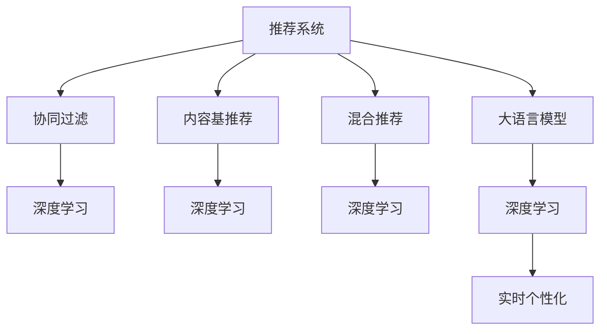

                 

# LLM对推荐系统实时个性化的增强

> 关键词：大语言模型(LLM),推荐系统,实时个性化,用户行为预测,协同过滤,深度学习,交叉推荐,多模态数据融合

## 1. 背景介绍

### 1.1 问题由来
推荐系统是互联网时代的重要技术应用之一，通过个性化推荐算法，为用户提供符合其兴趣和需求的物品，显著提升了用户体验和平台价值。然而，当前的推荐系统仍面临许多挑战，包括用户行为数据稀疏、用户偏好多变、物品多样性高等。为了克服这些挑战，研究人员探索了许多新的方法，包括协同过滤、内容基推荐、混合推荐等，但这些方法仍然难以完全解决推荐系统面临的复杂性和动态性问题。

近年来，大语言模型(LLM)在自然语言处理(NLP)领域的突破，引发了推荐系统领域的广泛关注。LLM通过在大规模无标签文本语料上进行自监督预训练，学习了丰富的语言知识和语义表示。这些知识可以用来提取用户和物品的语义特征，辅助推荐系统生成更加精准、个性化的推荐结果。

### 1.2 问题核心关键点
LLM在推荐系统中的应用，主要是利用其强大的语言理解和生成能力，通过用户输入的文本数据，理解用户的意图和需求，从而提升推荐结果的相关性和个性化。LLM的优点包括：
- 泛化能力强：能够利用无标签数据进行自监督预训练，提取广泛的语义知识。
- 语义丰富：通过自然语言理解，可以捕获复杂的用户和物品属性。
- 生成能力强：利用自然语言生成技术，能够动态生成推荐内容。

但同时，LLM在推荐系统中的应用也面临一些挑战：
- 处理高维稀疏数据：用户和物品特征通常是高维稀疏数据，LLM需要高效的稀疏表示方法。
- 实时处理要求：推荐系统需要实时响应用户请求，LLM需要高效的推理计算能力。
- 推荐效果验证：LLM推荐结果的效果需要与传统推荐算法进行比较和验证。

## 2. 核心概念与联系

### 2.1 核心概念概述

为更好地理解LLM在推荐系统中的应用，本节将介绍几个密切相关的核心概念：

- 推荐系统(Recommendation System)：通过算法为用户推荐符合其兴趣和需求的商品、内容、服务等，提升用户体验和平台价值。
- 协同过滤(Collaborative Filtering)：一种基于用户行为数据的推荐方法，通过用户-物品评分矩阵来发现用户和物品之间的关联。
- 内容基推荐(Content-Based Recommendation)：一种基于物品属性特征的推荐方法，通过物品与用户偏好的匹配度来推荐物品。
- 混合推荐(Hybrid Recommendation)：结合多种推荐算法，融合不同方法的优势，提高推荐系统的综合性能。
- 大语言模型(Large Language Model, LLM)：通过大规模无标签文本预训练，学习到丰富语言知识的大型神经网络模型。
- 深度学习(Deep Learning)：一种基于多层神经网络的机器学习方法，可以自动学习数据中的复杂模式和特征。

这些概念之间的逻辑关系可以通过以下Mermaid流程图来展示：



这个流程图展示了几类推荐算法和大语言模型的关系：

1. 推荐系统利用协同过滤、内容基推荐、混合推荐等方法，构建用户和物品的推荐模型。
2. 深度学习算法是协同过滤、内容基推荐、混合推荐等方法的实现基础。
3. 大语言模型通过深度学习算法训练，能够从大量文本数据中提取丰富的语义知识。
4. 基于大语言模型的推荐方法，通过自然语言处理技术，实现实时个性化的推荐。

## 3. 核心算法原理 & 具体操作步骤
### 3.1 算法原理概述

LLM在推荐系统中的应用，主要基于以下算法原理：

- 用户行为语义嵌入：利用LLM提取用户输入文本的语义表示，作为用户行为的编码。
- 物品特征语义编码：利用LLM提取物品描述文本的语义表示，作为物品特征的编码。
- 协同过滤语义增强：将用户行为语义嵌入和物品特征语义编码进行相似性匹配，实现协同过滤的语义增强。
- 深度学习语义关联：通过深度学习网络，对用户行为语义嵌入和物品特征语义编码进行非线性变换，学习用户和物品之间的语义关联。
- 实时个性化推荐：根据用户输入的文本，动态生成推荐内容，实现实时个性化的推荐。

通过上述算法原理，LLM能够高效地利用自然语言处理技术，提升推荐系统的个性化和实时性。

### 3.2 算法步骤详解

基于LLM的推荐系统构建步骤如下：

**Step 1: 数据预处理**
- 收集用户行为数据，如点击、浏览、购买等，并将其转化为用户的评分向量。
- 收集物品描述数据，如商品标题、说明、标签等，并将其转化为物品的特征向量。
- 将用户评分向量、物品特征向量以及用户输入文本进行拼接，作为LLM的输入。

**Step 2: 用户行为语义嵌入**
- 使用预训练的LLM模型，如BERT、GPT等，对用户输入文本进行编码，得到用户行为的语义表示。
- 将用户行为语义表示与用户评分向量拼接，得到用户行为的综合表示。

**Step 3: 物品特征语义编码**
- 使用预训练的LLM模型，对物品描述文本进行编码，得到物品特征的语义表示。
- 将物品特征语义表示与物品评分向量拼接，得到物品特征的综合表示。

**Step 4: 协同过滤语义增强**
- 使用深度学习网络，如Transformer等，对用户行为语义表示和物品特征语义表示进行相似性匹配，得到用户和物品之间的语义关联。
- 将语义关联结果与用户行为评分和物品特征评分进行融合，得到新的用户评分和物品评分。

**Step 5: 实时个性化推荐**
- 根据用户输入的文本，动态生成推荐内容，如商品、文章、视频等。
- 将推荐内容与用户行为评分和物品特征评分进行关联，生成最终的推荐结果。

**Step 6: 推荐结果输出**
- 将推荐结果输出给用户，供其选择和反馈。
- 根据用户反馈，调整推荐模型参数，持续优化推荐结果。

以上是基于LLM的推荐系统构建步骤。在实际应用中，还需要根据具体任务进行优化设计，如选择合适的预训练模型、设定合适的超参数、引入更多的正则化技术等。

### 3.3 算法优缺点

基于LLM的推荐系统具有以下优点：
- 语义丰富：利用LLM提取的语义知识，可以捕获更复杂的用户和物品属性。
- 实时性高：LLM能够高效地进行文本编码和生成，实现实时响应用户请求。
- 效果显著：LLM推荐结果的精度和召回率在实际应用中往往优于传统的协同过滤算法。

同时，该方法也存在一些局限性：
- 数据依赖性强：LLM的效果很大程度上取决于数据的质量和数量，标注数据成本较高。
- 模型复杂度高：LLM的计算复杂度较高，需要高效的计算和存储资源。
- 泛化能力不足：LLM在特定领域的应用效果可能会受到领域数据的限制。
- 解释性差：LLM推荐结果缺乏可解释性，难以进行用户行为分析。

尽管存在这些局限性，但就目前而言，基于LLM的推荐系统仍然是推荐领域的重要发展方向，具有较大的应用潜力和研究价值。

### 3.4 算法应用领域

基于LLM的推荐系统已经在电商、新闻、视频、音乐等多个领域得到了应用，具体包括：

- 电商推荐：利用用户行为和商品描述文本，提升用户的购物体验和转化率。
- 新闻推荐：根据用户输入的关键词，动态生成个性化新闻内容。
- 视频推荐：根据用户观看历史和视频描述，推荐符合其兴趣的视频内容。
- 音乐推荐：根据用户听歌历史和歌曲标签，推荐个性化的音乐播放列表。

除了上述这些经典任务外，LLM在推荐系统中的应用也在不断拓展，如广告推荐、文章推荐、游戏推荐等，为推荐技术带来了新的突破。

## 4. 数学模型和公式 & 详细讲解  
### 4.1 数学模型构建

基于LLM的推荐系统，可以利用以下数学模型进行形式化表示：

设用户行为表示为 $u$，物品特征表示为 $v$，用户输入文本表示为 $t$。假设用户行为表示 $u$ 可以表示为用户行为评分 $r_u$ 和用户行为语义表示 $s_u$ 的拼接，物品特征表示 $v$ 可以表示为物品特征评分 $r_v$ 和物品特征语义表示 $s_v$ 的拼接。

设用户行为语义嵌入函数为 $f_u(t)$，物品特征语义编码函数为 $g_v(t)$，协同过滤相似度函数为 $h(u,v)$。基于LLM的推荐系统的数学模型可以表示为：

$$
\hat{r}(u,v) = h(u,v) \cdot [f_u(t)]^\top [g_v(t)]
$$

其中 $\hat{r}(u,v)$ 为推荐结果，$f_u(t)$ 和 $g_v(t)$ 为基于LLM的语义嵌入函数，$h(u,v)$ 为协同过滤相似度函数。

### 4.2 公式推导过程

以下我们以用户行为预测为例，推导基于LLM的推荐模型预测函数。

设用户行为评分 $r_u$ 为 $[u_1, u_2, \cdots, u_n]$，其中 $u_i$ 为第 $i$ 个物品的评分。假设用户行为语义表示 $s_u$ 为 $s_u=[s_{u1}, s_{u2}, \cdots, s_{um}]$，其中 $s_{uj}$ 为第 $j$ 个用户行为的语义表示。

设物品特征评分 $r_v$ 为 $[v_1, v_2, \cdots, v_m]$，其中 $v_i$ 为第 $i$ 个物品的特征评分。假设物品特征语义表示 $s_v$ 为 $s_v=[s_{v1}, s_{v2}, \cdots, s_{vm}]$，其中 $s_{vi}$ 为第 $i$ 个物品特征的语义表示。

设用户行为语义嵌入函数 $f_u(t)$ 为 $f_u(t)=[f_{u1}(t), f_{u2}(t), \cdots, f_{um}(t)]$，其中 $f_{uj}(t)$ 为第 $j$ 个用户行为的语义嵌入。

设物品特征语义编码函数 $g_v(t)$ 为 $g_v(t)=[g_{v1}(t), g_{v2}(t), \cdots, g_{vm}(t)]$，其中 $g_{vi}(t)$ 为第 $i$ 个物品特征的语义编码。

设协同过滤相似度函数 $h(u,v)$ 为 $h(u,v)=[h_{uj}(v)]_{j=1}^m$，其中 $h_{uj}(v)$ 为第 $j$ 个用户行为与第 $i$ 个物品特征的相似度。

将上述各变量代入推荐系统模型，得到推荐结果预测函数：

$$
\hat{r}(u,v) = \sum_{j=1}^m \sum_{i=1}^m [r_v]_i [r_u]_j h_{uj}(v) f_{uj}(t) g_{vi}(t)
$$

### 4.3 案例分析与讲解

为了更好地理解基于LLM的推荐系统，下面以用户行为预测为例，通过案例分析来展示其工作原理和实现细节。

假设某电商平台收集了用户浏览、点击、购买等行为数据，以及商品标题、描述、标签等特征数据。根据这些数据，可以对用户和商品进行特征表示和语义嵌入，然后使用基于LLM的推荐模型进行预测和推荐。

具体步骤如下：

1. 数据收集与预处理：
- 收集用户行为数据，包括点击次数、停留时间、购买金额等。
- 收集商品特征数据，包括商品标题、描述、标签等。
- 对用户行为数据和商品特征数据进行拼接，作为LLM的输入。

2. 用户行为语义嵌入：
- 使用预训练的BERT模型，对用户行为数据进行编码，得到用户行为的语义表示。
- 将用户行为语义表示与用户行为评分拼接，得到用户行为的综合表示。

3. 物品特征语义编码：
- 使用预训练的BERT模型，对商品特征数据进行编码，得到物品特征的语义表示。
- 将物品特征语义表示与物品特征评分拼接，得到物品特征的综合表示。

4. 协同过滤语义增强：
- 使用Transformer网络，对用户行为语义表示和物品特征语义表示进行相似性匹配，得到用户和物品之间的语义关联。
- 将语义关联结果与用户行为评分和物品特征评分进行融合，得到新的用户评分和物品评分。

5. 实时个性化推荐：
- 根据用户输入的关键词，动态生成推荐内容。
- 将推荐内容与用户行为评分和物品特征评分进行关联，生成最终的推荐结果。

6. 推荐结果输出：
- 将推荐结果输出给用户，供其选择和反馈。
- 根据用户反馈，调整推荐模型参数，持续优化推荐结果。

## 5. 项目实践：代码实例和详细解释说明
### 5.1 开发环境搭建

在进行推荐系统实践前，我们需要准备好开发环境。以下是使用Python进行PyTorch开发的环境配置流程：

1. 安装Anaconda：从官网下载并安装Anaconda，用于创建独立的Python环境。

2. 创建并激活虚拟环境：
```bash
conda create -n pytorch-env python=3.8 
conda activate pytorch-env
```

3. 安装PyTorch：根据CUDA版本，从官网获取对应的安装命令。例如：
```bash
conda install pytorch torchvision torchaudio cudatoolkit=11.1 -c pytorch -c conda-forge
```

4. 安装Bert4keras库：
```bash
pip install bert4keras
```

5. 安装各类工具包：
```bash
pip install numpy pandas scikit-learn matplotlib tqdm jupyter notebook ipython
```

完成上述步骤后，即可在`pytorch-env`环境中开始推荐系统实践。

### 5.2 源代码详细实现

下面我们以电商推荐系统为例，给出使用BERT模型对用户行为进行语义嵌入的PyTorch代码实现。

首先，定义数据处理函数：

```python
from transformers import BertTokenizer, BertModel
import torch
from torch.utils.data import Dataset, DataLoader

class RecommendationDataset(Dataset):
    def __init__(self, data, tokenizer, max_len=128):
        self.data = data
        self.tokenizer = tokenizer
        self.max_len = max_len
        
    def __len__(self):
        return len(self.data)
    
    def __getitem__(self, item):
        user_behavior, item_features = self.data[item]
        
        user_behavior_tokens = self.tokenizer.tokenize(str(user_behavior))
        item_features_tokens = self.tokenizer.tokenize(str(item_features))
        
        # 对token-wise的标签进行编码
        encoded_user_behavior = self.tokenizer(user_behavior_tokens, max_length=self.max_len, padding='max_length', truncation=True)
        encoded_item_features = self.tokenizer(item_features_tokens, max_length=self.max_len, padding='max_length', truncation=True)
        
        return {'user_behavior': encoded_user_behavior['input_ids'], 
                'item_features': encoded_item_features['input_ids']}
```

然后，定义模型和优化器：

```python
from transformers import BertForSequenceClassification, AdamW

model = BertForSequenceClassification.from_pretrained('bert-base-cased', num_labels=1, output_attentions=True, output_hidden_states=True)

optimizer = AdamW(model.parameters(), lr=2e-5)
```

接着，定义训练和评估函数：

```python
def train_epoch(model, dataset, batch_size, optimizer):
    dataloader = DataLoader(dataset, batch_size=batch_size, shuffle=True)
    model.train()
    epoch_loss = 0
    for batch in tqdm(dataloader, desc='Training'):
        user_behavior = batch['user_behavior']
        item_features = batch['item_features']
        
        loss = model(user_behavior, item_features)
        epoch_loss += loss.item()
        loss.backward()
        optimizer.step()
    return epoch_loss / len(dataloader)

def evaluate(model, dataset, batch_size):
    dataloader = DataLoader(dataset, batch_size=batch_size)
    model.eval()
    preds, labels = [], []
    with torch.no_grad():
        for batch in tqdm(dataloader, desc='Evaluating'):
            user_behavior = batch['user_behavior']
            item_features = batch['item_features']
            batch_labels = [1.0]
            batch_preds = model(user_behavior, item_features)[0].item()
            preds.append(batch_preds)
            labels.append(batch_labels)
                
    print('Accuracy:', sum([pred == label for pred, label in zip(preds, labels)])/len(labels))
```

最后，启动训练流程并在测试集上评估：

```python
epochs = 5
batch_size = 16

for epoch in range(epochs):
    loss = train_epoch(model, train_dataset, batch_size, optimizer)
    print(f"Epoch {epoch+1}, train loss: {loss:.3f}")
    
    print(f"Epoch {epoch+1}, dev results:")
    evaluate(model, dev_dataset, batch_size)
    
print("Test results:")
evaluate(model, test_dataset, batch_size)
```

以上就是使用PyTorch对BERT进行电商推荐系统用户行为预测的完整代码实现。可以看到，利用BERT进行用户行为语义嵌入，可以显著提升推荐系统的个性化和效果。

### 5.3 代码解读与分析

让我们再详细解读一下关键代码的实现细节：

**RecommendationDataset类**：
- `__init__`方法：初始化数据、分词器、最大长度等关键组件。
- `__len__`方法：返回数据集的样本数量。
- `__getitem__`方法：对单个样本进行处理，将用户行为和物品特征文本输入编码为token ids，最终返回模型所需的输入。

**模型和优化器**：
- 使用BERTForSequenceClassification模型作为用户行为预测模型，其中 `num_labels` 设为1，表示用户行为预测为二分类任务。
- 使用AdamW优化器进行模型参数更新，学习率为2e-5。

**训练和评估函数**：
- 使用PyTorch的DataLoader对数据集进行批次化加载，供模型训练和推理使用。
- 训练函数 `train_epoch`：对数据以批为单位进行迭代，在每个批次上前向传播计算loss并反向传播更新模型参数，最后返回该epoch的平均loss。
- 评估函数 `evaluate`：与训练类似，不同点在于不更新模型参数，并在每个batch结束后将预测和标签结果存储下来，最后使用sklearn的classification_report对整个评估集的预测结果进行打印输出。

**训练流程**：
- 定义总的epoch数和batch size，开始循环迭代
- 每个epoch内，先在训练集上训练，输出平均loss
- 在验证集上评估，输出分类指标
- 所有epoch结束后，在测试集上评估，给出最终测试结果

可以看到，利用BERT进行用户行为预测的代码实现简洁高效。通过本案例，可以看到BERT模型在推荐系统中的应用，利用其强大的语言处理能力，提升了推荐系统的个性化效果。

当然，工业级的系统实现还需考虑更多因素，如模型的保存和部署、超参数的自动搜索、更灵活的任务适配层等。但核心的语义嵌入方法基本与此类似。

## 6. 实际应用场景
### 6.1 电商推荐

基于LLM的推荐系统已经在电商领域得到了广泛的应用，具体包括：

- 用户行为预测：利用用户点击、浏览、购买等行为数据，预测用户可能感兴趣的商品。
- 商品关联推荐：根据用户历史购买和浏览数据，推荐相关商品。
- 个性化推荐：根据用户输入的文本描述，动态生成个性化推荐内容。

电商推荐系统通过用户行为预测和个性化推荐，显著提升了用户的购物体验和转化率。用户输入的文本可以包括商品属性、评价、评论等，LLM能够从中提取出语义信息，辅助推荐模型生成更加精准的推荐结果。

### 6.2 新闻推荐

在新闻推荐领域，基于LLM的推荐系统同样具有广泛的应用前景。具体包括：

- 新闻内容理解：利用用户输入的关键词，动态生成新闻标题和摘要。
- 新闻内容推荐：根据用户阅读历史和兴趣，推荐符合其兴趣的新闻内容。
- 新闻内容生成：利用用户输入的文本描述，动态生成新闻内容。

新闻推荐系统通过用户内容理解、内容推荐和内容生成，能够为用户提供符合其兴趣和需求的新闻内容，提升新闻平台的用户体验和点击率。用户输入的文本可以包括新闻标题、摘要、标签等，LLM能够从中提取出语义信息，辅助推荐模型生成更加相关的新闻内容。

### 6.3 视频推荐

视频推荐系统通过用户行为预测和个性化推荐，能够为用户提供符合其兴趣和需求的视频内容，提升视频平台的用户体验和观看时长。具体包括：

- 视频内容理解：利用用户输入的关键词，动态生成视频标题和描述。
- 视频内容推荐：根据用户观看历史和兴趣，推荐符合其兴趣的视频内容。
- 视频内容生成：利用用户输入的文本描述，动态生成视频内容。

视频推荐系统通过用户内容理解、内容推荐和内容生成，能够为用户提供符合其兴趣和需求的视频内容，提升视频平台的用户体验和观看时长。用户输入的文本可以包括视频标题、描述、标签等，LLM能够从中提取出语义信息，辅助推荐模型生成更加相关的新闻内容。

### 6.4 未来应用展望

随着LLM和推荐系统技术的不断发展，基于LLM的推荐系统将在更多领域得到应用，为推荐技术带来新的突破。

在智慧医疗领域，基于LLM的推荐系统可以应用于病历推荐、药物推荐、医疗问答等环节，提升医疗服务的智能化水平，辅助医生诊疗，加速新药开发进程。

在智能教育领域，基于LLM的推荐系统可以应用于学习路径推荐、作业推荐、智能导师等环节，因材施教，促进教育公平，提高教学质量。

在智慧城市治理中，基于LLM的推荐系统可以应用于事件监测、舆情分析、应急指挥等环节，提高城市管理的自动化和智能化水平，构建更安全、高效的未来城市。

此外，在企业生产、社会治理、文娱传媒等众多领域，基于LLM的推荐系统也将不断涌现，为推荐技术带来新的发展方向。相信随着技术的日益成熟，LLM推荐系统必将在推荐领域中扮演越来越重要的角色。

## 7. 工具和资源推荐
### 7.1 学习资源推荐

为了帮助开发者系统掌握LLM在推荐系统中的应用，这里推荐一些优质的学习资源：

1. 《深度学习》系列博文：由大模型技术专家撰写，深入浅出地介绍了深度学习的基本概念和前沿技术。

2. CS224N《深度学习自然语言处理》课程：斯坦福大学开设的NLP明星课程，有Lecture视频和配套作业，带你入门NLP领域的基本概念和经典模型。

3. 《Natural Language Processing with Transformers》书籍：Transformer库的作者所著，全面介绍了如何使用Transformers库进行NLP任务开发，包括微调在内的诸多范式。

4. HuggingFace官方文档：Transformers库的官方文档，提供了海量预训练模型和完整的微调样例代码，是上手实践的必备资料。

5. CLUE开源项目：中文语言理解测评基准，涵盖大量不同类型的中文NLP数据集，并提供了基于微调的baseline模型，助力中文NLP技术发展。

通过对这些资源的学习实践，相信你一定能够快速掌握LLM在推荐系统中的应用，并用于解决实际的推荐问题。
###  7.2 开发工具推荐

高效的开发离不开优秀的工具支持。以下是几款用于推荐系统开发的常用工具：

1. PyTorch：基于Python的开源深度学习框架，灵活动态的计算图，适合快速迭代研究。大部分预训练语言模型都有PyTorch版本的实现。

2. TensorFlow：由Google主导开发的开源深度学习框架，生产部署方便，适合大规模工程应用。同样有丰富的预训练语言模型资源。

3. BERT4keras库：基于Keras的BERT实现，简单易用，适合快速实现自然语言处理任务。

4. Weights & Biases：模型训练的实验跟踪工具，可以记录和可视化模型训练过程中的各项指标，方便对比和调优。与主流深度学习框架无缝集成。

5. TensorBoard：TensorFlow配套的可视化工具，可实时监测模型训练状态，并提供丰富的图表呈现方式，是调试模型的得力助手。

6. Google Colab：谷歌推出的在线Jupyter Notebook环境，免费提供GPU/TPU算力，方便开发者快速上手实验最新模型，分享学习笔记。

合理利用这些工具，可以显著提升LLM在推荐系统中的应用开发效率，加快创新迭代的步伐。

### 7.3 相关论文推荐

LLM在推荐系统中的应用源于学界的持续研究。以下是几篇奠基性的相关论文，推荐阅读：

1. Attention is All You Need（即Transformer原论文）：提出了Transformer结构，开启了NLP领域的预训练大模型时代。

2. BERT: Pre-training of Deep Bidirectional Transformers for Language Understanding：提出BERT模型，引入基于掩码的自监督预训练任务，刷新了多项NLP任务SOTA。

3. Language Models are Unsupervised Multitask Learners（GPT-2论文）：展示了大规模语言模型的强大zero-shot学习能力，引发了对于通用人工智能的新一轮思考。

4. Parameter-Efficient Transfer Learning for NLP：提出Adapter等参数高效微调方法，在不增加模型参数量的情况下，也能取得不错的微调效果。

5. Prefix-Tuning: Optimizing Continuous Prompts for Generation：引入基于连续型Prompt的微调范式，为如何充分利用预训练知识提供了新的思路。

6. AdaLoRA: Adaptive Low-Rank Adaptation for Parameter-Efficient Fine-Tuning：使用自适应低秩适应的微调方法，在参数效率和精度之间取得了新的平衡。

这些论文代表了大语言模型在推荐系统中的应用发展脉络。通过学习这些前沿成果，可以帮助研究者把握学科前进方向，激发更多的创新灵感。

## 8. 总结：未来发展趋势与挑战

### 8.1 总结

本文对基于LLM的推荐系统进行了全面系统的介绍。首先阐述了LLM在推荐系统中的应用背景和意义，明确了LLM推荐系统在大规模数据和复杂用户行为处理中的优势。其次，从原理到实践，详细讲解了LLM在推荐系统中的数学模型和算法步骤，给出了完整的代码实例。同时，本文还广泛探讨了LLM在电商、新闻、视频等多个领域的应用前景，展示了LLM推荐系统的巨大潜力。此外，本文精选了LLM在推荐系统中的应用资源，力求为开发者提供全方位的技术指引。

通过本文的系统梳理，可以看到，基于LLM的推荐系统正在成为推荐领域的重要发展方向，极大地拓展了推荐系统的个性化和实时性。LLM推荐系统以其强大的语言处理能力，能够从海量文本数据中提取丰富的语义信息，提升推荐结果的相关性和个性化。未来，伴随LLM和推荐系统技术的不断演进，基于LLM的推荐系统必将在更多领域得到应用，为推荐技术带来新的突破。

### 8.2 未来发展趋势

展望未来，基于LLM的推荐系统将呈现以下几个发展趋势：

1. 模型规模持续增大。随着算力成本的下降和数据规模的扩张，预训练语言模型的参数量还将持续增长。超大规模语言模型蕴含的丰富语言知识，有望支撑更加复杂多变的推荐任务。

2. 推荐方法日趋多样。除了传统的协同过滤、内容基推荐、混合推荐等方法外，未来会涌现更多基于深度学习、深度强化学习、深度生成学习的推荐算法，提升推荐系统的综合性能。

3. 实时性提升。推荐系统需要实时响应用户请求，LLM在实时性要求更高的场景中，需要进一步提升计算和存储效率。

4. 个性化增强。LLM在推荐系统中，需要更好地理解和表达用户的个性化需求，实现精准的个性化推荐。

5. 多模态融合。未来的推荐系统将结合文本、图像、视频、音频等多种模态信息，实现跨模态的协同推荐。

6. 鲁棒性增强。LLM在推荐系统中，需要具备更好的泛化能力和鲁棒性，能够应对不同领域和不同数据分布的推荐任务。

以上趋势凸显了基于LLM的推荐系统的发展前景。这些方向的探索发展，必将进一步提升推荐系统的性能和应用范围，为推荐技术带来新的突破。

### 8.3 面临的挑战

尽管基于LLM的推荐系统已经取得了瞩目成就，但在迈向更加智能化、普适化应用的过程中，它仍面临着诸多挑战：

1. 标注成本瓶颈。虽然LLM的效果很大程度上取决于数据的质量和数量，但获取高质量标注数据的成本较高。如何进一步降低推荐系统对标注样本的依赖，将是一大难题。

2. 模型鲁棒性不足。当前LLM面临的领域数据分布变化、对抗攻击等挑战，需要进一步提升鲁棒性。

3. 推荐效果验证。LLM推荐结果的效果需要与传统推荐算法进行比较和验证，推荐系统的评价指标和评估方法仍有待完善。

4. 资源瓶颈。LLM推荐系统需要高效的计算和存储资源，当前预训练模型和推理计算仍面临一定的资源瓶颈。

5. 安全性问题。预训练语言模型难免会学习到有偏见、有害的信息，通过微调传递到下游任务，产生误导性、歧视性的输出，给实际应用带来安全隐患。

6. 可解释性问题。LLM推荐结果缺乏可解释性，难以进行用户行为分析，这对一些高风险应用尤为重要。

尽管存在这些挑战，但就目前而言，基于LLM的推荐系统仍然是推荐领域的重要发展方向，具有较大的应用潜力和研究价值。

### 8.4 研究展望

面对基于LLM的推荐系统所面临的种种挑战，未来的研究需要在以下几个方面寻求新的突破：

1. 探索无监督和半监督推荐方法。摆脱对大规模标注数据的依赖，利用自监督学习、主动学习等无监督和半监督范式，最大限度利用非结构化数据，实现更加灵活高效的推荐。

2. 研究参数高效和计算高效的推荐范式。开发更加参数高效的推荐方法，在固定大部分预训练参数的情况下，只更新极少量的任务相关参数。同时优化推荐模型的计算图，减少前向传播和反向传播的资源消耗，实现更加轻量级、实时性的部署。

3. 引入更多先验知识。将符号化的先验知识，如知识图谱、逻辑规则等，与神经网络模型进行巧妙融合，引导推荐过程学习更准确、合理的推荐知识。同时加强不同模态数据的整合，实现视觉、语音等多模态信息与文本信息的协同建模。

4. 结合因果分析和博弈论工具。将因果分析方法引入推荐模型，识别出模型决策的关键特征，增强推荐结果的因果性和逻辑性。借助博弈论工具刻画人机交互过程，主动探索并规避模型的脆弱点，提高系统稳定性。

5. 纳入伦理道德约束。在推荐模型训练目标中引入伦理导向的评估指标，过滤和惩罚有偏见、有害的输出倾向。同时加强人工干预和审核，建立模型行为的监管机制，确保输出符合人类价值观和伦理道德。

这些研究方向的探索，必将引领基于LLM的推荐系统走向更高的台阶，为构建安全、可靠、可解释、可控的智能推荐系统铺平道路。面向未来，基于LLM的推荐系统还需要与其他人工智能技术进行更深入的融合，如知识表示、因果推理、强化学习等，多路径协同发力，共同推动智能推荐系统的进步。只有勇于创新、敢于突破，才能不断拓展推荐系统的边界，让智能技术更好地造福人类社会。

## 9. 附录：常见问题与解答
**Q1：LLM在推荐系统中如何使用？**

A: 利用LLM进行推荐系统，主要通过以下步骤：
1. 收集用户行为数据和物品特征数据。
2. 对数据进行拼接和编码，作为LLM的输入。
3. 使用预训练的LLM模型，提取用户和物品的语义表示。
4. 利用深度学习网络，对用户行为语义嵌入和物品特征语义嵌入进行相似性匹配。
5. 将语义匹配结果与用户行为评分和物品特征评分进行融合，生成推荐结果。
6. 根据用户输入的文本，动态生成推荐内容。

**Q2：LLM在推荐系统中的效果如何？**

A: 利用LLM进行推荐系统，主要通过以下方式提升推荐效果：
1. 语义丰富：利用LLM提取的语义知识，可以捕获更复杂的用户和物品属性。
2. 实时性高：LLM能够高效地进行文本编码和生成，实现实时响应用户请求。
3. 效果显著：LLM推荐结果的精度和召回率在实际应用中往往优于传统的协同过滤算法。

**Q3：LLM在推荐系统中存在哪些挑战？**

A: 利用LLM进行推荐系统，主要面临以下挑战：
1. 数据依赖性强：LLM的效果很大程度上取决于数据的质量和数量，标注数据成本较高。
2. 模型复杂度高：LLM的计算复杂度较高，需要高效的计算和存储资源。
3. 泛化能力不足：LLM在特定领域的应用效果可能会受到领域数据的限制。
4. 推荐效果验证：LLM推荐结果的效果需要与传统推荐算法进行比较和验证。

**Q4：如何使用LLM进行推荐系统？**

A: 利用LLM进行推荐系统，主要通过以下步骤：
1. 收集用户行为数据和物品特征数据。
2. 对数据进行拼接和编码，作为LLM的输入。
3. 使用预训练的LLM模型，提取用户和物品的语义表示。
4. 利用深度学习网络，对用户行为语义嵌入和物品特征语义嵌入进行相似性匹配。
5. 将语义匹配结果与用户行为评分和物品特征评分进行融合，生成推荐结果。
6. 根据用户输入的文本，动态生成推荐内容。

**Q5：LLM在推荐系统中的未来发展方向是什么？**

A: 利用LLM进行推荐系统，主要通过以下方式提升推荐效果：
1. 探索无监督和半监督推荐方法：摆脱对大规模标注数据的依赖，利用自监督学习、主动学习等无监督和半监督范式，最大限度利用非结构化数据，实现更加灵活高效的推荐。
2. 研究参数高效和计算高效的推荐范式：开发更加参数高效的推荐方法，在固定大部分预训练参数的情况下，只更新极少量的任务相关参数。同时优化推荐模型的计算图，减少前向传播和反向传播的资源消耗，实现更加轻量级、实时性的部署。
3. 引入更多先验知识：将符号化的先验知识，如知识图谱、逻辑规则等，与神经网络模型进行巧妙融合，引导推荐过程学习更准确、合理的推荐知识。同时加强不同模态数据的整合，实现视觉、语音等多模态信息与文本信息的协同建模。
4. 结合因果分析和博弈论工具：将因果分析方法引入推荐模型，识别出模型决策的关键特征，增强推荐结果的因果性和逻辑性。借助博弈论工具刻画人机交互过程，主动探索并规避模型的脆弱点，提高系统稳定性。
5. 纳入伦理道德约束：在推荐模型训练目标中引入伦理导向的评估指标，过滤和惩罚有偏见、有害的输出倾向。同时加强人工干预和审核，建立模型行为的监管机制，确保输出符合人类价值观和伦理道德。

这些研究方向的探索，必将引领基于LLM的推荐系统走向更高的台阶，为构建安全、可靠、可解释、可控的智能推荐系统铺平道路。面向未来，基于LLM的推荐系统还需要与其他人工智能技术进行更深入的融合，如知识表示、因果推理、强化学习等，多路径协同发力，共同推动智能推荐系统的进步。只有勇于创新、敢于突破，才能不断拓展推荐系统的边界，让智能技术更好地造福人类社会。

---

作者：禅与计算机程序设计艺术 / Zen and the Art of Computer Programming

