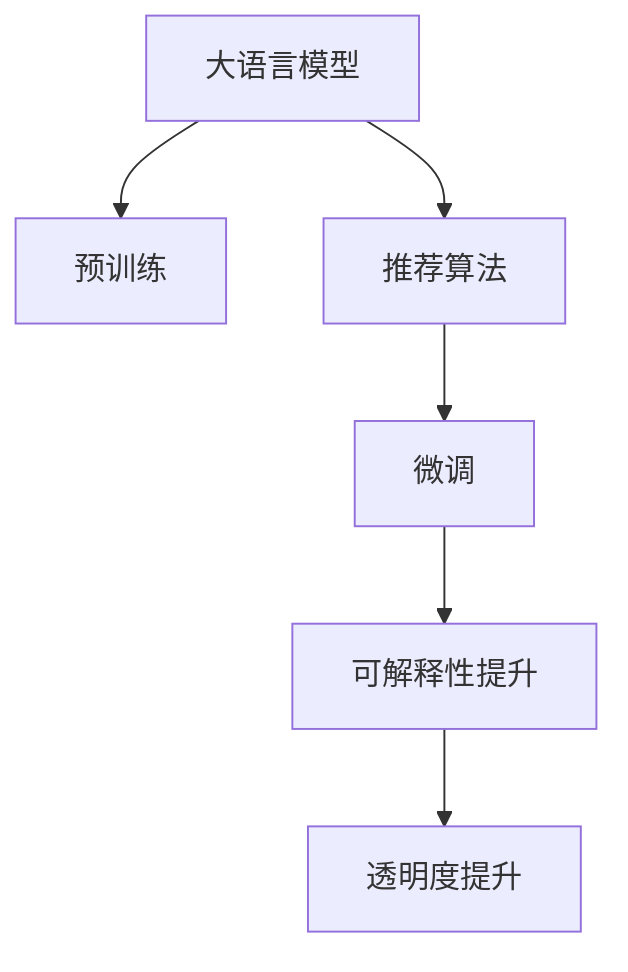

                 

## 1. 背景介绍

随着推荐系统的不断演进，用户获取信息的精准性和及时性得到了极大的提升，极大改善了用户体验。但随之而来的是，推荐系统变得越来越"黑盒化"，越来越难以理解其决策逻辑，引发了用户对其推荐结果的信任危机，也引起了学术界和工业界对推荐系统透明性和可解释性的关注。

### 1.1 问题由来

推荐系统最初是简单的基于协同过滤，主要依赖用户行为数据进行推荐。随着深度学习和大规模预训练模型的兴起，推荐系统逐渐过渡到基于模型的深度学习范式，特别是利用大语言模型（Large Language Models, LLMs）进行推荐。

使用预训练语言模型进行推荐时，一般将预训练语言模型作为特征提取器，通过输入用户历史行为数据，输出嵌入向量，再结合用户画像和商品标签，进行深度学习训练，得到用户对商品序列的评分，最后生成推荐结果。

虽然该方法在效果上取得了显著提升，但存在以下缺点：
- **不可解释性**：模型训练过程复杂，黑盒化，用户难以理解其推荐逻辑。
- **高模型复杂度**：大模型参数量巨大，推理速度较慢，难以实时部署。
- **泛化性能不足**：在域外数据上的泛化性能差，新用户和冷启动商品推荐效果不佳。

### 1.2 问题核心关键点

推荐系统透明性和可解释性问题主要体现在两个方面：

1. **推荐过程透明性不足**：推荐系统内部决策过程复杂，用户难以理解推荐逻辑。
2. **推荐结果可解释性差**：用户无法理解推荐系统推荐的理由，信任感降低。

要解决这些问题，除了需要优化推荐算法外，还可以引入大语言模型，进行可解释性和透明度提升。

## 2. 核心概念与联系

### 2.1 核心概念概述

为了更好地理解利用大语言模型提升推荐系统的透明性和可解释性，我们需要了解以下几个关键概念：

- **大语言模型（LLMs）**：如GPT、BERT等，经过大规模无标签文本预训练，具备强大的语言理解能力。
- **推荐系统**：根据用户历史行为，推荐相关商品或内容的系统。
- **透明度**：推荐系统的决策过程是否易于理解和验证。
- **可解释性**：推荐系统生成的推荐结果是否易于解释和理解。
- **推荐算法**：如协同过滤、基于内容的推荐、混合推荐等。
- **预训练与微调**：通过在大规模语料上进行预训练，然后在推荐数据集上进行微调。

这些概念之间的逻辑关系可以通过以下Mermaid流程图来展示：



## 3. 核心算法原理 & 具体操作步骤

### 3.1 算法原理概述

基于大语言模型（LLMs）的推荐系统透明度和可解释性提升，主要通过两个步骤完成：
1. **预训练**：在大规模无标签文本数据上进行预训练，学习语言知识和表达能力。
2. **微调**：在推荐数据集上进行微调，学习特定任务的具体知识。

预训练后的LLMs可以作为特征提取器，对用户行为数据进行编码，输出嵌入向量。然后结合微调后的推荐算法，生成推荐结果。该过程不仅提升了推荐系统的性能，还增加了推荐结果的可解释性和透明度。

### 3.2 算法步骤详解

#### 3.2.1 数据准备

- **用户行为数据**：收集用户浏览、点击、购买等行为数据。
- **商品数据**：收集商品名称、描述、标签等数据。
- **预训练语料**：选择大规模无标签文本语料进行预训练。

#### 3.2.2 预训练

- **模型选择**：选择合适的大语言模型，如GPT-3、BERT等。
- **预训练任务**：选择适合的预训练任务，如语言建模、掩码语言模型等。
- **预训练数据**：在预训练语料上进行训练，通常使用自监督学习任务。
- **保存预训练模型**：保存预训练模型，方便后续微调使用。

#### 3.2.3 微调

- **微调任务**：选择微调任务，如推荐评分预测、用户画像生成等。
- **模型初始化**：使用预训练模型初始化微调模型。
- **训练数据**：收集微调所需的数据集。
- **微调优化器**：选择合适的优化器，如Adam、SGD等。
- **微调训练**：在微调数据集上训练，更新模型参数。
- **保存微调模型**：保存微调模型，方便部署和使用。

#### 3.2.4 推理与解释

- **用户输入数据**：输入用户历史行为数据。
- **预处理**：对输入数据进行预处理，生成特征向量。
- **嵌入编码**：使用预训练模型对特征向量进行嵌入编码。
- **模型推理**：使用微调模型进行推荐推理。
- **输出解释**：根据推理过程和结果，生成可解释性文本。

### 3.3 算法优缺点

#### 3.3.1 优点

- **性能提升**：预训练和微调过程可显著提升推荐系统的效果。
- **可解释性增强**：LLMs可以生成解释性文本，帮助用户理解推荐理由。
- **透明度增加**：预训练和微调过程增加了推荐系统的透明度，便于理解推荐逻辑。

#### 3.3.2 缺点

- **计算成本高**：预训练和微调需要大量计算资源。
- **数据依赖强**：依赖大规模高质量数据，难以处理小样本数据。
- **模型复杂**：大模型复杂度较高，推理速度较慢。

### 3.4 算法应用领域

基于大语言模型的推荐系统已经在诸多领域得到了广泛应用，包括但不限于：

- **电商推荐**：根据用户历史行为，推荐商品。
- **内容推荐**：根据用户阅读历史，推荐文章、视频等。
- **音乐推荐**：根据用户听歌历史，推荐歌曲和歌手。
- **新闻推荐**：根据用户阅读历史，推荐新闻资讯。

## 4. 数学模型和公式 & 详细讲解 & 举例说明

### 4.1 数学模型构建

假设用户行为数据为 $(x_i,y_i)$，其中 $x_i$ 为输入特征向量，$y_i$ 为推荐评分或标签。

预训练模型 $M_{\theta}$ 可以将输入特征向量 $x_i$ 编码成嵌入向量 $z_i$，其中 $z_i = M_{\theta}(x_i)$。

微调任务 $T$ 可以使用任意推荐算法，如线性回归、梯度提升树等。

模型训练的目标是最小化损失函数：

$$
\mathcal{L}(\theta) = \frac{1}{N} \sum_{i=1}^N \ell(y_i, M_{\theta}(x_i))
$$

其中 $\ell$ 为损失函数，通常为均方误差或交叉熵。

### 4.2 公式推导过程

以线性回归模型为例，推导预训练和微调的数学公式：

预训练阶段：

$$
z_i = M_{\theta}(x_i)
$$

微调阶段：

$$
y_i = \beta_0 + \beta_1 z_i + \epsilon_i
$$

其中 $\epsilon_i$ 为误差项，$\beta_0,\beta_1$ 为微调模型参数。

综合考虑预训练和微调的过程，推荐系统的预测公式为：

$$
\hat{y}_i = \beta_0 + \beta_1 M_{\theta}(x_i) + \epsilon_i
$$

### 4.3 案例分析与讲解

#### 4.3.1 电商推荐系统

在电商推荐系统中，使用预训练语言模型对用户历史行为数据进行编码，得到嵌入向量 $z_i$。

微调模型可以选择线性回归模型，将用户行为数据和嵌入向量作为输入，预测用户对商品的评分：

$$
\hat{y} = \beta_0 + \beta_1 z + \epsilon
$$

其中 $z$ 为用户行为数据的嵌入向量，$\beta_0,\beta_1$ 为微调模型参数，$\epsilon$ 为误差项。

微调后，可以使用推荐算法将商品评分排序，生成推荐结果。

#### 4.3.2 内容推荐系统

内容推荐系统中，使用预训练语言模型对用户阅读历史数据进行编码，得到嵌入向量 $z_i$。

微调模型可以选择梯度提升树模型，对用户阅读历史和嵌入向量进行建模，生成推荐内容：

$$
y_i = \beta_0 + \sum_{j=1}^k \beta_j g_j(z_i)
$$

其中 $g_j(z)$ 为第 $j$ 棵树的评分预测函数，$\beta_j$ 为树模型参数。

微调后，可以使用推荐算法将内容评分排序，生成推荐结果。

## 5. 项目实践：代码实例和详细解释说明

### 5.1 开发环境搭建

#### 5.1.1 选择语言和框架

- **语言选择**：Python，因其丰富的第三方库和社区支持。
- **框架选择**：使用TensorFlow或PyTorch，支持深度学习模型的训练和推理。

#### 5.1.2 环境配置

- **安装依赖**：使用pip安装TensorFlow、Keras、numpy等依赖。
- **搭建虚拟环境**：使用Anaconda创建虚拟环境，确保开发环境独立。

#### 5.1.3 模型选择

- **预训练模型**：选择合适的大语言模型，如BERT、GPT-2等。
- **微调模型**：选择微调所需的模型，如线性回归、梯度提升树等。

### 5.2 源代码详细实现

#### 5.2.1 数据预处理

```python
from tensorflow.keras.preprocessing.text import Tokenizer
from tensorflow.keras.preprocessing.sequence import pad_sequences

# 用户行为数据
user_bean_data = ['...']
# 商品描述数据
item_desc_data = ['...']

# 构建词汇表
tokenizer = Tokenizer(num_words=5000)
tokenizer.fit_on_texts(user_bean_data + item_desc_data)
word_index = tokenizer.word_index

# 将文本编码成序列
sequences = tokenizer.texts_to_sequences(user_bean_data + item_desc_data)
max_len = 200
padded_sequences = pad_sequences(sequences, maxlen=max_len)

# 商品标签
item_labels = [0, 1, 2, 3, 4]

# 分割训练集和验证集
train_sequences = padded_sequences[:train_size]
train_labels = item_labels[:train_size]
valid_sequences = padded_sequences[train_size:]
valid_labels = item_labels[train_size:]
```

#### 5.2.2 预训练模型加载

```python
from transformers import TFBertForSequenceClassification

# 加载预训练BERT模型
model = TFBertForSequenceClassification.from_pretrained('bert-base-uncased')
```

#### 5.2.3 微调模型训练

```python
from tensorflow.keras.optimizers import Adam

# 微调模型参数
model.compile(optimizer=Adam(learning_rate=0.001), loss='categorical_crossentropy', metrics=['accuracy'])

# 训练模型
model.fit(train_sequences, train_labels, epochs=5, validation_data=(valid_sequences, valid_labels))
```

#### 5.2.4 推理与解释

```python
from transformers import TFBertTokenizer

# 加载预训练BERT模型
tokenizer = TFBertTokenizer.from_pretrained('bert-base-uncased')
```

#### 5.2.5 代码解读与分析

##### 5.2.5.1 用户行为数据预处理

用户行为数据包括浏览历史、点击行为等。通过使用Tokenize器将文本编码成序列，并进行填充和截断，保证输入序列长度一致。

##### 5.2.5.2 预训练模型加载

使用预训练模型BERT，将其加载到TensorFlow模型中，并进行初始化。

##### 5.2.5.3 微调模型训练

使用Adam优化器进行微调，最小化交叉熵损失函数。在训练过程中，使用验证集评估模型性能，确保模型不过拟合。

##### 5.2.5.4 推理与解释

使用加载的预训练BERT模型进行推理，得到用户行为数据的嵌入向量。将嵌入向量输入微调后的推荐模型，生成推荐结果。

##### 5.2.5.5 运行结果展示

模型训练和推理的结果可以展示为准确率、召回率、F1-score等指标，以及推荐内容的评分和排名。

## 6. 实际应用场景

### 6.1 电商推荐系统

在电商推荐系统中，用户可以通过搜索、浏览、点击等行为生成历史行为数据。使用预训练语言模型对用户行为数据进行编码，得到嵌入向量。微调线性回归模型，对用户行为数据和嵌入向量进行建模，生成推荐评分。

#### 6.1.1 具体案例

- **搜索推荐**：用户在搜索框输入关键词，系统返回与关键词相关的商品推荐列表。
- **浏览推荐**：用户在浏览商品页面时，系统根据用户浏览历史生成推荐商品列表。
- **点击推荐**：用户点击商品后，系统根据点击行为生成更多相关商品推荐。

#### 6.1.2 优势

- **个性化推荐**：通过预训练和微调，生成个性化推荐内容。
- **透明度和可解释性**：预训练和微调过程增加了推荐系统的透明度，用户可以理解推荐逻辑。

### 6.2 内容推荐系统

内容推荐系统推荐文章、视频等媒体内容。用户可以阅读、观看、点赞、评论等行为生成历史行为数据。使用预训练语言模型对用户历史行为数据进行编码，得到嵌入向量。微调梯度提升树模型，对用户行为数据和嵌入向量进行建模，生成推荐内容。

#### 6.2.1 具体案例

- **阅读推荐**：用户在阅读文章时，系统根据阅读历史生成推荐文章列表。
- **观看推荐**：用户在观看视频时，系统根据观看历史生成推荐视频列表。
- **点赞推荐**：用户对内容进行点赞后，系统根据点赞行为生成更多相关内容推荐。

#### 6.2.2 优势

- **个性化推荐**：通过预训练和微调，生成个性化推荐内容。
- **透明度和可解释性**：预训练和微调过程增加了推荐系统的透明度，用户可以理解推荐逻辑。

## 7. 工具和资源推荐

### 7.1 学习资源推荐

#### 7.1.1 TensorFlow官方文档

TensorFlow提供了详细的官方文档，涵盖深度学习模型的搭建、训练、推理等各个环节。推荐阅读《TensorFlow 2.0官方教程》。

#### 7.1.2 Keras官方文档

Keras是基于TensorFlow的高级深度学习框架，提供了更简便的API接口。推荐阅读《Keras官方文档》。

#### 7.1.3 自然语言处理书籍

- 《深度学习与自然语言处理》
- 《自然语言处理综论》

#### 7.1.4 学术研究论文

- 《BigQuery-Mimic: A Multi-Language Large-Scale Pre-Training Dataset》
- 《BERT: Pre-training of Deep Bidirectional Transformers for Language Understanding》

### 7.2 开发工具推荐

#### 7.2.1 TensorFlow

- 功能丰富：支持深度学习模型的训练和推理。
- 社区活跃：拥有庞大的用户社区，便于学习和交流。

#### 7.2.2 PyTorch

- 简单易用：提供了简单易用的API接口，易于上手。
- 动态图机制：支持动态图和静态图两种计算图机制，灵活性高。

#### 7.2.3 Weights & Biases

- 实时监控：实时监控模型训练过程，便于调试和优化。
- 可视化工具：提供丰富的图表可视化工具，便于理解和分析。

#### 7.2.4 Google Colab

- 免费使用：免费提供GPU/TPU算力，便于实验和开发。
- 社区资源：提供丰富的社区资源，便于学习和分享。

### 7.3 相关论文推荐

#### 7.3.1 预训练语言模型

- 《Attention is All You Need》
- 《BERT: Pre-training of Deep Bidirectional Transformers for Language Understanding》

#### 7.3.2 推荐系统

- 《A Survey of Recommender Systems》
- 《The Matrix Factorization Approach to Recommender Systems》

## 8. 总结：未来发展趋势与挑战

### 8.1 研究成果总结

利用大语言模型提升推荐系统的透明度和可解释性，取得了显著效果。预训练和微调过程不仅提升了推荐系统的性能，还增加了推荐系统的透明度和可解释性，使用户能够更好地理解推荐逻辑。

### 8.2 未来发展趋势

- **模型复杂度降低**：未来的预训练模型将更加轻量级，推理速度更快。
- **多模态融合**：未来的推荐系统将融合视觉、语音、文本等多模态信息，提高推荐效果。
- **公平性和鲁棒性**：未来的推荐系统将更加注重公平性和鲁棒性，避免偏见和歧视。
- **实时推荐**：未来的推荐系统将更加实时，能够快速响应用户需求。

### 8.3 面临的挑战

- **数据隐私**：用户行为数据涉及隐私，如何保护用户隐私是重要挑战。
- **计算资源**：预训练和微调过程需要大量计算资源，如何优化计算过程是重要挑战。
- **模型泛化**：预训练和微调模型在域外数据上的泛化性能差，如何提高模型泛化性是重要挑战。
- **可解释性**：推荐系统的可解释性不足，如何生成可解释性文本是重要挑战。

### 8.4 研究展望

未来研究将聚焦于以下几个方面：

- **无监督学习**：探索无监督学习范式，降低对标注数据的依赖。
- **对抗训练**：引入对抗训练技术，提高模型鲁棒性和泛化性能。
- **知识图谱**：融合知识图谱信息，提高推荐效果和可解释性。
- **公平性和透明性**：引入公平性约束，增强推荐系统的公平性和透明性。

## 9. 附录：常见问题与解答

### 9.1 常见问题

#### 9.1.1 如何评估推荐系统的透明度和可解释性？

A: 可以通过用户调查、系统日志等方式评估推荐系统的透明度和可解释性。

#### 9.1.2 如何处理冷启动用户和商品？

A: 可以使用推荐系统基础算法（如协同过滤）对冷启动用户和商品进行推荐。

#### 9.1.3 如何优化计算资源消耗？

A: 可以使用分布式训练、模型压缩等技术优化计算资源消耗。

#### 9.1.4 如何避免用户隐私问题？

A: 可以使用差分隐私、联邦学习等技术保护用户隐私。

#### 9.1.5 如何提高推荐系统的公平性和透明性？

A: 可以通过引入公平性约束、生成可解释性文本等方式提高推荐系统的公平性和透明性。

### 9.2 解答

本文介绍了利用大语言模型提升推荐系统的透明度和可解释性的方法和实践。通过预训练和微调过程，不仅提升了推荐系统的性能，还增加了推荐系统的透明度和可解释性，使用户能够更好地理解推荐逻辑。未来研究将聚焦于无监督学习、对抗训练、知识图谱融合等方面，进一步优化推荐系统的效果和性能。

## 结语

大语言模型在推荐系统的透明度和可解释性提升方面具有广阔的应用前景。通过预训练和微调过程，不仅提升了推荐系统的性能，还增加了推荐系统的透明度和可解释性，使用户能够更好地理解推荐逻辑。未来研究将继续探索如何通过无监督学习、对抗训练、知识图谱融合等技术，进一步优化推荐系统的效果和性能，为构建更加透明、公平、可解释的推荐系统提供有力支持。

---

作者：禅与计算机程序设计艺术 / Zen and the Art of Computer Programming

