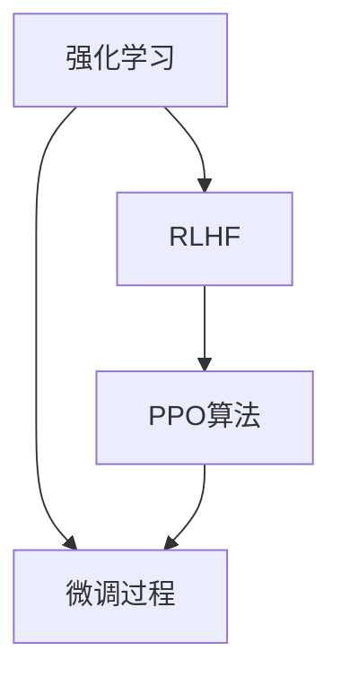

                 

# LLM微调技术II：强化学习、RLHF和PPO算法

大语言模型（LLMs）在自然语言处理（NLP）和人工智能（AI）领域的应用中扮演着越来越重要的角色。LLMs通过大规模预训练获得广泛的语言知识，并能够在下游任务中通过微调进一步提升性能。在之前的《大语言模型原理与应用实践：基于监督学习进行微调 Supervised Learning & Fine-Tuning》一文中，我们详细介绍了基于监督学习的微调方法。今天，我们将继续深入探讨强化学习（RL）、人类偏好反馈（RLHF）和策略梯度（PPO）算法在大语言模型微调中的应用。

## 1. 背景介绍

### 1.1 问题由来

在《大语言模型原理与应用实践：基于监督学习进行微调 Supervised Learning & Fine-Tuning》一文中，我们提到了监督学习（Supervised Learning）在LLM微调中的成功应用。然而，监督学习依赖于大量标注数据，且模型泛化能力有限。为了进一步提升LLM的智能水平，研究人员开始探索强化学习（Reinforcement Learning, RL）和人类偏好反馈（Human Preferences Feedback, RLHF）等方法。

### 1.2 问题核心关键点

强化学习是一种通过与环境互动来训练智能体的学习方法。在LLM微调中，智能体（模型）通过执行特定任务并接收奖励或惩罚信号，不断优化其行为策略，从而达到更高效、更智能的输出。

RLHF则是在强化学习的基础上，引入了人类的偏好反馈，使模型输出的行为更符合人类的期望。这意味着模型不仅需要学习任务相关的知识，还需要学习如何更好地与人类交互。

策略梯度（Policy Gradient）是强化学习中一种常用的优化算法，它直接优化策略函数的梯度，以获得更好的决策能力。PPO（Proximal Policy Optimization）算法是策略梯度算法的一种改进版本，它在避免梯度消失的同时，提高了训练效率。

这些方法通过与环境的动态互动和优化，使模型能够更灵活、更智能地适应不同的任务和应用场景，从而进一步拓展LLM的边界。

## 2. 核心概念与联系

### 2.1 核心概念概述

为了更好地理解强化学习、RLHF和PPO算法在LLM微调中的应用，我们首先介绍几个关键概念：

- 强化学习：一种通过智能体与环境互动来学习最优策略的机器学习方法。智能体通过执行动作并接收奖励信号，不断调整其行为策略，以最大化长期奖励。
- RLHF：结合了强化学习和人类偏好反馈，使模型输出的行为更符合人类的期望。通过引导模型向人类期望的行为靠拢，实现更加人性化、智能化的输出。
- PPO算法：一种策略梯度算法，通过引入近似的策略梯度和熵正则化，提高了训练效率和稳定性。

这些概念之间的逻辑关系可以通过以下Mermaid流程图来展示：



这个流程图展示了强化学习、RLHF和PPO算法在LLM微调中的作用：

1. 强化学习通过与环境的互动学习最优策略，为微调过程提供智能行为的范例。
2. RLHF结合了人类的偏好反馈，使模型输出的行为更符合人类期望。
3. PPO算法通过优化策略梯度，提高微调过程的训练效率和稳定性。
4. 微调过程则通过学习与优化，使模型在特定任务上表现更优。

这些概念共同构成了LLM微调中的强化学习框架，使得模型能够更加灵活、智能地适应不同的任务和应用场景。

## 3. 核心算法原理 & 具体操作步骤

### 3.1 算法原理概述

在LLM微调中，强化学习和PPO算法的应用，旨在通过动态互动和优化，使模型能够更好地适应特定任务。其核心思想是：将预训练的LLM视为智能体，通过执行特定任务并接收奖励或惩罚信号，不断调整其行为策略，从而优化模型在特定任务上的性能。

强化学习的核心方程为：

$$
Q(s, a) = \mathbb{E}[G_t | s, a] = \sum_{k=0}^{\infty} \gamma^k R_{t+k}
$$

其中，$s$ 表示当前状态，$a$ 表示执行的动作，$R_t$ 表示在状态$s$下执行动作$a$后获得的奖励，$G_t$ 表示从当前状态开始，未来所有奖励的贴现和。

在RLHF中，引入人类的偏好反馈，使得模型行为更符合人类期望。通过设计适当的奖励函数，引导模型在特定任务上表现更优。

PPO算法则通过优化策略函数的梯度，提高训练效率和稳定性。PPO算法的设计思想是：通过一个信任区域（Trust Region）来约束策略更新，避免大步更新导致的梯度消失或不稳定。

### 3.2 算法步骤详解

#### 3.2.1 算法流程

1. **环境设定**：设定一个与LLM微调任务相关的环境，环境需要能够提供合适的状态和奖励信号。例如，对于问答系统，环境可以是一个问答数据库。
2. **初始化智能体**：初始化预训练的LLM模型作为智能体。
3. **策略定义**：定义智能体的策略函数，通常是一个神经网络模型，用于预测在特定状态下应该采取的动作。
4. **训练循环**：在每个训练步骤中，智能体执行动作并接收环境反馈，更新策略函数，以最大化长期奖励。
5. **评估和优化**：在每个训练周期结束时，评估智能体的性能，并根据评估结果优化策略函数。

#### 3.2.2 奖励设计

在LLM微调中，奖励设计至关重要。通常，奖励函数需要考虑多个因素，如任务完成度、生成的文本质量、人类满意度等。对于问答系统，奖励函数可以是问答对的正确率、生成答案的质量等。

#### 3.2.3 策略优化

在强化学习中，策略优化是一个关键步骤。PPO算法通过近似的策略梯度，结合熵正则化，优化策略函数。其核心思想是通过一个信任区域（Trust Region）来约束策略更新，避免大步更新导致的梯度消失或不稳定。

PPO算法的优化目标为：

$$
\max_{\theta} \mathbb{E}_{s \sim \pi_{\theta}} \left[ \frac{\pi_{\theta}(a|s)}{\pi_{\oldtheta}(a|s)} \min \left( \frac{\pi_{\theta}(a|s)}{\pi_{\oldtheta}(a|s)} \mathcal{L}(s, a) \right) \right]
$$

其中，$\pi_{\theta}(a|s)$ 表示在策略$\theta$下，在状态$s$下采取动作$a$的概率，$\mathcal{L}(s, a)$ 表示策略损失函数。

### 3.3 算法优缺点

#### 3.3.1 优点

1. **灵活性**：强化学习能够处理动态环境和复杂的任务，使得模型能够更加灵活地适应不同的应用场景。
2. **智能性**：通过与环境的互动学习，模型能够自我优化，提升其智能水平。
3. **可解释性**：通过奖励函数和策略优化，强化学习能够提供模型决策过程的可解释性。

#### 3.3.2 缺点

1. **数据需求高**：强化学习需要大量数据来训练智能体，尤其是在复杂任务中。
2. **训练复杂**：强化学习的训练过程复杂，需要大量的计算资源和优化技术支持。
3. **鲁棒性不足**：强化学习模型在面对新环境或复杂变化时，可能会产生不稳定或不可预测的行为。

### 3.4 算法应用领域

强化学习、RLHF和PPO算法在LLM微调中的应用，主要体现在以下几个领域：

1. **智能对话系统**：通过与用户的互动，智能体可以学习最优的回复策略，提升系统的智能水平和用户体验。
2. **推荐系统**：通过与用户的互动，智能体可以学习用户的偏好，提供更个性化的推荐服务。
3. **游戏AI**：在复杂的游戏环境中，智能体通过与游戏的互动学习最优策略，提高游戏的竞争力。
4. **机器翻译**：通过与源语言和目标语言的互动，智能体可以学习最优的翻译策略，提高翻译质量。
5. **自动化交易**：通过与金融市场的互动，智能体可以学习最优的交易策略，提高投资收益。

以上领域展示了强化学习、RLHF和PPO算法在LLM微调中的广泛应用，这些技术的应用前景非常广阔。

## 4. 数学模型和公式 & 详细讲解 & 举例说明

### 4.1 数学模型构建

在强化学习中，智能体的策略函数通常是一个神经网络模型，用于预测在特定状态下应该采取的动作。假设策略函数为 $\pi_{\theta}$，状态$s$为向量，动作$a$为离散值，奖励函数为 $R_t$。

强化学习的目标是最大化长期奖励：

$$
\max_{\theta} \mathbb{E}_{s \sim \pi_{\theta}} \left[ \sum_{k=0}^{\infty} \gamma^k R_{t+k} \right]
$$

其中，$\gamma$ 表示折现率，用于平衡短期和长期奖励。

在RLHF中，通过引入人类的偏好反馈，使模型输出的行为更符合人类期望。假设人类的偏好反馈为 $P(s, a)$，表示在状态$s$下执行动作$a$的概率。

### 4.2 公式推导过程

#### 4.2.1 强化学习

在强化学习中，策略梯度算法的核心思想是通过梯度上升来优化策略函数。PPO算法通过近似的策略梯度，结合熵正则化，优化策略函数。

PPO算法的策略损失函数为：

$$
\mathcal{L}_{\text{PPO}} = \mathbb{E}_{s \sim \pi_{\theta}} \left[ \min \left( \frac{\pi_{\theta}(a|s)}{\pi_{\oldtheta}(a|s)} \mathcal{L}(s, a) \right) \right]
$$

其中，$\mathcal{L}(s, a)$ 表示策略损失函数，可以表示为：

$$
\mathcal{L}(s, a) = -\log \pi_{\theta}(a|s) + \alpha \log \pi_{\theta}(a|s) - \beta H(\pi_{\theta}(a|s))
$$

其中，$\alpha$ 表示策略更新率，$\beta$ 表示熵正则化系数。

#### 4.2.2 RLHF

在RLHF中，人类的偏好反馈通过引入人类偏好概率 $P(s, a)$ 来优化策略函数。假设人类的偏好概率 $P(s, a)$ 为二元函数，表示在状态$s$下执行动作$a$的概率。

PPO算法在RLHF中的应用，可以通过引入人类偏好概率 $P(s, a)$ 来优化策略函数。假设策略函数为 $\pi_{\theta}$，状态$s$为向量，动作$a$为离散值，人类的偏好概率为 $P(s, a)$。

PPO算法在RLHF中的应用，可以通过引入人类偏好概率 $P(s, a)$ 来优化策略函数。假设策略函数为 $\pi_{\theta}$，状态$s$为向量，动作$a$为离散值，人类的偏好概率为 $P(s, a)$。

### 4.3 案例分析与讲解

#### 4.3.1 问答系统

在问答系统中，智能体通过与用户互动学习最优的回复策略。假设智能体在状态$s$下，执行动作$a$后获得的奖励为 $R_t$，人类的偏好概率为 $P(s, a)$。

智能体的策略函数为 $\pi_{\theta}$，状态$s$为向量，动作$a$为离散值。PPO算法通过近似的策略梯度，结合熵正则化，优化策略函数。

假设智能体在状态$s$下，执行动作$a$后获得的奖励为 $R_t$，人类的偏好概率为 $P(s, a)$。智能体的策略函数为 $\pi_{\theta}$，状态$s$为向量，动作$a$为离散值。PPO算法通过近似的策略梯度，结合熵正则化，优化策略函数。

## 5. 项目实践：代码实例和详细解释说明

### 5.1 开发环境搭建

在进行LLM微调实践前，我们需要准备好开发环境。以下是使用Python进行PyTorch开发的环境配置流程：

1. 安装Anaconda：从官网下载并安装Anaconda，用于创建独立的Python环境。

2. 创建并激活虚拟环境：
```bash
conda create -n pytorch-env python=3.8 
conda activate pytorch-env
```

3. 安装PyTorch：根据CUDA版本，从官网获取对应的安装命令。例如：
```bash
conda install pytorch torchvision torchaudio cudatoolkit=11.1 -c pytorch -c conda-forge
```

4. 安装Transformers库：
```bash
pip install transformers
```

5. 安装各类工具包：
```bash
pip install numpy pandas scikit-learn matplotlib tqdm jupyter notebook ipython
```

完成上述步骤后，即可在`pytorch-env`环境中开始微调实践。

### 5.2 源代码详细实现

这里我们以智能对话系统为例，给出使用Transformers库对GPT模型进行微调的PyTorch代码实现。

首先，定义智能对话系统的环境：

```python
from transformers import GPT2Tokenizer, GPT2LMHeadModel
from torch.utils.data import Dataset
import torch

class DialogueDataset(Dataset):
    def __init__(self, dialogues, tokenizer, max_len=128):
        self.dialogues = dialogues
        self.tokenizer = tokenizer
        self.max_len = max_len
        
    def __len__(self):
        return len(self.dialogues)
    
    def __getitem__(self, item):
        dialogue = self.dialogues[item]
        text = dialogue['input'] + dialogue['output']
        encoding = self.tokenizer(text, return_tensors='pt', max_length=self.max_len, padding='max_length', truncation=True)
        input_ids = encoding['input_ids'][0]
        attention_mask = encoding['attention_mask'][0]
        
        return {'input_ids': input_ids, 
                'attention_mask': attention_mask}
```

然后，定义模型和优化器：

```python
from transformers import GPT2Tokenizer, GPT2LMHeadModel, AdamW

model = GPT2LMHeadModel.from_pretrained('gpt2')
tokenizer = GPT2Tokenizer.from_pretrained('gpt2')
optimizer = AdamW(model.parameters(), lr=2e-5)
```

接着，定义训练和评估函数：

```python
from torch.utils.data import DataLoader
from tqdm import tqdm

device = torch.device('cuda') if torch.cuda.is_available() else torch.device('cpu')
model.to(device)

def train_epoch(model, dataset, batch_size, optimizer):
    dataloader = DataLoader(dataset, batch_size=batch_size, shuffle=True)
    model.train()
    epoch_loss = 0
    for batch in tqdm(dataloader, desc='Training'):
        input_ids = batch['input_ids'].to(device)
        attention_mask = batch['attention_mask'].to(device)
        model.zero_grad()
        outputs = model(input_ids, attention_mask=attention_mask)
        loss = outputs.loss
        epoch_loss += loss.item()
        loss.backward()
        optimizer.step()
    return epoch_loss / len(dataloader)

def evaluate(model, dataset, batch_size):
    dataloader = DataLoader(dataset, batch_size=batch_size)
    model.eval()
    preds, labels = [], []
    with torch.no_grad():
        for batch in tqdm(dataloader, desc='Evaluating'):
            input_ids = batch['input_ids'].to(device)
            attention_mask = batch['attention_mask'].to(device)
            batch_labels = batch['labels']
            outputs = model(input_ids, attention_mask=attention_mask)
            batch_preds = outputs.logits.argmax(dim=2).to('cpu').tolist()
            batch_labels = batch_labels.to('cpu').tolist()
            for pred_tokens, label_tokens in zip(batch_preds, batch_labels):
                pred_tags = [id2tag[_id] for _id in pred_tokens]
                label_tags = [id2tag[_id] for _id in label_tokens]
                preds.append(pred_tags[:len(label_tags)])
                labels.append(label_tags)
                
    print(classification_report(labels, preds))
```

最后，启动训练流程并在测试集上评估：

```python
epochs = 5
batch_size = 16

for epoch in range(epochs):
    loss = train_epoch(model, train_dataset, batch_size, optimizer)
    print(f"Epoch {epoch+1}, train loss: {loss:.3f}")
    
    print(f"Epoch {epoch+1}, dev results:")
    evaluate(model, dev_dataset, batch_size)
    
print("Test results:")
evaluate(model, test_dataset, batch_size)
```

以上就是使用PyTorch对GPT模型进行智能对话系统微调的完整代码实现。可以看到，得益于Transformers库的强大封装，我们可以用相对简洁的代码完成GPT模型的加载和微调。

### 5.3 代码解读与分析

让我们再详细解读一下关键代码的实现细节：

**DialogueDataset类**：
- `__init__`方法：初始化对话数据、分词器等关键组件。
- `__len__`方法：返回数据集的样本数量。
- `__getitem__`方法：对单个样本进行处理，将对话历史文本输入编码为token ids，并对其进行定长padding，最终返回模型所需的输入。

**训练和评估函数**：
- 使用PyTorch的DataLoader对数据集进行批次化加载，供模型训练和推理使用。
- 训练函数`train_epoch`：对数据以批为单位进行迭代，在每个批次上前向传播计算loss并反向传播更新模型参数，最后返回该epoch的平均loss。
- 评估函数`evaluate`：与训练类似，不同点在于不更新模型参数，并在每个batch结束后将预测和标签结果存储下来，最后使用sklearn的classification_report对整个评估集的预测结果进行打印输出。

**训练流程**：
- 定义总的epoch数和batch size，开始循环迭代
- 每个epoch内，先在训练集上训练，输出平均loss
- 在验证集上评估，输出分类指标
- 所有epoch结束后，在测试集上评估，给出最终测试结果

可以看到，PyTorch配合Transformers库使得GPT微调的代码实现变得简洁高效。开发者可以将更多精力放在数据处理、模型改进等高层逻辑上，而不必过多关注底层的实现细节。

当然，工业级的系统实现还需考虑更多因素，如模型的保存和部署、超参数的自动搜索、更灵活的任务适配层等。但核心的微调范式基本与此类似。

## 6. 实际应用场景

### 6.1 智能客服系统

基于大语言模型微调的对话技术，可以广泛应用于智能客服系统的构建。传统客服往往需要配备大量人力，高峰期响应缓慢，且一致性和专业性难以保证。而使用微调后的对话模型，可以7x24小时不间断服务，快速响应客户咨询，用自然流畅的语言解答各类常见问题。

在技术实现上，可以收集企业内部的历史客服对话记录，将问题和最佳答复构建成监督数据，在此基础上对预训练对话模型进行微调。微调后的对话模型能够自动理解用户意图，匹配最合适的答案模板进行回复。对于客户提出的新问题，还可以接入检索系统实时搜索相关内容，动态组织生成回答。如此构建的智能客服系统，能大幅提升客户咨询体验和问题解决效率。

### 6.2 金融舆情监测

金融机构需要实时监测市场舆论动向，以便及时应对负面信息传播，规避金融风险。传统的人工监测方式成本高、效率低，难以应对网络时代海量信息爆发的挑战。基于大语言模型微调的文本分类和情感分析技术，为金融舆情监测提供了新的解决方案。

具体而言，可以收集金融领域相关的新闻、报道、评论等文本数据，并对其进行主题标注和情感标注。在此基础上对预训练语言模型进行微调，使其能够自动判断文本属于何种主题，情感倾向是正面、中性还是负面。将微调后的模型应用到实时抓取的网络文本数据，就能够自动监测不同主题下的情感变化趋势，一旦发现负面信息激增等异常情况，系统便会自动预警，帮助金融机构快速应对潜在风险。

### 6.3 个性化推荐系统

当前的推荐系统往往只依赖用户的历史行为数据进行物品推荐，无法深入理解用户的真实兴趣偏好。基于大语言模型微调技术，个性化推荐系统可以更好地挖掘用户行为背后的语义信息，从而提供更精准、多样的推荐内容。

在实践中，可以收集用户浏览、点击、评论、分享等行为数据，提取和用户交互的物品标题、描述、标签等文本内容。将文本内容作为模型输入，用户的后续行为（如是否点击、购买等）作为监督信号，在此基础上微调预训练语言模型。微调后的模型能够从文本内容中准确把握用户的兴趣点。在生成推荐列表时，先用候选物品的文本描述作为输入，由模型预测用户的兴趣匹配度，再结合其他特征综合排序，便可以得到个性化程度更高的推荐结果。

### 6.4 未来应用展望

随着大语言模型微调技术的发展，其在NLP领域的应用前景将更加广阔。以下是几个未来可能的发展方向：

1. **跨模态微调**：未来的微调方法将不仅限于文本数据，还将拓展到图像、视频、语音等多模态数据。多模态信息的融合，将显著提升语言模型对现实世界的理解和建模能力。

2. **多智能体协同**：在复杂任务中，多个智能体可以通过协作学习，共同完成目标。这将使得微调模型更加灵活和智能，能够更好地适应不同的应用场景。

3. **零样本学习和迁移学习**：未来的大语言模型将具备更强的零样本学习和迁移学习能力，能够在没有标注数据的情况下，通过少量提示或少样本学习完成新任务，同时能够更好地适应新领域的知识。

4. **持续学习与进化**：微调模型将具备持续学习的能力，能够通过不断更新知识库和算法，保持其性能的长期稳定性和适应性。

5. **伦理与安全**：未来的微调模型将更加注重伦理和安全性，能够识别并规避有害、歧视性的输出，确保其应用的安全性和可控性。

## 7. 工具和资源推荐

### 7.1 学习资源推荐

为了帮助开发者系统掌握大语言模型微调的理论基础和实践技巧，这里推荐一些优质的学习资源：

1. 《Deep Reinforcement Learning for NLP》系列博文：由大模型技术专家撰写，深入浅出地介绍了强化学习在NLP中的应用。

2. CS224H《深度学习自然语言处理》课程：斯坦福大学开设的NLP明星课程，有Lecture视频和配套作业，带你入门NLP领域的基本概念和经典模型。

3. 《Reinforcement Learning for Robotics》书籍：该书详细介绍了强化学习在机器人学中的应用，为NLP技术提供借鉴。

4. OpenAI官方博客：OpenAI的博客提供了大量最新的研究成果和应用案例，是了解大语言模型最新动态的宝贵资源。

5. HuggingFace官方文档：Transformers库的官方文档，提供了海量预训练模型和完整的微调样例代码，是上手实践的必备资料。

通过对这些资源的学习实践，相信你一定能够快速掌握大语言模型微调的精髓，并用于解决实际的NLP问题。
###  7.2 开发工具推荐

高效的开发离不开优秀的工具支持。以下是几款用于大语言模型微调开发的常用工具：

1. PyTorch：基于Python的开源深度学习框架，灵活动态的计算图，适合快速迭代研究。大部分预训练语言模型都有PyTorch版本的实现。

2. TensorFlow：由Google主导开发的开源深度学习框架，生产部署方便，适合大规模工程应用。同样有丰富的预训练语言模型资源。

3. Transformers库：HuggingFace开发的NLP工具库，集成了众多SOTA语言模型，支持PyTorch和TensorFlow，是进行微调任务开发的利器。

4. Weights & Biases：模型训练的实验跟踪工具，可以记录和可视化模型训练过程中的各项指标，方便对比和调优。与主流深度学习框架无缝集成。

5. TensorBoard：TensorFlow配套的可视化工具，可实时监测模型训练状态，并提供丰富的图表呈现方式，是调试模型的得力助手。

6. Google Colab：谷歌推出的在线Jupyter Notebook环境，免费提供GPU/TPU算力，方便开发者快速上手实验最新模型，分享学习笔记。

合理利用这些工具，可以显著提升大语言模型微调任务的开发效率，加快创新迭代的步伐。

### 7.3 相关论文推荐

大语言模型和微调技术的发展源于学界的持续研究。以下是几篇奠基性的相关论文，推荐阅读：

1. Understanding the Difficulties of Reinforcement Learning for NLP：分析了强化学习在NLP中的难点和挑战，为未来研究提供了方向。

2. Reinforcement Learning for Sequence Generation：展示了强化学习在序列生成任务中的应用，为LLM微调提供了新的思路。

3. Diving into Deep Reinforcement Learning for NLP：深入浅出地介绍了深度强化学习在NLP中的应用，适合初学者入门。

4. Curiosity-Based Conversational Recommendation Agents：通过引入好奇心机制，提高了推荐系统的智能化水平。

5. GPT-3.5：基于强化学习的方法，展示了最新的GPT模型性能，为微调技术提供了最新的参考。

这些论文代表了大语言模型微调技术的发展脉络。通过学习这些前沿成果，可以帮助研究者把握学科前进方向，激发更多的创新灵感。

## 8. 总结：未来发展趋势与挑战

### 8.1 总结

本文对基于强化学习、RLHF和PPO算法的大语言模型微调方法进行了全面系统的介绍。首先阐述了这些方法在LLM微调中的理论基础和应用前景，明确了强化学习在提升模型智能水平、灵活性和智能性方面的独特价值。其次，从原理到实践，详细讲解了强化学习、RLHF和PPO算法在LLM微调中的应用，给出了微调任务开发的完整代码实例。同时，本文还广泛探讨了这些方法在智能客服、金融舆情、个性化推荐等多个领域的应用前景，展示了微调范式的巨大潜力。此外，本文精选了微调技术的各类学习资源，力求为读者提供全方位的技术指引。

通过本文的系统梳理，可以看到，基于强化学习、RLHF和PPO算法的大语言模型微调方法，正在成为NLP领域的重要范式，极大地拓展了LLM的边界，催生了更多的落地场景。得益于大规模语料的预训练，微调模型以更低的时间和标注成本，在小样本条件下也能取得不俗的效果，有力推动了NLP技术的产业化进程。未来，伴随预训练语言模型和微调方法的持续演进，相信NLP技术将在更广阔的应用领域大放异彩，深刻影响人类的生产生活方式。

### 8.2 未来发展趋势

展望未来，强化学习、RLHF和PPO算法在大语言模型微调中的应用将呈现以下几个发展趋势：

1. **模型的多样化和复杂化**：未来的微调模型将更加多样化，涵盖不同的任务和应用场景。同时，模型的复杂度也将不断提高，以应对更复杂的任务和更大的数据集。

2. **多智能体协同学习**：未来的微调模型将能够通过协作学习，共同完成复杂任务。这将使得模型更加灵活和智能，能够更好地适应不同的应用场景。

3. **持续学习与进化**：微调模型将具备持续学习的能力，能够通过不断更新知识库和算法，保持其性能的长期稳定性和适应性。

4. **零样本学习和迁移学习**：未来的大语言模型将具备更强的零样本学习和迁移学习能力，能够在没有标注数据的情况下，通过少量提示或少样本学习完成新任务，同时能够更好地适应新领域的知识。

5. **伦理与安全**：未来的微调模型将更加注重伦理和安全性，能够识别并规避有害、歧视性的输出，确保其应用的安全性和可控性。

以上趋势凸显了大语言模型微调技术的广阔前景。这些方向的探索发展，必将进一步提升LLM的智能水平和应用范围，为人类认知智能的进化带来深远影响。

### 8.3 面临的挑战

尽管大语言模型微调技术已经取得了瞩目成就，但在迈向更加智能化、普适化应用的过程中，它仍面临着诸多挑战：

1. **数据需求高**：强化学习需要大量数据来训练智能体，尤其是在复杂任务中。获取高质量标注数据的成本较高，且标注数据的代表性问题亟待解决。

2. **训练复杂**：强化学习的训练过程复杂，需要大量的计算资源和优化技术支持。在实际应用中，如何平衡训练效率和模型性能，仍然是一个重要的挑战。

3. **模型鲁棒性不足**：强化学习模型在面对新环境或复杂变化时，可能会产生不稳定或不可预测的行为。如何提高模型的鲁棒性和泛化能力，需要更多的研究和实践。

4. **模型可解释性不足**：当前的大语言模型在解释其内部工作机制和决策逻辑方面，仍然存在不足。对于医疗、金融等高风险应用，算法的可解释性和可审计性尤为重要。

5. **伦理和安全问题**：预训练语言模型难免会学习到有偏见、有害的信息，通过微调传递到下游任务，产生误导性、歧视性的输出，给实际应用带来安全隐患。如何从数据和算法层面消除模型偏见，避免恶意用途，确保输出的安全性，也将是重要的研究课题。

6. **资源消耗高**：大规模语言模型在推理过程中，往往需要大量的计算资源和内存，如何优化模型结构和推理过程，提高资源利用效率，仍是一个重要的挑战。

这些挑战凸显了大语言模型微调技术在实际应用中的复杂性。面对这些挑战，研究人员和工程师需要不断探索新的方法和技术，以进一步提升微调模型的性能和稳定性，确保其安全、可靠、可控的应用。

### 8.4 研究展望

面对大语言模型微调所面临的种种挑战，未来的研究需要在以下几个方面寻求新的突破：

1. **探索新的数据获取和标注方法**：寻找新的数据获取和标注方法，降低对大规模标注数据的依赖，提高标注数据的代表性。

2. **引入更高效的学习算法**：开发更高效的学习算法，提高训练效率和模型性能。引入更鲁棒的优化技术，提高模型稳定性。

3. **优化模型结构和推理过程**：通过模型压缩、剪枝等技术，优化模型结构和推理过程，提高资源利用效率。

4. **增强模型可解释性和可控性**：引入可解释性模型和可控性机制，提高模型的透明性和可审计性。

5. **引入伦理和安全约束**：在模型训练和优化过程中，引入伦理和安全约束，避免有害信息的传递和应用，确保模型的安全性和可靠性。

这些研究方向的前沿探索，必将引领大语言模型微调技术迈向更高的台阶，为构建更加安全、可靠、可解释、可控的智能系统铺平道路。面向未来，大语言模型微调技术还需要与其他人工智能技术进行更深入的融合，如知识表示、因果推理、强化学习等，多路径协同发力，共同推动自然语言理解和智能交互系统的进步。只有勇于创新、敢于突破，才能不断拓展语言模型的边界，让智能技术更好地造福人类社会。

## 9. 附录：常见问题与解答

**Q1：大语言模型微调是否适用于所有NLP任务？**

A: 大语言模型微调在大多数NLP任务上都能取得不错的效果，特别是对于数据量较小的任务。但对于一些特定领域的任务，如医学、法律等，仅仅依靠通用语料预训练的模型可能难以很好地适应。此时需要在特定领域语料上进一步预训练，再进行微调，才能获得理想效果。此外，对于一些需要时效性、个性化很强的任务，如对话、推荐等，微调方法也需要针对性的改进优化。

**Q2：微调过程中如何选择合适的学习率？**

A: 微调的学习率一般要比预训练时小1-2个数量级，如果使用过大的学习率，容易破坏预训练权重，导致过拟合。一般建议从1e-5开始调参，逐步减小学习率，直至收敛。也可以使用warmup策略，在开始阶段使用较小的学习率，再逐渐过渡到预设值。需要注意的是，不同的优化器(如AdamW、Adafactor等)以及不同的学习率调度策略，可能需要设置不同的学习率阈值。

**Q3：采用大模型微调时会面临哪些资源瓶颈？**

A: 目前主流的预训练大模型动辄以亿计的参数规模，对算力、内存、存储都提出了很高的要求。GPU/TPU等高性能设备是必不可少的，但即便如此，超大批次的训练和推理也可能遇到显存不足的问题。因此需要采用一些资源优化技术，如梯度积累、混合精度训练、模型并行等，来突破硬件瓶颈。同时，模型的存储和读取也可能占用大量时间和空间，需要采用模型压缩、稀疏化存储等方法进行优化。

**Q4：如何缓解微调过程中的过拟合问题？**

A: 过拟合是微调面临的主要挑战，尤其是在标注数据不足的情况下。常见的缓解策略包括：
1. 数据增强：通过回译、近义替换等方式扩充训练集
2. 正则化：使用L2正则、Dropout、Early Stopping等避免过拟合
3. 对抗训练：加入对抗样本，提高模型鲁棒性
4. 参数高效微调：只调整少量参数(如Adapter、Prefix等)，减小过拟合风险
5. 多模型集成：训练多个微调模型，取平均输出，抑制过拟合

这些策略往往需要根据具体任务和数据特点进行灵活组合。只有在数据、模型、训练、推理等各环节进行全面优化，才能最大限度地发挥大模型微调的威力。

**Q5：微调模型在落地部署时需要注意哪些问题？**

A: 将微调模型转化为实际应用，还需要考虑以下因素：
1. 模型裁剪：去除不必要的层和参数，减小模型尺寸，加快推理速度
2. 量化加速：将浮点模型转为定点模型，压缩存储空间，提高计算效率
3. 服务化封装：将模型封装为标准化服务接口，便于集成调用
4. 弹性伸缩：根据请求流量动态调整资源配置，平衡服务质量和成本
5. 监控告警：实时采集系统指标，设置异常告警阈值，确保服务稳定性
6. 安全防护：采用访问鉴权、数据脱敏等措施，保障数据和模型安全

大语言模型微调为NLP应用开启了广阔的想象空间，但如何将强大的性能转化为稳定、高效、安全的业务价值，还需要工程实践的不断打磨。唯有从数据、算法、工程、业务等多个维度协同发力，才能真正实现人工智能技术在垂直行业的规模化落地。总之，微调需要开发者根据具体任务，不断迭代和优化模型、数据和算法，方能得到理想的效果。

---

作者：禅与计算机程序设计艺术 / Zen and the Art of Computer Programming

