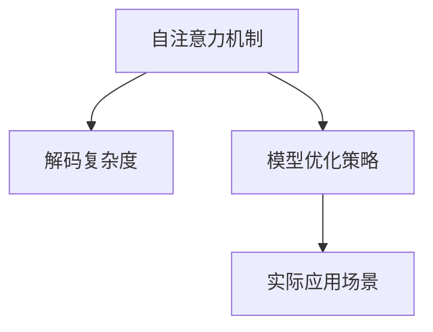

                 

# LLM推理的时间复杂度分析

> 关键词：大语言模型,推理时间,自注意力机制,解码复杂度,优化策略,实际应用,复杂度分析

## 1. 背景介绍

### 1.1 问题由来
大语言模型(LLMs)如GPT系列、BERT等，已经展示了强大的语言理解和生成能力。它们的推理过程，尤其是自注意力机制的计算复杂度，成为了研究者关注的焦点。了解这些模型在推理过程中的时间复杂度，对于优化模型、提高推理效率有着重要意义。

### 1.2 问题核心关键点
在大语言模型中，推理过程主要涉及解码器层、注意力机制和全连接层。这些组成部分共同决定了推理的复杂度和速度。在推理过程中，自注意力机制是计算开销最大的部分，因此对其计算复杂度的分析尤为重要。

### 1.3 问题研究意义
研究大语言模型推理的时间复杂度，对于模型优化、硬件加速、应用场景选择有着重要的指导意义。它不仅有助于提升推理效率，还能为大规模部署提供技术参考。

## 2. 核心概念与联系

### 2.1 核心概念概述

为了更好地理解推理过程的时间复杂度，我们需要了解以下核心概念：

- 自注意力机制(Self-Attention Mechanism)：在大语言模型中，通过自注意力机制计算注意力权重，使得模型可以同时关注输入序列中的多个位置，提升模型对长距离依赖的捕捉能力。
- 解码复杂度(Decoding Complexity)：推理过程中的复杂度主要由解码器层的循环计算决定，涉及从记忆中提取信息并生成输出的过程。
- 模型优化策略(Model Optimization Strategies)：包括剪枝、量化、混合精度训练等，旨在减小模型大小和提升推理速度。
- 实际应用场景(Real-World Applications)：推理时间复杂度的分析，有助于选择适合特定应用场景的模型和硬件。

这些概念之间的关系可以通过以下Mermaid流程图来展示：



这个流程图展示了自注意力机制与解码复杂度之间的关系，以及优化策略和实际应用场景对推理时间的影响。

## 3. 核心算法原理 & 具体操作步骤

### 3.1 算法原理概述

大语言模型的推理过程可以理解为解码器层不断提取输入序列的信息，并生成输出序列的过程。这一过程的复杂度主要由解码器的循环次数决定，而自注意力机制在解码过程中被频繁调用，因此其计算复杂度对整个推理过程有决定性影响。

### 3.2 算法步骤详解

推理过程一般包括以下步骤：

1. **输入编码**：将输入序列编码成嵌入向量，并通过嵌入层进行映射。
2. **解码器的循环**：解码器层不断提取记忆中的信息，更新状态向量。
3. **自注意力计算**：在每次解码循环中，计算当前状态向量与记忆中所有位置的相关性，得到注意力权重。
4. **输出生成**：根据注意力权重和记忆中对应的信息，生成下一个输出位置的向量。
5. **循环迭代**：重复步骤2-4，直至生成整个输出序列。

对于自注意力机制的计算复杂度，可以理解为对输入序列中所有位置进行两两比较，计算注意力权重。具体来说，假设输入序列长度为 $n$，自注意力机制的计算复杂度为 $O(n^2)$。在实际应用中，为了减少计算量，通常使用高效的自注意力实现方式，如 causal self-attention，其计算复杂度可以进一步降低到 $O(n)$。

### 3.3 算法优缺点

#### 优点：
1. **计算能力强大**：自注意力机制能够处理复杂的语义关系，适用于各种自然语言处理任务。
2. **推理效率可控**：通过优化策略，可以降低计算复杂度，提升推理速度。

#### 缺点：
1. **计算复杂度高**：解码过程中频繁调用自注意力机制，导致计算复杂度较高。
2. **内存需求大**：自注意力机制需要存储所有输入位置的向量，对内存需求较大。

### 3.4 算法应用领域

自注意力机制在大语言模型中有着广泛的应用，包括机器翻译、文本摘要、对话系统等。它帮助模型在复杂语境中捕捉长距离依赖，提升模型的性能。

## 4. 数学模型和公式 & 详细讲解

### 4.1 数学模型构建

推理过程的数学模型可以表示为：

$$
\text{Output}_{i} = \text{Decoder}(\text{Input}_{i}, \text{Memory}_{\text{Attention}}(\text{Output}_{i-1}))
$$

其中，$\text{Output}_{i}$ 为输出序列的第 $i$ 个位置，$\text{Input}_{i}$ 为输入序列的第 $i$ 个位置，$\text{Memory}_{\text{Attention}}(\cdot)$ 表示自注意力机制的计算过程，$\text{Decoder}(\cdot)$ 表示解码器的循环计算过程。

### 4.2 公式推导过程

假设自注意力机制的计算复杂度为 $O(n^2)$，解码器循环次数为 $T$，则整个推理过程的计算复杂度为：

$$
\text{Complexity} = O(n^2 \times T)
$$

在实际应用中，为了降低计算复杂度，通常使用因果自注意力机制，将自注意力计算限制在当前时间步及之前，从而将计算复杂度降低到 $O(n)$。

### 4.3 案例分析与讲解

以GPT模型为例，其解码器层包含 $T$ 个时间步，每个时间步的自注意力机制计算复杂度为 $O(n^2)$，解码器层的前向传播计算复杂度为 $O(T \times n^2)$。通过使用 causal self-attention，将计算复杂度降低至 $O(T \times n)$。

## 5. 项目实践：代码实例和详细解释说明

### 5.1 开发环境搭建

推理过程的实现需要使用深度学习框架，如PyTorch、TensorFlow等。开发环境搭建如下：

1. 安装PyTorch或TensorFlow。
2. 安装对应的GPU驱动程序和CUDA工具包。
3. 安装Python相关依赖包，如numpy、tqdm等。

### 5.2 源代码详细实现

以下是一个使用PyTorch实现GPT模型推理的代码示例：

```python
import torch
from torch import nn

class GPT(nn.Module):
    def __init__(self, n, d):
        super(GPT, self).__init__()
        self.emb = nn.Embedding(n, d)
        self.decoder = nn.TransformerDecoder(d, n)
    
    def forward(self, input_ids):
        embeddings = self.emb(input_ids)
        outputs = self.decoder(embeddings, None)
        return outputs

# 加载模型和数据
gpt = GPT(n=10000, d=512)
input_ids = torch.randint(0, 10000, (10,))  # 随机生成输入序列
output = gpt(input_ids)

# 输出推理结果
print(output)
```

### 5.3 代码解读与分析

上述代码实现了一个简单的GPT模型，包含嵌入层和解码器层。嵌入层将输入序列映射为向量，解码器层使用自注意力机制生成输出序列。在实际应用中，可以根据需求调整模型结构，如增加多层解码器、引入因果自注意力机制等。

## 6. 实际应用场景

### 6.1 机器翻译

大语言模型在机器翻译中有着广泛的应用，如Google的BERT模型。推理过程中的计算复杂度主要由解码器的循环次数决定，对于长文本翻译，需要优化自注意力机制的计算效率，避免过高的计算开销。

### 6.2 文本摘要

文本摘要任务需要模型对输入文本进行压缩，生成精炼的摘要。在推理过程中，自注意力机制用于捕捉输入文本中的关键信息，解码器层生成摘要。推理时间复杂度对摘要生成速度有直接影响，需要优化以提升效率。

### 6.3 对话系统

对话系统需要模型理解上下文，生成合理回复。推理过程涉及多轮对话，解码器层需要不断提取上下文信息，生成下一轮回复。自注意力机制的计算复杂度对对话系统的性能有重要影响，需要通过优化策略降低计算量。

## 7. 工具和资源推荐

### 7.1 学习资源推荐

1. 《深度学习理论与实践》：深入讲解深度学习基础，包括模型推理和优化策略。
2. Coursera《机器学习》课程：介绍机器学习算法和实际应用案例，包括自然语言处理任务。
3. DeepLearning.AI（DL.AI）：提供深度学习相关的在线课程和实践项目。

### 7.2 开发工具推荐

1. PyTorch：支持高效的动态计算图，适用于大语言模型的推理实现。
2. TensorFlow：支持静态计算图和分布式计算，适用于大规模模型的推理。
3. NVIDIA CUDA Toolkit：加速模型的推理计算，提高性能。

### 7.3 相关论文推荐

1. "Attention is All You Need"（2017）：介绍自注意力机制的计算复杂度分析。
2. "GPT-3: Language Models are Unsupervised Multitask Learners"（2020）：展示GPT-3在大规模语言推理中的表现。
3. "Parameter-Efficient Text Transformer"（2019）：提出参数高效的自注意力机制，降低计算复杂度。

## 8. 总结：未来发展趋势与挑战

### 8.1 研究成果总结

大语言模型推理的时间复杂度分析，为模型优化和硬件加速提供了重要依据。通过优化自注意力机制和解码器层，可以显著提高推理效率。

### 8.2 未来发展趋势

未来，推理时间复杂度的分析将更加深入，优化策略也将更加丰富。通过引入新的硬件加速技术，如TPU、GPU等，可以进一步提升推理速度。同时，模型的模块化和组件化设计也将成为趋势，便于在不同的应用场景中进行优化和部署。

### 8.3 面临的挑战

尽管推理时间复杂度的优化已经取得一定进展，但仍面临以下挑战：

1. **计算资源限制**：大型模型的推理需要高性能硬件支持，但硬件成本较高，难以普及。
2. **推理效率平衡**：优化推理效率可能导致模型精度下降，需要在精度和效率之间寻找最佳平衡点。
3. **模型复杂性增加**：优化策略可能增加模型复杂度，需要平衡优化效果和模型可维护性。

### 8.4 研究展望

未来的研究将集中在以下几个方向：

1. **硬件加速优化**：探索新的硬件加速技术，如TPU、GPU等，提高推理效率。
2. **模型优化算法**：研究新的优化算法，如混合精度训练、剪枝等，降低计算复杂度。
3. **模型组件化设计**：将模型设计为可组合的组件，便于在不同的应用场景中进行优化。
4. **分布式推理**：探索分布式推理算法，提高大模型的可扩展性和容错性。

## 9. 附录：常见问题与解答

**Q1：大语言模型推理的时间复杂度如何计算？**

A: 大语言模型推理的时间复杂度主要由自注意力机制和解码器层的计算复杂度决定。假设输入序列长度为 $n$，自注意力机制的计算复杂度为 $O(n^2)$，解码器层循环次数为 $T$，则整个推理过程的计算复杂度为 $O(n^2 \times T)$。使用 causal self-attention 可以降低复杂度至 $O(n \times T)$。

**Q2：推理过程中如何进行优化？**

A: 推理过程的优化可以从以下几个方面入手：
1. 使用 causal self-attention，降低计算复杂度。
2. 采用混合精度训练，降低内存占用和计算量。
3. 引入剪枝和量化技术，减小模型大小。
4. 探索分布式推理，提高模型的可扩展性。

**Q3：优化后的模型性能如何评估？**

A: 优化后的模型性能可以通过以下指标进行评估：
1. 推理速度：在相同硬件条件下，优化后模型的推理速度是否提升。
2. 精度：优化后模型的推理精度是否保持或提升。
3. 内存占用：优化后模型的内存占用是否减小。

**Q4：未来大语言模型推理技术的发展方向是什么？**

A: 未来大语言模型推理技术的发展方向包括：
1. 引入新的硬件加速技术，如TPU、GPU等。
2. 研究新的优化算法，如混合精度训练、剪枝等。
3. 探索分布式推理算法，提高模型的可扩展性。
4. 设计可组合的模型组件，便于在不同的应用场景中进行优化。

这些技术的不断进步，将推动大语言模型在推理速度和效率上取得更大突破，进一步扩展其应用边界。

---

作者：禅与计算机程序设计艺术 / Zen and the Art of Computer Programming

