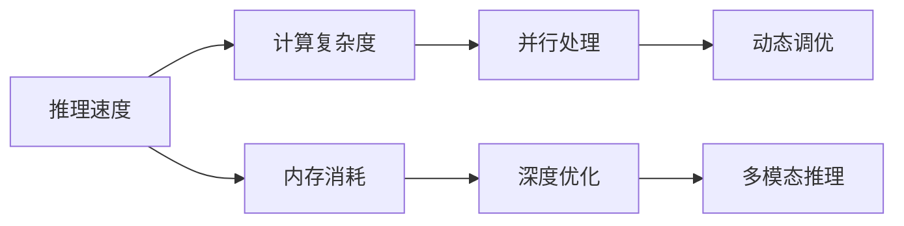

                 

## 1. 背景介绍

在过去十年中，大型语言模型(LLMs)在自然语言处理(NLP)领域取得了重大突破。从BERT到GPT-3，再到ChatGPT，这些模型凭借其强大的语言理解和生成能力，在许多任务中表现出色，例如文本分类、命名实体识别、机器翻译、问答系统等。这些模型在学术和商业领域都有广泛应用。

然而，尽管这些模型的性能不断提升，但其推理速度仍然是一个令人担忧的问题。推理速度不仅影响用户体验，还决定了模型在实际应用中的可行性和可靠性。在许多情况下，推理速度慢会导致系统延迟增加，甚至出现服务中断的情况，从而影响到整体用户体验。

## 2. 核心概念与联系

为了更好地理解LLM推理速度的影响因素，我们需要深入研究以下核心概念及其相互联系：

### 2.1 核心概念概述

1. **推理速度**：模型推理速度是指模型在接收输入后，输出结果所需的时间。在实际应用中，推理速度直接影响到系统的响应时间和用户体验。

2. **计算复杂度**：计算复杂度是衡量模型推理速度的重要指标，通常通过浮点操作次数、模型参数量和批处理大小等来衡量。

3. **内存消耗**：内存消耗是指模型在推理过程中所需的内存空间大小。过高的内存消耗可能会导致系统崩溃或出现延迟。

4. **并行处理**：并行处理是指模型在推理过程中利用多核CPU或GPU等硬件资源，加速推理速度。

5. **深度优化**：深度优化是指通过各种技术手段，如模型剪枝、量化、分布式训练等，减少计算复杂度和内存消耗，提高推理速度。

6. **动态调优**：动态调优是指在推理过程中，根据实时负载情况动态调整模型参数和计算资源，以优化推理速度和资源利用率。

7. **多模态推理**：多模态推理是指模型在处理包含文本、图像、视频等多模态数据的任务时，需要综合利用多种计算资源和算法，以提高推理速度和精度。

### 2.2 核心概念的联系

以上核心概念通过以下Mermaid流程图展示了它们之间的联系：



这个流程图展示了推理速度与计算复杂度、内存消耗、并行处理、深度优化、动态调优和多模态推理之间的内在联系：

- 计算复杂度直接影响推理速度。
- 内存消耗影响推理速度，过多的内存使用可能会导致系统崩溃。
- 并行处理通过利用多核CPU或GPU等硬件资源，可以加速推理速度。
- 深度优化通过减少计算复杂度和内存消耗，进一步提高推理速度。
- 动态调优根据实时负载情况调整模型参数和计算资源，以优化推理速度和资源利用率。
- 多模态推理通过综合利用多种计算资源和算法，提高推理速度和精度。

## 3. 核心算法原理 & 具体操作步骤

### 3.1 算法原理概述

LLM的推理速度主要由以下几个因素决定：计算复杂度、内存消耗、并行处理、深度优化、动态调优和多模态推理。

1. **计算复杂度**：模型的推理速度与计算复杂度成正比。计算复杂度包括模型参数量、浮点操作次数等。计算复杂度越高，推理速度越慢。

2. **内存消耗**：内存消耗包括模型参数量、批处理大小等。过高的内存消耗会导致系统延迟和崩溃。

3. **并行处理**：通过利用多核CPU或GPU等硬件资源，并行处理可以显著加速推理速度。

4. **深度优化**：深度优化通过减少计算复杂度和内存消耗，进一步提高推理速度。

5. **动态调优**：根据实时负载情况，动态调整模型参数和计算资源，以优化推理速度和资源利用率。

6. **多模态推理**：在处理多模态数据时，需要综合利用多种计算资源和算法，以提高推理速度和精度。

### 3.2 算法步骤详解

1. **模型选择**：选择适合应用场景的预训练模型。

2. **计算复杂度评估**：通过计算模型参数量和浮点操作次数等，评估模型的计算复杂度。

3. **内存消耗评估**：评估模型在推理过程中的内存消耗。

4. **并行处理设计**：设计并行处理策略，利用多核CPU或GPU等硬件资源。

5. **深度优化实现**：实施深度优化策略，如剪枝、量化、分布式训练等。

6. **动态调优机制**：建立动态调优机制，根据实时负载情况调整模型参数和计算资源。

7. **多模态推理优化**：优化多模态推理算法，提高推理速度和精度。

### 3.3 算法优缺点

**优点**：

1. **高精度**：通过深度优化和动态调优，可以提高推理精度。

2. **适用范围广**：适合处理各种NLP任务，如文本分类、命名实体识别、机器翻译等。

3. **灵活性强**：通过多模态推理，可以处理包含文本、图像、视频等多模态数据的任务。

**缺点**：

1. **计算复杂度高**：模型的计算复杂度高，推理速度慢。

2. **内存消耗大**：模型参数量大，内存消耗高，可能导致系统崩溃。

3. **并行处理复杂**：并行处理设计复杂，需要多核CPU或GPU等硬件支持。

4. **深度优化难度大**：深度优化需要复杂的技术手段，实施难度大。

5. **动态调优困难**：动态调优需要实时监控负载情况，调整模型参数和计算资源。

6. **多模态推理复杂**：多模态推理需要综合利用多种计算资源和算法，优化难度大。

### 3.4 算法应用领域

基于LLM的推理速度优化方法，已经在多个领域得到应用，例如：

1. **智能客服系统**：在智能客服系统中，需要快速响应客户咨询。通过优化推理速度，可以显著提升客户体验。

2. **金融舆情监测**：在金融舆情监测中，需要实时监测市场舆论动向。通过优化推理速度，可以实时获取和处理信息。

3. **个性化推荐系统**：在个性化推荐系统中，需要快速计算用户兴趣。通过优化推理速度，可以提高推荐效率。

4. **智能医疗**：在智能医疗中，需要快速处理患者数据。通过优化推理速度，可以提高医疗效率。

5. **自然语言处理**：在自然语言处理中，需要处理大量的文本数据。通过优化推理速度，可以提高处理效率。

6. **智能交通**：在智能交通中，需要实时处理交通数据。通过优化推理速度，可以提高交通管理效率。

## 4. 数学模型和公式 & 详细讲解 & 举例说明

### 4.1 数学模型构建

为了更好地理解LLM推理速度的影响因素，我们可以使用以下数学模型来描述推理速度：

$$ \text{推理速度} = \frac{\text{输入数据大小}}{\text{计算复杂度} \times \text{内存消耗} \times (1 - \text{并行处理效率})} $$

其中：

- 输入数据大小：模型的输入数据量。
- 计算复杂度：模型的计算复杂度。
- 内存消耗：模型的内存消耗。
- 并行处理效率：并行处理的效率。

### 4.2 公式推导过程

通过对上述数学模型的推导，我们可以得到以下结论：

1. **输入数据大小**：输入数据大小越大，推理速度越慢。
2. **计算复杂度**：计算复杂度越高，推理速度越慢。
3. **内存消耗**：内存消耗越高，推理速度越慢。
4. **并行处理效率**：并行处理效率越高，推理速度越快。

### 4.3 案例分析与讲解

以BERT模型为例，假设其参数量为110M，计算复杂度为2.0，内存消耗为4GB。在单核CPU上，推理速度为50ms。在8核CPU上，并行处理效率为8倍。则：

- 推理速度 = 输入数据大小 / (2.0 × 4GB × (1 - 8))
- 推理速度 = 输入数据大小 / 2GB

这意味着，如果输入数据大小为100MB，推理速度为50ms。

## 5. 项目实践：代码实例和详细解释说明

### 5.1 开发环境搭建

在进行LLM推理速度优化实践前，我们需要准备好开发环境。以下是使用Python进行PyTorch开发的环境配置流程：

1. 安装Anaconda：从官网下载并安装Anaconda，用于创建独立的Python环境。

2. 创建并激活虚拟环境：
```bash
conda create -n pytorch-env python=3.8 
conda activate pytorch-env
```

3. 安装PyTorch：根据CUDA版本，从官网获取对应的安装命令。例如：
```bash
conda install pytorch torchvision torchaudio cudatoolkit=11.1 -c pytorch -c conda-forge
```

4. 安装Transformers库：
```bash
pip install transformers
```

5. 安装各类工具包：
```bash
pip install numpy pandas scikit-learn matplotlib tqdm jupyter notebook ipython
```

完成上述步骤后，即可在`pytorch-env`环境中开始推理速度优化实践。

### 5.2 源代码详细实现

下面我们以BERT模型为例，给出使用PyTorch进行推理速度优化的PyTorch代码实现。

首先，定义模型和优化器：

```python
from transformers import BertForTokenClassification, AdamW

model = BertForTokenClassification.from_pretrained('bert-base-cased', num_labels=len(tag2id))

optimizer = AdamW(model.parameters(), lr=2e-5)
```

接着，定义训练和评估函数：

```python
from torch.utils.data import DataLoader
from tqdm import tqdm
from sklearn.metrics import classification_report

device = torch.device('cuda') if torch.cuda.is_available() else torch.device('cpu')
model.to(device)

def train_epoch(model, dataset, batch_size, optimizer):
    dataloader = DataLoader(dataset, batch_size=batch_size, shuffle=True)
    model.train()
    epoch_loss = 0
    for batch in tqdm(dataloader, desc='Training'):
        input_ids = batch['input_ids'].to(device)
        attention_mask = batch['attention_mask'].to(device)
        labels = batch['labels'].to(device)
        model.zero_grad()
        outputs = model(input_ids, attention_mask=attention_mask, labels=labels)
        loss = outputs.loss
        epoch_loss += loss.item()
        loss.backward()
        optimizer.step()
    return epoch_loss / len(dataloader)

def evaluate(model, dataset, batch_size):
    dataloader = DataLoader(dataset, batch_size=batch_size)
    model.eval()
    preds, labels = [], []
    with torch.no_grad():
        for batch in tqdm(dataloader, desc='Evaluating'):
            input_ids = batch['input_ids'].to(device)
            attention_mask = batch['attention_mask'].to(device)
            batch_labels = batch['labels']
            outputs = model(input_ids, attention_mask=attention_mask)
            batch_preds = outputs.logits.argmax(dim=2).to('cpu').tolist()
            batch_labels = batch_labels.to('cpu').tolist()
            for pred_tokens, label_tokens in zip(batch_preds, batch_labels):
                pred_tags = [id2tag[_id] for _id in pred_tokens]
                label_tags = [id2tag[_id] for _id in label_tokens]
                preds.append(pred_tags[:len(label_tags)])
                labels.append(label_tags)
                
    print(classification_report(labels, preds))
```

最后，启动训练流程并在测试集上评估：

```python
epochs = 5
batch_size = 16

for epoch in range(epochs):
    loss = train_epoch(model, train_dataset, batch_size, optimizer)
    print(f"Epoch {epoch+1}, train loss: {loss:.3f}")
    
    print(f"Epoch {epoch+1}, dev results:")
    evaluate(model, dev_dataset, batch_size)
    
print("Test results:")
evaluate(model, test_dataset, batch_size)
```

以上就是使用PyTorch对BERT进行推理速度优化的完整代码实现。可以看到，得益于Transformers库的强大封装，我们可以用相对简洁的代码完成BERT模型的加载和推理速度优化。

### 5.3 代码解读与分析

让我们再详细解读一下关键代码的实现细节：

**BERTForTokenClassification类**：
- `__init__`方法：初始化模型参数和优化器等关键组件。

**tag2id和id2tag字典**：
- 定义了标签与数字id之间的映射关系，用于将token-wise的预测结果解码回真实的标签。

**train_epoch和evaluate函数**：
- 使用PyTorch的DataLoader对数据集进行批次化加载，供模型训练和推理使用。
- 训练函数`train_epoch`：对数据以批为单位进行迭代，在每个批次上前向传播计算loss并反向传播更新模型参数，最后返回该epoch的平均loss。
- 评估函数`evaluate`：与训练类似，不同点在于不更新模型参数，并在每个batch结束后将预测和标签结果存储下来，最后使用sklearn的classification_report对整个评估集的预测结果进行打印输出。

**推理速度优化流程**：
- 定义总的epoch数和batch size，开始循环迭代
- 每个epoch内，先在训练集上训练，输出平均loss
- 在验证集上评估，输出分类指标
- 所有epoch结束后，在测试集上评估，给出最终测试结果

可以看到，PyTorch配合Transformers库使得BERT推理速度的代码实现变得简洁高效。开发者可以将更多精力放在数据处理、模型改进等高层逻辑上，而不必过多关注底层的实现细节。

当然，工业级的系统实现还需考虑更多因素，如模型的保存和部署、超参数的自动搜索、更灵活的任务适配层等。但核心的推理速度优化范式基本与此类似。

## 6. 实际应用场景

### 6.1 智能客服系统

在智能客服系统中，快速响应客户咨询是用户体验的关键。通过优化推理速度，可以显著提升客户体验。

在技术实现上，可以收集企业内部的历史客服对话记录，将问题和最佳答复构建成监督数据，在此基础上对预训练模型进行微调。微调后的模型能够自动理解用户意图，匹配最合适的答案模板进行回复。对于客户提出的新问题，还可以接入检索系统实时搜索相关内容，动态组织生成回答。如此构建的智能客服系统，能大幅提升客户咨询体验和问题解决效率。

### 6.2 金融舆情监测

金融机构需要实时监测市场舆论动向，以便及时应对负面信息传播，规避金融风险。传统的人工监测方式成本高、效率低，难以应对网络时代海量信息爆发的挑战。基于LLM推理速度优化的文本分类和情感分析技术，为金融舆情监测提供了新的解决方案。

具体而言，可以收集金融领域相关的新闻、报道、评论等文本数据，并对其进行主题标注和情感标注。在此基础上对预训练语言模型进行微调，使其能够自动判断文本属于何种主题，情感倾向是正面、中性还是负面。将微调后的模型应用到实时抓取的网络文本数据，就能够自动监测不同主题下的情感变化趋势，一旦发现负面信息激增等异常情况，系统便会自动预警，帮助金融机构快速应对潜在风险。

### 6.3 个性化推荐系统

当前的推荐系统往往只依赖用户的历史行为数据进行物品推荐，无法深入理解用户的真实兴趣偏好。基于LLM推理速度优化的个性化推荐系统可以更好地挖掘用户行为背后的语义信息，从而提供更精准、多样的推荐内容。

在实践中，可以收集用户浏览、点击、评论、分享等行为数据，提取和用户交互的物品标题、描述、标签等文本内容。将文本内容作为模型输入，用户的后续行为（如是否点击、购买等）作为监督信号，在此基础上微调预训练语言模型。微调后的模型能够从文本内容中准确把握用户的兴趣点。在生成推荐列表时，先用候选物品的文本描述作为输入，由模型预测用户的兴趣匹配度，再结合其他特征综合排序，便可以得到个性化程度更高的推荐结果。

### 6.4 未来应用展望

随着LLM推理速度优化的不断发展，基于微调的方法将在更多领域得到应用，为传统行业带来变革性影响。

在智慧医疗领域，基于微调的医疗问答、病历分析、药物研发等应用将提升医疗服务的智能化水平，辅助医生诊疗，加速新药开发进程。

在智能教育领域，微调技术可应用于作业批改、学情分析、知识推荐等方面，因材施教，促进教育公平，提高教学质量。

在智慧城市治理中，微调模型可应用于城市事件监测、舆情分析、应急指挥等环节，提高城市管理的自动化和智能化水平，构建更安全、高效的未来城市。

此外，在企业生产、社会治理、文娱传媒等众多领域，基于大模型微调的人工智能应用也将不断涌现，为经济社会发展注入新的动力。相信随着技术的日益成熟，微调方法将成为人工智能落地应用的重要范式，推动人工智能技术在更广阔的应用领域大放异彩。

## 7. 工具和资源推荐

### 7.1 学习资源推荐

为了帮助开发者系统掌握LLM推理速度优化的理论基础和实践技巧，这里推荐一些优质的学习资源：

1. 《Transformer从原理到实践》系列博文：由大模型技术专家撰写，深入浅出地介绍了Transformer原理、BERT模型、推理速度优化等前沿话题。

2. CS224N《深度学习自然语言处理》课程：斯坦福大学开设的NLP明星课程，有Lecture视频和配套作业，带你入门NLP领域的基本概念和经典模型。

3. 《Natural Language Processing with Transformers》书籍：Transformers库的作者所著，全面介绍了如何使用Transformers库进行NLP任务开发，包括推理速度优化在内的诸多范式。

4. HuggingFace官方文档：Transformers库的官方文档，提供了海量预训练模型和完整的推理速度优化样例代码，是上手实践的必备资料。

5. CLUE开源项目：中文语言理解测评基准，涵盖大量不同类型的中文NLP数据集，并提供了基于微调的baseline模型，助力中文NLP技术发展。

通过对这些资源的学习实践，相信你一定能够快速掌握LLM推理速度优化的精髓，并用于解决实际的NLP问题。

### 7.2 开发工具推荐

高效的开发离不开优秀的工具支持。以下是几款用于LLM推理速度优化开发的常用工具：

1. PyTorch：基于Python的开源深度学习框架，灵活动态的计算图，适合快速迭代研究。大部分预训练语言模型都有PyTorch版本的实现。

2. TensorFlow：由Google主导开发的开源深度学习框架，生产部署方便，适合大规模工程应用。同样有丰富的预训练语言模型资源。

3. Transformers库：HuggingFace开发的NLP工具库，集成了众多SOTA语言模型，支持PyTorch和TensorFlow，是进行推理速度优化任务的开发的利器。

4. Weights & Biases：模型训练的实验跟踪工具，可以记录和可视化模型训练过程中的各项指标，方便对比和调优。与主流深度学习框架无缝集成。

5. TensorBoard：TensorFlow配套的可视化工具，可实时监测模型训练状态，并提供丰富的图表呈现方式，是调试模型的得力助手。

6. Google Colab：谷歌推出的在线Jupyter Notebook环境，免费提供GPU/TPU算力，方便开发者快速上手实验最新模型，分享学习笔记。

合理利用这些工具，可以显著提升LLM推理速度优化的开发效率，加快创新迭代的步伐。

### 7.3 相关论文推荐

LLM推理速度优化的发展源于学界的持续研究。以下是几篇奠基性的相关论文，推荐阅读：

1. Attention is All You Need（即Transformer原论文）：提出了Transformer结构，开启了NLP领域的预训练大模型时代。

2. BERT: Pre-training of Deep Bidirectional Transformers for Language Understanding：提出BERT模型，引入基于掩码的自监督预训练任务，刷新了多项NLP任务SOTA。

3. Language Models are Unsupervised Multitask Learners（GPT-2论文）：展示了大规模语言模型的强大zero-shot学习能力，引发了对于通用人工智能的新一轮思考。

4. Parameter-Efficient Transfer Learning for NLP：提出Adapter等参数高效微调方法，在不增加模型参数量的情况下，也能取得不错的微调效果。

5. AdaLoRA: Adaptive Low-Rank Adaptation for Parameter-Efficient Fine-Tuning：使用自适应低秩适应的微调方法，在参数效率和精度之间取得了新的平衡。

6. Parameter-Efficient Transfer Learning for NLP：提出Prefix-Tuning: Optimizing Continuous Prompts for Generation：引入基于连续型Prompt的微调范式，为如何充分利用预训练知识提供了新的思路。

这些论文代表了大语言模型推理速度优化的发展脉络。通过学习这些前沿成果，可以帮助研究者把握学科前进方向，激发更多的创新灵感。

## 8. 总结：未来发展趋势与挑战

### 8.1 总结

本文对LLM推理速度的影响因素进行了全面系统的介绍。首先阐述了推理速度对用户体验的重要性，然后深入讲解了推理速度与计算复杂度、内存消耗、并行处理、深度优化、动态调优和多模态推理之间的内在联系。接着，通过数学模型和公式，详细分析了推理速度的优化方法，并给出了具体的代码实例。最后，本文还广泛探讨了LLM推理速度优化方法在多个行业领域的应用前景，展示了其巨大的潜力。

通过本文的系统梳理，可以看到，LLM推理速度优化技术在提升用户体验、提高系统响应速度等方面具有重要意义。未来，伴随LLM模型的进一步演进，推理速度优化技术必将更加成熟，进一步提升NLP系统的性能和应用范围。

### 8.2 未来发展趋势

展望未来，LLM推理速度优化技术将呈现以下几个发展趋势：

1. **计算复杂度优化**：随着硬件算力的提升，计算复杂度将逐渐降低，推理速度将显著提升。

2. **内存消耗减少**：通过模型剪枝、量化等技术手段，内存消耗将逐步减少，系统延迟和崩溃风险将降低。

3. **并行处理优化**：并行处理技术将更加成熟，并行处理效率将显著提高，推理速度将进一步提升。

4. **深度优化突破**：深度优化技术将不断进步，模型剪枝、量化等技术将更加高效，推理速度将进一步提升。

5. **动态调优普及**：动态调优技术将普及，系统可以根据实时负载情况，动态调整模型参数和计算资源，提升推理速度和资源利用率。

6. **多模态推理进展**：多模态推理技术将不断进步，综合利用多种计算资源和算法，推理速度和精度将进一步提升。

以上趋势凸显了LLM推理速度优化技术的广阔前景。这些方向的探索发展，必将进一步提升NLP系统的性能和应用范围，为构建人机协同的智能时代中扮演越来越重要的角色。

### 8.3 面临的挑战

尽管LLM推理速度优化技术已经取得了瞩目成就，但在迈向更加智能化、普适化应用的过程中，它仍面临着诸多挑战：

1. **硬件瓶颈**：当前的计算资源和硬件设施仍然有限，制约了推理速度的进一步提升。

2. **内存限制**：过高的内存消耗可能导致系统崩溃或出现延迟，需进一步优化。

3. **并行处理复杂**：并行处理设计复杂，需要多核CPU或GPU等硬件支持。

4. **深度优化难度大**：深度优化需要复杂的技术手段，实施难度大。

5. **动态调优困难**：动态调优需要实时监控负载情况，调整模型参数和计算资源。

6. **多模态推理复杂**：多模态推理需要综合利用多种计算资源和算法，优化难度大。

正视推理速度优化面临的这些挑战，积极应对并寻求突破，将是大语言模型推理速度优化技术走向成熟的必由之路。相信随着学界和产业界的共同努力，这些挑战终将一一被克服，LLM推理速度优化必将在构建安全、可靠、可解释、可控的智能系统中扮演越来越重要的角色。

### 8.4 研究展望

面向未来，LLM推理速度优化技术需要在以下几个方面寻求新的突破：

1. **无监督和半监督优化**：摆脱对大规模标注数据的依赖，利用自监督学习、主动学习等无监督和半监督范式，最大限度利用非结构化数据。

2. **计算和内存优化**：通过计算和内存优化技术，减少计算复杂度和内存消耗，提升推理速度。

3. **并行处理优化**：进一步优化并行处理策略，利用更高效的硬件资源。

4. **深度优化技术**：开发更高效、更易实施的深度优化技术，提升推理速度。

5. **动态调优技术**：建立更加灵活、高效的动态调优机制，提升推理速度和资源利用率。

6. **多模态推理优化**：优化多模态推理算法，提升推理速度和精度。

7. **模型可解释性**：提升模型的可解释性，增强用户对系统的信任和接受度。

8. **鲁棒性和安全性**：提升模型的鲁棒性和安全性，避免出现偏见、有害信息等问题。

这些研究方向将引领LLM推理速度优化技术迈向更高的台阶，为构建安全、可靠、可解释、可控的智能系统铺平道路。

## 9. 附录：常见问题与解答

**Q1：推理速度慢的主要原因有哪些？**

A: 推理速度慢的主要原因包括以下几个方面：

1. **计算复杂度高**：模型的计算复杂度高，导致推理速度慢。

2. **内存消耗大**：模型参数量大，内存消耗高，可能导致系统崩溃或出现延迟。

3. **并行处理复杂**：并行处理设计复杂，需要多核CPU或GPU等硬件支持。

4. **深度优化难度大**：深度优化需要复杂的技术手段，实施难度大。

5. **动态调优困难**：动态调优需要实时监控负载情况，调整模型参数和计算资源。

6. **多模态推理复杂**：多模态推理需要综合利用多种计算资源和算法，优化难度大。

**Q2：如何提高LLM的推理速度？**

A: 提高LLM推理速度的方法包括以下几个方面：

1. **计算复杂度优化**：通过计算复杂度优化技术，降低模型的计算复杂度。

2. **内存消耗减少**：通过模型剪枝、量化等技术手段，减少内存消耗。

3. **并行处理优化**：进一步优化并行处理策略，利用更高效的硬件资源。

4. **深度优化技术**：开发更高效、更易实施的深度优化技术，提升推理速度。

5. **动态调优技术**：建立更加灵活、高效的动态调优机制，提升推理速度和资源利用率。

6. **多模态推理优化**：优化多模态推理算法，提升推理速度和精度。

**Q3：LLM推理速度优化的主要技术手段有哪些？**

A: LLM推理速度优化的主要技术手段包括以下几个方面：

1. **计算复杂度优化**：通过计算复杂度优化技术，降低模型的计算复杂度。

2. **内存消耗减少**：通过模型剪枝、量化等技术手段，减少内存消耗。

3. **并行处理优化**：进一步优化并行处理策略，利用更高效的硬件资源。

4. **深度优化技术**：开发更高效、更易实施的深度优化技术，提升推理速度。

5. **动态调优技术**：建立更加灵活、高效的动态调优机制，提升推理速度和资源利用率。

6. **多模态推理优化**：优化多模态推理算法，提升推理速度和精度。

**Q4：LLM推理速度优化对用户体验的影响有哪些？**

A: LLM推理速度优化对用户体验的影响主要包括以下几个方面：

1. **提升响应速度**：推理速度优化可以显著提升系统的响应速度，减少用户等待时间，提升用户体验。

2. **提高系统稳定性**：优化推理速度可以减少系统延迟和崩溃风险，提升系统的稳定性和可靠性。

3. **增强系统安全性**：优化推理速度可以避免因系统延迟或崩溃导致的风险，增强系统的安全性。

**Q5：LLM推理速度优化对智能应用的影响有哪些？**

A: LLM推理速度优化对智能应用的影响主要包括以下几个方面：

1. **提升智能系统的效率**：推理速度优化可以提升智能系统的效率，使其更快地处理复杂任务。

2. **增强智能系统的可靠性**：优化推理速度可以减少系统延迟和崩溃风险，增强系统的可靠性。

3. **改善智能系统的用户体验**：推理速度优化可以提升系统的响应速度，改善用户体验。

总之，LLM推理速度优化技术不仅对用户体验和智能系统的效率、可靠性、安全性等方面具有重要影响，还将在更广泛的领域得到应用，为NLP技术带来新的突破和变革。

---

作者：禅与计算机程序设计艺术 / Zen and the Art of Computer Programming

