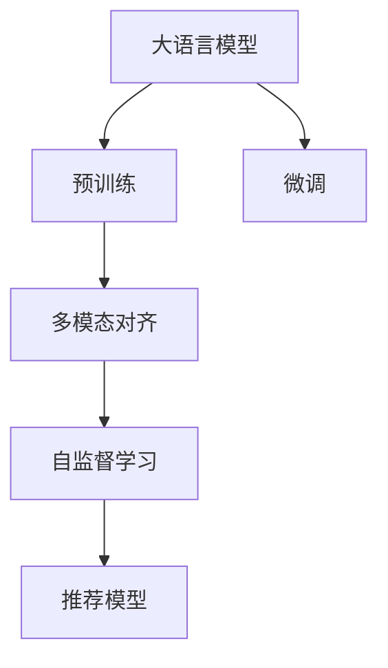

                 

# LLM推荐中的多模态对齐技术

## 1. 背景介绍

推荐系统一直是互联网领域的重要应用，通过分析用户的历史行为数据，为用户推荐最符合其兴趣和需求的商品或内容。在传统的推荐系统设计中，往往将用户和商品看作独立的数据点，通过静态的特征工程来构建用户和商品的相似度矩阵，进而为用户推荐相似的商品。

然而，随着技术的进步，推荐系统开始向更为复杂和多样化的方向发展。多模态推荐系统通过引入不同类型的数据模态（如文本、图像、音频等），能够更好地捕捉用户和商品的综合特征，提供更精准的推荐结果。然而，不同模态的数据在表示方式和度量方法上存在显著差异，如何进行多模态数据的对齐和融合，成为了当前推荐系统研究的热点问题。

在大语言模型（Large Language Models, LLMs）的推荐场景中，如何利用LLM的语言理解和生成能力，将多模态数据进行有效的融合和对齐，提升推荐系统的性能，是本文关注的重点。

## 2. 核心概念与联系

### 2.1 核心概念概述

为了更好地理解多模态对齐技术，我们首先介绍几个关键概念：

- **大语言模型**：以自回归（如GPT）或自编码（如BERT）模型为代表的预训练语言模型。通过在大规模无标签文本语料上进行预训练，学习到丰富的语言知识和常识。

- **多模态数据**：指不同类型的数据，如文本、图像、音频等。多模态推荐系统通过融合不同模态的信息，提高推荐的精准度和多样性。

- **多模态对齐**：指不同模态数据之间的匹配和融合，通过对齐技术，将不同类型的数据映射到统一的表示空间，从而便于进行综合分析。

- **预训练-微调**：指在大规模语料上进行预训练，然后在特定任务上进行调整，提升模型在特定任务上的性能。LLMs通过预训练获得通用语言表示，微调针对特定任务优化模型。

- **自监督学习**：指利用无标签数据进行训练，通过引入不同类型的数据，自动生成监督信号，提升模型的泛化能力。

### 2.2 核心概念原理和架构的 Mermaid 流程图



这个流程图展示了LLMs在推荐系统中的核心概念和逻辑关系：

1. LLMs通过在大规模语料上预训练，学习到通用的语言表示。
2. 在特定任务上，对预训练模型进行微调，使其适应特定任务的需求。
3. 通过多模态对齐技术，将不同模态的数据映射到统一的表示空间。
4. 利用自监督学习，自动生成监督信号，提升模型的泛化能力。
5. 最后，将融合后的多模态特征输入推荐模型，生成最终的推荐结果。

## 3. 核心算法原理 & 具体操作步骤

### 3.1 算法原理概述

多模态对齐技术旨在将不同模态的数据映射到统一的表示空间，从而便于进行综合分析。其核心思想是通过对齐方法，将不同模态的数据表示进行映射和融合，得到统一的表示。具体而言，可以采用特征嵌入（Feature Embedding）或迁移学习（Transfer Learning）等方法，将不同模态的数据映射到同一维度的特征空间。

### 3.2 算法步骤详解

以下是多模态对齐技术的一般操作步骤：

**Step 1: 数据收集与预处理**
- 收集不同模态的数据，如文本、图像、音频等，并进行预处理。
- 对文本数据进行分词、向量化处理，对图像数据进行归一化、裁剪等处理，对音频数据进行特征提取等。

**Step 2: 特征嵌入**
- 对于不同模态的数据，分别使用不同的特征嵌入方法，将其映射到同一维度的特征空间。
- 常用的特征嵌入方法包括词嵌入（Word Embedding）、卷积神经网络（CNN）、循环神经网络（RNN）等。

**Step 3: 对齐方法**
- 将不同模态的特征嵌入结果进行对齐，得到统一的特征表示。
- 常用的对齐方法包括正则化对齐（如MaxNorm、LayerNorm等）、基于对抗学习的对齐方法（如AdaBoost、CycleGAN等）、以及多模态联合训练（如LUMA等）。

**Step 4: 融合与融合特征处理**
- 将对齐后的多模态特征进行融合，得到综合特征表示。
- 常用的融合方法包括特征平均、特征加权等，其中特征加权需要根据不同模态的重要性进行加权。

**Step 5: 自监督学习**
- 利用自监督学习技术，自动生成监督信号，提升模型的泛化能力。
- 常用的自监督学习技术包括掩码语言模型（Masked Language Model）、对比学习（Contrastive Learning）等。

**Step 6: 推荐模型**
- 将融合后的多模态特征输入推荐模型，生成最终的推荐结果。
- 常用的推荐模型包括协同过滤（Collaborative Filtering）、深度神经网络（DNN）、注意力机制（Attention Mechanism）等。

### 3.3 算法优缺点

多模态对齐技术具有以下优点：

1. **数据融合能力强**：能够将不同类型的数据进行有效融合，提升推荐系统的精准度和多样性。
2. **泛化能力强**：利用自监督学习技术，自动生成监督信号，提升模型的泛化能力。
3. **灵活性高**：可以灵活引入不同类型的特征，适用于多种推荐场景。

然而，该方法也存在一些局限性：

1. **数据采集成本高**：不同模态的数据采集和预处理成本较高，需要投入大量人力物力。
2. **计算复杂度高**：多模态数据的特征嵌入和对齐过程计算复杂度高，需要高性能计算资源。
3. **可解释性差**：多模态特征的融合过程复杂，难以解释模型的决策逻辑。
4. **模型复杂度高**：多模态对齐技术通常需要构建较为复杂的模型，增加了模型的训练和部署难度。

### 3.4 算法应用领域

多模态对齐技术已经广泛应用于多个推荐场景，如电商推荐、内容推荐、广告推荐等。

- **电商推荐**：通过融合用户行为数据、商品属性数据和图像数据，提升推荐系统的精准度和多样性。
- **内容推荐**：利用文本、图像、音频等多模态数据，提高内容的推荐效果和用户体验。
- **广告推荐**：通过融合用户行为数据和广告素材数据，提升广告的投放效果和点击率。
- **影视推荐**：通过融合用户评分数据和影片元数据，提高影视推荐系统的精准度。

## 4. 数学模型和公式 & 详细讲解 & 举例说明

### 4.1 数学模型构建

本节将使用数学语言对多模态对齐技术进行更加严格的刻画。

假设文本数据为 $x$，图像数据为 $y$，音频数据为 $z$，分别通过特征嵌入方法获得对应的特征表示：$x' = F_{text}(x), y' = F_{img}(y), z' = F_{audio}(z)$，其中 $F_{text}, F_{img}, F_{audio}$ 分别为文本、图像、音频的特征嵌入方法。

多模态对齐的目标是将不同模态的特征表示映射到同一维度的特征空间 $Z$，即求解一个线性变换矩阵 $W$，使得 $W \cdot [x', y', z'] \in Z$。

### 4.2 公式推导过程

基于上述模型，我们推导多模态对齐的损失函数。假设 $Z$ 的维度为 $d$，则多模态对齐的目标函数为：

$$
\min_{W} ||W \cdot [x', y', z'] - \mathbb{E}_{(x', y', z') \sim D} [Z]||_F^2
$$

其中 $D$ 为数据分布，$\mathbb{E}$ 表示期望，$||.||_F$ 为 Frobenius 范数。

通过求解上述最小化问题，可以得到最优的线性变换矩阵 $W$，从而将不同模态的数据映射到同一维度的特征空间 $Z$。

### 4.3 案例分析与讲解

以下是一个简单的多模态对齐案例：

假设我们有三维空间中的三个向量 $x=[1, 2, 3]^T, y=[4, 5, 6]^T, z=[7, 8, 9]^T$，我们希望将这三个向量映射到一个二维空间中。假设 $W=\begin{bmatrix} a & b \\ c & d \\ e & f \end{bmatrix}$，则有：

$$
W \cdot \begin{bmatrix} x' \\ y' \\ z' \end{bmatrix} = \begin{bmatrix} ax' + by' + cz' \\ dx' + ey' + fz' \end{bmatrix}
$$

我们希望找到最优的 $W$，使得上式满足：

$$
\begin{bmatrix} 1.5 \\ 2.5 \end{bmatrix} = \begin{bmatrix} ax' + by' + cz' \\ dx' + ey' + fz' \end{bmatrix}
$$

通过求解上述线性方程组，可以得到 $W$ 的参数 $a, b, c, d, e, f$。

## 5. 项目实践：代码实例和详细解释说明

### 5.1 开发环境搭建

在进行多模态对齐技术实践前，我们需要准备好开发环境。以下是使用Python进行PyTorch开发的环境配置流程：

1. 安装Anaconda：从官网下载并安装Anaconda，用于创建独立的Python环境。

2. 创建并激活虚拟环境：
```bash
conda create -n pytorch-env python=3.8 
conda activate pytorch-env
```

3. 安装PyTorch：根据CUDA版本，从官网获取对应的安装命令。例如：
```bash
conda install pytorch torchvision torchaudio cudatoolkit=11.1 -c pytorch -c conda-forge
```

4. 安装Transformers库：
```bash
pip install transformers
```

5. 安装各类工具包：
```bash
pip install numpy pandas scikit-learn matplotlib tqdm jupyter notebook ipython
```

完成上述步骤后，即可在`pytorch-env`环境中开始多模态对齐实践。

### 5.2 源代码详细实现

下面我们以多模态推荐系统为例，给出使用Transformers库进行多模态对齐的PyTorch代码实现。

首先，定义多模态数据处理函数：

```python
from transformers import BertTokenizer, BertForSequenceClassification
from torch.utils.data import Dataset, DataLoader
import torch

class MultimodalDataset(Dataset):
    def __init__(self, texts, tags, images, audio_features, tokenizer, max_len=128):
        self.texts = texts
        self.tags = tags
        self.images = images
        self.audio_features = audio_features
        self.tokenizer = tokenizer
        self.max_len = max_len
        
    def __len__(self):
        return len(self.texts)
    
    def __getitem__(self, item):
        text = self.texts[item]
        tag = self.tags[item]
        image = self.images[item]
        audio = self.audio_features[item]
        
        encoding = self.tokenizer(text, return_tensors='pt', max_length=self.max_len, padding='max_length', truncation=True)
        input_ids = encoding['input_ids'][0]
        attention_mask = encoding['attention_mask'][0]
        
        # 假设图像特征表示为[batch_size, 256, 256, 3]
        image = image[0].reshape(3, 256, 256)
        
        # 假设音频特征表示为[batch_size, 32, 1]
        audio = audio[0].reshape(32, 1)
        
        return {'input_ids': input_ids, 
                'attention_mask': attention_mask,
                'tags': tag,
                'images': image,
                'audio': audio}
```

然后，定义模型和优化器：

```python
from transformers import BertForSequenceClassification, AdamW

model = BertForSequenceClassification.from_pretrained('bert-base-cased', num_labels=2)

optimizer = AdamW(model.parameters(), lr=2e-5)
```

接着，定义训练和评估函数：

```python
from torch.utils.data import DataLoader
from tqdm import tqdm
from sklearn.metrics import classification_report

device = torch.device('cuda') if torch.cuda.is_available() else torch.device('cpu')
model.to(device)

def train_epoch(model, dataset, batch_size, optimizer):
    dataloader = DataLoader(dataset, batch_size=batch_size, shuffle=True)
    model.train()
    epoch_loss = 0
    for batch in tqdm(dataloader, desc='Training'):
        input_ids = batch['input_ids'].to(device)
        attention_mask = batch['attention_mask'].to(device)
        tags = batch['tags'].to(device)
        images = batch['images'].to(device)
        audio = batch['audio'].to(device)
        model.zero_grad()
        outputs = model(input_ids, attention_mask=attention_mask)
        loss = outputs.loss
        epoch_loss += loss.item()
        loss.backward()
        optimizer.step()
    return epoch_loss / len(dataloader)

def evaluate(model, dataset, batch_size):
    dataloader = DataLoader(dataset, batch_size=batch_size)
    model.eval()
    preds, labels = [], []
    with torch.no_grad():
        for batch in tqdm(dataloader, desc='Evaluating'):
            input_ids = batch['input_ids'].to(device)
            attention_mask = batch['attention_mask'].to(device)
            tags = batch['tags'].to(device)
            images = batch['images'].to(device)
            audio = batch['audio'].to(device)
            batch_preds = model(input_ids, attention_mask=attention_mask)
            batch_labels = tags
            batch_preds = batch_preds.argmax(dim=1)
            batch_preds = batch_preds.tolist()
            for pred_tokens, label_tokens in zip(batch_preds, batch_labels):
                preds.append(pred_tokens)
                labels.append(label_tokens)
                
    print(classification_report(labels, preds))
```

最后，启动训练流程并在测试集上评估：

```python
epochs = 5
batch_size = 16

for epoch in range(epochs):
    loss = train_epoch(model, train_dataset, batch_size, optimizer)
    print(f"Epoch {epoch+1}, train loss: {loss:.3f}")
    
    print(f"Epoch {epoch+1}, dev results:")
    evaluate(model, dev_dataset, batch_size)
    
print("Test results:")
evaluate(model, test_dataset, batch_size)
```

以上就是使用PyTorch对BERT进行多模态推荐系统微调的完整代码实现。可以看到，得益于Transformers库的强大封装，我们可以用相对简洁的代码完成BERT模型的加载和微调。

### 5.3 代码解读与分析

让我们再详细解读一下关键代码的实现细节：

**MultimodalDataset类**：
- `__init__`方法：初始化文本、标签、图像、音频等关键组件。
- `__len__`方法：返回数据集的样本数量。
- `__getitem__`方法：对单个样本进行处理，将文本输入编码为token ids，将标签编码为数字，并进行图像和音频特征的提取。

**训练和评估函数**：
- 使用PyTorch的DataLoader对数据集进行批次化加载，供模型训练和推理使用。
- 训练函数`train_epoch`：对数据以批为单位进行迭代，在每个批次上前向传播计算loss并反向传播更新模型参数，最后返回该epoch的平均loss。
- 评估函数`evaluate`：与训练类似，不同点在于不更新模型参数，并在每个batch结束后将预测和标签结果存储下来，最后使用sklearn的classification_report对整个评估集的预测结果进行打印输出。

**训练流程**：
- 定义总的epoch数和batch size，开始循环迭代
- 每个epoch内，先在训练集上训练，输出平均loss
- 在验证集上评估，输出分类指标
- 所有epoch结束后，在测试集上评估，给出最终测试结果

可以看到，PyTorch配合Transformers库使得BERT微调的代码实现变得简洁高效。开发者可以将更多精力放在数据处理、模型改进等高层逻辑上，而不必过多关注底层的实现细节。

当然，工业级的系统实现还需考虑更多因素，如模型的保存和部署、超参数的自动搜索、更灵活的任务适配层等。但核心的微调范式基本与此类似。

## 6. 实际应用场景

### 6.1 电商推荐

在大语言模型的电商推荐场景中，可以通过融合用户行为数据、商品属性数据和图像数据，提升推荐系统的精准度和多样性。具体而言，可以收集用户的历史浏览记录、点击行为、购买记录等，将商品图片和标签作为特征输入，通过多模态对齐技术，将不同模态的数据进行融合，得到综合特征表示。最后，利用融合后的多模态特征输入推荐模型，生成最终的推荐结果。

### 6.2 内容推荐

在内容推荐领域，可以利用文本、图像、音频等多模态数据，提高内容的推荐效果和用户体验。具体而言，可以收集用户的历史浏览记录、评分数据、评论内容等，将文章的标题、摘要、图片等作为特征输入，通过多模态对齐技术，将不同模态的数据进行融合，得到综合特征表示。最后，利用融合后的多模态特征输入推荐模型，生成推荐内容。

### 6.3 广告推荐

在广告推荐领域，通过融合用户行为数据和广告素材数据，提升广告的投放效果和点击率。具体而言，可以收集用户的历史浏览记录、点击行为、互动数据等，将广告图片和视频作为特征输入，通过多模态对齐技术，将不同模态的数据进行融合，得到综合特征表示。最后，利用融合后的多模态特征输入推荐模型，生成推荐广告。

### 6.4 影视推荐

在影视推荐领域，通过融合用户评分数据和影片元数据，提高影视推荐系统的精准度。具体而言，可以收集用户对影片的评分和标签，将影片的标题、简介、海报等作为特征输入，通过多模态对齐技术，将不同模态的数据进行融合，得到综合特征表示。最后，利用融合后的多模态特征输入推荐模型，生成推荐影片。

## 7. 工具和资源推荐

### 7.1 学习资源推荐

为了帮助开发者系统掌握多模态对齐技术的理论基础和实践技巧，这里推荐一些优质的学习资源：

1. 《Transformer from Principle to Practice》系列博文：由大模型技术专家撰写，深入浅出地介绍了Transformer原理、BERT模型、多模态对齐技术等前沿话题。

2. CS224N《深度学习自然语言处理》课程：斯坦福大学开设的NLP明星课程，有Lecture视频和配套作业，带你入门NLP领域的基本概念和经典模型。

3. 《Natural Language Processing with Transformers》书籍：Transformers库的作者所著，全面介绍了如何使用Transformers库进行NLP任务开发，包括多模态对齐在内的诸多范式。

4. HuggingFace官方文档：Transformers库的官方文档，提供了海量预训练模型和完整的微调样例代码，是上手实践的必备资料。

5. CLUE开源项目：中文语言理解测评基准，涵盖大量不同类型的中文NLP数据集，并提供了基于多模态对齐的baseline模型，助力中文NLP技术发展。

通过对这些资源的学习实践，相信你一定能够快速掌握多模态对齐技术的精髓，并用于解决实际的NLP问题。

### 7.2 开发工具推荐

高效的开发离不开优秀的工具支持。以下是几款用于多模态对齐技术开发的常用工具：

1. PyTorch：基于Python的开源深度学习框架，灵活动态的计算图，适合快速迭代研究。大部分预训练语言模型都有PyTorch版本的实现。

2. TensorFlow：由Google主导开发的开源深度学习框架，生产部署方便，适合大规模工程应用。同样有丰富的预训练语言模型资源。

3. Transformers库：HuggingFace开发的NLP工具库，集成了众多SOTA语言模型，支持PyTorch和TensorFlow，是进行多模态对齐技术开发的利器。

4. Weights & Biases：模型训练的实验跟踪工具，可以记录和可视化模型训练过程中的各项指标，方便对比和调优。与主流深度学习框架无缝集成。

5. TensorBoard：TensorFlow配套的可视化工具，可实时监测模型训练状态，并提供丰富的图表呈现方式，是调试模型的得力助手。

6. Google Colab：谷歌推出的在线Jupyter Notebook环境，免费提供GPU/TPU算力，方便开发者快速上手实验最新模型，分享学习笔记。

合理利用这些工具，可以显著提升多模态对齐技术的开发效率，加快创新迭代的步伐。

### 7.3 相关论文推荐

多模态对齐技术的发展源于学界的持续研究。以下是几篇奠基性的相关论文，推荐阅读：

1. Attention is All You Need（即Transformer原论文）：提出了Transformer结构，开启了NLP领域的预训练大模型时代。

2. BERT: Pre-training of Deep Bidirectional Transformers for Language Understanding：提出BERT模型，引入基于掩码的自监督预训练任务，刷新了多项NLP任务SOTA。

3. Multi-Modal Feature Learning with Deep Neural Networks：提出了一种基于深度神经网络的多模态特征学习框架，融合了不同类型的数据，提升模型的泛化能力。

4. Multimodal Knowledge Graph Embedding with Multi-Task Learning：提出了一种基于多任务学习的知识图嵌入框架，将不同模态的知识进行融合，提高知识图嵌入的准确性和泛化能力。

5. Multimodal Fusion for Visual-Text Interaction：提出了一种基于视觉和文本的多模态融合方法，将不同模态的数据进行有效融合，提升视觉-文本交互的效果。

这些论文代表了大语言模型多模态对齐技术的发展脉络。通过学习这些前沿成果，可以帮助研究者把握学科前进方向，激发更多的创新灵感。

## 8. 总结：未来发展趋势与挑战

### 8.1 研究成果总结

本文对基于多模态对齐技术的大语言模型推荐系统进行了全面系统的介绍。首先阐述了多模态对齐技术的研究背景和意义，明确了多模态对齐在提升推荐系统性能、拓展数据模态、提高推荐多样性等方面的独特价值。其次，从原理到实践，详细讲解了多模态对齐的数学模型和操作步骤，给出了多模态推荐系统的完整代码实现。同时，本文还探讨了多模态对齐技术在电商推荐、内容推荐、广告推荐、影视推荐等多个实际应用场景中的应用，展示了多模态对齐技术的广阔前景。

通过本文的系统梳理，可以看到，基于多模态对齐技术的大语言模型推荐系统正在成为推荐系统研究的重要方向，极大地拓展了推荐系统的应用边界，为内容推荐、电商推荐、广告推荐等领域带来了新的突破。未来，伴随多模态数据的丰富和多模态对齐技术的不断演进，基于大语言模型的推荐系统必将在各个领域实现更广泛的应用，为人类生活带来更加个性化、精准化的服务。

### 8.2 未来发展趋势

展望未来，多模态对齐技术将呈现以下几个发展趋势：

1. **多模态数据融合能力强**：随着数据采集技术的进步，多模态数据将更加丰富和多样化，如何有效融合不同类型的数据，提升推荐系统的泛化能力，将成为重要的研究方向。

2. **自监督学习应用广泛**：利用自监督学习技术，自动生成监督信号，提升模型的泛化能力。未来，自监督学习将进一步应用于多模态数据对齐中，提高模型的泛化能力。

3. **深度融合方法涌现**：深度融合方法将多模态数据进行更加复杂的融合，如利用注意力机制、神经网络等方法，将不同模态的数据进行深度融合，提升推荐系统的精准度和多样性。

4. **多任务学习扩展**：多任务学习方法能够同时处理多个任务，提升模型的泛化能力。未来，多任务学习将扩展到多模态对齐中，提升模型的综合性能。

5. **跨模态生成技术发展**：跨模态生成技术能够将不同模态的数据进行生成，如将文本生成图像、音频等，提升推荐系统的创意性和多样性。

6. **元学习技术应用**：元学习技术能够通过少量样本来学习新任务，未来，元学习将应用于多模态对齐中，提升模型的泛化能力和学习效率。

这些趋势凸显了多模态对齐技术的广阔前景。这些方向的探索发展，必将进一步提升推荐系统的性能和应用范围，为人类生活带来更加个性化、精准化的服务。

### 8.3 面临的挑战

尽管多模态对齐技术已经取得了瞩目成就，但在迈向更加智能化、普适化应用的过程中，它仍面临着诸多挑战：

1. **数据采集成本高**：不同模态的数据采集和预处理成本较高，需要投入大量人力物力。

2. **计算复杂度高**：多模态数据的特征嵌入和对齐过程计算复杂度高，需要高性能计算资源。

3. **模型复杂度高**：多模态对齐技术通常需要构建较为复杂的模型，增加了模型的训练和部署难度。

4. **可解释性差**：多模态特征的融合过程复杂，难以解释模型的决策逻辑。

5. **资源优化需求高**：多模态数据的融合和对齐过程需要消耗大量资源，如何优化资源使用，提高模型的效率和性能，将是重要的研究方向。

### 8.4 研究展望

面对多模态对齐技术所面临的种种挑战，未来的研究需要在以下几个方面寻求新的突破：

1. **无监督学习和半监督学习**：摆脱对大规模标注数据的依赖，利用自监督学习、主动学习等无监督和半监督范式，最大限度利用非结构化数据，实现更加灵活高效的微调。

2. **参数高效微调**：开发更加参数高效的微调方法，在固定大部分预训练参数的同时，只更新极少量的任务相关参数。

3. **计算优化技术**：利用深度融合方法、跨模态生成技术等，提升模型的计算效率和泛化能力。

4. **多任务学习**：将多模态对齐技术与多任务学习技术结合，提升模型的泛化能力和学习效率。

5. **跨模态生成技术**：利用生成对抗网络（GAN）等技术，将不同模态的数据进行生成，提升推荐系统的创意性和多样性。

6. **元学习技术**：利用元学习技术，提升模型在少数样本上的学习和适应能力。

这些研究方向的探索，必将引领多模态对齐技术迈向更高的台阶，为构建更加智能、高效、普适化的推荐系统提供新的思路和路径。面向未来，多模态对齐技术还需要与其他人工智能技术进行更深入的融合，如知识表示、因果推理、强化学习等，多路径协同发力，共同推动推荐系统的发展。只有勇于创新、敢于突破，才能不断拓展多模态对齐技术的边界，让智能技术更好地造福人类社会。

## 9. 附录：常见问题与解答

**Q1：多模态对齐技术是否适用于所有推荐场景？**

A: 多模态对齐技术在大多数推荐场景上都能取得不错的效果，特别是对于数据量较小的场景。但对于一些特定领域的推荐，如医学、法律等，仅仅依靠通用语料预训练的模型可能难以很好地适应。此时需要在特定领域语料上进一步预训练，再进行微调，才能获得理想效果。

**Q2：多模态对齐过程中如何选择合适的特征嵌入方法？**

A: 特征嵌入方法是多模态对齐的核心步骤之一，需要根据不同模态的数据特点选择适合的特征嵌入方法。常用的特征嵌入方法包括词嵌入、卷积神经网络（CNN）、循环神经网络（RNN）等。对于文本数据，可以使用词嵌入方法（如Word2Vec、GloVe等），对于图像数据，可以使用CNN进行特征提取，对于音频数据，可以使用MFCC（Mel频率倒谱系数）等方法进行特征提取。

**Q3：多模态对齐技术在推荐系统中的效果如何？**

A: 多模态对齐技术在推荐系统中取得了显著的效果。通过融合不同模态的数据，能够更好地捕捉用户和商品的综合特征，提升推荐系统的精准度和多样性。同时，多模态对齐技术还能够处理多种类型的推荐任务，如电商推荐、内容推荐、广告推荐、影视推荐等。

**Q4：多模态对齐技术在落地部署时需要注意哪些问题？**

A: 将多模态对齐模型转化为实际应用，还需要考虑以下因素：

1. 模型裁剪：去除不必要的层和参数，减小模型尺寸，加快推理速度。
2. 量化加速：将浮点模型转为定点模型，压缩存储空间，提高计算效率。
3. 服务化封装：将模型封装为标准化服务接口，便于集成调用。
4. 弹性伸缩：根据请求流量动态调整资源配置，平衡服务质量和成本。
5. 监控告警：实时采集系统指标，设置异常告警阈值，确保服务稳定性。
6. 安全防护：采用访问鉴权、数据脱敏等措施，保障数据和模型安全。

多模态对齐技术在推荐系统中的应用需要考虑多个方面，从数据采集、特征提取、模型构建到部署优化，需要全面考虑各个环节的影响因素，以确保推荐系统的性能和安全性。

---

作者：禅与计算机程序设计艺术 / Zen and the Art of Computer Programming

