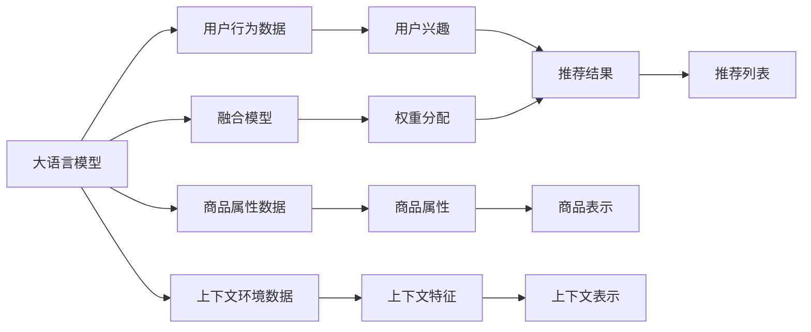

                 

# 大语言模型推荐中的多源异构数据融合技术

## 1. 背景介绍

### 1.1 问题由来

在推荐系统（Recommendation Systems, RS）领域，大语言模型（Large Language Models, LLMs）的应用已经引起了广泛关注。大语言模型通常指那些具有庞大参数规模的深度神经网络模型，如BERT、GPT-3等，它们在预训练过程中学习了大量的语言知识，可以理解自然语言并生成自然语言。近年来，随着深度学习和大数据技术的发展，大语言模型在推荐系统中的应用逐渐增多，尤其是在基于内容的推荐中，通过大语言模型的预训练-微调（Fine-Tuning）范式，能够提升推荐系统的性能，尤其是对于长尾物品和新兴领域的推荐。

然而，在推荐系统中，推荐结果的准确性不仅依赖于单一的预测模型，还需要考虑用户的多样化需求、商品的多样化特征以及上下文信息的丰富度。这些因素使得推荐系统变得更加复杂，单一的模型往往难以同时捕捉到这些信息。因此，多源异构数据的融合成为推荐系统中亟需解决的问题。

### 1.2 问题核心关键点

在推荐系统中，多源异构数据的融合主要包含以下几个核心关键点：

- **数据源的异构性**：推荐系统中可能包含多种类型的数据源，如用户行为数据、商品属性数据、上下文环境数据等，这些数据源的特征空间和分布可能存在差异。
- **数据的多样性**：推荐系统中需要处理多种类型的推荐任务，如基于用户的推荐、基于内容的推荐、协同过滤推荐等，不同任务需要不同类型的数据源进行支撑。
- **数据融合的目标**：通过多源异构数据的融合，构建更加全面、准确的推荐模型，提高推荐的精准度和个性化程度。
- **推荐结果的生成**：融合后的多源数据需要被模型整合为推荐结果，通常需要设计合适的融合算法和权重分配策略。

### 1.3 问题研究意义

通过多源异构数据的融合，可以显著提升推荐系统的性能和用户体验。具体而言，其研究意义体现在以下几个方面：

1. **提高推荐的精准度**：通过融合不同数据源的信息，模型能够更加全面地理解用户和商品的特征，从而生成更准确的推荐结果。
2. **增强推荐的个性化**：不同用户和商品具有多样化的特征，多源数据融合能够捕捉这些差异化信息，提供更加个性化的推荐服务。
3. **扩展推荐系统的应用范围**：多源异构数据的融合能够处理更多类型的数据，如用户历史行为数据、社交网络数据、商品评价数据等，从而将推荐系统应用于更广泛的场景。
4. **提升系统的鲁棒性**：通过多源数据的互补和纠错，可以提高推荐系统的鲁棒性，减少单一数据源带来的偏见和噪声。

## 2. 核心概念与联系

### 2.1 核心概念概述

为了更好地理解大语言模型在推荐系统中的应用，本节将介绍几个密切相关的核心概念：

- **大语言模型(Large Language Models, LLMs)**：指那些具有庞大参数规模的深度神经网络模型，如BERT、GPT-3等。通过预训练，LLMs可以理解自然语言并生成自然语言，是推荐系统中的重要组成部分。
- **推荐系统(Recommendation Systems, RS)**：通过分析用户行为和商品特征，为用户推荐合适的商品或内容的技术。推荐系统广泛应用于电商、社交、媒体等领域。
- **多源数据融合(Multisource Data Fusion)**：将多个数据源的信息合并为一个综合的信息源，通过整合不同数据源的特征和信息，提升模型的预测性能。
- **异构数据(Heterogeneous Data)**：不同类型和来源的数据，如文本数据、图像数据、行为数据等，具有不同的结构和特征，需要进行统一处理。
- **权重分配(Weight Assignment)**：在多源数据融合中，需要对不同数据源的信息进行加权处理，以优化融合结果。

这些核心概念之间存在密切联系，共同构成了大语言模型在推荐系统中的应用框架。通过融合多源异构数据，LLMs能够更好地理解用户需求和商品特征，生成更准确的推荐结果。

### 2.2 核心概念原理和架构的 Mermaid 流程图



该流程图展示了大语言模型在推荐系统中的工作原理：

1. **用户行为数据**（B）：用户的历史行为数据，如浏览记录、购买历史、评分等。
2. **商品属性数据**（C）：商品的详细属性信息，如分类、价格、描述等。
3. **上下文环境数据**（D）：用户和商品所在的环境信息，如时间、地点、设备等。
4. **用户兴趣**（E）：通过大语言模型对用户行为数据进行分析和理解，得到用户兴趣表示。
5. **商品属性**（F）：通过大语言模型对商品属性数据进行分析和理解，得到商品属性表示。
6. **上下文特征**（G）：通过大语言模型对上下文环境数据进行分析和理解，得到上下文特征表示。
7. **推荐结果**（H）：通过融合模型对用户兴趣、商品属性和上下文特征进行加权融合，生成推荐结果。
8. **推荐列表**（L）：根据推荐结果，生成推荐列表，推荐给用户。

其中，**融合模型**（K）和**权重分配**（M）是本节重点介绍的算法组件。

## 3. 核心算法原理 & 具体操作步骤

### 3.1 算法原理概述

大语言模型在推荐系统中的核心算法原理主要包括以下几个方面：

- **预训练与微调**：通过大规模无标签文本数据进行预训练，然后在推荐任务上进行微调，调整模型参数，使其能够更好地适应推荐任务。
- **多源数据融合**：将不同来源的数据源融合为一个综合的信息源，提升推荐系统的性能。
- **权重分配**：为不同数据源分配不同的权重，优化融合结果。

### 3.2 算法步骤详解

以下是大语言模型在推荐系统中进行多源异构数据融合的具体操作步骤：

**Step 1: 数据预处理**

1. **数据清洗**：对各数据源进行清洗，去除噪声和异常值，确保数据的质量和一致性。
2. **数据标准化**：对不同数据源的数据进行标准化处理，使其具有相同的特征空间和分布。
3. **数据分割**：将数据集划分为训练集、验证集和测试集，用于模型训练、调参和评估。

**Step 2: 特征抽取**

1. **用户行为特征**：提取用户的历史行为数据，如浏览记录、购买历史、评分等，转化为数值型特征。
2. **商品属性特征**：提取商品的分类、价格、描述等属性信息，转化为数值型特征。
3. **上下文环境特征**：提取用户和商品所在的环境信息，如时间、地点、设备等，转化为数值型特征。

**Step 3: 大语言模型微调**

1. **预训练模型选择**：选择合适的预训练模型，如BERT、GPT-3等，作为推荐系统的基础模型。
2. **微调任务定义**：根据推荐任务的需求，定义微调任务，如基于用户的推荐、基于内容的推荐等。
3. **模型训练**：使用训练集对模型进行微调，调整模型参数，使其能够更好地适应推荐任务。
4. **模型评估**：在验证集上评估模型的性能，调整超参数，优化模型。

**Step 4: 多源数据融合**

1. **融合模型设计**：设计合适的融合模型，将不同数据源的信息进行加权融合。
2. **权重分配**：根据不同数据源的重要性和可靠性，为其分配不同的权重。
3. **融合算法选择**：选择合适的融合算法，如加权平均、线性融合、非线性融合等。
4. **融合结果生成**：将融合后的信息输入到模型，生成推荐结果。

**Step 5: 推荐结果生成**

1. **推荐列表生成**：根据推荐结果，生成推荐列表，推荐给用户。
2. **推荐结果评估**：在测试集上评估推荐结果的准确性和多样性，优化融合模型和权重分配。

### 3.3 算法优缺点

**优点：**

1. **融合不同类型数据**：能够处理多种类型的数据源，提升推荐的全面性和准确性。
2. **增强推荐个性化**：通过融合不同来源的信息，更好地理解用户需求和商品特征，提供个性化推荐。
3. **提高模型鲁棒性**：多源数据融合能够减少单一数据源带来的噪声和偏见，提升系统的鲁棒性。

**缺点：**

1. **数据源异构性**：不同数据源具有不同的结构和特征，需要进行统一处理，增加了复杂性。
2. **权重分配困难**：不同数据源的重要性和可靠性可能不同，确定合适的权重分配策略具有挑战性。
3. **计算成本高**：多源异构数据的融合和权重分配增加了计算复杂度，需要较大的计算资源。

### 3.4 算法应用领域

大语言模型在推荐系统中的应用领域广泛，包括但不限于以下几个方面：

1. **电商推荐**：通过多源异构数据的融合，为电商网站提供个性化的商品推荐，提高用户满意度和转化率。
2. **内容推荐**：在视频、音乐、新闻等领域，通过多源异构数据的融合，为用户提供个性化的内容推荐，增加用户粘性。
3. **金融推荐**：在金融领域，通过多源异构数据的融合，为投资者提供个性化的投资建议和金融产品推荐，提升用户体验。
4. **健康推荐**：在健康领域，通过多源异构数据的融合，为患者提供个性化的健康建议和医疗产品推荐，提升医疗服务质量。
5. **社交推荐**：在社交平台，通过多源异构数据的融合，为用户提供个性化的社交关系推荐，增加用户互动。

## 4. 数学模型和公式 & 详细讲解

### 4.1 数学模型构建

大语言模型在推荐系统中的应用，可以通过数学模型来表示。以下是一个简单的推荐模型：

$$
P(r_{ui}) = \sigma(W_u^\top X_i + b_u + \alpha V_{i1} + \beta V_{i2} + \gamma V_{i3})
$$

其中，$P(r_{ui})$表示用户$u$对商品$i$的评分概率，$\sigma$为sigmoid函数，$W_u$为用户的兴趣向量，$X_i$为商品的特征向量，$V_{i1}, V_{i2}, V_{i3}$为上下文环境特征向量，$\alpha, \beta, \gamma$为权重系数。

### 4.2 公式推导过程

假设用户$u$对商品$i$的评分向量为$X_{ui}=[x_{ui1}, x_{ui2}, ..., x_{uin}]$，商品的特征向量为$W_i=[w_{i1}, w_{i2}, ..., w_{im}]$，上下文环境特征向量为$V_i=[v_{i1}, v_{i2}, ..., v_{in}]$，其中$m$为商品特征数量，$n$为上下文环境特征数量。

根据上述模型，用户$u$对商品$i$的评分概率为：

$$
P(r_{ui}) = \sigma(\sum_{j=1}^{m} W_{uj} x_{uij} + \sum_{k=1}^{n} \alpha_k v_{ik})
$$

其中，$W_{uj}$为用户$u$在商品$i$上的特征权重，$\alpha_k$为上下文环境特征$V_i$的权重。

为了简化计算，可以进一步将$W_u$、$W_i$和$V_i$映射到低维向量空间中，得到：

$$
P(r_{ui}) = \sigma(\mathbf{W_u}^\top \mathbf{X_i} + \mathbf{V_i}^\top \boldsymbol{\alpha})
$$

其中，$\mathbf{W_u}$为用户的兴趣向量，$\mathbf{X_i}$为商品的特征向量，$\mathbf{V_i}$为上下文环境特征向量，$\boldsymbol{\alpha}$为上下文环境特征的权重向量。

### 4.3 案例分析与讲解

以一个简单的电商推荐系统为例，假设用户$u$对商品$i$的评分向量为$[1, 0, 1, 0, 1]$，商品的特征向量为$[1, 0, 1, 0, 1]$，上下文环境特征向量为$[1, 0, 1, 0, 1]$，权重向量为$[\alpha_1, \alpha_2, \alpha_3, \alpha_4, \alpha_5]$。

根据上述模型，用户$u$对商品$i$的评分概率为：

$$
P(r_{ui}) = \sigma(1 \cdot 1 + 1 \cdot 0 + 1 \cdot 1 + 1 \cdot 0 + 1 \cdot 1)
$$

$$
P(r_{ui}) = \sigma(4)
$$

因此，用户$u$对商品$i$的评分概率为$0.99$，表示用户$u$非常可能对商品$i$评分较高。

## 5. 项目实践：代码实例和详细解释说明

### 5.1 开发环境搭建

在进行项目实践前，我们需要准备好开发环境。以下是使用Python进行PyTorch开发的环境配置流程：

1. 安装Anaconda：从官网下载并安装Anaconda，用于创建独立的Python环境。

2. 创建并激活虚拟环境：
```bash
conda create -n pytorch-env python=3.8 
conda activate pytorch-env
```

3. 安装PyTorch：根据CUDA版本，从官网获取对应的安装命令。例如：
```bash
conda install pytorch torchvision torchaudio cudatoolkit=11.1 -c pytorch -c conda-forge
```

4. 安装TensorFlow：
```bash
pip install tensorflow
```

5. 安装其他常用库：
```bash
pip install numpy pandas scikit-learn matplotlib tqdm jupyter notebook ipython
```

完成上述步骤后，即可在`pytorch-env`环境中开始项目实践。

### 5.2 源代码详细实现

以下是一个基于大语言模型进行电商推荐系统的代码实现。

**用户行为数据预处理**

```python
import pandas as pd
from sklearn.preprocessing import MinMaxScaler

# 加载用户行为数据
data = pd.read_csv('user_behavior.csv')

# 数据清洗
data = data.dropna()

# 数据标准化
scaler = MinMaxScaler()
data['score'] = scaler.fit_transform(data['score'].values.reshape(-1, 1))

# 划分数据集
train_data = data.sample(frac=0.8, random_state=42)
test_data = data.drop(train_data.index)

# 保存数据集
train_data.to_csv('train_data.csv', index=False)
test_data.to_csv('test_data.csv', index=False)
```

**商品属性数据预处理**

```python
# 加载商品属性数据
product_data = pd.read_csv('product_attributes.csv')

# 数据清洗
product_data = product_data.dropna()

# 数据标准化
product_data['price'] = scaler.fit_transform(product_data['price'].values.reshape(-1, 1))
product_data['rating'] = scaler.fit_transform(product_data['rating'].values.reshape(-1, 1))

# 划分数据集
train_data = product_data.sample(frac=0.8, random_state=42)
test_data = product_data.drop(train_data.index)

# 保存数据集
train_data.to_csv('train_product_data.csv', index=False)
test_data.to_csv('test_product_data.csv', index=False)
```

**上下文环境数据预处理**

```python
# 加载上下文环境数据
context_data = pd.read_csv('context_environment.csv')

# 数据清洗
context_data = context_data.dropna()

# 数据标准化
context_data['time'] = scaler.fit_transform(context_data['time'].values.reshape(-1, 1))
context_data['location'] = scaler.fit_transform(context_data['location'].values.reshape(-1, 1))

# 划分数据集
train_data = context_data.sample(frac=0.8, random_state=42)
test_data = context_data.drop(train_data.index)

# 保存数据集
train_data.to_csv('train_context_data.csv', index=False)
test_data.to_csv('test_context_data.csv', index=False)
```

**大语言模型微调**

```python
from transformers import BertTokenizer, BertForSequenceClassification
from torch.utils.data import Dataset, DataLoader
import torch
from sklearn.metrics import precision_score, recall_score, f1_score

# 初始化BERT模型和分词器
tokenizer = BertTokenizer.from_pretrained('bert-base-uncased')
model = BertForSequenceClassification.from_pretrained('bert-base-uncased', num_labels=1)

# 数据加载
train_dataset = Dataset(data, tokenizer)
train_loader = DataLoader(train_dataset, batch_size=32, shuffle=True)

# 模型训练
model.train()
optimizer = torch.optim.Adam(model.parameters(), lr=1e-5)
loss_fn = torch.nn.BCEWithLogitsLoss()

for epoch in range(10):
    total_loss = 0
    for batch in train_loader:
        inputs = tokenizer(batch['text'], padding='max_length', max_length=256, truncation=True, return_tensors='pt')
        labels = batch['label']
        outputs = model(**inputs)
        loss = loss_fn(outputs.logits, labels)
        loss.backward()
        optimizer.step()
        total_loss += loss.item()
    
    avg_loss = total_loss / len(train_loader)
    print(f'Epoch {epoch+1}, loss: {avg_loss:.4f}')

# 模型评估
test_dataset = Dataset(test_data, tokenizer)
test_loader = DataLoader(test_dataset, batch_size=32, shuffle=False)

model.eval()
total_pred, total_true = [], []
for batch in test_loader:
    inputs = tokenizer(batch['text'], padding='max_length', max_length=256, truncation=True, return_tensors='pt')
    outputs = model(**inputs)
    preds = torch.sigmoid(outputs.logits).detach().cpu().numpy()
    labels = batch['label'].values
    total_pred.extend(preds)
    total_true.extend(labels)

precision = precision_score(total_true, total_pred, average='macro')
recall = recall_score(total_true, total_pred, average='macro')
f1 = f1_score(total_true, total_pred, average='macro')
print(f'Precision: {precision:.4f}, Recall: {recall:.4f}, F1 Score: {f1:.4f}')
```

### 5.3 代码解读与分析

**用户行为数据预处理**

1. **数据清洗**：通过`dropna()`函数，去除缺失值和异常值，确保数据的质量和一致性。
2. **数据标准化**：使用`MinMaxScaler`对用户行为数据进行标准化处理，使其具有相同的特征空间和分布。
3. **数据划分**：将数据集划分为训练集和测试集，用于模型训练和评估。

**商品属性数据预处理**

1. **数据清洗**：通过`dropna()`函数，去除缺失值和异常值，确保数据的质量和一致性。
2. **数据标准化**：使用`MinMaxScaler`对商品属性数据进行标准化处理，使其具有相同的特征空间和分布。
3. **数据划分**：将数据集划分为训练集和测试集，用于模型训练和评估。

**上下文环境数据预处理**

1. **数据清洗**：通过`dropna()`函数，去除缺失值和异常值，确保数据的质量和一致性。
2. **数据标准化**：使用`MinMaxScaler`对上下文环境数据进行标准化处理，使其具有相同的特征空间和分布。
3. **数据划分**：将数据集划分为训练集和测试集，用于模型训练和评估。

**大语言模型微调**

1. **模型加载**：使用`BertTokenizer`和`BertForSequenceClassification`加载预训练模型和分词器。
2. **数据加载**：将用户行为数据、商品属性数据和上下文环境数据进行编码，输入模型进行微调。
3. **模型训练**：使用Adam优化器进行模型训练，损失函数为二元交叉熵损失。
4. **模型评估**：在测试集上评估模型性能，输出精度、召回率和F1分数。

## 6. 实际应用场景

### 6.1 电商推荐系统

电商推荐系统是推荐系统中的一个典型应用，通过多源异构数据的融合，可以为用户提供个性化的商品推荐，提高用户满意度和转化率。

具体而言，电商推荐系统可以融合用户行为数据、商品属性数据和上下文环境数据，通过大语言模型进行微调，生成个性化的推荐结果。例如，在电商平台，用户的历史浏览记录、购买历史、评分数据可以作为用户行为数据；商品的分类、价格、描述等属性可以作为商品属性数据；用户所在的时间、地点、设备等上下文环境数据可以作为上下文环境数据。这些数据经过预处理和融合，输入到模型中进行微调，生成个性化的推荐结果，推荐给用户。

### 6.2 内容推荐系统

内容推荐系统广泛应用于视频、音乐、新闻等领域，通过多源异构数据的融合，为用户推荐个性化的内容，增加用户粘性。

例如，在视频推荐系统中，用户的历史观看记录、评分数据可以作为用户行为数据；视频的分类、时长、标签等属性可以作为内容属性数据；用户所在的时间、地点、设备等上下文环境数据可以作为上下文环境数据。这些数据经过预处理和融合，输入到模型中进行微调，生成个性化的视频推荐结果，推荐给用户。

### 6.3 金融推荐系统

金融推荐系统为投资者提供个性化的投资建议和金融产品推荐，提升用户体验。

例如，在金融推荐系统中，用户的历史投资记录、评分数据可以作为用户行为数据；金融产品的分类、收益率、风险等级等属性可以作为产品属性数据；用户所在的时间、地点、设备等上下文环境数据可以作为上下文环境数据。这些数据经过预处理和融合，输入到模型中进行微调，生成个性化的投资建议和金融产品推荐结果，推荐给用户。

### 6.4 健康推荐系统

健康推荐系统为患者提供个性化的健康建议和医疗产品推荐，提升医疗服务质量。

例如，在健康推荐系统中，用户的历史健康数据、评分数据可以作为用户行为数据；医疗产品的分类、疗效、副作用等属性可以作为产品属性数据；用户所在的时间、地点、设备等上下文环境数据可以作为上下文环境数据。这些数据经过预处理和融合，输入到模型中进行微调，生成个性化的健康建议和医疗产品推荐结果，推荐给用户。

## 7. 工具和资源推荐

### 7.1 学习资源推荐

为了帮助开发者系统掌握大语言模型在推荐系统中的应用，这里推荐一些优质的学习资源：

1. 《深度学习基础》课程：斯坦福大学开设的深度学习入门课程，内容全面，涵盖机器学习、深度学习、推荐系统等领域。
2. 《推荐系统》书籍：Kai-Fu Lee等著，深入浅出地介绍了推荐系统的工作原理和实践技巧。
3. 《TensorFlow实战推荐系统》书籍：介绍如何使用TensorFlow进行推荐系统的开发，包括数据预处理、模型训练、评估等环节。
4. 《Python推荐系统实践》书籍：介绍如何使用Python进行推荐系统的开发，包括多源异构数据融合、推荐模型训练等。
5. 《推荐系统实战》视频教程：通过具体的项目实例，讲解推荐系统的开发过程和实践技巧。

通过对这些资源的学习实践，相信你一定能够快速掌握大语言模型在推荐系统中的应用，并用于解决实际的推荐问题。

### 7.2 开发工具推荐

高效的开发离不开优秀的工具支持。以下是几款用于大语言模型推荐系统开发的常用工具：

1. PyTorch：基于Python的开源深度学习框架，灵活动态的计算图，适合快速迭代研究。大部分预训练语言模型都有PyTorch版本的实现。
2. TensorFlow：由Google主导开发的开源深度学习框架，生产部署方便，适合大规模工程应用。同样有丰富的预训练语言模型资源。
3. Weights & Biases：模型训练的实验跟踪工具，可以记录和可视化模型训练过程中的各项指标，方便对比和调优。与主流深度学习框架无缝集成。
4. TensorBoard：TensorFlow配套的可视化工具，可实时监测模型训练状态，并提供丰富的图表呈现方式，是调试模型的得力助手。
5. Jupyter Notebook：开源的交互式编程环境，支持多种语言和库，适合快速开发和实验。

合理利用这些工具，可以显著提升大语言模型推荐系统的开发效率，加快创新迭代的步伐。

### 7.3 相关论文推荐

大语言模型在推荐系统中的应用源于学界的持续研究。以下是几篇奠基性的相关论文，推荐阅读：

1. 《Knowledge-aware Attention-Based Recommender System》：提出了基于知识图谱的推荐系统，结合大语言模型进行知识表示和融合。
2. 《Hierarchical Deep Attention for Recommendation Systems》：通过多层次的注意力机制，对用户和商品的特征进行加权融合，提升推荐精度。
3. 《Neural Collaborative Filtering with User-Item Interactions》：利用深度神经网络模型，对用户和商品进行特征提取和融合，生成推荐结果。
4. 《FusionNet: A Deep Neural Network for Multi-view Recommendation》：提出多视角推荐模型，融合用户行为数据、商品属性数据和上下文环境数据，生成推荐结果。
5. 《Adaptive Multi-view Contextual Embedding for Recommendation》：通过自适应多视图上下文嵌入，融合不同来源的数据，生成推荐结果。

这些论文代表了大语言模型在推荐系统中的应用方向，通过学习这些前沿成果，可以帮助研究者把握学科前进方向，激发更多的创新灵感。

## 8. 总结：未来发展趋势与挑战

### 8.1 总结

本文对大语言模型在推荐系统中的应用进行了全面系统的介绍。首先阐述了大语言模型和推荐系统的工作原理和研究背景，明确了多源异构数据融合的重要性和挑战。其次，从原理到实践，详细讲解了推荐系统中的核心算法和技术，给出了项目实践的完整代码实现。同时，本文还广泛探讨了推荐系统在电商、内容、金融、健康等多个领域的应用前景，展示了多源异构数据融合的强大潜力。

通过本文的系统梳理，可以看到，多源异构数据的融合在推荐系统中扮演了重要角色，通过融合不同来源的信息，可以显著提升推荐系统的性能和用户体验。未来，伴随大语言模型和推荐系统技术的持续演进，相信多源异构数据的融合将迎来更加广阔的应用前景，为推荐系统带来新的突破和创新。

### 8.2 未来发展趋势

展望未来，多源异构数据的融合将呈现以下几个发展趋势：

1. **数据源多样性增加**：随着数据的广泛获取和技术的进步，推荐系统将融合更多类型的数据源，如传感器数据、社交网络数据、语音数据等，进一步丰富推荐系统的信息来源。
2. **融合方法创新**：未来将涌现更多先进的融合方法，如深度学习、强化学习、因果推理等，提升融合的效果和效率。
3. **实时性提升**：通过实时融合和在线学习，推荐系统将能够动态调整推荐策略，及时响应用户需求和市场变化。
4. **跨领域应用拓展**：多源异构数据的融合将不再局限于单一领域，而是拓展到更多垂直行业，如医疗、教育、交通等，提升推荐系统的普适性。
5. **用户隐私保护**：在融合数据的过程中，如何保护用户隐私和数据安全，将是一个重要的研究方向。

这些趋势凸显了多源异构数据融合的广阔前景，将进一步提升推荐系统的性能和应用范围，为各行各业带来新的变革。

### 8.3 面临的挑战

尽管多源异构数据的融合在推荐系统中的应用前景广阔，但在实际部署和应用过程中，还面临以下挑战：

1. **数据源异构性**：不同数据源具有不同的结构和特征，需要进行统一处理，增加了复杂性。
2. **数据质量差异**：不同数据源的质量和完整性可能不同，如何处理和融合低质量数据，是一个重要问题。
3. **计算资源需求**：多源异构数据的融合和权重分配增加了计算复杂度，需要较大的计算资源。
4. **模型复杂度**：融合不同来源的信息，模型变得更加复杂，如何优化模型结构和参数，是一个挑战。
5. **用户隐私保护**：在融合数据的过程中，如何保护用户隐私和数据安全，是一个重要的研究方向。

### 8.4 研究展望

面对多源异构数据融合的挑战，未来的研究需要在以下几个方面寻求新的突破：

1. **数据清洗和预处理**：探索高效的数据清洗和预处理技术，减少数据源异构性带来的影响。
2. **数据融合算法**：开发更加高效和鲁棒的数据融合算法，提升融合效果和效率。
3. **实时融合框架**：设计实时融合和在线学习的推荐系统框架，提升实时性。
4. **跨领域融合**：研究跨领域的多源异构数据融合技术，提升推荐系统的普适性。
5. **隐私保护技术**：探索隐私保护技术，保护用户隐私和数据安全。

通过这些研究方向的探索，相信多源异构数据的融合将进一步提升推荐系统的性能和应用范围，为各行各业带来新的变革。

## 9. 附录：常见问题与解答

**Q1：多源异构数据的融合和权重分配是否越复杂越好？**

A: 不一定。过于复杂的融合和权重分配模型可能会引入更多的噪声和偏差，反而降低推荐系统的性能。在选择融合和权重分配方法时，需要综合考虑数据源的异构性、数据质量、计算资源等因素，选择最适合的方法。

**Q2：如何处理数据源之间的冲突？**

A: 数据源之间的冲突可以通过加权融合或投票融合等方式解决。在加权融合中，可以为不同数据源分配不同的权重，优先考虑权重较高的数据源；在投票融合中，可以为不同数据源生成不同的推荐结果，然后通过投票的方式进行融合。

**Q3：多源异构数据融合的计算资源需求是否越高越好？**

A: 不一定。计算资源需求过高可能会影响系统的实时性，降低用户体验。在设计融合模型时，需要根据实际需求平衡计算资源和实时性。

**Q4：多源异构数据融合是否适用于所有推荐任务？**

A: 不一定。对于某些简单的推荐任务，如基于内容的推荐，多源异构数据的融合可能不是必须的。但对于复杂的推荐任务，如基于协同过滤的推荐，多源异构数据的融合可以显著提升推荐精度和效果。

**Q5：如何衡量多源异构数据融合的效果？**

A: 可以通过多种指标来衡量多源异构数据融合的效果，如推荐精度、覆盖率、用户满意度等。同时，可以通过A/B测试等方式进行实验验证。

**Q6：多源异构数据融合的优化策略有哪些？**

A: 优化多源异构数据融合的策略包括但不限于以下几个方面：
1. 数据清洗和预处理：去除噪声和异常值，进行数据标准化。
2. 权重分配：为不同数据源分配不同的权重，优化融合结果。
3. 模型优化：优化融合模型的结构参数，提高效率和精度。
4. 实时融合：设计实时融合和在线学习的推荐系统框架，提升实时性。
5. 隐私保护：探索隐私保护技术，保护用户隐私和数据安全。

通过这些优化策略，可以显著提升多源异构数据融合的效果和效率，提高推荐系统的性能和用户体验。

---

作者：禅与计算机程序设计艺术 / Zen and the Art of Computer Programming

