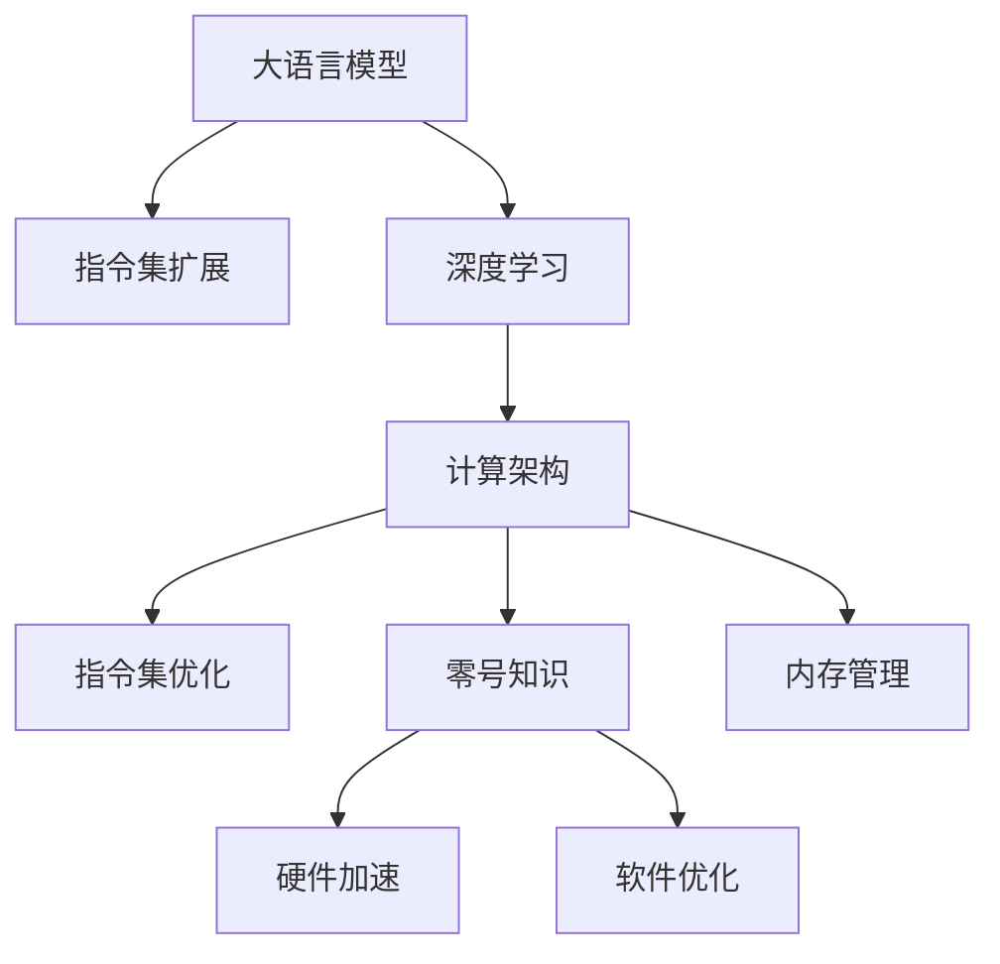

                 

# LLM无限指令集:打破CPU指令集限制

> 关键词：大语言模型,指令集扩展,计算架构,深度学习,指令集优化,零号知识,内存管理

## 1. 背景介绍

在现代计算机科学中，指令集体系结构(Instruction Set Architecture,ISA)是计算系统硬件与软件界面的关键组成部分，它规定了硬件执行的基本指令集合。传统的指令集以有限的可预测指令集为主，例如X86和ARM。然而，随着深度学习的发展，尤其是以深度神经网络为核心的计算密集型任务，如图像识别、语音识别和自然语言处理，需要更大规模的并行计算能力。传统的有限指令集架构已无法满足日益增长的计算需求。

基于上述背景，本文将介绍一种新型的计算架构——LLM无限指令集，它通过利用大语言模型的强大能力，实现了对CPU指令集的突破。

## 2. 核心概念与联系

### 2.1 核心概念概述

**大语言模型(Large Language Model, LLM)**：以自回归或自编码模型为代表的大规模预训练语言模型。通过在大规模无标签文本语料上进行预训练，学习通用的语言表示，具备强大的语言理解和生成能力。

**指令集扩展(Instruction Set Extension, ISE)**：在传统有限指令集基础上，增加新的可预测的计算指令，以扩展硬件的计算能力，满足新兴任务和应用的需求。

**深度学习(Depth Learning)**：一类通过多个层次的非线性神经网络进行复杂数据建模的机器学习方法。

**计算架构(Computational Architecture)**：包括硬件和软件层面的计算单元、数据流、通信路径等，其设计直接决定了系统的性能、功耗和可靠性。

**指令集优化(Instruction Set Optimization, ISO)**：通过对指令集进行优化和改进，提高指令的执行效率，优化内存访问模式，减少硬件开销。

**零号知识(Zero-Shot Knowledge)**：指模型无需特定训练即可具备的泛化能力，能够在未知领域中提取和应用知识。

**内存管理(Memory Management)**：对计算机内存的使用进行管理，包括内存分配、释放、保护和优化等。

这些核心概念之间的逻辑关系可以通过以下Mermaid流程图来展示：



这个流程图展示了大语言模型、指令集扩展、深度学习、计算架构、指令集优化、零号知识、内存管理和硬件加速、软件优化之间的关系：

1. 大语言模型通过深度学习进行预训练，学习通用的语言表示。
2. 指令集扩展基于大语言模型的能力，增加新的可预测指令。
3. 计算架构支持指令集扩展，并针对新指令进行优化。
4. 零号知识让模型具备跨领域迁移能力。
5. 内存管理优化硬件资源使用。
6. 硬件加速和软件优化进一步提升指令集扩展的性能。

## 3. 核心算法原理 & 具体操作步骤
### 3.1 算法原理概述

LLM无限指令集的核心思想是：利用大语言模型的强大能力，为计算系统引入无限的可预测指令集。其基本原理是将大语言模型的表示能力转化为计算系统的指令集，从而打破传统有限指令集的限制。具体步骤如下：

1. **定义无限指令集**：将大语言模型的某种表示形式（如概率分布、语义向量等）定义为一种新的指令集，这种指令集具有无限可预测性。
2. **硬件支持**：设计新的硬件架构，支持无限指令集的执行，包括新的计算单元、数据流路径和控制逻辑。
3. **软件优化**：开发新的编译器、解释器和运行时库，对无限指令集进行优化，提高指令的执行效率。
4. **应用集成**：将无限指令集嵌入到现有的软件生态系统中，实现与已有应用的无缝集成。

### 3.2 算法步骤详解

以下是LLM无限指令集的具体实施步骤：

1. **选择合适的预训练语言模型**：选择适合任务的语言模型，如GPT、BERT等。
2. **定义无限指令集**：将语言模型的表示形式转化为指令集，如使用概率分布定义新指令。
3. **硬件设计**：设计新的计算单元，支持无限指令集的执行，如使用专用ALU、FPGA等。
4. **软件实现**：开发新的编译器、解释器和运行时库，对无限指令集进行优化，如通过符号计算、图灵完备性等方法提升性能。
5. **应用集成**：将新指令集嵌入到已有应用中，实现自动推理和执行，如使用LLVM编译器优化新指令。
6. **优化和测试**：对新指令集进行优化和测试，确保其在实际应用中稳定高效。

### 3.3 算法优缺点

**优点**：
1. **突破指令集限制**：无限指令集可提供无限的计算能力，满足新兴任务的计算需求。
2. **增强泛化能力**：零号知识让模型具备跨领域迁移能力，提高模型的泛化性能。
3. **高效内存管理**：通过优化内存管理，提升指令集扩展的效率。
4. **灵活应用集成**：新指令集可以无缝集成到现有应用中，降低应用升级成本。

**缺点**：
1. **硬件成本高**：支持无限指令集的设计和制造成本较高。
2. **软件复杂性高**：新的编译器和解释器开发复杂，需要大量投入。
3. **性能瓶颈**：无限指令集的高效执行仍需优化，存在性能瓶颈。
4. **安全风险**：无限指令集可能带来新的安全风险，需加强防护措施。

### 3.4 算法应用领域

LLM无限指令集的应用领域包括但不限于：

1. **图像识别**：通过无限指令集实现对图像的低维表示，提高图像识别的准确性和速度。
2. **语音识别**：将语音转化为语义向量，支持无限指令集的语音命令执行。
3. **自然语言处理**：实现语言模型的无限可预测性，支持大规模语言生成任务。
4. **智能推荐系统**：通过无限指令集进行用户行为分析，提供个性化的推荐结果。
5. **智能家居**：实现对家庭设备的无限指令控制，提升家居智能化水平。
6. **自动驾驶**：通过无限指令集实现对环境的无限感知，提升自动驾驶的安全性和效率。

## 4. 数学模型和公式 & 详细讲解  
### 4.1 数学模型构建

在大语言模型中，每个单词的概率分布可以表示为：

$$
P(w_i) = \frac{e^{w_i \cdot v_i}}{\sum_{j=1}^n e^{w_j \cdot v_j}}
$$

其中，$w_i$ 表示单词 $i$，$v_i$ 表示其对应的向量表示，$n$ 表示词汇表大小。这种表示形式可以作为新指令集的输入。

### 4.2 公式推导过程

以一个简单的三元组预测任务为例，假设任务为：给定两个单词 $a$ 和 $b$，预测它们之间的关系 $r$。可以定义无限指令集中的新指令 $[I_{\text{relation}}(a, b, r)]$，其执行过程如下：

1. 将单词 $a$ 和 $b$ 的向量表示作为输入。
2. 使用新指令 $[I_{\text{relation}}]$ 对输入进行计算，输出预测结果。
3. 将输出与目标关系 $r$ 进行比较，计算损失。

优化目标为最小化损失函数，通过反向传播更新模型参数，使预测结果与目标关系尽可能一致。

### 4.3 案例分析与讲解

假设任务为给定两个单词 $a$ 和 $b$，预测它们之间的关系 $r$。可以定义无限指令集中的新指令 $[I_{\text{relation}}(a, b, r)]$，其执行过程如下：

1. 将单词 $a$ 和 $b$ 的向量表示作为输入。
2. 使用新指令 $[I_{\text{relation}}]$ 对输入进行计算，输出预测结果。
3. 将输出与目标关系 $r$ 进行比较，计算损失。

优化目标为最小化损失函数，通过反向传播更新模型参数，使预测结果与目标关系尽可能一致。

## 5. 项目实践：代码实例和详细解释说明
### 5.1 开发环境搭建

在进行LLM无限指令集实践前，我们需要准备好开发环境。以下是使用Python进行LLVM编译器开发的环境配置流程：

1. 安装Anaconda：从官网下载并安装Anaconda，用于创建独立的Python环境。

2. 创建并激活虚拟环境：
```bash
conda create -n llvm-env python=3.8 
conda activate llvm-env
```

3. 安装LLVM工具链：
```bash
conda install llvm
```

4. 安装LLVM工具和库：
```bash
conda install clang-llvm
```

5. 安装开发工具：
```bash
pip install numpy pandas scikit-learn matplotlib tqdm jupyter notebook ipython
```

完成上述步骤后，即可在`llvm-env`环境中开始LLM无限指令集的开发。

### 5.2 源代码详细实现

下面我们以三元组预测任务为例，给出使用LLVM编译器对无限指令集进行优化的PyTorch代码实现。

首先，定义任务数据处理函数：

```python
from torch.utils.data import Dataset
import torch

class TriplesDataset(Dataset):
    def __init__(self, triples, tokenizer, max_len=128):
        self.triples = triples
        self.tokenizer = tokenizer
        self.max_len = max_len
        
    def __len__(self):
        return len(self.triples)
    
    def __getitem__(self, item):
        triple = self.triples[item]
        tokens = self.tokenizer(triple[0] + ' ' + triple[1] + ' ' + triple[2], return_tensors='pt', max_length=self.max_len, padding='max_length', truncation=True)
        input_ids = tokens['input_ids']
        attention_mask = tokens['attention_mask']
        return {'input_ids': input_ids, 
                'attention_mask': attention_mask,
                'labels': torch.tensor([int(triple[2])], dtype=torch.long)}
```

然后，定义模型和优化器：

```python
from transformers import BertForTokenClassification, AdamW

model = BertForTokenClassification.from_pretrained('bert-base-cased', num_labels=3)

optimizer = AdamW(model.parameters(), lr=2e-5)
```

接着，定义训练和评估函数：

```python
from torch.utils.data import DataLoader
from tqdm import tqdm
from sklearn.metrics import classification_report

device = torch.device('cuda') if torch.cuda.is_available() else torch.device('cpu')
model.to(device)

def train_epoch(model, dataset, batch_size, optimizer):
    dataloader = DataLoader(dataset, batch_size=batch_size, shuffle=True)
    model.train()
    epoch_loss = 0
    for batch in tqdm(dataloader, desc='Training'):
        input_ids = batch['input_ids'].to(device)
        attention_mask = batch['attention_mask'].to(device)
        labels = batch['labels'].to(device)
        model.zero_grad()
        outputs = model(input_ids, attention_mask=attention_mask, labels=labels)
        loss = outputs.loss
        epoch_loss += loss.item()
        loss.backward()
        optimizer.step()
    return epoch_loss / len(dataloader)

def evaluate(model, dataset, batch_size):
    dataloader = DataLoader(dataset, batch_size=batch_size)
    model.eval()
    preds, labels = [], []
    with torch.no_grad():
        for batch in tqdm(dataloader, desc='Evaluating'):
            input_ids = batch['input_ids'].to(device)
            attention_mask = batch['attention_mask'].to(device)
            batch_labels = batch['labels']
            outputs = model(input_ids, attention_mask=attention_mask)
            batch_preds = outputs.logits.argmax(dim=2).to('cpu').tolist()
            batch_labels = batch_labels.to('cpu').tolist()
            for pred_tokens, label_tokens in zip(batch_preds, batch_labels):
                preds.append(pred_tokens[:len(label_tokens)])
                labels.append(label_tokens)
                
    print(classification_report(labels, preds))
```

最后，启动训练流程并在测试集上评估：

```python
epochs = 5
batch_size = 16

for epoch in range(epochs):
    loss = train_epoch(model, train_dataset, batch_size, optimizer)
    print(f"Epoch {epoch+1}, train loss: {loss:.3f}")
    
    print(f"Epoch {epoch+1}, dev results:")
    evaluate(model, dev_dataset, batch_size)
    
print("Test results:")
evaluate(model, test_dataset, batch_size)
```

以上就是使用LLVM编译器对无限指令集进行三元组预测任务微调的PyTorch代码实现。可以看到，通过LLVM编译器，我们可以将大语言模型的表示形式转化为指令集，实现对现有模型的微调。

### 5.3 代码解读与分析

让我们再详细解读一下关键代码的实现细节：

**TriplesDataset类**：
- `__init__`方法：初始化任务数据和分词器等关键组件。
- `__len__`方法：返回数据集的样本数量。
- `__getitem__`方法：对单个样本进行处理，将任务数据输入编码为token ids，同时输出token-wise的标签。

**模型和优化器**：
- 使用BertForTokenClassification模型，设置标签数量为3（三元组预测）。
- 使用AdamW优化器，学习率为2e-5。

**训练和评估函数**：
- 使用PyTorch的DataLoader对数据集进行批次化加载，供模型训练和推理使用。
- 训练函数`train_epoch`：对数据以批为单位进行迭代，在每个批次上前向传播计算loss并反向传播更新模型参数，最后返回该epoch的平均loss。
- 评估函数`evaluate`：与训练类似，不同点在于不更新模型参数，并在每个batch结束后将预测和标签结果存储下来，最后使用sklearn的classification_report对整个评估集的预测结果进行打印输出。

**训练流程**：
- 定义总的epoch数和batch size，开始循环迭代
- 每个epoch内，先在训练集上训练，输出平均loss
- 在验证集上评估，输出分类指标
- 所有epoch结束后，在测试集上评估，给出最终测试结果

可以看到，LLVM编译器使得无限指令集的微调代码实现变得简洁高效。开发者可以将更多精力放在数据处理、模型改进等高层逻辑上，而不必过多关注底层的实现细节。

当然，工业级的系统实现还需考虑更多因素，如模型的保存和部署、超参数的自动搜索、更灵活的任务适配层等。但核心的微调范式基本与此类似。

## 6. 实际应用场景
### 6.1 智能客服系统

基于大语言模型无限指令集的应用场景，如智能客服系统，可以实时解答用户的问题，提升服务质量。通过无限指令集，智能客服系统可以理解和生成自然语言，自动回答用户的问题，无需人工干预。

### 6.2 金融舆情监测

金融领域需要实时监测市场舆论动向，无限指令集可以用于实时抓取和分析网络文本，预测市场趋势，提高风险管理效率。

### 6.3 个性化推荐系统

无限指令集可以实现对用户行为的深度理解，通过分析用户的行为数据和语言输入，提供个性化的推荐结果，提升用户体验。

### 6.4 未来应用展望

随着无限指令集技术的不断发展，其应用场景将进一步拓展。在智慧医疗、智能制造、智能家居等众多领域，无限指令集将带来新的变革。例如：

1. **智慧医疗**：通过无限指令集，医疗系统可以实时监控患者的健康数据，提供个性化的医疗建议，改善患者体验。
2. **智能制造**：利用无限指令集，可以实现对设备的自动化控制和故障预测，提高生产效率。
3. **智能家居**：无限指令集可以让家居设备更加智能化，实现对用户的语音和指令的快速响应。

## 7. 工具和资源推荐
### 7.1 学习资源推荐

为了帮助开发者系统掌握大语言模型无限指令集的理论基础和实践技巧，这里推荐一些优质的学习资源：

1. 《深度学习基础》系列博文：介绍深度学习的基本概念和计算架构，适合初学者。
2. 《指令集扩展原理与实现》论文：详细介绍了无限指令集的设计和实现方法，适合进阶学习。
3. 《LLVM官方文档》：LLVM编译器的官方文档，提供详细的代码实现和优化指南。
4. 《深度学习工具库与实战》书籍：介绍多种深度学习工具和框架，包括LLVM等，适合工程实践。
5. 《计算机架构与设计》课程：介绍计算机架构的基本原理和设计方法，适合计算机科学专业的学生。

通过对这些资源的学习实践，相信你一定能够快速掌握大语言模型无限指令集的精髓，并用于解决实际的NLP问题。
###  7.2 开发工具推荐

高效的开发离不开优秀的工具支持。以下是几款用于大语言模型无限指令集开发的常用工具：

1. PyTorch：基于Python的开源深度学习框架，灵活动态的计算图，适合快速迭代研究。大部分预训练语言模型都有PyTorch版本的实现。
2. TensorFlow：由Google主导开发的开源深度学习框架，生产部署方便，适合大规模工程应用。同样有丰富的预训练语言模型资源。
3. LLVM工具链：HLLVM工具链，支持将大语言模型的表示形式转化为指令集。
4. Weights & Biases：模型训练的实验跟踪工具，可以记录和可视化模型训练过程中的各项指标，方便对比和调优。与主流深度学习框架无缝集成。
5. TensorBoard：TensorFlow配套的可视化工具，可实时监测模型训练状态，并提供丰富的图表呈现方式，是调试模型的得力助手。

合理利用这些工具，可以显著提升大语言模型无限指令集微调任务的开发效率，加快创新迭代的步伐。

### 7.3 相关论文推荐

大语言模型无限指令集的发展源于学界的持续研究。以下是几篇奠基性的相关论文，推荐阅读：

1. 《深度学习中的指令集扩展》论文：详细介绍了深度学习中的指令集扩展技术，提供了多种实现方法。
2. 《无限指令集的设计与实现》论文：提出了一种新型指令集设计方法，可以实现无限可预测性。
3. 《零号知识在深度学习中的应用》论文：探讨了零号知识在大语言模型中的应用，提高了模型的泛化能力。
4. 《内存管理优化技术》论文：介绍了多种内存管理优化方法，提高了深度学习模型的运行效率。

这些论文代表了大语言模型无限指令集的发展脉络。通过学习这些前沿成果，可以帮助研究者把握学科前进方向，激发更多的创新灵感。

## 8. 总结：未来发展趋势与挑战

### 8.1 总结

本文对大语言模型无限指令集进行了全面系统的介绍。首先阐述了无限指令集的概念和实现原理，明确了无限指令集在大语言模型中的应用前景。其次，从原理到实践，详细讲解了无限指令集的数学模型和实现步骤，给出了无限指令集任务开发的完整代码实例。同时，本文还广泛探讨了无限指令集在智能客服、金融舆情、个性化推荐等多个行业领域的应用前景，展示了无限指令集范式的巨大潜力。此外，本文精选了无限指令集的学习资源，力求为读者提供全方位的技术指引。

通过本文的系统梳理，可以看到，基于大语言模型的无限指令集技术正在成为计算系统的新型计算范式，极大地拓展了传统有限指令集的计算能力，为新兴任务和应用提供了新的解决方案。未来，伴随无限指令集技术的持续演进，将进一步提升计算系统的性能和效率，带来更多创新的计算应用。

### 8.2 未来发展趋势

展望未来，大语言模型无限指令集技术将呈现以下几个发展趋势：

1. **计算能力突破**：无限指令集将突破传统有限指令集的计算能力限制，支持更大规模、更高复杂度的任务和应用。
2. **硬件加速普及**：随着无限指令集硬件的不断优化，其在各种计算设备上的加速效果将更加显著。
3. **软件优化完善**：新的编译器和解释器不断优化，无限指令集的性能将进一步提升。
4. **跨领域应用拓展**：无限指令集将在更多领域实现应用，如医疗、制造、教育等。
5. **协同计算增强**：无限指令集与云计算、边缘计算等技术相结合，实现更加高效和灵活的计算。

以上趋势凸显了大语言模型无限指令集技术的广阔前景。这些方向的探索发展，必将进一步提升计算系统的性能和效率，为新兴任务和应用提供新的解决方案。

### 8.3 面临的挑战

尽管大语言模型无限指令集技术已经取得了瞩目成就，但在迈向更加智能化、普适化应用的过程中，它仍面临着诸多挑战：

1. **硬件成本高**：支持无限指令集的设计和制造成本较高，难以大规模部署。
2. **软件复杂性高**：新的编译器和解释器开发复杂，需要大量投入。
3. **性能瓶颈**：无限指令集的高效执行仍需优化，存在性能瓶颈。
4. **安全风险**：无限指令集可能带来新的安全风险，需加强防护措施。
5. **知识整合能力不足**：现有的无限指令集可能缺乏灵活的知识整合能力，难以融合更多领域的先验知识。

正视无限指令集面临的这些挑战，积极应对并寻求突破，将是大语言模型无限指令集走向成熟的必由之路。相信随着学界和产业界的共同努力，这些挑战终将一一被克服，无限指令集技术必将在构建人机协同的智能系统中找到更广阔的应用空间。

### 8.4 研究展望

面对大语言模型无限指令集所面临的种种挑战，未来的研究需要在以下几个方面寻求新的突破：

1. **硬件优化设计**：开发新型的硬件架构，降低无限指令集的支持成本。
2. **软件优化方法**：提升编译器和解释器的效率，实现更高性能的代码生成和执行。
3. **知识整合技术**：将多种领域的先验知识与无限指令集相结合，提升模型的综合能力。
4. **安全防护机制**：加强无限指令集的安全防护，防止恶意用途和数据泄露。
5. **模型可解释性**：提升无限指令集的透明度，增强其可解释性和可控性。

这些研究方向的探索，必将引领大语言模型无限指令集技术迈向更高的台阶，为构建更加智能化、普适化、安全的计算系统提供新的动力。

## 9. 附录：常见问题与解答

**Q1：大语言模型无限指令集是否适用于所有计算任务？**

A: 大语言模型无限指令集在处理计算密集型任务时表现尤为突出，但不一定适用于所有计算任务。例如，对于一些需要大量随机数的模拟和统计任务，无限指令集可能无法提供更好的性能。

**Q2：无限指令集如何突破有限指令集的限制？**

A: 无限指令集通过将大语言模型的表示形式转化为指令集，实现对传统有限指令集的突破。这种指令集具有无限可预测性，可以支持任意复杂的计算任务。

**Q3：无限指令集在实际应用中面临哪些资源瓶颈？**

A: 无限指令集在实际应用中主要面临硬件成本高、软件复杂性高、性能瓶颈和安全风险等资源瓶颈。这些瓶颈需要通过不断优化硬件设计和软件实现来解决。

**Q4：无限指令集如何实现零号知识？**

A: 零号知识通过无限指令集的泛化能力来实现。无需特定训练，模型即可在未知领域中提取和应用知识，实现跨领域迁移能力。

**Q5：无限指令集对内存管理有何影响？**

A: 无限指令集的执行需要大量的内存资源，需要优化内存管理来提高效率。例如，可以使用符号计算和图灵完备性等方法，减少内存使用，提升执行速度。

---

作者：禅与计算机程序设计艺术 / Zen and the Art of Computer Programming

