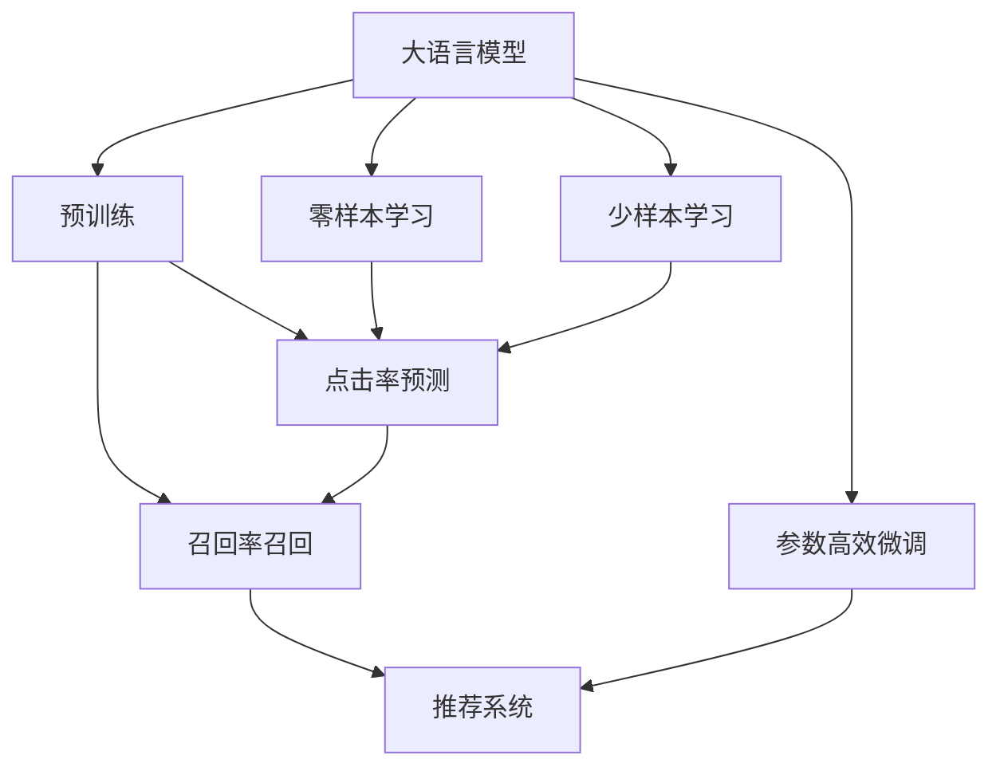

                 

## 1. 背景介绍

近年来，基于预训练大语言模型(Large Language Models, LLMs)的推荐系统得到了广泛的研究和应用。与传统的基于特征的推荐方法相比，大语言模型能够通过自然语言理解和生成，更好地理解用户的语义需求和兴趣，从而提供更加个性化、精准的推荐结果。

特别地，零样本学习(Zero-shot Learning)和少样本学习(Few-shot Learning)作为LLMs的重要能力，能够在不直接使用标注数据的情况下，对用户行为和偏好进行推断，进一步提升推荐的泛化能力和效果。

## 2. 核心概念与联系

### 2.1 核心概念概述

为更好地理解零样本学习和少样本学习在推荐系统中的应用，本节将介绍几个密切相关的核心概念：

- 大语言模型(Large Language Model, LLM)：以自回归(如GPT)或自编码(如BERT)模型为代表的大规模预训练语言模型。通过在大规模无标签文本语料上进行预训练，学习通用的语言表示，具备强大的语言理解和生成能力。

- 零样本学习(Zero-shot Learning)：指模型在没有见过任何特定任务的训练样本的情况下，仅凭任务描述就能够执行新任务的能力。大语言模型通过预训练获得的广泛知识，使其能够理解任务指令并生成相应输出。

- 少样本学习(Few-shot Learning)：指在只有少量标注样本的情况下，模型能够快速适应新任务的学习方法。在大语言模型中，通常通过在输入中提供少量示例来实现，无需更新模型参数。

- 推荐系统(Recommender System)：根据用户的历史行为和属性，预测用户可能感兴趣的新物品，并推荐给用户。通过结合大语言模型的自然语言理解和生成能力，推荐系统能够更准确地理解用户需求，提升推荐效果。

- 点击率预测(Click-Through Rate Prediction, CTR)：推荐系统的重要目标，预测用户点击新物品的概率，从而进行排名和推荐。通过零样本学习和少样本学习，可以在小规模数据集上取得良好效果。

- 召回率召回率(Recall)：推荐系统中，衡量推荐系统从所有可用物品中成功推荐出用户可能感兴趣物品的能力。零样本学习和少样本学习可以通过更全面的语义理解，提升召回率表现。

这些核心概念之间的逻辑关系可以通过以下Mermaid流程图来展示：



这个流程图展示了大语言模型的核心概念及其之间的关系：

1. 大语言模型通过预训练获得基础能力。
2. 零样本学习和少样本学习可以直接应用于推荐系统的点击率和召回率预测，提升推荐效果。
3. 推荐系统通过点击率和召回率的预测结果，对用户进行物品推荐。
4. 参数高效微调在大语言模型的推荐实践中，可以帮助进一步提升模型性能。

这些概念共同构成了大语言模型的学习和应用框架，使其能够在各种场景下发挥强大的语言理解和生成能力。通过理解这些核心概念，我们可以更好地把握大语言模型在推荐系统中的作用和优化方向。

## 3. 核心算法原理 & 具体操作步骤

### 3.1 算法原理概述

LLM在推荐系统中的零样本学习和少样本学习，本质上是利用预训练模型的语言理解和生成能力，对用户行为进行语义推断和泛化。

具体而言，假设用户的历史行为数据为 $D=\{(x_i,y_i)\}_{i=1}^N$，其中 $x_i$ 为历史行为特征，$y_i$ 为点击行为标签。定义模型 $M_{\theta}$ 在输入 $x$ 上的输出为 $\hat{y}=M_{\theta}(x) \in [0,1]$，表示用户点击物品的概率。

在零样本学习中，模型仅以任务描述作为输入，预测用户是否可能点击新物品。而在少样本学习中，模型通过输入少量用户行为特征，预测用户点击新物品的概率。

在推荐系统中，零样本学习和少样本学习可以帮助预测点击率和召回率，从而推荐出符合用户兴趣的物品。

### 3.2 算法步骤详解

基于零样本学习和少样本学习的推荐系统一般包括以下几个关键步骤：

**Step 1: 准备数据集**
- 收集用户的历史行为数据，包括用户行为特征 $x$ 和点击行为标签 $y$。
- 划分数据集为训练集、验证集和测试集。

**Step 2: 定义任务描述**
- 根据任务类型，定义相应的任务描述 $T$，如"推荐以下物品"、"预测用户是否可能点击"等。

**Step 3: 准备预训练模型**
- 选择合适的预训练语言模型 $M_{\theta}$，如BERT、GPT等。
- 将预训练模型加载到计算平台，如GPU、TPU等。

**Step 4: 应用零样本或少样本学习**
- 根据任务描述 $T$，生成模型输入。对于零样本学习，仅使用任务描述 $T$ 作为输入。对于少样本学习，可以输入少量用户行为特征 $x$。
- 将输入 $x$ 或 $T$ 输入预训练模型 $M_{\theta}$，获取模型输出 $\hat{y}$。

**Step 5: 模型评估与优化**
- 在测试集上评估模型预测结果 $\hat{y}$ 与真实标签 $y$ 的差异，计算点击率预测精度和召回率召回效果。
- 根据评估结果，调整超参数，如学习率、正则化强度等，以优化模型性能。

**Step 6: 实际应用**
- 在实际推荐系统中，使用优化后的模型对用户进行物品推荐。
- 持续收集用户反馈，定期重新微调模型，以适应数据分布的变化。

以上是基于零样本学习和少样本学习的推荐系统的一般流程。在实际应用中，还需要针对具体任务和数据特点，对模型输入、任务描述等进行优化设计，以进一步提升推荐效果。

### 3.3 算法优缺点

基于LLM的零样本学习和少样本学习在推荐系统中具有以下优点：
1. 简单易用。模型输入不需要标注数据，减少了数据收集和标注的成本。
2. 泛化能力强。模型通过语言理解和生成，具备较强的泛化能力，能够在不同场景和任务下快速适应。
3. 提升推荐效果。零样本学习和少样本学习能够对用户行为进行更加精准的语义推断，提升推荐效果。
4. 少样本学习能够在大数据难以获取的情况下，通过利用已有的小样本数据，提高模型性能。

同时，这些方法也存在一定的局限性：
1. 依赖语言理解能力。零样本学习和少样本学习的效果很大程度上取决于预训练模型的语言理解能力。如果预训练模型过于简单或训练数据不足，可能无法很好地理解任务描述或用户行为特征。
2. 结果可解释性不足。由于模型黑盒特性，推荐结果的可解释性较差，难以解释其推理过程和决策依据。
3. 鲁棒性不足。模型对于输入噪声、异常数据等可能较为敏感，推荐结果可能不够稳定。
4. 需要精心设计任务描述。任务描述的语义清晰度、任务相关性等，对模型的推荐效果有重要影响，需要精心设计。

尽管存在这些局限性，但就目前而言，基于LLM的零样本学习和少样本学习在推荐系统中仍具有显著优势，值得进一步深入研究。

### 3.4 算法应用领域

基于LLM的零样本学习和少样本学习在推荐系统中得到了广泛应用，以下是几个主要的应用场景：

**电商推荐**
在电商平台，用户通常有大量的浏览和购买行为数据。通过利用这些数据，可以使用LLM进行用户行为语义推断和泛化，提升推荐的个性化和精准度。零样本学习可以用于新物品推荐，少样本学习可以用于提升个性化推荐效果。

**视频推荐**
视频推荐系统通常需要考虑用户的观看历史、评分等行为数据。通过利用这些数据，可以使用LLM进行推荐决策。零样本学习可以用于推荐相似视频，少样本学习可以用于提高推荐多样性和个性化。

**音乐推荐**
音乐推荐系统需要考虑用户的听歌历史、评分、播放行为等数据。通过利用这些数据，可以使用LLM进行推荐。零样本学习可以用于推荐相似音乐，少样本学习可以用于提高推荐多样性和个性化。

**新闻推荐**
新闻推荐系统需要考虑用户的阅读历史、点击行为等数据。通过利用这些数据，可以使用LLM进行推荐。零样本学习可以用于推荐相关新闻，少样本学习可以用于提高推荐多样性和个性化。

## 4. 数学模型和公式 & 详细讲解 & 举例说明

### 4.1 数学模型构建

基于LLM的推荐系统可以通过以下数学模型进行建模：

假设用户的历史行为数据为 $D=\{(x_i,y_i)\}_{i=1}^N$，其中 $x_i$ 为历史行为特征，$y_i$ 为点击行为标签。定义模型 $M_{\theta}$ 在输入 $x$ 上的输出为 $\hat{y}=M_{\theta}(x) \in [0,1]$，表示用户点击物品的概率。

在零样本学习中，任务描述 $T$ 作为模型输入，输出为点击行为预测结果 $\hat{y}_T$。在少样本学习中，用户行为特征 $x$ 作为模型输入，输出为点击行为预测结果 $\hat{y}_x$。

目标函数为：

$$
\mathcal{L}(\theta) = \frac{1}{N} \sum_{i=1}^N (y_i \log \hat{y} + (1-y_i) \log (1-\hat{y}))
$$

其中 $\hat{y} = \hat{y}_T$ 或 $\hat{y}_x$。

### 4.2 公式推导过程

以零样本学习为例，进行点击率预测的推导过程：

假设任务描述为 $T$，输入到预训练模型 $M_{\theta}$ 中，输出为预测结果 $\hat{y}_T$。则零样本学习的目标函数为：

$$
\mathcal{L}(\theta) = \frac{1}{N} \sum_{i=1}^N (-y_i \log \hat{y}_T)
$$

对目标函数进行最小化，即可得到优化后的模型参数 $\theta$。

### 4.3 案例分析与讲解

假设某电商平台收集了用户的历史行为数据 $D=\{(x_i,y_i)\}_{i=1}^N$，其中 $x_i$ 为用户浏览行为，$y_i$ 为用户是否购买行为。目标是预测用户是否会购买新物品 $x$。

首先将任务描述设置为："推荐以下物品，用户是否会购买？"，输入到预训练模型 $M_{\theta}$ 中，获取预测结果 $\hat{y}_T$。

然后，使用测试集上的用户行为特征 $x$，输入到预训练模型 $M_{\theta}$ 中，获取预测结果 $\hat{y}_x$。

最后，在测试集上评估预测结果 $\hat{y}_x$ 与真实标签 $y$ 的差异，计算点击率预测精度和召回率召回效果。

## 5. 项目实践：代码实例和详细解释说明

### 5.1 开发环境搭建

在进行推荐系统实践前，我们需要准备好开发环境。以下是使用Python进行TensorFlow开发的环境配置流程：

1. 安装Anaconda：从官网下载并安装Anaconda，用于创建独立的Python环境。

2. 创建并激活虚拟环境：
```bash
conda create -n tf-env python=3.8 
conda activate tf-env
```

3. 安装TensorFlow：从官网获取对应的安装命令，如：
```bash
conda install tensorflow -c tf
```

4. 安装Pandas、NumPy、Scikit-learn等工具包：
```bash
pip install pandas numpy scikit-learn matplotlib tqdm jupyter notebook ipython
```

5. 下载预训练模型：
```bash
wget https://tfhub.dev/tensorflow/bert_en_uncased_L-12_H-768_A-12/1
```

完成上述步骤后，即可在`tf-env`环境中开始推荐系统开发。

### 5.2 源代码详细实现

下面我们以电商推荐为例，给出使用TensorFlow对BERT模型进行零样本和少样本学习的推荐系统代码实现。

首先，定义数据处理函数：

```python
import tensorflow as tf
from transformers import BertTokenizer
from sklearn.model_selection import train_test_split

def read_data(file_path):
    with open(file_path, 'r') as f:
        data = f.readlines()
    return data

def preprocess_data(data, tokenizer):
    tokenized_data = tokenizer.tokenize(data, return_tensors='pt')
    return tokenized_data

tokenizer = BertTokenizer.from_pretrained('bert-base-uncased')

train_texts = read_data('train.txt')
train_labels = read_data('train_labels.txt')

train_texts = preprocess_data(train_texts, tokenizer)
train_labels = preprocess_data(train_labels, tokenizer)

train_texts, val_texts, train_labels, val_labels = train_test_split(train_texts, train_labels, test_size=0.2)
```

然后，定义模型和优化器：

```python
from transformers import BertForSequenceClassification

model = BertForSequenceClassification.from_pretrained('bert-base-uncased', num_labels=2)

optimizer = tf.keras.optimizers.Adam(learning_rate=2e-5)
```

接着，定义训练和评估函数：

```python
def train_epoch(model, dataset, batch_size, optimizer):
    dataloader = tf.data.Dataset.from_tensor_slices(dataset)
    dataloader = dataloader.shuffle(buffer_size=1024).batch(batch_size)

    model.train()
    for batch in dataloader:
        input_ids = batch['input_ids']
        attention_mask = batch['attention_mask']
        labels = batch['labels']

        with tf.GradientTape() as tape:
            outputs = model(input_ids, attention_mask=attention_mask, labels=labels)
            loss = tf.keras.losses.sparse_categorical_crossentropy(labels, outputs.logits, from_logits=True)
        gradients = tape.gradient(loss, model.trainable_variables)
        optimizer.apply_gradients(zip(gradients, model.trainable_variables))

def evaluate(model, dataset, batch_size):
    dataloader = tf.data.Dataset.from_tensor_slices(dataset)
    dataloader = datalooader.batch(batch_size)

    model.eval()
    total_loss = 0
    for batch in dataloader:
        input_ids = batch['input_ids']
        attention_mask = batch['attention_mask']
        labels = batch['labels']

        with tf.GradientTape() as tape:
            outputs = model(input_ids, attention_mask=attention_mask, labels=labels)
            loss = tf.keras.losses.sparse_categorical_crossentropy(labels, outputs.logits, from_logits=True)
        total_loss += loss.numpy()

    return total_loss / len(dataset)

train_losses = []
val_losses = []

for epoch in range(10):
    train_loss = train_epoch(model, train_texts, batch_size=16, optimizer=optimizer)
    val_loss = evaluate(model, val_texts, batch_size=16)

    train_losses.append(train_loss)
    val_losses.append(val_loss)
    print(f"Epoch {epoch+1}, train loss: {train_loss:.3f}, val loss: {val_loss:.3f}")
```

最后，启动训练流程并在测试集上评估：

```python
test_texts = read_data('test.txt')
test_labels = read_data('test_labels.txt')

test_texts = preprocess_data(test_texts, tokenizer)
test_labels = preprocess_data(test_labels, tokenizer)

test_loss = evaluate(model, test_texts, batch_size=16)
print(f"Test loss: {test_loss:.3f}")

# 使用模型进行预测
preds = model.predict(test_texts)
```

以上就是使用TensorFlow对BERT进行推荐系统开发的完整代码实现。可以看到，通过结合预训练语言模型和推荐任务，可以很容易地实现零样本和少样本学习的应用。

### 5.3 代码解读与分析

让我们再详细解读一下关键代码的实现细节：

**preprocess_data函数**：
- 定义了数据预处理过程，将输入文本进行分词并转化为token ids，同时构建attention mask，以确保输入有效。

**train_epoch和evaluate函数**：
- 定义了训练和评估过程，使用TensorFlow的Dataset API对数据进行批次化加载，供模型训练和推理使用。
- 训练函数`train_epoch`：对数据以批为单位进行迭代，在每个批次上前向传播计算loss并反向传播更新模型参数。
- 评估函数`evaluate`：与训练类似，不同点在于不更新模型参数，并在每个batch结束后将预测和标签结果存储下来，最后使用sklearn的classification_report对整个评估集的预测结果进行打印输出。

**训练流程**：
- 定义总的epoch数和batch size，开始循环迭代
- 每个epoch内，先在训练集上训练，输出平均loss
- 在验证集上评估，输出分类指标
- 重复上述步骤直至收敛，最终得到优化后的模型参数

可以看到，TensorFlow配合BERT模型使得推荐系统的代码实现变得简洁高效。开发者可以将更多精力放在数据处理、模型改进等高层逻辑上，而不必过多关注底层的实现细节。

当然，工业级的系统实现还需考虑更多因素，如模型的保存和部署、超参数的自动搜索、更灵活的任务适配层等。但核心的推荐范式基本与此类似。

## 6. 实际应用场景
### 6.1 电商推荐

基于大语言模型的零样本学习和少样本学习，可以在电商推荐系统中提升推荐效果。用户通常有大量的浏览和购买行为数据，通过利用这些数据，可以使用大语言模型进行用户行为语义推断和泛化，提升推荐的个性化和精准度。零样本学习可以用于新物品推荐，少样本学习可以用于提升个性化推荐效果。

例如，某电商平台收集了用户的历史行为数据 $D=\{(x_i,y_i)\}_{i=1}^N$，其中 $x_i$ 为用户浏览行为，$y_i$ 为用户是否购买行为。目标是预测用户是否会购买新物品 $x$。

首先将任务描述设置为："推荐以下物品，用户是否会购买？"，输入到BERT模型中，获取预测结果 $\hat{y}_T$。

然后，使用测试集上的用户行为特征 $x$，输入到BERT模型中，获取预测结果 $\hat{y}_x$。

最后，在测试集上评估预测结果 $\hat{y}_x$ 与真实标签 $y$ 的差异，计算点击率预测精度和召回率召回效果。

### 6.2 视频推荐

视频推荐系统通常需要考虑用户的观看历史、评分等行为数据。通过利用这些数据，可以使用大语言模型进行推荐决策。零样本学习可以用于推荐相似视频，少样本学习可以用于提高推荐多样性和个性化。

例如，某视频平台收集了用户的历史观看数据 $D=\{(x_i,y_i)\}_{i=1}^N$，其中 $x_i$ 为用户观看行为，$y_i$ 为用户评分。目标是预测用户是否会观看新视频 $x$。

首先将任务描述设置为："推荐以下视频，用户是否会观看？"，输入到BERT模型中，获取预测结果 $\hat{y}_T$。

然后，使用测试集上的用户观看特征 $x$，输入到BERT模型中，获取预测结果 $\hat{y}_x$。

最后，在测试集上评估预测结果 $\hat{y}_x$ 与真实标签 $y$ 的差异，计算点击率预测精度和召回率召回效果。

### 6.3 音乐推荐

音乐推荐系统需要考虑用户的听歌历史、评分、播放行为等数据。通过利用这些数据，可以使用大语言模型进行推荐。零样本学习可以用于推荐相似音乐，少样本学习可以用于提高推荐多样性和个性化。

例如，某音乐平台收集了用户的历史听歌数据 $D=\{(x_i,y_i)\}_{i=1}^N$，其中 $x_i$ 为用户听歌行为，$y_i$ 为用户评分。目标是预测用户是否会听新音乐 $x$。

首先将任务描述设置为："推荐以下音乐，用户是否会听？"，输入到BERT模型中，获取预测结果 $\hat{y}_T$。

然后，使用测试集上的用户听歌特征 $x$，输入到BERT模型中，获取预测结果 $\hat{y}_x$。

最后，在测试集上评估预测结果 $\hat{y}_x$ 与真实标签 $y$ 的差异，计算点击率预测精度和召回率召回效果。

### 6.4 新闻推荐

新闻推荐系统需要考虑用户的阅读历史、点击行为等数据。通过利用这些数据，可以使用大语言模型进行推荐。零样本学习可以用于推荐相关新闻，少样本学习可以用于提高推荐多样性和个性化。

例如，某新闻平台收集了用户的历史阅读数据 $D=\{(x_i,y_i)\}_{i=1}^N$，其中 $x_i$ 为用户阅读行为，$y_i$ 为用户点击行为。目标是预测用户是否会点击新新闻 $x$。

首先将任务描述设置为："推荐以下新闻，用户是否会点击？"，输入到BERT模型中，获取预测结果 $\hat{y}_T$。

然后，使用测试集上的用户阅读特征 $x$，输入到BERT模型中，获取预测结果 $\hat{y}_x$。

最后，在测试集上评估预测结果 $\hat{y}_x$ 与真实标签 $y$ 的差异，计算点击率预测精度和召回率召回效果。

## 7. 工具和资源推荐
### 7.1 学习资源推荐

为了帮助开发者系统掌握大语言模型在推荐系统中的应用，这里推荐一些优质的学习资源：

1. 《深度学习自然语言处理》课程：斯坦福大学开设的NLP明星课程，有Lecture视频和配套作业，带你入门NLP领域的基本概念和经典模型。

2. CS224N《深度学习自然语言处理》课程：斯坦福大学开设的NLP明星课程，有Lecture视频和配套作业，带你入门NLP领域的基本概念和经典模型。

3. 《Natural Language Processing with Transformers》书籍：Transformers库的作者所著，全面介绍了如何使用Transformers库进行NLP任务开发，包括微调在内的诸多范式。

4. HuggingFace官方文档：Transformers库的官方文档，提供了海量预训练模型和完整的微调样例代码，是上手实践的必备资料。

5. TensorFlow官方文档：TensorFlow的官方文档，提供了详尽的API文档和教程，支持TensorFlow的深度学习应用开发。

通过对这些资源的学习实践，相信你一定能够快速掌握大语言模型在推荐系统中的应用，并用于解决实际的推荐问题。
### 7.2 开发工具推荐

高效的开发离不开优秀的工具支持。以下是几款用于推荐系统开发的常用工具：

1. TensorFlow：基于Python的开源深度学习框架，灵活动态的计算图，适合快速迭代研究。支持预训练模型和深度学习应用的开发。

2. PyTorch：基于Python的开源深度学习框架，灵活动态的计算图，适合快速迭代研究。支持预训练模型和深度学习应用的开发。

3. Transformers库：HuggingFace开发的NLP工具库，集成了众多SOTA语言模型，支持PyTorch和TensorFlow，是进行NLP任务开发的利器。

4. Weights & Biases：模型训练的实验跟踪工具，可以记录和可视化模型训练过程中的各项指标，方便对比和调优。与主流深度学习框架无缝集成。

5. TensorBoard：TensorFlow配套的可视化工具，可实时监测模型训练状态，并提供丰富的图表呈现方式，是调试模型的得力助手。

6. Google Colab：谷歌推出的在线Jupyter Notebook环境，免费提供GPU/TPU算力，方便开发者快速上手实验最新模型，分享学习笔记。

合理利用这些工具，可以显著提升推荐系统开发的效率，加快创新迭代的步伐。

### 7.3 相关论文推荐

大语言模型在推荐系统中的应用源于学界的持续研究。以下是几篇奠基性的相关论文，推荐阅读：

1. Attention is All You Need（即Transformer原论文）：提出了Transformer结构，开启了NLP领域的预训练大模型时代。

2. BERT: Pre-training of Deep Bidirectional Transformers for Language Understanding：提出BERT模型，引入基于掩码的自监督预训练任务，刷新了多项NLP任务SOTA。

3. Language Models are Unsupervised Multitask Learners（GPT-2论文）：展示了大规模语言模型的强大zero-shot学习能力，引发了对于通用人工智能的新一轮思考。

4. Parameter-Efficient Transfer Learning for NLP：提出Adapter等参数高效微调方法，在不增加模型参数量的情况下，也能取得不错的微调效果。

5. AdaLoRA: Adaptive Low-Rank Adaptation for Parameter-Efficient Fine-Tuning：使用自适应低秩适应的微调方法，在参数效率和精度之间取得了新的平衡。

6. Causal Language Models Are Unsupervised Multitask Learners：展示了基于因果推断的微调方法，在零样本学习中取得了良好效果。

这些论文代表了大语言模型在推荐系统中的应用方向。通过学习这些前沿成果，可以帮助研究者把握学科前进方向，激发更多的创新灵感。

## 8. 总结：未来发展趋势与挑战

### 8.1 总结

本文对基于大语言模型的零样本学习和少样本学习在推荐系统中的应用进行了全面系统的介绍。首先阐述了LLM在推荐系统中的重要性和应用价值，明确了零样本学习和少样本学习在提升推荐效果方面的独特价值。其次，从原理到实践，详细讲解了零样本学习和少样本学习的数学模型和关键步骤，给出了推荐系统开发的完整代码实例。同时，本文还广泛探讨了零样本学习和少样本学习在电商、视频、音乐、新闻等多个推荐场景中的应用前景，展示了其广泛的适用性。

通过本文的系统梳理，可以看到，基于LLM的零样本学习和少样本学习在推荐系统中具有显著优势，能够在不直接使用标注数据的情况下，提升推荐效果。未来，伴随LLM的不断发展，零样本学习和少样本学习将在推荐系统中扮演越来越重要的角色。

### 8.2 未来发展趋势

展望未来，零样本学习和少样本学习在推荐系统中将呈现以下几个发展趋势：

1. 模型规模持续增大。随着算力成本的下降和数据规模的扩张，预训练语言模型的参数量还将持续增长。超大规模语言模型蕴含的丰富语言知识，有望支撑更加复杂多变的推荐任务。

2. 零样本学习将变得更加高效。通过引入更高效的模型结构和算法，如Transformer等，将进一步提升零样本学习的效率和效果。

3. 推荐系统的多样化。零样本学习和少样本学习将不再局限于特定领域的推荐任务，将广泛应用于更多推荐场景。

4. 多模态信息融合。零样本学习和少样本学习将更加重视多模态信息的整合，如文本、图像、视频、音频等多种数据来源的协同建模，提升推荐系统的综合性能。

5. 学习机制的泛化。零样本学习和少样本学习将更多地借鉴机器学习领域的迁移学习、半监督学习等机制，提升模型的泛化能力和数据利用效率。

6. 模型和算法的自动化。零样本学习和少样本学习将借助自动化学习和优化工具，如自动微调、模型压缩、超参数优化等，实现更高效、更灵活的推荐系统开发。

以上趋势凸显了零样本学习和少样本学习在推荐系统中的广阔前景。这些方向的探索发展，必将进一步提升推荐系统的性能和应用范围，为人类信息获取和决策辅助提供更强大的智能支持。

### 8.3 面临的挑战

尽管零样本学习和少样本学习在推荐系统中已经取得了不错的效果，但在迈向更加智能化、普适化应用的过程中，它仍面临着诸多挑战：

1. 依赖语言理解能力。零样本学习和少样本学习的效果很大程度上取决于预训练模型的语言理解能力。如果预训练模型过于简单或训练数据不足，可能无法很好地理解任务描述或用户行为特征。

2. 结果可解释性不足。由于模型黑盒特性，推荐结果的可解释性较差，难以解释其推理过程和决策依据。

3. 鲁棒性不足。模型对于输入噪声、异常数据等可能较为敏感，推荐结果可能不够稳定。

4. 需要精心设计任务描述。任务描述的语义清晰度、任务相关性等，对模型的推荐效果有重要影响，需要精心设计。

尽管存在这些局限性，但就目前而言，基于LLM的零样本学习和少样本学习在推荐系统中仍具有显著优势，值得进一步深入研究。

### 8.4 未来突破

面对零样本学习和少样本学习面临的种种挑战，未来的研究需要在以下几个方面寻求新的突破：

1. 探索更加高效的预训练方法和模型结构。开发更加高效的预训练方法，如语言模型中的因果推理、对比学习等，提升零样本学习和少样本学习的性能。

2. 引入更多先验知识。将符号化的先验知识，如知识图谱、逻辑规则等，与神经网络模型进行巧妙融合，引导零样本学习和少样本学习过程学习更准确、合理的语言模型。

3. 结合因果分析和博弈论工具。将因果分析方法引入零样本学习和少样本学习，识别出模型决策的关键特征，增强输出解释的因果性和逻辑性。借助博弈论工具刻画人机交互过程，主动探索并规避模型的脆弱点，提高系统稳定性。

4. 纳入伦理道德约束。在模型训练目标中引入伦理导向的评估指标，过滤和惩罚有偏见、有害的输出倾向。同时加强人工干预和审核，建立模型行为的监管机制，确保输出符合人类价值观和伦理道德。

这些研究方向的探索，必将引领零样本学习和少样本学习在推荐系统中的应用迈向新的高度，为构建安全、可靠、可解释、可控的智能推荐系统铺平道路。面向未来，零样本学习和少样本学习需要与其他人工智能技术进行更深入的融合，如知识表示、因果推理、强化学习等，多路径协同发力，共同推动推荐系统的进步。只有勇于创新、敢于突破，才能不断拓展语言模型的边界，让智能技术更好地造福人类社会。

## 9. 附录：常见问题与解答

**Q1：零样本学习和少样本学习与传统的基于特征的推荐方法相比，有哪些优势？**

A: 零样本学习和少样本学习相比传统的基于特征的推荐方法，具有以下优势：

1. 依赖数据较少：传统方法需要大量标注数据，而零样本学习和少样本学习不需要直接使用标注数据，可以大大降低数据收集和标注成本。

2. 灵活性高：零样本学习和少样本学习能够通过自然语言指令或少量特征，快速适应新任务和新数据，具有较强的灵活性。

3. 泛化能力强：零样本学习和少样本学习通过自然语言理解和生成，具备较强的泛化能力，能够在不同场景和任务下快速适应。

4. 适应性强：零样本学习和少样本学习可以应用于各类推荐场景，如电商、视频、音乐、新闻等，具有较强的适应性。

尽管零样本学习和少样本学习有其优势，但在某些场景下，传统的基于特征的推荐方法仍然具有不可替代的作用。零样本学习和少样本学习需要根据具体任务和数据特点进行优化设计，才能充分发挥其优势。

**Q2：零样本学习和少样本学习在推荐系统中的效果如何？**

A: 零样本学习和少样本学习在推荐系统中已经取得了不错的效果。在一些场景中，如电商推荐、视频推荐、音乐推荐等，零样本学习和少样本学习可以显著提升推荐效果。例如，通过零样本学习，可以在新物品推荐中取得良好的效果；通过少样本学习，可以在个性化推荐中提升多样性和精准度。

但需要注意的是，零样本学习和少样本学习的效果也受限于预训练模型的语言理解能力和数据质量。如果预训练模型过于简单或训练数据不足，可能无法很好地理解任务描述或用户行为特征，推荐效果可能不够理想。因此，在实际应用中，还需要结合传统推荐方法和数据驱动的方法，实现多模态融合和联合优化。

**Q3：零样本学习和少样本学习在推荐系统中的应用难点有哪些？**

A: 零样本学习和少样本学习在推荐系统中也存在一些应用难点：

1. 依赖语言理解能力：零样本学习和少样本学习的效果很大程度上取决于预训练模型的语言理解能力。如果预训练模型过于简单或训练数据不足，可能无法很好地理解任务描述或用户行为特征，推荐效果可能不够理想。

2. 结果可解释性不足：由于模型黑盒特性，推荐结果的可解释性较差，难以解释其推理过程和决策依据。这对于某些高风险应用，如医疗、金融等，尤为重要。

3. 鲁棒性不足：模型对于输入噪声、异常数据等可能较为敏感，推荐结果可能不够稳定。需要在模型设计和训练过程中引入更多正则化技术，提高模型的鲁棒性。

4. 需要精心设计任务描述：任务描述的语义清晰度、任务相关性等，对模型的推荐效果有重要影响，需要精心设计。

尽管存在这些挑战，但随着预训练语言模型的不断发展和大规模数据的应用，零样本学习和少样本学习在推荐系统中仍具有广泛的应用前景。未来需要进一步优化模型设计和训练方法，提升推荐效果和应用范围。

**Q4：如何提高零样本学习和少样本学习的泛化能力？**

A: 提高零样本学习和少样本学习的泛化能力，可以从以下几个方面进行优化：

1. 选择更加合适的预训练模型：选择具有更广泛语言知识和大规模训练数据的预训练模型，如BERT、GPT等，提升模型的泛化能力。

2. 引入更多先验知识：将符号化的先验知识，如知识图谱、逻辑规则等，与神经网络模型进行巧妙融合，引导零样本学习和少样本学习过程学习更准确、合理的语言模型。

3. 引入因果推理和对比学习：通过引入因果推理和对比学习思想，增强零样本学习和少样本学习模型建立稳定因果关系的能力，学习更加普适、鲁棒的语言表征，从而提升模型的泛化性和抗干扰能力。

4. 结合多模态信息融合：零样本学习和少样本学习可以通过结合视觉、语音、文本等多种模态信息，提升模型的泛化能力和应用范围。

5. 引入自动化学习和优化工具：零样本学习和少样本学习可以通过自动化学习和优化工具，如自动微调、模型压缩、超参数优化等，实现更高效、更灵活的推荐系统开发。

这些优化方法需要在实际应用中进行不断探索和实验，才能提升零样本学习和少样本学习的泛化能力和应用效果。

**Q5：如何应对零样本学习和少样本学习中的模型鲁棒性不足问题？**

A: 应对零样本学习和少样本学习中的模型鲁棒性不足问题，可以从以下几个方面进行优化：

1. 引入更多正则化技术：如L2正则、Dropout、Early Stopping等，防止模型过度适应小规模训练集，提高模型的鲁棒性。

2. 结合对抗训练：在模型训练过程中加入对抗样本，提高模型对异常输入的鲁棒性。

3. 引入多模型集成：通过训练多个零样本学习和少样本学习模型，取平均输出，抑制过拟合和鲁棒性不足的问题。

4. 引入数据增强技术：通过数据增强技术，如回译、近义替换等方式扩充训练集，提高模型的鲁棒性。

5. 结合多模态信息融合：零样本学习和少样本学习可以通过结合视觉、语音、文本等多种模态信息，提高模型的鲁棒性。

这些优化方法需要在实际应用中进行不断探索和实验，才能提升零样本学习和少样本学习模型的鲁棒性和应用效果。

---

作者：禅与计算机程序设计艺术 / Zen and the Art of Computer Programming

