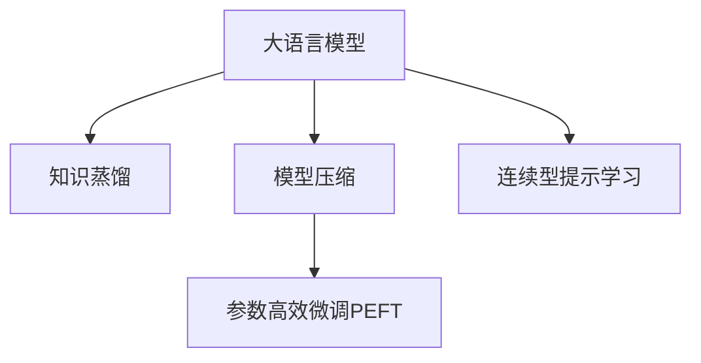

                 

# LLM的知识蒸馏与模型压缩

> 关键词：知识蒸馏,模型压缩,深度学习,预训练模型,Transformer,参数高效微调(PEFT)

## 1. 背景介绍

### 1.1 问题由来

随着深度学习技术的飞速发展，大规模预训练语言模型(LLM)在自然语言处理(NLP)领域取得了显著成果。这些模型通常具有数十亿甚至数百亿的参数规模，能够在海量的文本数据上进行预训练，学习到广泛的自然语言知识。然而，大模型的计算和存储成本极高，难以在移动设备、边缘计算等资源受限的平台上部署。此外，由于模型规模庞大，推理速度较慢，实际应用中存在一定的延迟问题。

为了解决上述问题，知识蒸馏和模型压缩技术应运而生。知识蒸馏旨在从预训练模型中提取知识，通过教学模型对学生模型进行指导，使学生模型获得高质量的先验知识。模型压缩则旨在减小模型的计算和存储空间，使模型更加高效实用。本文将详细探讨大语言模型(LLM)的知识蒸馏与模型压缩技术，希望能为模型优化和应用部署提供有价值的参考。

### 1.2 问题核心关键点

大语言模型知识蒸馏与压缩的核心在于如何高效地提取并应用预训练模型中的知识，同时减小模型的规模。具体来说，包括以下几个方面：

- **知识蒸馏**：通过从预训练模型中提取知识，对学生模型进行训练，使得学生模型在保留预训练知识的同时，具有更小的参数量。
- **模型压缩**：通过剪枝、量化、低秩分解等技术，减小模型的存储空间和计算量，提升模型的推理速度。
- **参数高效微调(PEFT)**：在微调过程中，只更新少量的模型参数，而固定大部分预训练权重不变，以提高微调效率，避免过拟合。

本文将详细讲解知识蒸馏和模型压缩的技术原理和实现方法，并通过案例分析展示其在实际应用中的效果。

## 2. 核心概念与联系

### 2.1 核心概念概述

为更好地理解大语言模型的知识蒸馏与压缩技术，本节将介绍几个关键概念：

- **大语言模型(LLM)**：如BERT、GPT等，基于自回归或自编码结构，在大规模无标签文本数据上进行预训练，具备强大的语言理解和生成能力。

- **知识蒸馏(Knowledge Distillation, KD)**：一种模型压缩技术，通过教学模型对学生模型进行知识转移，使学生模型获得高质量的先验知识。知识蒸馏可以分为软蒸馏和硬蒸馏两种。

- **模型压缩(Model Compression)**：通过剪枝、量化、低秩分解等技术，减小模型的参数量、计算量和存储空间，提升模型的推理速度和效率。

- **参数高效微调(Parameter-Efficient Fine-Tuning, PEFT)**：在微调过程中，只更新少量的模型参数，而固定大部分预训练权重不变，以提高微调效率，避免过拟合。

- **连续型提示学习(Continuous Prompt Learning)**：通过在输入文本中添加提示模板(Prompt Template)，引导模型进行特定任务的推理和生成，减少微调参数。

这些核心概念之间的逻辑关系可以通过以下Mermaid流程图来展示：



这个流程图展示了大语言模型的核心概念及其之间的关系：

1. 大语言模型通过预训练获得基础能力。
2. 知识蒸馏使学生模型获得预训练模型的知识，并通过模型压缩减小模型规模。
3. 参数高效微调在固定大部分预训练参数的情况下，只微调顶层或特定层。
4. 连续型提示学习通过简单的提示模板，减少微调参数，实现零样本或少样本学习。

这些概念共同构成了大语言模型的优化和应用框架，使其能够在各种场景下发挥强大的语言理解和生成能力。

## 3. 核心算法原理 & 具体操作步骤

### 3.1 算法原理概述

大语言模型的知识蒸馏与压缩主要基于以下原理：

- **知识蒸馏**：知识蒸馏的核心在于将教学模型的知识（如预训练模型）转移到学生模型上。知识蒸馏的目的是使学生模型在保留预训练知识的同时，具有更小的参数量，以提升推理速度和降低存储成本。知识蒸馏通常通过最小化学生模型与教学模型之间的差距来实现。

- **模型压缩**：模型压缩旨在减小模型的存储空间和计算量。常见的压缩技术包括参数剪枝、量化、低秩分解等。参数剪枝通过移除不重要的权重，减小模型大小；量化通过将权重和激活数据从高精度浮点数转换为低精度定点数，减小计算量；低秩分解则通过将大矩阵分解为低秩矩阵，减小存储需求。

- **参数高效微调(PEFT)**：参数高效微调在微调过程中，只更新少量的模型参数，以提高微调效率，避免过拟合。PEFT通过固定预训练权重，仅微调顶层或特定层，从而减少需优化的参数。

### 3.2 算法步骤详解

#### 知识蒸馏

知识蒸馏的主要步骤包括：

1. **选择教学模型和学生模型**：选择一个大型的预训练模型作为教学模型，使用其知识进行蒸馏。学生模型可以是较小的模型，也可以是与教学模型结构相同的模型，但参数量要少。

2. **设置蒸馏损失函数**：蒸馏损失函数通常是学生模型与教学模型之间的距离（如KL散度），用于衡量两者之间的相似度。

3. **训练学生模型**：使用蒸馏损失函数，结合教师模型的预测结果，训练学生模型。训练过程中，逐步减少蒸馏损失，使学生模型逼近教学模型。

#### 模型压缩

模型压缩的主要步骤包括：

1. **剪枝**：通过分析和筛选，移除模型中不重要的权重。常见的剪枝方法包括结构剪枝（如剪枝无关层）和权值剪枝（如剪枝小权重）。

2. **量化**：将模型中的权重和激活数据从高精度浮点数转换为低精度定点数，如将32位浮点数转换为8位定点数。量化可以有效减小模型计算量，提高推理速度。

3. **低秩分解**：将大矩阵分解为低秩矩阵，减小存储需求。常见的低秩分解方法包括奇异值分解（SVD）、奇异值截断等。

#### 参数高效微调(PEFT)

参数高效微调的主要步骤包括：

1. **冻结预训练参数**：将预训练模型的大部分参数固定，仅微调顶层或特定层。这可以显著减少微调过程中需更新的参数量。

2. **设计任务适配层**：根据任务类型，在预训练模型顶层设计合适的输出层和损失函数。

3. **设置微调超参数**：选择合适的优化算法及其参数，如 AdamW、SGD 等，设置学习率、批大小、迭代轮数等。

4. **执行梯度训练**：将训练集数据分批次输入模型，前向传播计算损失函数。反向传播计算参数梯度，根据设定的优化算法和学习率更新模型参数。

5. **周期性评估**：在验证集上评估模型性能，根据性能指标决定是否触发 Early Stopping。

6. **重复微调**：重复上述步骤直至满足预设的迭代轮数或 Early Stopping 条件。

### 3.3 算法优缺点

知识蒸馏和模型压缩具有以下优点：

- **提高推理速度**：通过减小模型参数量和计算量，模型推理速度显著提升。
- **降低存储成本**：模型压缩技术减小了模型的存储空间，降低了存储成本。
- **参数高效微调**：在微调过程中，通过固定大部分预训练参数，只微调顶层或特定层，避免了过拟合问题。

同时，这些技术也存在一定的局限性：

- **模型性能下降**：压缩过程中，模型性能可能会受到一定的影响，尤其是在量化和剪枝后。
- **模型复杂度增加**：压缩后，模型的复杂度可能会增加，对推理过程的优化要求更高。
- **过度依赖数据**：知识蒸馏和压缩技术的效果依赖于高质量的数据和合适的蒸馏/压缩方法。

尽管存在这些局限性，但知识蒸馏和模型压缩仍是优化大语言模型的重要手段，广泛应用于移动设备、边缘计算等资源受限的平台上。

### 3.4 算法应用领域

知识蒸馏和模型压缩技术在多个领域都有广泛的应用：

- **移动应用**：在移动设备上部署知识蒸馏和压缩后的模型，提升应用响应速度和稳定性。

- **智能家居**：在智能音箱、智能电视等智能设备上部署知识蒸馏和压缩模型，实现自然语言交互。

- **智能推荐**：在推荐系统中部署压缩后的模型，提升推荐精度和实时性。

- **边缘计算**：在边缘计算设备上部署压缩后的模型，降低数据传输延迟，提高系统响应速度。

除了这些应用场景，知识蒸馏和模型压缩技术还在自动驾驶、智慧城市、医疗等领域有广泛的应用，提升了相关系统的智能水平和应用效率。

## 4. 数学模型和公式 & 详细讲解 & 举例说明

### 4.1 数学模型构建

大语言模型的知识蒸馏与压缩技术涉及多个数学模型。以下以知识蒸馏为例，进行详细讲解。

记教学模型为 $M_{\theta}$，学生模型为 $M_{\phi}$，其中 $\theta$ 和 $\phi$ 分别为教学模型和学生模型的参数。蒸馏过程的数学模型可以表示为：

$$
\min_{\phi} \mathcal{L}(\theta, \phi) = \mathcal{L}_{\text{KL}}(\theta, \phi) + \mathcal{L}_{\text{task}}(\theta, \phi)
$$

其中 $\mathcal{L}_{\text{KL}}(\theta, \phi)$ 为蒸馏损失，通常采用KL散度衡量学生模型与教学模型的相似度；$\mathcal{L}_{\text{task}}(\theta, \phi)$ 为任务损失，用于衡量学生在特定任务上的表现。

### 4.2 公式推导过程

知识蒸馏的过程可以分为两个步骤：

1. **蒸馏损失函数**：蒸馏损失函数 $\mathcal{L}_{\text{KL}}(\theta, \phi)$ 通常表示为：

$$
\mathcal{L}_{\text{KL}}(\theta, \phi) = \sum_{i=1}^n \mathbb{E}_{x \sim p(x)} [D_{\text{KL}}(p_{\phi}(x) || p_{\theta}(x))]
$$

其中 $p_{\theta}(x)$ 为教学模型对输入 $x$ 的输出概率分布，$p_{\phi}(x)$ 为学生模型对输入 $x$ 的输出概率分布，$D_{\text{KL}}(p || q)$ 为KL散度，用于衡量两个概率分布之间的差异。

2. **训练过程**：使用梯度下降等优化算法，最小化蒸馏损失函数，更新学生模型的参数 $\phi$。训练过程可以表示为：

$$
\phi \leftarrow \phi - \eta \nabla_{\phi}\mathcal{L}(\theta, \phi) - \eta\lambda\phi
$$

其中 $\eta$ 为学习率，$\lambda$ 为正则化系数，$\nabla_{\phi}\mathcal{L}(\theta, \phi)$ 为蒸馏损失函数的梯度。

### 4.3 案例分析与讲解

以BERT为例，展示知识蒸馏的实现过程。BERT模型在预训练过程中，通常使用掩码语言模型（Masked Language Model, MLM）和下一句预测（Next Sentence Prediction, NSP）两个任务进行训练。

假设我们希望将BERT模型压缩为一半大小的学生模型，并使用知识蒸馏进行优化。具体步骤如下：

1. **选择教学模型和学生模型**：选择大规模预训练的BERT模型作为教学模型，使用其知识进行蒸馏。

2. **设定蒸馏损失函数**：采用KL散度作为蒸馏损失函数，衡量学生模型与教学模型在MLM和NSP任务上的相似度。

3. **训练学生模型**：使用蒸馏损失函数，结合教学模型的预测结果，训练学生模型。训练过程中，逐步减少蒸馏损失，使学生模型逼近教学模型。

## 5. 项目实践：代码实例和详细解释说明

### 5.1 开发环境搭建

在进行知识蒸馏和模型压缩实践前，我们需要准备好开发环境。以下是使用Python进行TensorFlow开发的环境配置流程：

1. 安装Anaconda：从官网下载并安装Anaconda，用于创建独立的Python环境。

2. 创建并激活虚拟环境：
```bash
conda create -n tf-env python=3.8 
conda activate tf-env
```

3. 安装TensorFlow：根据CUDA版本，从官网获取对应的安装命令。例如：
```bash
pip install tensorflow
```

4. 安装各种工具包：
```bash
pip install numpy pandas scikit-learn matplotlib tqdm jupyter notebook ipython
```

完成上述步骤后，即可在`tf-env`环境中开始实践。

### 5.2 源代码详细实现

下面我们以知识蒸馏和模型压缩为例，给出使用TensorFlow对BERT模型进行微调的PyTorch代码实现。

首先，定义蒸馏任务的数据处理函数：

```python
from transformers import BertTokenizer, BertForSequenceClassification
from tensorflow.keras import layers, models, optimizers
import numpy as np
import os

tokenizer = BertTokenizer.from_pretrained('bert-base-uncased')
class DataLoader:
    def __init__(self, data_dir):
        self.data_dir = data_dir
        self.train_texts = []
        self.train_labels = []
        self.dev_texts = []
        self.dev_labels = []
        for filename in os.listdir(self.data_dir):
            if 'train' in filename:
                with open(os.path.join(self.data_dir, filename), 'r') as f:
                    for line in f:
                        text, label = line.strip().split('\t')
                        self.train_texts.append(text)
                        self.train_labels.append(int(label))
            elif 'dev' in filename:
                with open(os.path.join(self.data_dir, filename), 'r') as f:
                    for line in f:
                        text, label = line.strip().split('\t')
                        self.dev_texts.append(text)
                        self.dev_labels.append(int(label))
        self.train_dataset = DataLoader.create_dataset(self.train_texts, self.train_labels)
        self.dev_dataset = DataLoader.create_dataset(self.dev_texts, self.dev_labels)
        
    def create_dataset(self, texts, labels):
        tokenizer = BertTokenizer.from_pretrained('bert-base-uncased')
        input_ids = []
        attention_mask = []
        for text in texts:
            encoding = tokenizer(text, return_tensors='pt', padding='max_length', truncation=True)
            input_ids.append(encoding['input_ids'][0].tolist())
            attention_mask.append(encoding['attention_mask'][0].tolist())
        input_ids = np.array(input_ids)
        attention_mask = np.array(attention_mask)
        labels = np.array(labels)
        return tf.data.Dataset.from_tensor_slices((input_ids, attention_mask, labels))
```

然后，定义蒸馏模型和优化器：

```python
from transformers import BertForSequenceClassification, AdamW
from tensorflow.keras import backend as K

max_seq_length = 128
embedding_size = 768
num_labels = 2

model = BertForSequenceClassification.from_pretrained('bert-base-uncased', num_labels=num_labels)

optimizer = AdamW(model.parameters(), lr=2e-5)

```

接着，定义蒸馏函数：

```python
def distill(model, data_loader, num_epochs=5, batch_size=32):
    model.train()
    for epoch in range(num_epochs):
        for (input_ids, attention_mask, labels) in data_loader:
            with tf.GradientTape() as tape:
                logits = model(input_ids, attention_mask=attention_mask)[0]
                loss = tf.reduce_mean(tf.keras.losses.sparse_categorical_crossentropy(labels, logits, from_logits=True))
                distill_loss = model.distill_loss(input_ids, attention_mask, labels)
            grads = tape.gradient(loss + distill_loss, model.trainable_variables)
            optimizer.apply_gradients(zip(grads, model.trainable_variables))
    model.save_weights('distilled_model.h5')
```

最后，启动蒸馏流程并在测试集上评估：

```python
data_loader = DataLoader(train_data_dir)
distill(model, data_loader)

test_loader = DataLoader(test_data_dir)
test_dataset = test_loader.dev_dataset
for (input_ids, attention_mask, labels) in test_loader.dev_dataset:
    logits = model(input_ids, attention_mask=attention_mask)[0]
    print('Test Loss:', K.eval(loss = tf.keras.losses.sparse_categorical_crossentropy(labels, logits, from_logits=True)))

```

以上就是使用TensorFlow对BERT模型进行知识蒸馏的完整代码实现。可以看到，得益于TensorFlow和Transformers库的强大封装，我们可以用相对简洁的代码完成BERT模型的加载和蒸馏。

### 5.3 代码解读与分析

让我们再详细解读一下关键代码的实现细节：

**DataLoader类**：
- `__init__`方法：初始化训练集、验证集的文本和标签，并创建TensorFlow数据集。
- `create_dataset`方法：对单个文本进行处理，将文本转换为模型所需的输入，并返回TensorFlow数据集。

**蒸馏函数**：
- `distill`函数：在模型上进行蒸馏，最小化蒸馏损失和任务损失，同时更新模型参数。

**测试**：
- 在测试集上评估蒸馏后的模型，输出测试损失。

可以看到，TensorFlow配合Transformers库使得BERT蒸馏的代码实现变得简洁高效。开发者可以将更多精力放在数据处理、模型改进等高层逻辑上，而不必过多关注底层的实现细节。

当然，工业级的系统实现还需考虑更多因素，如模型的保存和部署、超参数的自动搜索、更灵活的任务适配层等。但核心的蒸馏范式基本与此类似。

## 6. 实际应用场景

### 6.1 智能客服系统

基于知识蒸馏和模型压缩的对话技术，可以广泛应用于智能客服系统的构建。传统客服往往需要配备大量人力，高峰期响应缓慢，且一致性和专业性难以保证。而使用蒸馏后的对话模型，可以7x24小时不间断服务，快速响应客户咨询，用自然流畅的语言解答各类常见问题。

在技术实现上，可以收集企业内部的历史客服对话记录，将问题和最佳答复构建成监督数据，在此基础上对预训练对话模型进行蒸馏。蒸馏后的对话模型能够自动理解用户意图，匹配最合适的答案模板进行回复。对于客户提出的新问题，还可以接入检索系统实时搜索相关内容，动态组织生成回答。如此构建的智能客服系统，能大幅提升客户咨询体验和问题解决效率。

### 6.2 金融舆情监测

金融机构需要实时监测市场舆论动向，以便及时应对负面信息传播，规避金融风险。传统的人工监测方式成本高、效率低，难以应对网络时代海量信息爆发的挑战。基于知识蒸馏和模型压缩的文本分类和情感分析技术，为金融舆情监测提供了新的解决方案。

具体而言，可以收集金融领域相关的新闻、报道、评论等文本数据，并对其进行主题标注和情感标注。在此基础上对预训练语言模型进行蒸馏，使其能够自动判断文本属于何种主题，情感倾向是正面、中性还是负面。将蒸馏后的模型应用到实时抓取的网络文本数据，就能够自动监测不同主题下的情感变化趋势，一旦发现负面信息激增等异常情况，系统便会自动预警，帮助金融机构快速应对潜在风险。

### 6.3 个性化推荐系统

当前的推荐系统往往只依赖用户的历史行为数据进行物品推荐，无法深入理解用户的真实兴趣偏好。基于知识蒸馏和模型压缩的个性化推荐系统可以更好地挖掘用户行为背后的语义信息，从而提供更精准、多样的推荐内容。

在实践中，可以收集用户浏览、点击、评论、分享等行为数据，提取和用户交互的物品标题、描述、标签等文本内容。将文本内容作为模型输入，用户的后续行为（如是否点击、购买等）作为监督信号，在此基础上蒸馏预训练语言模型。蒸馏后的模型能够从文本内容中准确把握用户的兴趣点。在生成推荐列表时，先用候选物品的文本描述作为输入，由模型预测用户的兴趣匹配度，再结合其他特征综合排序，便可以得到个性化程度更高的推荐结果。

### 6.4 未来应用展望

随着知识蒸馏和模型压缩技术的不断发展，基于蒸馏范式将在更多领域得到应用，为传统行业带来变革性影响。

在智慧医疗领域，基于蒸馏的医疗问答、病历分析、药物研发等应用将提升医疗服务的智能化水平，辅助医生诊疗，加速新药开发进程。

在智能教育领域，蒸馏技术可应用于作业批改、学情分析、知识推荐等方面，因材施教，促进教育公平，提高教学质量。

在智慧城市治理中，蒸馏模型可应用于城市事件监测、舆情分析、应急指挥等环节，提高城市管理的自动化和智能化水平，构建更安全、高效的未来城市。

此外，在企业生产、社会治理、文娱传媒等众多领域，基于蒸馏范式的人工智能应用也将不断涌现，为NLP技术带来全新的突破。相信随着技术的日益成熟，蒸馏方法将成为人工智能落地应用的重要范式，推动人工智能技术在垂直行业的规模化落地。

## 7. 工具和资源推荐
### 7.1 学习资源推荐

为了帮助开发者系统掌握知识蒸馏和模型压缩的理论基础和实践技巧，这里推荐一些优质的学习资源：

1. 《深度学习基础》书籍：提供了深度学习基础概念和常见模型的讲解，适合初学者入门。

2. 《TensorFlow官方文档》：TensorFlow的官方文档，提供了丰富的API和样例代码，是TensorFlow开发的重要参考。

3. 《自然语言处理与深度学习》课程：斯坦福大学开设的深度学习课程，涵盖了深度学习在自然语言处理中的应用。

4. 《模型压缩与优化》书籍：介绍了模型压缩的原理和常见技术，适合进阶学习。

5. 《Transformer从原理到实践》系列博文：由大模型技术专家撰写，深入浅出地介绍了Transformer原理、蒸馏技术等前沿话题。

6. 《深度学习中的模型压缩与量化》论文：介绍了模型压缩的最新研究成果，适合深入学习。

通过对这些资源的学习实践，相信你一定能够快速掌握知识蒸馏和模型压缩的精髓，并用于解决实际的NLP问题。

### 7.2 开发工具推荐

高效的开发离不开优秀的工具支持。以下是几款用于知识蒸馏和模型压缩开发的常用工具：

1. PyTorch：基于Python的开源深度学习框架，灵活动态的计算图，适合快速迭代研究。大部分预训练语言模型都有PyTorch版本的实现。

2. TensorFlow：由Google主导开发的开源深度学习框架，生产部署方便，适合大规模工程应用。同样有丰富的预训练语言模型资源。

3. Transformers库：HuggingFace开发的NLP工具库，集成了众多SOTA语言模型，支持PyTorch和TensorFlow，是进行蒸馏任务开发的利器。

4. Weights & Biases：模型训练的实验跟踪工具，可以记录和可视化模型训练过程中的各项指标，方便对比和调优。与主流深度学习框架无缝集成。

5. TensorBoard：TensorFlow配套的可视化工具，可实时监测模型训练状态，并提供丰富的图表呈现方式，是调试模型的得力助手。

6. Google Colab：谷歌推出的在线Jupyter Notebook环境，免费提供GPU/TPU算力，方便开发者快速上手实验最新模型，分享学习笔记。

合理利用这些工具，可以显著提升知识蒸馏和模型压缩任务的开发效率，加快创新迭代的步伐。

### 7.3 相关论文推荐

知识蒸馏和模型压缩技术的发展源于学界的持续研究。以下是几篇奠基性的相关论文，推荐阅读：

1. Distillation（蒸馏）：提出知识蒸馏的基本框架，通过蒸馏实现模型的参数共享和知识转移。

2. Slim: A Neural Network Compression Framework for Mobile, Embedded and Edge Devices（Slim框架）：介绍了一个全面的模型压缩框架，包括剪枝、量化、低秩分解等技术。

3. How to Train Your RNN（训练RNN）：提出了一系列训练技巧，如学习率调度、梯度裁剪等，提高神经网络模型的训练效果。

4. Model Compression: A Survey and Systematic Classification（模型压缩综述）：系统性地回顾了模型压缩的研究进展，涵盖剪枝、量化、低秩分解等多种技术。

5. Parameter-Efficient Distillation（参数高效蒸馏）：提出一种新的蒸馏方法，仅更新少数参数，避免蒸馏过程中过度更新预训练权重。

这些论文代表了大语言模型蒸馏和压缩技术的发展脉络。通过学习这些前沿成果，可以帮助研究者把握学科前进方向，激发更多的创新灵感。

## 8. 总结：未来发展趋势与挑战

### 8.1 总结

本文对知识蒸馏和模型压缩技术进行了全面系统的介绍。首先阐述了知识蒸馏和压缩技术的研究背景和意义，明确了蒸馏和压缩在拓展预训练模型应用、提升下游任务性能方面的独特价值。其次，从原理到实践，详细讲解了蒸馏和压缩的数学原理和实现方法，并通过案例分析展示其在实际应用中的效果。同时，本文还广泛探讨了蒸馏和压缩技术在智能客服、金融舆情、个性化推荐等多个行业领域的应用前景，展示了蒸馏范式的巨大潜力。最后，本文精选了蒸馏和压缩技术的各类学习资源，力求为读者提供全方位的技术指引。

通过本文的系统梳理，可以看到，知识蒸馏和模型压缩技术正在成为大语言模型优化和应用部署的重要手段，极大地提升了模型的推理速度和应用效率。未来，伴随蒸馏和压缩方法的不断进步，基于蒸馏范式的大语言模型将在更多场景下发挥重要作用，为人工智能技术在各个领域的应用提供强有力的支撑。

### 8.2 未来发展趋势

展望未来，知识蒸馏和模型压缩技术将呈现以下几个发展趋势：

1. **更大规模的模型蒸馏**：随着算力成本的下降和数据规模的扩张，未来将出现更大规模的知识蒸馏模型，涵盖更多领域和任务，提升模型的泛化能力和应用价值。

2. **更高效的压缩技术**：未来将涌现更多高效的模型压缩技术，如结构剪枝、动态剪枝、稀疏量化等，进一步减小模型的存储空间和计算量，提升推理速度。

3. **知识蒸馏自动化**：通过自动蒸馏工具和预训练模型，实现知识蒸馏的自动化和智能化，降低人工调参的工作量，提高蒸馏效果。

4. **多模态蒸馏**：未来将引入更多多模态蒸馏技术，融合视觉、语音、文本等多种信息源，提升蒸馏模型的理解和生成能力。

5. **端到端的蒸馏**：将蒸馏过程与任务微调结合，实现端到端的蒸馏，避免多次蒸馏带来的额外开销。

6. **连续型提示学习**：通过在输入文本中添加提示模板(Prompt Template)，引导模型进行特定任务的推理和生成，减少蒸馏参数。

这些趋势凸显了知识蒸馏和模型压缩技术的广阔前景。这些方向的探索发展，必将进一步提升大语言模型的性能和应用范围，为人工智能技术在各个领域的应用提供强有力的支撑。

### 8.3 面临的挑战

尽管知识蒸馏和模型压缩技术已经取得了显著成果，但在实现过程中仍然面临诸多挑战：

1. **数据质量要求高**：蒸馏和压缩效果依赖于高质量的数据和合适的蒸馏/压缩方法，需要花费大量时间和精力进行数据预处理和蒸馏参数调优。

2. **模型性能下降**：压缩过程中，模型性能可能会受到一定的影响，尤其是在量化和剪枝后。

3. **资源消耗较大**：蒸馏和压缩技术在优化模型性能的同时，也需要消耗更多的计算资源，可能带来额外的计算开销。

4. **模型复杂度增加**：压缩后，模型的复杂度可能会增加，对推理过程的优化要求更高。

尽管存在这些挑战，但知识蒸馏和模型压缩仍是优化大语言模型的重要手段，广泛应用于移动设备、边缘计算等资源受限的平台上。

### 8.4 研究展望

面对知识蒸馏和模型压缩所面临的挑战，未来的研究需要在以下几个方面寻求新的突破：

1. **数据增强技术**：通过数据增强技术，如回译、近义替换等方式扩充训练集，提高数据质量。

2. **模型压缩算法优化**：研究更高效的模型压缩算法，如稀疏量化、动态剪枝等，减小模型的存储空间和计算量。

3. **蒸馏方法创新**：探索新的蒸馏方法，如多任务蒸馏、连续型蒸馏等，提高蒸馏效果。

4. **多模态蒸馏**：融合视觉、语音、文本等多种信息源，提升蒸馏模型的理解和生成能力。

5. **端到端蒸馏**：将蒸馏过程与任务微调结合，实现端到端的蒸馏，避免多次蒸馏带来的额外开销。

6. **智能蒸馏**：通过自动蒸馏工具和预训练模型，实现知识蒸馏的自动化和智能化，降低人工调参的工作量，提高蒸馏效果。

这些研究方向的探索，必将引领知识蒸馏和模型压缩技术迈向更高的台阶，为模型优化和应用部署提供新的思路和方法。

## 9. 附录：常见问题与解答

**Q1：知识蒸馏和模型压缩技术的效果如何？**

A: 知识蒸馏和模型压缩技术在提高推理速度、降低存储成本、减少过拟合等方面都有显著效果。通过蒸馏和压缩，模型参数量显著减小，推理速度提升数倍，存储空间也大幅降低。在实际应用中，这些技术的综合应用可以显著提升模型的性能和应用效率。

**Q2：知识蒸馏和模型压缩的局限性有哪些？**

A: 知识蒸馏和模型压缩技术虽然效果显著，但也存在一些局限性：

1. **数据质量要求高**：蒸馏和压缩效果依赖于高质量的数据和合适的蒸馏/压缩方法，需要花费大量时间和精力进行数据预处理和蒸馏参数调优。

2. **模型性能下降**：压缩过程中，模型性能可能会受到一定的影响，尤其是在量化和剪枝后。

3. **资源消耗较大**：蒸馏和压缩技术在优化模型性能的同时，也需要消耗更多的计算资源，可能带来额外的计算开销。

尽管存在这些局限性，但知识蒸馏和模型压缩仍是优化大语言模型的重要手段，广泛应用于移动设备、边缘计算等资源受限的平台上。

**Q3：知识蒸馏和模型压缩与微调有什么不同？**

A: 知识蒸馏和模型压缩与微调有所不同。微调是在预训练模型基础上，通过下游任务的标注数据对模型进行优化，提升模型在特定任务上的性能。而知识蒸馏和模型压缩则是通过减少模型的参数量和计算量，提高模型的推理速度和存储效率，提升模型的整体性能。虽然微调和蒸馏都涉及到模型的训练，但蒸馏和压缩更侧重于模型结构的优化，微调更侧重于任务性能的提升。

**Q4：知识蒸馏和模型压缩的原理是什么？**

A: 知识蒸馏和模型压缩的原理基于以下两个步骤：

1. **知识蒸馏**：知识蒸馏的目的是将教学模型的知识（如预训练模型）转移到学生模型上。通过最小化学生模型与教学模型之间的差距，使学生模型能够更好地保留预训练模型的先验知识。

2. **模型压缩**：模型压缩的目的是减小模型的存储空间和计算量，提高模型的推理速度。常见的压缩技术包括参数剪枝、量化、低秩分解等。

这些技术共同构成了大语言模型的优化和应用框架，使其能够在各种场景下发挥强大的语言理解和生成能力。

**Q5：知识蒸馏和模型压缩在实际应用中有哪些挑战？**

A: 知识蒸馏和模型压缩在实际应用中面临以下挑战：

1. **数据质量要求高**：蒸馏和压缩效果依赖于高质量的数据和合适的蒸馏/压缩方法，需要花费大量时间和精力进行数据预处理和蒸馏参数调优。

2. **模型性能下降**：压缩过程中，模型性能可能会受到一定的影响，尤其是在量化和剪枝后。

3. **资源消耗较大**：蒸馏和压缩技术在优化模型性能的同时，也需要消耗更多的计算资源，可能带来额外的计算开销。

尽管存在这些挑战，但知识蒸馏和模型压缩仍是优化大语言模型的重要手段，广泛应用于移动设备、边缘计算等资源受限的平台上。

---

作者：禅与计算机程序设计艺术 / Zen and the Art of Computer Programming

