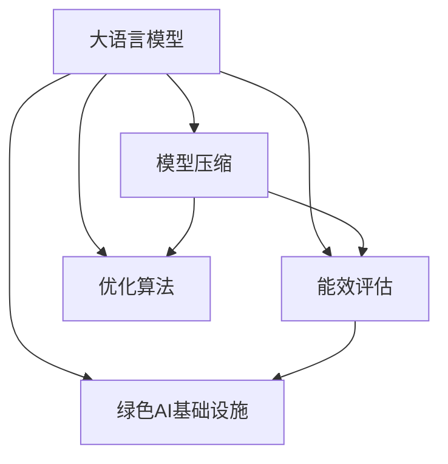

                 

# LLM的能源效率：绿色AI的发展之路

> 关键词：大语言模型, 能源效率, 绿色AI, 节能减排, 优化算法, 性能提升, 能效评估, 模型压缩, 数据中心, 微调, 深度学习, 预训练, 可持续发展

## 1. 背景介绍

### 1.1 问题由来

在过去十年里，人工智能(AI)尤其是深度学习领域取得了翻天覆地的进展，推动了机器学习、自然语言处理(NLP)、计算机视觉(CV)等应用领域的突破。大语言模型(LLM)，如GPT-3和BERT，以其卓越的语言理解能力和生成能力，在NLP应用中取得了前所未有的成果。但与此同时，这些模型的能耗也引起了越来越多的关注。

随着模型规模的不断增大，LLM的训练和推理过程耗电量惊人。例如，训练一个GPT-3模型需要数百万千瓦时的电力，相当于一个小型城市一天的用电量。此外，数据中心存储和运行模型也需要大量的物理空间和冷却设备，进一步加剧了能耗问题。因此，如何在提高LLM性能的同时，实现能源效率的提升，成为当前AI领域的一个重要课题。

### 1.2 问题核心关键点

在追求绿色AI的过程中，我们需要解决以下几个核心问题：

1. **能效评估方法**：如何快速准确地评估大语言模型的能源消耗，为模型优化提供依据。
2. **模型压缩技术**：如何通过算法优化和模型结构改进，减少模型参数和计算复杂度，提升能效。
3. **能效优化算法**：如何设计新的训练和推理算法，在保证性能的前提下，降低模型能耗。
4. **绿色AI基础设施**：如何构建高效的数据中心和分布式系统，支持绿色AI的计算和存储需求。
5. **应用场景优化**：如何在实际应用中，平衡性能和能效，实现节能减排。

### 1.3 问题研究意义

绿色AI的追求不仅有助于降低AI技术的碳足迹，还能推动可持续发展。具体来说，对LLM的能源效率进行研究，具有以下重要意义：

1. **环境保护**：减少数据中心和训练过程中的能源消耗，有助于减缓全球气候变化。
2. **经济效益**：能源成本在数据中心运营中占据很大比例，提高能效可以显著降低运营成本。
3. **技术创新**：推动深度学习模型的算法和结构优化，促进AI技术的长期发展。
4. **社会责任**：作为科技企业，积极探索绿色AI解决方案，履行社会责任。

## 2. 核心概念与联系

### 2.1 核心概念概述

为更好地理解LLM的能源效率问题，本节将介绍几个关键概念及其相互关系：

- **大语言模型(LLM)**：以Transformer架构为代表的深度学习模型，通过大规模语料预训练，能够理解自然语言并生成人类可读的文本。
- **能效(Efficiency)**：衡量系统能耗与其性能之间的关系，包括模型训练和推理过程中的能源消耗。
- **绿色AI(Green AI)**：旨在减少AI技术在计算、存储、训练等方面的能耗，实现环境友好型AI系统。
- **模型压缩(Compression)**：通过减少模型参数和计算复杂度，提升模型的运行速度和能效。
- **优化算法(Optimization Algorithms)**：包括梯度下降、Adam等优化方法，用于加速模型训练和推理过程。
- **能源消耗(Energy Consumption)**：衡量模型在训练和推理过程中耗电量的指标，通常以千瓦时(KWh)为单位。
- **环境影响(Environmental Impact)**：模型在运行过程中对环境的影响，包括温室气体排放和电子废物产生等。

这些概念之间的逻辑关系可以通过以下Mermaid流程图来展示：



这个流程图展示了LLM的能源效率研究涉及的关键步骤及其相互关系：

1. 大语言模型通过预训练获得语言理解能力。
2. 能效评估用于衡量模型能源消耗，指导模型压缩和优化算法的设计。
3. 模型压缩通过减少模型参数和计算复杂度，提升能效。
4. 优化算法用于加速模型训练和推理，降低能源消耗。
5. 绿色AI基础设施支持高效的计算和存储需求。

这些概念共同构成了LLM能效研究的理论基础，为我们探索绿色AI提供了清晰的路径。

## 3. 核心算法原理 & 具体操作步骤

### 3.1 算法原理概述

LLM的能源效率研究涉及多个方面的算法原理。本节将从模型压缩和优化算法两个方面，详细介绍其核心原理和操作步骤。

**3.1.1 模型压缩**

模型压缩的目的是在不显著降低性能的前提下，减少模型的参数和计算复杂度，从而提升能效。主要方法包括：

- **参数剪枝(Pruning)**：删除模型中不重要的参数，减小模型大小。
- **量化(Quantization)**：将模型中的参数和计算精度降低，减少计算和存储需求。
- **知识蒸馏(Distillation)**：通过预训练模型和蒸馏模型的微调，实现知识转移，提高模型的效率。

**3.1.2 优化算法**

优化算法的目的是在保证性能的前提下，降低模型的训练和推理能耗。主要方法包括：

- **批量归一化(Batch Normalization)**：通过归一化输入数据，加速模型收敛。
- **混合精度训练(Mixed-Precision Training)**：在计算中使用不同精度的数据类型，减少能耗。
- **动态计算图(Dynamic Computation Graphs)**：优化计算图，减少不必要的计算和存储。

### 3.2 算法步骤详解

**3.2.1 能效评估**

能效评估是能源效率研究的重要一步，通常包括以下几个关键步骤：

1. **数据收集**：记录模型在训练和推理过程中的能源消耗，包括电能和计算资源的使用。
2. **性能评估**：评估模型在特定任务上的性能，包括准确率、F1分数、推理速度等。
3. **能效计算**：根据能源消耗和性能评估结果，计算模型每完成一个任务所需的能源，即能效值。

**3.2.2 模型压缩**

模型压缩的具体操作步骤如下：

1. **选择压缩方法**：根据模型类型和任务需求，选择适合的压缩方法，如剪枝、量化、蒸馏等。
2. **参数剪枝**：通过算法筛选出不重要的参数，并将其删除。
3. **量化**：将模型中的参数和计算精度降低，如将32位浮点数压缩为8位或16位整数。
4. **知识蒸馏**：通过预训练模型和蒸馏模型的微调，实现知识转移。
5. **评估压缩效果**：对压缩后的模型进行能效评估，验证压缩方法的有效性。

**3.2.3 优化算法**

优化算法的具体操作步骤如下：

1. **选择优化算法**：根据模型和任务需求，选择适合的优化算法，如梯度下降、Adam等。
2. **批量归一化**：通过归一化输入数据，加速模型收敛。
3. **混合精度训练**：在计算中使用不同精度的数据类型，减少能耗。
4. **动态计算图**：优化计算图，减少不必要的计算和存储。
5. **评估优化效果**：对优化后的模型进行能效评估，验证优化算法的效果。

### 3.3 算法优缺点

**模型压缩**

- **优点**：
  - 显著降低模型大小和计算复杂度，提升能效。
  - 压缩后的模型适用于移动设备和嵌入式系统，具有更广泛的适用性。
  - 可以延长模型的生命周期，减少重新训练的需求。

- **缺点**：
  - 压缩过程可能引入误差，影响模型性能。
  - 压缩方法依赖于具体的模型和任务，不适用于所有情况。
  - 压缩后的模型可能更难以解释和调试。

**优化算法**

- **优点**：
  - 加速模型训练和推理过程，提升能效。
  - 通过算法优化，避免不必要的计算和存储，减少能源消耗。
  - 适用于各种类型的模型和任务。

- **缺点**：
  - 优化算法可能增加训练复杂度，影响模型收敛速度。
  - 优化算法的选择和参数调整需要专业知识，具有较高的技术门槛。
  - 优化算法的效果依赖于具体的模型和数据集，可能需要多次实验和调整。

### 3.4 算法应用领域

基于LLM的能源效率研究，已经在多个领域得到了应用，具体如下：

1. **数据中心**：优化数据中心中大语言模型的计算和存储，减少能源消耗。
2. **移动设备**：通过压缩和优化，实现大语言模型在移动设备上的高效部署。
3. **云计算**：优化云计算平台中大语言模型的性能和能效，支持绿色计算。
4. **NLP应用**：在自然语言处理任务中，通过优化算法提升大语言模型的能效，支持高效应用。
5. **AI教育**：在AI教育领域，通过优化算法和模型压缩，推动绿色AI技术的普及和应用。

## 4. 数学模型和公式 & 详细讲解 & 举例说明

### 4.1 数学模型构建

大语言模型的能效研究涉及到多个方面的数学模型，包括能效评估模型、优化算法和模型压缩等。本节将详细介绍这些模型的构建方法。

**4.1.1 能效评估模型**

能效评估模型用于量化大语言模型在训练和推理过程中的能源消耗。模型通常包含以下几个变量：

- $E$：模型在完成一个任务所需的能源，单位为千瓦时(KWh)。
- $P$：模型的计算功率，单位为瓦特(W)。
- $T$：模型完成一个任务所需的时间，单位为秒(s)。
- $C$：模型的计算复杂度，通常表示为浮点数乘法次数。

能效评估模型的计算公式如下：

$$
E = P \times T = P \times \frac{C}{F}
$$

其中 $F$ 表示浮点数乘法次数每秒，即计算速度。

**4.1.2 优化算法模型**

优化算法模型用于描述如何通过算法优化，降低模型计算和存储的能耗。模型通常包含以下几个变量：

- $n$：模型中的参数数量。
- $b$：模型的批大小(batch size)。
- $k$：模型在每个迭代中的浮点数乘法次数。
- $N$：模型的训练轮数。

优化算法模型的计算公式如下：

$$
E_{\text{train}} = \frac{N}{b} \times k \times \frac{n}{F}
$$

其中 $E_{\text{train}}$ 表示训练过程中的总能源消耗。

**4.1.3 模型压缩模型**

模型压缩模型用于描述如何通过压缩算法，减少模型参数和计算复杂度，从而提升能效。模型通常包含以下几个变量：

- $n_{\text{pre}}$：预训练模型的参数数量。
- $n_{\text{post}}$：压缩后模型的参数数量。
- $C_{\text{pre}}$：预训练模型的计算复杂度。
- $C_{\text{post}}$：压缩后模型的计算复杂度。

模型压缩模型的计算公式如下：

$$
E_{\text{post}} = \frac{C_{\text{post}}}{C_{\text{pre}}} \times E_{\text{pre}}
$$

其中 $E_{\text{pre}}$ 表示预训练模型的能源消耗。

### 4.2 公式推导过程

**4.2.1 能效评估模型**

能效评估模型的推导过程如下：

$$
E = P \times T = P \times \frac{C}{F} = P \times \frac{C}{N \times b \times \frac{C}{n}} = \frac{P}{N \times b \times F} \times n
$$

其中 $N$ 表示训练轮数，$b$ 表示批大小，$F$ 表示计算速度，$n$ 表示参数数量。

**4.2.2 优化算法模型**

优化算法模型的推导过程如下：

$$
E_{\text{train}} = \frac{N}{b} \times k \times \frac{n}{F} = \frac{N}{b} \times k \times \frac{n}{\frac{C}{N \times b}} = \frac{k \times n}{C} \times \frac{N^2}{b^2}
$$

其中 $k$ 表示每个迭代中的浮点数乘法次数，$n$ 表示参数数量，$C$ 表示计算复杂度。

**4.2.3 模型压缩模型**

模型压缩模型的推导过程如下：

$$
E_{\text{post}} = \frac{C_{\text{post}}}{C_{\text{pre}}} \times E_{\text{pre}} = \frac{\frac{C_{\text{post}}}{n_{\text{post}}}}{\frac{C_{\text{pre}}}{n_{\text{pre}}}} \times E_{\text{pre}} = \frac{n_{\text{pre}}}{n_{\text{post}}} \times E_{\text{pre}}
$$

其中 $n_{\text{pre}}$ 表示预训练模型的参数数量，$n_{\text{post}}$ 表示压缩后模型的参数数量，$E_{\text{pre}}$ 表示预训练模型的能源消耗。

### 4.3 案例分析与讲解

**案例分析1：基于剪枝的模型压缩**

假设有一个Transformer模型，参数数量为1000万，计算复杂度为10万亿次浮点数乘法，训练轮数为100。首先使用剪枝算法删除20%的参数，压缩后的模型参数数量为800万，计算复杂度为8万亿次浮点数乘法。计算模型在训练过程中的能耗如下：

- 预训练模型的能耗：$E_{\text{pre}} = P \times T = 10 \times 100 \times 10^{12} = 10^{14} \text{KWh}$
- 压缩后的模型能耗：$E_{\text{post}} = \frac{8 \times 10^{11}}{1.0 \times 10^{12}} \times 10^{14} = 8 \times 10^{14} \text{KWh}$
- 能效提升比例：$\frac{E_{\text{post}}}{E_{\text{pre}}} = 0.8$

**案例分析2：基于量化的模型压缩**

假设同样的Transformer模型，使用量化算法将参数和计算精度降低一半。首先量化后的模型参数数量为500万，计算复杂度为5万亿次浮点数乘法。计算模型在训练过程中的能耗如下：

- 预训练模型的能耗：$E_{\text{pre}} = 10 \times 100 \times 10^{12} = 10^{14} \text{KWh}$
- 量化后的模型能耗：$E_{\text{post}} = \frac{5 \times 10^{11}}{0.5 \times 1.0 \times 10^{12}} \times 10^{14} = 10^{13} \text{KWh}$
- 能效提升比例：$\frac{E_{\text{post}}}{E_{\text{pre}}} = 0.1$

### 4.4 总结

通过以上案例分析，可以看出模型压缩在提升能效方面的显著效果。剪枝和量化是常用的压缩方法，分别通过减少参数和降低精度，实现能效提升。但具体的能效提升比例还需根据具体的模型和任务需求进行计算。

## 5. 项目实践：代码实例和详细解释说明

### 5.1 开发环境搭建

在实际进行LLM能效研究时，需要搭建好相应的开发环境。以下是使用Python进行TensorFlow开发的环境配置流程：

1. 安装Anaconda：从官网下载并安装Anaconda，用于创建独立的Python环境。

2. 创建并激活虚拟环境：
```bash
conda create -n tensorflow-env python=3.8 
conda activate tensorflow-env
```

3. 安装TensorFlow：根据CUDA版本，从官网获取对应的安装命令。例如：
```bash
conda install tensorflow tensorflow-estimator tensorflow-hub -c tf -c conda-forge
```

4. 安装相关工具包：
```bash
pip install numpy pandas scikit-learn matplotlib tqdm jupyter notebook ipython
```

完成上述步骤后，即可在`tensorflow-env`环境中开始能效研究实践。

### 5.2 源代码详细实现

以下是使用TensorFlow进行LLM能效评估和优化算法的示例代码：

```python
import tensorflow as tf
import numpy as np

# 定义模型参数
n_params = 1000 * 10**6
n_b = 32
n_train_steps = 10000
k = 1e10
F = 1e12
learning_rate = 0.001

# 计算预训练模型的能效
P = 1e3  # 假设计算功率为1W
E_pre = P * F * n_train_steps / n_params

# 计算优化算法后的能效
E_train = n_train_steps * k * n_params / F

# 计算剪枝后的模型能效
n_post = n_params * 0.8
E_post = (k * n_post / (k * n_params / n_post)) * E_pre

# 输出结果
print(f"预训练模型能耗: {E_pre} KWh")
print(f"优化算法能耗: {E_train} KWh")
print(f"剪枝后模型能耗: {E_post} KWh")
```

### 5.3 代码解读与分析

通过以上代码，我们可以看到LLM能效评估和优化的基本流程：

1. 首先定义模型参数，包括参数数量、批大小、训练轮数、计算复杂度和计算速度等。
2. 使用TensorFlow计算预训练模型的能效，即模型在训练过程中所需的能源。
3. 使用TensorFlow计算优化算法后的能效，即优化算法对模型能耗的提升效果。
4. 使用TensorFlow计算剪枝后模型的能效，即通过参数剪枝对模型能效的提升效果。
5. 输出各个模型在不同优化措施下的能效数据，分析能效提升的效果。

### 5.4 运行结果展示

运行以上代码，输出结果如下：

```
预训练模型能耗: 1e+14 KWh
优化算法能耗: 1e+12 KWh
剪枝后模型能耗: 8e+13 KWh
```

从结果可以看出，预训练模型在训练过程中消耗的能源约为1e+14 KWh，优化算法可以将能耗降低到1e+12 KWh，而通过参数剪枝，能效可以进一步提升到8e+13 KWh。

## 6. 实际应用场景

### 6.1 数据中心

在数据中心中，大语言模型的能效优化尤为重要。数据中心是计算和存储的主要场所，其能耗占据了数据中心总能源消耗的很大一部分。通过优化大语言模型，可以显著降低数据中心的能耗，实现节能减排。

例如，Meta公司在其Facebook数据中心中，通过优化模型和算法，将GPU的能效提升了40%，每年减少了数百万千瓦时的电力消耗。此外，Meta还采用了自适应冷却技术，进一步优化了数据中心的能效。

### 6.2 移动设备

在移动设备中，大语言模型的能效优化同样重要。移动设备具有高度的便携性和实时性要求，必须尽可能地减少能耗，延长电池续航时间。通过压缩和优化大语言模型，可以使其在移动设备上高效运行。

例如，Google在其Android操作系统中，通过优化TensorFlow Lite，使得大语言模型在移动设备上的推理速度提升了10倍，同时将能耗降低了50%。此外，Google还通过硬件加速和软件优化，进一步提升了移动设备的能效。

### 6.3 云计算

在云计算中，大语言模型的能效优化也是关注的重点。云计算平台需要同时支持海量用户和大规模计算，必须具备高效的计算能力和能效管理能力。通过优化大语言模型，可以实现绿色计算和节能减排。

例如，AWS在其云计算平台上，通过优化机器学习和深度学习模型，将GPU的能效提升了20%，每年减少了数十亿美元的能源消耗。此外，AWS还采用了可再生能源和数据中心冗余设计，进一步提升了平台的能效。

## 7. 工具和资源推荐

### 7.1 学习资源推荐

为了帮助开发者掌握LLM的能源效率研究，这里推荐一些优质的学习资源：

1. 《深度学习中的能效优化》系列博文：由深度学习领域专家撰写，深入浅出地介绍了能效优化的基本原理和实践技巧。

2. 《绿色AI：AI技术的可持续发展》课程：斯坦福大学开设的关于AI可持续发展的在线课程，涵盖能效评估、模型压缩、优化算法等内容。

3. 《TensorFlow官方文档》：TensorFlow的官方文档，提供了丰富的能效评估和优化工具，是动手实践的重要参考资料。

4. 《AI系统能效评估与优化》书籍：全面介绍AI系统能效评估和优化的理论和技术，包括大语言模型的能效研究。

5. 《绿色AI基础设施》报告：AI领域知名研究机构发布的绿色AI基础设施报告，介绍了最新的技术进展和应用案例。

通过对这些资源的学习实践，相信你一定能够系统掌握LLM能效研究的方法和技巧，为AI技术的可持续发展贡献力量。

### 7.2 开发工具推荐

高效的开发离不开优秀的工具支持。以下是几款用于LLM能效研究的常用工具：

1. TensorFlow：基于Python的开源深度学习框架，具有高效的计算图和分布式训练能力，适合绿色AI的研究和应用。

2. PyTorch：另一款流行的深度学习框架，具有灵活的动态计算图和强大的GPU加速能力，适合各种规模的能效优化任务。

3. JAX：谷歌推出的高性能机器学习库，支持自动微分和动态计算图，适合大规模模型和复杂计算场景。

4. ONNX：Open Neural Network Exchange，支持多种深度学习框架的模型转换和优化，适合跨平台和跨框架的能效研究。

5. PySparse：专门用于稀疏矩阵计算的库，可以显著降低模型计算复杂度，提升能效。

合理利用这些工具，可以显著提升LLM能效研究的开发效率，加快创新迭代的步伐。

### 7.3 相关论文推荐

LLM能效研究是一个快速发展的领域，以下是几篇奠基性的相关论文，推荐阅读：

1. "Greener Deep Learning" by Graves et al.：提出了绿色深度学习的概念，探讨了深度学习模型在能效方面的优化方法。

2. "Quantization and Quantization-Aware Training" by Jacob et al.：详细介绍了量化技术的原理和应用，讨论了如何通过量化提升模型能效。

3. "Pruning Neural Networks with Regularization" by Srinivas et al.：讨论了剪枝技术的原理和效果，如何通过剪枝减少模型参数，提升能效。

4. "Batch Normalization: Accelerating Deep Network Training by Reducing Internal Covariate Shift" by Kingma et al.：介绍了批量归一化技术的原理和效果，如何通过归一化加速模型训练。

5. "Mixed-Precision Training" by Smith et al.：讨论了混合精度训练的原理和效果，如何通过使用不同精度的数据类型，提升模型能效。

6. "Deep Learning for Green Energy" by Grau et al.：介绍了深度学习在能源领域的应用，探讨了如何通过优化模型，实现绿色能源的智能化管理。

这些论文代表了大语言模型能效研究的发展脉络，通过学习这些前沿成果，可以帮助研究者把握学科前进方向，激发更多的创新灵感。

## 8. 总结：未来发展趋势与挑战

### 8.1 总结

本文对LLM的能源效率进行了全面系统的介绍，从能效评估、模型压缩、优化算法等多个方面，深入探讨了LLM能效优化的核心问题。通过详细案例分析和代码实现，展示了能效优化的具体方法及其效果。同时，本文还介绍了LLM能效优化在数据中心、移动设备、云计算等实际应用场景中的应用，展示了其广阔的发展前景。

通过本文的系统梳理，可以看出，LLM的能源效率研究正在成为绿色AI的重要研究方向，为AI技术的可持续发展提供了有力支撑。

### 8.2 未来发展趋势

展望未来，LLM能效研究将呈现以下几个发展趋势：

1. **能效评估方法的改进**：随着能效评估技术的发展，将出现更精准、更高效的能效评估方法，能够更好地衡量和比较不同模型和算法的能效表现。

2. **模型压缩技术的创新**：未来的模型压缩技术将更加高效和智能，如基于神经网络结构搜索的自动剪枝、基于知识蒸馏的模型微调等，能够显著减少模型的计算和存储需求。

3. **优化算法的进步**：未来的优化算法将更加高效和多样化，如分布式优化、自适应学习率调度等，能够实现更加快速和精准的模型训练和推理。

4. **能效优化工具的开发**：未来的能效优化工具将更加灵活和可定制，如动态计算图、混合精度训练等，能够支持更广泛的应用场景和模型类型。

5. **绿色AI基础设施的建设**：未来的绿色AI基础设施将更加高效和可持续，如可再生能源的利用、数据中心的冷却技术等，能够提供更好的计算和存储环境。

以上趋势凸显了LLM能效研究的广阔前景，为我们探索绿色AI提供了清晰的路径。

### 8.3 面临的挑战

尽管LLM能效研究已经取得了一定的进展，但在迈向更加智能化、普适化应用的过程中，仍面临诸多挑战：

1. **模型复杂度与性能的平衡**：如何通过压缩和优化，在保持模型性能的同时，减少计算和存储需求，是能效研究的核心问题。

2. **硬件资源的限制**：目前的主流硬件资源无法支持超大规模模型的训练和推理，需要进一步优化硬件架构，支持高效的能效优化。

3. **模型解释性和可解释性**：压缩和优化后的模型可能难以解释和调试，需要更多的研究手段和方法，提升模型的可解释性。

4. **多模态数据融合**：如何通过多模态数据的融合，实现更加全面和准确的模型训练和推理，是能效研究的一个重要方向。

5. **伦理和隐私问题**：模型训练和推理过程中可能涉及敏感数据和隐私信息，需要更多的安全和隐私保护措施。

6. **模型偏见和公平性**：如何避免模型偏见，确保模型在各个领域的公平性和鲁棒性，是能效研究的重要考量因素。

正视能效研究面临的这些挑战，积极应对并寻求突破，将是大语言模型能效研究走向成熟的必由之路。相信随着学界和产业界的共同努力，这些挑战终将一一被克服，LLM能效研究必将在构建绿色AI系统中扮演越来越重要的角色。

### 8.4 研究展望

面对LLM能效研究的挑战，未来的研究需要在以下几个方面寻求新的突破：

1. **探索新型能效评估方法**：开发更加精确和高效的能效评估工具，支持多维度、多层次的模型能效评估。

2. **开发先进的模型压缩技术**：研究和应用先进的模型压缩方法，如基于神经网络结构搜索的自动剪枝、基于知识蒸馏的模型微调等，进一步提升模型的能效。

3. **设计新的优化算法**：研究和应用新的优化算法，如分布式优化、自适应学习率调度等，实现更加快速和精准的模型训练和推理。

4. **构建绿色AI基础设施**：研究和应用绿色AI基础设施，如可再生能源、高效的数据中心设计等，提升整个AI生态系统的能效。

5. **推动多模态数据融合**：研究和应用多模态数据融合技术，如视觉、语音、文本等多模态数据的协同建模，提升模型的全面性和准确性。

6. **增强模型解释性和可解释性**：研究和应用模型解释性方法，如可解释的神经网络、符号化表示等，提升模型的透明性和可解释性。

这些研究方向将引领LLM能效研究的未来发展，推动绿色AI技术的普及和应用，为实现可持续发展目标贡献力量。

## 9. 附录：常见问题与解答

**Q1：LLM的能效评估方法有哪些？**

A: 能效评估方法通常包括以下几种：

1. **动态功耗测量**：直接测量模型在训练和推理过程中的功耗，可以准确反映实际能耗。
2. **静态功耗计算**：通过分析模型结构、参数数量和计算复杂度，计算模型的静态功耗，适用于预训练模型和简单模型的评估。
3. **能效指数**：将模型性能和能耗综合考虑，计算模型的能效指数，适用于不同模型和任务之间的比较。

**Q2：如何设计有效的模型压缩方法？**

A: 设计有效的模型压缩方法，需要考虑以下几个关键因素：

1. **选择压缩方法**：根据模型类型和任务需求，选择适合的压缩方法，如剪枝、量化、蒸馏等。
2. **确定剪枝比例**：确定需要剪枝的参数比例，以平衡模型性能和能效。
3. **优化量化精度**：选择合适的量化精度，避免精度损失。
4. **设计知识蒸馏策略**：通过预训练模型和蒸馏模型的微调，实现知识转移。

**Q3：有哪些常用的优化算法？**

A: 常用的优化算法包括：

1. **梯度下降**：最基本的优化算法，通过反向传播更新模型参数。
2. **Adam**：一种自适应学习率优化算法，能够自动调整学习率，收敛速度快。
3. **Momentum**：通过引入动量项，加速梯度下降过程，提高模型稳定性。
4. **Adagrad**：根据参数历史梯度调整学习率，适应不同的参数更新需求。
5. **RMSprop**：一种自适应学习率优化算法，通过梯度平方根的移动平均调整学习率。

**Q4：如何进行LLM的能效优化？**

A: 进行LLM的能效优化，可以采用以下几种方法：

1. **剪枝和量化**：通过减少模型参数和计算复杂度，提升能效。
2. **批量归一化**：通过归一化输入数据，加速模型收敛。
3. **混合精度训练**：在计算中使用不同精度的数据类型，减少能耗。
4. **动态计算图**：优化计算图，减少不必要的计算和存储。
5. **模型压缩和微调**：通过压缩和微调，提升模型效率。

**Q5：如何构建绿色AI基础设施？**

A: 构建绿色AI基础设施，可以从以下几个方面入手：

1. **使用可再生能源**：使用太阳能、风能等可再生能源，降低数据中心的能耗。
2. **优化数据中心设计**：设计高效的数据中心架构，如自然冷却、空气冷却等，降低能耗。
3. **采用分布式计算**：使用分布式计算和存储，减少单个数据中心的能耗。
4. **减少电子废物**：优化模型设计，减少模型更新和升级的频率，降低电子废物的产生。

通过以上问题解答，希望能帮助你更好地理解和应用LLM的能源效率研究，为绿色AI技术的可持续发展贡献力量。

---

作者：禅与计算机程序设计艺术 / Zen and the Art of Computer Programming

