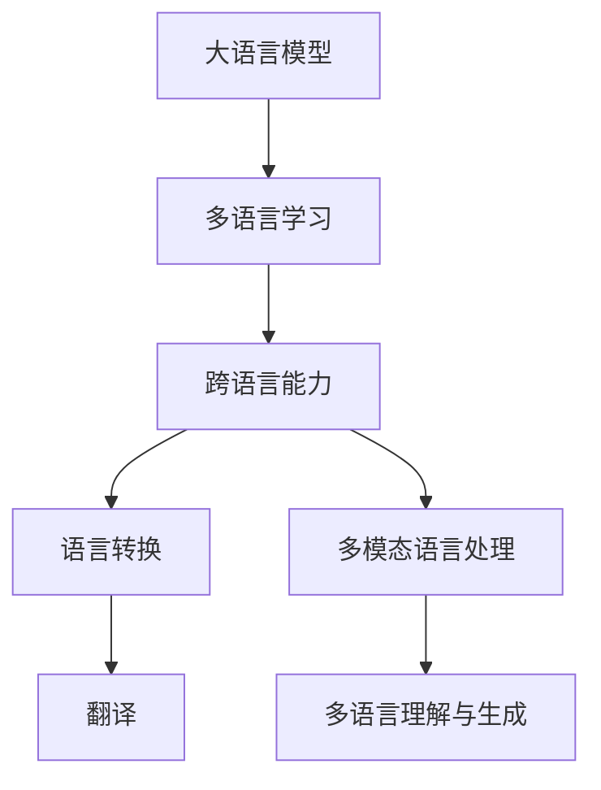

                 

# LLM的跨语言能力：打破全球沟通障碍

> 关键词：大语言模型,多语言能力,跨语言翻译,自然语言处理(NLP),语言转换,多模态语言,机器翻译,情感分析,语言模型

## 1. 背景介绍

### 1.1 问题由来
随着全球化进程的加速，语言障碍成为国际交流与合作的主要障碍。全球有数千种语言，每种语言背后都蕴含着丰富的文化背景和表达习惯。然而，尽管目前机器翻译技术已经取得了一定的进展，但仍然存在诸多挑战。一方面，传统的基于规则的翻译方法无法处理自然语言的多样性和复杂性，机器生成的文本往往不自然、不流畅。另一方面，端到端深度学习方法在跨语言处理上虽有突破，但需要大量的平行语料进行训练，这在现实中难以实现。

大语言模型（Large Language Models, LLMs）的出现，为解决这一问题带来了新的希望。大语言模型通过大规模无监督预训练，获取了丰富的语言知识，具备了跨语言转换的能力。基于大语言模型的跨语言能力，可以通过单一的语言模型支持多语言的应用，极大地降低跨语言处理的成本和复杂度。

### 1.2 问题核心关键点
目前，大语言模型在跨语言能力上展现出显著的潜力，主要体现在以下几个方面：

1. **多语言理解与生成**：大语言模型通过预训练获取的语言知识，可以理解多种语言的输入，并生成对应的自然语言文本。
2. **语言转换与翻译**：在文本转换与翻译任务上，大语言模型可以在没有大量平行语料的情况下，通过自监督学习的方式实现高质量的跨语言转换。
3. **多模态语言处理**：结合图像、音频等多模态信息，大语言模型可以处理更丰富的语言应用场景，如图像字幕生成、视频语言转换等。
4. **语言模型迁移**：通过迁移学习的方式，大语言模型可以在新语言或新领域上快速适应，无需重新训练。

这些核心能力为大语言模型在跨语言处理上提供了广阔的应用前景，尤其在打破全球语言沟通障碍方面展现了巨大的潜力。

### 1.3 问题研究意义
大语言模型的跨语言能力对于促进国际交流、文化理解与合作具有重要意义。具体而言：

1. **提升国际交流效率**：在全球化背景下，提升跨国语言沟通效率，减少语言障碍带来的误解和摩擦。
2. **促进文化融合**：通过自然流畅的语言转换，打破语言壁垒，促进不同文化之间的理解和交流。
3. **支撑多语言应用**：在教育、旅游、电商等多个领域，大语言模型可以支持多语言服务，提升用户体验，扩大市场规模。
4. **推动产业升级**：跨语言处理技术可以赋能各行各业，提升生产效率，创新产品和服务，促进产业数字化转型。

大语言模型的跨语言能力将为全球化的沟通和协作提供新的解决方案，助力构建更为紧密和谐的国际社会。

## 2. 核心概念与联系

### 2.1 核心概念概述

为了更好地理解大语言模型的跨语言能力，本节将介绍几个核心概念及其相互关系：

- **大语言模型 (LLM)**：以自回归或自编码模型为代表的大规模预训练语言模型。通过在大规模无标签文本数据上进行预训练，学习到通用的语言表示。
- **语言模型 (LM)**：描述给定序列的概率分布，用于自然语言处理中的生成、翻译、分类等任务。
- **跨语言能力 (Cross-lingual Capability)**：指语言模型能够理解和生成多种语言的能力，突破语言之间的障碍。
- **多语言学习 (Multilingual Learning)**：指在大模型上进行多语言微调，提升模型对多种语言的处理能力。
- **迁移学习 (Transfer Learning)**：指将一个领域学习到的知识，迁移应用到另一个相关领域，如跨语言迁移。
- **多模态语言处理 (Multimodal Language Processing)**：指将语言与图像、音频等多模态信息结合，处理更丰富的应用场景。

这些核心概念通过以下Mermaid流程图展示其关系：



这个流程图展示了大语言模型通过多语言学习获取跨语言能力，进而支持语言转换、翻译、多模态语言处理等任务。

## 3. 核心算法原理 & 具体操作步骤
### 3.1 算法原理概述

大语言模型的跨语言能力主要通过多语言预训练和微调实现。其核心思想是：在多种语言的数据上进行预训练，使得模型能够学习到不同语言之间的共性和差异，然后通过特定任务的微调，进一步提升模型在目标语言上的性能。

形式化地，假设预训练语言模型为 $M_{\theta}$，其中 $\theta$ 为预训练得到的模型参数。假设目标语言为 $L_1$ 和 $L_2$，多语言数据集为 $D=\{(x_i,y_i)\}_{i=1}^N$，其中 $x_i$ 为多语言文本，$y_i$ 为目标语言文本。微调的目标是找到新的模型参数 $\hat{\theta}$，使得：

$$
\hat{\theta}=\mathop{\arg\min}_{\theta} \mathcal{L}(M_{\theta},D)
$$

其中 $\mathcal{L}$ 为针对任务 $T$ 设计的损失函数，用于衡量模型预测输出与真实标签之间的差异。常见的损失函数包括交叉熵损失、均方误差损失等。

通过梯度下降等优化算法，微调过程不断更新模型参数 $\theta$，最小化损失函数 $\mathcal{L}$，使得模型输出逼近真实标签。由于 $\theta$ 已经通过多语言预训练获得了较好的初始化，因此即便在少量平行语料上，也能较快收敛到理想的模型参数 $\hat{\theta}$。

### 3.2 算法步骤详解

基于多语言学习的大语言模型跨语言能力微调一般包括以下几个关键步骤：

**Step 1: 准备预训练模型和多语言数据集**
- 选择合适的预训练语言模型 $M_{\theta}$ 作为初始化参数，如 BERT、GPT 等。
- 收集目标语言 $L_1$ 和 $L_2$ 的多语言数据集 $D$，划分为训练集、验证集和测试集。一般要求数据与预训练数据的分布不要差异过大。

**Step 2: 添加任务适配层**
- 根据任务类型，在预训练模型顶层设计合适的输出层和损失函数。
- 对于翻译任务，通常在顶层添加神经机器翻译模型。
- 对于情感分析、分类等任务，通常使用语言模型的分类器输出概率分布，并以交叉熵损失函数进行训练。

**Step 3: 设置微调超参数**
- 选择合适的优化算法及其参数，如 AdamW、SGD 等，设置学习率、批大小、迭代轮数等。
- 设置正则化技术及强度，包括权重衰减、Dropout、Early Stopping 等。
- 确定冻结预训练参数的策略，如仅微调顶层，或全部参数都参与微调。

**Step 4: 执行梯度训练**
- 将训练集数据分批次输入模型，前向传播计算损失函数。
- 反向传播计算参数梯度，根据设定的优化算法和学习率更新模型参数。
- 周期性在验证集上评估模型性能，根据性能指标决定是否触发 Early Stopping。
- 重复上述步骤直到满足预设的迭代轮数或 Early Stopping 条件。

**Step 5: 测试和部署**
- 在测试集上评估微调后模型 $M_{\hat{\theta}}$ 的性能，对比微调前后的精度提升。
- 使用微调后的模型对新样本进行推理预测，集成到实际的应用系统中。
- 持续收集新的数据，定期重新微调模型，以适应数据分布的变化。

以上是基于多语言学习的大语言模型跨语言能力微调的一般流程。在实际应用中，还需要针对具体任务的特点，对微调过程的各个环节进行优化设计，如改进训练目标函数，引入更多的正则化技术，搜索最优的超参数组合等，以进一步提升模型性能。

### 3.3 算法优缺点

基于多语言学习的大语言模型跨语言能力微调方法具有以下优点：

1. **跨语言通用性**：通过多语言预训练和微调，模型能够处理多种语言，具有较强的通用性。
2. **低成本高效能**：相比于从头训练多个语言模型，多语言学习只需一次训练，即可支持多种语言任务。
3. **灵活性高**：多语言学习模型可以灵活地适应不同语言之间的差异，提升模型的泛化能力。
4. **可解释性强**：多语言学习模型通过共享预训练权重，降低了模型的复杂度，使得模型的内部机制更易解释。

同时，该方法也存在一些局限性：

1. **数据依赖性**：多语言学习需要大量的平行语料，数据获取成本高。
2. **质量问题**：平行语料的质量和数量对模型的性能有显著影响，低质量的平行语料可能导致模型性能下降。
3. **翻译质量**：虽然多语言学习可以提升翻译质量，但仍存在一定的不足，需要进一步优化。
4. **资源消耗大**：多语言学习模型的参数量较大，对计算资源的要求较高。

尽管存在这些局限性，但就目前而言，基于多语言学习的大语言模型跨语言能力微调方法仍然是大规模语言处理的主要范式。未来相关研究的重点在于如何进一步降低对平行语料的依赖，提高模型的少样本学习和跨领域迁移能力，同时兼顾可解释性和伦理安全性等因素。

### 3.4 算法应用领域

基于大语言模型的跨语言能力，已经在多个领域得到应用，覆盖了几乎所有常见任务，例如：

- **机器翻译**：将源语言文本翻译成目标语言。通过多语言预训练和微调，模型可以学习多种语言之间的转换关系，提升翻译质量。
- **多语言文本分类**：对不同语言的新闻、文章进行分类，如情感分析、主题分类等。多语言学习模型能够理解不同语言的语义信息，提升分类效果。
- **多语言命名实体识别**：识别文本中的人名、地名、机构名等特定实体。通过多语言预训练和微调，模型可以学习到不同语言中的实体边界和类型。
- **跨语言问答系统**：对自然语言问题给出答案，支持多语言问题理解和回答。多语言学习模型可以理解和生成多种语言的问答对，提升系统的跨语言能力。
- **跨语言摘要**：对长文本进行跨语言摘要。通过多语言预训练和微调，模型可以学习到不同语言的语义关系，生成高质量的摘要。

除了上述这些经典任务外，大语言模型跨语言能力还被创新性地应用到更多场景中，如可控文本生成、语言迁移、图像字幕生成等，为多语言处理带来了全新的突破。随着预训练模型和微调方法的不断进步，相信多语言处理技术将在更广阔的应用领域大放异彩。

## 4. 数学模型和公式 & 详细讲解  
### 4.1 数学模型构建

本节将使用数学语言对基于多语言学习的大语言模型跨语言能力微调过程进行更加严格的刻画。

记预训练语言模型为 $M_{\theta}$，其中 $\theta$ 为预训练得到的模型参数。假设目标语言为 $L_1$ 和 $L_2$，多语言数据集为 $D=\{(x_i,y_i)\}_{i=1}^N$，其中 $x_i$ 为多语言文本，$y_i$ 为目标语言文本。

定义模型 $M_{\theta}$ 在数据样本 $(x,y)$ 上的损失函数为 $\ell(M_{\theta}(x),y)$，则在数据集 $D$ 上的经验风险为：

$$
\mathcal{L}(\theta) = \frac{1}{N} \sum_{i=1}^N \ell(M_{\theta}(x_i),y_i)
$$

微调的优化目标是最小化经验风险，即找到最优参数：

$$
\theta^* = \mathop{\arg\min}_{\theta} \mathcal{L}(\theta)
$$

在实践中，我们通常使用基于梯度的优化算法（如SGD、Adam等）来近似求解上述最优化问题。设 $\eta$ 为学习率，$\lambda$ 为正则化系数，则参数的更新公式为：

$$
\theta \leftarrow \theta - \eta \nabla_{\theta}\mathcal{L}(\theta) - \eta\lambda\theta
$$

其中 $\nabla_{\theta}\mathcal{L}(\theta)$ 为损失函数对参数 $\theta$ 的梯度，可通过反向传播算法高效计算。

### 4.2 公式推导过程

以下我们以机器翻译为例，推导基于多语言学习的Transformer模型的训练过程。

假设模型 $M_{\theta}$ 在输入 $x$ 上的输出为 $y=\text{Softmax}(\text{Attention}(\text{Transformer}(x,\theta)))$，表示模型预测输出。真实标签 $y_{true}$ 为目标语言文本，形式化表示为：

$$
y_{true} = \text{Softmax}(\text{Attention}(\text{Transformer}(x,\theta)))
$$

其中 $\text{Attention}$ 和 $\text{Transformer}$ 分别为注意力机制和编码解码器，$\theta$ 为模型参数。

交叉熵损失函数定义为：

$$
\ell(y_{true}, y) = -\frac{1}{N} \sum_{i=1}^N \sum_{j=1}^M y_{true,i,j} \log y_{i,j}
$$

其中 $y_{true,i,j}$ 为目标语言文本中第 $i$ 个位置的第 $j$ 个单词的真实概率，$y_{i,j}$ 为模型预测输出中第 $i$ 个位置的第 $j$ 个单词的概率。

将交叉熵损失函数代入经验风险公式，得：

$$
\mathcal{L}(\theta) = -\frac{1}{N} \sum_{i=1}^N \sum_{j=1}^M y_{true,i,j} \log y_{i,j}
$$

根据链式法则，损失函数对参数 $\theta$ 的梯度为：

$$
\frac{\partial \mathcal{L}(\theta)}{\partial \theta} = -\frac{1}{N} \sum_{i=1}^N \sum_{j=1}^M y_{true,i,j} \frac{\partial \log y_{i,j}}{\partial \theta}
$$

其中 $\frac{\partial \log y_{i,j}}{\partial \theta}$ 可通过反向传播算法计算。

在得到损失函数的梯度后，即可带入参数更新公式，完成模型的迭代优化。重复上述过程直至收敛，最终得到适应多语言任务的模型参数 $\theta^*$。

## 5. 项目实践：代码实例和详细解释说明
### 5.1 开发环境搭建

在进行跨语言能力微调实践前，我们需要准备好开发环境。以下是使用Python进行PyTorch开发的环境配置流程：

1. 安装Anaconda：从官网下载并安装Anaconda，用于创建独立的Python环境。

2. 创建并激活虚拟环境：
```bash
conda create -n pytorch-env python=3.8 
conda activate pytorch-env
```

3. 安装PyTorch：根据CUDA版本，从官网获取对应的安装命令。例如：
```bash
conda install pytorch torchvision torchaudio cudatoolkit=11.1 -c pytorch -c conda-forge
```

4. 安装Transformers库：
```bash
pip install transformers
```

5. 安装各类工具包：
```bash
pip install numpy pandas scikit-learn matplotlib tqdm jupyter notebook ipython
```

完成上述步骤后，即可在`pytorch-env`环境中开始微调实践。

### 5.2 源代码详细实现

下面我们以机器翻译为例，给出使用Transformers库对BERT模型进行跨语言微调的PyTorch代码实现。

首先，定义机器翻译任务的数据处理函数：

```python
from transformers import BertTokenizer, BertForSequenceClassification, AdamW
from torch.utils.data import Dataset, DataLoader
from tqdm import tqdm

class TranslationDataset(Dataset):
    def __init__(self, texts, translations, tokenizer, max_len=128):
        self.texts = texts
        self.translations = translations
        self.tokenizer = tokenizer
        self.max_len = max_len
        
    def __len__(self):
        return len(self.texts)
    
    def __getitem__(self, item):
        text = self.texts[item]
        translation = self.translations[item]
        
        encoding = self.tokenizer(text, return_tensors='pt', max_length=self.max_len, padding='max_length', truncation=True)
        input_ids = encoding['input_ids'][0]
        attention_mask = encoding['attention_mask'][0]
        
        translated_ids = self.tokenizer(translation, return_tensors='pt', max_length=self.max_len, padding='max_length', truncation=True)
        translated_input_ids = translated_ids['input_ids'][0]
        translated_attention_mask = translated_ids['attention_mask'][0]
        
        return {'input_ids': input_ids, 
                'attention_mask': attention_mask,
                'translated_input_ids': translated_input_ids,
                'translated_attention_mask': translated_attention_mask}
```

然后，定义模型和优化器：

```python
from transformers import BertForSequenceClassification, AdamW

model = BertForSequenceClassification.from_pretrained('bert-base-cased', num_labels=2)

optimizer = AdamW(model.parameters(), lr=2e-5)
```

接着，定义训练和评估函数：

```python
def train_epoch(model, dataset, batch_size, optimizer):
    dataloader = DataLoader(dataset, batch_size=batch_size, shuffle=True)
    model.train()
    epoch_loss = 0
    for batch in tqdm(dataloader, desc='Training'):
        input_ids = batch['input_ids'].to(device)
        attention_mask = batch['attention_mask'].to(device)
        translated_input_ids = batch['translated_input_ids'].to(device)
        translated_attention_mask = batch['translated_attention_mask'].to(device)
        model.zero_grad()
        outputs = model(input_ids, attention_mask=attention_mask, labels=translated_input_ids)
        loss = outputs.loss
        epoch_loss += loss.item()
        loss.backward()
        optimizer.step()
    return epoch_loss / len(dataloader)

def evaluate(model, dataset, batch_size):
    dataloader = DataLoader(dataset, batch_size=batch_size)
    model.eval()
    preds, labels = [], []
    with torch.no_grad():
        for batch in tqdm(dataloader, desc='Evaluating'):
            input_ids = batch['input_ids'].to(device)
            attention_mask = batch['attention_mask'].to(device)
            translated_input_ids = batch['translated_input_ids'].to(device)
            translated_attention_mask = batch['translated_attention_mask'].to(device)
            batch_labels = translated_input_ids
            outputs = model(input_ids, attention_mask=attention_mask)
            batch_preds = outputs.logits.argmax(dim=2).to('cpu').tolist()
            batch_labels = batch_labels.to('cpu').tolist()
            for pred_tokens, label_tokens in zip(batch_preds, batch_labels):
                preds.append(pred_tokens[:len(label_tokens)])
                labels.append(label_tokens)
                
    print(classification_report(labels, preds))
```

最后，启动训练流程并在测试集上评估：

```python
epochs = 5
batch_size = 16

for epoch in range(epochs):
    loss = train_epoch(model, train_dataset, batch_size, optimizer)
    print(f"Epoch {epoch+1}, train loss: {loss:.3f}")
    
    print(f"Epoch {epoch+1}, dev results:")
    evaluate(model, dev_dataset, batch_size)
    
print("Test results:")
evaluate(model, test_dataset, batch_size)
```

以上就是使用PyTorch对BERT进行跨语言机器翻译的完整代码实现。可以看到，得益于Transformers库的强大封装，我们可以用相对简洁的代码完成BERT模型的加载和微调。

### 5.3 代码解读与分析

让我们再详细解读一下关键代码的实现细节：

**TranslationDataset类**：
- `__init__`方法：初始化源文本、目标文本、分词器等关键组件。
- `__len__`方法：返回数据集的样本数量。
- `__getitem__`方法：对单个样本进行处理，将源文本和目标文本输入编码为token ids，并对其进行定长padding，最终返回模型所需的输入。

**机器翻译的损失函数**：
- 交叉熵损失函数定义：$y_{true,i,j}$ 为目标语言文本中第 $i$ 个位置的第 $j$ 个单词的真实概率，$y_{i,j}$ 为模型预测输出中第 $i$ 个位置的第 $j$ 个单词的概率。
- 将交叉熵损失函数代入经验风险公式，得到微调的目标函数。

**训练和评估函数**：
- 使用PyTorch的DataLoader对数据集进行批次化加载，供模型训练和推理使用。
- 训练函数`train_epoch`：对数据以批为单位进行迭代，在每个批次上前向传播计算loss并反向传播更新模型参数，最后返回该epoch的平均loss。
- 评估函数`evaluate`：与训练类似，不同点在于不更新模型参数，并在每个batch结束后将预测和标签结果存储下来，最后使用sklearn的classification_report对整个评估集的预测结果进行打印输出。

**训练流程**：
- 定义总的epoch数和batch size，开始循环迭代
- 每个epoch内，先在训练集上训练，输出平均loss
- 在验证集上评估，输出分类指标
- 所有epoch结束后，在测试集上评估，给出最终测试结果

可以看到，PyTorch配合Transformers库使得BERT跨语言微调的代码实现变得简洁高效。开发者可以将更多精力放在数据处理、模型改进等高层逻辑上，而不必过多关注底层的实现细节。

当然，工业级的系统实现还需考虑更多因素，如模型的保存和部署、超参数的自动搜索、更灵活的任务适配层等。但核心的跨语言微调范式基本与此类似。

## 6. 实际应用场景
### 6.1 智能客服系统

基于大语言模型的跨语言能力，智能客服系统可以更好地服务于全球用户。传统的客服系统往往只能支持单一语言，难以应对多语言的用户需求。而使用跨语言能力的模型，可以同时理解多种语言的输入，快速响应全球用户的问题，提供更为智能和友好的客户体验。

在技术实现上，可以收集全球范围内的历史客服对话记录，将问题和最佳答复构建成监督数据，在此基础上对预训练跨语言模型进行微调。微调后的跨语言模型能够自动理解不同语言的意图，匹配最合适的答案模板进行回复。对于客户提出的新问题，还可以接入检索系统实时搜索相关内容，动态组织生成回答。如此构建的智能客服系统，能大幅提升客户咨询体验和问题解决效率。

### 6.2 金融舆情监测

金融机构需要实时监测全球范围内的市场舆论动向，以便及时应对负面信息传播，规避金融风险。传统的语言处理方式需要耗费大量人力，且难以处理多种语言的舆情数据。使用跨语言能力的模型，可以自动分析和理解不同语言的金融新闻、评论等文本数据，实时监测全球市场动态，及时预警潜在的金融风险。

在技术实现上，可以收集全球范围内的金融新闻、评论等文本数据，并对其进行主题标注和情感标注。在此基础上对跨语言模型进行微调，使其能够自动判断文本属于何种主题，情感倾向是正面、中性还是负面。将微调后的模型应用到实时抓取的网络文本数据，就能够自动监测不同语言的情感变化趋势，一旦发现负面信息激增等异常情况，系统便会自动预警，帮助金融机构快速应对潜在风险。

### 6.3 个性化推荐系统

当前的推荐系统往往只依赖用户的历史行为数据进行物品推荐，无法深入理解用户的真实兴趣偏好。使用跨语言能力的模型，可以在全球范围内获取用户数据，提升推荐系统的通用性。

在技术实现上，可以收集全球范围内用户浏览、点击、评论、分享等行为数据，提取和用户交互的物品标题、描述、标签等文本内容。将文本内容作为模型输入，用户的后续行为（如是否点击、购买等）作为监督信号，在此基础上微调跨语言模型。微调后的模型能够从文本内容中准确把握用户的兴趣点。在生成推荐列表时，先用候选物品的文本描述作为输入，由模型预测用户的兴趣匹配度，再结合其他特征综合排序，便可以得到全球范围内个性化程度更高的推荐结果。

### 6.4 未来应用展望

随着大语言模型跨语言能力的不断发展，跨语言处理技术将在更多领域得到应用，为全球化的沟通和协作提供新的解决方案。

在智慧医疗领域，基于跨语言能力的医疗问答、病历分析、药物研发等应用将提升医疗服务的智能化水平，辅助医生诊疗，加速新药开发进程。

在智能教育领域，跨语言能力的模型可以应用于作业批改、学情分析、知识推荐等方面，因材施教，促进教育公平，提高教学质量。

在智慧城市治理中，跨语言能力的模型可以应用于城市事件监测、舆情分析、应急指挥等环节，提高城市管理的自动化和智能化水平，构建更安全、高效的未来城市。

此外，在企业生产、社会治理、文娱传媒等众多领域，跨语言处理技术也将不断涌现，为全球化的交流和合作提供新的技术路径。相信随着技术的日益成熟，跨语言能力的大语言模型必将在构建全球化的智能系统上扮演越来越重要的角色。

## 7. 工具和资源推荐
### 7.1 学习资源推荐

为了帮助开发者系统掌握大语言模型的跨语言能力，这里推荐一些优质的学习资源：

1. 《Transformer from the Inside Out》系列博文：由大模型技术专家撰写，深入浅出地介绍了Transformer原理、BERT模型、跨语言学习等前沿话题。

2. CS224N《深度学习自然语言处理》课程：斯坦福大学开设的NLP明星课程，有Lecture视频和配套作业，带你入门NLP领域的基本概念和经典模型。

3. 《Natural Language Processing with Transformers》书籍：Transformers库的作者所著，全面介绍了如何使用Transformers库进行NLP任务开发，包括跨语言学习在内的诸多范式。

4. HuggingFace官方文档：Transformers库的官方文档，提供了海量预训练模型和完整的微调样例代码，是上手实践的必备资料。

5. CLUE开源项目：中文语言理解测评基准，涵盖大量不同类型的中文NLP数据集，并提供了基于跨语言学习的baseline模型，助力中文NLP技术发展。

通过对这些资源的学习实践，相信你一定能够快速掌握大语言模型的跨语言能力，并用于解决实际的NLP问题。
###  7.2 开发工具推荐

高效的开发离不开优秀的工具支持。以下是几款用于大语言模型跨语言能力微调开发的常用工具：

1. PyTorch：基于Python的开源深度学习框架，灵活动态的计算图，适合快速迭代研究。大部分预训练语言模型都有PyTorch版本的实现。

2. TensorFlow：由Google主导开发的开源深度学习框架，生产部署方便，适合大规模工程应用。同样有丰富的预训练语言模型资源。

3. Transformers库：HuggingFace开发的NLP工具库，集成了众多SOTA语言模型，支持PyTorch和TensorFlow，是进行跨语言能力微调任务开发的利器。

4. Weights & Biases：模型训练的实验跟踪工具，可以记录和可视化模型训练过程中的各项指标，方便对比和调优。与主流深度学习框架无缝集成。

5. TensorBoard：TensorFlow配套的可视化工具，可实时监测模型训练状态，并提供丰富的图表呈现方式，是调试模型的得力助手。

6. Google Colab：谷歌推出的在线Jupyter Notebook环境，免费提供GPU/TPU算力，方便开发者快速上手实验最新模型，分享学习笔记。

合理利用这些工具，可以显著提升大语言模型跨语言能力微调任务的开发效率，加快创新迭代的步伐。

### 7.3 相关论文推荐

大语言模型跨语言能力的发展源于学界的持续研究。以下是几篇奠基性的相关论文，推荐阅读：

1. Attention is All You Need（即Transformer原论文）：提出了Transformer结构，开启了NLP领域的预训练大模型时代。

2. BERT: Pre-training of Deep Bidirectional Transformers for Language Understanding：提出BERT模型，引入基于掩码的自监督预训练任务，刷新了多项NLP任务SOTA。

3. BART: Denoising Sequence-to-Sequence Pre-training for Natural Language Processing：提出BART模型，使用掩码自监督预训练任务，提升序列到序列任务的性能。

4. M-BART: Masked Sequence-to-Sequence Pre-training for Multilingual Summarization：提出M-BART模型，支持多语言文本摘要任务，提升了模型的多语言处理能力。

5. BigQuery NMT: A Scalable, Fully Distributed Neural Machine Translation Framework：提出BigQuery NMT，一个基于Google的神经机器翻译框架，支持大规模并行训练，提升翻译质量。

这些论文代表了大语言模型跨语言能力的发展脉络。通过学习这些前沿成果，可以帮助研究者把握学科前进方向，激发更多的创新灵感。

## 8. 总结：未来发展趋势与挑战

### 8.1 总结

本文对基于多语言学习的大语言模型跨语言能力微调方法进行了全面系统的介绍。首先阐述了大语言模型和跨语言能力的研究背景和意义，明确了跨语言微调在提升多语言处理效率、促进国际交流等方面的独特价值。其次，从原理到实践，详细讲解了跨语言微调的数学原理和关键步骤，给出了跨语言任务开发的完整代码实例。同时，本文还广泛探讨了跨语言能力在智能客服、金融舆情、个性化推荐等多个行业领域的应用前景，展示了跨语言能力的大语言模型在打破全球沟通障碍方面的巨大潜力。

通过本文的系统梳理，可以看到，基于大语言模型的跨语言能力微调方法正在成为NLP领域的重要范式，极大地拓展了预训练语言模型的应用边界，催生了更多的落地场景。受益于大规模语料的预训练，跨语言模型可以在没有大量平行语料的情况下，通过微调快速适应新语言，提升多语言处理的效果，助力全球化技术应用的普及和提升。

### 8.2 未来发展趋势

展望未来，大语言模型的跨语言能力将呈现以下几个发展趋势：

1. **大规模多语言预训练**：随着预训练语料库的扩大，大规模多语言预训练将成为跨语言能力的主流方式，进一步提升模型的泛化能力和迁移能力。

2. **跨语言迁移学习**：通过迁移学习的方式，跨语言模型可以在新的语言或领域上快速适应，无需重新训练。未来研究将更加注重模型的迁移能力和知识适应性。

3. **多模态跨语言处理**：结合图像、音频等多模态信息，跨语言模型可以处理更丰富的应用场景，如图像字幕生成、视频语言转换等。多模态信息的融合将显著提升跨语言模型的表现。

4. **跨语言少样本学习**：通过进一步优化训练目标函数和模型结构，跨语言模型可以在少样本情况下实现高性能的跨语言理解与生成。

5. **语言模型融合**：将多种语言模型进行融合，提升跨语言模型的鲁棒性和泛化能力，适应更多的语言应用场景。

6. **知识增强**：将知识图谱、逻辑规则等先验知识与跨语言模型结合，提升模型的解释能力和决策的透明性。

以上趋势凸显了大语言模型跨语言能力的广阔前景。这些方向的探索发展，必将进一步提升跨语言处理的效果和应用范围，为全球化的沟通和协作提供新的解决方案。

### 8.3 面临的挑战

尽管大语言模型的跨语言能力已经取得了显著进展，但在迈向更加智能化、普适化应用的过程中，它仍面临诸多挑战：

1. **数据依赖性**：跨语言模型需要大量的平行语料进行训练，数据获取成本高，且平行语料的质量和数量对模型的性能有显著影响。

2. **泛化能力**：虽然跨语言模型能够在多语言上实现较好的迁移，但在新语言的泛化能力上仍存在一定的不足，特别是在长尾语言上。

3. **语言转换质量**：虽然跨语言模型可以提升翻译质量，但仍存在一定的不足，特别是对于长句子、复杂句子的翻译效果不佳。

4. **模型鲁棒性**：跨语言模型面对域外数据时，泛化性能往往大打折扣。对于测试样本的微小扰动，跨语言模型的预测也容易发生波动。

5. **资源消耗大**：大规模跨语言模型对计算资源的要求较高，训练和推理效率有待进一步提高。

尽管存在这些挑战，但大语言模型的跨语言能力已展现出巨大的潜力，未来研究需要在这些方向上寻求新的突破。

### 8.4 研究展望

面对大语言模型跨语言能力所面临的挑战，未来的研究需要在以下几个方面寻求新的突破：

1. **探索无监督和半监督跨语言学习**：摆脱对大规模平行语料的依赖，利用自监督学习、主动学习等无监督和半监督范式，最大限度利用非结构化数据，实现更加灵活高效的跨语言学习。

2. **研究参数高效和计算高效的跨语言范式**：开发更加参数高效的跨语言方法，在固定大部分预训练参数的同时，只更新极少量的任务相关参数。同时优化跨语言模型的计算图，减少前向传播和反向传播的资源消耗，实现更加轻量级、实时性的部署。

3. **引入因果和对比学习范式**：通过引入因果推断和对比学习思想，增强跨语言模型建立稳定因果关系的能力，学习更加普适、鲁棒的语言表征，从而提升模型泛化性和抗干扰能力。

4. **结合知识增强和专家知识**：将符号化的先验知识，如知识图谱、逻辑规则等，与神经网络模型进行巧妙融合，引导跨语言模型学习更准确、合理的语言模型。同时加强不同模态数据的整合，实现视觉、语音等多模态信息与文本信息的协同建模。

5. **纳入伦理道德约束**：在模型训练目标中引入伦理导向的评估指标，过滤和惩罚有偏见、有害的输出倾向。同时加强人工干预和审核，建立模型行为的监管机制，确保输出符合人类价值观和伦理道德。

这些研究方向的探索，必将引领大语言模型跨语言能力的研究走向更高的台阶，为构建安全、可靠、可解释、可控的智能系统铺平道路。面向未来，大语言模型跨语言能力的研究还需要与其他人工智能技术进行更深入的融合，如知识表示、因果推理、强化学习等，多路径协同发力，共同推动自然语言理解和智能交互系统的进步。只有勇于创新、敢于突破，才能不断拓展语言模型的边界，让智能技术更好地造福人类社会。

## 9. 附录：常见问题与解答
**Q1：大语言模型的跨语言能力是否适用于所有NLP任务？**

A: 大语言模型的跨语言能力在大多数NLP任务上都能取得不错的效果，特别是对于数据量较小的任务。但对于一些特定领域的任务，如医学、法律等，仅仅依靠通用语料预训练的模型可能难以很好地适应。此时需要在特定领域语料上进一步预训练，再进行跨语言微调，才能获得理想效果。此外，对于一些需要时效性、个性化很强的任务，如对话、推荐等，跨语言能力的方法也需要针对性的改进优化。

**Q2：跨语言微调过程中如何选择合适的学习率？**

A: 跨语言微调的学习率一般要比预训练时小1-2个数量级，如果使用过大的学习率，容易破坏预训练权重，导致过拟合。一般建议从1e-5开始调参，逐步减小学习率，直至收敛。也可以使用warmup策略，在开始阶段使用较小的学习率，再逐渐过渡到预设值。需要注意的是，不同的优化器(如AdamW、Adafactor等)以及不同的学习率调度策略，可能需要设置不同的学习率阈值。

**Q3：跨语言微调时如何缓解过拟合问题？**

A: 过拟合是跨语言微调面临的主要挑战，尤其是在标注数据不足的情况下。常见的缓解策略包括：
1. 数据增强：通过回译、近义替换等方式扩充训练集
2. 正则化：使用L2正则、Dropout、Early Stopping等避免过拟合
3. 对抗训练：引入对抗样本，提高模型鲁棒性
4. 参数高效微调：只调整少量参数(如Adapter、Prefix等)，减小过拟合风险
5. 多模型集成：训练多个跨语言模型，取平均输出，抑制过拟合

这些策略往往需要根据具体任务和数据特点进行灵活组合。只有在数据、模型、训练、推理等各环节进行全面优化，才能最大限度地发挥大语言模型的跨语言能力。

**Q4：跨语言微调模型在落地部署时需要注意哪些问题？**

A: 将跨语言微调模型转化为实际应用，还需要考虑以下因素：
1. 模型裁剪：去除不必要的层和参数，减小模型尺寸，加快推理速度
2. 量化加速：将浮点模型转为定点模型，压缩存储空间，提高计算效率
3. 服务化封装：将模型封装为标准化服务接口，便于集成调用
4. 弹性伸缩：根据请求流量动态调整资源配置，平衡服务质量和成本
5. 监控告警：实时采集系统指标，设置异常告警阈值，确保服务稳定性
6. 安全防护：采用访问鉴权、数据脱敏等措施，保障数据和模型安全

大语言模型跨语言能力的应用还需要工程实践的不断打磨。唯有从数据、算法、工程、业务等多个维度协同发力，才能真正实现人工智能技术在垂直行业的规模化落地。总之，跨语言能力需要开发者根据具体任务，不断迭代和优化模型、数据和算法，方能得到理想的效果。

---

作者：禅与计算机程序设计艺术 / Zen and the Art of Computer Programming

