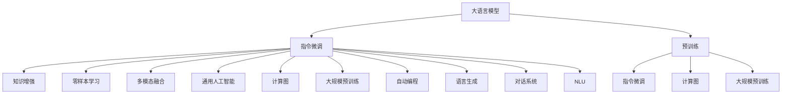

                 

# LLM的魔力：创造无限可能的指令集

> 关键词：
大语言模型(Large Language Model, LLM), 指令微调, 知识增强, 零样本学习, 多模态融合, 通用人工智能, 计算图, 大规模预训练, 自动编程, 语言生成, 对话系统, 自然语言理解(NLU)

## 1. 背景介绍

### 1.1 问题由来

近年来，随着人工智能技术的飞速发展，大语言模型（Large Language Model, LLM）在自然语言处理（NLP）领域取得了巨大突破。这些模型通过在大规模无标签文本数据上进行预训练，学习到了丰富的语言知识，能够理解并生成自然语言，具备了强大的语言理解和生成能力。

然而，大语言模型往往需要巨量的计算资源和数据进行预训练，这限制了其在大规模定制化任务中的广泛应用。为了将大语言模型应用于特定的领域和任务，指令微调（Instruction Fine-tuning）方法应运而生。通过指令微调，可以在小规模数据集上快速训练出能够执行特定任务的模型，极大提高了模型的定制化能力和应用效率。

### 1.2 问题核心关键点

指令微调的核心思想是：在大语言模型的基础上，使用特定的指令（Prompt）作为输入，通过微调（Fine-tuning）使其具备执行特定任务的能力。指令微调的关键点包括：

1. 指令设计：如何设计有效的指令，使得大语言模型能够准确理解和执行该指令。
2. 数据标注：如何收集和标注与特定任务相关的数据，用于微调模型的训练。
3. 模型优化：如何选择合适的模型结构和优化算法，最小化模型损失函数。
4. 模型应用：如何将微调后的模型部署到实际应用中，实现高效的任务执行。

这些关键点共同构成了指令微调的基本框架，其应用场景涵盖了自然语言处理、计算机视觉、机器人控制等多个领域。

### 1.3 问题研究意义

指令微调技术具有重要研究意义，主要体现在以下几个方面：

1. **提高定制化能力**：指令微调可以针对特定的应用场景和任务进行模型定制，提高模型对特定任务的执行效率和准确性。
2. **降低开发成本**：相比于从头开发模型，指令微调可以显著降低模型训练和优化的成本，缩短项目开发周期。
3. **推动通用人工智能发展**：指令微调为通用人工智能（AGI）的发展提供了重要基础，帮助构建能够执行各种复杂任务的智能系统。
4. **提升用户体验**：通过指令微调，可以为用户提供更加自然、高效的交互体验，提升系统的人机交互质量。
5. **拓展应用场景**：指令微调技术可以广泛应用于智能客服、金融预测、医疗诊断等领域，推动各行业的数字化转型。

## 2. 核心概念与联系

### 2.1 核心概念概述

为了更好地理解指令微调技术，我们需要了解以下核心概念：

1. **大语言模型**：如GPT-3、BERT等，通过大规模预训练学习通用语言表示，具备强大的语言理解和生成能力。
2. **指令微调**：在预训练模型基础上，通过特定指令的微调，使其具备执行特定任务的能力。
3. **知识增强**：通过指令微调，将特定领域的知识注入到模型中，提升模型的领域相关性。
4. **零样本学习**：模型在不接触任何具体样本的情况下，仅通过指令即可执行任务，提高了模型的泛化能力。
5. **多模态融合**：将不同模态的数据（如图像、语音、文本等）融合到指令微调中，增强模型的跨模态理解能力。
6. **通用人工智能**：通过指令微调，模型能够执行各种复杂任务，逐步接近通用人工智能的目标。
7. **计算图**：模型训练过程中使用的图结构表示，用于记录模型的计算流程和数据流。
8. **大规模预训练**：模型在无标签数据上进行预训练，学习通用的语言表示。
9. **自动编程**：模型能够自动执行编程任务，如代码生成、注释编写等。
10. **语言生成**：模型能够生成自然语言，进行文本摘要、对话生成等任务。
11. **对话系统**：基于指令微调技术的对话系统，能够与用户进行自然对话。
12. **自然语言理解(NLU)**：模型能够理解自然语言输入，执行推理和生成等任务。

这些概念之间通过指令微调技术相互联系，共同构成了大语言模型应用的核心框架。

### 2.2 核心概念原理和架构的 Mermaid 流程图



## 3. 核心算法原理 & 具体操作步骤

### 3.1 算法原理概述

指令微调的核心算法原理如下：

1. **指令表示**：将任务指令转换为模型可理解的形式，通常包括输入数据的格式、任务目标和可能的输出格式。
2. **模型初始化**：选择合适的大语言模型作为初始化参数，可以是GPT-3、BERT等。
3. **数据预处理**：对指令和样本数据进行预处理，如分词、编码等，使其符合模型的输入格式。
4. **模型训练**：使用预处理后的数据对模型进行训练，最小化损失函数。
5. **模型优化**：选择合适的优化算法（如Adam、SGD等），设定合适的超参数（如学习率、批大小等），优化模型参数。
6. **模型评估**：在验证集上评估模型性能，调整模型参数，防止过拟合。
7. **模型应用**：将训练好的模型应用于实际任务中，执行指定指令。

### 3.2 算法步骤详解

以下是指令微调的具体操作步骤：

1. **选择模型**：选择合适的预训练大语言模型，如GPT-3、BERT等。
2. **定义任务**：明确指令微调的具体任务，如文本分类、命名实体识别、生成文本等。
3. **设计指令**：设计合适的指令，使得模型能够理解和执行该任务。
4. **准备数据**：收集和标注与任务相关的数据集，划分为训练集、验证集和测试集。
5. **数据预处理**：对指令和样本数据进行预处理，如分词、编码等。
6. **训练模型**：使用预处理后的数据对模型进行训练，最小化损失函数。
7. **调整超参数**：选择合适的优化算法和超参数，调整学习率、批大小等，防止过拟合。
8. **验证模型**：在验证集上评估模型性能，防止过拟合。
9. **应用模型**：将训练好的模型应用于实际任务中，执行指定指令。

### 3.3 算法优缺点

指令微调具有以下优点：

1. **简单高效**：指令微调可以使用少量标注数据，快速训练出能够执行特定任务的模型。
2. **任务灵活**：指令微调可以灵活处理各种任务，如文本分类、命名实体识别、生成文本等。
3. **泛化能力强**：指令微调模型具有较强的泛化能力，可以在新任务上快速适应和执行。
4. **易于部署**：指令微调模型部署简单，可以轻松集成到各种应用中，提高系统的效率和用户体验。

指令微调也存在一些缺点：

1. **依赖指令设计**：指令微调的效果高度依赖于指令的设计，设计不当可能导致模型无法理解指令或执行错误。
2. **数据标注成本高**：尽管数据需求较低，但高质量标注数据的获取和标注成本较高。
3. **模型复杂度**：指令微调模型通常比从头训练模型更复杂，训练和优化过程需要更多的计算资源和时间。
4. **过拟合风险**：如果训练数据不足或指令设计不当，指令微调模型可能过拟合于训练数据，导致泛化性能下降。

### 3.4 算法应用领域

指令微调技术在多个领域得到了广泛应用，包括但不限于：

1. **自然语言处理(NLP)**：如文本分类、命名实体识别、情感分析、机器翻译等。
2. **计算机视觉(CV)**：如图像分类、目标检测、图像生成等。
3. **机器人控制**：如机器人导航、路径规划等。
4. **自动编程**：如代码生成、注释编写等。
5. **语言生成**：如文本摘要、对话生成、自动写作等。
6. **智能客服**：如智能问答、情感分析等。
7. **金融预测**：如股票价格预测、风险评估等。
8. **医疗诊断**：如病历分析、疾病诊断等。

## 4. 数学模型和公式 & 详细讲解 & 举例说明

### 4.1 数学模型构建

为了更好地理解指令微调技术，我们通过数学模型进行详细讲解。

假设我们有一个大语言模型 $M_{\theta}$，其中 $\theta$ 为模型参数。给定一个指令 $I$ 和数据集 $D$，我们的目标是通过指令微调 $M_{\theta}$，使其能够执行指定任务。

设指令 $I$ 为自然语言形式，我们可以将其转换为模型可以理解的向量表示 $I_v$。模型在指令 $I$ 下的输出为 $M_{\theta}(I_v)$，表示模型执行该指令的预测结果。

我们定义模型的损失函数为 $L(I_v, y)$，其中 $y$ 为真实结果。则模型的最小化目标为：

$$
\min_{\theta} \sum_{I \in D} L(I_v, y)
$$

为了求解上述最小化问题，我们通常使用梯度下降算法，对模型参数 $\theta$ 进行优化：

$$
\theta \leftarrow \theta - \eta \nabla_{\theta} \sum_{I \in D} L(I_v, y)
$$

其中 $\eta$ 为学习率，$\nabla_{\theta} \sum_{I \in D} L(I_v, y)$ 为损失函数对模型参数 $\theta$ 的梯度。

### 4.2 公式推导过程

以指令微调中的零样本学习为例，推导公式如下：

假设我们要让模型执行一个简单的指令，如“翻译英语句子”。我们可以将指令转换为模型可以理解的向量表示 $I_v$，然后输入到模型中进行预测。

设模型在指令 $I$ 下的输出为 $M_{\theta}(I_v)$，真实结果为 $y$，则损失函数可以定义为：

$$
L(I_v, y) = -\log(M_{\theta}(I_v)[y])
$$

其中 $M_{\theta}(I_v)[y]$ 表示模型在指令 $I$ 下输出 $y$ 的概率。

将损失函数扩展到整个数据集，我们得到：

$$
\mathcal{L}(\theta) = \sum_{I \in D} L(I_v, y)
$$

对 $\theta$ 求梯度，得：

$$
\nabla_{\theta} \mathcal{L}(\theta) = \sum_{I \in D} \nabla_{\theta} L(I_v, y)
$$

将梯度代入优化公式，得到：

$$
\theta \leftarrow \theta - \eta \sum_{I \in D} \nabla_{\theta} L(I_v, y)
$$

通过上述公式，我们可以使用梯度下降算法对模型进行优化，使其能够执行指定的指令。

### 4.3 案例分析与讲解

以指令微调中的文本分类任务为例，详细讲解指令微调的应用。

假设我们要让模型对新闻文本进行情感分类，我们可以将指令定义为：“将以下文本分类为正面或负面情感”，然后提供一段新闻文本作为输入。

我们首先对指令进行向量表示，得到 $I_v$。然后将新闻文本进行预处理，转化为模型可以理解的格式，作为模型的输入。

在训练过程中，我们将模型在指令 $I$ 下的输出 $M_{\theta}(I_v)$ 与真实情感标签 $y$ 进行对比，计算损失函数 $L(I_v, y)$，并使用梯度下降算法对模型参数 $\theta$ 进行优化。

在测试过程中，我们将新文本输入模型，得到模型预测的情感分类结果，与真实情感标签进行对比，评估模型性能。

## 5. 项目实践：代码实例和详细解释说明

### 5.1 开发环境搭建

为了进行指令微调实践，我们需要准备好开发环境。以下是使用Python进行PyTorch开发的环境配置流程：

1. 安装Anaconda：从官网下载并安装Anaconda，用于创建独立的Python环境。

2. 创建并激活虚拟环境：
```bash
conda create -n pytorch-env python=3.8 
conda activate pytorch-env
```

3. 安装PyTorch：根据CUDA版本，从官网获取对应的安装命令。例如：
```bash
conda install pytorch torchvision torchaudio cudatoolkit=11.1 -c pytorch -c conda-forge
```

4. 安装Transformers库：
```bash
pip install transformers
```

5. 安装各类工具包：
```bash
pip install numpy pandas scikit-learn matplotlib tqdm jupyter notebook ipython
```

完成上述步骤后，即可在`pytorch-env`环境中开始指令微调实践。

### 5.2 源代码详细实现

下面我们以命名实体识别(NER)任务为例，给出使用Transformers库对BERT模型进行指令微调的PyTorch代码实现。

首先，定义NER任务的数据处理函数：

```python
from transformers import BertTokenizer
from torch.utils.data import Dataset
import torch

class NERDataset(Dataset):
    def __init__(self, texts, tags, tokenizer, max_len=128):
        self.texts = texts
        self.tags = tags
        self.tokenizer = tokenizer
        self.max_len = max_len
        
    def __len__(self):
        return len(self.texts)
    
    def __getitem__(self, item):
        text = self.texts[item]
        tags = self.tags[item]
        
        encoding = self.tokenizer(text, return_tensors='pt', max_length=self.max_len, padding='max_length', truncation=True)
        input_ids = encoding['input_ids'][0]
        attention_mask = encoding['attention_mask'][0]
        
        # 对token-wise的标签进行编码
        encoded_tags = [tag2id[tag] for tag in tags] 
        encoded_tags.extend([tag2id['O']] * (self.max_len - len(encoded_tags)))
        labels = torch.tensor(encoded_tags, dtype=torch.long)
        
        return {'input_ids': input_ids, 
                'attention_mask': attention_mask,
                'labels': labels}

# 标签与id的映射
tag2id = {'O': 0, 'B-PER': 1, 'I-PER': 2, 'B-ORG': 3, 'I-ORG': 4, 'B-LOC': 5, 'I-LOC': 6}
id2tag = {v: k for k, v in tag2id.items()}

# 创建dataset
tokenizer = BertTokenizer.from_pretrained('bert-base-cased')

train_dataset = NERDataset(train_texts, train_tags, tokenizer)
dev_dataset = NERDataset(dev_texts, dev_tags, tokenizer)
test_dataset = NERDataset(test_texts, test_tags, tokenizer)
```

然后，定义模型和优化器：

```python
from transformers import BertForTokenClassification, AdamW

model = BertForTokenClassification.from_pretrained('bert-base-cased', num_labels=len(tag2id))

optimizer = AdamW(model.parameters(), lr=2e-5)
```

接着，定义训练和评估函数：

```python
from torch.utils.data import DataLoader
from tqdm import tqdm
from sklearn.metrics import classification_report

device = torch.device('cuda') if torch.cuda.is_available() else torch.device('cpu')
model.to(device)

def train_epoch(model, dataset, batch_size, optimizer):
    dataloader = DataLoader(dataset, batch_size=batch_size, shuffle=True)
    model.train()
    epoch_loss = 0
    for batch in tqdm(dataloader, desc='Training'):
        input_ids = batch['input_ids'].to(device)
        attention_mask = batch['attention_mask'].to(device)
        labels = batch['labels'].to(device)
        model.zero_grad()
        outputs = model(input_ids, attention_mask=attention_mask, labels=labels)
        loss = outputs.loss
        epoch_loss += loss.item()
        loss.backward()
        optimizer.step()
    return epoch_loss / len(dataloader)

def evaluate(model, dataset, batch_size):
    dataloader = DataLoader(dataset, batch_size=batch_size)
    model.eval()
    preds, labels = [], []
    with torch.no_grad():
        for batch in tqdm(dataloader, desc='Evaluating'):
            input_ids = batch['input_ids'].to(device)
            attention_mask = batch['attention_mask'].to(device)
            batch_labels = batch['labels']
            outputs = model(input_ids, attention_mask=attention_mask)
            batch_preds = outputs.logits.argmax(dim=2).to('cpu').tolist()
            batch_labels = batch_labels.to('cpu').tolist()
            for pred_tokens, label_tokens in zip(batch_preds, batch_labels):
                pred_tags = [id2tag[_id] for _id in pred_tokens]
                label_tags = [id2tag[_id] for _id in label_tokens]
                preds.append(pred_tags[:len(label_tags)])
                labels.append(label_tags)
                
    print(classification_report(labels, preds))
```

最后，启动训练流程并在测试集上评估：

```python
epochs = 5
batch_size = 16

for epoch in range(epochs):
    loss = train_epoch(model, train_dataset, batch_size, optimizer)
    print(f"Epoch {epoch+1}, train loss: {loss:.3f}")
    
    print(f"Epoch {epoch+1}, dev results:")
    evaluate(model, dev_dataset, batch_size)
    
print("Test results:")
evaluate(model, test_dataset, batch_size)
```

以上就是使用PyTorch对BERT进行命名实体识别任务指令微调的完整代码实现。可以看到，得益于Transformers库的强大封装，我们可以用相对简洁的代码完成BERT模型的加载和微调。

### 5.3 代码解读与分析

让我们再详细解读一下关键代码的实现细节：

**NERDataset类**：
- `__init__`方法：初始化文本、标签、分词器等关键组件。
- `__len__`方法：返回数据集的样本数量。
- `__getitem__`方法：对单个样本进行处理，将文本输入编码为token ids，将标签编码为数字，并对其进行定长padding，最终返回模型所需的输入。

**tag2id和id2tag字典**：
- 定义了标签与数字id之间的映射关系，用于将token-wise的预测结果解码回真实的标签。

**训练和评估函数**：
- 使用PyTorch的DataLoader对数据集进行批次化加载，供模型训练和推理使用。
- 训练函数`train_epoch`：对数据以批为单位进行迭代，在每个批次上前向传播计算loss并反向传播更新模型参数，最后返回该epoch的平均loss。
- 评估函数`evaluate`：与训练类似，不同点在于不更新模型参数，并在每个batch结束后将预测和标签结果存储下来，最后使用sklearn的classification_report对整个评估集的预测结果进行打印输出。

**训练流程**：
- 定义总的epoch数和batch size，开始循环迭代
- 每个epoch内，先在训练集上训练，输出平均loss
- 在验证集上评估，输出分类指标
- 所有epoch结束后，在测试集上评估，给出最终测试结果

可以看到，PyTorch配合Transformers库使得BERT微调的代码实现变得简洁高效。开发者可以将更多精力放在数据处理、模型改进等高层逻辑上，而不必过多关注底层的实现细节。

当然，工业级的系统实现还需考虑更多因素，如模型的保存和部署、超参数的自动搜索、更灵活的任务适配层等。但核心的指令微调范式基本与此类似。

## 6. 实际应用场景

### 6.1 智能客服系统

基于指令微调的对话技术，可以广泛应用于智能客服系统的构建。传统客服往往需要配备大量人力，高峰期响应缓慢，且一致性和专业性难以保证。而使用指令微调的对话模型，可以7x24小时不间断服务，快速响应客户咨询，用自然流畅的语言解答各类常见问题。

在技术实现上，可以收集企业内部的历史客服对话记录，将问题和最佳答复构建成监督数据，在此基础上对预训练对话模型进行指令微调。微调后的对话模型能够自动理解用户意图，匹配最合适的答案模板进行回复。对于客户提出的新问题，还可以接入检索系统实时搜索相关内容，动态组织生成回答。如此构建的智能客服系统，能大幅提升客户咨询体验和问题解决效率。

### 6.2 金融舆情监测

金融机构需要实时监测市场舆论动向，以便及时应对负面信息传播，规避金融风险。传统的人工监测方式成本高、效率低，难以应对网络时代海量信息爆发的挑战。基于指令微调的文本分类和情感分析技术，为金融舆情监测提供了新的解决方案。

具体而言，可以收集金融领域相关的新闻、报道、评论等文本数据，并对其进行主题标注和情感标注。在此基础上对预训练语言模型进行指令微调，使其能够自动判断文本属于何种主题，情感倾向是正面、中性还是负面。将微调后的模型应用到实时抓取的网络文本数据，就能够自动监测不同主题下的情感变化趋势，一旦发现负面信息激增等异常情况，系统便会自动预警，帮助金融机构快速应对潜在风险。

### 6.3 个性化推荐系统

当前的推荐系统往往只依赖用户的历史行为数据进行物品推荐，无法深入理解用户的真实兴趣偏好。基于指令微调技术，个性化推荐系统可以更好地挖掘用户行为背后的语义信息，从而提供更精准、多样的推荐内容。

在实践中，可以收集用户浏览、点击、评论、分享等行为数据，提取和用户交互的物品标题、描述、标签等文本内容。将文本内容作为模型输入，用户的后续行为（如是否点击、购买等）作为监督信号，在此基础上微调预训练语言模型。微调后的模型能够从文本内容中准确把握用户的兴趣点。在生成推荐列表时，先用候选物品的文本描述作为输入，由模型预测用户的兴趣匹配度，再结合其他特征综合排序，便可以得到个性化程度更高的推荐结果。

### 6.4 未来应用展望

随着指令微调技术的不断发展，未来其在更多领域的应用前景将更加广阔。

在智慧医疗领域，基于指令微调的医疗问答、病历分析、药物研发等应用将提升医疗服务的智能化水平，辅助医生诊疗，加速新药开发进程。

在智能教育领域，指令微调技术可应用于作业批改、学情分析、知识推荐等方面，因材施教，促进教育公平，提高教学质量。

在智慧城市治理中，指令微调模型可应用于城市事件监测、舆情分析、应急指挥等环节，提高城市管理的自动化和智能化水平，构建更安全、高效的未来城市。

此外，在企业生产、社会治理、文娱传媒等众多领域，基于指令微调的人工智能应用也将不断涌现，为经济社会发展注入新的动力。相信随着技术的日益成熟，指令微调方法将成为人工智能落地应用的重要范式，推动人工智能技术在各行各业的大规模应用。

## 7. 工具和资源推荐

### 7.1 学习资源推荐

为了帮助开发者系统掌握指令微调技术的理论基础和实践技巧，这里推荐一些优质的学习资源：

1. 《Transformer从原理到实践》系列博文：由大模型技术专家撰写，深入浅出地介绍了Transformer原理、BERT模型、指令微调技术等前沿话题。

2. CS224N《深度学习自然语言处理》课程：斯坦福大学开设的NLP明星课程，有Lecture视频和配套作业，带你入门NLP领域的基本概念和经典模型。

3. 《Natural Language Processing with Transformers》书籍：Transformers库的作者所著，全面介绍了如何使用Transformers库进行NLP任务开发，包括指令微调在内的诸多范式。

4. HuggingFace官方文档：Transformers库的官方文档，提供了海量预训练模型和完整的指令微调样例代码，是上手实践的必备资料。

5. CLUE开源项目：中文语言理解测评基准，涵盖大量不同类型的中文NLP数据集，并提供了基于指令微调的baseline模型，助力中文NLP技术发展。

通过对这些资源的学习实践，相信你一定能够快速掌握指令微调的精髓，并用于解决实际的NLP问题。

### 7.2 开发工具推荐

高效的开发离不开优秀的工具支持。以下是几款用于指令微调开发的常用工具：

1. PyTorch：基于Python的开源深度学习框架，灵活动态的计算图，适合快速迭代研究。大部分预训练语言模型都有PyTorch版本的实现。

2. TensorFlow：由Google主导开发的开源深度学习框架，生产部署方便，适合大规模工程应用。同样有丰富的预训练语言模型资源。

3. Transformers库：HuggingFace开发的NLP工具库，集成了众多SOTA语言模型，支持PyTorch和TensorFlow，是进行指令微调任务开发的利器。

4. Weights & Biases：模型训练的实验跟踪工具，可以记录和可视化模型训练过程中的各项指标，方便对比和调优。与主流深度学习框架无缝集成。

5. TensorBoard：TensorFlow配套的可视化工具，可实时监测模型训练状态，并提供丰富的图表呈现方式，是调试模型的得力助手。

6. Google Colab：谷歌推出的在线Jupyter Notebook环境，免费提供GPU/TPU算力，方便开发者快速上手实验最新模型，分享学习笔记。

合理利用这些工具，可以显著提升指令微调任务的开发效率，加快创新迭代的步伐。

### 7.3 相关论文推荐

指令微调技术的发展源于学界的持续研究。以下是几篇奠基性的相关论文，推荐阅读：

1. Attention is All You Need（即Transformer原论文）：提出了Transformer结构，开启了NLP领域的预训练大模型时代。

2. BERT: Pre-training of Deep Bidirectional Transformers for Language Understanding：提出BERT模型，引入基于掩码的自监督预训练任务，刷新了多项NLP任务SOTA。

3. Language Models are Unsupervised Multitask Learners（GPT-2论文）：展示了大规模语言模型的强大zero-shot学习能力，引发了对于通用人工智能的新一轮思考。

4. Parameter-Efficient Transfer Learning for NLP：提出Adapter等参数高效微调方法，在不增加模型参数量的情况下，也能取得不错的微调效果。

5. Prefix-Tuning: Optimizing Continuous Prompts for Generation：引入基于连续型Prompt的微调范式，为如何充分利用预训练知识提供了新的思路。

6. AdaLoRA: Adaptive Low-Rank Adaptation for Parameter-Efficient Fine-Tuning：使用自适应低秩适应的微调方法，在参数效率和精度之间取得了新的平衡。

这些论文代表了大语言模型指令微调技术的发展脉络。通过学习这些前沿成果，可以帮助研究者把握学科前进方向，激发更多的创新灵感。

## 8. 总结：未来发展趋势与挑战

### 8.1 总结

本文对指令微调技术进行了全面系统的介绍。首先阐述了指令微调技术的研究背景和意义，明确了指令微调在拓展预训练模型应用、提升下游任务性能方面的独特价值。其次，从原理到实践，详细讲解了指令微调的数学原理和关键步骤，给出了指令微调任务开发的完整代码实例。同时，本文还广泛探讨了指令微调技术在智能客服、金融舆情、个性化推荐等多个领域的应用前景，展示了指令微调范式的巨大潜力。此外，本文精选了指令微调技术的各类学习资源，力求为读者提供全方位的技术指引。

通过本文的系统梳理，可以看到，指令微调技术正在成为NLP领域的重要范式，极大地拓展了预训练语言模型的应用边界，催生了更多的落地场景。受益于大规模语料的预训练，指令微调模型以更低的时间和标注成本，在小样本条件下也能取得不俗的效果，有力推动了NLP技术的产业化进程。未来，伴随指令微调技术的持续演进，基于指令微调的大语言模型必将在更广泛的应用领域大放异彩，深刻影响人类的生产生活方式。

### 8.2 未来发展趋势

展望未来，指令微调技术将呈现以下几个发展趋势：

1. **模型规模持续增大**：随着算力成本的下降和数据规模的扩张，预训练语言模型的参数量还将持续增长。超大规模语言模型蕴含的丰富语言知识，有望支撑更加复杂多变的指令微调任务。

2. **指令设计更加灵活**：未来的指令设计将更加精细化和多样化，能够更准确地描述任务要求，提高指令微调的效果。

3. **知识增强更具普适性**：通过指令微调，模型能够更高效地吸收不同领域的知识，提升模型的跨领域适应能力。

4. **零样本学习能力提升**：基于指令微调的零样本学习技术将进一步提升，使得模型能够在没有具体样例的情况下，直接执行指令。

5. **多模态融合深入发展**：将不同模态的数据（如图像、语音、文本等）融合到指令微调中，增强模型的跨模态理解能力。

6. **通用人工智能目标逐步实现**：指令微调技术为通用人工智能（AGI）的发展提供了重要基础，帮助构建能够执行各种复杂任务的智能系统。

以上趋势凸显了指令微调技术的广阔前景。这些方向的探索发展，必将进一步提升NLP系统的性能和应用范围，为人类认知智能的进化带来深远影响。

### 8.3 面临的挑战

尽管指令微调技术已经取得了瞩目成就，但在迈向更加智能化、普适化应用的过程中，它仍面临着诸多挑战：

1. **指令设计复杂**：设计高质量、高效的指令是当前指令微调面临的主要挑战之一。指令设计的复杂性和精度直接影响微调模型的效果。

2. **数据标注成本高**：尽管指令微调所需数据量较少，但高质量标注数据的获取和标注成本依然较高，限制了指令微调的广泛应用。

3. **模型泛化能力不足**：指令微调模型在新任务上的泛化能力仍需进一步提升，以应对更多未知领域的应用场景。

4. **推理速度较慢**：大语言模型推理速度较慢，限制了其在实际部署中的应用。如何提高模型的推理效率，是未来需要重点解决的问题。

5. **模型可解释性不足**：指令微调模型往往被视为“黑盒”系统，难以解释其内部工作机制和决策逻辑。这对于高风险应用如医疗、金融等尤为关键。

6. **安全性有待保障**：预训练语言模型可能学习到有害信息，通过指令微调传递到下游任务，造成安全风险。如何确保模型输出安全，是未来需要重点关注的问题。

7. **资源消耗高**：大语言模型资源消耗高，需要高性能计算资源和存储空间，限制了其大规模部署。

8. **多语言支持不足**：现有的指令微调技术主要集中在英语等主流语言，对于小语种的支持不足。

这些挑战需要从算法、数据、硬件等多个层面进行综合优化，才能进一步推动指令微调技术的成熟和发展。

### 8.4 研究展望

面对指令微调面临的挑战，未来的研究需要在以下几个方面寻求新的突破：

1. **优化指令设计**：通过优化指令设计，提高指令的简洁性和准确性，降低指令微调的技术门槛。

2. **提升模型泛化能力**：探索无监督和半监督指令微调方法，增强模型的泛化能力，适应更多未知领域的应用。

3. **加快模型推理速度**：开发高效的模型结构和推理算法，提高指令微调模型的推理速度，实现实时性部署。

4. **增强模型可解释性**：引入可解释性模型技术，提供模型决策的透明性和可理解性，提高模型的可信度和安全性。

5. **确保模型输出安全**：在模型训练目标中引入伦理导向的评估指标，过滤和惩罚有害输出，确保模型输出安全。

6. **支持多语言**：扩展指令微调技术到小语种领域，增强模型的语言适应能力。

7. **优化资源消耗**：通过压缩模型参数、优化计算图等技术，降低指令微调模型的资源消耗，实现高效部署。

这些研究方向的探索，必将引领指令微调技术迈向更高的台阶，为构建安全、可靠、可解释、可控的智能系统铺平道路。面向未来，指令微调技术还需要与其他人工智能技术进行更深入的融合，如知识表示、因果推理、强化学习等，多路径协同发力，共同推动自然语言理解和智能交互系统的进步。只有勇于创新、敢于突破，才能不断拓展指令微调技术的边界，让智能技术更好地造福人类社会。

## 9. 附录：常见问题与解答

**Q1：指令微调是否适用于所有NLP任务？**

A: 指令微调技术适用于大多数NLP任务，特别是对于数据量较小的任务。但对于一些特定领域的任务，如医学、法律等，指令微调的效果可能不够理想。此时需要在特定领域语料上进一步预训练，再进行微调，才能获得理想效果。

**Q2：如何选择适当的指令？**

A: 指令微调的效果高度依赖于指令设计，需要考虑任务的复杂度、语义清晰性等因素。一般来说，简单的、清晰的指令效果更好，但过于简化的指令可能无法涵盖任务的全部要求。可以通过多轮迭代优化，逐步改进指令设计。

**Q3：指令微调过程中如何设置超参数？**

A: 指令微调的超参数设置与一般模型的超参数设置类似，需要考虑学习率、批大小、迭代次数等。通常建议从默认值开始，逐步调整，找到最优参数组合。

**Q4：指令微调模型在部署时需要注意哪些问题？**

A: 指令微调模型部署时需要注意以下几点：

1. 模型裁剪：去除不必要的层和参数，减小模型尺寸，加快推理速度。
2. 量化加速：将浮点模型转为定点模型，压缩存储空间，提高计算效率。
3. 服务化封装：将模型封装为标准化服务接口，便于集成调用。
4. 弹性伸缩：根据请求流量动态调整资源配置，平衡服务质量和成本。
5. 监控告警：实时采集系统指标，设置异常告警阈值，确保服务稳定性。
6. 安全防护：采用访问鉴权、数据脱敏等措施，保障数据和模型安全。

**Q5：指令微调模型在实际应用中可能遇到哪些问题？**

A: 指令微调模型在实际应用中可能遇到以下问题：

1. 指令理解错误：如果指令设计不当或模型理解能力有限，可能导致指令执行错误。
2. 输出质量不稳定：指令微调模型在处理噪声数据或异常指令时，输出质量可能不稳定。
3. 计算资源消耗高：大语言模型资源消耗高，需要高性能计算资源和存储空间，限制了其大规模部署。
4. 泛化能力不足：指令微调模型在新任务上的泛化能力仍需进一步提升，以应对更多未知领域的应用场景。

了解这些问题并采取相应措施，有助于提升指令微调模型的性能和稳定性。

