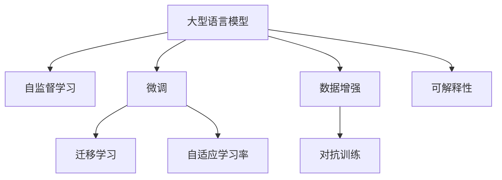

                 

# LLM训练技术：打造超级AI的秘密

## 1. 背景介绍

### 1.1 问题由来

随着人工智能技术的飞速发展，大型语言模型（Large Language Models, LLMs）在自然语言处理（NLP）领域取得了令人瞩目的成就。这类模型，如GPT系列、BERT等，通过在大规模无标签文本数据上进行预训练，学习到了复杂的语言结构和知识，能够在各种NLP任务上取得接近人类水平的性能。

然而，这些大模型的预训练过程需要消耗大量的计算资源，并且其生成的结果往往缺乏可解释性。此外，预训练模型通常需要大量的标注数据来进行微调，而这些数据往往难以获取。这些问题使得大语言模型在实际应用中面临诸多挑战。

## 2. 核心概念与联系

### 2.1 核心概念概述

为了更好地理解如何训练大语言模型，我们需要了解几个核心概念：

- **大型语言模型（LLMs）**：指的是能够处理大量文本数据并学习到复杂语言结构的模型，如GPT-3、BERT等。

- **自监督学习（Self-supervised Learning）**：使用无标签数据进行训练，通过设计合适的预训练任务（如掩码语言模型、预测任务）来学习语言知识。

- **微调（Fine-tuning）**：在大规模预训练的基础上，使用少量标注数据进行有监督学习，优化模型在特定任务上的表现。

- **迁移学习（Transfer Learning）**：利用预训练模型的知识，对新任务进行训练，以减少对标注数据的依赖。

- **自适应学习率（Adaptive Learning Rate）**：如Adam、Adagrad等优化算法，可以动态调整学习率，加快模型收敛。

这些概念之间有着密切的联系，自监督学习提供了预训练的必要条件，而微调和迁移学习则利用这些预训练知识，在特定任务上进一步优化。

### 2.2 核心概念的 Mermaid 流程图



这个流程图展示了大型语言模型训练的基本流程：

1. 自监督学习：使用大规模无标签数据对大型语言模型进行预训练。
2. 微调：在大规模预训练的基础上，使用少量标注数据对模型进行进一步优化。
3. 迁移学习：将预训练模型应用于新的任务，利用已有知识加快学习过程。
4. 自适应学习率：动态调整学习率，加快模型收敛。
5. 数据增强：通过各种手段扩充训练数据集，提高模型的泛化能力。
6. 对抗训练：引入对抗样本，增强模型的鲁棒性。
7. 可解释性：通过各种方法提高模型的可解释性，确保模型输出的可信性。

## 3. 核心算法原理 & 具体操作步骤

### 3.1 算法原理概述

大语言模型的训练过程主要分为两个阶段：预训练和微调。

- **预训练阶段**：使用大规模无标签数据，通过自监督学习任务（如掩码语言模型、预测任务）来训练模型。
- **微调阶段**：在特定任务上，使用少量标注数据对模型进行进一步优化。

微调的核心在于：如何在大规模预训练的基础上，最大化地利用已有知识，同时避免过拟合，提高模型在新任务上的泛化能力。

### 3.2 算法步骤详解

1. **数据准备**：收集并预处理大规模无标签文本数据，使用自监督学习任务（如掩码语言模型、预测任务）进行预训练。
2. **模型选择**：选择合适的预训练模型，如BERT、GPT等。
3. **微调目标设定**：根据任务类型，设定合适的微调目标函数和损失函数。
4. **微调模型训练**：在微调数据集上进行有监督学习，使用自适应学习率优化算法（如Adam）进行模型参数更新。
5. **评估与测试**：在验证集和测试集上评估模型性能，选择最优模型进行部署。

### 3.3 算法优缺点

**优点**：

- **泛化能力强**：预训练模型具备强大的泛化能力，可以适应各种下游任务。
- **效率高**：通过自监督学习任务进行预训练，可以显著减少标注数据的需求。
- **灵活性高**：可以根据不同任务，灵活地进行微调，满足各种应用需求。

**缺点**：

- **计算资源需求高**：预训练和微调过程需要消耗大量计算资源。
- **数据依赖**：微调效果依赖于标注数据的质量和数量。
- **可解释性差**：大型语言模型往往难以解释其决策过程。

### 3.4 算法应用领域

大型语言模型在自然语言处理领域有着广泛的应用，包括但不限于：

- **文本分类**：如情感分析、主题分类等。
- **命名实体识别**：识别文本中的实体，如人名、地名等。
- **机器翻译**：将文本从一种语言翻译成另一种语言。
- **对话系统**：构建智能对话机器人，提供自然语言交互。
- **摘要生成**：从长文本中提取关键信息，生成摘要。
- **文本生成**：生成新闻、故事、诗歌等文本内容。

## 4. 数学模型和公式 & 详细讲解

### 4.1 数学模型构建

假设我们的模型是$M_\theta$，其中$\theta$为模型参数。给定一个任务$T$，其训练集为$D=\{(x_i,y_i)\}_{i=1}^N$，其中$x_i$为输入，$y_i$为标签。我们的目标是最小化损失函数$\mathcal{L}(\theta)$：

$$
\mathcal{L}(\theta) = \frac{1}{N}\sum_{i=1}^N \ell(M_\theta(x_i),y_i)
$$

其中$\ell$为损失函数，通常采用交叉熵损失或均方误差损失。

### 4.2 公式推导过程

以二分类任务为例，假设模型$M_\theta$的输出为$z$，则损失函数$\ell$可以表示为：

$$
\ell(z,y) = -[y\log(z) + (1-y)\log(1-z)]
$$

将损失函数代入经验风险公式，得：

$$
\mathcal{L}(\theta) = -\frac{1}{N}\sum_{i=1}^N [y_i\log M_\theta(x_i)+(1-y_i)\log(1-M_\theta(x_i))]
$$

在微调过程中，我们使用自适应学习率优化算法（如Adam）更新模型参数$\theta$：

$$
\theta \leftarrow \theta - \eta \nabla_\theta \mathcal{L}(\theta) - \eta \lambda \theta
$$

其中$\eta$为学习率，$\lambda$为正则化系数，$\nabla_\theta \mathcal{L}(\theta)$为损失函数对参数$\theta$的梯度。

### 4.3 案例分析与讲解

以BERT为例，假设我们使用它来微调一个新闻分类任务。我们可以使用线性层作为微调层的输出层，并将损失函数设置为交叉熵损失：

$$
\mathcal{L}(\theta) = -\frac{1}{N}\sum_{i=1}^N [y_i \log M_\theta(x_i) + (1-y_i) \log(1-M_\theta(x_i))]
$$

其中$M_\theta(x_i)$表示输入$x_i$通过BERT模型后，再通过线性层得到的结果。

## 5. 项目实践：代码实例和详细解释说明

### 5.1 开发环境搭建

以下是使用Python和PyTorch进行BERT微调的环境配置：

1. 安装Anaconda：
```bash
conda create -n pytorch-env python=3.8 
conda activate pytorch-env
```

2. 安装PyTorch和Transformers库：
```bash
conda install pytorch torchvision torchaudio transformers
```

3. 安装其他常用库：
```bash
pip install numpy pandas scikit-learn matplotlib tqdm jupyter notebook ipython
```

### 5.2 源代码详细实现

```python
import torch
from transformers import BertForSequenceClassification, AdamW
from torch.utils.data import DataLoader
from sklearn.metrics import classification_report

# 加载数据集
train_dataset = # 加载训练集
dev_dataset = # 加载验证集
test_dataset = # 加载测试集

# 定义模型和优化器
model = BertForSequenceClassification.from_pretrained('bert-base-uncased', num_labels=2)
optimizer = AdamW(model.parameters(), lr=2e-5)

# 定义微调函数
def train_epoch(model, dataset, batch_size, optimizer):
    dataloader = DataLoader(dataset, batch_size=batch_size, shuffle=True)
    model.train()
    epoch_loss = 0
    for batch in dataloader:
        input_ids = batch['input_ids'].to(device)
        attention_mask = batch['attention_mask'].to(device)
        labels = batch['labels'].to(device)
        model.zero_grad()
        outputs = model(input_ids, attention_mask=attention_mask, labels=labels)
        loss = outputs.loss
        epoch_loss += loss.item()
        loss.backward()
        optimizer.step()
    return epoch_loss / len(dataloader)

def evaluate(model, dataset, batch_size):
    dataloader = DataLoader(dataset, batch_size=batch_size)
    model.eval()
    preds, labels = [], []
    with torch.no_grad():
        for batch in dataloader:
            input_ids = batch['input_ids'].to(device)
            attention_mask = batch['attention_mask'].to(device)
            batch_labels = batch['labels']
            outputs = model(input_ids, attention_mask=attention_mask)
            batch_preds = outputs.logits.argmax(dim=1).to('cpu').tolist()
            batch_labels = batch_labels.to('cpu').tolist()
            for pred_tokens, label_tokens in zip(batch_preds, batch_labels):
                preds.append(pred_tokens)
                labels.append(label_tokens)
    return classification_report(labels, preds)

# 训练模型
epochs = 5
batch_size = 16

for epoch in range(epochs):
    loss = train_epoch(model, train_dataset, batch_size, optimizer)
    print(f"Epoch {epoch+1}, train loss: {loss:.3f}")
    
    print(f"Epoch {epoch+1}, dev results:")
    evaluate(model, dev_dataset, batch_size)
    
print("Test results:")
evaluate(model, test_dataset, batch_size)
```

### 5.3 代码解读与分析

**数据处理**：

我们使用BERT进行新闻分类任务，需要加载训练集、验证集和测试集。这里假定我们已经将数据集加载到`train_dataset`、`dev_dataset`和`test_dataset`中。

**模型定义**：

我们使用`BertForSequenceClassification`来定义模型，并设置`num_labels`为2，表示这是一个二分类任务。然后定义优化器`optimizer`为AdamW，学习率为2e-5。

**微调函数**：

我们定义了`train_epoch`函数来进行单批次训练，并使用`DataLoader`来处理数据集。在每个批次中，将输入`input_ids`和`attention_mask`传递给模型，并计算损失`loss`，最后使用优化器`optimizer`更新模型参数。

**评估函数**：

我们定义了`evaluate`函数来评估模型在验证集和测试集上的性能。在每个批次中，将输入`input_ids`和`attention_mask`传递给模型，得到预测结果`batch_preds`，并与真实标签`batch_labels`进行比较，最后使用`classification_report`计算分类指标。

**训练循环**：

我们使用一个简单的循环来训练模型，每次迭代在训练集上训练，并在验证集上评估性能。最终在测试集上评估模型，并输出测试结果。

## 6. 实际应用场景

### 6.1 智能客服系统

智能客服系统可以利用BERT模型进行微调，用于处理客户的自然语言查询。我们可以收集历史客服对话数据，并对其进行标注，然后对BERT模型进行微调，使其能够理解客户的意图并给出相应的回答。

### 6.2 金融舆情监测

金融舆情监测可以通过BERT模型进行微调，用于监测金融市场的新闻和评论。我们可以收集金融领域的文本数据，并对其进行标注，然后对BERT模型进行微调，使其能够识别金融市场的情感倾向和主题。

### 6.3 个性化推荐系统

个性化推荐系统可以通过BERT模型进行微调，用于推荐用户可能感兴趣的产品或内容。我们可以收集用户的历史行为数据，并提取文本特征，然后对BERT模型进行微调，使其能够根据文本内容预测用户兴趣。

### 6.4 未来应用展望

未来，BERT模型将会在更多的应用场景中得到应用。随着模型规模的增大和技术的进步，BERT模型将能够处理更复杂的任务，并在各个领域中发挥重要作用。

## 7. 工具和资源推荐

### 7.1 学习资源推荐

1. **《深度学习自然语言处理》课程**：斯坦福大学的NLP课程，涵盖了自然语言处理的基本概念和前沿技术。
2. **《自然语言处理与深度学习》书籍**：由Google员工编写，介绍了NLP的深度学习技术。
3. **《Transformer: A Survey of the Literature and Applications》论文**：由一些顶尖学者撰写，总结了Transformer模型的各种应用。
4. **HuggingFace官方文档**：提供丰富的预训练模型和微调样例代码。

### 7.2 开发工具推荐

1. **PyTorch**：强大的深度学习框架，提供了丰富的优化器和模型构建接口。
2. **TensorFlow**：Google开发的深度学习框架，支持分布式训练和大规模部署。
3. **Transformers**：由HuggingFace开发的NLP工具库，提供了多种预训练模型和微调接口。
4. **Weights & Biases**：实验跟踪工具，可以记录和可视化模型训练过程。
5. **TensorBoard**：TensorFlow配套的可视化工具，可以实时监测模型训练状态。

### 7.3 相关论文推荐

1. **Attention is All You Need**：Transformer模型的原始论文。
2. **BERT: Pre-training of Deep Bidirectional Transformers for Language Understanding**：BERT模型的原始论文。
3. **DistilBERT**：BERT的小模型，性能接近原模型，但计算资源消耗更少。
4. **RoBERTa**：BERT的改进版本，使用了更大的数据集和更多的训练数据。
5. **GPT-3**：GPT系列模型的最新版本，使用大规模无标签数据进行预训练。

## 8. 总结：未来发展趋势与挑战

### 8.1 研究成果总结

大型语言模型的训练技术已经取得了重大进展，并在多个NLP任务上取得了优异的表现。未来的研究方向包括如何进一步提高模型的性能，如何减少对标注数据的依赖，以及如何提高模型的可解释性。

### 8.2 未来发展趋势

1. **更大规模的模型**：随着计算资源的增加，未来可能会训练更大规模的模型，以提升模型的泛化能力。
2. **更高效的训练技术**：未来的训练技术可能会更加高效，减少对计算资源的需求。
3. **更多样化的应用**：大型语言模型将会在更多的领域得到应用，如医疗、金融等。
4. **更智能化的交互**：未来的交互系统可能会更加智能，更加贴近人类自然语言交流的方式。
5. **更高的可解释性**：未来的模型可能会更加可解释，使得人类能够理解其决策过程。

### 8.3 面临的挑战

1. **计算资源的限制**：大规模模型的训练需要大量的计算资源，未来需要更加高效的训练技术来应对。
2. **标注数据的获取**：大规模标注数据的需求使得标注成本较高，未来需要寻找更加高效的数据获取方式。
3. **模型的可解释性**：大型语言模型的决策过程难以解释，未来需要更加可解释的模型。
4. **模型的鲁棒性**：模型需要具备更高的鲁棒性，以应对不同领域和不同数据集的变化。

### 8.4 研究展望

未来的大型语言模型训练技术需要从以下几个方面进行研究：

1. **无监督学习**：利用未标注数据进行训练，减少对标注数据的依赖。
2. **少样本学习**：利用少量标注数据进行训练，减少数据需求。
3. **参数高效的训练方法**：仅更新少量参数，减少计算资源消耗。
4. **多模态学习**：结合文本、图像、语音等多种模态数据进行训练，提升模型的泛化能力。
5. **可解释性**：提高模型的可解释性，使得其决策过程更加透明。

总之，大型语言模型训练技术将在未来的研究中得到更多的关注，并会在各个领域中发挥重要作用。

## 9. 附录：常见问题与解答

**Q1: 大型语言模型训练需要多少计算资源？**

A: 大型语言模型训练需要大量的计算资源，尤其是对于大规模的模型，如GPT-3。一般而言，可以使用GPU或TPU等硬件设备进行训练，以提高训练效率。

**Q2: 大型语言模型训练需要多少标注数据？**

A: 大型语言模型训练通常需要大量的标注数据，尤其是对于微调任务。标注数据的数量和质量对模型性能有重要影响。

**Q3: 如何提高大型语言模型的可解释性？**

A: 提高模型的可解释性是当前研究的热点问题之一。常用的方法包括使用可解释性模型（如LIME、SHAP）、可视化模型输出、编写简单的规则等。

**Q4: 大型语言模型训练的优化技术有哪些？**

A: 优化技术包括学习率调度、批量归一化、正则化等。常用的优化器包括Adam、Adagrad、SGD等。

**Q5: 大型语言模型训练的目标是什么？**

A: 训练大型语言模型的目标是提高模型在特定任务上的性能，减少对标注数据的依赖，提高模型的泛化能力和鲁棒性。

