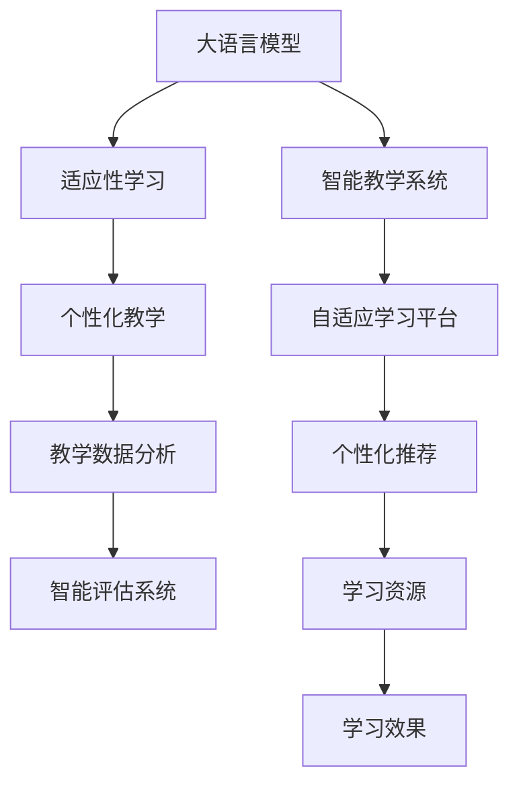

                 

# LLM驱动的智能教学系统：适应性学习平台

> 关键词：
1. 大语言模型（LLM）
2. 适应性学习（Adaptive Learning）
3. 智能教育技术（Smart EdTech）
4. 自适应学习平台（Adaptive Learning Platform）
5. 个性化教学（Personalized Teaching）
6. 教学数据分析（Teaching Data Analytics）
7. 智能评估系统（Smart Assessment System）

## 1. 背景介绍

### 1.1 问题由来

近年来，随着教育技术（EdTech）的快速发展和AI技术的进步，教育领域迎来了新的变革机遇。传统的以教师为中心的教学模式逐渐向以学生为中心的个性化教育模式转变，智能教学系统因其能够提供个性化学习体验而备受关注。其中，基于大语言模型（Large Language Model, LLM）的智能教学系统，因其强大的语言理解和生成能力，成为教育领域的一大热门研究方向。

大语言模型通过在大规模无标签文本数据上进行预训练，学习到语言的通用表示，能够理解并生成自然语言文本，具有广阔的应用前景。在智能教学系统中，大语言模型可以用于自动批改作业、智能问答、智能推荐、教学资源生成等多个环节，极大地提升了教学质量和效率。

然而，大语言模型在教育领域的应用仍面临诸多挑战。如何使其在有限标注数据条件下，快速适应新的学习场景，提升学生的学习效果，是当前智能教学系统研究的重要课题。适应性学习（Adaptive Learning）作为解决这一问题的有效方法，通过动态调整学习内容和教学策略，满足不同学生的学习需求，是当前教育技术研究的重点。

### 1.2 问题核心关键点

适应性学习平台的核心在于如何通过大语言模型，动态适应学生的学习进度和需求，提供个性化的学习建议和资源推荐。具体来说，需要解决以下关键问题：

- 如何收集和分析学生的学习行为数据，理解其学习风格和能力。
- 如何根据学生特点，动态调整教学内容和策略。
- 如何利用大语言模型的多任务学习能力和知识迁移能力，提升个性化教学的效果。
- 如何构建一个高效、灵活、易于维护的智能教学平台。

这些问题的解决，依赖于大语言模型在教育领域的深入应用，以及对学习过程的深入理解。

## 2. 核心概念与联系

### 2.1 核心概念概述

为更好地理解基于大语言模型的适应性学习平台，本节将介绍几个关键概念及其相互关系：

- **大语言模型（LLM）**：以自回归（如GPT）或自编码（如BERT）模型为代表的大规模预训练语言模型。通过在大规模无标签文本数据上进行预训练，学习到语言的通用表示，具备强大的语言理解和生成能力。

- **适应性学习（Adaptive Learning）**：通过动态调整学习内容和策略，满足不同学生的学习需求，提供个性化学习建议和资源推荐的过程。

- **智能教学系统（Smart EdTech）**：利用AI技术，如大语言模型、机器学习等，提升教育过程的智能化水平，实现高效、个性化、交互式的教学模式。

- **自适应学习平台（Adaptive Learning Platform）**：基于AI技术，特别是大语言模型，构建的动态调整教学内容和策略的教学系统。

- **个性化教学（Personalized Teaching）**：根据学生的学习风格和能力，提供量身定制的学习方案和资源，提升学习效果的过程。

- **教学数据分析（Teaching Data Analytics）**：对学生的学习行为数据进行分析，理解学习特点和需求，为动态调整教学策略提供依据的过程。

- **智能评估系统（Smart Assessment System）**：利用AI技术对学生的学习成果进行自动评估，提供及时反馈，指导后续学习的系统。

这些核心概念共同构成了大语言模型在教育领域的应用框架，使大语言模型能够通过学习数据，动态调整教学策略，提供个性化的学习建议，从而提升教学效果。

### 2.2 核心概念原理和架构的 Mermaid 流程图



这个流程图展示了各概念之间的逻辑关系：

1. 大语言模型（A）作为基础，通过自监督学习任务预训练，学习通用语言表示。
2. 适应性学习（B）通过收集和分析学生数据，理解学习特点，动态调整教学策略。
3. 个性化教学（C）根据学生特点，提供个性化学习建议和资源。
4. 教学数据分析（D）对学生数据进行深入分析，指导教学策略调整。
5. 智能评估系统（E）利用大语言模型对学生学习效果进行评估，提供反馈。
6. 智能教学系统（F）整合大语言模型和教学策略，提供智能化的教学服务。
7. 自适应学习平台（G）作为框架，动态调整教学内容和策略。
8. 个性化推荐（H）根据学生需求，提供个性化的学习资源。
9. 学习资源（I）作为支撑，提供丰富的教学内容和工具。
10. 学习效果（J）作为反馈，指导教学策略的调整和优化。

这些概念和流程构成了大语言模型在教育领域应用的完整框架，使智能教学系统能够通过动态调整和优化，提供更加个性化、高效的学习体验。

## 3. 核心算法原理 & 具体操作步骤

### 3.1 算法原理概述

基于大语言模型的适应性学习平台，本质上是一个动态调整教学内容和策略的机器学习过程。其核心思想是通过收集学生的学习行为数据，利用大语言模型学习学生的学习特点和需求，动态调整教学内容和策略，以提供个性化的学习建议和资源推荐。

具体来说，适应性学习平台包括数据收集、学习分析、动态调整、个性化推荐等关键环节。以下是对这些环节的详细描述。

1. **数据收集**：收集学生在平台上的学习行为数据，如观看视频时长、答题次数、作业提交情况等。
2. **学习分析**：利用大语言模型对收集到的数据进行分析，理解学生的学习风格、能力、兴趣等。
3. **动态调整**：根据分析结果，动态调整教学内容和策略，如推荐适合的学习资源、调整作业难度等。
4. **个性化推荐**：根据学生的学习进度和需求，提供个性化的学习建议和资源推荐。

### 3.2 算法步骤详解

以下是对基于大语言模型的适应性学习平台操作步骤的详细讲解：

**Step 1: 数据收集与预处理**

1. **学习行为数据收集**：从平台日志、视频观看记录、作业提交记录等渠道收集学生的学习行为数据。
2. **数据预处理**：对收集到的数据进行清洗、去重、标注等预处理步骤，生成可用于模型训练的标注数据集。

**Step 2: 模型训练与分析**

1. **模型选择**：选择合适的预训练语言模型，如BERT、GPT等，作为初始化参数。
2. **模型训练**：利用收集到的学生学习行为数据，对大语言模型进行有监督训练。训练过程中，可以使用正则化技术、对抗训练等方法，防止过拟合。
3. **学习分析**：通过分析训练后的模型参数，理解学生的学习特点和需求。可以使用特征提取、聚类分析等方法，对学生的学习风格进行分类。

**Step 3: 教学策略动态调整**

1. **教学策略设计**：根据学习分析结果，设计动态调整的教学策略。例如，根据学生的学习风格，推荐适合的学习资源，调整作业难度等。
2. **策略应用**：将教学策略应用于实际的教学过程，如智能推荐学习资源、调整作业难度等。

**Step 4: 个性化推荐与反馈**

1. **个性化推荐**：根据学生的学习进度和需求，提供个性化的学习建议和资源推荐。可以设计提示模板（Prompt Template），引导大语言模型生成推荐内容。
2. **学习效果评估**：利用大语言模型对学生的学习效果进行评估，提供及时反馈，指导后续学习。

### 3.3 算法优缺点

基于大语言模型的适应性学习平台具有以下优点：

1. **高效个性化**：利用大语言模型的强大语言理解和生成能力，提供高效、个性化的学习建议和资源推荐。
2. **数据驱动**：通过收集和分析学生的学习行为数据，动态调整教学策略，提升学习效果。
3. **灵活性高**：大语言模型具备多任务学习能力和知识迁移能力，能够适应不同学生的学习需求。
4. **可扩展性强**：适应性学习平台可以随着数据和模型的不断积累，进行迭代升级和优化。

同时，该方法也存在一些局限性：

1. **数据质量要求高**：学习行为数据的收集和处理对平台和数据的准确性要求较高，数据质量不佳可能导致分析结果不准确。
2. **模型训练复杂**：大语言模型的训练需要大量的计算资源和时间，模型的选择和训练过程复杂。
3. **隐私与安全问题**：学生的学习行为数据涉及个人隐私，平台需要采取措施保护数据安全和隐私。
4. **模型泛化能力**：大语言模型在特定场景下的泛化能力有待进一步验证，模型可能在某些特定任务上表现不佳。

尽管存在这些局限性，但基于大语言模型的适应性学习平台仍是大规模定制化教育的重要工具，具有广阔的应用前景。

### 3.4 算法应用领域

基于大语言模型的适应性学习平台已经广泛应用于以下领域：

- **K-12教育**：帮助小学到高中学生提供个性化学习建议和资源推荐。
- **高等教育**：为大学生提供专业课程的个性化学习路径和资源推荐。
- **企业培训**：为在职员工提供定制化的培训课程和资源推荐。
- **远程教育**：为远程学习者提供个性化学习体验和资源推荐。
- **终身学习**：为成人学习者提供个性化的终身学习资源和建议。

此外，适应性学习平台在特殊教育、职业教育、语言学习等领域也有广泛的应用前景。

## 4. 数学模型和公式 & 详细讲解 & 举例说明

### 4.1 数学模型构建

假设平台收集到学生的学习行为数据 $D=\{(x_i,y_i)\}_{i=1}^N$，其中 $x_i$ 为学习行为特征，$y_i$ 为学习效果。

定义模型 $M_{\theta}$ 在输入 $x_i$ 上的输出为 $y_i$ 的概率分布，即 $P(y_i|x_i) = \frac{e^{M_{\theta}(x_i)}}{\sum_{y' \in \mathcal{Y}} e^{M_{\theta}(x_i,y')}}$，其中 $\mathcal{Y}$ 为所有可能的标签空间。

### 4.2 公式推导过程

**Step 1: 特征提取**

利用大语言模型对学习行为数据 $x_i$ 进行特征提取，得到高维特征向量 $\mathbf{x}_i = M_{\theta}(x_i)$。

**Step 2: 学习效果预测**

利用学习效果 $y_i$ 和特征向量 $\mathbf{x}_i$，构建二分类问题，使用大语言模型进行预测。

$$
P(y_i|x_i) = \frac{e^{M_{\theta}(\mathbf{x}_i,y_i)}}{\sum_{y' \in \mathcal{Y}} e^{M_{\theta}(\mathbf{x}_i,y')}}
$$

**Step 3: 模型训练与优化**

利用标注数据 $D$，通过梯度下降等优化算法，最小化损失函数 $\mathcal{L}(\theta)$，使模型预测效果逼近真实标签。

$$
\theta = \mathop{\arg\min}_{\theta} \mathcal{L}(\theta) = \mathop{\arg\min}_{\theta} -\frac{1}{N}\sum_{i=1}^N y_i \log P(y_i|x_i)
$$

其中，$P(y_i|x_i)$ 为模型预测概率，$y_i$ 为真实标签。

### 4.3 案例分析与讲解

以一个简单的适应性学习平台为例，分析如何利用大语言模型对学生进行个性化推荐。

假设平台收集到学生的学习行为数据 $D=\{(x_i,y_i)\}_{i=1}^N$，其中 $x_i$ 为学生完成的作业数量，$y_i$ 为作业正确率。

1. **数据预处理**：对收集到的数据进行清洗、去重、标注等预处理步骤，生成可用于模型训练的标注数据集。

2. **模型训练**：选择合适的预训练语言模型，如BERT，作为初始化参数。利用标注数据集对模型进行有监督训练，得到模型参数 $\theta$。

3. **特征提取**：利用训练好的模型 $M_{\theta}$，对学生完成的作业进行特征提取，得到高维特征向量 $\mathbf{x}_i = M_{\theta}(x_i)$。

4. **个性化推荐**：根据学生完成的作业数量和正确率，生成提示模板（Prompt Template），引导大语言模型生成个性化推荐内容。

**Prompt Template**：

```
学生姓名：XXX
已完成的作业数量：XXX
作业正确率：XXX
推荐作业：
```

**生成推荐内容**：

```
作业推荐：
```

**学习效果评估**：

利用大语言模型对推荐作业的完成情况进行评估，生成评估报告。

## 5. 项目实践：代码实例和详细解释说明

### 5.1 开发环境搭建

在进行适应性学习平台开发前，需要准备好开发环境。以下是使用Python进行PyTorch开发的环境配置流程：

1. 安装Anaconda：从官网下载并安装Anaconda，用于创建独立的Python环境。

2. 创建并激活虚拟环境：
```bash
conda create -n pytorch-env python=3.8 
conda activate pytorch-env
```

3. 安装PyTorch：根据CUDA版本，从官网获取对应的安装命令。例如：
```bash
conda install pytorch torchvision torchaudio cudatoolkit=11.1 -c pytorch -c conda-forge
```

4. 安装Transformers库：
```bash
pip install transformers
```

5. 安装各类工具包：
```bash
pip install numpy pandas scikit-learn matplotlib tqdm jupyter notebook ipython
```

完成上述步骤后，即可在`pytorch-env`环境中开始平台开发。

### 5.2 源代码详细实现

下面我们以一个简单的适应性学习平台为例，给出使用PyTorch进行适应性学习平台开发的PyTorch代码实现。

首先，定义平台的数据处理函数：

```python
from transformers import BertTokenizer
from torch.utils.data import Dataset
import torch

class StudentDataset(Dataset):
    def __init__(self, student_ids, features, labels, tokenizer, max_len=128):
        self.student_ids = student_ids
        self.features = features
        self.labels = labels
        self.tokenizer = tokenizer
        self.max_len = max_len
        
    def __len__(self):
        return len(self.student_ids)
    
    def __getitem__(self, item):
        student_id = self.student_ids[item]
        feature = self.features[item]
        label = self.labels[item]
        
        encoding = self.tokenizer(feature, return_tensors='pt', max_length=self.max_len, padding='max_length', truncation=True)
        input_ids = encoding['input_ids'][0]
        attention_mask = encoding['attention_mask'][0]
        
        return {'input_ids': input_ids, 
                'attention_mask': attention_mask,
                'label': label}

# 加载预训练模型和分词器
tokenizer = BertTokenizer.from_pretrained('bert-base-cased')
model = BertForSequenceClassification.from_pretrained('bert-base-cased', num_labels=2)

# 创建dataset
train_dataset = StudentDataset(train_student_ids, train_features, train_labels, tokenizer)
dev_dataset = StudentDataset(dev_student_ids, dev_features, dev_labels, tokenizer)
test_dataset = StudentDataset(test_student_ids, test_features, test_labels, tokenizer)
```

然后，定义模型和优化器：

```python
from transformers import AdamW

optimizer = AdamW(model.parameters(), lr=2e-5)
```

接着，定义训练和评估函数：

```python
from torch.utils.data import DataLoader
from tqdm import tqdm
from sklearn.metrics import classification_report

device = torch.device('cuda') if torch.cuda.is_available() else torch.device('cpu')
model.to(device)

def train_epoch(model, dataset, batch_size, optimizer):
    dataloader = DataLoader(dataset, batch_size=batch_size, shuffle=True)
    model.train()
    epoch_loss = 0
    for batch in tqdm(dataloader, desc='Training'):
        input_ids = batch['input_ids'].to(device)
        attention_mask = batch['attention_mask'].to(device)
        labels = batch['label'].to(device)
        model.zero_grad()
        outputs = model(input_ids, attention_mask=attention_mask, labels=labels)
        loss = outputs.loss
        epoch_loss += loss.item()
        loss.backward()
        optimizer.step()
    return epoch_loss / len(dataloader)

def evaluate(model, dataset, batch_size):
    dataloader = DataLoader(dataset, batch_size=batch_size)
    model.eval()
    preds, labels = [], []
    with torch.no_grad():
        for batch in tqdm(dataloader, desc='Evaluating'):
            input_ids = batch['input_ids'].to(device)
            attention_mask = batch['attention_mask'].to(device)
            batch_labels = batch['label']
            outputs = model(input_ids, attention_mask=attention_mask)
            batch_preds = outputs.logits.argmax(dim=2).to('cpu').tolist()
            batch_labels = batch_labels.to('cpu').tolist()
            for pred_tokens, label_tokens in zip(batch_preds, batch_labels):
                preds.append(pred_tokens[:len(label_tokens)])
                labels.append(label_tokens)
                
    print(classification_report(labels, preds))
```

最后，启动训练流程并在测试集上评估：

```python
epochs = 5
batch_size = 16

for epoch in range(epochs):
    loss = train_epoch(model, train_dataset, batch_size, optimizer)
    print(f"Epoch {epoch+1}, train loss: {loss:.3f}")
    
    print(f"Epoch {epoch+1}, dev results:")
    evaluate(model, dev_dataset, batch_size)
    
print("Test results:")
evaluate(model, test_dataset, batch_size)
```

以上就是使用PyTorch对适应性学习平台进行开发的完整代码实现。可以看到，借助Transformers库，代码实现变得简洁高效。

### 5.3 代码解读与分析

让我们再详细解读一下关键代码的实现细节：

**StudentDataset类**：
- `__init__`方法：初始化学生ID、特征、标签、分词器等关键组件。
- `__len__`方法：返回数据集的样本数量。
- `__getitem__`方法：对单个学生进行数据处理，将特征输入编码为token ids，进行定长padding，最终返回模型所需的输入。

**学生ID、特征、标签**：
- 学生ID：学生的唯一标识符。
- 特征：学生的学习行为数据，如完成的作业数量、作业正确率等。
- 标签：学生的学习效果，如作业完成情况。

**模型训练**：
- 利用学生ID、特征、标签创建dataset，并将数据分批次输入模型进行训练。
- 使用AdamW优化器进行梯度下降，最小化损失函数。

**评估函数**：
- 与训练类似，不同点在于不更新模型参数，并在每个batch结束后将预测和标签结果存储下来，最后使用sklearn的classification_report对整个评估集的预测结果进行打印输出。

**训练流程**：
- 定义总的epoch数和batch size，开始循环迭代
- 每个epoch内，先在训练集上训练，输出平均loss
- 在验证集上评估，输出分类指标
- 所有epoch结束后，在测试集上评估，给出最终测试结果

可以看到，PyTorch配合Transformers库使得适应性学习平台的开发变得简单高效。开发者可以将更多精力放在数据处理、模型改进等高层逻辑上，而不必过多关注底层的实现细节。

当然，工业级的系统实现还需考虑更多因素，如模型的保存和部署、超参数的自动搜索、更灵活的任务适配层等。但核心的微调范式基本与此类似。

## 6. 实际应用场景

### 6.1 智能教育技术

基于大语言模型的适应性学习平台，可以广泛应用于智能教育技术领域，提供个性化、智能化的学习体验。

在K-12教育领域，适应性学习平台可以帮助学生根据自身学习进度和能力，动态调整学习内容和策略，提供个性化的学习建议和资源推荐。平台能够实时监测学生的学习情况，提供及时的反馈和指导，帮助学生更好地掌握知识。

在高等教育领域，适应性学习平台可以为大学生提供专业课程的个性化学习路径和资源推荐，帮助学生更好地完成学业。平台可以结合学生的学习习惯和偏好，推荐适合的教材、视频、习题等资源。

在企业培训领域，适应性学习平台可以为在职员工提供定制化的培训课程和资源推荐，提升员工的学习效果和职业素养。平台可以根据员工的工作需求和兴趣，推荐相关的培训课程和资料。

在远程教育领域，适应性学习平台可以为远程学习者提供个性化学习体验和资源推荐，帮助学生更好地适应在线学习模式。平台可以实时监测学习者的学习情况，提供个性化的学习建议和支持。

在终身学习领域，适应性学习平台可以为成人学习者提供个性化的终身学习资源和建议，帮助学习者更好地实现自我提升。平台可以结合学习者的兴趣和需求，推荐适合的课程和学习资源。

### 6.2 未来应用展望

随着大语言模型和适应性学习技术的不断发展，基于大语言模型的智能教学系统将迎来新的发展机遇。

在智慧校园领域，智能教学系统可以与智能监控、智能教室等技术结合，构建更加智能、高效的学习环境。平台可以通过实时数据分析，优化教室资源配置，提升教学质量。

在在线教育领域，智能教学系统可以为在线学习者提供个性化的学习体验和资源推荐，帮助学习者更好地完成学业。平台可以结合学习者的学习习惯和偏好，推荐适合的教材、视频、习题等资源。

在职业教育领域，智能教学系统可以为职业培训提供个性化的培训方案和资源推荐，提升培训效果和培训效率。平台可以根据培训者的需求和兴趣，推荐适合的课程和资料。

在特殊教育领域，智能教学系统可以为特殊教育需求的学生提供个性化的学习方案和资源推荐，帮助学生更好地适应学习环境。平台可以结合学生的特殊需求，推荐适合的学习资源和支持。

在智慧城市领域，智能教学系统可以为城市教育资源配置提供决策支持，优化教育资源分布。平台可以通过实时数据分析，优化教育资源的配置，提升教育服务水平。

## 7. 工具和资源推荐

### 7.1 学习资源推荐

为了帮助开发者系统掌握大语言模型在适应性学习平台中的应用，这里推荐一些优质的学习资源：

1. 《深度学习与自然语言处理》系列博文：由大模型技术专家撰写，深入浅出地介绍了深度学习与自然语言处理的理论基础和实际应用，包括大语言模型和适应性学习等内容。

2. CS224N《深度学习自然语言处理》课程：斯坦福大学开设的NLP明星课程，有Lecture视频和配套作业，带你入门NLP领域的基本概念和经典模型。

3. 《Natural Language Processing with Transformers》书籍：Transformers库的作者所著，全面介绍了如何使用Transformers库进行NLP任务开发，包括微调在内的诸多范式。

4. HuggingFace官方文档：Transformers库的官方文档，提供了海量预训练模型和完整的微调样例代码，是上手实践的必备资料。

5. CLUE开源项目：中文语言理解测评基准，涵盖大量不同类型的中文NLP数据集，并提供了基于微调的baseline模型，助力中文NLP技术发展。

通过对这些资源的学习实践，相信你一定能够快速掌握大语言模型在适应性学习平台中的应用，并用于解决实际的NLP问题。

### 7.2 开发工具推荐

高效的开发离不开优秀的工具支持。以下是几款用于适应性学习平台开发的常用工具：

1. PyTorch：基于Python的开源深度学习框架，灵活动态的计算图，适合快速迭代研究。大部分预训练语言模型都有PyTorch版本的实现。

2. TensorFlow：由Google主导开发的开源深度学习框架，生产部署方便，适合大规模工程应用。同样有丰富的预训练语言模型资源。

3. Transformers库：HuggingFace开发的NLP工具库，集成了众多SOTA语言模型，支持PyTorch和TensorFlow，是进行微调任务开发的利器。

4. Weights & Biases：模型训练的实验跟踪工具，可以记录和可视化模型训练过程中的各项指标，方便对比和调优。与主流深度学习框架无缝集成。

5. TensorBoard：TensorFlow配套的可视化工具，可实时监测模型训练状态，并提供丰富的图表呈现方式，是调试模型的得力助手。

6. Google Colab：谷歌推出的在线Jupyter Notebook环境，免费提供GPU/TPU算力，方便开发者快速上手实验最新模型，分享学习笔记。

合理利用这些工具，可以显著提升适应性学习平台的开发效率，加快创新迭代的步伐。

### 7.3 相关论文推荐

大语言模型和适应性学习技术的发展源于学界的持续研究。以下是几篇奠基性的相关论文，推荐阅读：

1. Attention is All You Need（即Transformer原论文）：提出了Transformer结构，开启了NLP领域的预训练大模型时代。

2. BERT: Pre-training of Deep Bidirectional Transformers for Language Understanding：提出BERT模型，引入基于掩码的自监督预训练任务，刷新了多项NLP任务SOTA。

3. Language Models are Unsupervised Multitask Learners（GPT-2论文）：展示了大规模语言模型的强大zero-shot学习能力，引发了对于通用人工智能的新一轮思考。

4. Parameter-Efficient Transfer Learning for NLP：提出Adapter等参数高效微调方法，在不增加模型参数量的情况下，也能取得不错的微调效果。

5. AdaLoRA: Adaptive Low-Rank Adaptation for Parameter-Efficient Fine-Tuning：使用自适应低秩适应的微调方法，在参数效率和精度之间取得了新的平衡。

6. Prompt Tuning: Understanding and Evolving Generalization in Learning from Prototypes：引入基于连续型Prompt的微调范式，为如何充分利用预训练知识提供了新的思路。

这些论文代表了大语言模型和适应性学习技术的发展脉络。通过学习这些前沿成果，可以帮助研究者把握学科前进方向，激发更多的创新灵感。

## 8. 总结：未来发展趋势与挑战

### 8.1 总结

本文对基于大语言模型的适应性学习平台进行了全面系统的介绍。首先阐述了大语言模型和适应性学习的背景和意义，明确了适应性学习在提升个性化学习效果方面的独特价值。其次，从原理到实践，详细讲解了适应性学习的数学原理和关键步骤，给出了适应性学习平台开发的完整代码实例。同时，本文还广泛探讨了适应性学习在智能教育技术中的实际应用前景，展示了其巨大的潜力。

通过本文的系统梳理，可以看到，基于大语言模型的适应性学习平台正在成为智能教育技术的重要工具，极大地提升了教学质量和效率。未来，伴随大语言模型和适应性学习技术的不断演进，基于大语言模型的智能教学系统必将在更广阔的领域得到应用，深刻影响人类的生产生活方式。

### 8.2 未来发展趋势

展望未来，基于大语言模型的适应性学习平台将呈现以下几个发展趋势：

1. **数据驱动**：随着教育技术的发展，学生学习行为数据越来越多样化、实时化。平台将进一步利用这些数据，动态调整教学策略，提升个性化学习效果。

2. **多模态学习**：除了文本数据外，平台将融合视觉、听觉等多种模态数据，提升对学生学习状态的全面理解。多模态数据的融合，将显著提升平台的智能化水平。

3. **动态评估**：平台将引入更多动态评估方法，实时监测学生学习效果，提供及时的反馈和指导。动态评估将帮助学生更好地掌握知识，提升学习效率。

4. **智能生成**：平台将利用大语言模型的生成能力，自动生成教学内容和学习资源。智能生成的教学内容，将更好地适应学生的学习需求。

5. **可解释性**：平台将引入更多可解释性技术，帮助教师和学生理解模型的决策过程。可解释性技术将提升平台的透明度和信任度。

6. **跨学科应用**：平台将在更多学科领域得到应用，如科学、艺术、体育等，为跨学科教育提供支持。

这些趋势凸显了适应性学习平台的广阔前景。这些方向的探索发展，必将进一步提升教育技术的智能化水平，为学生提供更高效、个性化的学习体验。

### 8.3 面临的挑战

尽管适应性学习平台已经取得了瞩目成就，但在迈向更加智能化、普适化应用的过程中，它仍面临诸多挑战：

1. **数据质量问题**：学生学习行为数据涉及个人隐私，平台需要采取措施保护数据安全和隐私。同时，数据质量不佳可能导致分析结果不准确。

2. **模型泛化能力**：大语言模型在特定场景下的泛化能力有待进一步验证，模型可能在某些特定任务上表现不佳。

3. **资源消耗问题**：大语言模型在实际应用中需要大量的计算资源和时间，模型的存储和读取也可能占用大量时间和空间。

4. **可解释性不足**：平台需要提供更多的可解释性技术，帮助教师和学生理解模型的决策过程。

5. **伦理与安全问题**：平台需要关注伦理与安全问题，确保输出的合理性和安全性。

6. **跨学科应用难度**：平台需要在更多学科领域得到应用，这将面临学科特性和数据多样性的挑战。

尽管存在这些挑战，但适应性学习平台仍是大规模定制化教育的重要工具，具有广阔的应用前景。相信随着技术的不断进步和应用的不断深化，这些挑战终将一一被克服，适应性学习平台必将在教育领域发挥更大的作用。

### 8.4 研究展望

未来的研究需要在以下几个方面寻求新的突破：

1. **无监督和半监督学习**：探索无监督和半监督学习范式，摆脱对大规模标注数据的依赖，利用自监督学习、主动学习等方法，最大化利用非结构化数据。

2. **参数高效与计算高效**：开发更加参数高效和计算高效的微调方法，在保持模型精度的同时，减少计算资源消耗。

3. **因果学习与对比学习**：引入因果推断和对比学习思想，增强模型的泛化能力和鲁棒性。

4. **多模态融合**：将视觉、听觉等多种模态数据融合到适应性学习平台中，提升对学生学习状态的全面理解。

5. **跨学科教育**：研究适应性学习在跨学科教育中的应用，提升跨学科教育的效果。

6. **伦理与安全**：关注伦理与安全问题，确保平台输出的合理性和安全性。

7. **个性化学习路径**：研究个性化学习路径的设计，为学生提供更个性化的学习体验。

8. **知识图谱与规则库**：将符号化的先验知识，如知识图谱、逻辑规则等，与神经网络模型进行融合，提升平台的知识整合能力。

这些研究方向将推动适应性学习平台向更加智能化、普适化和可解释性的方向发展，为教育领域带来深远的变革。面向未来，适应性学习平台的研究需要从数据、模型、算法、工程、伦理等多个维度协同发力，共同推动教育技术的进步。

## 9. 附录：常见问题与解答

**Q1：适应性学习平台如何保护学生的隐私与安全？**

A: 平台需要采取以下措施来保护学生的隐私与安全：

1. **数据匿名化**：在收集和处理学生数据时，采用数据匿名化技术，去除敏感信息。

2. **数据加密**：对学生数据进行加密存储和传输，防止数据泄露。

3. **权限控制**：设置严格的权限控制机制，确保只有授权人员可以访问学生数据。

4. **定期审计**：定期对平台进行安全审计，发现并修复安全漏洞。

5. **用户同意**：在收集学生数据前，获得学生的明确同意，并告知数据使用范围。

通过这些措施，平台可以最大限度地保护学生的隐私与安全，确保学生数据的安全使用。

**Q2：适应性学习平台在实际应用中可能面临哪些问题？**

A: 适应性学习平台在实际应用中可能面临以下问题：

1. **数据质量问题**：学生学习行为数据涉及个人隐私，平台需要采取措施保护数据安全和隐私。同时，数据质量不佳可能导致分析结果不准确。

2. **模型泛化能力**：大语言模型在特定场景下的泛化能力有待进一步验证，模型可能在某些特定任务上表现不佳。

3. **资源消耗问题**：大语言模型在实际应用中需要大量的计算资源和时间，模型的存储和读取也可能占用大量时间和空间。

4. **可解释性不足**：平台需要提供更多的可解释性技术，帮助教师和学生理解模型的决策过程。

5. **伦理与安全问题**：平台需要关注伦理与安全问题，确保输出的合理性和安全性。

6. **跨学科应用难度**：平台需要在更多学科领域得到应用，这将面临学科特性和数据多样性的挑战。

尽管存在这些挑战，但适应性学习平台仍是大规模定制化教育的重要工具，具有广阔的应用前景。相信随着技术的不断进步和应用的不断深化，这些挑战终将一一被克服，适应性学习平台必将在教育领域发挥更大的作用。

**Q3：适应性学习平台如何利用大语言模型生成教学内容？**

A: 适应性学习平台可以利用大语言模型生成教学内容，具体步骤如下：

1. **数据收集**：收集与课程相关的文本数据，如教材、习题、课件等。

2. **模型训练**：选择合适的预训练语言模型，如GPT，作为初始化参数。利用收集到的文本数据，对模型进行微调，使其能够生成相关的教学内容。

3. **特征提取**：利用微调后的模型，对学生请求生成教学内容。例如，学生请求关于某个概念的解释，模型可以生成相关的解释文本。

4. **动态生成**：根据学生反馈和评估结果，不断优化教学内容生成模型，提升生成的教学内容的准确性和适应性。

通过这些步骤，平台可以利用大语言模型的生成能力，自动生成教学内容，提升教学效果和学生的学习体验。

**Q4：适应性学习平台如何动态调整教学策略？**

A: 适应性学习平台可以通过以下方式动态调整教学策略：

1. **数据分析**：利用大语言模型对学生的学习行为数据进行分析，理解学生的学习进度和需求。例如，分析学生的答题情况、作业完成情况等，了解学生的学习情况。

2. **策略设计**：根据分析结果，设计动态调整的教学策略。例如，对于某门课程，可以调整作业难度、推荐相关学习资源等。

3. **策略实施**：将设计的教学策略应用到实际的教学过程中。例如，根据学生的答题情况，推荐适合的习题进行练习，或者调整作业难度。

4. **反馈优化**：根据学生的学习效果和反馈，不断优化教学策略。例如，根据学生的学习进度和效果，调整学习路径和资源推荐。

通过这些步骤，平台可以动态调整教学策略，满足学生的个性化学习需求，提升学习效果。

---

作者：禅与计算机程序设计艺术 / Zen and the Art of Computer Programming

