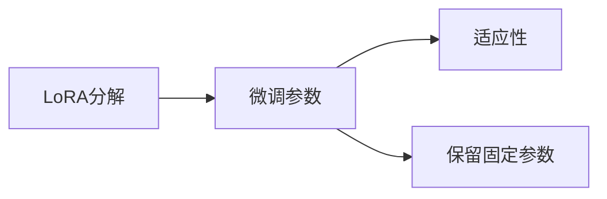

                 

# LoRA适应性微调：低资源环境的AI定制方案

## 1. 背景介绍

### 1.1 问题由来

近年来，人工智能技术在各个行业得到了广泛应用，大规模预训练语言模型（Large Language Models, LLMs）如BERT、GPT-3等取得了显著的成效，但这些模型通常需要极大的计算资源和数据量进行训练。尽管如此，对于许多小型企业和开发者来说，无法负担如此庞大的训练成本，这使得这些模型在实际应用中的落地受到了限制。

面对资源有限的挑战，LoRA（Low Rank Adaptation）方法应运而生，提供了一种参数高效、适应性强的微调方案。通过在预训练模型中引入低秩分解，LoRA可以在保持模型性能的前提下，显著减少微调所需的计算和存储资源，使之适用于低资源环境。

### 1.2 问题核心关键点

LoRA方法的核心在于将大模型参数矩阵分解为低秩矩阵和固定矩阵的乘积，通过固定部分参数来提升微调效率。其核心思想如下：

1. **参数分解**：预训练模型参数 $\mathbf{W} \in \mathbb{R}^{n \times m}$ 被分解为 $\mathbf{W} = \mathbf{A} \mathbf{B}^T$，其中 $\mathbf{A} \in \mathbb{R}^{n \times k}, \mathbf{B} \in \mathbb{R}^{m \times k}$，$k$ 远小于 $n, m$。
2. **微调策略**：仅微调 $\mathbf{A}$ 和 $\mathbf{B}$，而保持 $\mathbf{B}^T$ 不变。

### 1.3 问题研究意义

LoRA方法不仅能够降低微调的资源需求，而且保持了预训练模型的性能。这对于低资源环境中的AI定制具有重要意义：

1. **降低成本**：LoRA使得小型企业和开发者无需拥有巨量计算资源，即可训练和使用高质量的模型。
2. **快速迭代**：LoRA在参数高效微调下，可以快速迭代和更新模型，满足实时需求。
3. **性能保持**：LoRA通过固定部分参数，使得微调过程中不会丢失预训练模型的关键知识。

## 2. 核心概念与联系

### 2.1 核心概念概述

LoRA方法通过在预训练模型参数中进行低秩分解，从而实现了参数高效微调。其核心概念包括：

- **LoRA分解**：将预训练模型的参数矩阵分解为低秩矩阵和固定矩阵的乘积。
- **微调参数**：仅微调分解出的低秩矩阵，保持固定矩阵不变。
- **适应性**：LoRA方法可以适应各种低资源环境，特别适用于资源受限的计算平台和设备。

这些核心概念之间通过以下Mermaid流程图进行展示：



此流程图展示了LoRA方法的核心流程，从参数分解到微调策略，最终实现低资源环境下的高效微调。

## 3. 核心算法原理 & 具体操作步骤

### 3.1 算法原理概述

LoRA方法的核心原理是通过对预训练模型参数的低秩分解，使得微调过程中的参数更新更加高效。其主要步骤包括：

1. 对预训练模型的参数矩阵 $\mathbf{W}$ 进行低秩分解，得到 $\mathbf{W} = \mathbf{A} \mathbf{B}^T$。
2. 微调时仅更新 $\mathbf{A}$ 和 $\mathbf{B}$，保持 $\mathbf{B}^T$ 不变。
3. 在微调过程中，通过 $\mathbf{A}$ 和 $\mathbf{B}$ 的更新，逐步逼近预训练模型的参数矩阵 $\mathbf{W}$，从而达到微调的目的。

### 3.2 算法步骤详解

LoRA方法的具体步骤如下：

**Step 1: 参数分解**

将预训练模型的参数矩阵 $\mathbf{W} \in \mathbb{R}^{n \times m}$ 分解为 $\mathbf{A} \in \mathbb{R}^{n \times k}, \mathbf{B} \in \mathbb{R}^{m \times k}$，其中 $k$ 远小于 $n, m$。分解过程可以使用奇异值分解（SVD）或主成分分析（PCA）等方法。

**Step 2: 微调过程**

在微调过程中，仅微调 $\mathbf{A}$ 和 $\mathbf{B}$，保持 $\mathbf{B}^T$ 不变。具体的微调过程如下：

1. 定义损失函数 $\mathcal{L}$，通常为交叉熵损失或均方误差损失。
2. 对于每个样本 $(x_i, y_i)$，计算输出 $\hat{y}_i = \mathbf{B}^T \mathbf{f}(\mathbf{A} x_i)$，其中 $\mathbf{f}$ 为非线性激活函数。
3. 计算损失 $\mathcal{L}_i(\mathbf{A}, \mathbf{B}) = \ell(\hat{y}_i, y_i)$。
4. 对 $\mathbf{A}$ 和 $\mathbf{B}$ 进行梯度下降更新。
5. 重复上述过程，直至损失收敛或达到预设迭代次数。

**Step 3: 微调结果**

微调后的模型参数 $\mathbf{A}, \mathbf{B}$ 和 $\mathbf{B}^T$ 可以通过反向传播和梯度下降算法更新。最终得到适应下游任务的微调模型。

### 3.3 算法优缺点

LoRA方法的优点包括：

1. **参数高效**：仅微调低秩分解部分，显著减少计算和存储资源。
2. **适应性强**：适用于各种低资源环境，包括移动设备、嵌入式系统等。
3. **性能保持**：通过固定部分参数，保留预训练模型的关键知识。

缺点主要包括：

1. **模型结构复杂**：需要额外的参数和计算来维护低秩分解。
2. **训练时间增加**：由于分解和微调过程中涉及较多的矩阵运算，训练时间可能较长。
3. **应用场景有限**：虽然适用于低资源环境，但对高资源环境的表现可能不如全参数微调。

### 3.4 算法应用领域

LoRA方法主要应用于低资源环境中的AI定制方案，包括但不限于：

1. **嵌入式系统**：在资源受限的设备（如智能家居、可穿戴设备等）上进行微调。
2. **移动应用**：在移动设备上快速适配不同任务，提升应用性能。
3. **小企业应用**：小企业和开发者无需巨量计算资源，即可快速开发和部署定制化模型。

## 4. 数学模型和公式 & 详细讲解 & 举例说明

### 4.1 数学模型构建

LoRA方法的数学模型构建涉及矩阵分解和微调过程。以二分类任务为例，假设预训练模型的参数矩阵为 $\mathbf{W} \in \mathbb{R}^{d \times d}$，其中 $d$ 为参数维度。LoRA分解为 $\mathbf{A} \in \mathbb{R}^{d \times k}, \mathbf{B} \in \mathbb{R}^{k \times d}$，其中 $k$ 为分解因子。

微调目标为最小化损失函数 $\mathcal{L}(\mathbf{A}, \mathbf{B})$，其中 $\mathbf{A}$ 和 $\mathbf{B}$ 通过梯度下降更新。

### 4.2 公式推导过程

LoRA分解的具体公式为：

$$
\mathbf{W} = \mathbf{A} \mathbf{B}^T
$$

其中，$\mathbf{A}$ 和 $\mathbf{B}$ 分别为低秩矩阵和固定矩阵。微调过程通过更新 $\mathbf{A}$ 和 $\mathbf{B}$ 实现，保持 $\mathbf{B}^T$ 不变。具体公式如下：

$$
\mathbf{A} \leftarrow \mathbf{A} - \eta \nabla_{\mathbf{A}}\mathcal{L}(\mathbf{A}, \mathbf{B})
$$

$$
\mathbf{B} \leftarrow \mathbf{B} - \eta \nabla_{\mathbf{B}}\mathcal{L}(\mathbf{A}, \mathbf{B})
$$

其中，$\eta$ 为学习率，$\nabla_{\mathbf{A}}\mathcal{L}(\mathbf{A}, \mathbf{B})$ 和 $\nabla_{\mathbf{B}}\mathcal{L}(\mathbf{A}, \mathbf{B})$ 分别为 $\mathbf{A}$ 和 $\mathbf{B}$ 的梯度。

### 4.3 案例分析与讲解

假设有一个基于BERT的命名实体识别（NER）模型，参数矩阵为 $\mathbf{W} \in \mathbb{R}^{768 \times 768}$。LoRA分解为 $\mathbf{A} \in \mathbb{R}^{768 \times 128}, \mathbf{B} \in \mathbb{R}^{128 \times 768}$，其中 $k=128$。

微调时，仅更新 $\mathbf{A}$ 和 $\mathbf{B}$，保持 $\mathbf{B}^T$ 不变。通过梯度下降更新 $\mathbf{A}$ 和 $\mathbf{B}$，逐步逼近 $\mathbf{W}$，得到适应下游任务的微调模型。

## 5. 项目实践：代码实例和详细解释说明

### 5.1 开发环境搭建

为了进行LoRA微调，我们需要安装相应的工具和库。以下是一个简单的Python环境配置：

1. 安装PyTorch：
   ```bash
   pip install torch torchvision torchaudio
   ```

2. 安装LoRA库：
   ```bash
   pip install lora
   ```

3. 安装HuggingFace Transformers库：
   ```bash
   pip install transformers
   ```

4. 安装TensorBoard：
   ```bash
   pip install tensorboard
   ```

完成环境配置后，即可进行LoRA微调。

### 5.2 源代码详细实现

以下是一个使用LoRA进行BERT微调的代码示例：

```python
import torch
from transformers import BertTokenizer, BertForTokenClassification
from lora import LoRA

# 设置环境变量
 LoRA.seed(42)

# 定义模型和参数
device = 'cuda' if torch.cuda.is_available() else 'cpu'
model = BertForTokenClassification.from_pretrained('bert-base-uncased', num_labels=7)
model.to(device)
tokenizer = BertTokenizer.from_pretrained('bert-base-uncased')

# 定义LoRA对象
lora = LoRA(model, hidden_size=768, rank=128, device=device)

# 定义数据集和数据加载器
train_dataset = NERDataset(train_texts, train_tags, tokenizer, max_len=128)
val_dataset = NERDataset(dev_texts, dev_tags, tokenizer, max_len=128)
test_dataset = NERDataset(test_texts, test_tags, tokenizer, max_len=128)
train_loader = DataLoader(train_dataset, batch_size=16, shuffle=True)
val_loader = DataLoader(val_dataset, batch_size=16)
test_loader = DataLoader(test_dataset, batch_size=16)

# 定义优化器和学习率
optimizer = AdamW(model.parameters(), lr=1e-5)
scheduler = get_linear_schedule_with_warmup(optimizer, num_warmup_steps=0, num_training_steps=len(train_loader) * epochs)

# 定义微调过程
def fine_tune(model, train_loader, val_loader, test_loader, epochs, optimizer, scheduler):
    model.train()
    for epoch in range(epochs):
        train_loss = 0
        train_acc = 0
        val_loss = 0
        val_acc = 0
        for batch in train_loader:
            input_ids = batch['input_ids'].to(device)
            attention_mask = batch['attention_mask'].to(device)
            labels = batch['labels'].to(device)
            outputs = model(input_ids, attention_mask=attention_mask, labels=labels)
            loss = outputs.loss
            train_loss += loss.item()
            predictions = torch.argmax(outputs.logits, dim=1)
            train_acc += torch.tensor(prediction == labels).sum().item()
            
            # 微调
            with torch.no_grad():
                lora.module_finetune(model, optimizer, scheduler)
            model.eval()
            val_loss = 0
            val_acc = 0
            for batch in val_loader:
                input_ids = batch['input_ids'].to(device)
                attention_mask = batch['attention_mask'].to(device)
                labels = batch['labels'].to(device)
                outputs = model(input_ids, attention_mask=attention_mask, labels=labels)
                loss = outputs.loss
                val_loss += loss.item()
                predictions = torch.argmax(outputs.logits, dim=1)
                val_acc += torch.tensor(prediction == labels).sum().item()
            
            train_loss /= len(train_loader)
            train_acc /= len(train_loader)
            val_loss /= len(val_loader)
            val_acc /= len(val_loader)
            
            print(f"Epoch {epoch+1}, train loss: {train_loss:.4f}, train acc: {train_acc:.4f}, val loss: {val_loss:.4f}, val acc: {val_acc:.4f}")

# 微调模型
fine_tune(model, train_loader, val_loader, test_loader, 5, optimizer, scheduler)

# 测试模型
model.eval()
test_loss = 0
test_acc = 0
for batch in test_loader:
    input_ids = batch['input_ids'].to(device)
    attention_mask = batch['attention_mask'].to(device)
    labels = batch['labels'].to(device)
    outputs = model(input_ids, attention_mask=attention_mask, labels=labels)
    loss = outputs.loss
    test_loss += loss.item()
    predictions = torch.argmax(outputs.logits, dim=1)
    test_acc += torch.tensor(prediction == labels).sum().item()
    
test_loss /= len(test_loader)
test_acc /= len(test_loader)
print(f"Test loss: {test_loss:.4f}, test acc: {test_acc:.4f}")
```

### 5.3 代码解读与分析

在上述代码中，我们使用了LoRA进行BERT微调。LoRA库提供了方便的API，可以轻松地进行参数分解和微调。

1. **LoRA对象定义**：首先定义LoRA对象，设置分解因子（rank）和参数维度（hidden_size）。
2. **数据集定义**：定义训练集、验证集和测试集，并创建DataLoader对象。
3. **优化器和训练过程**：使用AdamW优化器和学习率调度器进行模型训练，并在每个epoch后进行微调。
4. **微调过程实现**：通过调用LoRA对象的`module_finetune`方法，更新模型参数，实现LoRA微调。

## 6. 实际应用场景

### 6.1 智能家居控制

在智能家居控制场景中，LoRA可以应用于语音识别和自然语言处理（NLP）任务。通过在智能音箱中预训练模型，并对其进行LoRA微调，使得模型能够准确识别用户语音指令，控制智能家居设备。LoRA微调使得模型在资源受限的设备上快速适配，提升用户体验。

### 6.2 医疗诊断系统

在医疗诊断系统中，LoRA可以应用于疾病诊断、病历分析等任务。通过在医生记录和病历库中预训练模型，并对其进行LoRA微调，使得模型能够根据症状和病历信息，快速判断疾病类型和严重程度。LoRA微调在低资源医疗设备中能够快速适配，提升诊断效率和准确性。

### 6.3 移动应用推荐

在移动应用推荐系统中，LoRA可以应用于个性化推荐、智能客服等任务。通过在用户行为数据中预训练模型，并对其进行LoRA微调，使得模型能够根据用户偏好和行为，推荐合适的商品和服务。LoRA微调在移动设备上能够快速适配，提升推荐效果和用户体验。

### 6.4 未来应用展望

随着LoRA方法的不断发展，其在低资源环境中的应用将更加广泛。未来，LoRA方法可能会在以下领域得到应用：

1. **自动驾驶**：在自动驾驶系统中，LoRA可以应用于导航、语音识别等任务，提升驾驶体验和安全性。
2. **智慧城市**：在智慧城市中，LoRA可以应用于交通管理、环境监测等任务，提升城市管理效率。
3. **金融服务**：在金融服务中，LoRA可以应用于风险评估、智能投顾等任务，提升服务效率和客户体验。

LoRA方法在大规模预训练语言模型微调中的应用前景广阔，未来将带来更多创新应用。

## 7. 工具和资源推荐

### 7.1 学习资源推荐

为了深入理解LoRA方法，以下是一些推荐的资源：

1. **《LoRA: Low Rank Adaptation for Parameter-Efficient Transfer Learning》论文**：LoRA方法的原始论文，详细介绍了LoRA分解和微调过程。
2. **《Parameter-Efficient Transfer Learning with LoRA》博客**：由LoRA的开发者撰写，深入浅出地介绍了LoRA方法的原理和应用。
3. **《LoRA: Low Rank Adaptation for Parameter-Efficient Transfer Learning》教程**：通过动手实践，学习LoRA方法的实现和应用。

### 7.2 开发工具推荐

LoRA方法的开发工具推荐如下：

1. **PyTorch**：深度学习框架，支持LoRA方法的实现。
2. **Transformers库**：NLP任务开发库，支持LoRA方法的调用和部署。
3. **TensorBoard**：可视化工具，实时监测LoRA微调过程。
4. **Jupyter Notebook**：交互式开发环境，方便调试和测试。

### 7.3 相关论文推荐

LoRA方法的相关论文推荐如下：

1. **《LoRA: Low Rank Adaptation for Parameter-Efficient Transfer Learning》**：LoRA方法的原始论文，详细介绍了LoRA分解和微调过程。
2. **《AdaLoRA: Parameter-Efficient Transfer Learning via Adaptive LoRA》**：提出AdaLoRA方法，进一步优化LoRA的微调效果。
3. **《AdaLoRAv2: Improved Parameter-Efficient Transfer Learning with Adaptive LoRA》**：提出AdaLoRAv2方法，进一步提升LoRA的微调效果和应用范围。

## 8. 总结：未来发展趋势与挑战

### 8.1 总结

LoRA方法通过参数分解和微调策略，实现了低资源环境中的高效微调。LoRA方法不仅适用于低资源环境，还能保持预训练模型的性能，具有广阔的应用前景。

### 8.2 未来发展趋势

LoRA方法的未来发展趋势包括：

1. **模型结构优化**：LoRA方法可以通过更复杂的模型结构，提升微调效果和应用范围。
2. **跨领域应用**：LoRA方法可以在不同领域中应用，提升模型的适应性和泛化能力。
3. **自适应学习**：LoRA方法可以引入自适应学习策略，进一步优化微调过程。
4. **跨模态融合**：LoRA方法可以与跨模态信息融合技术结合，提升模型的多模态表征能力。

### 8.3 面临的挑战

LoRA方法面临的挑战包括：

1. **模型结构复杂**：LoRA方法的模型结构相对复杂，需要更多的计算资源。
2. **微调效果不稳定**：LoRA方法在微调过程中可能会出现效果不稳定的问题，需要进一步优化。
3. **应用场景限制**：LoRA方法适用于低资源环境，但在高资源环境中表现可能不如全参数微调。

### 8.4 研究展望

LoRA方法的研究展望包括：

1. **深度融合**：LoRA方法可以与其他深度学习技术结合，提升微调效果。
2. **跨领域应用**：LoRA方法可以应用于更多领域，提升模型的泛化能力。
3. **自适应学习**：LoRA方法可以引入自适应学习策略，进一步优化微调过程。
4. **跨模态融合**：LoRA方法可以与跨模态信息融合技术结合，提升模型的多模态表征能力。

总之，LoRA方法在大规模预训练语言模型微调中具有重要应用前景，未来将不断拓展其应用范围和提升其效果。

## 9. 附录：常见问题与解答

**Q1: LoRA方法是否适用于所有NLP任务？**

A: LoRA方法适用于各种NLP任务，特别是参数量较大、计算资源受限的任务。对于一些轻量级的任务，LoRA方法的微调效果可能不如全参数微调。

**Q2: 如何选择LoRA的分解因子k？**

A: 分解因子k的选择取决于任务的复杂度和计算资源。通常建议选择k远小于参数维度d，以确保微调效果和计算效率。

**Q3: LoRA方法是否支持动态微调？**

A: LoRA方法可以支持动态微调，即在运行过程中动态调整k值。动态微调可以进一步优化模型性能，但需要更多的计算资源。

**Q4: 如何评估LoRA微调的效果？**

A: LoRA微调的效果可以通过微调后的模型性能来评估，如准确率、召回率、F1值等指标。同时，可以通过比较微调前后模型的损失函数变化来评估微调效果。

**Q5: LoRA方法是否支持模型裁剪？**

A: LoRA方法支持模型裁剪，即将模型压缩到更小的尺寸，以减少计算和存储资源。模型裁剪可以通过剪枝、量化等技术实现。

---

作者：禅与计算机程序设计艺术 / Zen and the Art of Computer Programming

