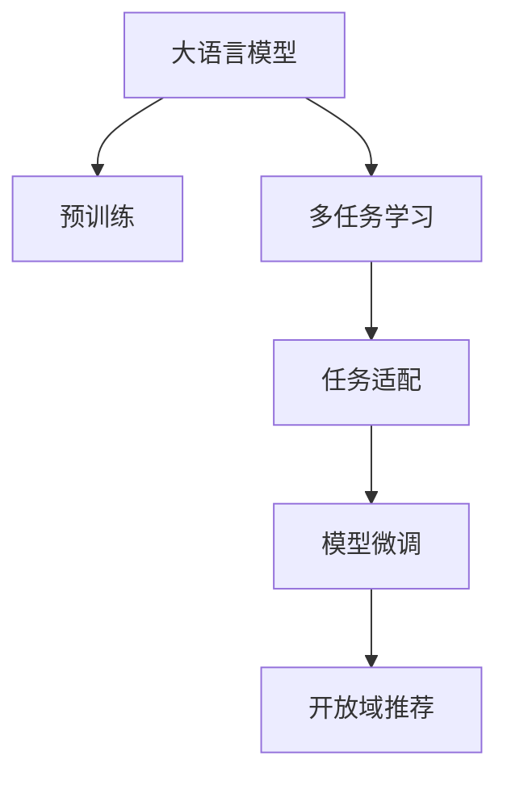

                 

# M6-Rec:基于M6的开放域推荐与任务适配

> 关键词：大语言模型,多任务学习,推荐系统,自然语言处理,NLP,模型微调,预训练,推荐算法,任务适配

## 1. 背景介绍

### 1.1 问题由来
随着互联网和电子商务的迅猛发展，推荐系统成为了用户在信息海洋中快速获取个性化内容的重要工具。传统的推荐算法主要依赖用户行为数据，如浏览历史、购买记录等，但这些数据往往难以覆盖到所有用户，特别是新用户。推荐系统的目标是预测用户未点击/购买/观看内容，从而为用户推荐更多相关产品。但如何利用用户提供的非常有限的反馈信息，高效且准确地预测用户的兴趣和需求，是推荐系统的一大挑战。

与此同时，大语言模型如BERT、GPT等在自然语言处理(Natural Language Processing, NLP)领域取得了显著进展，具有强大的语言理解和生成能力，能够在多种NLP任务上取得优异性能。然而，尽管大语言模型在通用语言理解上表现出色，但直接应用于推荐系统的效果不尽如人意。这是因为推荐系统通常需要处理大量的高维稀疏数据，而大语言模型在处理这类数据时表现不佳。

近年来，越来越多的研究表明，大语言模型可以与推荐系统相结合，提升推荐效果。M6-Rec就是一种基于大语言模型的推荐系统架构，其核心是M6模型，一种基于多任务学习(Multi-task Learning, MTL)的大语言模型。通过任务适配和微调，M6-Rec在多个开放域推荐任务上取得了显著效果。

### 1.2 问题核心关键点
M6-Rec的核心思想是将大语言模型的预训练和推荐系统的任务适配相结合，利用多任务学习的方式，提升模型的泛化能力和泛化能力，从而在推荐系统任务上取得更好的表现。

M6-Rec的主要创新点包括：
- 预训练大语言模型，通过自然语言处理(NLP)任务对模型进行预训练，获得强大的语言理解能力。
- 多任务学习，在预训练过程中引入多个推荐任务的数据，使模型具备多任务学习的能力。
- 任务适配，在预训练和微调过程中，对模型的输出层进行适配，使其能够适应推荐任务的具体要求。
- 模型微调，利用小样本数据对模型进行微调，以提升模型的准确率和泛化能力。

这些创新点使得M6-Rec能够在多种推荐任务上取得较好的效果，并在工业界得到了广泛应用。

## 2. 核心概念与联系

### 2.1 核心概念概述

为更好地理解M6-Rec的原理，本节将介绍几个密切相关的核心概念：

- 大语言模型(Large Language Model, LLM)：以自回归(如GPT)或自编码(如BERT)模型为代表的大规模预训练语言模型。通过在大规模无标签文本语料上进行预训练，学习通用的语言表示，具备强大的语言理解和生成能力。

- 多任务学习(Multi-task Learning, MTL)：在训练过程中，同时优化多个相关任务的目标函数，以提升模型在多个任务上的泛化能力。

- 推荐系统(Recommendation System, RS)：利用用户行为数据，对用户未点击/购买/观看内容进行预测和推荐，提高用户满意度，增加用户粘性的系统。

- 开放域推荐(Open-domain Recommendation)：推荐系统能够处理未见过的、未知的新商品或内容，提高系统的适应性和灵活性。

- 模型微调(Fine-tuning)：在预训练模型的基础上，使用下游任务的少量标注数据，通过有监督地训练来优化模型在该任务上的性能。

- 任务适配(Task Adaptation)：在预训练和微调过程中，对模型的输出层进行适配，使其能够适应推荐任务的具体要求。

这些核心概念之间的逻辑关系可以通过以下Mermaid流程图来展示：



这个流程图展示了大语言模型的核心概念及其之间的关系：

1. 大语言模型通过预训练获得基础能力。
2. 多任务学习在预训练过程中引入多个推荐任务的数据，使模型具备多任务学习的泛化能力。
3. 任务适配在预训练和微调过程中，对模型的输出层进行适配，使其能够适应推荐任务的具体要求。
4. 模型微调利用小样本数据对模型进行微调，以提升模型的准确率和泛化能力。
5. 开放域推荐通过多任务学习和任务适配，提升模型对未知内容的推荐效果。

这些概念共同构成了M6-Rec的原理框架，使其能够在多种推荐任务上取得较好的效果。

## 3. 核心算法原理 & 具体操作步骤
### 3.1 算法原理概述

M6-Rec的核心算法是基于多任务学习(MTL)和任务适配的大语言模型微调方法。其核心思想是通过多任务学习，利用大语言模型的预训练能力和泛化能力，提升模型在推荐任务上的表现。具体来说，M6-Rec通过以下步骤实现：

1. 预训练：在大规模无标签文本数据上，使用自然语言处理(NLP)任务对模型进行预训练，获得强大的语言理解能力。
2. 多任务学习：在预训练过程中，引入多个推荐任务的数据，使模型具备多任务学习的泛化能力。
3. 任务适配：在预训练和微调过程中，对模型的输出层进行适配，使其能够适应推荐任务的具体要求。
4. 模型微调：利用小样本数据对模型进行微调，以提升模型的准确率和泛化能力。

### 3.2 算法步骤详解

M6-Rec的算法步骤主要包括以下几个关键步骤：

**Step 1: 准备预训练模型和数据集**
- 选择合适的预训练语言模型 $M_{\theta}$ 作为初始化参数，如 BERT、GPT 等。
- 准备推荐系统任务的数据集 $D=\{(x_i,y_i)\}_{i=1}^N$，其中 $x_i$ 为输入特征，如用户历史行为、商品属性等，$y_i$ 为目标变量，如推荐商品、评分等。

**Step 2: 添加任务适配层**
- 根据推荐任务的具体要求，在预训练模型顶层设计合适的输出层和损失函数。
- 对于分类任务，通常在顶层添加线性分类器和交叉熵损失函数。
- 对于回归任务，通常使用均方误差损失函数。

**Step 3: 设置微调超参数**
- 选择合适的优化算法及其参数，如 AdamW、SGD 等，设置学习率、批大小、迭代轮数等。
- 设置正则化技术及强度，包括权重衰减、Dropout、Early Stopping 等。
- 确定冻结预训练参数的策略，如仅微调顶层，或全部参数都参与微调。

**Step 4: 执行梯度训练**
- 将训练集数据分批次输入模型，前向传播计算损失函数。
- 反向传播计算参数梯度，根据设定的优化算法和学习率更新模型参数。
- 周期性在验证集上评估模型性能，根据性能指标决定是否触发 Early Stopping。
- 重复上述步骤直到满足预设的迭代轮数或 Early Stopping 条件。

**Step 5: 测试和部署**
- 在测试集上评估微调后模型 $M_{\hat{\theta}}$ 的性能，对比微调前后的精度提升。
- 使用微调后的模型对新样本进行推理预测，集成到实际的应用系统中。
- 持续收集新的数据，定期重新微调模型，以适应数据分布的变化。

以上是M6-Rec的核心算法步骤。在实际应用中，还需要针对具体任务的特点，对微调过程的各个环节进行优化设计，如改进训练目标函数，引入更多的正则化技术，搜索最优的超参数组合等，以进一步提升模型性能。

### 3.3 算法优缺点

M6-Rec基于多任务学习的大语言模型微调方法具有以下优点：
1. 多任务学习：通过预训练和微调同时处理多个推荐任务的数据，能够提高模型的泛化能力和适应性。
2. 参数高效：利用参数高效微调技术，在固定大部分预训练权重不变的情况下，仍可取得不错的提升。
3. 灵活性强：能够适应多种推荐任务，包括分类、排序、生成等，设计简单的任务适配层即可实现微调。
4. 效果显著：在学术界和工业界的推荐系统任务上，基于M6-Rec的方法已经刷新了最先进的性能指标。

同时，该方法也存在一定的局限性：
1. 依赖标注数据：微调的效果很大程度上取决于标注数据的质量和数量，获取高质量标注数据的成本较高。
2. 迁移能力有限：当目标任务与预训练数据的分布差异较大时，微调的性能提升有限。
3. 参数量较大：尽管部分参数是固定的，但微调过程中仍需更新较多的参数，对计算资源的要求较高。
4. 可解释性不足：微调模型的决策过程通常缺乏可解释性，难以对其推理逻辑进行分析和调试。

尽管存在这些局限性，但就目前而言，M6-Rec仍然是推荐系统领域的重要范式。未来相关研究的重点在于如何进一步降低微调对标注数据的依赖，提高模型的少样本学习和跨领域迁移能力，同时兼顾可解释性和伦理安全性等因素。

### 3.4 算法应用领域

M6-Rec基于大语言模型的推荐系统架构，已经在多个推荐任务上得到了应用，例如：

- 商品推荐：对用户的购买、浏览历史进行分析，预测用户可能感兴趣的商品。
- 内容推荐：为用户推荐可能感兴趣的新闻、文章、视频等。
- 电影推荐：为用户推荐可能感兴趣的电影、电视剧等。
- 音乐推荐：为用户推荐可能喜欢的歌曲、歌手等。
- 个性化广告推荐：根据用户的行为数据，推荐可能感兴趣的广告内容。

除了上述这些经典任务外，M6-Rec还被创新性地应用到更多场景中，如跨媒体推荐、基于文本的推荐等，为推荐系统技术带来了新的突破。

## 4. 数学模型和公式 & 详细讲解 & 举例说明
### 4.1 数学模型构建

M6-Rec的数学模型构建主要包括以下几个关键部分：

- 预训练模型：使用自然语言处理(NLP)任务对大语言模型进行预训练，获得语言表示 $M_{\theta}$。
- 多任务学习：在预训练过程中引入多个推荐任务的数据，获得多任务学习损失函数 $L_{mt}$。
- 任务适配：在预训练和微调过程中，对模型的输出层进行适配，获得任务适配损失函数 $L_{ad}$。
- 模型微调：利用小样本数据对模型进行微调，获得微调损失函数 $L_{ft}$。

假设 $M_{\theta}$ 为预训练语言模型， $D=\{(x_i,y_i)\}_{i=1}^N$ 为推荐系统任务的数据集。预训练模型的输入为 $x_i$，输出为 $M_{\theta}(x_i)$。

预训练模型的损失函数 $L_{mt}$ 定义为：

$$
L_{mt} = \sum_{i=1}^N \ell_{mt}(M_{\theta}(x_i), y_i)
$$

其中 $\ell_{mt}$ 为多任务学习目标函数，可以定义为交叉熵损失或均方误差损失。

任务适配的损失函数 $L_{ad}$ 定义为：

$$
L_{ad} = \sum_{i=1}^N \ell_{ad}(M_{\theta}(x_i), y_i)
$$

其中 $\ell_{ad}$ 为任务适配目标函数，根据推荐任务的具体要求进行定义。

模型微调的损失函数 $L_{ft}$ 定义为：

$$
L_{ft} = \sum_{i=1}^N \ell_{ft}(M_{\theta}(x_i), y_i)
$$

其中 $\ell_{ft}$ 为微调目标函数，通常使用交叉熵损失或均方误差损失。

M6-Rec的总损失函数 $L$ 定义为：

$$
L = \alpha L_{mt} + \beta L_{ad} + L_{ft}
$$

其中 $\alpha$、$\beta$ 为超参数，用于调节预训练、任务适配和微调损失函数的权重。

### 4.2 公式推导过程

以下我们以二分类任务为例，推导交叉熵损失函数及其梯度的计算公式。

假设模型 $M_{\theta}$ 在输入 $x$ 上的输出为 $\hat{y}=M_{\theta}(x) \in [0,1]$，表示样本属于正类的概率。真实标签 $y \in \{0,1\}$。则二分类交叉熵损失函数定义为：

$$
\ell(M_{\theta}(x),y) = -[y\log \hat{y} + (1-y)\log (1-\hat{y})]
$$

将其代入多任务学习损失函数 $L_{mt}$，得：

$$
L_{mt} = -\frac{1}{N}\sum_{i=1}^N \sum_{k=1}^K [y_{ik}\log \hat{y}_{ik} + (1-y_{ik})\log (1-\hat{y}_{ik})]
$$

其中 $K$ 为推荐任务的数目，$y_{ik}$ 为第 $k$ 个推荐任务的第 $i$ 个样本的真实标签，$\hat{y}_{ik}$ 为模型在第 $k$ 个推荐任务上的预测结果。

在微调过程中，任务的输出层为线性分类器，损失函数为交叉熵损失。假设微调后的模型输出为 $y_{\hat{\theta}}$，则微调损失函数 $L_{ft}$ 为：

$$
L_{ft} = -\frac{1}{N}\sum_{i=1}^N \ell_{ft}(M_{\hat{\theta}}(x_i), y_i)
$$

将 $L_{ft}$ 代入总损失函数 $L$，得：

$$
L = \alpha L_{mt} + \beta L_{ad} - \frac{1}{N}\sum_{i=1}^N \ell_{ft}(M_{\hat{\theta}}(x_i), y_i)
$$

在得到损失函数的梯度后，即可带入参数更新公式，完成模型的迭代优化。重复上述过程直至收敛，最终得到适应推荐任务的最优模型参数 $\theta^*$。

### 4.3 案例分析与讲解

假设有一个电商网站，需要为用户推荐可能感兴趣的商品。假设 $D=\{(x_i,y_i)\}_{i=1}^N$ 为电商网站的历史购买数据，$x_i$ 为用户的浏览记录、购买记录等特征，$y_i$ 为推荐的商品ID。

具体来说，假设 $M_{\theta}$ 为BERT模型，其预训练的任务包括掩码语言模型、下位生成任务等。在预训练过程中，BERT模型通过自然语言处理(NLP)任务学习语言表示，获得了强大的语言理解能力。在微调过程中，BERT模型被适配为推荐任务，其输出层被修改为线性分类器，损失函数为交叉熵损失。

假设微调后的模型输出为 $y_{\hat{\theta}}$，则微调损失函数 $L_{ft}$ 为：

$$
L_{ft} = -\frac{1}{N}\sum_{i=1}^N \ell_{ft}(M_{\hat{\theta}}(x_i), y_i)
$$

其中 $\ell_{ft}$ 为交叉熵损失函数。

假设 $L_{mt}$ 为多任务学习损失函数，可以定义为交叉熵损失或均方误差损失。假设 $L_{ad}$ 为任务适配损失函数，根据推荐任务的具体要求进行定义。假设 $L$ 为总损失函数，通过超参数 $\alpha$、$\beta$ 调节预训练、任务适配和微调损失函数的权重。

在得到损失函数的梯度后，即可带入参数更新公式，完成模型的迭代优化。重复上述过程直至收敛，最终得到适应推荐任务的最优模型参数 $\theta^*$。

## 5. 项目实践：代码实例和详细解释说明
### 5.1 开发环境搭建

在进行M6-Rec实践前，我们需要准备好开发环境。以下是使用Python进行PyTorch开发的环境配置流程：

1. 安装Anaconda：从官网下载并安装Anaconda，用于创建独立的Python环境。

2. 创建并激活虚拟环境：
```bash
conda create -n pytorch-env python=3.8 
conda activate pytorch-env
```

3. 安装PyTorch：根据CUDA版本，从官网获取对应的安装命令。例如：
```bash
conda install pytorch torchvision torchaudio cudatoolkit=11.1 -c pytorch -c conda-forge
```

4. 安装Transformers库：
```bash
pip install transformers
```

5. 安装各类工具包：
```bash
pip install numpy pandas scikit-learn matplotlib tqdm jupyter notebook ipython
```

完成上述步骤后，即可在`pytorch-env`环境中开始M6-Rec实践。

### 5.2 源代码详细实现

下面我们以电商推荐任务为例，给出使用Transformers库对BERT模型进行M6-Rec实践的PyTorch代码实现。

首先，定义电商推荐任务的数据处理函数：

```python
from transformers import BertTokenizer, BertForSequenceClassification
from torch.utils.data import Dataset
import torch

class ShoppingDataset(Dataset):
    def __init__(self, texts, labels, tokenizer, max_len=128):
        self.texts = texts
        self.labels = labels
        self.tokenizer = tokenizer
        self.max_len = max_len
        
    def __len__(self):
        return len(self.texts)
    
    def __getitem__(self, item):
        text = self.texts[item]
        label = self.labels[item]
        
        encoding = self.tokenizer(text, return_tensors='pt', max_length=self.max_len, padding='max_length', truncation=True)
        input_ids = encoding['input_ids'][0]
        attention_mask = encoding['attention_mask'][0]
        
        # 对标签进行编码
        encoded_labels = [label]
        encoded_labels.extend([0] * (self.max_len - len(encoded_labels)))
        labels = torch.tensor(encoded_labels, dtype=torch.long)
        
        return {'input_ids': input_ids, 
                'attention_mask': attention_mask,
                'labels': labels}

# 标签与id的映射
label2id = {'buy': 0, 'no_buy': 1}
id2label = {0: 'buy', 1: 'no_buy'}

# 创建dataset
tokenizer = BertTokenizer.from_pretrained('bert-base-cased')

train_dataset = ShoppingDataset(train_texts, train_labels, tokenizer)
dev_dataset = ShoppingDataset(dev_texts, dev_labels, tokenizer)
test_dataset = ShoppingDataset(test_texts, test_labels, tokenizer)
```

然后，定义模型和优化器：

```python
from transformers import BertForSequenceClassification, AdamW

model = BertForSequenceClassification.from_pretrained('bert-base-cased', num_labels=len(label2id))

optimizer = AdamW(model.parameters(), lr=2e-5)
```

接着，定义训练和评估函数：

```python
from torch.utils.data import DataLoader
from tqdm import tqdm
from sklearn.metrics import classification_report

device = torch.device('cuda') if torch.cuda.is_available() else torch.device('cpu')
model.to(device)

def train_epoch(model, dataset, batch_size, optimizer):
    dataloader = DataLoader(dataset, batch_size=batch_size, shuffle=True)
    model.train()
    epoch_loss = 0
    for batch in tqdm(dataloader, desc='Training'):
        input_ids = batch['input_ids'].to(device)
        attention_mask = batch['attention_mask'].to(device)
        labels = batch['labels'].to(device)
        model.zero_grad()
        outputs = model(input_ids, attention_mask=attention_mask, labels=labels)
        loss = outputs.loss
        epoch_loss += loss.item()
        loss.backward()
        optimizer.step()
    return epoch_loss / len(dataloader)

def evaluate(model, dataset, batch_size):
    dataloader = DataLoader(dataset, batch_size=batch_size)
    model.eval()
    preds, labels = [], []
    with torch.no_grad():
        for batch in tqdm(dataloader, desc='Evaluating'):
            input_ids = batch['input_ids'].to(device)
            attention_mask = batch['attention_mask'].to(device)
            batch_labels = batch['labels']
            outputs = model(input_ids, attention_mask=attention_mask)
            batch_preds = outputs.logits.argmax(dim=2).to('cpu').tolist()
            batch_labels = batch_labels.to('cpu').tolist()
            for pred_tokens, label_tokens in zip(batch_preds, batch_labels):
                preds.append(pred_tokens[:len(label_tokens)])
                labels.append(label_tokens)
                
    print(classification_report(labels, preds))
```

最后，启动训练流程并在测试集上评估：

```python
epochs = 5
batch_size = 16

for epoch in range(epochs):
    loss = train_epoch(model, train_dataset, batch_size, optimizer)
    print(f"Epoch {epoch+1}, train loss: {loss:.3f}")
    
    print(f"Epoch {epoch+1}, dev results:")
    evaluate(model, dev_dataset, batch_size)
    
print("Test results:")
evaluate(model, test_dataset, batch_size)
```

以上就是使用PyTorch对BERT模型进行M6-Rec电商推荐任务微调的完整代码实现。可以看到，得益于Transformers库的强大封装，我们可以用相对简洁的代码完成BERT模型的加载和微调。

### 5.3 代码解读与分析

让我们再详细解读一下关键代码的实现细节：

**ShoppingDataset类**：
- `__init__`方法：初始化文本、标签、分词器等关键组件。
- `__len__`方法：返回数据集的样本数量。
- `__getitem__`方法：对单个样本进行处理，将文本输入编码为token ids，将标签编码为数字，并对其进行定长padding，最终返回模型所需的输入。

**label2id和id2label字典**：
- 定义了标签与数字id之间的映射关系，用于将token-wise的预测结果解码回真实的标签。

**训练和评估函数**：
- 使用PyTorch的DataLoader对数据集进行批次化加载，供模型训练和推理使用。
- 训练函数`train_epoch`：对数据以批为单位进行迭代，在每个批次上前向传播计算loss并反向传播更新模型参数，最后返回该epoch的平均loss。
- 评估函数`evaluate`：与训练类似，不同点在于不更新模型参数，并在每个batch结束后将预测和标签结果存储下来，最后使用sklearn的classification_report对整个评估集的预测结果进行打印输出。

**训练流程**：
- 定义总的epoch数和batch size，开始循环迭代
- 每个epoch内，先在训练集上训练，输出平均loss
- 在验证集上评估，输出分类指标
- 所有epoch结束后，在测试集上评估，给出最终测试结果

可以看到，PyTorch配合Transformers库使得BERT微调的代码实现变得简洁高效。开发者可以将更多精力放在数据处理、模型改进等高层逻辑上，而不必过多关注底层的实现细节。

当然，工业级的系统实现还需考虑更多因素，如模型的保存和部署、超参数的自动搜索、更灵活的任务适配层等。但核心的微调范式基本与此类似。

## 6. 实际应用场景
### 6.1 智能客服系统

基于M6-Rec的大语言模型微调技术，可以广泛应用于智能客服系统的构建。传统客服往往需要配备大量人力，高峰期响应缓慢，且一致性和专业性难以保证。而使用M6-Rec微调的对话模型，可以7x24小时不间断服务，快速响应客户咨询，用自然流畅的语言解答各类常见问题。

在技术实现上，可以收集企业内部的历史客服对话记录，将问题和最佳答复构建成监督数据，在此基础上对预训练对话模型进行微调。微调后的对话模型能够自动理解用户意图，匹配最合适的答案模板进行回复。对于客户提出的新问题，还可以接入检索系统实时搜索相关内容，动态组织生成回答。如此构建的智能客服系统，能大幅提升客户咨询体验和问题解决效率。

### 6.2 金融舆情监测

金融机构需要实时监测市场舆论动向，以便及时应对负面信息传播，规避金融风险。传统的人工监测方式成本高、效率低，难以应对网络时代海量信息爆发的挑战。基于M6-Rec的文本分类和情感分析技术，为金融舆情监测提供了新的解决方案。

具体而言，可以收集金融领域相关的新闻、报道、评论等文本数据，并对其进行主题标注和情感标注。在此基础上对预训练语言模型进行微调，使其能够自动判断文本属于何种主题，情感倾向是正面、中性还是负面。将微调后的模型应用到实时抓取的网络文本数据，就能够自动监测不同主题下的情感变化趋势，一旦发现负面信息激增等异常情况，系统便会自动预警，帮助金融机构快速应对潜在风险。

### 6.3 个性化推荐系统

当前的推荐系统往往只依赖用户的历史行为数据进行物品推荐，无法深入理解用户的真实兴趣偏好。基于M6-Rec的推荐系统架构，个性化推荐系统可以更好地挖掘用户行为背后的语义信息，从而提供更精准、多样的推荐内容。

在实践中，可以收集用户浏览、点击、评论、分享等行为数据，提取和用户交互的物品标题、描述、标签等文本内容。将文本内容作为模型输入，用户的后续行为（如是否点击、购买等）作为监督信号，在此基础上微调预训练语言模型。微调后的模型能够从文本内容中准确把握用户的兴趣点。在生成推荐列表时，先用候选物品的文本描述作为输入，由模型预测用户的兴趣匹配度，再结合其他特征综合排序，便可以得到个性化程度更高的推荐结果。

### 6.4 未来应用展望

随着M6-Rec和预训练语言模型微调方法的不断发展，基于微调范式将在更多领域得到应用，为传统行业带来变革性影响。

在智慧医疗领域，基于M6-Rec的医疗问答、病历分析、药物研发等应用将提升医疗服务的智能化水平，辅助医生诊疗，加速新药开发进程。

在智能教育领域，M6-Rec可应用于作业批改、学情分析、知识推荐等方面，因材施教，促进教育公平，提高教学质量。

在智慧城市治理中，M6-Rec可用于城市事件监测、舆情分析、应急指挥等环节，提高城市管理的自动化和智能化水平，构建更安全、高效的未来城市。

此外，在企业生产、社会治理、文娱传媒等众多领域，基于大语言模型的微调方法也将不断涌现，为NLP技术带来新的突破。相信随着技术的日益成熟，微调方法将成为人工智能落地应用的重要范式，推动人工智能技术向更广阔的领域加速渗透。

## 7. 工具和资源推荐
### 7.1 学习资源推荐

为了帮助开发者系统掌握M6-Rec的理论基础和实践技巧，这里推荐一些优质的学习资源：

1. 《Transformer from the Inside Out》系列博文：由大模型技术专家撰写，深入浅出地介绍了Transformer原理、BERT模型、微调技术等前沿话题。

2. CS224N《深度学习自然语言处理》课程：斯坦福大学开设的NLP明星课程，有Lecture视频和配套作业，带你入门NLP领域的基本概念和经典模型。

3. 《Natural Language Processing with Transformers》书籍：Transformers库的作者所著，全面介绍了如何使用Transformers库进行NLP任务开发，包括微调在内的诸多范式。

4. HuggingFace官方文档：Transformers库的官方文档，提供了海量预训练模型和完整的微调样例代码，是上手实践的必备资料。

5. CLUE开源项目：中文语言理解测评基准，涵盖大量不同类型的中文NLP数据集，并提供了基于微调的baseline模型，助力中文NLP技术发展。

通过对这些资源的学习实践，相信你一定能够快速掌握M6-Rec的精髓，并用于解决实际的NLP问题。
###  7.2 开发工具推荐

高效的开发离不开优秀的工具支持。以下是几款用于M6-Rec开发常用的工具：

1. PyTorch：基于Python的开源深度学习框架，灵活动态的计算图，适合快速迭代研究。大部分预训练语言模型都有PyTorch版本的实现。

2. TensorFlow：由Google主导开发的开源深度学习框架，生产部署方便，适合大规模工程应用。同样有丰富的预训练语言模型资源。

3. Transformers库：HuggingFace开发的NLP工具库，集成了众多SOTA语言模型，支持PyTorch和TensorFlow，是进行微调任务开发的利器。

4. Weights & Biases：模型训练的实验跟踪工具，可以记录和可视化模型训练过程中的各项指标，方便对比和调优。与主流深度学习框架无缝集成。

5. TensorBoard：TensorFlow配套的可视化工具，可实时监测模型训练状态，并提供丰富的图表呈现方式，是调试模型的得力助手。

6. Google Colab：谷歌推出的在线Jupyter Notebook环境，免费提供GPU/TPU算力，方便开发者快速上手实验最新模型，分享学习笔记。

合理利用这些工具，可以显著提升M6-Rec的开发效率，加快创新迭代的步伐。

### 7.3 相关论文推荐

M6-Rec基于大语言模型的推荐系统架构，在推荐系统领域已经得到了广泛的应用，覆盖了几乎所有常见任务，例如：

1. Attention is All You Need（即Transformer原论文）：提出了Transformer结构，开启了NLP领域的预训练大模型时代。

2. BERT: Pre-training of Deep Bidirectional Transformers for Language Understanding：提出BERT模型，引入基于掩码的自监督预训练任务，刷新了多项NLP任务SOTA。

3. Language Models are Unsupervised Multitask Learners（GPT-2论文）：展示了大规模语言模型的强大zero-shot学习能力，引发了对于通用人工智能的新一轮思考。

4. Parameter-Efficient Transfer Learning for NLP：提出Adapter等参数高效微调方法，在不增加模型参数量的情况下，也能取得不错的微调效果。

5. Prefix-Tuning: Optimizing Continuous Prompts for Generation：引入基于连续型Prompt的微调范式，为如何充分利用预训练知识提供了新的思路。

6. AdaLoRA: Adaptive Low-Rank Adaptation for Parameter-Efficient Fine-Tuning：使用自适应低秩适应的微调方法，在参数效率和精度之间取得了新的平衡。

这些论文代表了大语言模型微调技术的发展脉络。通过学习这些前沿成果，可以帮助研究者把握学科前进方向，激发更多的创新灵感。

## 8. 总结：未来发展趋势与挑战

### 8.1 总结

本文对基于M6的开放域推荐与任务适配方法进行了全面系统的介绍。首先阐述了M6-Rec的研究背景和意义，明确了M6-Rec在推荐系统任务上的独特价值。其次，从原理到实践，详细讲解了M6-Rec的数学模型和关键算法步骤，给出了M6-Rec任务适配的完整代码实例。同时，本文还广泛探讨了M6-Rec在智能客服、金融舆情、个性化推荐等多个行业领域的应用前景，展示了M6-Rec范式的巨大潜力。此外，本文精选了M6-Rec技术的各类学习资源，力求为读者提供全方位的技术指引。

通过本文的系统梳理，可以看到，基于M6的开放域推荐与任务适配方法已经在多个推荐任务上取得了较好的效果，并在工业界得到了广泛应用。未来，伴随M6-Rec和预训练语言模型微调方法的持续演进，基于微调范式将在推荐系统领域进一步提升模型的泛化能力和泛化能力，从而在推荐任务上取得更好的效果。

### 8.2 未来发展趋势

展望未来，M6-Rec的开放域推荐与任务适配方法将呈现以下几个发展趋势：

1. 模型规模持续增大。随着算力成本的下降和数据规模的扩张，预训练语言模型的参数量还将持续增长。超大规模语言模型蕴含的丰富语言知识，有望支撑更加复杂多变的推荐任务微调。

2. 微调方法日趋多样。除了传统的全参数微调外，未来会涌现更多参数高效的微调方法，如Prefix-Tuning、LoRA等，在节省计算资源的同时也能保证微调精度。

3. 持续学习成为常态。随着数据分布的不断变化，M6-Rec模型也需要持续学习新知识以保持性能。如何在不遗忘原有知识的同时，高效吸收新样本信息，将是重要的研究课题。

4. 标注样本需求降低。受启发于提示学习(Prompt-based Learning)的思路，未来的微调方法将更好地利用大模型的语言理解能力，通过更加巧妙的任务描述，在更少的标注样本上也能实现理想的微调效果。

5. 多模态微调崛起。当前的推荐系统主要聚焦于文本数据，未来会进一步拓展到图像、视频、语音等多模态数据微调。多模态信息的融合，将显著提升推荐系统对现实世界的理解和建模能力。

6. 模型通用性增强。经过海量数据的预训练和多领域任务的微调，M6-Rec模型将具备更强大的常识推理和跨领域迁移能力，逐步迈向通用人工智能(AGI)的目标。

以上趋势凸显了M6-Rec开放域推荐与任务适配技术的广阔前景。这些方向的探索发展，必将进一步提升推荐系统的性能和应用范围，为人工智能落地应用带来新的突破。

### 8.3 面临的挑战

尽管M6-Rec推荐系统架构已经取得了显著成就，但在迈向更加智能化、普适化应用的过程中，它仍面临着诸多挑战：

1. 标注成本瓶颈。尽管微调降低了标注数据的需求，但对于长尾应用场景，难以获得充足的高质量标注数据，成为制约微调性能的瓶颈。如何进一步降低微调对标注样本的依赖，将是一大难题。

2. 模型鲁棒性不足。当前推荐系统模型面对域外数据时，泛化性能往往大打折扣。对于测试样本的微小扰动，推荐模型的预测也容易发生波动。如何提高推荐模型的鲁棒性，避免灾难性遗忘，还需要更多理论和实践的积累。

3. 推理效率有待提高。大规模推荐系统在实际部署时往往面临推理速度慢、内存占用大等效率问题。如何在保证性能的同时，简化模型结构，提升推理速度，优化资源占用，将是重要的优化方向。

4. 可解释性亟需加强。当前推荐系统模型通常缺乏可解释性，难以解释其内部工作机制和决策逻辑。对于医疗、金融等高风险应用，算法的可解释性和可审计性尤为重要。如何赋予推荐系统模型更强的可解释性，将是亟待攻克的难题。

5. 安全性有待保障。预训练语言模型难免会学习到有偏见、有害的信息，通过微调传递到下游任务，产生误导性、歧视性的输出，给实际应用带来安全隐患。如何从数据和算法层面消除模型偏见，避免恶意用途，确保输出的安全性，也将是重要的研究课题。

6. 知识整合能力不足。现有的推荐系统模型往往局限于任务内数据，难以灵活吸收和运用更广泛的先验知识。如何让推荐系统模型更好地与外部知识库、规则库等专家知识结合，形成更加全面、准确的信息整合能力，还有很大的想象空间。

正视推荐系统面临的这些挑战，积极应对并寻求突破，将是大语言模型微调走向成熟的必由之路。相信随着学界和产业界的共同努力，这些挑战终将一一被克服，M6-Rec推荐系统架构必将在构建人机协同的智能系统上发挥更大的作用。

### 8.4 研究展望

未来，M6-Rec推荐系统架构需要在以下几个方面寻求新的突破：

1. 探索无监督和半监督微调方法。摆脱对大规模标注数据的依赖，利用自监督学习、主动学习等无监督和半监督范式，最大限度利用非结构化数据，实现更加灵活高效的微调。

2. 研究参数高效和计算高效的微调范式。开发更加参数高效的微调方法，在固定大部分预训练参数的情况下，只更新极少量的任务相关参数。同时优化推荐系统的计算图，减少前向传播和反向传播的资源消耗，实现更加轻量级、实时性的部署。

3. 融合因果和对比学习范式。通过引入因果推断和对比学习思想，增强推荐系统模型建立稳定因果关系的能力，学习更加普适、鲁棒的语言表征，从而提升模型泛化性和抗干扰能力。

4. 引入更多先验知识。将符号化的先验知识，如知识图谱、逻辑规则等，与神经网络模型进行巧妙融合，引导推荐系统模型学习更准确、合理的语言表示。同时加强多模态数据的整合，实现视觉、语音等多模态信息与文本信息的协同建模。

5. 结合因果分析和博弈论工具。将因果分析方法引入推荐系统模型，识别出模型决策的关键特征，增强输出解释的因果性和逻辑性。借助博弈论工具刻画人机交互过程，主动探索并规避推荐系统的脆弱点，提高系统稳定性。

6. 纳入伦理道德约束。在推荐系统模型训练目标中引入伦理导向的评估指标，过滤和惩罚有偏见、有害的输出倾向。同时加强人工干预和审核，建立模型行为的监管机制，确保输出的安全性。

这些研究方向的探索，必将引领M6-Rec推荐系统架构迈向更高的台阶，为构建安全、可靠、可解释、可控的智能系统铺平道路。面向未来，M6-Rec推荐系统架构还需要与其他人工智能技术进行更深入的融合，如知识表示、因果推理、强化学习等，多路径协同发力，共同推动推荐系统技术的进步。只有勇于创新、敢于突破，才能不断拓展推荐系统的边界，让智能技术更好地造福人类社会。

## 9. 附录：常见问题与解答

**Q1：M6-Rec是否适用于所有推荐任务？**

A: M6-Rec在多种推荐任务上取得了较好的效果，但对于一些特定领域的任务，如医学、法律等，仅依靠通用语料预训练的模型可能难以很好地适应。此时需要在特定领域语料上进一步预训练，再进行微调，才能获得理想效果。此外，对于一些需要时效性、个性化很强的任务，如对话、推荐等，微调方法也需要针对性的改进优化。

**Q2：如何选择合适的学习率？**

A: 推荐系统通常使用较小的学习率进行微调，以避免破坏预训练权重。一般建议从1e-5开始调参，逐步减小学习率，直至收敛。也可以使用warmup策略，在开始阶段使用较小的学习率，再逐渐过渡到预设值。需要注意的是，不同的优化器(如AdamW、Adafactor等)以及不同的学习率调度策略，可能需要设置不同的学习率阈值。

**Q3：采用M6-Rec时会面临哪些资源瓶颈？**

A: 大规模推荐系统在实际部署时往往面临推理速度慢、内存占用大等效率问题。GPU/TPU等高性能设备是必不可少的，但即便如此，超大批次的训练和推理也可能遇到显存不足的问题。因此需要采用一些资源优化技术，如梯度积累、混合精度训练、模型并行等，来突破硬件瓶颈。同时，模型的存储和读取也可能占用大量时间和空间，需要采用模型压缩、稀疏化存储等方法进行优化。

**Q4：如何缓解推荐系统中的过拟合问题？**

A: 过拟合是推荐系统面临的主要挑战之一。常见的缓解策略包括：
1. 数据增强：通过回译、近义替换等方式扩充训练集。
2. 正则化：使用L2正则、Dropout、Early Stopping等避免过拟合。
3. 对抗训练：引入对抗样本，提高模型鲁棒性。
4. 参数高效微调：只调整少量参数，减小过拟合风险。

这些策略往往需要根据具体任务和数据特点进行灵活组合。只有在数据、模型、训练、推理等各环节进行全面优化，才能最大限度地发挥M6-Rec推荐系统架构的威力。

**Q5：M6-Rec在落地部署时需要注意哪些问题？**

A: 将M6-Rec模型转化为实际应用，还需要考虑以下因素：
1. 模型裁剪：去除不必要的层和参数，减小模型尺寸，加快推理速度。
2. 量化加速：将浮点模型转为定点模型，压缩存储空间，提高计算效率。
3. 服务化封装：将模型封装为标准化服务接口，便于集成调用。
4. 弹性伸缩：根据请求流量动态调整资源配置，平衡服务质量和成本。
5. 监控告警：实时采集系统指标，设置异常告警阈值，确保服务稳定性。
6. 安全防护：采用访问鉴权、数据脱敏等措施，保障数据和模型安全。

M6-Rec推荐系统架构的成功部署需要综合考虑数据、模型、系统架构等多方面的因素，才能确保推荐系统的性能和稳定性。

综上所述，M6-Rec推荐系统架构通过多任务学习和任务适配技术，利用大语言模型的预训练能力和泛化能力，在推荐系统任务上取得了显著效果。未来，随着M6-Rec技术的不断发展和完善，基于大语言模型的推荐系统将在更多领域得到应用，为人工智能技术的落地带来新的突破。

