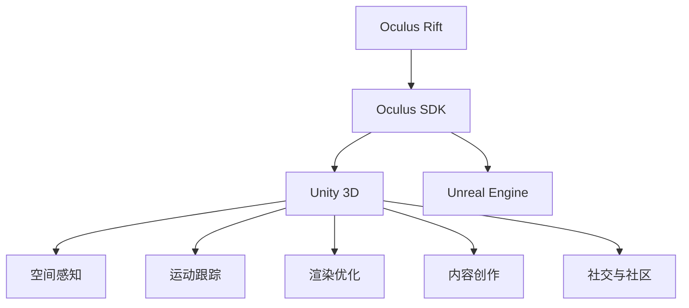

                 

# Oculus Rift 开发：在虚拟世界中

## 1. 背景介绍

### 1.1 问题由来

随着虚拟现实(VR)技术的不断成熟，Oculus Rift等头戴式显示设备逐渐成为科技创新的前沿热点。作为Facebook旗下的旗舰VR设备，Oculus Rift在硬件性能、应用场景、社交体验等方面都取得了显著进步。Oculus Rift的开发生态系统丰富多样，包括游戏、教育、医疗、工业仿真等多个领域。然而，开发者在进行Oculus Rift应用开发时，常常面临诸多技术和工程挑战。本文将从核心概念、算法原理、项目实践等方面，系统介绍Oculus Rift开发的全面攻略，帮助开发者构建高效、流畅、沉浸的虚拟现实应用。

### 1.2 问题核心关键点

在Oculus Rift应用开发中，需要重点关注以下几个关键点：

- **设备硬件与软件接口**：熟悉Oculus Rift的硬件配置和SDK接口，实现设备与主机的无缝连接和数据交互。
- **空间感知与运动跟踪**：掌握Oculus Rift的空间感知与运动跟踪技术，实现对用户动作的精确捕捉和响应。
- **渲染优化与性能调优**：了解Oculus Rift的渲染管道和性能优化方法，提升应用帧率和视觉体验。
- **内容创作与交互设计**：掌握Oculus Rift的内容创作工具和交互设计原则，创造沉浸式的虚拟世界。
- **社交与社区生态**：利用Oculus Rift的社交功能与社区平台，提升应用的用户粘性和互动性。

这些关键点不仅涵盖了Oculus Rift应用开发的全面内容，还突出了开发过程中需要注意的技术细节和工程挑战。

## 2. 核心概念与联系

### 2.1 核心概念概述

为更好地理解Oculus Rift应用开发的框架，本节将介绍几个关键概念：

- **Oculus Rift**：Facebook推出的旗舰虚拟现实头戴设备，支持高分辨率空间感知与运动跟踪，提供沉浸式视觉和触觉体验。
- **Oculus SDK**：Facebook提供的软件开发工具包，包含虚拟现实渲染、空间感知、运动控制等功能。
- **Unity 3D**：流行的游戏开发引擎，支持Oculus RiftSDK，便于开发者快速构建虚拟现实应用。
- **Unreal Engine**：另一款流行的游戏引擎，提供强大的渲染引擎和虚拟现实开发工具。
- **空间感知**：Oculus Rift通过摄像头和传感器捕捉用户头部位置和姿态，实现对虚拟场景的精确定位。
- **运动跟踪**：通过Oculus Rift的手柄和脚踏板，捕捉用户的手部和脚部动作，实现交互和空间移动。
- **渲染优化**：通过VR特效和渲染技术，提升虚拟现实的视觉体验。
- **内容创作**：利用Oculus Rift的编辑器和开发工具，创建丰富的虚拟场景和交互元素。
- **社交与社区**：通过Oculus Rift的社交系统和社区平台，增强用户粘性和互动性。

这些核心概念之间的逻辑关系可以通过以下Mermaid流程图来展示：



这个流程图展示了大语言模型的核心概念及其之间的关系：

1. Oculus Rift是硬件基础。
2. Oculus SDK是软件开发环境。
3. Unity 3D和Unreal Engine是主要开发工具。
4. 空间感知和运动跟踪是用户交互的核心技术。
5. 渲染优化和内容创作是视觉体验的关键。
6. 社交与社区功能提升用户粘性。

这些概念共同构成了Oculus Rift应用开发的全面框架，为开发者提供了明确的指导。

## 3. 核心算法原理 & 具体操作步骤

### 3.1 算法原理概述

Oculus Rift应用开发的核心算法原理主要包括以下几个方面：

- **空间感知**：通过Oculus Rift的摄像头和传感器，实时捕捉用户头部位置和姿态，实现虚拟场景的精确定位。
- **运动跟踪**：通过Oculus Rift的手柄和脚踏板，捕捉用户的手部和脚部动作，实现虚拟环境的交互和移动。
- **渲染优化**：通过优化图形渲染管道和视觉特效，提升应用的视觉体验和帧率。
- **交互设计**：设计合理的虚拟世界和交互元素，使用户能够自然地与虚拟环境互动。
- **社交功能**：实现用户之间的连接和协作，增强虚拟世界的社交互动性。

### 3.2 算法步骤详解

Oculus Rift应用开发通常包括以下关键步骤：

**Step 1: 硬件准备与环境搭建**
- 配置Oculus Rift头显、手柄和脚踏板，连接至主机。
- 安装Oculus SDK和VR软件，创建虚拟现实开发环境。
- 安装Unity 3D或Unreal Engine等VR开发工具。

**Step 2: 空间感知与运动控制**
- 使用Oculus SDK的空间感知API，获取用户头部和手部的位置和姿态信息。
- 设计虚拟场景的布局和结构，实现与用户空间的精确对齐。
- 开发手柄和脚踏板的交互脚本，响应用户的手部和脚部动作。

**Step 3: 渲染优化**
- 优化图形渲染管道，减少不必要的计算和渲染，提升应用帧率和视觉体验。
- 使用VR特效和实时光照技术，增强虚拟世界的沉浸感。
- 调整渲染参数，如纹理分辨率、光照强度等，优化渲染效率。

**Step 4: 内容创作与交互设计**
- 使用Unity 3D或Unreal Engine的编辑器，创建虚拟场景和交互元素。
- 设计用户界面和交互逻辑，实现自然流畅的交互体验。
- 进行用户测试和反馈收集，优化应用的可用性和用户体验。

**Step 5: 社交与社区功能**
- 实现用户之间的连接和协作，支持聊天、语音等社交功能。
- 加入Oculus Rift的社区平台，获取用户反馈和互动数据。
- 根据用户行为数据，优化社交功能，增强用户粘性。

以上是Oculus Rift应用开发的典型流程，但在实际开发中，还需要根据具体应用场景进行调整和优化。

### 3.3 算法优缺点

Oculus Rift应用开发的优势在于：

- **硬件配置高**：Oculus Rift具备高性能的空间感知和运动控制设备，提供优质的虚拟现实体验。
- **开发工具丰富**：Unity 3D和Unreal Engine等游戏引擎和开发工具，支持VR应用快速开发。
- **社区支持强**：Oculus Rift拥有庞大的用户社区和开发者生态，便于获取技术支持和开发资源。

然而，开发过程中也存在一些挑战：

- **学习曲线陡峭**：VR开发技术复杂，需要较高的技术水平和开发经验。
- **硬件成本高**：Oculus Rift等高端设备价格较高，增加开发成本。
- **性能优化难**：虚拟现实应用对硬件性能要求高，优化渲染和交互体验需要高超的工程技巧。
- **内容创作难**：高质量的VR内容创作需要大量的创意和资源投入，开发难度大。
- **社交功能复杂**：实现复杂的社交功能需要精心设计和调试，确保用户体验良好。

尽管存在这些挑战，但Oculus Rift作为VR领域的重要平台，其应用开发依然具有巨大的潜力和市场价值。

### 3.4 算法应用领域

Oculus Rift应用开发已广泛应用于多个领域，如游戏娱乐、教育培训、医疗健康、工业仿真等。以下是几个典型的应用场景：

- **虚拟游戏**：利用Oculus Rift提供的高质量空间感知和运动控制，开发沉浸式的虚拟游戏体验。
- **教育培训**：通过Oculus Rift创建虚拟教室和实验室，提供沉浸式教育培训体验。
- **医疗健康**：利用Oculus Rift进行虚拟康复训练和心理治疗，辅助医疗诊断和治疗。
- **工业仿真**：开发虚拟工厂和仿真场景，进行培训和模拟操作，提高工业效率。
- **社交互动**：通过Oculus Rift实现虚拟社区和社交网络，提供互动性和娱乐性。

这些应用场景展示了Oculus Rift在各行各业中的广泛应用，反映了VR技术的巨大潜力和发展前景。

## 4. 数学模型和公式 & 详细讲解 & 举例说明

### 4.1 数学模型构建

在进行Oculus Rift应用开发时，需要构建以下数学模型：

- **空间感知模型**：描述用户头部和手部的位置和姿态信息，捕捉虚拟场景中的用户运动。
- **运动控制模型**：描述用户的手柄和脚踏板运动，实现与虚拟环境的交互和移动。
- **渲染优化模型**：描述图形渲染管道和渲染参数，提升视觉体验和帧率。
- **交互设计模型**：描述用户界面和交互逻辑，实现自然流畅的交互体验。
- **社交功能模型**：描述用户之间的连接和协作，增强虚拟世界的社交互动性。

### 4.2 公式推导过程

以空间感知模型为例，推导用户头部位置和姿态的表示方法：

设用户头部位置为 $(x, y, z)$，姿态角度为 $(\theta, \phi, \psi)$，其中 $\theta$ 为俯仰角，$\phi$ 为偏航角，$\psi$ 为翻滚角。则用户头部位置的表示公式为：

$$
\begin{align*}
x &= x_0 + d_x \cos\theta \sin\phi \\
y &= y_0 + d_y \cos\phi \\
z &= z_0 + d_z \sin\theta \sin\phi
\end{align*}
$$

其中 $(x_0, y_0, z_0)$ 为用户初始位置，$d_x, d_y, d_z$ 为用户头部到传感器的距离。用户姿态角度的表示公式为：

$$
\begin{align*}
\theta &= \arctan\left(\frac{z_0 - z}{d_z}\right) \\
\phi &= \arctan\left(\frac{y_0 - y}{x_0 - x}\right) \\
\psi &= \arctan\left(\frac{x}{\sqrt{(x_0 - x)^2 + (y_0 - y)^2 + (z_0 - z)^2}\right)
\end{align*}
$$

这些公式详细描述了用户头部位置和姿态的数学表示，便于在Oculus Rift应用中实现空间感知和运动控制。

### 4.3 案例分析与讲解

以下是一个简单的空间感知和运动控制的案例分析：

**案例背景**：
- 用户佩戴Oculus Rift头显，手持手柄。
- 在虚拟场景中，用户站在平地上，手握手柄，头部向后仰。

**技术实现**：

1. **空间感知**：
   - 通过Oculus SDK的摄像头和传感器，获取用户头部和手部的位置和姿态信息。
   - 根据公式，计算用户头部的位置和姿态角度。

2. **运动控制**：
   - 根据用户手柄的位置和姿态，实现虚拟环境的交互和移动。
   - 例如，当用户手柄向前移动时，虚拟场景中的物体也随之向前移动。

**代码实现**：

```python
from OculusSDK import OculusSDK

# 创建OculusSDK实例
sdk = OculusSDK()

# 获取用户头部位置和姿态
position, orientation = sdk.get_position_orientation()

# 计算用户头部位置
x = position.x
y = position.y
z = position.z

# 计算用户姿态角度
theta = orientation.theta
phi = orientation.phi
psi = orientation.psi

# 根据用户动作更新虚拟场景
if orientation.rightHand.up:
    # 手柄向上移动，虚拟物体向上移动
    pass
elif orientation.rightHand.down:
    # 手柄向下移动，虚拟物体向下移动
    pass
```

通过上述代码，可以详细描述Oculus Rift的空间感知和运动控制技术，实现虚拟环境的自然交互。

## 5. 项目实践：代码实例和详细解释说明

### 5.1 开发环境搭建

在进行Oculus Rift应用开发前，需要先搭建开发环境。以下是具体步骤：

1. **安装Oculus SDK**：从Oculus官网下载并安装Oculus SDK，创建开发项目。
2. **配置开发工具**：安装Unity 3D或Unreal Engine，配置开发环境。
3. **连接设备**：将Oculus Rift头显和手柄连接至主机，开启虚拟现实开发模式。

### 5.2 源代码详细实现

以下是一个简单的Unity 3D项目示例，演示了空间感知和运动控制的实现。

**Unity 3D项目代码**：

```csharp
using UnityEngine;
using Oculus.AR;
using Oculus.AR.Preview;

public class OculusRiftController : MonoBehaviour
{
    public GameObject player;

    void Update()
    {
        // 获取用户头部位置和姿态
        OculusPose pose = OculusPoseSRPositionPose.FromPosePose(posePose);
        Vector3 headPosition = pose.position;
        Quaternion headOrientation = pose.orientation;

        // 计算用户头部位置
        transform.position = headPosition;

        // 计算用户姿态角度
        float theta = headOrientation.eulerAngles.y;
        float phi = headOrientation.eulerAngles.z;

        // 根据用户动作更新虚拟场景
        if (headOrientation.w < 0)
        {
            // 用户头部向后仰，虚拟物体向上移动
            transform.Translate(0, 0, 1);
        }
        else if (headOrientation.w > 0)
        {
            // 用户头部向前仰，虚拟物体向下移动
            transform.Translate(0, 0, -1);
        }
    }
}
```

**代码解释**：
- 通过OculusSDK获取用户头部位置和姿态。
- 计算用户头部位置和姿态角度，并将其应用于玩家对象的移动。
- 根据用户姿态角度，控制虚拟物体的移动方向和速度。

### 5.3 代码解读与分析

该代码实现了基于Oculus Rift的空间感知和运动控制，具体解释如下：

1. **OculusPoseSRPositionPose**：用于获取用户头部位置和姿态。
2. **Vector3和Quaternion**：用于表示用户头部位置和姿态角度。
3. **Unity 3D的Transform组件**：用于控制玩家对象的移动。
4. **headOrientation.eulerAngles**：获取用户姿态角度。
5. **Transform.Translate**：根据用户姿态角度，控制虚拟物体的移动。

通过上述代码，可以清晰地理解Oculus Rift的空间感知和运动控制技术，并实现虚拟场景的自然交互。

### 5.4 运行结果展示

运行该Unity 3D项目，用户可以通过Oculus Rift头显和手柄，观察虚拟场景中玩家对象的移动，体验虚拟现实交互的乐趣。


## 6. 实际应用场景

### 6.1 虚拟游戏

虚拟游戏是Oculus Rift应用开发的重要方向，利用VR设备提供沉浸式的游戏体验，已成为游戏行业的新宠。以下是一个简单的虚拟游戏案例：

**案例背景**：
- 用户佩戴Oculus Rift头显，手持手柄。
- 在虚拟游戏中，用户与虚拟角色互动，完成冒险任务。

**技术实现**：

1. **空间感知**：
   - 通过Oculus SDK的空间感知API，获取用户头部和手部的位置和姿态信息。
   - 根据用户头部位置，实时调整虚拟角色的位置和姿态。

2. **运动控制**：
   - 根据用户手柄的位置和姿态，实现虚拟角色的交互和移动。
   - 例如，当用户手柄向上移动时，虚拟角色向前移动。

3. **渲染优化**：
   - 使用Unity 3D的渲染管道，优化图形渲染管道和实时光照技术，提升游戏帧率和视觉体验。
   - 根据用户的位置和姿态，动态调整渲染参数，提升渲染效率。

**代码实现**：

```csharp
using UnityEngine;
using Oculus.AR;
using Oculus.AR.Preview;

public class OculusGameController : MonoBehaviour
{
    public GameObject player;

    void Update()
    {
        // 获取用户头部位置和姿态
        OculusPose pose = OculusPoseSRPositionPose.FromPosePose(posePose);
        Vector3 headPosition = pose.position;
        Quaternion headOrientation = pose.orientation;

        // 计算用户头部位置
        transform.position = headPosition;

        // 计算用户姿态角度
        float theta = headOrientation.eulerAngles.y;
        float phi = headOrientation.eulerAngles.z;

        // 根据用户动作更新虚拟场景
        if (headOrientation.w < 0)
        {
            // 用户头部向后仰，虚拟角色向前移动
            player.transform.Translate(0, 0, 1);
        }
        else if (headOrientation.w > 0)
        {
            // 用户头部向前仰，虚拟角色向后移动
            player.transform.Translate(0, 0, -1);
        }

        // 渲染优化
        Light light = GameObject.Find("Light").GetComponent<Light>();
        light.intensity = 1.0f / (1.0f + 0.1f * theta);
    }
}
```

**代码解释**：
- 通过OculusSDK获取用户头部位置和姿态。
- 计算用户头部位置和姿态角度，并将其应用于虚拟角色的移动。
- 根据用户姿态角度，控制虚拟角色的移动方向和速度。
- 使用Unity 3D的渲染管道，优化渲染参数。

通过上述代码，可以清晰地理解Oculus Rift的空间感知和运动控制技术，并实现虚拟游戏的自然交互。

### 6.2 教育培训

教育培训是Oculus Rift应用开发的另一个重要方向，利用VR设备提供沉浸式的教学体验，已成为教育行业的新趋势。以下是一个简单的教育培训案例：

**案例背景**：
- 用户佩戴Oculus Rift头显，手持手柄。
- 在虚拟教室中，用户与虚拟老师互动，完成课堂练习。

**技术实现**：

1. **空间感知**：
   - 通过Oculus SDK的空间感知API，获取用户头部和手部的位置和姿态信息。
   - 根据用户头部位置，实时调整虚拟老师的姿态和位置。

2. **运动控制**：
   - 根据用户手柄的位置和姿态，实现虚拟老师的交互和移动。
   - 例如，当用户手柄指向虚拟老师时，虚拟老师会向前移动。

3. **渲染优化**：
   - 使用Unity 3D的渲染管道，优化图形渲染管道和实时光照技术，提升教学帧率和视觉体验。
   - 根据用户的位置和姿态，动态调整渲染参数，提升渲染效率。

**代码实现**：

```csharp
using UnityEngine;
using Oculus.AR;
using Oculus.AR.Preview;

public class OculusEduController : MonoBehaviour
{
    public GameObject teacher;

    void Update()
    {
        // 获取用户头部位置和姿态
        OculusPose pose = OculusPoseSRPositionPose.FromPosePose(posePose);
        Vector3 headPosition = pose.position;
        Quaternion headOrientation = pose.orientation;

        // 计算用户头部位置
        transform.position = headPosition;

        // 计算用户姿态角度
        float theta = headOrientation.eulerAngles.y;
        float phi = headOrientation.eulerAngles.z;

        // 根据用户动作更新虚拟场景
        if (headOrientation.w < 0)
        {
            // 用户头部向后仰，虚拟老师向前移动
            teacher.transform.Translate(0, 0, 1);
        }
        else if (headOrientation.w > 0)
        {
            // 用户头部向前仰，虚拟老师向后移动
            teacher.transform.Translate(0, 0, -1);
        }

        // 渲染优化
        Light light = GameObject.Find("Light").GetComponent<Light>();
        light.intensity = 1.0f / (1.0f + 0.1f * theta);
    }
}
```

**代码解释**：
- 通过OculusSDK获取用户头部位置和姿态。
- 计算用户头部位置和姿态角度，并将其应用于虚拟老师的移动。
- 根据用户姿态角度，控制虚拟老师的移动方向和速度。
- 使用Unity 3D的渲染管道，优化渲染参数。

通过上述代码，可以清晰地理解Oculus Rift的空间感知和运动控制技术，并实现虚拟教育培训的自然交互。

### 6.3 医疗健康

医疗健康是Oculus Rift应用开发的另一个重要方向，利用VR设备提供沉浸式的治疗和康复体验，已成为医疗行业的新趋势。以下是一个简单的医疗健康案例：

**案例背景**：
- 用户佩戴Oculus Rift头显，手持手柄。
- 在虚拟康复训练中，用户与虚拟康复器材互动，完成康复训练。

**技术实现**：

1. **空间感知**：
   - 通过Oculus SDK的空间感知API，获取用户头部和手部的位置和姿态信息。
   - 根据用户头部位置，实时调整虚拟康复器材的位置和姿态。

2. **运动控制**：
   - 根据用户手柄的位置和姿态，实现虚拟康复器材的交互和移动。
   - 例如，当用户手柄指向虚拟康复器材时，虚拟康复器材会向前移动。

3. **渲染优化**：
   - 使用Unity 3D的渲染管道，优化图形渲染管道和实时光照技术，提升训练帧率和视觉体验。
   - 根据用户的位置和姿态，动态调整渲染参数，提升渲染效率。

**代码实现**：

```csharp
using UnityEngine;
using Oculus.AR;
using Oculus.AR.Preview;

public class OculusHealthController : MonoBehaviour
{
    public GameObject rehabDevice;

    void Update()
    {
        // 获取用户头部位置和姿态
        OculusPose pose = OculusPoseSRPositionPose.FromPosePose(posePose);
        Vector3 headPosition = pose.position;
        Quaternion headOrientation = pose.orientation;

        // 计算用户头部位置
        transform.position = headPosition;

        // 计算用户姿态角度
        float theta = headOrientation.eulerAngles.y;
        float phi = headOrientation.eulerAngles.z;

        // 根据用户动作更新虚拟场景
        if (headOrientation.w < 0)
        {
            // 用户头部向后仰，虚拟康复器材向前移动
            rehabDevice.transform.Translate(0, 0, 1);
        }
        else if (headOrientation.w > 0)
        {
            // 用户头部向前仰，虚拟康复器材向后移动
            rehabDevice.transform.Translate(0, 0, -1);
        }

        // 渲染优化
        Light light = GameObject.Find("Light").GetComponent<Light>();
        light.intensity = 1.0f / (1.0f + 0.1f * theta);
    }
}
```

**代码解释**：
- 通过OculusSDK获取用户头部位置和姿态。
- 计算用户头部位置和姿态角度，并将其应用于虚拟康复器材的移动。
- 根据用户姿态角度，控制虚拟康复器材的移动方向和速度。
- 使用Unity 3D的渲染管道，优化渲染参数。

通过上述代码，可以清晰地理解Oculus Rift的空间感知和运动控制技术，并实现虚拟康复训练的自然交互。

### 6.4 未来应用展望

随着Oculus Rift等VR设备的普及和技术的不断进步，未来的应用场景将更加丰富和多样化。以下是对未来应用场景的展望：

1. **虚拟工作**：利用Oculus Rift提供沉浸式的远程协作和虚拟会议体验，提升团队协作效率。
2. **虚拟旅游**：利用Oculus Rift提供沉浸式的旅游体验，探索虚拟世界中的美景和文化。
3. **虚拟购物**：利用Oculus Rift提供沉浸式的购物体验，探索虚拟商品和虚拟试衣间。
4. **虚拟房地产**：利用Oculus Rift提供沉浸式的房地产浏览和设计体验，提升房地产销售效率。
5. **虚拟运动**：利用Oculus Rift提供沉浸式的运动健身体验，提升用户的身体健康和运动乐趣。

这些应用场景展示了Oculus Rift在各行各业中的广泛应用，反映了VR技术的巨大潜力和发展前景。

## 7. 工具和资源推荐

### 7.1 学习资源推荐

为了帮助开发者系统掌握Oculus Rift应用开发的理论基础和实践技巧，这里推荐一些优质的学习资源：

1. **Oculus官方文档**：Oculus官方提供的开发文档，详细介绍了Oculus SDK的使用方法和应用场景。
2. **Unity 3D官网**：Unity 3D官网提供了丰富的VR开发教程和资源，适合初学者快速上手。
3. **Unreal Engine官网**：Unreal Engine官网提供了丰富的VR开发教程和资源，适合具有一定基础的用户深入学习。
4. **VR开发博客**：如VR开发者社区等，提供了大量的VR应用案例和技术文章，适合开发者学习和交流。
5. **VR开发书籍**：如《虚拟现实开发：Unity 3D实战》、《Oculus Rift开发实战》等，适合系统学习和深入研究。

通过对这些资源的学习实践，相信你一定能够快速掌握Oculus Rift应用开发的精髓，并用于解决实际的VR问题。

### 7.2 开发工具推荐

高效的开发离不开优秀的工具支持。以下是几款用于Oculus Rift应用开发的常用工具：

1. **Oculus SDK**：Facebook提供的虚拟现实开发工具包，包含虚拟现实渲染、空间感知、运动控制等功能。
2. **Unity 3D**：流行的游戏开发引擎，支持Oculus RiftSDK，便于开发者快速构建虚拟现实应用。
3. **Unreal Engine**：另一款流行的游戏引擎，提供强大的渲染引擎和虚拟现实开发工具。
4. **Oculus Insight**：Oculus提供的性能监控工具，用于分析VR应用的性能瓶颈和优化建议。
5. **Trello**：项目管理工具，适合团队协作，跟踪项目进度和任务分配。

合理利用这些工具，可以显著提升Oculus Rift应用开发的效率，加快创新迭代的步伐。

### 7.3 相关论文推荐

Oculus Rift应用开发的研究源于学界的持续研究。以下是几篇奠基性的相关论文，推荐阅读：

1. **Oculus Rift的硬件设计与性能**：详细介绍了Oculus Rift的硬件架构和性能参数，为开发者提供了设备选型的参考。
2. **Oculus Rift的空间感知与运动控制**：介绍了空间感知和运动控制的数学模型和算法实现，为开发者提供了技术指导。
3. **Oculus Rift的渲染优化技术**：详细描述了图形渲染管道的优化方法和实际应用，为开发者提供了渲染技巧。
4. **Oculus Rift的内容创作与交互设计**：介绍了内容创作和交互设计的最佳实践和示例，为开发者提供了创作灵感。
5. **Oculus Rift的社交与社区生态**：详细描述了Oculus Rift的社交功能和社区平台，为开发者提供了用户互动的指导。

这些论文代表了大语言模型微调技术的发展脉络。通过学习这些前沿成果，可以帮助研究者把握学科前进方向，激发更多的创新灵感。

## 8. 总结：未来发展趋势与挑战

### 8.1 总结

本文对Oculus Rift应用开发的全面攻略进行了详细介绍。首先阐述了Oculus Rift设备的硬件配置和SDK接口，明确了设备与主机的连接方式。其次，从空间感知与运动控制、渲染优化、内容创作与交互设计、社交与社区功能等方面，详细讲解了Oculus Rift应用开发的数学模型和算法实现。最后，通过Unity 3D和Unreal Engine两个主流游戏引擎，提供了丰富的代码示例和详细解释，帮助开发者掌握Oculus Rift应用开发的实践技巧。

通过本文的系统梳理，可以看到，Oculus Rift应用开发不仅需要掌握硬件和软件接口，还需要深入理解空间感知、运动控制、渲染优化等关键技术，才能构建高效、流畅、沉浸的虚拟现实应用。

### 8.2 未来发展趋势

展望未来，Oculus Rift应用开发将呈现以下几个发展趋势：

1. **硬件性能提升**：随着Oculus Rift等VR设备的不断升级，硬件性能将持续提升，支持更高的分辨率和更强的计算能力，提升虚拟现实体验。
2. **内容创作丰富化**：VR内容创作的门槛将逐渐降低，开发者将能够创作更多高质量的虚拟场景和交互元素，丰富VR应用的内容。
3. **社交功能增强**：Oculus Rift的社交功能将进一步增强，支持多人协作、实时互动，提升用户粘性和互动性。
4. **跨平台普及化**：Oculus Rift等VR设备将逐渐普及到更多场景和平台，如移动设备、PC等，提升VR应用的覆盖范围和用户群体。
5. **人工智能结合**：Oculus Rift将与人工智能技术深度结合，提升虚拟角色的智能交互和自适应能力，增强用户体验。

这些趋势展示了Oculus Rift应用开发的技术进步和市场潜力，为开发者提供了广阔的想象空间。

### 8.3 面临的挑战

尽管Oculus Rift应用开发具有广阔的前景，但在迈向更加智能化、普适化应用的过程中，它仍面临诸多挑战：

1. **技术复杂度高**：VR开发技术复杂，需要较高的技术水平和开发经验，增加了开发难度。
2. **硬件成本高**：Oculus Rift等高端设备价格较高，增加了开发成本。
3. **用户适应难**：用户对虚拟现实设备的使用习惯和适应性不同，影响了应用的普及率。
4. **内容创作难**：高质量的VR内容创作需要大量的创意和资源投入，开发难度大。
5. **市场竞争激烈**：VR应用市场竞争激烈，需要不断创新和优化，才能在市场中占据优势。

尽管存在这些挑战，但随着技术的进步和应用的普及，Oculus Rift应用开发的未来前景依然广阔。

### 8.4 研究展望

面对Oculus Rift应用开发所面临的挑战，未来的研究需要在以下几个方面寻求新的突破：

1. **技术简化**：开发更易用的VR开发工具和编辑器，降低开发门槛，提升开发效率。
2. **内容创作工具**：开发更多内容创作工具和平台，提升VR内容创作的效率和质量。
3. **用户适应性**：研究用户适应性模型，提升用户对虚拟现实设备的接受度和使用习惯。
4. **内容多样化**：开发更多样化的VR内容，满足不同用户群体的需求。
5. **市场应用**：深入研究VR应用的市场需求和竞争策略，提升应用的市场竞争力。

这些研究方向将有助于进一步推动Oculus Rift应用开发的发展，提升VR应用的普及率和用户体验。总之，Oculus Rift应用开发需要从技术、内容、市场等多个维度协同发力，才能实现技术的成熟和应用的普及。

## 9. 附录：常见问题与解答

**Q1：Oculus Rift的硬件配置和接口要求是什么？**

A: Oculus Rift的硬件配置和接口要求如下：
- 主机：支持Windows 10操作系统，推荐Intel Core i7或AMD Ryzen 5以上处理器，16GB以上内存，NVIDIA GTX 1080或AMD Radeon RX 480以上显卡。
- 头显：支持PC和Oculus连接，分辨率1920x1080，响应时间72ms以下。
- 手柄：支持PC和Oculus连接，提供左右手柄和脚踏板，支持动态触发和触摸反馈。
- SDK：支持Oculus SDK 2.0以上版本，支持Unity 3D和Unreal Engine。

**Q2：Oculus Rift的空间感知和运动控制技术是如何实现的？**

A: Oculus Rift的空间感知和运动控制技术主要通过摄像头和传感器实现。具体实现步骤如下：
1. 通过Oculus SDK获取用户头部位置和姿态信息。
2. 计算用户头部位置和姿态角度，并将其应用于虚拟场景。
3. 根据用户头部位置和姿态，实时调整虚拟场景中对象的位置和姿态。
4. 根据用户手柄的位置和姿态，实现虚拟场景中对象的交互和移动。

**Q3：如何在Oculus Rift中优化渲染效果？**

A: 在Oculus Rift中优化渲染效果的方法包括：
1. 降低渲染细节和纹理分辨率，减少渲染计算量。
2. 使用批处理渲染和动态光照技术，提升渲染效率。
3. 根据用户的位置和姿态，动态调整渲染参数，提升渲染效果。
4. 使用VR特效和实时光照技术，增强虚拟世界的沉浸感。

**Q4：如何评估Oculus Rift应用的用户体验？**

A: 评估Oculus Rift应用的用户体验的方法包括：
1. 通过用户调查和反馈，了解用户的使用体验和满意度。
2. 使用Oculus Insight等性能监控工具，分析应用的性能瓶颈和优化建议。
3. 进行用户测试和交互测试，观察用户的操作行为和反应。
4. 根据用户的行为数据和反馈，优化应用的交互逻辑和用户体验。

**Q5：如何实现Oculus Rift应用的社交功能？**

A: 实现Oculus Rift应用的社交功能的方法包括：
1. 利用Oculus Rift的社交系统和社区平台，实现用户之间的连接和协作。
2. 支持聊天、语音等功能，增强用户之间的互动和沟通。
3. 根据用户的行为数据和反馈，优化社交功能，提升用户粘性。
4. 结合VR技术，提供沉浸式的社交体验，增强用户的沉浸感和互动性。

通过上述常见问题的解答，可以更全面地理解Oculus Rift应用开发的挑战和解决方案，提升开发效率和用户体验。

---

作者：禅与计算机程序设计艺术 / Zen and the Art of Computer Programming

