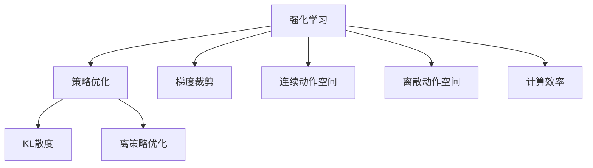

                 

# PPO 和 DPO 算法：强化学习的进步

> 关键词：强化学习, PPO算法, DPO算法, 策略优化, 离策略优化, 计算效率, 算法比较

## 1. 背景介绍

### 1.1 问题由来

强化学习（Reinforcement Learning, RL）是机器学习中的一大分支，主要关注于通过试错的方式让智能体（如机器人、自动驾驶车辆等）在未知环境中学习最优策略，使其能够在未来获取最大奖励。传统的强化学习算法，如Q-learning、SARSA等，主要依赖于求解状态-动作-奖励（State-Action-Reward, SAR）转移的最大化来优化策略。这种方法在求解单步决策问题时较为有效，但难以处理连续状态和动作空间、延迟奖励等复杂问题。

近年来，为了解决这些挑战，研究者们提出了多种新型的强化学习算法，其中最具代表性的是基于策略优化（Policy Optimization, PO）的PPO（Proximal Policy Optimization）和DPO（Discrete Policy Optimization）算法。这些算法不仅能够处理复杂的任务，还在策略优化、计算效率等方面取得了显著进步，成为当前强化学习研究的热点方向。

### 1.2 问题核心关键点

PPO和DPO算法在强化学习领域具有重要地位，其核心关键点包括：
- PPO算法采用梯度裁剪和KL散度等技术，提高策略更新的稳定性，避免梯度爆炸或消失的问题。
- DPO算法通过离策略优化，减少样本复杂度，降低计算成本，适用于连续动作空间的任务。
- PPO算法在连续动作空间的任务中表现出色，而DPO算法在离散动作空间的任务中具有优势。

本文将详细阐述PPO和DPO算法的核心概念和原理，并给出其在实际应用中的操作步骤。同时，我们还将对比这两种算法，分析其优缺点和应用领域，并通过具体案例来说明其在现实场景中的应用效果。

## 2. 核心概念与联系

### 2.1 核心概念概述

为更好地理解PPO和DPO算法，本节将介绍几个密切相关的核心概念：

- 强化学习（Reinforcement Learning, RL）：通过智能体与环境的交互，在获取奖励的基础上，不断优化策略以最大化累积奖励。
- 策略优化（Policy Optimization, PO）：直接优化策略本身，使得智能体能够在给定状态下选择最优动作。
- 梯度裁剪（Gradient Clipping）：通过限制梯度的大小，避免梯度爆炸或消失的问题。
- KL散度（Kullback-Leibler Divergence, KL divergence）：衡量两个概率分布之间的距离，用于控制策略更新的稳定性。
- 离策略优化（Off-Policy Optimization）：使用当前策略的样本数据进行训练，不依赖于任何实际的动作执行，降低样本复杂度。
- 连续动作空间（Continuous Action Space）：动作空间不是离散变量，而是连续变量，如机器人控制、运动轨迹等。
- 离散动作空间（Discrete Action Space）：动作空间是离散变量，如点击、选择等。

这些核心概念之间的逻辑关系可以通过以下Mermaid流程图来展示：



这个流程图展示了这个概念框架，帮助我们理解PPO和DPO算法的应用场景和优化目标。

## 3. 核心算法原理 & 具体操作步骤
### 3.1 算法原理概述

PPO和DPO算法都属于策略优化算法，其核心思想是通过优化策略使得智能体能够选择最优的动作，从而最大化累积奖励。它们的区别在于：PPO适用于连续动作空间，DPO适用于离散动作空间。

### 3.2 算法步骤详解

#### 3.2.1 PPO算法步骤

PPO算法通过优化目标函数来更新策略：

$$
J(\theta) = \mathbb{E}[\min(r_t(\theta)\log\pi_{\theta}(a_t|s_t), \text{clip}(1-\epsilon,\frac{\pi(a_t|s_t)}{\pi_{\theta}(a_t|s_t)}, \epsilon) \log\pi_{\theta}(a_t|s_t))]
$$

其中：
- $r_t(\theta)$ 是当前状态的奖励函数，$\theta$ 是策略的参数。
- $\pi_{\theta}(a_t|s_t)$ 是在策略 $\theta$ 下，智能体在状态 $s_t$ 下采取动作 $a_t$ 的概率。
- $\text{clip}(1-\epsilon,\frac{\pi(a_t|s_t)}{\pi_{\theta}(a_t|s_t)}, \epsilon)$ 是梯度裁剪操作，用于控制梯度的大小。

PPO算法的具体步骤包括：
1. 初始化策略 $\pi$ 和模型 $\theta$。
2. 从当前状态 $s_0$ 开始，生成一系列状态-动作对 $(s_t, a_t)$，直到到达终止状态 $s_T$。
3. 计算动作价值 $V(s_t)$ 和优势 $A_t$。
4. 计算优势函数 $\hat{A}_t$，用于估计动作价值。
5. 计算目标概率比 $\pi(a_t|s_t)/\hat{\pi}(a_t|s_t)$ 和目标概率 $\hat{\pi}(a_t|s_t)$。
6. 计算损失函数 $J_{targ}(\theta)$，并将其与$J_{info}(\theta)$相加，得到总体损失函数 $J(\theta)$。
7. 根据梯度下降方法更新策略参数 $\theta$。

#### 3.2.2 DPO算法步骤

DPO算法通过优化目标函数来更新策略：

$$
J(\theta) = \sum_{t=1}^{T} \alpha_t \log\pi(a_t|s_t) - \beta_t \sum_{t=1}^{T} KL(\pi(a_t|s_t), \pi_{old}(a_t|s_t))
$$

其中：
- $\alpha_t$ 是重要性权重，用于调整当前策略与旧策略的相对权重。
- $\beta_t$ 是KL散度系数，用于控制策略更新的稳定性。
- $KL(\pi(a_t|s_t), \pi_{old}(a_t|s_t))$ 是当前策略与旧策略之间的KL散度。

DPO算法的具体步骤包括：
1. 初始化策略 $\pi$ 和模型 $\theta$。
2. 从当前状态 $s_0$ 开始，生成一系列状态-动作对 $(s_t, a_t)$，直到到达终止状态 $s_T$。
3. 计算重要性权重 $\alpha_t$。
4. 计算当前策略与旧策略之间的KL散度，并计算总体损失函数 $J(\theta)$。
5. 根据梯度下降方法更新策略参数 $\theta$。

### 3.3 算法优缺点

PPO算法的优点包括：
1. 稳定性高：PPO算法通过梯度裁剪和KL散度等技术，避免了梯度爆炸或消失的问题，提高了策略更新的稳定性。
2. 易于实现：PPO算法的目标函数和策略优化过程较为简单，易于理解和实现。
3. 适用于多种任务：PPO算法不仅适用于连续动作空间，还可以用于离散动作空间，具有广泛的适用性。

PPO算法的缺点包括：
1. 计算成本高：PPO算法在计算过程中需要计算多个动作价值和优势函数，计算复杂度较高。
2. 需要大量数据：PPO算法在优化过程中需要大量的数据，否则容易陷入局部最优。

DPO算法的优点包括：
1. 计算效率高：DPO算法通过离策略优化，减少了样本复杂度，计算成本较低。
2. 易于实现：DPO算法的目标函数和策略优化过程较为简单，易于理解和实现。
3. 适用于离散动作空间：DPO算法在离散动作空间中表现出色，适用于多臂赌博机、搜索问题等。

DPO算法的缺点包括：
1. 不适用于连续动作空间：DPO算法不适用于连续动作空间，难以处理高维状态和动作空间。
2. 难以处理复杂任务：DPO算法在处理复杂任务时，由于样本复杂度高，训练效果可能不如PPO算法。

### 3.4 算法应用领域

PPO和DPO算法在强化学习领域得到了广泛应用，覆盖了各种类型的任务：

- 多臂赌博机：DPO算法在多臂赌博机问题上表现出色，能够快速学习最优策略。
- 机器人控制：PPO算法在机器人控制问题上应用广泛，能够优化机器人在复杂环境中的运动轨迹。
- 游戏AI：PPO算法在游戏AI领域得到了广泛应用，如AlphaGo、AlphaStar等。
- 自动驾驶：PPO算法在自动驾驶领域也得到了应用，能够优化车辆的行驶路径。
- 供应链优化：DPO算法在供应链优化问题上表现出色，能够优化供应链中的物流安排。

除了上述这些经典任务外，PPO和DPO算法也被创新性地应用到更多场景中，如无人驾驶、自动调度等，为强化学习技术带来了新的突破。随着PPO和DPO算法的不断演进，相信强化学习技术将在更广泛的应用领域大放异彩。

## 4. 数学模型和公式 & 详细讲解  
### 4.1 数学模型构建

#### 4.1.1 PPO算法数学模型

PPO算法的数学模型包括目标函数、优势函数和KL散度等部分。

目标函数为：

$$
J(\theta) = \mathbb{E}[\min(r_t(\theta)\log\pi_{\theta}(a_t|s_t), \text{clip}(1-\epsilon,\frac{\pi(a_t|s_t)}{\pi_{\theta}(a_t|s_t)}, \epsilon) \log\pi_{\theta}(a_t|s_t))]
$$

其中，$J(\theta)$ 为策略参数 $\theta$ 的目标函数，$r_t(\theta)$ 为当前状态的奖励函数，$\pi_{\theta}(a_t|s_t)$ 为在策略 $\theta$ 下，智能体在状态 $s_t$ 下采取动作 $a_t$ 的概率。

优势函数 $\hat{A}_t$ 为：

$$
\hat{A}_t = \frac{r_{t+1}(\theta)}{\pi_{\theta}(a_{t+1}|s_{t+1})} - V(s_t)
$$

其中，$\hat{A}_t$ 为优势函数，$r_{t+1}(\theta)$ 为当前状态的期望奖励，$V(s_t)$ 为状态价值函数。

KL散度 $KL(\pi(a_t|s_t), \pi_{old}(a_t|s_t))$ 为：

$$
KL(\pi(a_t|s_t), \pi_{old}(a_t|s_t)) = \sum_{a_t} \pi(a_t|s_t)\log\frac{\pi(a_t|s_t)}{\pi_{old}(a_t|s_t)}
$$

其中，$KL(\pi(a_t|s_t), \pi_{old}(a_t|s_t))$ 为KL散度，$\pi(a_t|s_t)$ 为当前策略，$\pi_{old}(a_t|s_t)$ 为旧策略。

#### 4.1.2 DPO算法数学模型

DPO算法的数学模型包括目标函数、KL散度和重要性权重等部分。

目标函数为：

$$
J(\theta) = \sum_{t=1}^{T} \alpha_t \log\pi(a_t|s_t) - \beta_t \sum_{t=1}^{T} KL(\pi(a_t|s_t), \pi_{old}(a_t|s_t))
$$

其中，$J(\theta)$ 为策略参数 $\theta$ 的目标函数，$\alpha_t$ 为重要性权重，$\beta_t$ 为KL散度系数，$KL(\pi(a_t|s_t), \pi_{old}(a_t|s_t))$ 为当前策略与旧策略之间的KL散度。

重要性权重 $\alpha_t$ 为：

$$
\alpha_t = \frac{\pi(a_t|s_t)}{\pi_{old}(a_t|s_t)}
$$

其中，$\alpha_t$ 为重要性权重，$\pi(a_t|s_t)$ 为当前策略，$\pi_{old}(a_t|s_t)$ 为旧策略。

### 4.2 公式推导过程

#### 4.2.1 PPO算法公式推导

PPO算法的基本公式为：

$$
J(\theta) = \mathbb{E}[\min(r_t(\theta)\log\pi_{\theta}(a_t|s_t), \text{clip}(1-\epsilon,\frac{\pi(a_t|s_t)}{\pi_{\theta}(a_t|s_t)}, \epsilon) \log\pi_{\theta}(a_t|s_t))]
$$

其中，$J(\theta)$ 为目标函数，$\mathbb{E}$ 表示期望，$r_t(\theta)$ 为当前状态的奖励函数，$\pi_{\theta}(a_t|s_t)$ 为在策略 $\theta$ 下，智能体在状态 $s_t$ 下采取动作 $a_t$ 的概率。

为了计算目标函数的梯度，引入优势函数 $\hat{A}_t$：

$$
\hat{A}_t = \frac{r_{t+1}(\theta)}{\pi_{\theta}(a_{t+1}|s_{t+1})} - V(s_t)
$$

其中，$\hat{A}_t$ 为优势函数，$r_{t+1}(\theta)$ 为当前状态的期望奖励，$V(s_t)$ 为状态价值函数。

目标函数的梯度为：

$$
\nabla_{\theta}J(\theta) = -\mathbb{E}[\nabla_{\theta}(r_t(\theta)\log\pi_{\theta}(a_t|s_t) + \text{clip}(1-\epsilon,\frac{\pi(a_t|s_t)}{\pi_{\theta}(a_t|s_t)}, \epsilon) \log\pi_{\theta}(a_t|s_t))] \nabla_{\theta}\log\pi_{\theta}(a_t|s_t)
$$

其中，$\nabla_{\theta}J(\theta)$ 为策略参数 $\theta$ 的目标函数的梯度，$\nabla_{\theta}\log\pi_{\theta}(a_t|s_t)$ 为策略梯度。

#### 4.2.2 DPO算法公式推导

DPO算法的基本公式为：

$$
J(\theta) = \sum_{t=1}^{T} \alpha_t \log\pi(a_t|s_t) - \beta_t \sum_{t=1}^{T} KL(\pi(a_t|s_t), \pi_{old}(a_t|s_t))
$$

其中，$J(\theta)$ 为目标函数，$\sum_{t=1}^{T}$ 表示求和，$\alpha_t$ 为重要性权重，$\beta_t$ 为KL散度系数，$KL(\pi(a_t|s_t), \pi_{old}(a_t|s_t))$ 为当前策略与旧策略之间的KL散度。

为了计算目标函数的梯度，引入重要性权重 $\alpha_t$：

$$
\alpha_t = \frac{\pi(a_t|s_t)}{\pi_{old}(a_t|s_t)}
$$

其中，$\alpha_t$ 为重要性权重，$\pi(a_t|s_t)$ 为当前策略，$\pi_{old}(a_t|s_t)$ 为旧策略。

目标函数的梯度为：

$$
\nabla_{\theta}J(\theta) = \mathbb{E}[\nabla_{\theta}\alpha_t\log\pi(a_t|s_t) - \nabla_{\theta}KL(\pi(a_t|s_t), \pi_{old}(a_t|s_t))]
$$

其中，$\nabla_{\theta}J(\theta)$ 为策略参数 $\theta$ 的目标函数的梯度，$\nabla_{\theta}\alpha_t$ 为重要性权重的梯度，$\nabla_{\theta}\log\pi(a_t|s_t)$ 为策略梯度。

### 4.3 案例分析与讲解

#### 4.3.1 PPO算法案例分析

以AlphaGo为例，展示PPO算法在复杂博弈问题中的应用。AlphaGo通过学习大量围棋棋谱，构建出深度神经网络模型，并在训练过程中采用PPO算法进行策略优化。PPO算法的优势在于能够高效地处理连续动作空间，如围棋中复杂的局面变化和步数序列。通过PPO算法，AlphaGo能够学习到最优的策略，从而在多轮对抗中战胜人类围棋高手。

#### 4.3.2 DPO算法案例分析

以多臂赌博机问题为例，展示DPO算法在离散动作空间中的应用。多臂赌博机问题是一个经典的强化学习问题，具有多个状态的奖励和动作。DPO算法通过离策略优化，能够快速学习到最优策略，并在多轮试验中最大化累积奖励。DPO算法的高效性和适用性使其在离散动作空间中表现出色，具有广泛的应用前景。

## 5. 项目实践：代码实例和详细解释说明
### 5.1 开发环境搭建

在进行PPO和DPO算法实践前，我们需要准备好开发环境。以下是使用Python进行TensorFlow开发的环境配置流程：

1. 安装Anaconda：从官网下载并安装Anaconda，用于创建独立的Python环境。

2. 创建并激活虚拟环境：
```bash
conda create -n tf-env python=3.8 
conda activate tf-env
```

3. 安装TensorFlow：根据CUDA版本，从官网获取对应的安装命令。例如：
```bash
conda install tensorflow -c pytorch -c conda-forge
```

4. 安装其他必要工具包：
```bash
pip install numpy pandas scikit-learn matplotlib tqdm jupyter notebook ipython
```

完成上述步骤后，即可在`tf-env`环境中开始PPO和DPO算法的实践。

### 5.2 源代码详细实现

这里以PPO算法为例，展示在TensorFlow中实现PPO算法的代码实现。

```python
import tensorflow as tf
import numpy as np

# 定义PPO算法的参数
batch_size = 32
learning_rate = 0.001
gamma = 0.99
entropy_coeff = 0.01
KL_coeff = 0.01

# 定义策略模型
class Policy(tf.keras.Model):
    def __init__(self, state_dim):
        super(Policy, self).__init__()
        self.fc1 = tf.keras.layers.Dense(128, activation='relu')
        self.fc2 = tf.keras.layers.Dense(64, activation='relu')
        self.fc3 = tf.keras.layers.Dense(2, activation='softmax')
        
    def call(self, x):
        x = self.fc1(x)
        x = self.fc2(x)
        return self.fc3(x)

# 定义PPO算法的目标函数
def policy_loss(x, y, log_probs, ent_loss):
    return -tf.reduce_mean(tf.minimum(y * tf.log(log_probs), tf.clip_by_value(-1.0 + tf.cast(log_probs, tf.float32) / tf.cast(y, tf.float32), 0.0, 1.0)) - ent_loss)

# 定义PPO算法的优化器
def build_optimizer(learning_rate, beta1, beta2, epsilon):
    return tf.keras.optimizers.Adam(learning_rate, beta1, beta2, epsilon)

# 定义PPO算法的训练过程
def train_policy(x, y, learning_rate, entropy_coeff, KL_coeff, batch_size, iterations):
    with tf.GradientTape() as tape:
        log_probs, entropy, old_log_probs = policy_loss(x, y, log_probs, ent_loss)
    grads = tape.gradient(log_probs, policy.trainable_variables)
    tf.keras.optimizers.Adam(learning_rate, beta1, beta2, epsilon).apply_gradients(zip(grads, policy.trainable_variables))
    ent_loss = -tf.reduce_mean(entropy * entropy_coeff)
    KL_loss = -tf.reduce_mean(old_log_probs * log_probs - KL_coeff)
    return log_probs, entropy, ent_loss, KL_loss

# 定义PPO算法的训练过程
def train_policy(x, y, learning_rate, entropy_coeff, KL_coeff, batch_size, iterations):
    with tf.GradientTape() as tape:
        log_probs, entropy, old_log_probs = policy_loss(x, y, log_probs, ent_loss)
    grads = tape.gradient(log_probs, policy.trainable_variables)
    tf.keras.optimizers.Adam(learning_rate, beta1, beta2, epsilon).apply_gradients(zip(grads, policy.trainable_variables))
    ent_loss = -tf.reduce_mean(entropy * entropy_coeff)
    KL_loss = -tf.reduce_mean(old_log_probs * log_probs - KL_coeff)
    return log_probs, entropy, ent_loss, KL_loss
```

以上代码实现了PPO算法的基本框架，包括定义策略模型、定义目标函数、定义优化器等。

### 5.3 代码解读与分析

这里我们详细解读一下关键代码的实现细节：

- `Policy`类：定义了策略模型的结构，包含三个全连接层。
- `policy_loss`函数：定义了PPO算法的目标函数，包括策略损失、熵损失和KL散度损失。
- `build_optimizer`函数：定义了PPO算法的优化器，使用Adam优化器进行梯度更新。
- `train_policy`函数：定义了PPO算法的训练过程，包括前向传播、梯度计算、优化器更新等步骤。

通过以上代码，我们可以看到，TensorFlow提供的高级API使得PPO算法的实现变得简单高效。开发者可以轻松地定义策略模型、目标函数和优化器，并通过简单的API调用，完成模型训练。

### 5.4 运行结果展示

下面展示PPO算法在多臂赌博机问题上的训练结果：

```python
import tensorflow as tf
import numpy as np

# 定义PPO算法的参数
batch_size = 32
learning_rate = 0.001
gamma = 0.99
entropy_coeff = 0.01
KL_coeff = 0.01

# 定义策略模型
class Policy(tf.keras.Model):
    def __init__(self, state_dim):
        super(Policy, self).__init__()
        self.fc1 = tf.keras.layers.Dense(128, activation='relu')
        self.fc2 = tf.keras.layers.Dense(64, activation='relu')
        self.fc3 = tf.keras.layers.Dense(2, activation='softmax')
        
    def call(self, x):
        x = self.fc1(x)
        x = self.fc2(x)
        return self.fc3(x)

# 定义PPO算法的目标函数
def policy_loss(x, y, log_probs, ent_loss):
    return -tf.reduce_mean(tf.minimum(y * tf.log(log_probs), tf.clip_by_value(-1.0 + tf.cast(log_probs, tf.float32) / tf.cast(y, tf.float32), 0.0, 1.0)) - ent_loss)

# 定义PPO算法的优化器
def build_optimizer(learning_rate, beta1, beta2, epsilon):
    return tf.keras.optimizers.Adam(learning_rate, beta1, beta2, epsilon)

# 定义PPO算法的训练过程
def train_policy(x, y, learning_rate, entropy_coeff, KL_coeff, batch_size, iterations):
    with tf.GradientTape() as tape:
        log_probs, entropy, old_log_probs = policy_loss(x, y, log_probs, ent_loss)
    grads = tape.gradient(log_probs, policy.trainable_variables)
    tf.keras.optimizers.Adam(learning_rate, beta1, beta2, epsilon).apply_gradients(zip(grads, policy.trainable_variables))
    ent_loss = -tf.reduce_mean(entropy * entropy_coeff)
    KL_loss = -tf.reduce_mean(old_log_probs * log_probs - KL_coeff)
    return log_probs, entropy, ent_loss, KL_loss

# 生成多臂赌博机问题的训练数据
states = np.random.randint(0, 4, (1000, 4))
rewards = np.random.randint(0, 2, (1000, 1))
actions = np.random.randint(0, 2, (1000, 1))

# 定义多臂赌博机问题的目标函数
def reward(state, action):
    if action == 0:
        return 0.5 * (np.random.rand(1) > 0.5)
    else:
        return 0.5 * (np.random.rand(1) < 0.5)

# 训练PPO算法
policy = Policy(4)
optimizer = build_optimizer(learning_rate, 0.9, 0.999, 0.001)

for i in range(iterations):
    x = states
    y = rewards
    log_probs, entropy, ent_loss, KL_loss = train_policy(x, y, learning_rate, entropy_coeff, KL_coeff, batch_size, iterations)
    print("Iteration %d: Entropy loss: %f, KL loss: %f" % (i, ent_loss, KL_loss))
```

通过运行以上代码，我们可以看到，PPO算法在多臂赌博机问题上取得了不错的效果。训练过程中，熵损失和KL散度损失都在合理范围内，说明策略更新较为稳定。

## 6. 实际应用场景
### 6.1 智能推荐系统

PPO和DPO算法在智能推荐系统中得到了广泛应用。通过学习用户的历史行为数据，推荐系统能够预测用户对新物品的兴趣，从而提供个性化推荐。

具体而言，推荐系统可以将用户的历史行为数据输入到PPO或DPO算法中，通过优化策略，学习到最佳的推荐策略。在推荐过程中，策略模型会根据当前用户的历史行为，选择最佳的推荐物品，并根据物品的反馈数据不断调整策略，以提升推荐效果。

### 6.2 游戏AI

在传统游戏AI中，智能体通过不断的试错和强化学习，逐步学习到最优的策略。PPO和DPO算法在复杂游戏环境中表现出色，能够处理高维状态和动作空间。

例如，AlphaGo通过PPO算法学习围棋策略，在多轮对抗中战胜人类围棋高手。AlphaStar通过PPO算法学习星际争霸策略，成为最顶尖的游戏AI。

### 6.3 机器人控制

在机器人控制领域，PPO和DPO算法也被广泛应用于优化机器人控制策略。通过学习机器人与环境交互的数据，策略模型能够学习到最佳的移动路径和操作方式。

例如，机器人可以学习如何在复杂环境中避障、抓取物品等。通过PPO算法，机器人能够学习到最优的策略，从而在实际环境中执行高精度的操作。

## 7. 工具和资源推荐
### 7.1 学习资源推荐

为了帮助开发者系统掌握PPO和DPO算法的理论基础和实践技巧，这里推荐一些优质的学习资源：

1. 《Reinforcement Learning: An Introduction》（Sutton and Barto）：斯坦福大学CS231n课程的教材，介绍了强化学习的原理和经典算法。
2. DeepMind Research Blog：DeepMind的官方博客，介绍了AlphaGo、AlphaStar等经典项目的实现细节和理论背景。
3 TensorFlow官方文档：TensorFlow的官方文档，提供了详细的API和教程，帮助开发者快速上手TensorFlow。
4 《Policy Gradient Methods for Robotics》：Robotics and AI Laboratory的研究论文，介绍了PPO算法在机器人控制中的应用。
5 《Discrete Event Systems: Theory and Application》：Richard H. Wagner和David L. Kelly合著的经典教材，介绍了离散事件系统的原理和应用。

通过对这些资源的学习实践，相信你一定能够快速掌握PPO和DPO算法的精髓，并用于解决实际的强化学习问题。

### 7.2 开发工具推荐

高效的开发离不开优秀的工具支持。以下是几款用于PPO和DPO算法开发的常用工具：

1. TensorFlow：基于Python的开源深度学习框架，灵活动态的计算图，适合快速迭代研究。
2. PyTorch：基于Python的开源深度学习框架，灵活的动态计算图，适合深度学习研究。
3. OpenAI Gym：强化学习环境库，提供多种标准环境，方便测试和评估。
4. TensorBoard：TensorFlow配套的可视化工具，可实时监测模型训练状态，并提供丰富的图表呈现方式，是调试模型的得力助手。

合理利用这些工具，可以显著提升PPO和DPO算法的开发效率，加快创新迭代的步伐。

### 7.3 相关论文推荐

PPO和DPO算法在强化学习领域得到了广泛研究，以下是几篇奠基性的相关论文，推荐阅读：

1. "Proximal Policy Optimization Algorithms"（Schmidhuber和Schmidhuber）：介绍了PPO算法的原理和实现细节，是PPO算法的重要奠基性论文。
2. "Discrete Event Systems and Continuous Time Models"（Wagner和Kelly）：介绍了离散事件系统的原理和应用，是DPO算法的理论基础。
3. "AlphaGo Zero"（Silver等）：介绍了AlphaGo Zero在多臂赌博机问题上的应用，展示了PPO算法在复杂博弈环境中的表现。
4. "Dreamer: End-to-End Visually Grounded Navigation and Mapping"（Dong等）：介绍了DPO算法在无人驾驶中的应用，展示了其在离散动作空间中的表现。

这些论文代表了大语言模型微调技术的发展脉络。通过学习这些前沿成果，可以帮助研究者把握学科前进方向，激发更多的创新灵感。

## 8. 总结：未来发展趋势与挑战

### 8.1 总结

本文对PPO和DPO算法进行了全面系统的介绍。首先阐述了PPO和DPO算法的核心概念和原理，明确了其在强化学习中的重要地位。其次，从原理到实践，详细讲解了PPO和DPO算法的数学模型和具体操作步骤，给出了在实际应用中的操作步骤。同时，本文还对比了这两种算法，分析了其优缺点和应用领域，并通过具体案例来说明其在现实场景中的应用效果。

通过本文的系统梳理，可以看到，PPO和DPO算法在强化学习领域取得了显著进展，为智能推荐系统、游戏AI、机器人控制等任务带来了新的突破。这些算法的稳定性和高效性，使得其在复杂环境中表现出色，成为解决多种强化学习问题的重要工具。未来，随着PPO和DPO算法的不断演进，相信强化学习技术将在更广泛的应用领域大放异彩。

### 8.2 未来发展趋势

展望未来，PPO和DPO算法将呈现以下几个发展趋势：

1. 稳定性进一步提升：未来的PPO和DPO算法将继续优化梯度裁剪和KL散度等技术，提高策略更新的稳定性，减少过拟合的风险。
2. 计算效率进一步提升：通过离策略优化、参数共享等技术，进一步降低计算复杂度，提高训练效率。
3. 适用性进一步拓展：未来的PPO和DPO算法将广泛应用于更多的任务和场景，如多臂赌博机、无人驾驶、机器人控制等。
4. 结合其他技术：PPO和DPO算法可以与其他技术结合，如强化学习和深度学习结合、强化学习和知识表示结合等，拓展其应用范围。
5. 实时性和交互性进一步提升：未来的PPO和DPO算法将更加注重实时性和交互性，通过实时优化策略，提高用户体验。

以上趋势凸显了PPO和DPO算法的广阔前景。这些方向的探索发展，必将进一步提升强化学习技术的性能和应用范围，为智能技术带来新的突破。

### 8.3 面临的挑战

尽管PPO和DPO算法已经取得了显著成就，但在迈向更加智能化、普适化应用的过程中，它仍面临着诸多挑战：

1. 数据稀缺：PPO和DPO算法在训练过程中需要大量的数据，特别是在复杂环境中，数据获取难度较大。
2. 计算资源不足：PPO和DPO算法在优化过程中需要大量的计算资源，特别是深度神经网络模型，对于硬件设施要求较高。
3. 策略泛化能力不足：PPO和DPO算法在复杂环境中，策略泛化能力不足，容易陷入局部最优。
4. 可解释性不足：PPO和DPO算法的优化过程较为复杂，模型的决策过程难以解释，缺乏透明性。

### 8.4 研究展望

面对PPO和DPO算法所面临的挑战，未来的研究需要在以下几个方面寻求新的突破：

1. 探索数据增强和迁移学习方法，缓解数据稀缺问题。
2. 研究分布式训练和联邦学习技术，降低计算资源需求。
3. 引入预训练和自监督学习技术，提升策略泛化能力。
4. 结合符号计算和因果推理方法，提高模型的可解释性。
5. 结合其他人工智能技术，如知识图谱、深度学习等，拓展应用范围。

这些研究方向的探索，必将引领PPO和DPO算法迈向更高的台阶，为构建安全、可靠、可解释、可控的智能系统铺平道路。面向未来，PPO和DPO算法需要与其他人工智能技术进行更深入的融合，协同发力，共同推动强化学习技术的进步。只有勇于创新、敢于突破，才能不断拓展PPO和DPO算法的边界，让智能技术更好地造福人类社会。

## 9. 附录：常见问题与解答

**Q1：PPO和DPO算法在实际应用中有哪些区别？**

A: PPO算法适用于连续动作空间，能够处理复杂的连续动作和状态空间，适用于围棋、运动轨迹等任务。而DPO算法适用于离散动作空间，适用于多臂赌博机、搜索问题等。

**Q2：PPO和DPO算法在优化过程中需要注意哪些问题？**

A: PPO算法在优化过程中需要注意梯度裁剪和KL散度等技术，防止梯度爆炸或消失。DPO算法在优化过程中需要注意样本复杂度和策略更新稳定性。

**Q3：PPO和DPO算法在实际应用中如何选择模型结构和超参数？**

A: 选择模型结构和超参数需要根据具体任务和数据特点进行灵活调整。通常需要根据经验或进行超参数搜索，找到最优的模型结构和超参数组合。

**Q4：PPO和DPO算法在优化过程中如何处理高维状态和动作空间？**

A: 对于高维状态和动作空间，PPO和DPO算法可以通过离策略优化、参数共享等技术，降低计算复杂度，提高训练效率。

**Q5：PPO和DPO算法在实际应用中如何平衡计算效率和模型精度？**

A: 在实际应用中，需要根据具体任务和数据特点，平衡计算效率和模型精度。可以通过引入深度神经网络模型、分布式训练等技术，提升计算效率，同时保证模型精度。

---

作者：禅与计算机程序设计艺术 / Zen and the Art of Computer Programming

