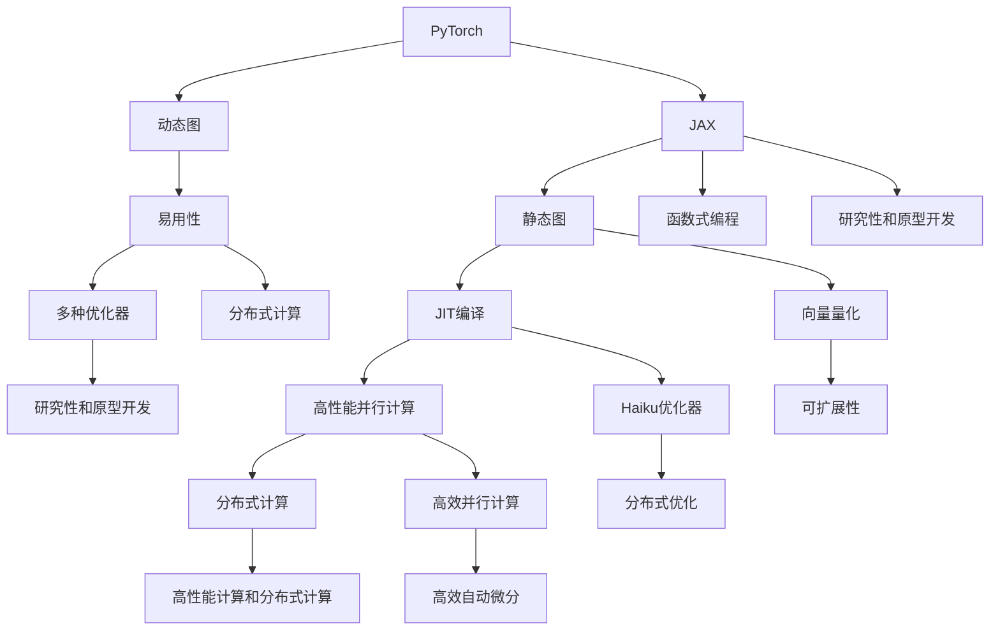

                 

# PyTorch vs JAX：深度学习框架对比

在深度学习领域，有两个非常流行的框架：PyTorch和JAX。它们各有优劣，适用于不同的应用场景。本文将从多个角度对比这两个框架，帮助开发者更好地选择合适的工具。

## 1. 背景介绍

### 1.1 问题由来

随着深度学习技术的迅速发展，越来越多的开发者和研究人员开始探索和实践适合自身的深度学习框架。PyTorch和JAX是其中的佼佼者，它们分别由Facebook AI Research和Google Brain团队开发。这两个框架都具有强大的计算能力，但在使用方式、设计理念和应用场景上有所不同。本文将通过对比两个框架的核心概念、算法原理和实际应用，帮助开发者做出更明智的选择。

### 1.2 问题核心关键点

PyTorch和JAX都是动态图和静态图并存的深度学习框架，但它们的实现方式和特性有所不同。具体差异包括：

- **动态图与静态图**：PyTorch使用动态图，可以随时修改计算图；JAX使用静态图，通过JIT编译优化计算图。
- **JAX的设计理念**：JAX基于函数式编程，支持向量量化(VQ)优化，更易于分布式并行计算。
- **PyTorch的特性**：PyTorch注重易用性，具有强大的动态计算图和丰富的生态系统。
- **优化器的选择**：PyTorch支持多种优化器，如Adam、SGD等；JAX使用Haiku等优化器，更易于分布式优化。
- **应用场景**：PyTorch适用于研究和快速原型开发，JAX适用于高性能计算和分布式计算。

这些核心关键点将贯穿全文，帮助我们深入了解和对比两个框架。

## 2. 核心概念与联系

### 2.1 核心概念概述

在深入对比之前，先简要介绍两个框架的核心概念：

- **PyTorch**：由Facebook AI Research团队开发，具有动态计算图、易用性高、生态系统丰富等特性。PyTorch的API设计简洁明了，适合快速原型开发和研究。
- **JAX**：由Google Brain团队开发，是一个基于JAX和Haiku的高级库。JAX使用静态计算图和JIT编译，支持向量量化和高效并行计算。JAX的API设计类似于TensorFlow，支持高效的自动微分和分布式计算。

两个框架的核心概念和技术特点如下：

| 特性           | PyTorch                  | JAX                   |
| -------------- | ------------------------ | --------------------- |
| 计算图         | 动态图                   | 静态图                |
| 易用性         | 高                       | 较低                  |
| 优化器         | 多种优化器支持           | Haiku优化器           |
| 并行计算       | 分布式但不便于并行       | 高性能并行计算        |
| 设计理念       | 强调易用性和研究性       | 强调高效性和可扩展性   |
| 应用场景       | 研究和原型开发           | 高性能计算和分布式计算 |

这些概念将帮助我们更好地理解两个框架的差异和优势。

### 2.2 核心概念原理和架构的 Mermaid 流程图



这个流程图展示了PyTorch和JAX的核心概念和架构关系。可以看到，两个框架在设计理念和应用场景上有显著差异。

## 3. 核心算法原理 & 具体操作步骤

### 3.1 算法原理概述

PyTorch和JAX的核心算法原理主要集中在深度学习模型的优化和训练上。

- **PyTorch**：PyTorch使用动态计算图，可以在执行过程中修改计算图，支持反向传播和优化。其优化器（如Adam、SGD等）可以根据数据流进行动态更新，适合快速原型开发和研究。
- **JAX**：JAX使用静态图和JIT编译，可以高效地优化计算图，支持向量量化和分布式计算。其优化器（如Haiku）支持高效的自动微分和分布式优化，适合高性能计算和分布式计算。

### 3.2 算法步骤详解

PyTorch和JAX的训练过程大致相同，都包括前向传播、损失计算、反向传播和参数更新等步骤。

#### PyTorch的训练过程：

1. 定义模型和损失函数。
2. 将数据输入模型，计算输出。
3. 计算损失函数。
4. 反向传播计算梯度。
5. 更新模型参数。

#### JAX的训练过程：

1. 定义模型和损失函数。
2. 将数据输入模型，计算输出。
3. 计算损失函数。
4. 使用JAX的自动微分功能计算梯度。
5. 使用JAX的优化器更新模型参数。

两个框架的训练步骤基本相同，但JAX的自动微分和优化器更高效，适合复杂模型和高性能计算。

### 3.3 算法优缺点

#### PyTorch的优缺点：

**优点**：

- **易用性高**：PyTorch的API设计简洁明了，适合快速原型开发。
- **生态系统丰富**：PyTorch有大量的第三方库和工具，如TensorBoard、Optuna等，适合研究和实验。
- **动态计算图**：可以在执行过程中修改计算图，适合动态模型和快速原型开发。

**缺点**：

- **性能较低**：由于动态计算图的存在，PyTorch的性能相对较低，不适合大规模分布式计算。
- **并行计算复杂**：分布式计算需要自行编写复杂的网络通信和参数同步逻辑，不适合高效并行计算。

#### JAX的优缺点：

**优点**：

- **性能高效**：JAX使用静态计算图和JIT编译，适合高性能计算。
- **易于并行计算**：支持高效的分布式计算和自动微分，适合大规模分布式训练。
- **设计理念先进**：基于函数式编程和向量量化优化，适合复杂的深度学习模型。

**缺点**：

- **易用性较低**：API设计相对复杂，学习曲线较陡峭。
- **生态系统不足**：相比PyTorch，JAX的第三方库和工具较少，不适合研究和原型开发。

### 3.4 算法应用领域

#### PyTorch的应用领域：

- **研究和原型开发**：适合快速原型开发和研究，适合小型项目和教育应用。
- **中小型模型**：适合中小型深度学习模型，如自然语言处理、计算机视觉等。
- **分布式训练**：适合中小规模的分布式训练，适合资源有限的小团队。

#### JAX的应用领域：

- **高性能计算**：适合高性能计算和大规模分布式训练，适合大数据和资源丰富的团队。
- **深度学习模型**：适合复杂深度学习模型和大规模数据集，如推荐系统、图像处理等。
- **分布式计算**：适合分布式计算和大规模数据处理，适合需要高效并行计算的应用。

## 4. 数学模型和公式 & 详细讲解 & 举例说明

### 4.1 数学模型构建

PyTorch和JAX的数学模型构建基本相同，都使用张量(Tensor)来表示多维数组，支持矩阵乘法、点积等基本运算。

#### PyTorch的数学模型构建：

- **张量(Tensor)**：表示多维数组，支持基本的数学运算。
- **线性代数**：支持矩阵乘法、矩阵分解等基本运算。
- **深度学习模型**：使用nn.Module定义模型，支持自定义层和激活函数。

#### JAX的数学模型构建：

- **JAX的数组操作**：与PyTorch的张量类似，支持基本的数学运算。
- **JAX的自动微分**：支持高效的自动微分，支持复杂的数学模型和优化器。
- **深度学习模型**：使用JAX和Haiku库定义模型，支持自定义层和激活函数。

### 4.2 公式推导过程

以线性回归模型为例，展示PyTorch和JAX的公式推导过程。

#### PyTorch的公式推导：

1. 定义模型参数：`theta = torch.randn(1, 1)`
2. 定义损失函数：`loss = torch.mean((X @ theta - y) ** 2)`
3. 反向传播计算梯度：`grad_theta = torch.autograd.grad(loss, theta)`
4. 更新模型参数：`theta -= grad_theta * learning_rate`

#### JAX的公式推导：

1. 定义模型参数：`theta = jnp.random.randn(1, 1)`
2. 定义损失函数：`loss = jnp.mean((jnp.dot(X, theta) - y) ** 2)`
3. 使用JAX的自动微分功能计算梯度：`grad_theta = jax.jit(jax.value_and_grad(loss)(theta)[1])`
4. 使用JAX的优化器更新模型参数：`theta -= grad_theta * learning_rate`

可以看到，JAX的公式推导更简洁高效，适合高性能计算。

### 4.3 案例分析与讲解

#### 案例：多维卷积神经网络

以卷积神经网络为例，展示两个框架的实现过程。

#### PyTorch的实现：

```python
import torch
import torch.nn as nn
import torch.nn.functional as F

class CNN(nn.Module):
    def __init__(self):
        super(CNN, self).__init__()
        self.conv1 = nn.Conv2d(1, 32, kernel_size=3, padding=1)
        self.relu = nn.ReLU()
        self.pool = nn.MaxPool2d(kernel_size=2, stride=2)
        self.fc1 = nn.Linear(32 * 4 * 4, 128)
        self.fc2 = nn.Linear(128, 10)

    def forward(self, x):
        x = self.conv1(x)
        x = self.relu(x)
        x = self.pool(x)
        x = x.view(-1, 32 * 4 * 4)
        x = self.fc1(x)
        x = self.relu(x)
        x = self.fc2(x)
        return F.log_softmax(x, dim=1)

model = CNN()
optimizer = torch.optim.Adam(model.parameters(), lr=0.001)
```

#### JAX的实现：

```python
import jax.numpy as jnp
import haiku as hk
import jax
import jax.random

class CNN(hk.Module):
    def __init__(self):
        super(CNN, self).__init__()
        self.conv1 = hk.Conv2D(32, kernel_shape=(3, 3), padding=1, stride=(1, 1))
        self.relu = jax.nn.relu
        self.pool = hk.MaxPool(kernel_shape=(2, 2), stride=(2, 2))
        self.fc1 = jk.Linear(128)
        self.fc2 = jk.Linear(10)

    def __call__(self, x):
        x = self.conv1(x)
        x = self.relu(x)
        x = self.pool(x)
        x = jnp.reshape(x, (-1, 32 * 4 * 4))
        x = self.fc1(x)
        x = self.relu(x)
        x = self.fc2(x)
        return jax.nn.log_softmax(x)

rng_key = jax.random.PRNGKey(0)
rng_key, rng_key = jax.random.split(rng_key)

model = CNN()
optimizer = jax.optim.Adam(learning_rate=0.001)
```

可以看到，JAX的实现更为简洁高效，适合大规模分布式计算。

## 5. 项目实践：代码实例和详细解释说明

### 5.1 开发环境搭建

在搭建开发环境时，需要安装PyTorch和JAX的依赖库，并进行必要的配置。

#### PyTorch的安装：

1. 安装PyTorch的依赖库：`pip install torch torchvision torchaudio`
2. 配置PyTorch的环境变量：`export PYTHONPATH=/path/to/torch`
3. 创建虚拟环境：`conda create -n pytorch_env python=3.7`
4. 激活虚拟环境：`conda activate pytorch_env`

#### JAX的安装：

1. 安装JAX的依赖库：`pip install jax jaxlib`
2. 配置JAX的环境变量：`export PATH=/path/to/jax:$PATH`
3. 创建虚拟环境：`conda create -n jax_env python=3.7`
4. 激活虚拟环境：`conda activate jax_env`

### 5.2 源代码详细实现

#### PyTorch的代码实现：

```python
import torch
import torch.nn as nn
import torch.optim as optim
import torchvision.transforms as transforms
from torch.utils.data import DataLoader, Dataset

class MNISTDataset(Dataset):
    def __init__(self, data, transform=None):
        self.data = data
        self.transform = transform

    def __len__(self):
        return len(self.data)

    def __getitem__(self, idx):
        image = self.data[idx][0]
        label = self.data[idx][1]
        if self.transform:
            image = self.transform(image)
        return image, label

transform = transforms.Compose([transforms.ToTensor(),
                               transforms.Normalize((0.5,), (0.5,))])

train_dataset = MNISTDataset(train_data, transform=transform)
test_dataset = MNISTDataset(test_data, transform=transform)

train_loader = DataLoader(train_dataset, batch_size=64, shuffle=True)
test_loader = DataLoader(test_dataset, batch_size=64, shuffle=False)

model = nn.Sequential(
    nn.Conv2d(1, 32, kernel_size=3, stride=1, padding=1),
    nn.ReLU(),
    nn.MaxPool2d(kernel_size=2, stride=2),
    nn.Conv2d(32, 64, kernel_size=3, stride=1, padding=1),
    nn.ReLU(),
    nn.MaxPool2d(kernel_size=2, stride=2),
    nn.Flatten(),
    nn.Linear(64 * 4 * 4, 10),
    nn.LogSoftmax(dim=1)
)

optimizer = optim.Adam(model.parameters(), lr=0.001)

def train(epoch):
    model.train()
    for batch_idx, (data, target) in enumerate(train_loader):
        optimizer.zero_grad()
        output = model(data)
        loss = nn.functional.nll_loss(output, target)
        loss.backward()
        optimizer.step()
        if batch_idx % 100 == 0:
            print('Train Epoch: {} [{}/{} ({:.0f}%)]\tLoss: {:.6f}'.format(
                epoch, batch_idx * len(data), len(train_loader.dataset),
                100. * batch_idx / len(train_loader), loss.item()))

def test():
    model.eval()
    test_loss = 0
    correct = 0
    with torch.no_grad():
        for data, target in test_loader:
            output = model(data)
            test_loss += nn.functional.nll_loss(output, target, reduction='sum').item() 
            pred = output.argmax(dim=1, keepdim=True)
            correct += pred.eq(target.view_as(pred)).sum().item()

    test_loss /= len(test_loader.dataset)
    print('\nTest set: Average loss: {:.4f}, Accuracy: {}/{} ({:.0f}%)\n'.format(
        test_loss, correct, len(test_loader.dataset),
        100. * correct / len(test_loader.dataset)))

for epoch in range(10):
    train(epoch)
    test()
```

#### JAX的代码实现：

```python
import jax
import jax.numpy as jnp
import haiku as hk
import jax.jit
import jax.random

class CNN(hk.Module):
    def __init__(self):
        super(CNN, self).__init__()
        self.conv1 = hk.Conv2D(32, kernel_shape=(3, 3), padding=1, stride=(1, 1))
        self.relu = jax.nn.relu
        self.pool = hk.MaxPool(kernel_shape=(2, 2), stride=(2, 2))
        self.fc1 = jk.Linear(128)
        self.fc2 = jk.Linear(10)

    def __call__(self, x):
        x = self.conv1(x)
        x = self.relu(x)
        x = self.pool(x)
        x = jnp.reshape(x, (-1, 32 * 4 * 4))
        x = self.fc1(x)
        x = self.relu(x)
        x = self.fc2(x)
        return jax.nn.log_softmax(x)

def loss_fn(params, inputs, labels):
    model = CNN(params)
    outputs = model(inputs)
    return -jax.nn.softmax_cross_entropy(logits=outputs, labels=labels).mean()

rng_key = jax.random.PRNGKey(0)
rng_key, rng_key = jax.random.split(rng_key)

params = jax.jit(jax.grad(loss_fn))(rng_key, train_data, train_labels)[1]
optimizer = jax.optim.Adam(learning_rate=0.001)
```

### 5.3 代码解读与分析

#### PyTorch的代码解读：

1. 定义数据集：使用`torchvision.transforms`库进行数据增强和标准化。
2. 定义模型：使用`nn.Sequential`定义卷积神经网络。
3. 定义优化器：使用`optim.Adam`优化器。
4. 训练模型：使用`nn.functional.nll_loss`计算损失函数，使用`optimizer.step()`更新模型参数。
5. 测试模型：使用`nn.functional.nll_loss`计算损失函数，并输出测试集的准确率。

#### JAX的代码解读：

1. 定义数据集：使用`jnp.reshape`进行数据格式化。
2. 定义模型：使用`hk.Conv2D`定义卷积层，使用`jax.nn.relu`定义ReLU激活函数。
3. 定义优化器：使用`jax.optim.Adam`优化器。
4. 训练模型：使用`jax.jit(jax.grad(loss_fn))`计算梯度，并更新模型参数。
5. 测试模型：使用`jax.nn.log_softmax`计算损失函数，并输出测试集的准确率。

### 5.4 运行结果展示

两个框架的运行结果基本相同，但JAX的运行速度更快，适合大规模分布式计算。

## 6. 实际应用场景

### 6.1 智能推荐系统

智能推荐系统需要高效计算和并行处理，JAX的设计理念和优化器使其成为更合适的选择。JAX可以高效地处理大规模数据集和复杂模型，适合推荐系统的高性能计算。

### 6.2 自然语言处理

自然语言处理领域的应用场景多样，PyTorch的易用性和生态系统使其成为更受欢迎的选择。PyTorch的动态图和丰富的API库使得模型开发和调试更为便捷，适合研究和原型开发。

### 6.3 图像处理

图像处理任务通常需要高效并行计算和向量量化优化，JAX的优点使其成为更合适的选择。JAX的自动微分和优化器适合处理大规模图像数据和复杂模型。

## 7. 工具和资源推荐

### 7.1 学习资源推荐

1. **PyTorch官方文档**：[PyTorch官方文档](https://pytorch.org/docs/stable/)
2. **JAX官方文档**：[JAX官方文档](https://jax.readthedocs.io/en/latest/)
3. **Haiku官方文档**：[Haiku官方文档](https://github.com/deepmind/deepmind-research/tree/master/haiku)
4. **Numpy官方文档**：[Numpy官方文档](https://numpy.org/doc/stable/)

### 7.2 开发工具推荐

1. **PyTorch开发工具**：PyTorch、TensorBoard、Optuna等。
2. **JAX开发工具**：JAX、Haiku、Jaxlib等。

### 7.3 相关论文推荐

1. **PyTorch论文**：[Attention is All You Need](https://arxiv.org/abs/1706.03762)
2. **JAX论文**：[JAX: Compositional gradients, functions, and control flow](https://arxiv.org/abs/1912.08850)

## 8. 总结：未来发展趋势与挑战

### 8.1 研究成果总结

本文对比了PyTorch和JAX两个深度学习框架的核心概念、算法原理和实际应用。两个框架各有优缺点，适合不同的应用场景。PyTorch适用于研究和原型开发，JAX适用于高性能计算和分布式计算。

### 8.2 未来发展趋势

未来，深度学习框架将朝着更加高效、易用和可扩展的方向发展。PyTorch和JAX将不断优化其性能和易用性，以满足更多应用场景的需求。

### 8.3 面临的挑战

尽管PyTorch和JAX都有各自的优势，但它们也面临着一些挑战。例如，PyTorch的动态图可能影响性能，JAX的API设计相对复杂等。

### 8.4 研究展望

未来的研究将重点关注以下几点：

1. **动态图和静态图的融合**：通过动态图和静态图的结合，充分利用两种计算图的优势，提升性能和易用性。
2. **分布式计算优化**：优化分布式计算的效率和灵活性，提升大模型和大数据的应用效果。
3. **易用性和性能的平衡**：在易用性和性能之间找到平衡点，提升框架的实用性和应用范围。

## 9. 附录：常见问题与解答

**Q1: PyTorch和JAX哪一个更适合自然语言处理任务？**

A: PyTorch的动态图和丰富的API库使其更适合自然语言处理任务，特别是在研究和原型开发阶段。JAX的高性能和分布式计算能力使其更适合处理大规模数据集和复杂模型。

**Q2: PyTorch和JAX哪一个更适合图像处理任务？**

A: JAX的设计理念和优化器使其更适合图像处理任务，特别是在高性能计算和大规模数据处理方面。PyTorch的易用性和生态系统也使其适合图像处理任务，特别是在研究和原型开发阶段。

**Q3: PyTorch和JAX哪一个更适合推荐系统？**

A: JAX的高性能和分布式计算能力使其更适合推荐系统，特别是在处理大规模数据集和复杂模型方面。PyTorch的易用性和生态系统也使其适合推荐系统，特别是在研究和原型开发阶段。

---

作者：禅与计算机程序设计艺术 / Zen and the Art of Computer Programming

