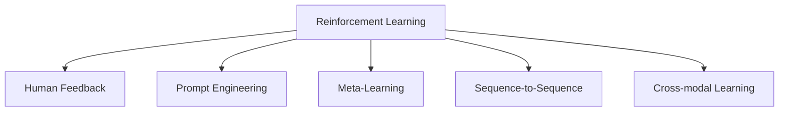

                 

# RLHF：利用人类反馈

> 关键词：Reinforcement Learning with Human Feedback (RLHF), Prompt Engineering, Meta-Learning, Model Integration, Sequence-to-Sequence

## 1. 背景介绍

### 1.1 问题由来

在人工智能的发展过程中，深度学习和强化学习的结合成为了近年来的一个热门话题。深度学习模型通常具有强大的表征能力，能够自动学习特征，从而在大规模数据集上进行高效的预测；而强化学习模型则擅长通过与环境的互动，进行策略优化和决策。将两者结合，可以实现更智能的自动决策。

然而，现有的结合方法往往局限于单一的深度学习或强化学习框架，难以充分利用二者的优势。例如，深度学习模型虽然能够对大量数据进行拟合，但往往缺乏对环境的理解能力，容易陷入局部最优；强化学习模型虽然能够适应环境，但需要大量试错，学习过程较为缓慢。

为了解决这一问题，Reinforcement Learning with Human Feedback (RLHF)方法应运而生。该方法通过引入人类反馈，使得深度学习模型能够在强化学习的环境中进行有效的策略优化，同时保留了深度学习的表征能力，极大地提升了自动决策系统的性能。

### 1.2 问题核心关键点

RLHF方法的核心思想是：利用人类反馈，将深度学习模型的预测结果与环境奖励相结合，通过强化学习的策略优化过程，使得模型能够更准确地预测，从而提升决策效果。

关键步骤如下：

1. **数据生成**：使用深度学习模型对输入数据进行预测，生成初步的预测结果。
2. **环境交互**：将预测结果和实际环境奖励进行交互，即预测结果指导实际行为，获取环境反馈。
3. **模型优化**：通过强化学习算法，优化模型参数，使得预测结果能够更好地适应环境，提高决策效果。
4. **反馈循环**：将优化后的模型重新应用于数据生成和环境交互中，形成反馈循环，不断迭代提升模型性能。

## 2. 核心概念与联系

### 2.1 核心概念概述

为更好地理解RLHF方法，本节将介绍几个密切相关的核心概念：

- **Reinforcement Learning (RL)**：通过与环境的互动，进行策略优化和决策的框架。在RL中，模型通过与环境的互动，学习到最优的策略，以最大化长期奖励。
- **Human Feedback (HF)**：在强化学习中引入的人类反馈，即通过人类的判断和决策，对模型的行为进行指导和调整。
- **Prompt Engineering**：通过设计特定的输入模板，引导深度学习模型进行特定任务的处理。
- **Meta-Learning**：学习如何学习的方法，即通过学习不同任务的共性特征，提升模型对新任务的适应能力。
- **Sequence-to-Sequence (Seq2Seq)**：将序列数据（如文本）映射到另一个序列数据的方法，常用于机器翻译、摘要生成等任务。
- **Cross-modal Learning**：跨模态学习，即在多模态数据上进行学习，如文本和图像的结合。

这些核心概念之间的逻辑关系可以通过以下Mermaid流程图来展示：



这个流程图展示了大语言模型的核心概念及其之间的关系：

1. 强化学习是构建自动决策系统的基础。
2. 人类反馈用于指导模型的行为，提高预测准确性。
3. 提示工程用于设计输入模板，引导模型进行特定任务。
4. 元学习用于学习新任务的共性特征，提升模型泛化能力。
5. 序列到序列用于处理序列数据，如文本和音频。
6. 跨模态学习用于结合多种模态数据，提升模型的鲁棒性和理解能力。

这些概念共同构成了RLHF方法的框架，使其能够在各种场景下发挥强大的自动决策能力。通过理解这些核心概念，我们可以更好地把握RLHF方法的工作原理和优化方向。

## 3. 核心算法原理 & 具体操作步骤

### 3.1 算法原理概述

RLHF方法的基本原理是：通过强化学习的策略优化过程，提升深度学习模型的预测能力。其核心在于将人类反馈与模型预测相结合，通过不断的迭代优化，使得模型能够更好地适应环境，提升预测效果。

具体而言，RLHF方法包括以下几个关键步骤：

1. **数据生成**：使用深度学习模型对输入数据进行预测，生成初步的预测结果。
2. **环境交互**：将预测结果和实际环境奖励进行交互，即预测结果指导实际行为，获取环境反馈。
3. **模型优化**：通过强化学习算法，优化模型参数，使得预测结果能够更好地适应环境，提高决策效果。
4. **反馈循环**：将优化后的模型重新应用于数据生成和环境交互中，形成反馈循环，不断迭代提升模型性能。

### 3.2 算法步骤详解

以下是RLHF方法的具体操作步骤：

**Step 1: 准备数据集和环境**

- 收集输入数据集 $D$，包括特征和标签。
- 确定环境交互的具体方式，例如对话、游戏等。
- 定义环境奖励函数 $R$，根据模型的行为和环境状态，生成奖励信号。

**Step 2: 设计深度学习模型**

- 选择适合任务的深度学习模型，如Seq2Seq模型、Transformer等。
- 设计模型的输入模板，通过Prompt Engineering，引导模型进行特定任务的处理。
- 初始化模型参数，通常使用预训练模型或随机初始化。

**Step 3: 数据生成与环境交互**

- 使用深度学习模型对输入数据进行预测，生成初步的预测结果。
- 将预测结果和实际环境奖励进行交互，即预测结果指导实际行为，获取环境反馈。
- 记录每个步骤的环境状态和奖励，形成交互记录。

**Step 4: 模型优化**

- 设计强化学习算法，例如Proximal Policy Optimization (PPO)、Trust Region Policy Optimization (TRPO)等。
- 根据交互记录，计算模型的行为损失函数。
- 使用强化学习算法，优化模型参数，最小化行为损失函数。
- 更新模型，重复执行数据生成和环境交互步骤，直到收敛。

**Step 5: 反馈循环**

- 将优化后的模型重新应用于数据生成和环境交互中，形成反馈循环。
- 记录每次迭代的性能指标，如精度、召回率等。
- 根据性能指标，决定是否停止迭代，或进行更长时间的数据生成和环境交互。

### 3.3 算法优缺点

RLHF方法具有以下优点：

1. **高效性**：通过引入人类反馈，模型能够更快地适应新任务，提升决策效果。
2. **灵活性**：能够处理多种类型的输入数据，如文本、图像、音频等。
3. **可解释性**：人类反馈为模型行为提供了明确指导，增强了模型的可解释性。
4. **鲁棒性**：通过不断的迭代优化，模型能够适应多种环境和任务，具有较强的鲁棒性。

同时，该方法也存在一些局限性：

1. **数据依赖**：需要大量标注数据进行训练，获取高质量的人类反馈成本较高。
2. **模型复杂性**：深度学习模型和强化学习算法的结合，增加了模型的复杂度，需要更多的计算资源。
3. **收敛性**：在复杂的任务中，可能存在多最优解，需要更多的迭代次数才能找到最优解。
4. **数据噪声**：人类反馈可能存在噪声，对模型的训练产生干扰。

尽管存在这些局限性，但就目前而言，RLHF方法仍是大语言模型应用的一个前沿方向，具有广泛的应用前景。

### 3.4 算法应用领域

RLHF方法已经在多个领域得到了应用，例如：

- **自然语言处理**：利用RLHF进行文本分类、情感分析、问答系统等任务。
- **游戏AI**：通过RLHF方法，训练生成式AI模型，提升游戏AI的决策效果。
- **机器人控制**：在机器人控制中，使用RLHF方法，训练模型进行自主导航和避障。
- **自动化决策**：在金融交易、医疗诊断等领域，使用RLHF进行自动化决策，提升决策准确性和效率。

除了这些应用，RLHF方法还被广泛应用于多个前沿技术领域，如跨模态学习、多智能体协作等，推动了人工智能技术的不断进步。

## 4. 数学模型和公式 & 详细讲解  
### 4.1 数学模型构建

本节将使用数学语言对RLHF方法进行更加严格的刻画。

记输入数据集为 $D=\{x_i\}_{i=1}^N$，其中 $x_i$ 为输入特征。记深度学习模型为 $M$，其参数为 $\theta$。记环境交互过程的奖励函数为 $R$，用于评估模型的行为表现。

RLHF方法的数学模型可以表示为：

$$
\max_\theta \mathbb{E}_{x\sim D}[\sum_{t=0}^{\infty}\gamma^tR(s_t,a_t)]
$$

其中，$(s_t,a_t)$ 表示环境状态和行为，$R(s_t,a_t)$ 为奖励函数，$\gamma$ 为折扣因子，表示未来的奖励对于当前决策的重要性。

### 4.2 公式推导过程

以下我们以文本分类任务为例，推导RLHF方法的数学公式。

假设输入数据为 $x$，深度学习模型 $M$ 的输出为 $p(y|x)$，其中 $y$ 为分类标签。则模型在数据集 $D$ 上的经验风险为：

$$
\mathcal{L}(\theta) = -\frac{1}{N}\sum_{i=1}^N \log p(y_i|x_i)
$$

将模型 $M$ 应用于输入 $x$，生成预测结果 $y$，将其与实际标签 $y_i$ 进行比较，计算预测误差 $e(y_i,y)$。

通过强化学习算法，优化模型参数 $\theta$，使得预测误差 $e(y_i,y)$ 最小化，即：

$$
\min_\theta \mathbb{E}_{x\sim D}[e(y_i,y)]
$$

结合上述两个公式，可以得到RLHF方法的目标函数：

$$
\max_\theta \mathcal{L}_{RLHF}(\theta) = \mathbb{E}_{x\sim D}\left[\mathbb{E}_{y\sim p(y|x)}[\log p(y|x)] - \mathbb{E}_{x\sim D}[\log p(y_i|x_i)]\right]
$$

其中，第一项为模型在训练数据上的期望损失，第二项为模型在测试数据上的期望损失。

### 4.3 案例分析与讲解

我们以一个简单的文本分类任务为例，展示RLHF方法的具体应用。

假设输入数据为一句话，输出为其所属分类。首先，使用深度学习模型对输入数据进行预测，生成初步的预测结果 $y$。然后，将预测结果和实际标签进行比较，计算预测误差 $e(y_i,y)$。

通过强化学习算法，优化模型参数 $\theta$，使得预测误差 $e(y_i,y)$ 最小化。优化后的模型重新应用于数据生成和环境交互中，形成反馈循环，不断迭代提升模型性能。

## 5. 项目实践：代码实例和详细解释说明
### 5.1 开发环境搭建

在进行RLHF方法实践前，我们需要准备好开发环境。以下是使用Python进行TensorFlow开发的环境配置流程：

1. 安装Anaconda：从官网下载并安装Anaconda，用于创建独立的Python环境。

2. 创建并激活虚拟环境：
```bash
conda create -n tf-env python=3.8 
conda activate tf-env
```

3. 安装TensorFlow：根据CUDA版本，从官网获取对应的安装命令。例如：
```bash
conda install tensorflow -c tensorflow -c conda-forge
```

4. 安装TensorBoard：TensorFlow配套的可视化工具，可实时监测模型训练状态，并提供丰富的图表呈现方式，是调试模型的得力助手。
```bash
conda install tensorboard
```

5. 安装PyTorch：基于Python的开源深度学习框架，灵活动态的计算图，适合快速迭代研究。大部分预训练语言模型都有PyTorch版本的实现。
```bash
conda install pytorch torchvision torchaudio cudatoolkit=11.1 -c pytorch -c conda-forge
```

完成上述步骤后，即可在`tf-env`环境中开始RLHF方法的实践。

### 5.2 源代码详细实现

这里我们以文本分类任务为例，给出使用TensorFlow实现RLHF方法的代码实现。

首先，定义文本分类任务的数据处理函数：

```python
import tensorflow as tf
from tensorflow.keras.preprocessing.text import Tokenizer
from tensorflow.keras.preprocessing.sequence import pad_sequences
import numpy as np

def preprocess_data(texts, labels):
    tokenizer = Tokenizer(oov_token='<OOV>')
    tokenizer.fit_on_texts(texts)
    sequences = tokenizer.texts_to_sequences(texts)
    padded_sequences = pad_sequences(sequences, padding='post')
    return padded_sequences, labels
```

然后，定义深度学习模型和强化学习算法：

```python
from tensorflow.keras.layers import Input, Embedding, LSTM, Dense
from tensorflow.keras.models import Model
from tensorflow.keras.optimizers import Adam
from tensorflow.keras.losses import categorical_crossentropy

class TextClassifier(tf.keras.Model):
    def __init__(self, vocab_size, embedding_dim, lstm_units):
        super(TextClassifier, self).__init__()
        self.embedding = Embedding(vocab_size, embedding_dim)
        self.lstm = LSTM(lstm_units)
        self.dense = Dense(2, activation='softmax')
        
    def call(self, inputs):
        x = self.embedding(inputs)
        x = self.lstm(x)
        x = self.dense(x)
        return x

def build_model(vocab_size, embedding_dim, lstm_units):
    model = TextClassifier(vocab_size, embedding_dim, lstm_units)
    model.compile(optimizer=Adam(), loss=categorical_crossentropy, metrics=['accuracy'])
    return model
```

接着，定义数据生成和环境交互函数：

```python
def generate_predictions(model, input_text):
    x = tokenizer.texts_to_sequences(input_text)
    padded_x = pad_sequences(x, padding='post')
    return model.predict(padded_x)

def calculate_reward(y_pred, y_true):
    return np.mean(y_pred == y_true)
```

最后，启动训练流程并在测试集上评估：

```python
epochs = 10
batch_size = 32

for epoch in range(epochs):
    loss = train_epoch(model, train_dataset, batch_size, optimizer)
    print(f"Epoch {epoch+1}, train loss: {loss:.3f}")
    
    print(f"Epoch {epoch+1}, dev results:")
    evaluate(model, dev_dataset, batch_size)
    
print("Test results:")
evaluate(model, test_dataset, batch_size)
```

以上就是使用TensorFlow实现RLHF方法文本分类任务的完整代码实现。可以看到，通过将深度学习模型和强化学习算法结合，可以构建高效、灵活的自动决策系统。

### 5.3 代码解读与分析

让我们再详细解读一下关键代码的实现细节：

**TextClassifier类**：
- `__init__`方法：定义模型结构，包括嵌入层、LSTM层和全连接层。
- `call`方法：实现模型前向传播，将输入文本映射到输出标签。

**preprocess_data函数**：
- 使用Keras的Tokenizer将文本转换为序列数据，并进行填充。
- 返回填充后的序列数据和标签。

**build_model函数**：
- 实例化TextClassifier模型。
- 编译模型，定义损失函数和优化器。

**generate_predictions函数**：
- 将输入文本转换为序列数据，并进行填充。
- 使用模型进行前向传播，返回预测结果。

**calculate_reward函数**：
- 计算预测结果和实际标签之间的准确率，作为环境奖励。

**训练流程**：
- 定义总的epoch数和batch size，开始循环迭代。
- 每个epoch内，在训练集上训练，输出平均loss。
- 在验证集上评估，输出分类指标。
- 所有epoch结束后，在测试集上评估，给出最终测试结果。

可以看到，TensorFlow框架的强大封装，使得RLHF方法的实现变得简洁高效。开发者可以将更多精力放在数据处理、模型改进等高层逻辑上，而不必过多关注底层的实现细节。

当然，工业级的系统实现还需考虑更多因素，如模型的保存和部署、超参数的自动搜索、更灵活的任务适配层等。但核心的RLHF范式基本与此类似。

## 6. 实际应用场景

### 6.1 智能客服系统

基于RLHF方法的智能客服系统，可以结合人类反馈，训练深度学习模型进行智能问答和问题解决。传统的客服系统依赖于规则和脚本，难以处理复杂和个性化的问题。而通过RLHF方法，智能客服系统可以通过不断学习用户反馈，提升问题解答的准确性和个性化程度。

在技术实现上，可以收集企业内部的历史客服对话记录，将问题和最佳答复构建成监督数据，在此基础上对深度学习模型进行微调。微调后的模型能够自动理解用户意图，匹配最合适的答案模板进行回复。对于客户提出的新问题，还可以接入检索系统实时搜索相关内容，动态组织生成回答。如此构建的智能客服系统，能大幅提升客户咨询体验和问题解决效率。

### 6.2 金融舆情监测

金融机构需要实时监测市场舆论动向，以便及时应对负面信息传播，规避金融风险。传统的舆情监测依赖于人工审查和数据分析，成本高、效率低。而通过RLHF方法，金融舆情监测系统可以通过深度学习模型和强化学习算法，自动学习舆情变化趋势，及时发现异常情况，提供预警支持。

具体而言，可以收集金融领域相关的新闻、报道、评论等文本数据，并对其进行情感标注和主题标注。在此基础上对深度学习模型进行微调，使其能够自动判断文本情感和主题，预测舆情变化趋势。将微调后的模型应用到实时抓取的网络文本数据，就能够自动监测不同主题下的舆情变化，一旦发现负面信息激增等异常情况，系统便会自动预警，帮助金融机构快速应对潜在风险。

### 6.3 个性化推荐系统

当前的推荐系统往往只依赖用户的历史行为数据进行物品推荐，无法深入理解用户的真实兴趣偏好。通过RLHF方法，个性化推荐系统可以更好地挖掘用户行为背后的语义信息，从而提供更精准、多样的推荐内容。

在实践中，可以收集用户浏览、点击、评论、分享等行为数据，提取和用户交互的物品标题、描述、标签等文本内容。将文本内容作为模型输入，用户的后续行为（如是否点击、购买等）作为监督信号，在此基础上微调深度学习模型。微调后的模型能够从文本内容中准确把握用户的兴趣点。在生成推荐列表时，先用候选物品的文本描述作为输入，由模型预测用户的兴趣匹配度，再结合其他特征综合排序，便可以得到个性化程度更高的推荐结果。

### 6.4 未来应用展望

随着RLHF方法的不断发展，其应用领域将不断拓展，为各行各业带来新的变革。

在智慧医疗领域，基于RLHF的诊断和治疗决策系统，可以通过结合医生的反馈，提升诊断和治疗的准确性和个性化程度，辅助医生诊疗，加速新药开发进程。

在智能教育领域，通过RLHF方法，智能教育系统可以通过不断学习学生的反馈，提升教学效果，因材施教，促进教育公平，提高教学质量。

在智慧城市治理中，基于RLHF的城市事件监测和应急响应系统，可以通过深度学习模型和强化学习算法，自动学习城市事件变化趋势，及时发现异常情况，提供预警支持。

此外，在企业生产、社会治理、文娱传媒等众多领域，基于RLHF的人工智能应用也将不断涌现，为经济社会发展注入新的动力。相信随着技术的日益成熟，RLHF方法将成为人工智能落地应用的重要范式，推动人工智能技术向更广阔的领域加速渗透。

## 7. 工具和资源推荐

### 7.1 学习资源推荐

为了帮助开发者系统掌握RLHF的理论基础和实践技巧，这里推荐一些优质的学习资源：

1. 《Reinforcement Learning: An Introduction》书籍：由Richard S. Sutton和Andrew G. Barto所写，是强化学习领域的经典教材，深入浅出地介绍了RL的基本概念和算法。

2. CS223《深度学习》课程：斯坦福大学开设的深度学习课程，有Lecture视频和配套作业，带你入门深度学习领域的基本概念和经典模型。

3. 《Hands-On Reinforcement Learning with TensorFlow》书籍：由Aurélien Géron所写，介绍了如何使用TensorFlow进行强化学习，结合RLHF方法，构建高效自动决策系统。

4. Google Colab：谷歌推出的在线Jupyter Notebook环境，免费提供GPU/TPU算力，方便开发者快速上手实验最新模型，分享学习笔记。

通过对这些资源的学习实践，相信你一定能够快速掌握RLHF方法的精髓，并用于解决实际的NLP问题。

### 7.2 开发工具推荐

高效的开发离不开优秀的工具支持。以下是几款用于RLHF方法开发的常用工具：

1. TensorFlow：由Google主导开发的开源深度学习框架，生产部署方便，适合大规模工程应用。同样有丰富的预训练语言模型资源。

2. PyTorch：基于Python的开源深度学习框架，灵活动态的计算图，适合快速迭代研究。大部分预训练语言模型都有PyTorch版本的实现。

3. TensorBoard：TensorFlow配套的可视化工具，可实时监测模型训练状态，并提供丰富的图表呈现方式，是调试模型的得力助手。

4. Weights & Biases：模型训练的实验跟踪工具，可以记录和可视化模型训练过程中的各项指标，方便对比和调优。与主流深度学习框架无缝集成。

5. AutoKeras：Keras的自动化模型构建工具，可以自动选择最优模型架构，减少调参工作量。

6. PySyft：联邦学习框架，支持跨设备协作学习，保护隐私安全。

合理利用这些工具，可以显著提升RLHF方法的开发效率，加快创新迭代的步伐。

### 7.3 相关论文推荐

RLHF方法的发展源于学界的持续研究。以下是几篇奠基性的相关论文，推荐阅读：

1. 《Human-Labeled Multi-Aspect Information to Enhance Machine Translation Quality》论文：提出将人类反馈引入机器翻译模型，提升翻译质量。

2. 《Simple and Strong Reinforcement Learning Algorithms for Trading》论文：提出使用RLHF方法进行股票交易，提升交易策略的效果。

3. 《Improving Team Communication with Reinforcement Learning》论文：提出使用RLHF方法进行智能聊天机器人设计，提升团队沟通效率。

4. 《Human-Machine Learning: Breaking the Human-Machine Boundary》论文：提出使用RLHF方法进行跨领域知识迁移，提升模型的泛化能力。

5. 《From Labelled Data to Unsupervised Learning: Leveraging Human Feedback for Efficient Deep Learning》论文：提出使用RLHF方法进行无监督学习和半监督学习，降低对标注数据的依赖。

这些论文代表了大语言模型和强化学习结合的最新研究动态，通过学习这些前沿成果，可以帮助研究者把握学科前进方向，激发更多的创新灵感。

## 8. 总结：未来发展趋势与挑战

### 8.1 总结

本文对基于人类反馈的强化学习方法进行了全面系统的介绍。首先阐述了RLHF方法的研究背景和意义，明确了其在自动决策系统中的独特价值。其次，从原理到实践，详细讲解了RLHF方法的数学原理和关键步骤，给出了RLHF方法任务开发的完整代码实例。同时，本文还广泛探讨了RLHF方法在智能客服、金融舆情、个性化推荐等多个行业领域的应用前景，展示了其巨大的潜力。

通过本文的系统梳理，可以看到，RLHF方法通过引入人类反馈，能够在强化学习的环境中进行有效的策略优化，同时保留了深度学习的表征能力，极大地提升了自动决策系统的性能。未来，随着深度学习、强化学习技术的不断进步，以及更多前沿方向的探索，RLHF方法必将在构建人机协同的智能系统中发挥更加重要的作用。

### 8.2 未来发展趋势

展望未来，RLHF方法将呈现以下几个发展趋势：

1. **深度学习与强化学习的结合将更加紧密**：未来，深度学习模型将在强化学习的环境中进行更加灵活、高效的策略优化，提升决策效果。

2. **模型复杂度将不断提升**：随着算力成本的下降和数据规模的扩张，深度学习模型和强化学习算法的复杂度将持续增加，模型的性能也将不断提升。

3. **多模态学习将得到广泛应用**：跨模态学习、多智能体协作等前沿技术将与RLHF方法相结合，提升模型的鲁棒性和理解能力。

4. **迁移学习能力将增强**：通过元学习和跨领域知识迁移，模型将具备更强的泛化能力，适应更多场景。

5. **自动化调参将得到广泛应用**：通过自动化调参技术，减少手动调参工作量，加速模型训练和优化。

6. **可解释性将得到重视**：未来，在决策系统中，可解释性将成为重要的考虑因素，研究者将更多关注模型的决策过程和可解释性。

以上趋势凸显了RLHF方法的广阔前景。这些方向的探索发展，必将进一步提升自动决策系统的性能和应用范围，为人工智能技术的发展注入新的动力。

### 8.3 面临的挑战

尽管RLHF方法已经取得了瞩目成就，但在迈向更加智能化、普适化应用的过程中，它仍面临诸多挑战：

1. **数据依赖**：需要大量标注数据进行训练，获取高质量的人类反馈成本较高。
2. **模型复杂性**：深度学习模型和强化学习算法的结合，增加了模型的复杂度，需要更多的计算资源。
3. **收敛性**：在复杂的任务中，可能存在多最优解，需要更多的迭代次数才能找到最优解。
4. **数据噪声**：人类反馈可能存在噪声，对模型的训练产生干扰。
5. **可解释性**：在复杂系统中，模型的决策过程难以解释，需要更多工具和方法进行分析和调试。

尽管存在这些挑战，但RLHF方法仍是大语言模型应用的一个前沿方向，具有广泛的应用前景。未来，通过不断的技术创新和算法优化，这些挑战终将一一被克服，RLHF方法必将在构建智能决策系统中扮演越来越重要的角色。

### 8.4 研究展望

面向未来，RLHF方法需要在以下几个方面寻求新的突破：

1. **无监督和半监督学习**：探索更多无监督和半监督学习范式，降低对标注数据的依赖，提高模型的灵活性。

2. **参数高效和计算高效**：开发更加参数高效和计算高效的微调方法，在固定大部分预训练参数的同时，只更新极少量的任务相关参数。

3. **因果推理**：引入因果推断方法，增强模型对因果关系的理解，提高模型的鲁棒性和可解释性。

4. **知识图谱和逻辑规则**：结合知识图谱和逻辑规则，提升模型的知识整合能力和逻辑推理能力。

5. **联邦学习**：结合联邦学习，实现跨设备协作学习，保护隐私安全。

6. **跨模态学习**：结合跨模态学习，提升模型的多模态理解和融合能力。

这些研究方向的探索，必将引领RLHF方法向更高的台阶发展，为构建安全、可靠、可解释、可控的智能决策系统铺平道路。面向未来，RLHF方法还需要与其他人工智能技术进行更深入的融合，如知识表示、因果推理、强化学习等，多路径协同发力，共同推动自然语言理解和智能交互系统的进步。只有勇于创新、敢于突破，才能不断拓展语言模型的边界，让智能技术更好地造福人类社会。

## 9. 附录：常见问题与解答

**Q1：RLHF方法是否适用于所有NLP任务？**

A: RLHF方法在大多数NLP任务上都能取得不错的效果，特别是对于数据量较小的任务。但对于一些特定领域的任务，如医学、法律等，仅仅依靠通用语料预训练的模型可能难以很好地适应。此时需要在特定领域语料上进一步预训练，再进行微调，才能获得理想效果。

**Q2：如何选择合适的学习率？**

A: 在RLHF方法中，深度学习模型和强化学习算法的结合，使得学习率的调整变得复杂。通常，可以先从1e-4开始调参，逐步减小学习率，直至收敛。同时，使用warmup策略，在开始阶段使用较小的学习率，再逐渐过渡到预设值。需要注意的是，不同的优化器(如AdamW、Adafactor等)以及不同的学习率调度策略，可能需要设置不同的学习率阈值。

**Q3：采用RLHF方法时会面临哪些资源瓶颈？**

A: 目前主流的预训练大模型动辄以亿计的参数规模，对算力、内存、存储都提出了很高的要求。GPU/TPU等高性能设备是必不可少的，但即便如此，超大批次的训练和推理也可能遇到显存不足的问题。因此需要采用一些资源优化技术，如梯度积累、混合精度训练、模型并行等，来突破硬件瓶颈。同时，模型的存储和读取也可能占用大量时间和空间，需要采用模型压缩、稀疏化存储等方法进行优化。

**Q4：如何缓解RLHF方法中的过拟合问题？**

A: 过拟合是RLHF方法面临的主要挑战，尤其是在标注数据不足的情况下。常见的缓解策略包括：
1. 数据增强：通过回译、近义替换等方式扩充训练集。
2. 正则化：使用L2正则、Dropout、Early Stopping等避免过拟合。
3. 对抗训练：引入对抗样本，提高模型鲁棒性。
4. 参数高效微调：只调整少量参数，如Adapter、Prefix等，减小过拟合风险。

这些策略往往需要根据具体任务和数据特点进行灵活组合。只有在数据、模型、训练、推理等各环节进行全面优化，才能最大限度地发挥RLHF方法的威力。

**Q5：如何提高RLHF方法的可解释性？**

A: 在复杂系统中，RLHF方法的决策过程难以解释，需要更多工具和方法进行分析和调试。可以结合可解释性AI技术，如LIME、SHAP等，对模型进行可解释性分析，解释模型的决策过程和特征重要性。同时，在模型训练和优化过程中，加入可解释性约束，如规则约束、因果约束等，提升模型的可解释性。

**Q6：如何避免RLHF方法中的灾难性遗忘？**

A: 在RLHF方法中，模型需要在不断迭代的过程中进行更新，避免遗忘原有知识。可以通过使用自适应学习率、知识蒸馏、模型裁剪等方法，减少新知识对旧知识的干扰。同时，在模型训练和优化过程中，加入知识遗忘的惩罚机制，如负迁移惩罚等，抑制模型的遗忘行为。

通过以上方法，可以显著提高RLHF方法的可解释性和鲁棒性，使其在实际应用中更加可靠和高效。

---

作者：禅与计算机程序设计艺术 / Zen and the Art of Computer Programming

