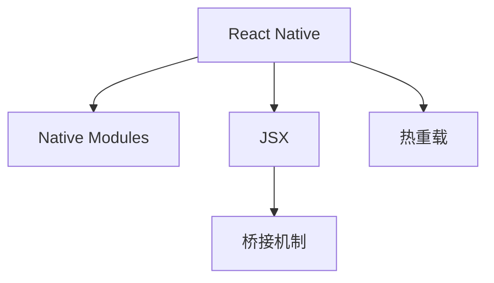

                 

# React Native：JavaScript驱动的原生移动应用开发

## 1. 背景介绍

### 1.1 问题由来
随着移动互联网的飞速发展，企业对移动应用的需求日益增长。传统的原生态移动应用开发方式（Native Development）不仅耗时长、成本高，而且不同平台（iOS和Android）间难以兼容，跨平台开发需求越来越强烈。为了解决这些问题，React Native作为一种新的移动开发框架应运而生，并迅速成为跨平台开发的首选方案。

### 1.2 问题核心关键点
React Native允许开发者使用JavaScript和React语法开发跨平台的移动应用，实现了组件复用、样式一致等优点。但同时，它也面临着性能、跨平台兼容性、框架复杂度等诸多挑战。本文将从核心概念、算法原理、项目实践和未来展望等方面，系统介绍React Native开发的原生移动应用。

## 2. 核心概念与联系

### 2.1 核心概念概述

为更好地理解React Native开发原生移动应用的方法，本节将介绍几个密切相关的核心概念：

- React Native：由Facebook开发的一套跨平台移动应用开发框架，允许开发者使用JavaScript和React语法，通过一套代码库实现跨iOS和Android平台的移动应用开发。
- Native Modules：React Native提供的桥接机制，允许JavaScript代码调用原生平台的API。
- JSX和式语法：类似于HTML的语法，用于描述UI组件和布局，同时具有JavaScript的动态特性。
- 桥接机制：React Native中的组件通信机制，通过JavaScript和原生模块的交互，实现组件间的通信。
- 热重载（Hot Reloading）：允许开发者在开发过程中即时查看开发结果的调试模式，减少了调试时间。

这些核心概念之间的逻辑关系可以通过以下Mermaid流程图来展示：



这个流程图展示的核心概念及其之间的关系：

1. React Native作为框架提供跨平台支持，包含了一系列组件和API。
2. Native Modules提供桥接机制，允许JavaScript与原生平台交互。
3. JSX和式语法用于描述UI组件和布局。
4. 桥接机制是React Native中的组件通信机制，实现组件间的通信。
5. 热重载提供即时更新开发结果的调试模式，提高开发效率。

这些核心概念共同构成了React Native的开发框架，使得开发者可以高效地构建跨平台移动应用。

## 3. 核心算法原理 & 具体操作步骤
### 3.1 算法原理概述

React Native的开发流程主要包括以下几个步骤：

1. 初始化项目：使用React Native CLI创建新项目。
2. 编写UI代码：使用JSX语法编写UI组件和布局。
3. 桥接模块调用：通过Native Modules桥接机制，调用原生平台的API。
4. 组件通信：通过桥接机制实现组件间的通信和数据传递。
5. 热重载调试：使用热重载功能，即时更新开发结果。

### 3.2 算法步骤详解

#### 3.2.1 初始化项目

React Native提供了一个命令行工具react-native CLI，用于创建和管理项目。

```bash
npx react-native init MyApp
```

上述命令会在当前目录下创建一个名为MyApp的新项目。项目结构如下：

```
MyApp
├── node_modules/
├── android/
├── ios/
├── node_modules/
├── app.json
├── index.js
├── jest
├── package.json
└── vendor/
```

其中，node_modules目录包含项目依赖库，android和ios目录分别包含Android和iOS平台的开发资源，app.json和index.js等文件包含项目配置和入口代码。

#### 3.2.2 编写UI代码

React Native提供了丰富的组件库，开发者可以通过JSX语法编写UI组件和布局。

```javascript
import React from 'react';
import { View, Text, StyleSheet } from 'react-native';

const MyComponent = () => (
  <View style={styles.container}>
    <Text style={styles.title}>Hello, React Native!</Text>
  </View>
);

const styles = StyleSheet.create({
  container: {
    flex: 1,
    justifyContent: 'center',
    alignItems: 'center',
  },
  title: {
    fontSize: 24,
    fontWeight: 'bold',
  },
});

export default MyComponent;
```

上述代码中，通过import语句导入View和Text组件，使用JSX语法定义MyComponent组件。View组件表示容器，Text组件用于显示文本。通过StyleSheet.create方法创建样式对象，用于组件的布局和样式设置。

#### 3.2.3 桥接模块调用

React Native通过Native Modules桥接机制，允许JavaScript调用原生平台的API。

```javascript
import { Platform, PermissionsAndroid, Platform } from 'react-native';

if (Platform.OS === 'android' && Platform.Version < 21) {
  PermissionsAndroid.request(PermissionsAndroid.PERMISSIONS.CAMERA, {
    title: 'Camera Permissions',
    message: 'Enable camera permissions',
    buttonNeutral: 'Ask Me Later',
    buttonPositive: 'OK',
    buttonNegative: 'Cancel',
  }).then(({ granted }) => {
    if (granted) {
      console.log('Camera permissions granted');
    } else {
      console.log('Camera permissions denied');
    }
  });
}
```

上述代码中，通过import语句导入Platform和PermissionsAndroid组件，通过Platform.OS判断当前平台为Android，并使用PermissionsAndroid.request方法请求相机权限。如果权限被授权，则输出Camera permissions granted，否则输出Camera permissions denied。

#### 3.2.4 组件通信

React Native通过桥接机制实现组件间的通信和数据传递。

```javascript
import React, { useState } from 'react';
import { View, Text, StyleSheet, Button } from 'react-native';

const MyComponent = () => {
  const [count, setCount] = useState(0);

  const increment = () => {
    setCount(count + 1);
  };

  return (
    <View style={styles.container}>
      <Text style={styles.title}>Count: {count}</Text>
      <Button title="Increment" onPress={increment} />
    </View>
  );
};

const styles = StyleSheet.create({
  container: {
    flex: 1,
    justifyContent: 'center',
    alignItems: 'center',
  },
  title: {
    fontSize: 24,
    fontWeight: 'bold',
  },
});

export default MyComponent;
```

上述代码中，通过useState钩子状态管理组件状态，使用Button组件触发事件，通过props传递数据。当点击按钮时，increment方法会更新组件状态，并重新渲染组件。

#### 3.2.5 热重载调试

React Native提供热重载功能，允许开发者在开发过程中即时查看开发结果。

```javascript
import React from 'react';
import { View, Text, StyleSheet } from 'react-native';

const MyComponent = () => {
  const [count, setCount] = useState(0);

  const increment = () => {
    setCount(count + 1);
  };

  return (
    <View style={styles.container}>
      <Text style={styles.title}>Count: {count}</Text>
      <Button title="Increment" onPress={increment} />
    </View>
  );
};

const styles = StyleSheet.create({
  container: {
    flex: 1,
    justifyContent: 'center',
    alignItems: 'center',
  },
  title: {
    fontSize: 24,
    fontWeight: 'bold',
  },
});

export default MyComponent;
```

上述代码中，通过import语句导入View和Text组件，使用JSX语法定义MyComponent组件。View组件表示容器，Text组件用于显示文本。通过useState钩子状态管理组件状态，使用Button组件触发事件，通过props传递数据。当点击按钮时，increment方法会更新组件状态，并重新渲染组件。

## 4. 数学模型和公式 & 详细讲解 & 举例说明

### 4.1 数学模型构建

在React Native开发原生移动应用的过程中，没有涉及到复杂的数学模型和公式。主要的开发过程是通过JavaScript和React语法实现UI组件和数据传递。

### 4.2 公式推导过程

由于React Native开发过程中没有涉及到复杂的数学模型和公式，因此不需要进行公式推导过程。

### 4.3 案例分析与讲解

#### 4.3.1 案例一：简单的UI组件

```javascript
import React from 'react';
import { View, Text, StyleSheet } from 'react-native';

const MyComponent = () => (
  <View style={styles.container}>
    <Text style={styles.title}>Hello, React Native!</Text>
  </View>
);

const styles = StyleSheet.create({
  container: {
    flex: 1,
    justifyContent: 'center',
    alignItems: 'center',
  },
  title: {
    fontSize: 24,
    fontWeight: 'bold',
  },
});

export default MyComponent;
```

上述代码中，通过import语句导入View和Text组件，使用JSX语法定义MyComponent组件。View组件表示容器，Text组件用于显示文本。通过StyleSheet.create方法创建样式对象，用于组件的布局和样式设置。

#### 4.3.2 案例二：桥接模块调用

```javascript
import { Platform, PermissionsAndroid, Platform } from 'react-native';

if (Platform.OS === 'android' && Platform.Version < 21) {
  PermissionsAndroid.request(PermissionsAndroid.PERMISSIONS.CAMERA, {
    title: 'Camera Permissions',
    message: 'Enable camera permissions',
    buttonNeutral: 'Ask Me Later',
    buttonPositive: 'OK',
    buttonNegative: 'Cancel',
  }).then(({ granted }) => {
    if (granted) {
      console.log('Camera permissions granted');
    } else {
      console.log('Camera permissions denied');
    }
  });
}
```

上述代码中，通过import语句导入Platform和PermissionsAndroid组件，通过Platform.OS判断当前平台为Android，并使用PermissionsAndroid.request方法请求相机权限。如果权限被授权，则输出Camera permissions granted，否则输出Camera permissions denied。

#### 4.3.3 案例三：组件通信

```javascript
import React, { useState } from 'react';
import { View, Text, StyleSheet, Button } from 'react-native';

const MyComponent = () => {
  const [count, setCount] = useState(0);

  const increment = () => {
    setCount(count + 1);
  };

  return (
    <View style={styles.container}>
      <Text style={styles.title}>Count: {count}</Text>
      <Button title="Increment" onPress={increment} />
    </View>
  );
};

const styles = StyleSheet.create({
  container: {
    flex: 1,
    justifyContent: 'center',
    alignItems: 'center',
  },
  title: {
    fontSize: 24,
    fontWeight: 'bold',
  },
});

export default MyComponent;
```

上述代码中，通过useState钩子状态管理组件状态，使用Button组件触发事件，通过props传递数据。当点击按钮时，increment方法会更新组件状态，并重新渲染组件。

## 5. 项目实践：代码实例和详细解释说明

### 5.1 开发环境搭建

在进行React Native项目开发前，需要安装一些开发工具和环境。以下是React Native项目开发的环境配置流程：

1. 安装Node.js：从官网下载安装Node.js并配置环境变量。
2. 安装React Native CLI：使用npm全局安装react-native-cli工具。
3. 安装Android Studio：从官网下载安装Android Studio，用于Android平台的开发和调试。
4. 安装Xcode：从官网下载安装Xcode，用于iOS平台的开发和调试。

### 5.2 源代码详细实现

下面我们以简单的计数器组件为例，给出React Native项目开发的完整代码实现。

首先，创建新项目：

```bash
npx react-native init MyApp
```

进入项目目录，编写UI组件：

```javascript
import React, { useState } from 'react';
import { View, Text, StyleSheet, Button } from 'react-native';

const MyComponent = () => {
  const [count, setCount] = useState(0);

  const increment = () => {
    setCount(count + 1);
  };

  return (
    <View style={styles.container}>
      <Text style={styles.title}>Count: {count}</Text>
      <Button title="Increment" onPress={increment} />
    </View>
  );
};

const styles = StyleSheet.create({
  container: {
    flex: 1,
    justifyContent: 'center',
    alignItems: 'center',
  },
  title: {
    fontSize: 24,
    fontWeight: 'bold',
  },
});

export default MyComponent;
```

然后，配置项目配置文件app.json，添加MyComponent组件：

```json
{
  "name": "MyApp",
  "version": "0.1.0",
  "description": "My React Native App",
  "dependencies": {
    "react": "^16.13.1",
    "react-native": "^0.62.2"
  },
  "scripts": {
    "android": "react-native run-android",
    "ios": "react-native run-ios"
  },
  "moduleName": "MyApp"
}
```

最后，运行项目，查看计数器效果：

```bash
npx react-native start
npx react-native android
```

运行结果：

```
--- React Native: Project - MyApp
ℹ️  Creating the project...
ℹ️  Your project has been created successfully. You can continue by running either of the following commands.
ℹ️  Note: Node.js requires that you use a compatible version of Node.js.
ℹ️  To get started with the template, see: https://reactnative.dev/docs/getting-started

  ℹ️  For the React Native 0.62.x version, use the command:

  npx react-native start

  ℹ️  To launch an Android app, use the command:

  npx react-native android

  ℹ️  To launch an iOS app, use the command:

  npx react-native ios

  ℹ️  For more details on how to deploy your project and more, see:

  https://reactnative.dev/docs/getting-started
```

以上是React Native项目开发的完整代码实现。可以看到，React Native提供了丰富的组件和API，使得开发者可以高效地构建原生移动应用。

### 5.3 代码解读与分析

React Native开发原生移动应用主要涉及以下方面：

1. 安装开发工具：需要安装Node.js、react-native-cli、Android Studio、Xcode等工具。
2. 创建项目：使用react-native CLI创建新项目，包含项目目录和配置文件。
3. 编写UI组件：使用JSX语法编写UI组件和布局。
4. 桥接模块调用：通过Native Modules桥接机制，调用原生平台的API。
5. 组件通信：通过桥接机制实现组件间的通信和数据传递。
6. 热重载调试：使用热重载功能，即时更新开发结果。

React Native通过桥接机制实现了JavaScript与原生平台的交互，使得开发者可以高效地构建跨平台移动应用。同时，React Native提供了丰富的组件和API，使得开发者可以方便地实现各种UI效果和功能。

## 6. 实际应用场景

### 6.1 智能交互应用

React Native可以用于开发智能交互应用，如智能客服、智能家居等。通过桥接机制，React Native可以访问原生平台的API，实现各种智能功能，提升用户体验。

例如，智能客服应用可以通过React Native实现多轮对话和自然语言处理，使用桥接机制访问原生平台的音频和摄像头API，实现语音识别和视频通话。

### 6.2 实时数据应用

React Native可以用于开发实时数据应用，如实时新闻、股票行情等。通过桥接机制，React Native可以访问原生平台的API，实现实时数据更新和渲染。

例如，实时新闻应用可以通过React Native实现多轮对话和自然语言处理，使用桥接机制访问原生平台的WebSocket API，实现实时新闻更新和推送。

### 6.3 离线应用

React Native可以用于开发离线应用，如离线导航、离线阅读等。通过桥接机制，React Native可以实现离线数据存储和访问。

例如，离线导航应用可以通过React Native实现多轮对话和自然语言处理，使用桥接机制访问原生平台的SQLite API，实现离线数据存储和访问。

### 6.4 未来应用展望

随着React Native的不断发展和完善，未来React Native在原生移动应用开发中的地位将更加稳固。React Native将支持更多原生平台的API，提供更丰富的组件和API，提升开发效率和应用性能。

未来React Native将有以下发展趋势：

1. 跨平台性能优化：React Native将不断优化跨平台性能，提升应用的流畅度和响应速度。
2. 社区和生态建设：React Native将加强社区和生态建设，提供更多的第三方库和组件，丰富开发者的工具链。
3. 新平台支持：React Native将支持更多原生平台，如Windows、Web等，拓展应用场景。
4. 新特性引入：React Native将引入更多新特性，如AR、VR、手势识别等，提升应用的多样性和趣味性。
5. 开源和开放：React Native将更加开源和开放，鼓励开发者和社区贡献代码和资源。

总之，React Native作为跨平台移动应用开发的重要工具，将不断发展和完善，提升开发效率和应用性能，拓展应用场景，成为未来原生移动应用开发的主流技术。

## 7. 工具和资源推荐

### 7.1 学习资源推荐

为了帮助开发者系统掌握React Native开发原生移动应用的理论基础和实践技巧，这里推荐一些优质的学习资源：

1. React Native官方文档：React Native官方文档提供了详细的API和开发指南，是学习React Native的必备资源。
2. React Native实战教程：React Native实战教程提供了丰富的开发案例和实战经验，帮助开发者快速上手。
3. React Native高级教程：React Native高级教程提供了深入的技术细节和实现原理，适合进阶学习。
4. React Native社区：React Native社区提供了丰富的技术讨论和资源分享，是开发者学习和交流的平台。
5. React Native插件库：React Native插件库提供了丰富的第三方库和组件，帮助开发者快速实现各种功能。

通过对这些资源的学习实践，相信你一定能够快速掌握React Native的精髓，并用于解决实际的开发问题。

### 7.2 开发工具推荐

为了提高React Native开发的原生移动应用性能和用户体验，以下是一些常用的开发工具：

1. Android Studio：Android Studio是Android平台的开发和调试工具，提供了丰富的开发和调试功能。
2. Xcode：Xcode是iOS平台的开发和调试工具，提供了丰富的开发和调试功能。
3. React Native CLI：React Native CLI是React Native项目的初始化和管理工具，提供了丰富的命令和选项。
4. React Native调试工具：React Native调试工具提供了丰富的开发和调试功能，帮助开发者及时发现和解决开发问题。
5. React Native热重载：React Native热重载提供了即时更新开发结果的调试模式，提高开发效率。

合理利用这些工具，可以显著提升React Native开发的原生移动应用性能和用户体验。

### 7.3 相关论文推荐

React Native作为跨平台移动应用开发的重要技术，已经得到了广泛的关注和研究。以下是几篇奠基性的相关论文，推荐阅读：

1. React Native: A View Framework for Building Native Mobile Applications on React：React Native的官方论文，介绍了React Native的基本原理和设计思路。
2. Building Native Apps with React Native：由React Native开发者撰写，介绍了React Native的开发流程和实战经验。
3. React Native for iOS and Android Development: A Tutorial and Introduction：由React Native开发者撰写，介绍了React Native的开发流程和实战经验。
4. React Native Performance Optimization：介绍了React Native的性能优化策略和技术手段，帮助开发者提升应用性能。
5. React Native Architecture and Patterns：介绍了React Native的应用架构和设计模式，帮助开发者提升应用设计水平。

这些论文代表了大语言模型微调技术的发展脉络。通过学习这些前沿成果，可以帮助研究者把握学科前进方向，激发更多的创新灵感。

## 8. 总结：未来发展趋势与挑战

### 8.1 研究成果总结

本文对React Native开发原生移动应用的方法进行了全面系统的介绍。首先阐述了React Native作为跨平台移动应用开发框架的优势，明确了React Native在开发过程中的核心概念和关键步骤。其次，从原理到实践，详细讲解了React Native开发原生移动应用的过程，包括初始化项目、编写UI代码、桥接模块调用、组件通信和热重载调试。同时，本文还探讨了React Native在实际应用场景中的应用，展示了React Native开发原生移动应用的广泛前景。最后，本文推荐了一些React Native开发过程中常用的学习资源和开发工具，以及相关论文，为开发者提供了全面的技术指引。

通过本文的系统梳理，可以看到，React Native作为跨平台移动应用开发的重要工具，提供了丰富的组件和API，使得开发者可以高效地构建原生移动应用。同时，React Native通过桥接机制实现了JavaScript与原生平台的交互，提升了开发效率和应用性能。未来React Native将不断发展和完善，成为原生移动应用开发的主流技术，为开发者提供更加丰富和高效的工具和资源。

### 8.2 未来发展趋势

展望未来，React Native将呈现以下几个发展趋势：

1. 跨平台性能优化：React Native将不断优化跨平台性能，提升应用的流畅度和响应速度。
2. 社区和生态建设：React Native将加强社区和生态建设，提供更多的第三方库和组件，丰富开发者的工具链。
3. 新平台支持：React Native将支持更多原生平台，如Windows、Web等，拓展应用场景。
4. 新特性引入：React Native将引入更多新特性，如AR、VR、手势识别等，提升应用的多样性和趣味性。
5. 开源和开放：React Native将更加开源和开放，鼓励开发者和社区贡献代码和资源。

总之，React Native作为跨平台移动应用开发的重要工具，将不断发展和完善，提升开发效率和应用性能，拓展应用场景，成为未来原生移动应用开发的主流技术。

### 8.3 面临的挑战

尽管React Native在原生移动应用开发中表现出色，但在迈向更加智能化、普适化应用的过程中，它仍面临着诸多挑战：

1. 性能瓶颈：React Native应用在处理复杂动画和数据渲染时，性能仍有提升空间。如何提升应用性能，减少卡顿现象，是开发者需要解决的问题。
2. 组件复用问题：React Native组件复用问题较为复杂，跨平台组件复用的效果和性能难以保证。如何设计更好的组件复用方案，是开发者需要解决的问题。
3. 原生模块调用问题：React Native原生模块调用效率较低，跨平台兼容性较差。如何提高原生模块调用的效率和兼容性，是开发者需要解决的问题。
4. 开发调试问题：React Native开发调试工具不足，跨平台调试复杂。如何提高开发调试效率，减少调试时间，是开发者需要解决的问题。
5. 社区和生态问题：React Native社区和生态尚需进一步发展和完善，第三方库和组件的质量和稳定性有待提高。如何加强社区和生态建设，是开发者需要解决的问题。

正视React Native面临的这些挑战，积极应对并寻求突破，将使React Native成为原生移动应用开发的主流技术，实现更多的应用场景和功能。

### 8.4 研究展望

面对React Native面临的种种挑战，未来的研究需要在以下几个方面寻求新的突破：

1. 优化跨平台性能：通过优化桥接机制和组件渲染，提升React Native应用的流畅度和响应速度。
2. 提升组件复用效果：设计更好的组件复用方案，提升跨平台组件复用的效果和性能。
3. 改进原生模块调用：提高原生模块调用的效率和兼容性，提升React Native应用的性能和稳定性。
4. 增强开发调试功能：完善React Native开发调试工具，提升跨平台调试的效率和便利性。
5. 加强社区和生态建设：加强社区和生态建设，提高第三方库和组件的质量和稳定性。

这些研究方向的探索，必将引领React Native开发原生移动应用技术迈向更高的台阶，为开发者提供更加丰富和高效的工具和资源。总之，React Native作为跨平台移动应用开发的重要工具，将不断发展和完善，成为未来原生移动应用开发的主流技术。

## 9. 附录：常见问题与解答

**Q1：React Native性能如何？**

A: React Native在性能方面存在一定的瓶颈，特别是在处理复杂动画和数据渲染时，容易出现卡顿现象。为了提升性能，可以使用原生模块、优化的渲染引擎和布局引擎等手段。

**Q2：React Native跨平台组件复用效果如何？**

A: React Native跨平台组件复用的效果和性能需要仔细设计，不同的组件需要在不同平台进行适配和优化。可以使用一些工具和库，如React Native Elements、Shoutem UI等，提升跨平台组件复用的效果和性能。

**Q3：React Native原生模块调用效率如何？**

A: React Native原生模块调用的效率较低，特别是在跨平台调用时，性能存在一定的瓶颈。为了提高原生模块调用的效率，可以使用一些优化手段，如原生模块预编译、使用bridge字段进行性能优化等。

**Q4：React Native开发调试效率如何？**

A: React Native开发调试效率较低，特别是跨平台调试较为复杂。为了提高开发调试效率，可以使用一些工具和手段，如React Native Debugger、Chrome DevTools等，提升开发调试效率。

**Q5：React Native社区和生态如何？**

A: React Native社区和生态尚需进一步发展和完善，第三方库和组件的质量和稳定性有待提高。为了加强社区和生态建设，可以积极参与社区活动，贡献代码和资源，提升社区的活跃度和质量。

---

作者：禅与计算机程序设计艺术 / Zen and the Art of Computer Programming

