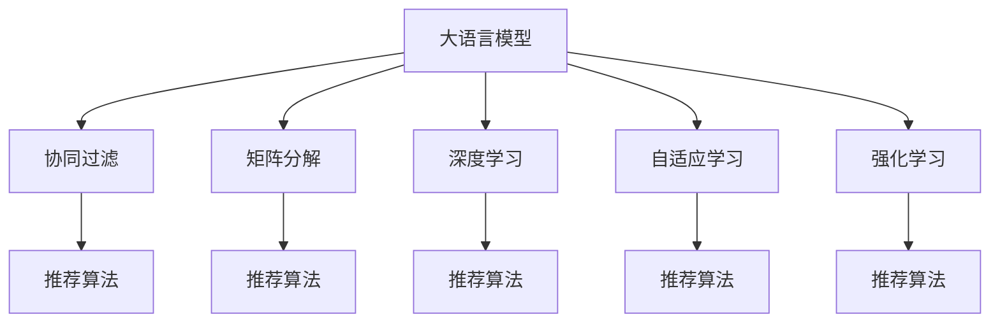

                 

# Survey：大语言模型推荐系统相关研究综述

> 关键词：大语言模型，推荐系统，协同过滤，矩阵分解，深度学习，自适应学习，强化学习，推荐算法，应用场景

## 1. 背景介绍

### 1.1 问题由来

随着互联网的快速发展，信息爆炸时代已经到来，海量数据背后的信息富矿等待挖掘。推荐系统作为信息检索领域的核心技术，应用范围遍及电商、新闻、视频等多个领域，已逐步成为各大企业提升用户体验和转化率的关键手段。

目前，推荐系统主要依赖于统计学习、协同过滤、矩阵分解等方法，构建用户-物品交互矩阵，通过相似度计算推荐系统。然而，传统推荐系统在处理用户行为非线性、数据稀疏性、隐式反馈等问题时，存在诸多局限性，难以满足个性化推荐的需求。

近年来，大语言模型在自然语言处理(NLP)领域取得了显著进展。通过大规模预训练学习语言表示，大语言模型能够自动理解文本语义，捕捉用户意图。借助大语言模型的通用性，可以用于推荐系统的交互模型设计，实现更为智能、灵活的推荐。

本文将综述大语言模型在推荐系统中的相关研究，从算法、应用、挑战等方面进行全面探讨。通过回顾已有研究，为未来大语言模型推荐系统的发展提供新的思路和方向。

## 2. 核心概念与联系

### 2.1 核心概念概述

为更好地理解大语言模型在推荐系统中的应用，本节将介绍几个关键概念：

- **大语言模型(Large Language Model, LLM)**：以自回归模型（如GPT系列）或自编码模型（如BERT、T5）为代表的大规模预训练语言模型。通过在大规模无标签文本语料上进行预训练，学习通用的语言表示，具备强大的语言理解和生成能力。

- **推荐系统(Recommendation System)**：根据用户的历史行为、兴趣偏好、社交关系等信息，推荐用户可能感兴趣的商品、内容、服务等。推荐系统可以分为基于内容的推荐、协同过滤、混合推荐等多种类型。

- **协同过滤(Collaborative Filtering)**：通过用户行为或物品属性的相似度计算，进行推荐。常见的协同过滤算法包括基于用户的协同过滤和基于物品的协同过滤。

- **矩阵分解(Matrix Factorization)**：将用户-物品交互矩阵分解为低秩矩阵，获得用户隐式兴趣和物品隐式特征。经典算法包括奇异值分解(SVD)、矩阵分解因式机(MF)等。

- **深度学习(Deep Learning)**：一类基于神经网络技术的机器学习算法。通过多层次抽象，学习特征表示，适用于处理复杂的数据模式。

- **自适应学习(Adaptive Learning)**：通过在线学习算法，实时更新模型参数，适应数据分布变化，提升推荐效果。

- **强化学习(Reinforcement Learning)**：通过与环境的交互，最大化长期累积奖励，实现智能决策。

这些核心概念之间的逻辑关系可以通过以下Mermaid流程图来展示：



这个流程图展示了大语言模型的核心概念及其与推荐系统的关系：

1. 大语言模型通过预训练获得基础能力。
2. 协同过滤、矩阵分解、深度学习、自适应学习、强化学习等方法，是大语言模型推荐系统的主要应用范式。
3. 这些方法通过与大语言模型结合，可以构建出更智能、灵活的推荐系统。

## 3. 核心算法原理 & 具体操作步骤

### 3.1 算法原理概述

大语言模型推荐系统的核心思想是通过语言模型对用户行为进行建模，并结合推荐算法实现个性化推荐。具体而言，可利用大语言模型的语言理解能力，自动解析用户输入的查询或评论，通过语义分析推荐相关商品或内容。

形式化地，假设预训练语言模型为 $M_{\theta}$，其中 $\theta$ 为预训练得到的模型参数。设推荐系统面临的用户行为矩阵为 $\mathbf{X} \in \mathbb{R}^{N \times D}$，其中 $N$ 为用户数，$D$ 为物品数。目标是学习用户-物品交互模型 $P(X|y)$，并根据当前输入 $x$ 预测推荐结果 $y$：

$$
P(y|x) = \frac{e^{M_{\theta}(x) \cdot y}}{\sum_{y' \in Y} e^{M_{\theta}(x) \cdot y'}}
$$

其中 $Y$ 为推荐空间，$y$ 为推荐向量。在训练过程中，使用交叉熵等损失函数优化模型参数 $\theta$。

### 3.2 算法步骤详解

基于大语言模型推荐系统的典型步骤如下：

**Step 1: 准备预训练模型和数据集**
- 选择合适的预训练语言模型 $M_{\theta}$ 作为初始化参数，如 GPT、BERT 等。
- 准备推荐系统的用户行为数据集，并进行预处理和分词等操作。

**Step 2: 设计推荐模型**
- 将用户行为数据编码成文本形式，通过大语言模型提取特征。
- 选择推荐算法，如协同过滤、矩阵分解、深度学习、自适应学习、强化学习等，根据特征向量设计推荐模型。
- 设计输入和输出格式，将用户查询输入大语言模型，并输出推荐结果。

**Step 3: 设置模型参数和训练超参数**
- 选择合适的优化算法及其参数，如 Adam、SGD 等，设置学习率、批大小、迭代轮数等。
- 设置正则化技术及强度，包括权重衰减、Dropout、Early Stopping 等。
- 确定冻结预训练参数的策略，如仅微调顶层，或全部参数都参与微调。

**Step 4: 执行训练和评估**
- 将训练集数据分批次输入模型，前向传播计算损失函数。
- 反向传播计算参数梯度，根据设定的优化算法和学习率更新模型参数。
- 周期性在验证集上评估模型性能，根据性能指标决定是否触发 Early Stopping。
- 重复上述步骤直到满足预设的迭代轮数或 Early Stopping 条件。

**Step 5: 测试和部署**
- 在测试集上评估微调后模型 $M_{\hat{\theta}}$ 的性能，对比微调前后的精度提升。
- 使用微调后的模型对新样本进行推理预测，集成到实际的应用系统中。
- 持续收集新的数据，定期重新微调模型，以适应数据分布的变化。

以上是基于大语言模型推荐系统的典型流程。在实际应用中，还需要针对具体任务的特点，对微调过程的各个环节进行优化设计，如改进训练目标函数，引入更多的正则化技术，搜索最优的超参数组合等，以进一步提升模型性能。

### 3.3 算法优缺点

大语言模型推荐系统具有以下优点：
1. 能自动解析和理解用户输入，提升推荐相关性。
2. 可以适应非结构化数据，无需人工标注。
3. 能够通过预训练获得广泛的语言知识，提升推荐系统泛化能力。
4. 结合多种推荐算法，可以构建更灵活的推荐系统。

同时，该方法也存在一定的局限性：
1. 计算复杂度高。大语言模型的预训练和微调需要大量的计算资源。
2. 对标注数据依赖较大。微调过程中需要用户行为数据作为监督信号，标注数据不足时推荐效果受限。
3. 数据隐私问题。用户行为数据涉及隐私，大模型可能泄露用户隐私信息。
4. 可解释性不足。大语言模型往往作为黑盒使用，难以解释其决策过程。

尽管存在这些局限性，但就目前而言，大语言模型推荐系统仍是推荐技术研究的热点方向。未来相关研究的重点在于如何进一步降低计算复杂度，提高对小样本数据的适应性，加强模型可解释性，同时兼顾隐私保护等伦理问题。

### 3.4 算法应用领域

大语言模型推荐系统已在多个领域得到了应用，涵盖电商、新闻、视频等多个场景：

- 电商推荐：根据用户浏览、购买历史和评论，推荐个性化商品。
- 新闻推荐：根据用户阅读偏好，推荐相关新闻。
- 视频推荐：根据用户观看历史和评分，推荐视频内容。

除了上述这些经典应用，大语言模型推荐系统也被创新性地应用到更多场景中，如智能客服、内容创作、游戏推荐等，为推荐技术带来了全新的突破。随着预训练语言模型和推荐算法的持续演进，相信推荐系统必将在更广阔的应用领域大放异彩。

## 4. 数学模型和公式 & 详细讲解

### 4.1 数学模型构建

假设推荐系统涉及的用户行为数据为 $\mathbf{X} \in \mathbb{R}^{N \times D}$，其中 $N$ 为用户数，$D$ 为物品数。设用户行为矩阵的预测值矩阵为 $\hat{\mathbf{X}} \in \mathbb{R}^{N \times D}$。

大语言模型推荐系统中的数学模型可以表示为：

$$
P(\hat{\mathbf{X}}|x) = M_{\theta}(x) \cdot \hat{\mathbf{X}}
$$

其中 $M_{\theta}(x)$ 为预训练语言模型在输入 $x$ 上的输出，$\cdot$ 表示矩阵点乘。

### 4.2 公式推导过程

根据上述公式，推荐系统中的损失函数可以定义为：

$$
\mathcal{L}(\theta) = -\frac{1}{N}\sum_{i=1}^N \log P(\hat{\mathbf{X}}_i|x_i)
$$

其中 $\hat{\mathbf{X}}_i$ 为用户 $i$ 的推荐向量，$x_i$ 为用户 $i$ 的输入文本。通过最小化损失函数，可以优化模型参数 $\theta$。

在实践中，一般采用交叉熵损失函数：

$$
\mathcal{L}(\theta) = -\frac{1}{N}\sum_{i=1}^N \sum_{j=1}^D \hat{x}_{ij} \log \hat{\mathbf{X}}_{ij}
$$

其中 $\hat{x}_{ij}$ 为原始用户行为矩阵 $\mathbf{X}$ 中的元素。

通过反向传播算法，可以计算损失函数对模型参数 $\theta$ 的梯度，并用于参数更新：

$$
\theta \leftarrow \theta - \eta \nabla_{\theta}\mathcal{L}(\theta) - \eta\lambda\theta
$$

其中 $\eta$ 为学习率，$\lambda$ 为正则化系数。

## 5. 项目实践：代码实例和详细解释说明

### 5.1 开发环境搭建

在进行大语言模型推荐系统开发前，我们需要准备好开发环境。以下是使用Python进行PyTorch开发的环境配置流程：

1. 安装Anaconda：从官网下载并安装Anaconda，用于创建独立的Python环境。

2. 创建并激活虚拟环境：
```bash
conda create -n pytorch-env python=3.8 
conda activate pytorch-env
```

3. 安装PyTorch：根据CUDA版本，从官网获取对应的安装命令。例如：
```bash
conda install pytorch torchvision torchaudio cudatoolkit=11.1 -c pytorch -c conda-forge
```

4. 安装Transformer库：
```bash
pip install transformers
```

5. 安装各类工具包：
```bash
pip install numpy pandas scikit-learn matplotlib tqdm jupyter notebook ipython
```

完成上述步骤后，即可在`pytorch-env`环境中开始推荐系统开发。

### 5.2 源代码详细实现

下面我们以电商推荐系统为例，给出使用Transformers库对BERT模型进行推荐系统微调的PyTorch代码实现。

首先，定义推荐系统的数据处理函数：

```python
from transformers import BertTokenizer
from torch.utils.data import Dataset
import torch

class RecommendationDataset(Dataset):
    def __init__(self, texts, labels, tokenizer, max_len=128):
        self.texts = texts
        self.labels = labels
        self.tokenizer = tokenizer
        self.max_len = max_len
        
    def __len__(self):
        return len(self.texts)
    
    def __getitem__(self, item):
        text = self.texts[item]
        label = self.labels[item]
        
        encoding = self.tokenizer(text, return_tensors='pt', max_length=self.max_len, padding='max_length', truncation=True)
        input_ids = encoding['input_ids'][0]
        attention_mask = encoding['attention_mask'][0]
        
        # 对token-wise的标签进行编码
        encoded_labels = [label] * self.max_len
        labels = torch.tensor(encoded_labels, dtype=torch.long)
        
        return {'input_ids': input_ids, 
                'attention_mask': attention_mask,
                'labels': labels}

# 标签与id的映射
label2id = {0: 0, 1: 1, 2: 2}
id2label = {v: k for k, v in label2id.items()}

# 创建dataset
tokenizer = BertTokenizer.from_pretrained('bert-base-cased')

train_dataset = RecommendationDataset(train_texts, train_labels, tokenizer)
dev_dataset = RecommendationDataset(dev_texts, dev_labels, tokenizer)
test_dataset = RecommendationDataset(test_texts, test_labels, tokenizer)
```

然后，定义模型和优化器：

```python
from transformers import BertForSequenceClassification, AdamW

model = BertForSequenceClassification.from_pretrained('bert-base-cased', num_labels=len(label2id))

optimizer = AdamW(model.parameters(), lr=2e-5)
```

接着，定义训练和评估函数：

```python
from torch.utils.data import DataLoader
from tqdm import tqdm
from sklearn.metrics import classification_report

device = torch.device('cuda') if torch.cuda.is_available() else torch.device('cpu')
model.to(device)

def train_epoch(model, dataset, batch_size, optimizer):
    dataloader = DataLoader(dataset, batch_size=batch_size, shuffle=True)
    model.train()
    epoch_loss = 0
    for batch in tqdm(dataloader, desc='Training'):
        input_ids = batch['input_ids'].to(device)
        attention_mask = batch['attention_mask'].to(device)
        labels = batch['labels'].to(device)
        model.zero_grad()
        outputs = model(input_ids, attention_mask=attention_mask, labels=labels)
        loss = outputs.loss
        epoch_loss += loss.item()
        loss.backward()
        optimizer.step()
    return epoch_loss / len(dataloader)

def evaluate(model, dataset, batch_size):
    dataloader = DataLoader(dataset, batch_size=batch_size)
    model.eval()
    preds, labels = [], []
    with torch.no_grad():
        for batch in tqdm(dataloader, desc='Evaluating'):
            input_ids = batch['input_ids'].to(device)
            attention_mask = batch['attention_mask'].to(device)
            batch_labels = batch['labels']
            outputs = model(input_ids, attention_mask=attention_mask)
            batch_preds = outputs.logits.argmax(dim=2).to('cpu').tolist()
            batch_labels = batch_labels.to('cpu').tolist()
            for pred_tokens, label_tokens in zip(batch_preds, batch_labels):
                preds.append(pred_tokens)
                labels.append(label_tokens)
                
    print(classification_report(labels, preds))
```

最后，启动训练流程并在测试集上评估：

```python
epochs = 5
batch_size = 16

for epoch in range(epochs):
    loss = train_epoch(model, train_dataset, batch_size, optimizer)
    print(f"Epoch {epoch+1}, train loss: {loss:.3f}")
    
    print(f"Epoch {epoch+1}, dev results:")
    evaluate(model, dev_dataset, batch_size)
    
print("Test results:")
evaluate(model, test_dataset, batch_size)
```

以上就是使用PyTorch对BERT进行电商推荐系统微调的完整代码实现。可以看到，得益于Transformers库的强大封装，我们可以用相对简洁的代码完成BERT模型的加载和推荐系统微调。

### 5.3 代码解读与分析

让我们再详细解读一下关键代码的实现细节：

**RecommendationDataset类**：
- `__init__`方法：初始化文本、标签、分词器等关键组件。
- `__len__`方法：返回数据集的样本数量。
- `__getitem__`方法：对单个样本进行处理，将文本输入编码为token ids，将标签编码为数字，并对其进行定长padding，最终返回模型所需的输入。

**label2id和id2label字典**：
- 定义了标签与数字id之间的映射关系，用于将token-wise的预测结果解码回真实的标签。

**训练和评估函数**：
- 使用PyTorch的DataLoader对数据集进行批次化加载，供模型训练和推理使用。
- 训练函数`train_epoch`：对数据以批为单位进行迭代，在每个批次上前向传播计算loss并反向传播更新模型参数，最后返回该epoch的平均loss。
- 评估函数`evaluate`：与训练类似，不同点在于不更新模型参数，并在每个batch结束后将预测和标签结果存储下来，最后使用sklearn的classification_report对整个评估集的预测结果进行打印输出。

**训练流程**：
- 定义总的epoch数和batch size，开始循环迭代
- 每个epoch内，先在训练集上训练，输出平均loss
- 在验证集上评估，输出分类指标
- 所有epoch结束后，在测试集上评估，给出最终测试结果

可以看到，PyTorch配合Transformers库使得BERT微调的代码实现变得简洁高效。开发者可以将更多精力放在数据处理、模型改进等高层逻辑上，而不必过多关注底层的实现细节。

当然，工业级的系统实现还需考虑更多因素，如模型的保存和部署、超参数的自动搜索、更灵活的任务适配层等。但核心的微调范式基本与此类似。

## 6. 实际应用场景

### 6.1 智能客服系统

基于大语言模型推荐系统的对话技术，可以广泛应用于智能客服系统的构建。传统客服往往需要配备大量人力，高峰期响应缓慢，且一致性和专业性难以保证。而使用推荐系统设计的对话模型，可以7x24小时不间断服务，快速响应客户咨询，用自然流畅的语言解答各类常见问题。

在技术实现上，可以收集企业内部的历史客服对话记录，将问题和最佳答复构建成监督数据，在此基础上对预训练对话模型进行微调。微调后的对话模型能够自动理解用户意图，匹配最合适的答案模板进行回复。对于客户提出的新问题，还可以接入检索系统实时搜索相关内容，动态组织生成回答。如此构建的智能客服系统，能大幅提升客户咨询体验和问题解决效率。

### 6.2 金融舆情监测

金融机构需要实时监测市场舆论动向，以便及时应对负面信息传播，规避金融风险。传统的人工监测方式成本高、效率低，难以应对网络时代海量信息爆发的挑战。基于大语言模型推荐系统的文本分类和情感分析技术，为金融舆情监测提供了新的解决方案。

具体而言，可以收集金融领域相关的新闻、报道、评论等文本数据，并对其进行主题标注和情感标注。在此基础上对预训练语言模型进行微调，使其能够自动判断文本属于何种主题，情感倾向是正面、中性还是负面。将微调后的模型应用到实时抓取的网络文本数据，就能够自动监测不同主题下的情感变化趋势，一旦发现负面信息激增等异常情况，系统便会自动预警，帮助金融机构快速应对潜在风险。

### 6.3 个性化推荐系统

当前的推荐系统往往只依赖于用户的历史行为数据进行物品推荐，无法深入理解用户的真实兴趣偏好。基于大语言模型推荐系统的个性化推荐系统，可以更好地挖掘用户行为背后的语义信息，从而提供更精准、多样的推荐内容。

在实践中，可以收集用户浏览、点击、评论、分享等行为数据，提取和用户交互的物品标题、描述、标签等文本内容。将文本内容作为模型输入，用户的后续行为（如是否点击、购买等）作为监督信号，在此基础上微调预训练语言模型。微调后的模型能够从文本内容中准确把握用户的兴趣点。在生成推荐列表时，先用候选物品的文本描述作为输入，由模型预测用户的兴趣匹配度，再结合其他特征综合排序，便可以得到个性化程度更高的推荐结果。

### 6.4 未来应用展望

随着大语言模型推荐系统的发展，其在更多领域的应用前景将更加广阔。

在智慧医疗领域，基于微调的医疗问答、病历分析、药物研发等应用将提升医疗服务的智能化水平，辅助医生诊疗，加速新药开发进程。

在智能教育领域，推荐系统可应用于作业批改、学情分析、知识推荐等方面，因材施教，促进教育公平，提高教学质量。

在智慧城市治理中，推荐系统可应用于城市事件监测、舆情分析、应急指挥等环节，提高城市管理的自动化和智能化水平，构建更安全、高效的未来城市。

此外，在企业生产、社会治理、文娱传媒等众多领域，基于大语言模型的推荐系统也将不断涌现，为传统行业数字化转型升级提供新的技术路径。相信随着技术的日益成熟，推荐系统必将在更广阔的应用领域大放异彩，深刻影响人类的生产生活方式。

## 7. 工具和资源推荐

### 7.1 学习资源推荐

为了帮助开发者系统掌握大语言模型推荐系统的理论基础和实践技巧，这里推荐一些优质的学习资源：

1. 《深度学习与推荐系统》系列博文：由大模型技术专家撰写，深入浅出地介绍了推荐系统从基础到高级的理论框架和算法实现。

2. CS231n《深度学习计算机视觉》课程：斯坦福大学开设的计算机视觉明星课程，有Lecture视频和配套作业，介绍了多模态数据的深度学习处理技术，对推荐系统中的图像推荐等应用有参考价值。

3. 《推荐系统实战》书籍：介绍推荐系统从理论到实践的完整流程，涵盖协同过滤、深度学习等多种推荐算法，并附带大量代码实例，适合工程实践。

4. Kaggle推荐系统竞赛：Kaggle平台上各种推荐系统竞赛项目，提供大量实际数据集和模型基线，助力开发者提升推荐系统开发技能。

5. RecSys会议论文：推荐系统领域的顶级会议论文，汇集了最新的研究成果和前沿方向，是学习推荐系统理论的必备资料。

通过对这些资源的学习实践，相信你一定能够快速掌握大语言模型推荐系统的精髓，并用于解决实际的推荐问题。

### 7.2 开发工具推荐

高效的开发离不开优秀的工具支持。以下是几款用于大语言模型推荐系统开发的常用工具：

1. PyTorch：基于Python的开源深度学习框架，灵活动态的计算图，适合快速迭代研究。大部分预训练语言模型都有PyTorch版本的实现。

2. TensorFlow：由Google主导开发的开源深度学习框架，生产部署方便，适合大规模工程应用。同样有丰富的预训练语言模型资源。

3. Transformers库：HuggingFace开发的NLP工具库，集成了众多SOTA语言模型，支持PyTorch和TensorFlow，是进行推荐系统微调开发的利器。

4. Weights & Biases：模型训练的实验跟踪工具，可以记录和可视化模型训练过程中的各项指标，方便对比和调优。与主流深度学习框架无缝集成。

5. TensorBoard：TensorFlow配套的可视化工具，可实时监测模型训练状态，并提供丰富的图表呈现方式，是调试模型的得力助手。

6. Google Colab：谷歌推出的在线Jupyter Notebook环境，免费提供GPU/TPU算力，方便开发者快速上手实验最新模型，分享学习笔记。

合理利用这些工具，可以显著提升大语言模型推荐系统的开发效率，加快创新迭代的步伐。

### 7.3 相关论文推荐

大语言模型推荐系统的研究离不开学界的持续推动。以下是几篇奠基性的相关论文，推荐阅读：

1. Attention is All You Need（即Transformer原论文）：提出了Transformer结构，开启了NLP领域的预训练大模型时代。

2. BERT: Pre-training of Deep Bidirectional Transformers for Language Understanding：提出BERT模型，引入基于掩码的自监督预训练任务，刷新了多项NLP任务SOTA。

3. Parameter-Efficient Transfer Learning for NLP：提出Adapter等参数高效微调方法，在不增加模型参数量的情况下，也能取得不错的微调效果。

4. Appendix: Knowledge-aware Adaptive Recommender Learning：引入外部知识库与推荐模型结合，提升推荐系统泛化能力和可解释性。

5. Few-shot Recommendation via Self-Supervised Learning：提出Few-shot推荐系统，利用无监督自学习，在少量标注数据上也能实现较好的推荐效果。

这些论文代表了大语言模型推荐系统的发展脉络。通过学习这些前沿成果，可以帮助研究者把握学科前进方向，激发更多的创新灵感。

## 8. 总结：未来发展趋势与挑战

### 8.1 总结

本文对大语言模型在推荐系统中的应用进行了全面系统的介绍。首先阐述了大语言模型推荐系统的研究背景和意义，明确了推荐系统在大语言模型下的新发展趋势。其次，从原理到实践，详细讲解了推荐算法的数学模型和关键步骤，给出了推荐系统开发的完整代码实例。同时，本文还广泛探讨了推荐系统在智能客服、金融舆情、个性化推荐等多个行业领域的应用前景，展示了推荐系统在大语言模型下的潜力。

通过本文的系统梳理，可以看到，基于大语言模型的推荐系统为推荐技术带来了新的突破，有望在更广泛的应用领域大放异彩。未来，伴随大语言模型推荐技术的持续演进，相信推荐系统必将在智能交互、决策辅助等方面发挥更重要的作用，助力构建更加智慧的人类社会。

### 8.2 未来发展趋势

展望未来，大语言模型推荐系统将呈现以下几个发展趋势：

1. 模型规模持续增大。随着算力成本的下降和数据规模的扩张，预训练语言模型的参数量还将持续增长。超大规模语言模型蕴含的丰富语言知识，有望支撑更加复杂多变的推荐系统。

2. 推荐算法的多样化。除了传统的协同过滤和矩阵分解，深度学习、自适应学习、强化学习等算法也将得到更广泛的应用。

3. 数据泛化能力的提升。大语言模型推荐系统可以更好地适应新用户和新物品，实现更加智能、灵活的推荐。

4. 实时性和交互性的增强。结合自然语言处理技术，大语言模型推荐系统可以实现更加实时、自然的用户交互，提升用户体验。

5. 少样本学习和零样本学习的应用。利用大语言模型的语义理解能力，推荐系统可以在少样本和零样本条件下实现较好的推荐效果。

6. 跨模态推荐的崛起。将视觉、语音等多模态信息与文本信息整合，实现更加全面、准确的推荐。

以上趋势凸显了大语言模型推荐系统的广阔前景。这些方向的探索发展，必将进一步提升推荐系统的性能和应用范围，为人类生产生活带来新的变革。

### 8.3 面临的挑战

尽管大语言模型推荐系统已经取得了瞩目成就，但在迈向更加智能化、普适化应用的过程中，它仍面临着诸多挑战：

1. 标注成本瓶颈。虽然推荐系统对标注数据的需求相对较低，但对于一些特定领域的推荐任务，标注数据仍然是一个难题。如何通过少样本学习和无监督学习，提升推荐系统的泛化能力，是未来的一个重要研究方向。

2. 数据隐私问题。用户行为数据涉及隐私，推荐系统需要在保护用户隐私的前提下，实现个性化推荐。如何在隐私保护和推荐效果之间找到平衡，是一个关键问题。

3. 计算复杂度高。大语言模型推荐系统需要大量的计算资源，如何在保证推荐效果的同时，降低计算成本，也是一个重要挑战。

4. 可解释性不足。推荐系统往往作为黑盒使用，难以解释其决策过程。如何在保证推荐效果的同时，提升系统的可解释性，是未来的一个重要研究方向。

5. 模型鲁棒性有待提升。推荐系统在面对域外数据时，泛化性能往往大打折扣。如何提高推荐系统的鲁棒性，避免灾难性遗忘，还需要更多理论和实践的积累。

6. 推荐精度受限。传统推荐算法在处理冷启动用户和冷启动物品时，精度往往较低。如何利用大语言模型推荐系统提升推荐精度，是未来的一个重要研究方向。

这些挑战凸显了大语言模型推荐系统的发展潜力，同时也需要在多个维度进行深入探索和优化。相信随着技术的不断进步和应用的深入，大语言模型推荐系统必将在未来取得更大的成功。

### 8.4 研究展望

面向未来，大语言模型推荐系统需要关注以下几个研究方向：

1. 探索无监督和半监督学习范式。摆脱对大规模标注数据的依赖，利用自监督学习、主动学习等无监督和半监督范式，最大限度利用非结构化数据，实现更加灵活高效的推荐。

2. 开发参数高效和计算高效的推荐算法。开发更加参数高效的推荐方法，在固定大部分预训练参数的同时，只更新极少量的任务相关参数。同时优化推荐模型的计算图，减少前向传播和反向传播的资源消耗，实现更加轻量级、实时性的部署。

3. 引入因果分析和博弈论工具。将因果分析方法引入推荐模型，识别出推荐决策的关键特征，增强推荐系统建立稳定因果关系的能力。借助博弈论工具刻画人机交互过程，主动探索并规避推荐系统的脆弱点，提高系统稳定性。

4. 融合外部知识库与推荐系统。将符号化的先验知识，如知识图谱、逻辑规则等，与神经网络模型进行巧妙融合，引导推荐系统学习更准确、合理的推荐逻辑。同时加强不同模态数据的整合，实现视觉、语音等多模态信息与文本信息的协同建模。

5. 结合因果分析和博弈论工具。将因果分析方法引入推荐模型，识别出推荐决策的关键特征，增强推荐系统建立稳定因果关系的能力。借助博弈论工具刻画人机交互过程，主动探索并规避推荐系统的脆弱点，提高系统稳定性。

6. 引入伦理道德约束。在推荐模型中引入伦理导向的评估指标，过滤和惩罚有偏见、有害的推荐内容。同时加强人工干预和审核，建立推荐系统的监管机制，确保输出符合人类价值观和伦理道德。

这些研究方向将推动大语言模型推荐系统走向更高的台阶，为构建安全、可靠、可解释、可控的推荐系统铺平道路。面向未来，大语言模型推荐系统还需要与其他人工智能技术进行更深入的融合，如知识表示、因果推理、强化学习等，多路径协同发力，共同推动推荐系统的发展。

## 9. 附录：常见问题与解答

**Q1：大语言模型推荐系统是否适用于所有推荐任务？**

A: 大语言模型推荐系统在大多数推荐任务上都能取得不错的效果，特别是对于数据量较小的任务。但对于一些特定领域的推荐任务，如医学、法律等，仅仅依靠通用语料预训练的模型可能难以很好地适应。此时需要在特定领域语料上进一步预训练，再进行微调，才能获得理想效果。此外，对于一些需要时效性、个性化很强的任务，如对话、推荐等，推荐方法也需要针对性的改进优化。

**Q2：推荐系统中的大语言模型如何实现快速推理？**

A: 推荐系统中的大语言模型通常采用预训练-微调的方式，只需对少量任务相关参数进行微调，就可以实现高效的推理。对于大规模预训练模型，可以通过剪枝、量化、蒸馏等技术，进一步优化模型结构，减少推理时的资源消耗。同时，可以考虑将大语言模型嵌入到推荐算法中，优化推理流程，提升实时性。

**Q3：推荐系统中如何处理冷启动问题？**

A: 冷启动问题是推荐系统中的常见挑战，大语言模型推荐系统可以通过以下方法解决：
1. 利用预训练语言模型的通用知识，对新用户和新物品进行快速初始化。
2. 结合用户行为数据，通过少样本学习和无监督学习，对新用户和新物品进行精准推荐。
3. 引入外部知识库，利用先验知识提升推荐系统的泛化能力。

**Q4：如何保护用户隐私？**

A: 保护用户隐私是大语言模型推荐系统面临的重要挑战之一。主要手段包括：
1. 数据匿名化：对用户行为数据进行匿名处理，去除个人敏感信息。
2. 差分隐私：在推荐算法中加入差分隐私机制，保护用户隐私的同时，保证推荐效果。
3. 联邦学习：通过分布式训练，将推荐模型的训练过程分布在多个设备上，减少数据传输风险。

**Q5：推荐系统如何提升用户满意度？**

A: 提升用户满意度是推荐系统的最终目标。主要手段包括：
1. 个性化推荐：利用大语言模型的通用知识，对用户进行精准画像，提供个性化推荐。
2. 多样性控制：在推荐算法中加入多样性约束，避免推荐内容过于同质化。
3. 及时反馈：通过用户反馈机制，实时调整推荐策略，提升用户满意度。

通过本文的系统梳理，可以看到，基于大语言模型的推荐系统为推荐技术带来了新的突破，有望在更广泛的应用领域大放异彩。未来，伴随大语言模型推荐技术的持续演进，相信推荐系统必将在智能交互、决策辅助等方面发挥更重要的作用，助力构建更加智慧的人类社会。

