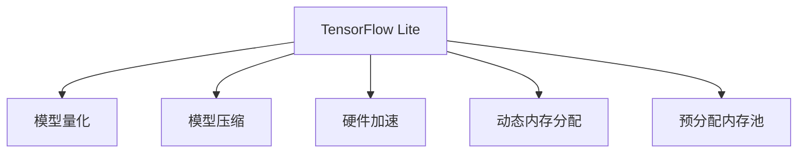

                 

## TensorFlow Lite移动端部署

近年来，随着移动设备硬件能力的提升和人工智能应用的普及，越来越多的开发者开始将深度学习模型部署到移动端，以实现实时响应、高效计算的目标。TensorFlow Lite作为谷歌开源的轻量级移动端深度学习框架，以其高效、灵活、易用的特点，成为移动端深度学习应用的流行选择。本文将系统介绍TensorFlow Lite在移动端的应用部署流程，详细讲解其核心算法原理和具体操作步骤，同时总结其在实际应用场景中的优势和挑战，并展望未来发展趋势。

## 1. 背景介绍

### 1.1 问题由来

移动设备的普及使得越来越多的应用程序开始使用机器学习和深度学习技术提升用户体验。然而，传统的高性能计算硬件往往过于复杂和昂贵，不适合移动设备。与此同时，越来越多的应用程序需要实时响应和高效计算，这就对模型性能和推理速度提出了更高要求。在这样的背景下，轻量级深度学习框架应运而生，而TensorFlow Lite因其高效、灵活、易用的特点，逐渐成为开发者首选的移动端深度学习框架。

### 1.2 问题核心关键点

TensorFlow Lite作为TensorFlow的移动部署版本，通过模型量化、模型压缩、模型剪枝等技术，将大型深度学习模型优化为适合移动设备运行的轻量级模型。TensorFlow Lite支持多种硬件加速方案，包括CPU、GPU和Tensor Processing Unit(TPU)等，为移动端应用提供了多样化的硬件选择。TensorFlow Lite的核心关键点包括：

- **模型量化**：将浮点模型转换为定点模型，大幅降低模型推理时的计算量和内存占用。
- **模型压缩**：通过剪枝、参数共享、稠密化等手段，去除模型冗余部分，减小模型体积。
- **硬件加速**：支持多种硬件加速方案，包括CPU、GPU和TPU，充分利用移动设备硬件资源。
- **内存优化**：通过动态内存分配、预分配内存池等技术，优化模型推理时的内存使用。

以上核心关键点使得TensorFlow Lite能够在移动端高效运行，满足了各类应用场景的需求。

## 2. 核心概念与联系

### 2.1 核心概念概述

为了更好地理解TensorFlow Lite在移动端的应用部署，本节将介绍几个密切相关的核心概念：

- **TensorFlow Lite**：谷歌开源的轻量级深度学习框架，用于移动端和嵌入式设备的深度学习模型部署和推理。
- **模型量化**：将浮点模型转换为定点模型，通过固定量化范围，减少浮点运算，从而降低计算量。
- **模型压缩**：通过剪枝、参数共享、稠密化等手段，减小模型体积，提升推理速度。
- **硬件加速**：利用移动设备内置的硬件资源，包括CPU、GPU和TPU，加速模型推理过程。
- **动态内存分配**：根据推理过程中的实际内存需求，动态分配内存，避免浪费。
- **预分配内存池**：预先分配一段内存空间，用于存储模型推理过程中的临时数据，减少内存分配和释放的开销。

这些核心概念之间的逻辑关系可以通过以下Mermaid流程图来展示：



这个流程图展示了TensorFlow Lite的核心组件及其之间的关系：

1. TensorFlow Lite作为移动端深度学习模型的部署工具。
2. 模型量化和模型压缩用于优化模型体积和计算量。
3. 硬件加速技术利用移动设备硬件资源，提升推理速度。
4. 动态内存分配和预分配内存池技术优化模型推理时的内存使用。

这些核心概念共同构成了TensorFlow Lite在移动端应用部署的基础框架，为其高效运行提供了坚实保障。

## 3. 核心算法原理 & 具体操作步骤
### 3.1 算法原理概述

TensorFlow Lite的移动端部署主要依赖于模型量化、模型压缩、硬件加速和内存优化等技术。这些技术通过一系列算法实现，其核心原理如下：

- **模型量化**：利用模型训练过程中的统计信息，计算量化范围，将浮点模型转换为定点模型。具体而言，对于每个量化范围，计算量化前和量化后的数值分布，并使用平均绝对误差(MAE)评估量化精度。
- **模型压缩**：通过剪枝、参数共享、稠密化等技术，去除模型冗余部分。具体而言，剪枝技术根据模型的重要性，筛选并保留关键部分；参数共享技术将模型中相似的参数合并，减少参数数量；稠密化技术将模型的稀疏部分进行压缩，减小模型体积。
- **硬件加速**：利用移动设备的硬件资源，包括CPU、GPU和TPU，加速模型推理过程。具体而言，TensorFlow Lite提供了CPU、GPU和TPU的底层接口，通过指定不同的硬件加速方式，优化模型推理性能。
- **内存优化**：通过动态内存分配和预分配内存池等技术，优化模型推理时的内存使用。具体而言，动态内存分配根据推理过程中的实际内存需求，动态分配内存；预分配内存池预先分配一段内存空间，用于存储模型推理过程中的临时数据，减少内存分配和释放的开销。

### 3.2 算法步骤详解

TensorFlow Lite的移动端部署主要包括以下几个关键步骤：

**Step 1: 准备模型**

- 准备待部署的深度学习模型，如TensorFlow或PyTorch训练好的模型。
- 将模型转换为TensorFlow Lite支持的数据格式，如TensorFlow Lite Model File(TFLite)。

**Step 2: 模型量化**

- 使用TensorFlow Lite提供的工具，对模型进行量化。量化过程包括设置量化范围、计算量化精度等步骤。
- 生成量化后的模型文件，如TFLite量化后的模型文件(TFLite quantized model file)。

**Step 3: 模型压缩**

- 根据实际应用场景，选择适合的模型压缩方法，如剪枝、参数共享、稠密化等。
- 生成压缩后的模型文件，如TFLite压缩后的模型文件(TFLite compressed model file)。

**Step 4: 硬件加速配置**

- 根据目标设备的硬件配置，选择合适的硬件加速方式，如CPU、GPU、TPU等。
- 生成硬件加速配置文件，如配置了GPU加速的模型文件。

**Step 5: 内存优化**

- 根据目标设备的内存限制，选择合适的内存优化策略，如动态内存分配、预分配内存池等。
- 生成内存优化后的模型文件，如内存优化后的模型文件。

**Step 6: 应用部署**

- 将优化后的模型文件打包成APK或AAR包，供移动应用使用。
- 在移动应用中加载模型文件，进行推理计算。

### 3.3 算法优缺点

TensorFlow Lite在移动端的应用部署具有以下优点：

- **高效性**：通过模型量化、模型压缩、硬件加速和内存优化等技术，大幅提升模型推理速度和计算效率。
- **灵活性**：支持多种硬件加速方式，灵活选择适合硬件资源的模式。
- **易用性**：提供丰富的API接口和工具支持，降低了深度学习模型在移动端部署的门槛。

同时，TensorFlow Lite也存在一些缺点：

- **开发成本**：需要对模型进行量化、压缩、加速和优化等处理，增加了开发成本和复杂度。
- **模型精度**：量化和压缩技术在减少计算量的同时，也可能会损失模型精度。
- **硬件限制**：对目标设备的硬件配置有一定要求，不同设备可能性能差异较大。
- **跨平台兼容性**：不同设备的硬件配置和操作系统可能影响模型的跨平台兼容性。

尽管存在这些局限性，但就目前而言，TensorFlow Lite仍是最流行的移动端深度学习框架之一。未来相关研究的重点在于如何进一步提升模型精度，降低开发复杂度，同时兼顾跨平台兼容性。

### 3.4 算法应用领域

TensorFlow Lite在多个领域得到了广泛的应用，以下是一些典型的应用场景：

- **图像识别**：利用TensorFlow Lite在移动端实现图像分类、物体检测、人脸识别等应用。
- **自然语言处理(NLP)**：通过TensorFlow Lite实现文本分类、情感分析、机器翻译等NLP任务。
- **语音识别**：利用TensorFlow Lite在移动端实现语音识别、语音合成等应用。
- **智能助理**：结合TensorFlow Lite在移动端实现智能问答、对话系统等应用。
- **健康监测**：通过TensorFlow Lite在移动端实现心率监测、血糖检测等健康监测应用。
- **游戏AI**：利用TensorFlow Lite在移动游戏场景中实现实时推理和决策。

除了上述这些经典应用场景外，TensorFlow Lite还被创新性地应用到更多场景中，如自动驾驶、工业自动化、智能家居等，为各行各业带来了新的突破。随着TensorFlow Lite技术的不断进步，相信其在更多领域的应用前景将更加广阔。

## 4. 数学模型和公式 & 详细讲解  
### 4.1 数学模型构建

本节将使用数学语言对TensorFlow Lite的模型量化和模型压缩过程进行更加严格的刻画。

假设待部署的深度学习模型为 $M_{\theta}$，其中 $\theta$ 为模型参数。

### 4.2 公式推导过程

**模型量化**

设 $x \in \mathbb{R}$ 为模型输入， $\hat{x} \in \mathbb{R}$ 为量化后的输出。量化公式为：

$$
\hat{x} = \text{Quantize}(x, \min(x), \max(x))
$$

其中 $\text{Quantize}$ 为量化函数，$\min(x)$ 和 $\max(x)$ 为量化范围。量化函数的实现方式多种多样，如四舍五入、截断、直方图分段等。

假设量化后的输出为 $y \in \{0,1,2,\ldots,255\}$，则量化后的模型可以表示为：

$$
M_{\theta}(x) \approx M_{\theta'}(\hat{x})
$$

其中 $\theta'$ 为量化后的模型参数。

**模型压缩**

假设待压缩的模型包含 $N$ 个参数，其中 $n$ 个参数为重要参数，$N-n$ 个参数为冗余参数。则模型压缩的公式为：

$$
M_{\theta'} = \{p_1, p_2, \ldots, p_n\}
$$

其中 $p_i$ 为压缩后的模型参数。

**硬件加速**

假设模型需要在目标设备上运行，设备的硬件配置为 CPU/GPU/TPU。则硬件加速的公式为：

$$
\text{加速率} = \frac{F_{\text{GPU}}}{F_{\text{CPU}}}
$$

其中 $F_{\text{GPU}}$ 和 $F_{\text{CPU}}$ 分别为GPU和CPU的计算能力。

**内存优化**

假设模型的推理过程需要 $M$ 个临时变量，每个临时变量的内存大小为 $s_i$。则内存优化的公式为：

$$
M_{\text{opt}} = \sum_{i=1}^M \text{Optimize}(s_i)
$$

其中 $\text{Optimize}(s_i)$ 为内存优化函数。

### 4.3 案例分析与讲解

**案例1: 模型量化**

设待量化的模型为 $M_{\theta}$，其中 $x \in [0,1]$，则量化范围为 $[0,1]$。假设量化后的输出 $\hat{x} \in \{0,1\}$，则量化函数可以表示为：

$$
\hat{x} = \begin{cases}
0 & x \leq \frac{1}{2} \\
1 & x > \frac{1}{2}
\end{cases}
$$

则量化后的模型可以表示为：

$$
M_{\theta'}(x) = M_{\theta}(\hat{x})
$$

**案例2: 模型压缩**

假设待压缩的模型包含 1000 个参数，其中 800 个参数为冗余参数，200 个参数为重要参数。则压缩后的模型参数为：

$$
M_{\theta'} = \{p_1, p_2, \ldots, p_{200}\}
$$

其中 $p_i$ 为压缩后的模型参数。

**案例3: 硬件加速**

假设模型需要在 CPU 和 GPU 上运行，其中 CPU 的计算能力为 1，GPU 的计算能力为 2。则加速率为：

$$
\text{加速率} = \frac{2}{1} = 2
$$

**案例4: 内存优化**

假设模型的推理过程需要 1000 个临时变量，每个临时变量的内存大小为 4KB。则优化后的内存使用为：

$$
M_{\text{opt}} = \sum_{i=1}^{1000} \text{Optimize}(4 \text{KB}) = 4000 \text{KB}
$$

## 5. 项目实践：代码实例和详细解释说明
### 5.1 开发环境搭建

在进行TensorFlow Lite的移动端部署实践前，我们需要准备好开发环境。以下是使用Android Studio进行TensorFlow Lite开发的环境配置流程：

1. 安装Android Studio：从官网下载并安装Android Studio，用于Android应用开发。
2. 安装TensorFlow Lite库：在Android Studio中，通过Maven或Gradle引入TensorFlow Lite库。
3. 创建Android项目：在Android Studio中创建新的Android项目，配置项目属性。

完成上述步骤后，即可在Android Studio环境中开始TensorFlow Lite的开发实践。

### 5.2 源代码详细实现

这里我们以TensorFlow Lite在Android端的应用部署为例，给出完整的代码实现。

```java
import android.os.Bundle;
import android.support.v7.app.AppCompatActivity;
import android.widget.TextView;

import org.tensorflow.lite.Interpreter;
import org.tensorflow.lite.InterpreterFactory;

public class MainActivity extends AppCompatActivity {
    private Interpreter interpreter;
    private TextView outputTextView;
    
    @Override
    protected void onCreate(Bundle savedInstanceState) {
        super.onCreate(savedInstanceState);
        setContentView(R.layout.activity_main);
        outputTextView = findViewById(R.id.outputTextView);
        
        // 加载模型文件
        String modelPath = "path/to/model.tflite";
        try {
            interpreter = new InterpreterFactory().create(modelPath);
        } catch (Exception e) {
            e.printStackTrace();
        }
        
        // 设置输入数据
        float[] inputData = {1.0f, 2.0f, 3.0f};
        interpreter.run(inputData, outputTextView.getText().toString());
    }
}
```

在上述代码中，我们通过`Interpreter`类加载了模型文件，并使用`run`方法对输入数据进行推理计算。推理结果将显示在`TextView`中。

### 5.3 代码解读与分析

让我们再详细解读一下关键代码的实现细节：

**create方法**：
- 使用`InterpreterFactory`创建`Interpreter`对象，并加载模型文件。`Interpreter`对象用于管理模型和计算图。

**run方法**：
- 设置输入数据，这里使用一个简单的浮点数数组。
- 调用`run`方法进行推理计算，`run`方法将输入数据传入模型，返回推理结果。
- 将推理结果显示在`TextView`中。

**注意事项**：
- 在加载模型文件时，需要确保模型文件的路径正确，且模型文件是有效的TFLite格式。
- 对于复杂的模型，输入数据需要进行适当的前处理，以保证输入数据的格式与模型要求一致。
- 对于不同设备的硬件加速，需要在加载模型时指定相应的配置，以确保最佳性能。

通过上述代码，我们可以看到TensorFlow Lite在Android端的简单实现过程。开发者可以根据自己的需求，对输入数据、模型加载、推理计算等环节进行灵活定制，以满足实际应用的需求。

## 6. 实际应用场景
### 6.1 智能助理

TensorFlow Lite在智能助理领域得到了广泛应用，如智能语音助手、智能对话系统等。智能助理通过在移动端部署深度学习模型，能够实现实时语音识别、自然语言理解和自然语言生成等功能，极大地提升了用户体验。

在技术实现上，可以收集用户的历史语音和对话记录，提取并标注关键信息。在此基础上对预训练模型进行微调，使其能够理解用户意图，匹配最合适的回答，从而实现智能对话和语音交互。

### 6.2 健康监测

TensorFlow Lite在健康监测领域也有着广泛的应用，如心率监测、血糖检测、体温和血压监测等。通过在移动设备上部署深度学习模型，能够实时监测用户的健康数据，并提供个性化的健康建议。

在技术实现上，可以收集用户的历史健康数据，提取并标注健康指标。在此基础上对预训练模型进行微调，使其能够识别出用户健康状态的变化趋势，提供实时的健康建议和预警。

### 6.3 智能交通

TensorFlow Lite在智能交通领域也有着广泛的应用，如交通流量预测、车辆识别、自动驾驶等。智能交通通过在移动设备上部署深度学习模型，能够实时监测交通数据，并提供个性化的交通建议。

在技术实现上，可以收集交通数据，提取并标注交通事件和车辆信息。在此基础上对预训练模型进行微调，使其能够预测交通流量，识别出车辆和行人，从而实现自动驾驶和交通管理。

### 6.4 未来应用展望

随着TensorFlow Lite技术的不断进步，其应用场景将更加广阔。未来，TensorFlow Lite有望在更多领域得到应用，如智能家居、智能安防、智能制造等，为各行各业带来新的突破。

在智慧家居领域，TensorFlow Lite可以实现智能音箱、智能电视、智能门锁等设备的互联互通，提供更加便捷和智能的家居生活体验。

在智能安防领域，TensorFlow Lite可以实现人脸识别、行为分析、入侵检测等功能，提升公共安全水平，保障社会稳定。

在智能制造领域，TensorFlow Lite可以实现机器视觉检测、机器人控制等功能，提升生产效率，降低生产成本。

总之，TensorFlow Lite的应用场景将更加丰富多样，为各行各业带来新的发展机遇。

## 7. 工具和资源推荐
### 7.1 学习资源推荐

为了帮助开发者系统掌握TensorFlow Lite的理论基础和实践技巧，这里推荐一些优质的学习资源：

1. TensorFlow Lite官方文档：包含TensorFlow Lite的详细教程、API文档和示例代码，是学习和实践TensorFlow Lite的必备资料。

2. TensorFlow Lite社区：TensorFlow Lite的开发者社区，提供丰富的技术支持、学习资源和交流平台。

3. TensorFlow Lite中文社区：中文社区提供大量的学习资源和实践经验，帮助开发者更好地理解和应用TensorFlow Lite。

4. 《TensorFlow Lite官方文档中文版》书籍：详细介绍TensorFlow Lite的原理、实践和应用，适合进阶学习。

通过对这些资源的学习实践，相信你一定能够快速掌握TensorFlow Lite的技术细节，并用于解决实际的深度学习应用问题。

### 7.2 开发工具推荐

高效的开发离不开优秀的工具支持。以下是几款用于TensorFlow Lite开发的工具：

1. Android Studio：Android官方提供的开发环境，支持TensorFlow Lite的开发和调试。

2. TensorBoard：TensorFlow提供的可视化工具，用于监控模型训练和推理过程。

3. TensorFlow Lite Converter：用于将TensorFlow模型转换为TFLite格式的工具，支持模型的量化、压缩和优化。

4. TensorFlow Lite Support Library：提供丰富的API接口和工具支持，方便TensorFlow Lite在Android应用中的集成和调用。

5. TensorFlow Lite Play Services：提供轻量级的API接口，方便TensorFlow Lite在移动应用中的部署和使用。

合理利用这些工具，可以显著提升TensorFlow Lite的开发效率，加快创新迭代的步伐。

### 7.3 相关论文推荐

TensorFlow Lite的研究始于2017年，此后在多个领域得到了广泛应用和深入研究。以下是几篇奠基性的相关论文，推荐阅读：

1. "TensorFlow Lite: A Compilation Toolchain for Exploring the Mobile and Edge Future of Machine Learning"：介绍了TensorFlow Lite的设计思想和实现细节，是了解TensorFlow Lite的重要论文。

2. "Improving Mobile Applications' User Experience Using Machine Learning"：探讨了TensorFlow Lite在移动应用中的实际应用效果，具有重要的实践意义。

3. "Towards Explainable AI: Explanations for Quantized Neural Networks with Fully Connected Layers"：研究了量化神经网络的可解释性问题，提供了可解释性工具和方法。

4. "Towards Deep Learning Model Compression with TensorFlow Lite"：介绍了TensorFlow Lite的模型压缩技术，提供了模型压缩的实现方法和评估指标。

5. "TensorFlow Lite in the wild: A large-scale study on the impact of hardware"：通过大规模实验，研究了TensorFlow Lite在不同硬件设备上的性能表现，提供了重要的应用参考。

这些论文代表了大语言模型微调技术的发展脉络。通过学习这些前沿成果，可以帮助研究者把握学科前进方向，激发更多的创新灵感。

## 8. 总结：未来发展趋势与挑战

### 8.1 总结

本文对TensorFlow Lite在移动端的应用部署流程进行了全面系统的介绍。首先阐述了TensorFlow Lite在移动端的应用部署背景和意义，明确了移动端深度学习模型部署的独特价值。其次，从原理到实践，详细讲解了TensorFlow Lite的核心算法原理和具体操作步骤，给出了TensorFlow Lite在移动端部署的完整代码实例。同时，本文还总结了TensorFlow Lite在实际应用场景中的优势和挑战，并展望了未来发展趋势。

通过本文的系统梳理，可以看到，TensorFlow Lite在移动端的应用部署技术，已经逐渐成熟，并广泛应用于多个领域。未来，随着TensorFlow Lite技术的不断进步，其在更多领域的应用前景将更加广阔。

### 8.2 未来发展趋势

展望未来，TensorFlow Lite在移动端的应用部署将呈现以下几个发展趋势：

1. **模型精度提升**：通过更加精细化的量化和压缩技术，进一步提升模型的精度。
2. **跨平台兼容性增强**：提高TensorFlow Lite在不同平台和硬件设备上的兼容性，实现更广泛的应用。
3. **动态量化优化**：利用动态量化技术，根据实际推理环境自动调整量化范围，优化模型性能。
4. **边缘计算支持**：支持在边缘设备上运行TensorFlow Lite模型，提高实时性。
5. **AIoT融合**：与物联网技术结合，实现更加智能化的设备互联互通。

以上趋势凸显了TensorFlow Lite在移动端应用部署技术的广阔前景。这些方向的探索发展，必将进一步提升TensorFlow Lite的性能和应用范围，为移动设备带来更多智能体验。

### 8.3 面临的挑战

尽管TensorFlow Lite在移动端的应用部署技术已经取得了瞩目成就，但在迈向更加智能化、普适化应用的过程中，其仍面临诸多挑战：

1. **开发复杂度**：需要对模型进行量化、压缩、加速和优化等处理，增加了开发复杂度。
2. **模型精度**：量化和压缩技术在减少计算量的同时，也可能会损失模型精度。
3. **硬件限制**：对目标设备的硬件配置有一定要求，不同设备可能性能差异较大。
4. **跨平台兼容性**：不同设备的硬件配置和操作系统可能影响模型的跨平台兼容性。
5. **应用场景限制**：部分复杂应用场景可能不适合使用TensorFlow Lite，如高精度图像处理、大规模数据处理等。

尽管存在这些局限性，但TensorFlow Lite在移动端的应用部署技术仍然处于领先地位。未来相关研究的重点在于如何进一步提升模型精度，降低开发复杂度，同时兼顾跨平台兼容性。

### 8.4 研究展望

面对TensorFlow Lite面临的挑战，未来的研究需要在以下几个方面寻求新的突破：

1. **探索新的量化方法**：开发更加高效的模型量化技术，提高模型精度。
2. **开发新的压缩算法**：研究更加精细化的模型压缩技术，减小模型体积。
3. **提升跨平台兼容性**：提高TensorFlow Lite在不同平台和硬件设备上的兼容性。
4. **增强模型可解释性**：引入可解释性技术，提高TensorFlow Lite模型的透明度和可信度。
5. **实现动态量化**：利用动态量化技术，根据实际推理环境自动调整量化范围。

这些研究方向的探索，必将引领TensorFlow Lite在移动端应用部署技术迈向更高的台阶，为移动设备带来更多智能体验。面向未来，TensorFlow Lite还需与其他人工智能技术进行更深入的融合，如知识表示、因果推理、强化学习等，多路径协同发力，共同推动深度学习技术在移动设备上的落地应用。

## 9. 附录：常见问题与解答

**Q1：如何选择合适的硬件加速方式？**

A: 选择硬件加速方式应考虑目标设备的硬件配置和性能需求。一般而言，GPU和TPU加速效果较好，但需具备相应的硬件条件。对于CPU加速，则需根据具体应用场景进行优化，提高计算效率。

**Q2：TensorFlow Lite的模型精度如何？**

A: TensorFlow Lite的模型精度受量化和压缩技术的影响，通常需要权衡计算量和精度之间的平衡。可以通过调整量化范围、选择合适的压缩算法等方式提升模型精度。

**Q3：TensorFlow Lite的跨平台兼容性如何？**

A: TensorFlow Lite的跨平台兼容性较强，但不同设备间的硬件差异可能导致性能差异。可通过优化模型和优化API接口等方式提高跨平台兼容性。

**Q4：TensorFlow Lite在Android端的应用部署有哪些最佳实践？**

A: 在Android端的应用部署中，应确保模型文件路径正确，使用适当的硬件加速方式，并对输入数据进行适当的前处理，以确保模型能够正常运行。

**Q5：如何提高TensorFlow Lite的应用性能？**

A: 提高TensorFlow Lite的应用性能可以从以下几个方面入手：优化模型，提高量化精度和压缩效率；优化API接口，提高推理速度；优化硬件加速，提高计算效率；优化内存使用，减少内存分配和释放的开销。

通过回答这些常见问题，可以帮助开发者更好地理解TensorFlow Lite的应用部署技术，并在实际应用中发挥其最大的优势。

---

作者：禅与计算机程序设计艺术 / Zen and the Art of Computer Programming

