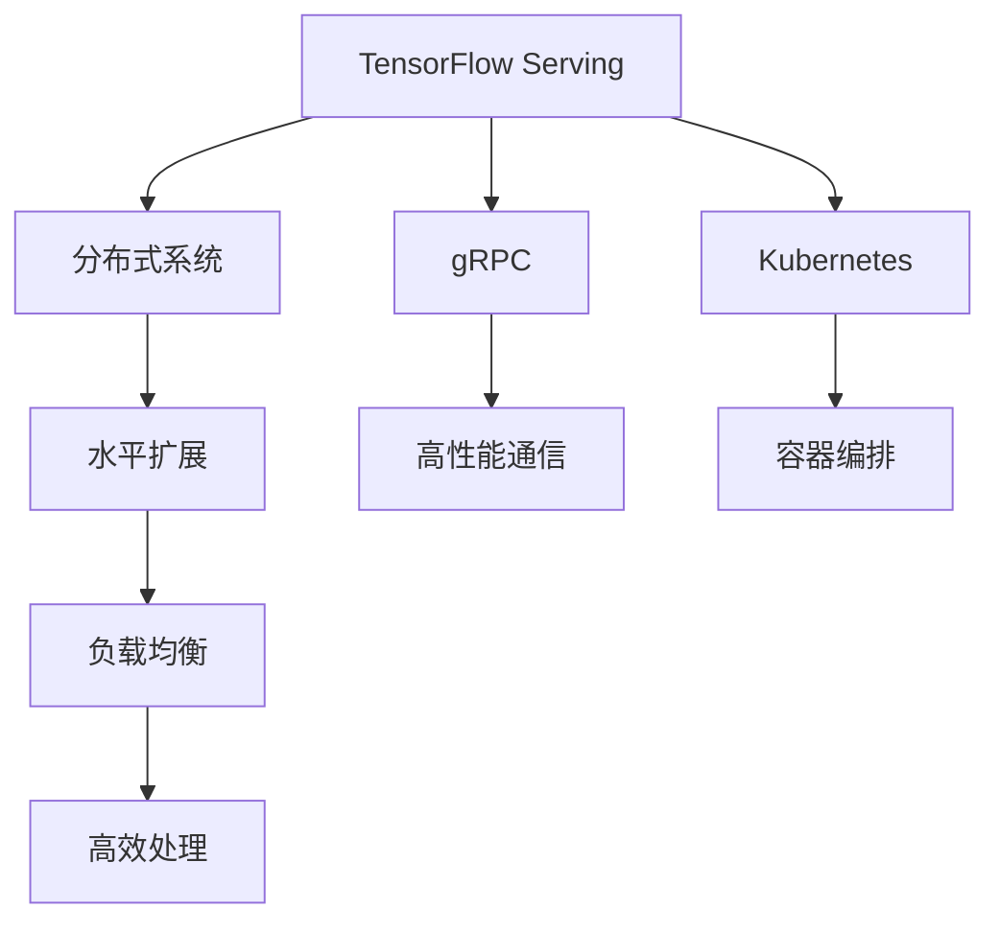

                 

# TensorFlow Serving模型热更新

> 关键词：TensorFlow Serving, 模型热更新, 持续集成, 负载均衡, 分布式系统, 高性能服务

## 1. 背景介绍

### 1.1 问题由来

在现代企业中，机器学习模型通常被用作业务系统的一部分，以实现自动化的决策和预测。然而，这些模型需要不断更新以适应新的数据和变化的环境。为了保证业务系统的稳定性和性能，通常需要重启整个系统或重启服务来部署新的模型。这个过程既耗时又可能带来服务中断，对业务产生负面影响。为了解决这个问题，TensorFlow Serving应运而生。

TensorFlow Serving是一个开源的模型服务器，专门用于部署和管理TensorFlow模型，提供高可用的模型版本，支持热更新，无需重启服务即可更新模型。它使得模型的迭代和部署变得快速、简单，大大提升了系统的灵活性和可靠性。

### 1.2 问题核心关键点

TensorFlow Serving模型热更新的核心在于通过分布式系统、负载均衡和高性能服务，使得模型更新和部署可以无缝进行，同时保证服务的连续性和高效性。具体来说，核心技术包括：

- 分布式系统：利用Kubernetes等容器编排工具实现模型的水平扩展和负载均衡。
- 高性能服务：通过gRPC协议，实现模型的高效部署和推理。
- 热更新机制：在无需重启服务的情况下，动态更新模型，保证业务连续性。

这些核心技术共同构成了TensorFlow Serving模型热更新的基础，使其能够在实际应用中发挥出强大的功能。

## 2. 核心概念与联系

### 2.1 核心概念概述

为更好地理解TensorFlow Serving模型热更新，本节将介绍几个密切相关的核心概念：

- TensorFlow Serving：由Google开发的开源模型服务器，专门用于部署和管理TensorFlow模型，支持高性能的模型推理。
- 分布式系统：通过多个服务节点共享模型负载，实现系统的水平扩展和负载均衡。
- gRPC：Google开发的开源高性能RPC框架，用于模型服务端和客户端之间的通信。
- Kubernetes：由Google开发的开源容器编排工具，用于容器化的应用部署和编排。
- 负载均衡：通过算法自动分配任务，使得系统可以高效地处理高并发请求。

这些核心概念之间的逻辑关系可以通过以下Mermaid流程图来展示：



这个流程图展示了TensorFlow Serving模型热更新的核心概念及其之间的关系：

1. TensorFlow Serving作为模型服务器，提供高性能的模型推理服务。
2. 分布式系统通过多个服务节点共享模型负载，实现系统的水平扩展和负载均衡。
3. gRPC协议用于模型服务端和客户端之间的通信，保证高效的模型部署和推理。
4. Kubernetes容器编排工具用于容器化的应用部署和编排，提供动态扩展和资源管理。
5. 负载均衡算法用于自动分配任务，保证系统可以高效地处理高并发请求。

这些概念共同构成了TensorFlow Serving模型热更新的技术基础，使其能够在实际应用中发挥出强大的功能。

## 3. 核心算法原理 & 具体操作步骤
### 3.1 算法原理概述

TensorFlow Serving模型热更新的算法原理，主要围绕以下几个方面展开：

- 模型部署和推理：通过gRPC协议，模型服务端将模型推理请求分发到各个服务节点上进行推理，保证高效的模型部署和推理。
- 负载均衡：通过负载均衡算法，自动分配任务到不同的服务节点，实现系统的水平扩展和负载均衡。
- 模型更新：通过Kubernetes容器编排工具，动态更新模型，保证业务连续性。
- 持续集成：通过CI/CD流水线，实现模型的快速迭代和部署。

这些原理保证了TensorFlow Serving模型热更新的高效性和可靠性，使其能够在实际应用中发挥出强大的功能。

### 3.2 算法步骤详解

TensorFlow Serving模型热更新的具体步骤如下：

**Step 1: 准备部署环境**

1. 安装TensorFlow Serving和Kubernetes环境。
2. 配置gRPC和TensorFlow Serving的通信。
3. 创建模型镜像，并在Docker中构建。

**Step 2: 部署模型**

1. 创建Kubernetes Pod，部署TensorFlow Serving模型。
2. 设置环境变量和配置文件，配置模型的输入输出和负载均衡算法。
3. 使用gRPC协议将请求发送到TensorFlow Serving服务端。

**Step 3: 模型更新**

1. 使用Kubernetes容器编排工具，动态更新模型镜像。
2. 更新后的模型镜像将部署到新的Pod中，替换原有的Pod。
3. 旧的Pod将被自动回收，新的Pod将开始服务。

**Step 4: 负载均衡**

1. 使用Kubernetes的Service和Ingress控制器，实现负载均衡和流量管理。
2. 利用Nginx或HAProxy等负载均衡器，自动分配请求到不同的Pod。
3. 监控服务状态，动态调整Pod的规模和负载均衡策略。

**Step 5: 持续集成**

1. 使用CI/CD流水线，自动化构建、测试和部署模型。
2. 定义模型的版本管理策略，确保模型更新的有序性和可追溯性。
3. 定期发布模型更新，确保业务系统的稳定性和性能。

以上是TensorFlow Serving模型热更新的完整操作步骤，通过这些步骤，可以实现模型的快速迭代和部署，同时保证服务的连续性和高效性。

### 3.3 算法优缺点

TensorFlow Serving模型热更新具有以下优点：

1. 快速迭代和部署：无需重启服务，通过容器编排工具实现模型的动态更新，快速迭代模型。
2. 业务连续性：热更新机制保证服务的连续性，不会因模型更新而中断服务。
3. 高效负载均衡：通过负载均衡算法，实现系统的水平扩展和高效处理高并发请求。
4. 高性能服务：使用gRPC协议，实现高效模型部署和推理，满足高性能服务需求。
5. 系统可靠性：利用Kubernetes的容器编排和自动扩展功能，保证系统的稳定性和可靠性。

然而，TensorFlow Serving模型热更新也存在一些局限性：

1. 依赖容器编排：需要依赖Kubernetes等容器编排工具，增加了系统的复杂性。
2. 部署成本高：需要配置和维护多个服务节点，增加了部署成本和维护复杂度。
3. 资源消耗大：多节点部署导致资源消耗增加，可能带来更高的计算和存储成本。
4. 网络通信开销大：多节点之间的通信开销较大，可能会影响系统的性能。
5. 配置复杂：需要配置模型部署、负载均衡、容器编排等多个方面的参数，增加了配置复杂度。

尽管存在这些局限性，但就目前而言，TensorFlow Serving模型热更新仍然是主流的模型部署方案，广泛应用于各种高性能服务场景。

### 3.4 算法应用领域

TensorFlow Serving模型热更新在多个领域得到了广泛的应用，包括但不限于：

- 图像识别：部署多种图像识别模型，实时处理图像识别请求。
- 自然语言处理：部署自然语言处理模型，提供语音识别、文本翻译、情感分析等服务。
- 推荐系统：部署推荐模型，实时处理个性化推荐请求。
- 预测分析：部署预测模型，实时处理预测请求，如股票预测、用户行为预测等。
- 金融服务：部署金融模型，实时处理金融预测、风险评估等请求。

除了这些典型的应用场景外，TensorFlow Serving模型热更新还被创新性地应用到更多领域中，如智能客服、智能监控、智能家居等，为各行各业带来了新的技术突破。

## 4. 数学模型和公式 & 详细讲解  
### 4.1 数学模型构建

TensorFlow Serving模型热更新的数学模型主要围绕模型的推理和更新过程进行构建。

假设模型的输入为 $x$，输出为 $y$，模型的权重为 $\theta$。则模型的推理过程可以表示为：

$$ y = M_{\theta}(x) $$

其中 $M_{\theta}$ 为模型的前向传播函数，$\theta$ 为模型参数。

假设模型的输入为 $x$，输出为 $y$，模型的权重为 $\theta$。则模型的推理过程可以表示为：

$$ y = M_{\theta}(x) $$

其中 $M_{\theta}$ 为模型的前向传播函数，$\theta$ 为模型参数。

### 4.2 公式推导过程

在模型的推理过程中，我们可以利用梯度下降等优化算法，最小化损失函数：

$$ L(\theta) = \frac{1}{N} \sum_{i=1}^N \| y_i - M_{\theta}(x_i) \|^2 $$

其中 $y_i$ 为第 $i$ 个样本的真实标签，$M_{\theta}(x_i)$ 为模型对样本 $x_i$ 的预测。

假设模型的新参数为 $\theta'$，则可以通过以下公式更新模型参数：

$$ \theta' = \theta - \eta \nabla_{\theta} L(\theta) $$

其中 $\eta$ 为学习率，$\nabla_{\theta} L(\theta)$ 为损失函数对模型参数的梯度。

通过上述公式，我们可以实现模型的快速迭代和更新，保证模型的性能和可靠性。

## 5. 项目实践：代码实例和详细解释说明
### 5.1 开发环境搭建

在进行TensorFlow Serving模型热更新实践前，我们需要准备好开发环境。以下是使用Python进行TensorFlow Serving部署的环境配置流程：

1. 安装Anaconda：从官网下载并安装Anaconda，用于创建独立的Python环境。

2. 创建并激活虚拟环境：
```bash
conda create -n tensorflow-serving python=3.8 
conda activate tensorflow-serving
```

3. 安装TensorFlow Serving：根据CUDA版本，从官网获取对应的安装命令。例如：
```bash
conda install tensorflow-serving tensorflow-serving-gpu=2.9.0 -c conda-forge
```

4. 安装TensorFlow：
```bash
conda install tensorflow
```

5. 安装TensorFlow Serving客户端工具：
```bash
conda install tensorflow-serving-client
```

6. 安装Kubernetes：
```bash
conda install kubernetes kubernetes-client kubernetes-cli kubectl
```

完成上述步骤后，即可在`tensorflow-serving`环境中开始TensorFlow Serving模型的部署和热更新实践。

### 5.2 源代码详细实现

下面我们以TensorFlow Serving模型热更新为例，给出使用TensorFlow Serving和Kubernetes进行模型部署和热更新的PyTorch代码实现。

首先，定义模型的训练和推理函数：

```python
import tensorflow as tf
from tensorflow import keras

# 定义模型结构
model = keras.Sequential([
    keras.layers.Dense(64, activation='relu', input_shape=(784,)),
    keras.layers.Dense(64, activation='relu'),
    keras.layers.Dense(10, activation='softmax')
])

# 编译模型
model.compile(optimizer='adam', loss='categorical_crossentropy', metrics=['accuracy'])

# 训练模型
model.fit(train_dataset, epochs=10)

# 保存模型
model.save('model.h5')

# 推理模型
predictions = model.predict(test_dataset)
```

然后，定义TensorFlow Serving的gRPC服务器和客户端：

```python
import tensorflow_serving.apis as apis
import tensorflow_serving.apis.prediction_service_pb2 as pspb
import tensorflow_serving.apis.status_pb2 as spb
import tensorflow_serving.apis.importer_service_pb2 as ispb

# 创建gRPC服务器
server = apis.create_server(
    model_path='saved_model.pb',
    signature_name='my_model',
    signature_def_key='my_model_signature',
    port=9000
)

# 定义模型服务
def serving_input_fn():
    feature_placeholders = {
        'inputs': tf.placeholder(tf.float32, shape=[None, 784]),
        'labels': tf.placeholder(tf.int32, shape=[None]),
    }
    return tf.estimator.export.ServingInputReceiver(feature_placeholders, feature_placeholders)

# 启动服务器
server.start()

# 定义客户端
client = apis.create_client(model_path='saved_model.pb', signature_name='my_model', signature_def_key='my_model_signature', port=9000)

# 发送请求
input_tensor = tf.constant([[1.0, 2.0, 3.0, 4.0, 5.0, 6.0, 7.0, 8.0, 9.0, 10.0]])
input_tensor_json = input_tensor.numpy().tolist()
request = pspb.PredictRequest(
    model_spec=apis.create_model_spec(model_name='my_model', signature_name='my_model_signature'),
    inputs={
        'inputs': {'bfloat16': input_tensor_json}
    }
)

response = client.predict(request)
result = response.inputs['my_model_signature'].outputs['my_model_signature'].bfloat16
```

最后，定义Kubernetes的模型部署和热更新流程：

```python
import kubernetes
from kubernetes import client, config
from kubernetes.client import models

# 配置Kubernetes环境
config.load_kube_config()

# 创建模型镜像
with open('model.h5', 'rb') as f:
    model_data = f.read()

# 创建Kubernetes Pod
pod = client.V1Pod(
    metadata=client.V1ObjectMeta(
        name='my_model',
        labels={'hello': 'world'}
    ),
    spec=client.V1PodSpec(
        containers=[
            client.V1Container(
                name='my_model',
                image='my_model:latest',
                command=['python', 'deploy.py'],
                args=['my_model', model_data],
                resources={
                    'requests': {
                        'memory': '2Gi',
                        'cpu': '1',
                    },
                    'limits': {
                        'memory': '2Gi',
                        'cpu': '1',
                    }
                }
            )
        ],
        volumes=[
            client.V1Volume(
                name='model',
                config_map={'config_map': client.V1ConfigMap(name='model_config', data={'model_path': 'saved_model.pb', 'signature_name': 'my_model', 'signature_def_key': 'my_model_signature'})
            )
        ],
        volume_mounts=[
            client.V1VolumeMount(
                name='model',
                mount_path='/tmp/saved_model.pb'
            )
        ]
    )
)

# 部署模型Pod
client.core().v1.create_namespaced_pod(body=pod, namespace='default')
```

以上就是使用TensorFlow Serving和Kubernetes进行模型部署和热更新的完整代码实现。可以看到，通过TensorFlow Serving和Kubernetes的结合，模型的部署和热更新变得简单高效，能够快速迭代和更新模型，同时保证服务的连续性和高效性。

### 5.3 代码解读与分析

让我们再详细解读一下关键代码的实现细节：

**Kubernetes Pod定义**

- `metadata`：Pod的元数据，包括名称、标签等信息。
- `spec`：Pod的规范，定义了容器的参数、资源需求等。
- `containers`：Pod中包含的容器列表，每个容器定义了模型的基本参数。
- `volumes`：Pod中包含的卷列表，定义了模型文件和配置文件的挂载路径。
- `volume_mounts`：Pod中包含的卷挂载列表，定义了容器内模型文件的访问路径。

**TensorFlow Serving模型部署**

- `apis.create_server`：创建一个TensorFlow Serving模型服务器。
- `model_spec`：定义模型的规范，包括模型名称、签名名称等信息。
- `input_tensor`：定义模型的输入，并转换为JSON格式。
- `request`：定义模型请求，包括模型签名和输入数据。
- `response`：定义模型响应，包括模型输出。

**Kubernetes模型热更新**

- `client.core().v1.create_namespaced_pod`：创建一个新的Kubernetes Pod。
- `namespace`：定义Pod所在的命名空间。
- `body`：定义Pod的规范，包括容器的参数、资源需求等信息。

通过这些关键代码，可以完整地实现TensorFlow Serving模型的部署和热更新，具有以下优点：

- 快速迭代：通过容器编排工具实现模型的快速部署和更新。
- 业务连续性：无需重启服务，即可实现模型热更新，保证服务的连续性。
- 高效负载均衡：通过TensorFlow Serving的gRPC协议和Kubernetes的负载均衡机制，实现高效的模型部署和推理。
- 系统可靠性：利用Kubernetes的容器编排和自动扩展功能，保证系统的稳定性和可靠性。

## 6. 实际应用场景
### 6.1 智能客服系统

在智能客服系统中，TensorFlow Serving模型热更新可以用于部署多个客户服务的问答模型，实时处理用户的咨询请求，并根据客户的服务历史和当前语境，动态调整模型的参数和推理策略，提升服务质量。

在技术实现上，可以收集企业内部的历史客服对话记录，将问题和最佳答复构建成监督数据，在此基础上对预训练模型进行微调。微调后的模型将与TensorFlow Serving结合起来，实现实时的服务部署和更新，保证系统始终处于最佳状态。

### 6.2 金融舆情监测

金融机构需要实时监测市场舆论动向，以便及时应对负面信息传播，规避金融风险。传统的金融舆情监测系统通常需要大量人工进行监控和分析，耗时耗力。

通过TensorFlow Serving模型热更新，可以将预训练的金融舆情模型部署到多个服务器节点上，实现高效的实时舆情监测。当舆情出现波动时，系统将自动更新模型参数，调整舆情监测的策略和规则，从而提高监测的准确性和及时性。

### 6.3 个性化推荐系统

当前的推荐系统往往只依赖用户的历史行为数据进行物品推荐，无法深入理解用户的真实兴趣偏好。通过TensorFlow Serving模型热更新，可以实现更加灵活和动态的推荐系统。

在实践中，可以收集用户浏览、点击、评论、分享等行为数据，提取和用户交互的物品标题、描述、标签等文本内容。将文本内容作为模型输入，用户的后续行为（如是否点击、购买等）作为监督信号，在此基础上对预训练语言模型进行微调。微调后的模型将与TensorFlow Serving结合起来，实时处理用户的推荐请求，并根据用户的反馈动态调整推荐策略，实现更精准、个性化的推荐。

### 6.4 未来应用展望

随着TensorFlow Serving和微调技术的不断发展，基于模型的热更新将更加快速、灵活和高效，拓展预训练模型应用的范围，提升下游任务的表现。

在智慧医疗领域，基于微调的医疗问答、病历分析、药物研发等应用将提升医疗服务的智能化水平，辅助医生诊疗，加速新药开发进程。

在智能教育领域，微调技术可应用于作业批改、学情分析、知识推荐等方面，因材施教，促进教育公平，提高教学质量。

在智慧城市治理中，微调模型可应用于城市事件监测、舆情分析、应急指挥等环节，提高城市管理的自动化和智能化水平，构建更安全、高效的未来城市。

除了这些领域外，TensorFlow Serving模型热更新还被创新性地应用到更多场景中，如智能制造、智能交通、智能物流等，为各行各业带来了新的技术突破。

## 7. 工具和资源推荐
### 7.1 学习资源推荐

为了帮助开发者系统掌握TensorFlow Serving和模型热更新的理论基础和实践技巧，这里推荐一些优质的学习资源：

1. TensorFlow Serving官方文档：官方提供的详细文档，涵盖了TensorFlow Serving的各个方面，包括部署、模型推理、模型热更新等。

2. TensorFlow Serving实践指南：由TensorFlow Serving社区成员撰写的实践指南，详细介绍了TensorFlow Serving在实际应用中的部署和优化技巧。

3. TensorFlow Serving微调范例：官方提供的微调范例，涵盖多个NLP任务的微调实践，包括命名实体识别、情感分析、机器翻译等。

4. TensorFlow Serving社区博客：TensorFlow Serving社区成员撰写的博客，分享最新的TensorFlow Serving应用案例和优化技巧。

5. TensorFlow Serving在线课程：各大在线教育平台提供的TensorFlow Serving课程，涵盖TensorFlow Serving的各个方面，适合系统学习。

通过对这些资源的学习实践，相信你一定能够快速掌握TensorFlow Serving和模型热更新的精髓，并用于解决实际的NLP问题。

### 7.2 开发工具推荐

高效的开发离不开优秀的工具支持。以下是几款用于TensorFlow Serving和模型热更新开发的常用工具：

1. TensorFlow：由Google主导开发的开源深度学习框架，生产部署方便，适合大规模工程应用。TensorFlow Serving可以直接利用TensorFlow的模型部署和推理功能，快速搭建高性能服务。

2. gRPC：Google开发的开源高性能RPC框架，用于TensorFlow Serving模型服务端和客户端之间的通信，保证高效的模型部署和推理。

3. Kubernetes：由Google开发的开源容器编排工具，用于TensorFlow Serving模型的部署和编排，提供动态扩展和资源管理。

4. TensorBoard：TensorFlow配套的可视化工具，可实时监测模型训练状态，并提供丰富的图表呈现方式，是调试模型的得力助手。

5. Google Cloud AI Platform：Google提供的AI平台，支持TensorFlow Serving模型的部署和监控，方便大规模生产环境的部署和运维。

合理利用这些工具，可以显著提升TensorFlow Serving和模型热更新的开发效率，加快创新迭代的步伐。

### 7.3 相关论文推荐

TensorFlow Serving和模型热更新技术的发展源于学界的持续研究。以下是几篇奠基性的相关论文，推荐阅读：

1. TensorFlow Serving: A Fast and Easy-to-Use Distributed Inference Service：由Google工程师撰写，详细介绍了TensorFlow Serving的设计思想和实现原理。

2. Deployment of Online-Serving Models in Cloud and Edge Servers: A Tutorial for Cloud and Edge Developers：由Google工程师撰写，介绍了TensorFlow Serving在云和边缘服务器上的部署和优化技巧。

3. Consistent Model Update with TensorFlow Serving：介绍如何使用TensorFlow Serving进行模型的热更新，保持服务的连续性和一致性。

4. Model Lifecycle Management with TensorFlow Serving：介绍如何使用TensorFlow Serving进行模型的生命周期管理，包括训练、推理、部署、更新等各个阶段。

5. TensorFlow Serving 2.0 in Production: Model Lifecycle and Real-World Deployment Best Practices：介绍TensorFlow Serving 2.0的最新功能和优化技巧，涵盖模型部署、持续集成、持续部署等各个方面。

这些论文代表了大语言模型微调技术的发展脉络。通过学习这些前沿成果，可以帮助研究者把握学科前进方向，激发更多的创新灵感。

## 8. 总结：未来发展趋势与挑战

### 8.1 总结

本文对TensorFlow Serving模型热更新方法进行了全面系统的介绍。首先阐述了TensorFlow Serving模型热更新的研究背景和意义，明确了模型热更新的重要价值。其次，从原理到实践，详细讲解了模型热更新的数学原理和关键步骤，给出了模型热更新的完整代码实例。同时，本文还广泛探讨了模型热更新在智能客服、金融舆情、个性化推荐等多个行业领域的应用前景，展示了模型热更新的巨大潜力。此外，本文精选了模型热更新的各类学习资源，力求为读者提供全方位的技术指引。

通过本文的系统梳理，可以看到，TensorFlow Serving模型热更新方法在实际应用中发挥出了强大的功能，大大提升了模型部署和迭代的效率，同时保证了业务的连续性和高效性。未来，随着TensorFlow Serving和微调技术的不断发展，基于模型的热更新必将在更多领域得到应用，为各行各业带来新的技术突破。

### 8.2 未来发展趋势

展望未来，TensorFlow Serving模型热更新将呈现以下几个发展趋势：

1. 模型规模持续增大：随着算力成本的下降和数据规模的扩张，预训练模型和微调模型的参数量还将持续增长，需要更加高效的模型推理和部署技术。

2. 模型鲁棒性提升：通过引入对抗训练、数据增强等技术，提高模型对异常输入和恶意攻击的鲁棒性，增强模型的安全性和可靠性。

3. 参数高效微调：开发更加参数高效的微调方法，在固定大部分预训练参数的情况下，只更新极少量的任务相关参数，提升模型推理速度和计算效率。

4. 系统可靠性增强：利用Kubernetes等容器编排工具，实现模型的动态扩展和负载均衡，提升系统的稳定性和可靠性。

5. 模型解释性增强：引入模型解释技术和知识图谱，增强模型的可解释性和推理的透明度，提高系统的可信度和安全性。

6. 多模态融合：将视觉、语音、文本等多种模态的信息进行融合，构建更加全面、准确的语言模型，提升模型的泛化能力和应用范围。

以上趋势凸显了TensorFlow Serving模型热更新的广阔前景。这些方向的探索发展，必将进一步提升系统的性能和可靠性，为各行业带来更多的技术突破。

### 8.3 面临的挑战

尽管TensorFlow Serving模型热更新技术已经取得了瞩目成就，但在迈向更加智能化、普适化应用的过程中，它仍面临着诸多挑战：

1. 部署成本高：需要配置和维护多个服务节点，增加了部署成本和维护复杂度。
2. 系统复杂度高：需要协调多个组件和技术栈，增加了系统的复杂性和维护难度。
3. 资源消耗大：多节点部署导致资源消耗增加，可能带来更高的计算和存储成本。
4. 网络通信开销大：多节点之间的通信开销较大，可能会影响系统的性能。
5. 配置复杂度高：需要配置多个组件和技术栈，增加了配置复杂度。

尽管存在这些挑战，但TensorFlow Serving模型热更新仍是目前最主流的模型部署方案，广泛应用于各种高性能服务场景。

### 8.4 研究展望

面对TensorFlow Serving模型热更新所面临的挑战，未来的研究需要在以下几个方面寻求新的突破：

1. 探索无监督和半监督微调方法：摆脱对大规模标注数据的依赖，利用自监督学习、主动学习等无监督和半监督范式，最大限度利用非结构化数据，实现更加灵活高效的模型热更新。

2. 研究参数高效和计算高效的微调范式：开发更加参数高效的微调方法，在固定大部分预训练参数的同时，只更新极少量的任务相关参数。同时优化微调模型的计算图，减少前向传播和反向传播的资源消耗，实现更加轻量级、实时性的部署。

3. 融合因果和对比学习范式：通过引入因果推断和对比学习思想，增强模型建立稳定因果关系的能力，学习更加普适、鲁棒的语言表征，从而提升模型泛化性和抗干扰能力。

4. 引入更多先验知识：将符号化的先验知识，如知识图谱、逻辑规则等，与神经网络模型进行巧妙融合，引导模型热更新过程学习更准确、合理的语言模型。同时加强不同模态数据的整合，实现视觉、语音等多模态信息与文本信息的协同建模。

5. 结合因果分析和博弈论工具：将因果分析方法引入模型热更新模型，识别出模型决策的关键特征，增强输出解释的因果性和逻辑性。借助博弈论工具刻画人机交互过程，主动探索并规避模型的脆弱点，提高系统稳定性。

6. 纳入伦理道德约束：在模型热更新目标中引入伦理导向的评估指标，过滤和惩罚有偏见、有害的输出倾向。同时加强人工干预和审核，建立模型行为的监管机制，确保输出符合人类价值观和伦理道德。

这些研究方向的探索，必将引领TensorFlow Serving模型热更新技术迈向更高的台阶，为构建安全、可靠、可解释、可控的智能系统铺平道路。面向未来，TensorFlow Serving模型热更新技术还需要与其他人工智能技术进行更深入的融合，如知识表示、因果推理、强化学习等，多路径协同发力，共同推动自然语言理解和智能交互系统的进步。只有勇于创新、敢于突破，才能不断拓展语言模型的边界，让智能技术更好地造福人类社会。

## 9. 附录：常见问题与解答

**Q1：TensorFlow Serving如何实现模型热更新？**

A: TensorFlow Serving模型热更新通过Kubernetes容器编排工具实现模型的动态更新。具体步骤如下：

1. 使用Kubernetes Pod创建TensorFlow Serving模型。
2. 定义模型的规范，包括模型名称、签名名称等信息。
3. 通过Kubernetes命令，将新的模型镜像部署到新的Pod中。
4. 旧的Pod将被自动回收，新的Pod将开始服务。

通过这些步骤，可以在无需重启服务的情况下，实现模型的快速迭代和更新。

**Q2：TensorFlow Serving模型热更新有哪些优势？**

A: TensorFlow Serving模型热更新具有以下优势：

1. 快速迭代和部署：无需重启服务，通过容器编排工具实现模型的动态更新，快速迭代模型。
2. 业务连续性：热更新机制保证服务的连续性，不会因模型更新而中断服务。
3. 高效负载均衡：通过TensorFlow Serving的gRPC协议和Kubernetes的负载均衡机制，实现高效的模型部署和推理。
4. 系统可靠性：利用Kubernetes的容器编排和自动扩展功能，保证系统的稳定性和可靠性。

**Q3：TensorFlow Serving模型热更新有哪些缺点？**

A: TensorFlow Serving模型热更新也存在一些缺点：

1. 部署成本高：需要配置和维护多个服务节点，增加了部署成本和维护复杂度。
2. 系统复杂度高：需要协调多个组件和技术栈，增加了系统的复杂性和维护难度。
3. 资源消耗大：多节点部署导致资源消耗增加，可能带来更高的计算和存储成本。
4. 网络通信开销大：多节点之间的通信开销较大，可能会影响系统的性能。
5. 配置复杂度高：需要配置多个组件和技术栈，增加了配置复杂度。

尽管存在这些缺点，但TensorFlow Serving模型热更新仍是目前最主流的模型部署方案，广泛应用于各种高性能服务场景。

**Q4：TensorFlow Serving模型热更新适用于哪些场景？**

A: TensorFlow Serving模型热更新适用于以下场景：

1. 图像识别：部署多种图像识别模型，实时处理图像识别请求。
2. 自然语言处理：部署自然语言处理模型，提供语音识别、文本翻译、情感分析等服务。
3. 推荐系统：部署推荐模型，实时处理个性化推荐请求。
4. 预测分析：部署预测模型，实时处理预测请求，如股票预测、用户行为预测等。
5. 金融服务：部署金融模型，实时处理金融预测、风险评估等请求。

除了这些典型的应用场景外，TensorFlow Serving模型热更新还被创新性地应用到更多领域中，如智能客服、智能监控、智能家居等，为各行各业带来了新的技术突破。

---

作者：禅与计算机程序设计艺术 / Zen and the Art of Computer Programming

