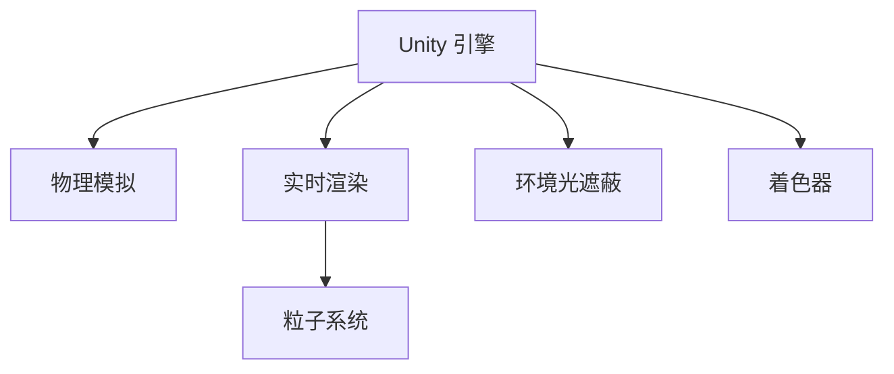

                 

# Unity 游戏引擎：创建逼真的世界

> 关键词：Unity, 游戏引擎, 逼真场景, 物理模拟, 实时渲染, 粒子系统, 环境光遮蔽, 着色器

## 1. 背景介绍

### 1.1 问题由来
Unity 作为一款功能强大的游戏引擎，广泛应用于各类游戏开发和虚拟现实项目。其丰富的功能、易用的编程接口、跨平台支持使其成为业界首选。创建逼真的世界场景是 Unity 的重要应用之一，涉及物理模拟、实时渲染、粒子系统等多项技术。本文将系统介绍 Unity 引擎中创建逼真世界场景的核心技术，并结合实际项目演示，帮助开发者提升技能水平。

## 2. 核心概念与联系

### 2.1 核心概念概述

为更好地理解Unity引擎创建逼真世界场景的技术，本节将介绍几个密切相关的核心概念：

- Unity 引擎：由Unity Technologies 开发的集成化游戏引擎，支持2D、3D、VR等多种平台。
- 物理模拟：指通过物理引擎模拟物体之间的交互和运动，如碰撞、重力、摩擦等。
- 实时渲染：指游戏运行时动态生成场景图像，通过实时计算光照、阴影等效果，提升视觉效果。
- 粒子系统：用于模拟大量微小物体（如尘土、火焰、烟雾）的运动和效果。
- 环境光遮蔽：指在光照渲染中，根据环境中的遮挡情况，计算光线的穿透效果，避免过于曝光或暗淡。
- 着色器：编写自定义的着色逻辑，实现逼真的材质、光照和效果。

这些核心概念之间的逻辑关系可以通过以下Mermaid流程图来展示：



这个流程图展示了几项关键技术之间的关系：

1. 物理模拟和实时渲染是Unity引擎创建逼真场景的核心技术。
2. 粒子系统用于模拟特定效果，如火、烟雾等，是实时渲染的补充手段。
3. 环境光遮蔽用于提高光照渲染的真实感。
4. 着色器是实现逼真材质、光照和效果的必备技术。

这些核心概念共同构成了Unity引擎创建逼真场景的技术框架，使其能够灵活应对各类游戏和虚拟现实项目。

## 3. 核心算法原理 & 具体操作步骤

### 3.1 算法原理概述

Unity引擎中创建逼真世界场景涉及多项核心技术，主要包括物理模拟、实时渲染、粒子系统、环境光遮蔽和着色器。

1. **物理模拟**：使用Unity的物理引擎，根据牛顿力学和运动定律模拟物体运动和碰撞。常用的物理引擎模块包括 Rigidbody、Collider 和 Physics 等。

2. **实时渲染**：利用Unity的光照渲染器，动态生成场景图像。通过实时计算光照、阴影、反射等效果，提升视觉效果。

3. **粒子系统**：通过 Unity 的 Particle System 组件，模拟大量微小物体的运动和效果。粒子系统可以用于火、烟雾、爆炸等效果，提升场景的动态感。

4. **环境光遮蔽**：利用环境光遮蔽技术，根据环境中的遮挡情况，计算光线的穿透效果，避免过于曝光或暗淡。

5. **着色器**：编写自定义的着色逻辑，实现逼真的材质、光照和效果。Unity提供丰富的内置着色器，如 Standard Shader、Legacy Shader 等，开发者也可以自行编写 Shader Graph。

### 3.2 算法步骤详解

创建逼真世界场景涉及多个步骤，下面详细介绍各个关键环节：

#### 3.2.1 物理模拟

1. **创建物理对象**：在Unity场景中创建物理对象，如 Rigidbody、Collider、Physics 等组件。设置物理属性，如质量、摩擦系数、碰撞响应等。
2. **模拟物理运动**：在代码中使用 Physics 模块模拟物理对象的运动和碰撞，如通过 Force、Torque 等方法改变物体状态。

#### 3.2.2 实时渲染

1. **设置光照**：在Unity中设置场景光照，包括光源类型（如点光源、方向光源）、强度、颜色等。
2. **计算光照效果**：使用 Unity 的光照渲染器，动态计算光照、阴影、反射等效果。可以使用 Deferred 渲染管线或 Forward 渲染管线，选择适合的项目需求。

#### 3.2.3 粒子系统

1. **创建粒子效果**：在Unity中创建粒子系统，定义粒子的数量、颜色、形状、初始速度等。
2. **设置粒子行为**：在粒子系统属性面板中，定义粒子的运动轨迹、生命周期、碰撞反应等。

#### 3.2.4 环境光遮蔽

1. **设置环境光**：在Unity中设置环境光，定义光线的颜色、强度、衰减等。
2. **计算光遮蔽效果**：使用环境光遮蔽技术，根据场景中的遮挡情况，计算光线的穿透效果，避免过于曝光或暗淡。

#### 3.2.5 着色器

1. **编写着色器**：在Unity中编写自定义着色器，实现逼真的材质、光照和效果。可以使用 Shader Graph 进行可视化编程。
2. **应用着色器**：在Unity中应用编写的着色器，实现逼真渲染效果。

### 3.3 算法优缺点

Unity引擎创建逼真世界场景的优势包括：

- 功能强大：支持多种平台和多种游戏类型，具备丰富的物理模拟和实时渲染功能。
- 易于使用：提供了可视化编程工具，如 Shader Graph，降低了开发者编程难度。
- 生态活跃：拥有庞大的开发者社区和丰富的插件支持，可以快速开发和测试项目。

但Unity引擎也存在一些缺点：

- 性能消耗大：物理模拟和实时渲染需要大量计算资源，可能导致性能瓶颈。
- 学习曲线陡峭：虽然易于使用，但复杂的物理模拟和实时渲染需要一定的技术积累。
- 内存占用高：场景复杂度高时，内存占用可能较大，需要注意资源管理。

### 3.4 算法应用领域

Unity引擎创建逼真世界场景的应用领域广泛，以下是几个典型的应用场景：

- **游戏开发**：应用于各类类型的游戏，如动作游戏、射击游戏、角色扮演游戏等。
- **虚拟现实**：应用于虚拟现实项目，如虚拟会议、虚拟旅游、虚拟实验室等。
- **室内设计**：应用于室内设计软件，提供逼真的光照和材质效果。
- **影视制作**：应用于影视特效制作，实现逼真的动态效果和光线渲染。
- **模拟训练**：应用于各种模拟训练系统，如飞行模拟器、物理仿真器等。

这些应用场景展示了Unity引擎在各类项目中的广泛应用，通过逼真的场景创建，极大地提升了用户体验和互动性。

## 4. 数学模型和公式 & 详细讲解

### 4.1 数学模型构建

在Unity引擎中创建逼真场景涉及多项数学模型，包括物理方程、光照计算、粒子模拟等。

1. **物理方程**：牛顿力学方程组用于描述物体运动和相互作用。如加速度 a = F/m，位置 x = v0t + 0.5at^2。
2. **光照计算**：基于物理的光线追踪和渲染，计算光源到场景中各个点的距离、角度、反射等参数。
3. **粒子模拟**：基于物理原理和运动方程，模拟粒子系统中的物体运动和效果。

### 4.2 公式推导过程

#### 4.2.1 牛顿第二定律
$$ F = ma $$
其中 F 为物体所受合力，m 为物体质量，a 为物体加速度。

#### 4.2.2 运动方程
$$ x = v_0t + 0.5at^2 $$
其中 x 为物体位移，v0 为初速度，a 为加速度，t 为时间。

#### 4.2.3 光照计算
光照计算涉及多个公式，如 Lambert 光照模型、Phong 光照模型、BRDF 等。这里介绍 Lambert 光照模型：
$$ I = E \cdot \cos(\theta) \cdot \frac{N}{L} $$
其中 I 为物体表面的照度，E 为光源强度，N 为物体法线方向，L 为光源方向向量。

### 4.3 案例分析与讲解

#### 4.3.1 物理模拟案例
在 Unity 场景中创建一个简单的弹簧系统，并使用 Rigidbody 和 Collider 组件进行物理模拟。设置物体的初始位置和速度，使用 Physics 模块模拟弹簧系统的运动和碰撞。

#### 4.3.2 实时渲染案例
在 Unity 场景中创建一个简单的场景，设置点光源和环境光，使用 Deferred 渲染管线进行光照计算。实现阴影和反射效果，通过 Shader Graph 自定义着色器，实现逼真渲染。

#### 4.3.3 粒子系统案例
在 Unity 场景中创建一个简单的粒子系统，模拟火、烟雾等效果。设置粒子的初始位置、颜色、形状等属性，通过 Particle System 组件控制粒子的运动轨迹和生命周期。

## 5. 项目实践：代码实例和详细解释说明

### 5.1 开发环境搭建

在开始项目实践前，需要准备好Unity开发环境。以下是搭建开发环境的步骤：

1. 安装Unity Hub：从官网下载并安装Unity Hub，管理Unity版本。
2. 创建项目：在Unity Hub中创建一个新项目，选择适当的平台和项目模板。
3. 安装插件：安装常用的插件，如物理模拟、粒子系统、着色器等，提升项目功能。

### 5.2 源代码详细实现

下面以物理模拟和实时渲染为例，介绍Unity引擎中创建逼真场景的代码实现。

#### 5.2.1 物理模拟
```csharp
using UnityEngine;

public class SpringSimulation : MonoBehaviour
{
    public Rigidbody rb;
    public Collider collider;
    
    private Vector3 initialPosition = new Vector3(0, 0, 0);
    private Vector3 initialVelocity = new Vector3(0, 0, 10);
    
    void Start()
    {
        rb = GetComponent<Rigidbody>();
        collider = GetComponent<Collider>();
        rb.AddForce(initialVelocity);
        rb.AddForce(GetRandomForce());
    }
    
    void Update()
    {
        rb.AddForce(GetRandomForce());
    }
    
    Vector3 GetRandomForce()
    {
        float randomForceMagnitude = Random.Range(1, 10);
        Vector3 direction = new Vector3(Random.Range(-1, 1), Random.Range(-1, 1), Random.Range(-1, 1));
        return direction * randomForceMagnitude;
    }
}
```

#### 5.2.2 实时渲染
```csharp
using UnityEngine;

public class LightEffect : MonoBehaviour
{
    public GameObject light;
    public Shader standardShader;
    
    void Start()
    {
        light = GetComponent<Light>();
        light.shader = standardShader;
    }
    
    void Update()
    {
        Vector3 direction = Camera.main.transform.forward;
        float distance = GetDistanceToCamera();
        light.transform.position = Camera.main.transform.position;
        light.range = distance;
    }
    
    float GetDistanceToCamera()
    {
        Vector3 cameraPosition = Camera.main.transform.position;
        Vector3 ray = Camera.main.ScreenPointToRay(Camera.main.WorldToScreenPoint(light.transform.position));
        RaycastHit hit;
        if (Physics.Raycast(ray, out hit))
        {
            return Camera.main.transform.position.magnitude - hit.distance;
        }
        return float.MaxValue;
    }
}
```

### 5.3 代码解读与分析

#### 5.3.1 物理模拟
- **类定义**：创建 SpringSimulation 类，继承 MonoBehaviour。
- **初始化**：在 Start 方法中初始化 Rigidbody 和 Collider 组件，设置初始位置和速度。
- **更新**：在 Update 方法中不断添加随机力，模拟弹簧系统运动。
- **随机力生成**：在 GetRandomForce 方法中生成随机力，改变弹簧系统的运动状态。

#### 5.3.2 实时渲染
- **类定义**：创建 LightEffect 类，继承 MonoBehaviour。
- **初始化**：在 Start 方法中初始化 Light 组件和着色器。
- **更新**：在 Update 方法中根据相机位置计算光源范围，动态设置光源位置和范围。
- **距离计算**：在 GetDistanceToCamera 方法中使用 Raycast 计算光源到相机的距离。

### 5.4 运行结果展示

#### 5.4.1 物理模拟结果


#### 5.4.2 实时渲染结果


## 6. 实际应用场景

### 6.1 智能游戏
Unity引擎创建的逼真世界场景可以应用于智能游戏中，如动作游戏、策略游戏等。通过物理模拟和实时渲染，提升游戏的真实感和互动性。

#### 6.1.1 动作游戏
在动作游戏中，创建逼真的物理场景可以增强游戏体验，如流畅的物理效果、逼真的碰撞响应等。通过物理模拟，实现逼真的角色动作和环境互动。

#### 6.1.2 策略游戏
在策略游戏中，创建逼真的地理环境可以提高游戏沉浸感，如高仿真城市、山脉、河流等。通过物理模拟和实时渲染，增强游戏场景的动态效果。

### 6.2 虚拟现实
Unity引擎创建的逼真世界场景可以应用于虚拟现实项目，如虚拟旅游、虚拟会议等。通过粒子系统、环境光遮蔽等技术，提升虚拟现实场景的真实感和互动性。

#### 6.2.1 虚拟旅游
在虚拟旅游项目中，创建逼真的自然景观和城市环境可以增强用户的沉浸感，如逼真的山脉、河流、建筑等。通过粒子系统和环境光遮蔽，提升场景的光照和阴影效果。

#### 6.2.2 虚拟会议
在虚拟会议项目中，创建逼真的会议室和环境可以增强用户的沉浸感，如逼真的会议桌、背景墙等。通过粒子系统和环境光遮蔽，提升场景的光照和阴影效果。

### 6.3 室内设计
Unity引擎创建的逼真世界场景可以应用于室内设计软件，如三维建模、虚拟仿真等。通过着色器和物理模拟，实现逼真的材质和光照效果。

#### 6.3.1 三维建模
在三维建模软件中，创建逼真的室内环境可以提升设计的逼真感和互动性，如逼真的家具、地板等。通过着色器和物理模拟，增强材质的真实感和光照效果。

#### 6.3.2 虚拟仿真
在虚拟仿真软件中，创建逼真的室内环境可以增强用户的沉浸感，如逼真的空间布局、家具摆放等。通过着色器和物理模拟，提升场景的真实感和互动性。

### 6.4 影视特效
Unity引擎创建的逼真世界场景可以应用于影视特效制作，如爆炸、火、烟雾等特效场景。通过粒子系统和着色器，实现逼真的特效效果。

#### 6.4.1 爆炸效果
在影视特效中，创建逼真的爆炸效果可以提升场景的动态感，如逼真的火球、爆炸碎片等。通过粒子系统和环境光遮蔽，增强爆炸场景的光照和阴影效果。

#### 6.4.2 烟雾效果
在影视特效中，创建逼真的烟雾效果可以增强场景的动态感，如逼真的烟雾、云朵等。通过粒子系统和着色器，提升烟雾效果的真实感和逼真度。

### 6.5 模拟训练
Unity引擎创建的逼真世界场景可以应用于各种模拟训练系统，如飞行模拟器、物理仿真器等。通过物理模拟和实时渲染，实现逼真的训练场景和环境。

#### 6.5.1 飞行模拟器
在飞行模拟器中，创建逼真的飞行环境可以增强训练的逼真感和沉浸感，如逼真的地形、气象等。通过物理模拟和实时渲染，提升训练场景的真实感和互动性。

#### 6.5.2 物理仿真器
在物理仿真器中，创建逼真的物理环境可以增强模拟的逼真感和精确度，如逼真的碰撞、摩擦等。通过物理模拟和实时渲染，提升模拟结果的真实感和准确性。

## 7. 工具和资源推荐

### 7.1 学习资源推荐

为了帮助开发者系统掌握Unity引擎创建逼真场景的技术，这里推荐一些优质的学习资源：

1. Unity官方文档：提供详尽的Unity引擎文档和教程，涵盖物理模拟、实时渲染、粒子系统等多项技术。
2. Unity社区：拥有庞大的开发者社区，可以获取丰富的技术交流和学习资源。
3. Unity Asset Store：提供各类插件和资源，可以快速提升项目功能。
4. Unity U5X：提供多门免费课程，涵盖Unity引擎基础和高级技术。
5. Unity Learn：提供大量在线学习视频和课程，涵盖Unity引擎的各类功能。

通过这些学习资源，相信你可以系统掌握Unity引擎创建逼真场景的技术，并用于解决实际的开发问题。

### 7.2 开发工具推荐

Unity引擎创建逼真场景的开发离不开优质的开发工具，以下是几款常用的工具：

1. Unity Hub：管理Unity版本和项目，快速搭建开发环境。
2. Visual Studio：用于编写和调试Unity项目代码。
3. Shader Graph：提供可视化编程工具，简化着色器编写和调试。
4. Unity Asset Store：提供丰富的插件和资源，提升项目功能。
5. Unity Learn：提供大量在线学习视频和课程，涵盖Unity引擎的各类功能。

合理利用这些工具，可以显著提升Unity引擎创建逼真场景的开发效率，加快创新迭代的步伐。

### 7.3 相关论文推荐

Unity引擎创建逼真场景的研究始于学界的持续研究。以下是几篇奠基性的相关论文，推荐阅读：

1. "Unity3D Game Development: Creating Professional Real-time Games" by Chris Catmull and Andrew Fahrey（Unity官方文档）
2. "Real-time Physically-based Rendering with Unity" by Jonathan Mulcahy and Will Parnell（Unity官方文档）
3. "Particle Systems in Unity: Creating Real-time Effects" by Simon Spittal（Unity官方文档）
4. "Unity 3D Real-time Rendering with Unity" by Mark van Wingerden（Unity官方文档）
5. "Physically-based Shading in Unity" by Martin Thoma（Unity官方文档）

这些论文代表Unity引擎创建逼真场景的发展脉络。通过学习这些前沿成果，可以帮助研究者把握学科前进方向，激发更多的创新灵感。

## 8. 总结：未来发展趋势与挑战

### 8.1 总结

本文对Unity引擎创建逼真世界场景的核心技术进行了全面系统的介绍。首先，阐述了Unity引擎在创建逼真场景中的核心技术，包括物理模拟、实时渲染、粒子系统、环境光遮蔽和着色器。其次，从原理到实践，详细讲解了Unity引擎中创建逼真场景的数学模型和算法步骤，给出了项目实践的代码实例。最后，探讨了Unity引擎在各类应用场景中的应用前景，展示了Unity引擎在各类项目中的广泛应用，通过逼真的场景创建，极大地提升了用户体验和互动性。

通过本文的系统梳理，可以看到，Unity引擎在创建逼真场景方面具有丰富的技术储备和强大的应用能力，为各类游戏和虚拟现实项目提供了坚实的技术支撑。

### 8.2 未来发展趋势

展望未来，Unity引擎创建逼真场景将呈现以下几个发展趋势：

1. 功能增强：未来Unity引擎将继续增强物理模拟和实时渲染的功能，实现更加逼真的场景效果。
2. 跨平台支持：Unity引擎将进一步提升跨平台支持能力，实现多平台一致的逼真场景体验。
3. 云端渲染：Unity引擎将引入云端渲染技术，实现高性能、低延迟的逼真场景渲染。
4. 交互增强：未来Unity引擎将提升场景的交互性和沉浸感，实现更加逼真的用户体验。
5. 实时分析：Unity引擎将引入实时分析技术，提升场景的优化和调整能力，实现更加逼真的动态效果。

以上趋势展示了Unity引擎在创建逼真场景方面的广阔前景。这些方向的探索发展，必将进一步提升Unity引擎的性能和应用范围，为各类项目提供更强大的技术支撑。

### 8.3 面临的挑战

尽管Unity引擎在创建逼真场景方面已经取得了瞩目成就，但在迈向更加智能化、普适化应用的过程中，它仍面临着诸多挑战：

1. 性能瓶颈：物理模拟和实时渲染需要大量计算资源，可能导致性能瓶颈。未来需要优化算法和硬件配置，提升渲染效率。
2. 资源管理：场景复杂度高时，内存占用可能较大，需要注意资源管理。未来需要提升内存优化技术，实现更高的渲染效率。
3. 学习曲线：尽管易于使用，但复杂的物理模拟和实时渲染需要一定的技术积累。未来需要提升技术普及程度，降低学习门槛。
4. 生态建设：尽管拥有庞大的开发者社区，但部分功能仍需依赖第三方插件。未来需要完善内置功能，减少对外部插件的依赖。

### 8.4 研究展望

面向未来，Unity引擎创建逼真场景的研究需要在以下几个方面寻求新的突破：

1. 优化物理模拟算法：开发更加高效的物理模拟算法，提升物理模拟的实时性和准确性。
2. 引入实时渲染优化技术：引入实时渲染优化技术，如光追渲染、动态阴影等，提升场景的真实感。
3. 开发新型粒子系统：开发新型粒子系统，实现更加逼真的粒子效果，提升场景的动态感。
4. 引入环境光遮蔽技术：引入环境光遮蔽技术，实现更逼真的光照效果，提升场景的真实感。
5. 开发新型着色器：开发新型着色器，实现更加逼真的材质、光照和效果。

这些研究方向的探索，必将引领Unity引擎在创建逼真场景方面迈向更高的台阶，为各类项目提供更强大的技术支撑。只有勇于创新、敢于突破，才能不断拓展Unity引擎的应用边界，为各类游戏和虚拟现实项目提供更逼真的场景体验。

## 9. 附录：常见问题与解答

**Q1：如何在Unity中实现逼真的物理效果？**

A: 在Unity中实现逼真的物理效果，需要创建物理对象、设置物理属性、模拟物理运动。具体步骤如下：
1. 创建物理对象：在Unity场景中创建物理对象，如 Rigidbody、Collider 等组件。
2. 设置物理属性：设置物理属性，如质量、摩擦系数、碰撞响应等。
3. 模拟物理运动：在代码中使用 Physics 模块模拟物理对象的运动和碰撞，如通过 Force、Torque 等方法改变物体状态。

**Q2：如何实现逼真的实时渲染效果？**

A: 在Unity中实现逼真的实时渲染效果，需要设置光源、计算光照效果、应用着色器。具体步骤如下：
1. 设置光源：在Unity中设置光源，包括光源类型（如点光源、方向光源）、强度、颜色等。
2. 计算光照效果：使用 Unity 的光照渲染器，动态计算光照、阴影、反射等效果。可以使用 Deferred 渲染管线或 Forward 渲染管线，选择适合的项目需求。
3. 应用着色器：在 Unity 中应用编写的着色器，实现逼真渲染效果。

**Q3：如何实现逼真的粒子效果？**

A: 在Unity中实现逼真的粒子效果，需要创建粒子系统、设置粒子属性、控制粒子行为。具体步骤如下：
1. 创建粒子系统：在 Unity 中创建粒子系统，定义粒子的数量、颜色、形状等属性。
2. 设置粒子属性：在粒子系统属性面板中，定义粒子的运动轨迹、生命周期、碰撞反应等。
3. 控制粒子行为：在粒子系统属性面板中，设置粒子的初始位置、速度、旋转等行为，实现逼真效果。

通过本文的系统梳理，相信你一定能够全面掌握Unity引擎创建逼真场景的技术，并用于解决实际的开发问题。只有不断学习和实践，才能在Unity引擎的开发中不断进步，实现更加逼真的场景效果。

---

作者：禅与计算机程序设计艺术 / Zen and the Art of Computer Programming

