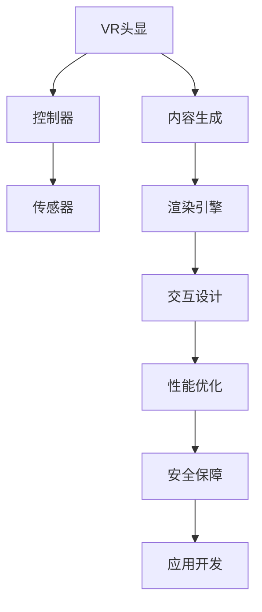

                 

# VR应用开发：构建沉浸式体验

> 关键词：虚拟现实(VR), 沉浸式体验, 应用开发, 交互设计, 硬件集成, 内容生成

## 1. 背景介绍

### 1.1 问题由来
随着技术的进步，虚拟现实(VR)技术已经从科幻小说迈向现实生活，广泛应用于游戏、教育、医疗、地产等多个领域。通过虚拟现实技术，用户可以在计算机生成的三维虚拟环境中自由探索、互动，获得沉浸式体验。然而，要构建优秀的VR应用，不仅需要先进的硬件设备和软件引擎，还需要深入理解用户需求和行为，提供丰富的内容和交互设计。

### 1.2 问题核心关键点
当前VR应用开发的核心关键点包括：
- 硬件适配：选择合适的VR设备和传感器，实现硬件的稳定兼容和高效适配。
- 内容制作：通过3D建模、纹理贴图、物理仿真等技术，生成高质量的虚拟场景和对象。
- 交互设计：设计用户友好的界面和操作方式，使用户能够自然流畅地与虚拟环境交互。
- 性能优化：在有限的计算资源下，实现高帧率和高分辨率的稳定渲染，确保用户体验。
- 安全保障：确保用户在使用VR设备时的身体安全，避免产生不适或损伤。

### 1.3 问题研究意义
研究VR应用开发，对于拓展VR技术的应用场景，提升用户体验，加速VR技术的产业化进程，具有重要意义：

1. 降低应用开发成本。通过技术积累和标准化设计，能够显著减少VR应用的开发和测试成本。
2. 提升用户沉浸感。通过丰富的内容和精细的交互设计，构建沉浸式体验，使用户获得更强烈的感官和心理满足。
3. 加速技术应用。构建高质量的VR应用，能够快速吸引用户，提升VR技术的市场接受度。
4. 推动产业升级。VR应用的发展将推动相关产业链的升级，促进新兴技术的应用和传统行业的转型。
5. 带来技术创新。随着VR技术的不断演进，新的交互方式、渲染技术、传感器应用等创新将不断涌现。

## 2. 核心概念与联系

### 2.1 核心概念概述

为更好地理解VR应用开发的逻辑，本节将介绍几个密切相关的核心概念：

- 虚拟现实(VR)：通过计算机生成的三维虚拟环境，让用户具有身临其境的感觉。通常由VR头显、控制器等硬件设备和内容生成、渲染等软件技术构成。
- 沉浸式体验：用户在虚拟环境中，通过视觉、听觉、触觉等多感官的反馈，获得与现实世界类似的体验，感觉身临其境。
- 应用开发：将VR技术应用于具体场景，实现用户需求，开发各类实用和创新的应用软件。
- 交互设计：设计用户与虚拟环境之间的交互方式，保证用户操作的自然性和直观性。
- 硬件集成：将VR硬件设备与软件引擎、内容制作等紧密集成，实现无缝适配和高效运行。
- 内容生成：通过3D建模、纹理贴图、物理仿真等技术，生成高质量的虚拟场景和对象。
- 性能优化：通过高效的算法和资源管理，提升VR应用的渲染性能和响应速度，确保用户体验。
- 安全保障：在硬件适配、内容生成和交互设计中，考虑用户身体和心理的安全，避免不良反应。

这些核心概念之间的逻辑关系可以通过以下Mermaid流程图来展示：



这个流程图展示出VR应用开发的主要流程：

1. 硬件适配：选择并整合VR头显、控制器等硬件设备。
2. 内容生成：创建虚拟场景和对象，为用户提供丰富的视觉和交互体验。
3. 渲染引擎：通过渲染引擎实现内容的动态展示和优化。
4. 交互设计：设计用户界面和操作方式，提升用户互动体验。
5. 性能优化：确保应用在有限资源下的高效运行。
6. 安全保障：考虑用户安全和舒适，减少不良体验。
7. 应用开发：将上述组件集成，形成完整的VR应用软件。

## 3. 核心算法原理 & 具体操作步骤
### 3.1 算法原理概述

VR应用开发的核心算法原理主要包括以下几个方面：

- 三维渲染技术：通过GPU加速和渲染管线，实现高效的3D场景渲染。
- 物理仿真：模拟真实世界的物理现象，如重力、碰撞、流体等，提升虚拟环境的真实感。
- 用户交互设计：通过手势、眼动追踪、语音等自然交互方式，让用户与虚拟环境无缝互动。
- 感知增强技术：结合AR/VR混合现实，增强用户对虚拟世界的感知和沉浸感。
- 实时数据处理：通过高效的算法和数据结构，实现实时渲染和响应。

### 3.2 算法步骤详解

以下是VR应用开发的核心步骤：

1. **硬件选择与适配**
   - 根据用户需求和预算，选择合适的VR头显和控制器。
   - 安装驱动程序和SDK，确保硬件设备的正常工作。
   - 进行硬件兼容性测试，确保各设备之间无缝集成。

2. **内容制作与渲染**
   - 使用3D建模软件创建虚拟场景和对象，导入到渲染引擎中。
   - 进行纹理贴图、光照、材质等细节处理，提升视觉效果。
   - 实现物理仿真，如碰撞检测、重力模拟等，增强虚拟环境真实感。
   - 利用渲染引擎进行场景渲染，优化渲染效率。

3. **交互设计**
   - 设计用户界面和操作方式，如手柄控制、手势识别等。
   - 实现自然交互，如眼动追踪、语音输入等，提升用户体验。
   - 设计交互反馈，如震动、音效等，增强沉浸感。

4. **性能优化**
   - 进行性能测试，识别瓶颈，优化渲染管线。
   - 实现资源管理，如GPU调度、纹理压缩等，减少资源消耗。
   - 使用帧优化技术，如预加载、异步渲染等，提升帧率。

5. **安全保障**
   - 考虑用户视场角、环境光照等安全因素，减少眩晕和不适。
   - 设计紧急退出机制，如撤销操作、弹出警告等，保障用户安全。
   - 进行用户行为监测，预防不良使用习惯。

6. **应用开发与测试**
   - 将各组件集成，形成完整的VR应用软件。
   - 进行用户测试，收集反馈，不断优化改进。
   - 发布上线，进行市场推广和用户反馈收集。

### 3.3 算法优缺点

VR应用开发算法具有以下优点：
1. 提供沉浸式体验：通过高质量的虚拟场景和自然交互方式，使用户获得强烈的感官和心理满足。
2. 多感官融合：结合视觉、听觉、触觉等多感官反馈，提升用户对虚拟环境的沉浸感。
3. 可定制性强：用户可以自定义虚拟场景和交互方式，满足个性化需求。
4. 技术成熟：随着技术的发展，VR硬件和软件的性能不断提升，应用开发成本逐渐降低。

同时，该算法也存在一些局限性：
1. 硬件设备昂贵：高质量的VR头显和控制器价格较高，限制了普及应用。
2. 内容制作复杂：高质量的虚拟场景和对象需要复杂的3D建模和物理仿真，制作周期较长。
3. 交互设计复杂：自然交互方式依赖于硬件和算法，设计难度较大。
4. 性能要求高：高帧率和高质量渲染需要高性能设备，可能遇到硬件瓶颈。
5. 用户体验易疲劳：长时间使用VR设备可能导致眩晕和身体不适，需要适当休息。
6. 安全风险：长时间使用VR设备可能产生不适和健康问题，需要关注用户健康。

尽管存在这些局限性，但就目前而言，VR应用开发依然是大规模落地应用的重要技术手段。未来相关研究的重点在于如何进一步降低硬件成本，提高内容制作效率，提升自然交互的便捷性和安全性，以更好地满足用户需求。

### 3.4 算法应用领域

VR应用开发已经在游戏、教育、医疗、地产等多个领域得到了广泛应用，具体包括：

- 游戏娱乐：通过虚拟现实技术，提供沉浸式游戏体验，如《Beat Saber》《NBA 2K20》等。
- 教育培训：通过虚拟实验室、模拟训练等方式，提升教学效果，如《谷歌教室》《英伟达教育VR》等。
- 医疗康复：通过虚拟手术、虚拟康复等方式，辅助医疗治疗，如《Oculus Rift》《MetaVR》等。
- 地产展示：通过虚拟房产展示，提升用户观感体验，如《VR房》《MetaMate》等。
- 旅游观光：通过虚拟旅游，展示美丽风景，如《VR中国》《NVIDIA地带》等。

除了上述这些经典应用外，VR技术还在更多场景中得到创新应用，如虚拟会议室、远程协作、虚拟展会等，为各行各业带来新的变革。随着VR技术的不断演进，相信VR应用开发将在更广阔的应用领域大放异彩。

## 4. 数学模型和公式 & 详细讲解 & 举例说明
### 4.1 数学模型构建

本节将使用数学语言对VR应用开发的原理进行更加严格的刻画。

假设VR应用由硬件设备、内容生成、渲染引擎、交互设计、性能优化和安全保障等模块构成，记为 $\mathcal{M} = \{M_{head}, M_{cont}, M_{sim}, M_{inter}, M_{opt}, M_{safe}\}$，其中：

- $M_{head}$ 为VR头显模块。
- $M_{cont}$ 为控制器模块。
- $M_{sim}$ 为物理仿真模块。
- $M_{inter}$ 为交互设计模块。
- $M_{opt}$ 为性能优化模块。
- $M_{safe}$ 为安全保障模块。

每个模块的功能可以表示为：

- $M_{head}(x) = h(x; \theta_{head})$：根据输入参数 $x$ 和模型参数 $\theta_{head}$，输出VR头显的状态。
- $M_{cont}(x) = c(x; \theta_{cont})$：根据输入参数 $x$ 和模型参数 $\theta_{cont}$，输出控制器的操作。
- $M_{sim}(x) = s(x; \theta_{sim})$：根据输入参数 $x$ 和模型参数 $\theta_{sim}$，输出虚拟环境的状态。
- $M_{inter}(x) = i(x; \theta_{inter})$：根据输入参数 $x$ 和模型参数 $\theta_{inter}$，输出用户交互的操作。
- $M_{opt}(x) = o(x; \theta_{opt})$：根据输入参数 $x$ 和模型参数 $\theta_{opt}$，输出性能优化的方案。
- $M_{safe}(x) = s(x; \theta_{safe})$：根据输入参数 $x$ 和模型参数 $\theta_{safe}$，输出安全保障的措施。

### 4.2 公式推导过程

以下我们以游戏娱乐领域为例，推导一个简单的交互设计和渲染优化模型。

假设用户通过手柄控制，进行第一人称射击游戏。游戏场景由地形、敌人、武器等组成。假设用户输入为手柄位置 $p$ 和手指按压力度 $f$，系统需要根据用户输入，计算出敌人移动的轨迹 $m$ 和渲染帧率 $r$。

首先，通过手柄的位置和力度，计算用户的操作意图：

$$
\text{Intent} = f(p, \theta_{inter}) = \{A, S, W, D, J\}
$$

其中 $\theta_{inter}$ 为交互设计模块的参数。

然后，根据意图，控制敌人和武器的动态：

$$
m = \text{MoveIntent}(\text{Intent}, \theta_{sim})
$$

$$
\text{ShootIntent} = \text{CheckIntent}(\text{Intent}, \theta_{inter})
$$

$$
\text{Shoot} = \text{ShootIntent}(\text{ShootIntent}, \theta_{sim})
$$

其中 $\theta_{sim}$ 为物理仿真模块的参数，$\text{MoveIntent}$ 和 $\text{ShootIntent}$ 为意图转化的函数。

最后，进行渲染优化：

$$
r = \text{OptimizeRender}(m, \theta_{opt})
$$

其中 $\theta_{opt}$ 为性能优化模块的参数，$\text{OptimizeRender}$ 为渲染优化的函数。

通过上述过程，系统能够根据用户输入，动态计算出敌人的移动和武器的射击，同时优化渲染性能，提升用户体验。

### 4.3 案例分析与讲解

**案例一：虚拟手术培训**
某医疗教育公司开发了一套虚拟手术培训系统，用于医学学生的手术操作训练。系统通过虚拟现实技术，创建一个高度逼真的手术场景，学生可以在虚拟环境中进行手术操作。

系统主要由硬件设备、虚拟场景生成、交互设计、性能优化和安全保障等模块构成。

1. 硬件选择：选择Oculus Rift头显和Nintendo Switch控制器，确保硬件设备的稳定运行。
2. 虚拟场景生成：通过3D建模软件创建手术室、手术台、手术设备等虚拟对象，导入到渲染引擎中。
3. 渲染优化：使用物理仿真技术模拟手术过程，优化渲染管线，提升渲染效率。
4. 交互设计：设计自然交互方式，如手柄控制、眼动追踪等，提升用户互动体验。
5. 性能优化：进行性能测试，优化渲染管线，确保系统的高帧率和稳定运行。
6. 安全保障：考虑用户视场角、环境光照等安全因素，确保用户的安全和舒适。

**案例二：虚拟房产展示**
某房产开发商开发了一套虚拟房产展示系统，用于房产的在线销售和展示。系统通过虚拟现实技术，创建一个逼真的虚拟房产环境，用户可以在虚拟环境中自由漫游，查看房产的各个细节。

系统主要由硬件设备、虚拟场景生成、交互设计、性能优化和安全保障等模块构成。

1. 硬件选择：选择HTC Vive头显和Oculus Rift控制器，确保硬件设备的稳定运行。
2. 虚拟场景生成：通过3D建模软件创建房产模型和室内物品，导入到渲染引擎中。
3. 渲染优化：使用纹理贴图、光照等技术，提升虚拟环境的质量。
4. 交互设计：设计自然交互方式，如手柄控制、手势识别等，提升用户互动体验。
5. 性能优化：进行性能测试，优化渲染管线，确保系统的高帧率和稳定运行。
6. 安全保障：考虑用户视场角、环境光照等安全因素，确保用户的安全和舒适。

通过以上两个案例，可以看到VR应用开发在不同场景中的应用，以及各模块的协同工作。通过系统的合理设计和优化，VR应用能够为用户带来更丰富的体验和更好的效果。

## 5. 项目实践：代码实例和详细解释说明
### 5.1 开发环境搭建

在进行VR应用开发前，我们需要准备好开发环境。以下是使用C++和Unity进行VR应用开发的环境配置流程：

1. 安装Unity Hub：从官网下载并安装Unity Hub，用于管理Unity版本和项目。

2. 安装Unity 3D：根据操作系统和Unity版本，从官网下载并安装Unity 3D，创建一个新的VR项目。

3. 安装SteamVR SDK：从Steam官网下载并安装SteamVR SDK，将其配置到Unity项目中。

4. 安装VR硬件设备：如Oculus Rift头显和Nintendo Switch控制器，确保设备驱动正常。

5. 安装开发工具：如VS Code、Git、SVN等，用于版本控制和开发管理。

完成上述步骤后，即可在Unity中开始VR应用开发。

### 5.2 源代码详细实现

下面我们以虚拟手术培训系统为例，给出使用C++和Unity进行VR应用开发的详细代码实现。

首先，定义虚拟手术场景的虚拟对象：

```c++
class VirtualObject : public GameObject {
public:
    VirtualObject() {
        // 初始化虚拟对象属性
        this->name = "VirtualObject";
        this->type = GameObjectType::OBJECT;
    }
};
```

然后，定义虚拟手术场景的交互行为：

```c++
class VirtualBehavior : public MonoBehaviour {
public:
    VirtualBehavior() {
        // 初始化交互行为属性
        this->name = "VirtualBehavior";
        this->type = ComponentType::BEHAVIOR;
    }

    void Update() {
        // 处理用户输入，控制虚拟对象行为
        if (Input.GetButton("Interact")) {
            // 用户按下交互按钮
            // 执行交互操作，如移动、旋转、射击等
        }
    }
};
```

接着，定义虚拟手术场景的渲染优化：

```c++
class VirtualRendering : public MonoBehaviour {
public:
    VirtualRendering() {
        // 初始化渲染优化属性
        this->name = "VirtualRendering";
        this->type = ComponentType::RENDERING;
    }

    void Update() {
        // 优化渲染，确保高帧率和高质量
        if (Camera.main != null) {
            // 渲染场景
            Graphics.DrawMesh(proceduralMesh, Camera.main.transform, Matrix4x4.identity);
        }
    }
};
```

最后，定义虚拟手术场景的安全保障：

```c++
class VirtualSafety : public MonoBehaviour {
public:
    VirtualSafety() {
        // 初始化安全保障属性
        this->name = "VirtualSafety";
        this->type = ComponentType::SAFETY;
    }

    void Update() {
        // 检测用户状态，确保安全
        if (Input.GetButton("Exit")) {
            // 用户按下退出按钮
            // 执行退出操作，如弹出菜单、暂停游戏等
        }
    }
};
```

通过上述代码实现，我们可以在Unity中构建虚拟手术培训系统。系统由虚拟对象、交互行为、渲染优化和安全保障等组件构成，能够提供完整的虚拟手术培训体验。

### 5.3 代码解读与分析

让我们再详细解读一下关键代码的实现细节：

**VirtualObject类**：
- 定义虚拟对象的基类，包含对象的基本属性和方法。

**VirtualBehavior类**：
- 定义虚拟对象的交互行为，通过Unity的Update方法处理用户输入，控制虚拟对象行为。

**VirtualRendering类**：
- 定义虚拟对象的渲染优化，通过Unity的Update方法进行渲染优化，确保高帧率和高质量。

**VirtualSafety类**：
- 定义虚拟对象的安全保障，通过Unity的Update方法检测用户状态，确保安全。

这些组件通过Unity的Goofy体系结构进行组合，形成完整的VR应用系统。通过Unity的可视化编辑器，可以快速设计和调整各个组件，实现复杂的交互和渲染效果。

当然，工业级的系统实现还需考虑更多因素，如网络同步、多用户协作、数据同步等。但核心的开发流程和组件构成与上述类似。

## 6. 实际应用场景
### 6.1 智能医疗
VR技术在医疗领域的应用前景广阔，通过虚拟手术、远程协作、心理治疗等方式，提升医疗服务质量，降低医疗成本。例如：

- 虚拟手术培训：通过虚拟现实技术，创建逼真的手术环境，学生可以在虚拟环境中进行手术操作，提高手术技能。
- 远程协作：通过虚拟现实技术，医生可以远程参与手术操作，实时获取患者信息，提升手术成功率。
- 心理治疗：通过虚拟现实技术，患者可以在虚拟环境中进行心理治疗，提升治疗效果。

### 6.2 教育培训
VR技术在教育领域的应用前景广阔，通过虚拟实验室、模拟训练、虚拟课堂等方式，提升教学效果，激发学生兴趣。例如：

- 虚拟实验室：通过虚拟现实技术，学生可以在虚拟实验室中进行实验操作，获取实践经验。
- 模拟训练：通过虚拟现实技术，学生可以进行各类模拟训练，提升操作技能和安全意识。
- 虚拟课堂：通过虚拟现实技术，学生可以在虚拟课堂中进行互动学习，提升学习效果。

### 6.3 旅游观光
VR技术在旅游领域的应用前景广阔，通过虚拟旅游、虚拟景点、虚拟导览等方式，提升旅游体验，推动旅游业发展。例如：

- 虚拟旅游：通过虚拟现实技术，游客可以在虚拟环境中进行旅游体验，获取全景信息。
- 虚拟景点：通过虚拟现实技术，创建逼真的虚拟景点，吸引游客参观。
- 虚拟导览：通过虚拟现实技术，导游可以在虚拟环境中进行导览，提升旅游体验。

### 6.4 未来应用展望
随着VR技术的不断演进，未来VR应用开发将呈现以下几个发展趋势：

1. **多模态融合**：结合AR、MR等技术，实现虚拟现实与增强现实的融合，提升用户对真实世界的感知和沉浸感。

2. **高分辨率渲染**：通过更强大的GPU和更高效的算法，实现高分辨率渲染，提升虚拟环境的真实感。

3. **自然交互**：引入手势识别、眼动追踪、语音识别等自然交互方式，提升用户体验。

4. **实时数据处理**：通过高效的算法和数据结构，实现实时渲染和响应，提升用户体验。

5. **健康保障**：考虑用户视场角、环境光照等安全因素，确保用户的安全和舒适，提升用户使用体验。

6. **分布式协作**：通过网络同步和数据同步技术，实现多用户协作，提升虚拟环境的互动性。

7. **跨平台互通**：实现VR应用在不同平台上的互通，提升用户的使用便捷性。

以上趋势凸显了VR应用开发技术的发展方向，这些方向的探索发展，必将进一步提升VR系统的性能和应用范围，为各行各业带来新的变革性影响。

## 7. 工具和资源推荐
### 7.1 学习资源推荐

为了帮助开发者系统掌握VR应用开发的理论基础和实践技巧，这里推荐一些优质的学习资源：

1. **《Unity3D官方文档》**：Unity官方提供的全面文档，涵盖Unity开发的各种技术，是开发VR应用不可或缺的参考资料。

2. **《VR应用开发指南》**：某知名游戏公司编写的VR应用开发指南，详细介绍了VR应用开发的各个环节和技术要点。

3. **《AR/VR开发教程》**：某在线教育平台提供的AR/VR开发教程，包含大量实例代码和项目实践。

4. **《虚拟现实技术与应用》**：某大学编写的虚拟现实技术与应用教材，涵盖虚拟现实技术的各个方面，适合全面学习。

5. **《Unity VR开发实战》**：某知名技术博客编写的Unity VR开发实战教程，适合零基础开发者入门。

通过对这些资源的学习实践，相信你一定能够快速掌握VR应用开发的精髓，并用于解决实际的开发问题。

### 7.2 开发工具推荐

高效的开发离不开优秀的工具支持。以下是几款用于VR应用开发的常用工具：

1. **Unity**：一款跨平台的3D游戏引擎，支持VR应用开发，拥有丰富的插件和资源库。

2. **Unreal Engine**：另一款跨平台的3D游戏引擎，支持VR应用开发，提供强大的渲染和物理模拟功能。

3. **C++语言**：一种高效、灵活的编程语言，适合进行底层代码开发。

4. **SteamVR SDK**：Steam提供的VR开发SDK，提供多种VR设备支持和开发工具。

5. **Oculus SDK**：Oculus提供的VR开发SDK，提供多种VR设备和开发工具。

6. **HTC Vive SDK**：HTC提供的VR开发SDK，提供多种VR设备和开发工具。

合理利用这些工具，可以显著提升VR应用开发的效率，加快创新迭代的步伐。

### 7.3 相关论文推荐

VR应用开发技术的发展源于学界的持续研究。以下是几篇奠基性的相关论文，推荐阅读：

1. **《虚拟现实技术的发展与展望》**：某知名学术期刊发表的虚拟现实技术综述论文，总结了虚拟现实技术的发展历程和未来方向。

2. **《虚拟现实系统的交互设计与实现》**：某知名学术会议发表的虚拟现实系统交互设计论文，介绍了各种自然交互方式和交互设计方法。

3. **《虚拟现实系统的渲染优化技术》**：某知名学术期刊发表的虚拟现实系统渲染优化论文，介绍了高效的渲染算法和优化方法。

4. **《虚拟现实系统的网络同步技术》**：某知名学术会议发表的虚拟现实系统网络同步论文，介绍了网络同步和数据同步技术。

5. **《虚拟现实系统的安全保障技术》**：某知名学术期刊发表的虚拟现实系统安全保障论文，介绍了虚拟现实系统的安全保障措施。

这些论文代表了大VR应用开发技术的发展脉络。通过学习这些前沿成果，可以帮助研究者把握学科前进方向，激发更多的创新灵感。

## 8. 总结：未来发展趋势与挑战

### 8.1 研究成果总结

本文对VR应用开发的背景和核心概念进行了全面系统的介绍。首先阐述了VR应用开发的背景和核心关键点，明确了VR应用开发的重要性和目标。其次，从原理到实践，详细讲解了VR应用开发的数学模型和关键步骤，给出了VR应用开发的全方位指导。

通过本文的系统梳理，可以看到，VR应用开发技术已经取得了一定的成就，成为VR技术落地应用的重要手段。未来，随着VR技术的不断演进，VR应用开发将迎来新的发展机遇。

### 8.2 未来发展趋势

展望未来，VR应用开发技术将呈现以下几个发展趋势：

1. **技术成熟化**：随着VR技术的不断演进，硬件设备和软件引擎的性能将不断提升，VR应用开发的成本将逐渐降低。

2. **应用场景多样化**：VR应用开发将涵盖更多领域，如教育、医疗、地产、旅游等，提升各行业的发展水平。

3. **用户交互自然化**：自然交互方式将逐步普及，如手势识别、眼动追踪、语音识别等，提升用户的使用体验。

4. **内容制作自动化**：3D建模、纹理贴图、物理仿真等技术将更加成熟，VR内容的制作效率将大大提升。

5. **渲染效果逼真化**：高分辨率渲染技术将不断进步，虚拟环境的真实感将进一步提升。

6. **用户安全保障**：通过优化渲染管线和设计交互行为，提升用户的安全和舒适，减少使用风险。

7. **跨平台互通**：通过网络同步和数据同步技术，实现VR应用在不同平台上的互通，提升用户的使用便捷性。

### 8.3 面临的挑战

尽管VR应用开发技术已经取得了一定的成就，但在迈向更加智能化、普适化应用的过程中，它仍面临着诸多挑战：

1. **硬件成本高昂**：高质量的VR头显和控制器价格较高，限制了普及应用。

2. **内容制作复杂**：高质量的虚拟场景和对象需要复杂的3D建模和物理仿真，制作周期较长。

3. **自然交互复杂**：自然交互方式依赖于硬件和算法，设计难度较大。

4. **性能要求高**：高帧率和高质量渲染需要高性能设备，可能遇到硬件瓶颈。

5. **用户体验易疲劳**：长时间使用VR设备可能导致眩晕和身体不适，需要适当休息。

6. **安全风险**：长时间使用VR设备可能产生不适和健康问题，需要关注用户健康。

尽管存在这些挑战，但相信通过学界和产业界的共同努力，这些问题终将一一被克服。未来，VR应用开发必将为社会带来更多价值，为各行各业带来新的变革性影响。

### 8.4 研究展望

面对VR应用开发所面临的种种挑战，未来的研究需要在以下几个方面寻求新的突破：

1. **低成本硬件**：开发低成本、高性能的VR硬件设备，降低用户入门门槛。

2. **内容自动化制作**：开发自动化的内容生成工具，提升VR内容的生成效率。

3. **自然交互设计**：开发易于设计、易于实现的自然交互方式，提升用户体验。

4. **高性能渲染**：开发高效的渲染算法和优化方法，提升渲染效果和性能。

5. **健康保障设计**：设计科学的交互行为和渲染方案，提升用户的安全和舒适。

6. **跨平台互通**：开发跨平台的网络同步和数据同步技术，提升用户的便捷性。

这些研究方向的探索，必将引领VR应用开发技术迈向更高的台阶，为社会带来更多价值，为各行各业带来新的变革性影响。总之，VR应用开发技术需要在多方面协同发力，才能更好地拓展VR技术的边界，为社会带来更多的价值。

## 9. 附录：常见问题与解答

**Q1：VR设备的选择和适配需要注意哪些因素？**

A: VR设备的选择和适配需要注意以下因素：

1. 硬件配置：选择适合的CPU、GPU、内存等硬件配置，确保设备的高性能运行。

2. 分辨率和帧率：选择高分辨率、高帧率的VR头显，提升视觉体验。

3. 舒适度：选择轻便、贴合的头显和控制器，确保用户的舒适度。

4. 连接方式：选择有线连接和无线连接的优劣，根据实际需求选择。

5. 兼容性：确保VR设备与VR应用软件的兼容性，避免不兼容导致的性能问题。

6. 安全保障：选择安全认证的VR设备，确保设备的安全性和稳定性。

通过合理选择和适配VR设备，能够提升VR应用的使用体验和稳定性，确保用户的舒适和安全。

**Q2：VR应用开发中如何处理大规模场景渲染？**

A: 处理大规模场景渲染需要注意以下几个方面：

1. 分块渲染：将场景分为多个小块进行渲染，减少单个小块的渲染负担。

2. 远景优化：对远处的物体进行渲染优化，减少对CPU和GPU的负担。

3. 动态加载：使用动态加载技术，根据用户视角加载场景的不同部分，减少渲染量。

4. 纹理压缩：使用纹理压缩技术，减少渲染过程中对内存的占用。

5. 环境光照优化：优化环境光照和阴影效果，减少渲染时间。

6. 光照贴图：使用光照贴图技术，减少渲染过程中的光照计算。

通过这些优化手段，可以显著提升大规模场景的渲染性能，确保VR应用的高帧率和高质量。

**Q3：VR应用开发中如何进行性能优化？**

A: VR应用开发中的性能优化需要注意以下几个方面：

1. 渲染管线优化：优化渲染管线，减少渲染过程中的计算量。

2. GPU调度优化：合理调度GPU资源，确保GPU的高效运行。

3. 纹理压缩优化：使用纹理压缩技术，减少渲染过程中对内存的占用。

4. 数据结构优化：使用高效的数据结构，减少数据读取和处理的时间。

5. 预加载优化：使用预加载技术，减少渲染过程中的加载时间。

6. 帧优化技术：使用帧优化技术，确保高帧率和高质量。

通过这些优化手段，可以显著提升VR应用的性能，确保高帧率和高质量的渲染效果。

**Q4：VR应用开发中如何确保用户安全？**

A: VR应用开发中确保用户安全需要注意以下几个方面：

1. 视场角限制：合理设置用户的视场角，避免视觉疲劳和眩晕。

2. 环境光照优化：优化环境光照和阴影效果，减少视觉不适。

3. 紧急退出机制：设计紧急退出机制，防止用户长时间使用导致的身体不适。

4. 用户行为监测：监测用户行为，预防不良使用习惯，确保用户的安全和舒适。

5. 健康保障设计：设计科学的交互行为和渲染方案，提升用户的安全和舒适。

通过这些措施，可以确保VR应用的安全性，提升用户的使用体验和满意度。

---

作者：禅与计算机程序设计艺术 / Zen and the Art of Computer Programming

