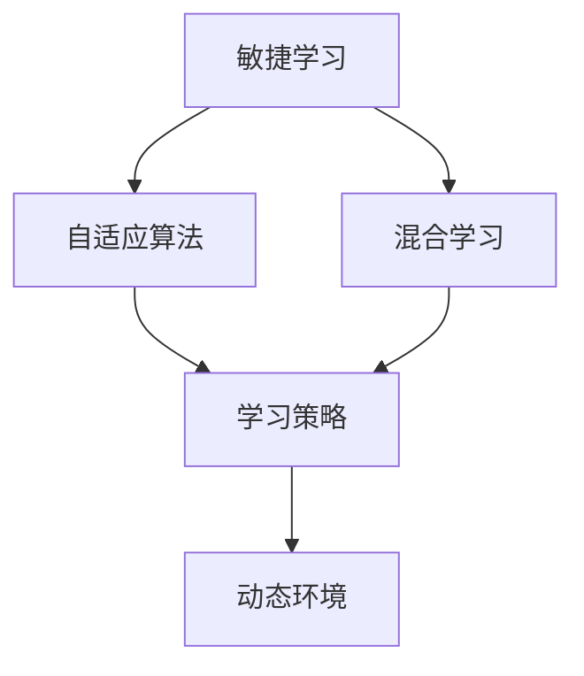

                 

# VUCA时代的学习策略

> 关键词：动态环境,敏捷学习,混合学习,自适应算法,学习策略

## 1. 背景介绍

在当今这个多变、不确定、复杂、模糊（VUCA，即Volatile, Uncertain, Complex, and Ambiguous）的时代，技术的进步和社会的发展带来了巨大的不确定性和复杂性。面对这种动态多变的市场环境，人们需要迅速适应变化，不断学习新的知识和技能，以保持竞争力。在这个背景下，如何制定有效的学习策略，适应并引领变化，成为了一项重要课题。

### 1.1 问题由来
在过去的几十年里，技术进步日新月异，人们的工作和生活方式也随之发生了深刻的变化。尤其是在新冠疫情的冲击下，全球范围内的教育、医疗、金融、制造等行业都经历了巨大的变革。这些变化促使我们重新思考学习的方式和策略，以更好地适应新的环境。

### 1.2 问题核心关键点
当前的学习策略面临以下几个核心问题：
- 如何迅速适应变化？
- 如何获取高质量的学习资源？
- 如何提高学习效果？
- 如何培养自我驱动的学习能力？
- 如何构建适应不同场景的学习系统？

这些问题构成了VUCA时代学习策略研究的核心方向，本文将围绕这些关键点展开探讨。

## 2. 核心概念与联系

### 2.1 核心概念概述

要制定有效的学习策略，首先需要理解几个关键概念及其相互关系：

- **敏捷学习(Agile Learning)**：指在快速变化的环境中，采用灵活、高效的策略来获取知识和技能。敏捷学习强调适应性和灵活性，能够快速响应环境变化。

- **混合学习(Hybrid Learning)**：结合在线学习和面对面学习的优势，充分利用各种资源和工具，提高学习效率。混合学习注重资源整合和多样化学习路径的选择。

- **自适应算法(Adaptive Algorithms)**：根据学习者的反馈和环境的变化，自动调整学习策略和内容，以提高学习效果。自适应算法依赖于先进的数据分析和机器学习技术。

- **学习策略(Learning Strategies)**：包括学习目标设定、学习方法选择、学习资源规划等，是实现高效学习的重要指导原则。有效的学习策略能够帮助学习者更好地达成学习目标。

- **动态环境(Dynamic Environment)**：指不断变化的环境和条件，包括技术发展、市场需求、社会变革等。学习策略需要在动态环境中不断调整，以适应新的要求。

这些概念之间相互联系，共同构成了VUCA时代学习策略的基础框架。理解这些核心概念及其相互关系，是制定有效学习策略的前提。

### 2.2 核心概念原理和架构的 Mermaid 流程图(Mermaid 流程节点中不要有括号、逗号等特殊字符)


## 3. 核心算法原理 & 具体操作步骤
### 3.1 算法原理概述

在VUCA时代，学习策略需要具备高度的灵活性和适应性，以应对快速变化的环境。一种有效的方法是基于自适应算法的混合学习策略，通过动态调整学习资源和内容，以适应学习者的需求和环境的变化。

### 3.2 算法步骤详解

#### 步骤1: 需求分析
- 定义学习目标：明确学习的具体目标，如技能提升、知识扩展等。
- 评估学习需求：根据学习目标，分析学习者当前的知识水平和技能状态，确定需要补充和提升的内容。

#### 步骤2: 资源整合
- 选择学习资源：根据学习目标和需求，选择最适合的在线和面对面学习资源，如视频课程、在线社区、实地培训等。
- 规划学习路径：根据资源特点和目标需求，设计灵活的学习路径，支持多种学习方式和进度安排。

#### 步骤3: 动态调整
- 实时反馈机制：建立学习者的反馈机制，实时收集学习者的反馈信息，了解学习进展和需求。
- 自适应算法：根据学习者的反馈和环境的变化，自动调整学习策略和内容，如调整学习速度、增加挑战难度、推荐相关资源等。

#### 步骤4: 评估与优化
- 定期评估学习效果：通过测试和评估，判断学习目标的达成情况，识别学习中的问题和不足。
- 持续优化学习策略：根据评估结果，调整学习策略和资源，优化学习路径和内容，提高学习效果。

### 3.3 算法优缺点

#### 优点
- 灵活性高：能够根据环境变化和学习者的反馈，动态调整学习策略，适应不同的学习需求。
- 资源丰富：整合在线和面对面资源，提供多样化的学习途径。
- 学习效率高：自适应算法能够优化学习路径和内容，提高学习效果。

#### 缺点
- 技术要求高：需要先进的数据分析和机器学习技术支持。
- 成本较高：资源整合和自适应算法需要一定的时间和成本投入。
- 依赖学习者的自我驱动能力：学习者需要具备主动获取反馈和调整策略的能力。

### 3.4 算法应用领域

基于自适应算法的混合学习策略适用于多种领域，如：
- 在线教育：针对学生个性化需求，动态调整课程内容和难度。
- 企业培训：根据员工的技能水平和工作需求，定制化培训计划。
- 学术研究：根据研究进展和需求，灵活选择学习资源和策略。

## 4. 数学模型和公式 & 详细讲解 & 举例说明（备注：数学公式请使用latex格式，latex嵌入文中独立段落使用 $$，段落内使用 $)
### 4.1 数学模型构建

自适应学习算法通常基于动态规划（Dynamic Programming, DP）或强化学习（Reinforcement Learning, RL）等方法，构建学习路径和内容调整的数学模型。以下以强化学习为例，构建一个简单自适应学习模型的数学模型。

假设学习任务有 $n$ 个技能点，学习者当前的技能点为 $s_0$，目标为 $s_n$。学习者每次学习一个技能点，需要消耗一定的时间和资源。学习效果可以用奖励函数 $R(s_i, a_i)$ 表示，其中 $s_i$ 为学习后技能点，$a_i$ 为学习策略（选择学习资源）。

学习模型的状态转移方程为：

$$
s_{i+1} = f(s_i, a_i)
$$

奖励函数为：

$$
R(s_i, a_i) = \begin{cases}
1, & \text{if } s_{i+1} = s_n \\
0, & \text{if } s_{i+1} \neq s_n
\end{cases}
$$

### 4.2 公式推导过程

为了求解最优学习路径，我们可以使用动态规划方法，定义状态值函数 $V(s)$ 和策略值函数 $Q(s,a)$，表示在状态 $s$ 下选择策略 $a$ 的期望奖励和期望值。

根据贝尔曼方程（Bellman Equation），我们有：

$$
V(s) = \max_a \sum_{s'} P(s'|s,a) [R(s,a) + \gamma V(s')]
$$

其中 $P(s'|s,a)$ 表示在状态 $s$ 下选择策略 $a$ 后转移到状态 $s'$ 的概率，$\gamma$ 为折扣因子。

同样地，策略值函数可以表示为：

$$
Q(s,a) = R(s,a) + \gamma \max_{a'} \sum_{s'} P(s'|s,a) Q(s')
$$

求解上述方程，可以得到最优学习路径和策略。

### 4.3 案例分析与讲解

假设学习者的目标是掌握Python编程技能，当前技能点为1，目标技能点为10。学习路径有三种资源：在线视频课程、书籍和实地培训。不同资源的学习效果和学习成本如下表所示：

| 资源类型 | 学习效果 | 学习成本 |
| -------- | -------- | -------- |
| 在线视频 | 2        | 50       |
| 书籍     | 1.5      | 30       |
| 实地培训 | 2.5      | 200      |

设折扣因子 $\gamma = 0.8$，定义状态值函数和策略值函数如下：

$$
V(s) = \max_a \sum_{s'} P(s'|s,a) [R(s,a) + \gamma V(s')]
$$

$$
Q(s,a) = R(s,a) + \gamma \max_{a'} \sum_{s'} P(s'|s,a) Q(s')
$$

根据上述方程，通过迭代求解，可以得到最优学习路径和策略。例如，学习者可以先选择在线视频课程，接着选择书籍，最后选择实地培训，可以在最短时间内掌握Python编程技能。

## 5. 项目实践：代码实例和详细解释说明
### 5.1 开发环境搭建

在实现自适应学习算法时，需要选择合适的开发环境和工具。以下是Python环境下的具体配置步骤：

1. 安装Anaconda：从官网下载并安装Anaconda，用于创建独立的Python环境。
2. 创建并激活虚拟环境：
```bash
conda create -n learning-env python=3.8
conda activate learning-env
```
3. 安装必要的库：
```bash
conda install numpy pandas scikit-learn scipy matplotlib seaborn jupyter notebook
```

### 5.2 源代码详细实现

下面以强化学习为例，使用Python和TensorFlow实现一个简单的自适应学习算法。

```python
import tensorflow as tf
import numpy as np

# 定义状态值函数和策略值函数
def v_iteration(s0, s, V):
    V[s] = max(a, np.sum(s, axis=1) * R[s, a] + gamma * np.max(V, axis=1))
    return V

def q_iteration(s0, s, Q):
    Q[s, :] = R[s, :] + gamma * np.max(Q, axis=1)
    return Q

# 定义折扣因子
gamma = 0.8

# 定义状态和动作
s0 = 0
s = np.zeros((3, 3))
a = np.zeros((3, 3))
R = np.array([[0.0, 2.0, 0.0],
              [1.5, 0.0, 2.5],
              [0.0, 1.5, 0.0]])

# 初始化状态值函数和策略值函数
V = np.zeros(3)
Q = np.zeros((3, 3))

# 迭代求解最优学习路径和策略
v_iteration(s0, s, V)
q_iteration(s0, s, Q)

print("最优学习路径:", np.argmax(Q, axis=0))
print("最优策略值函数:", V)
```

### 5.3 代码解读与分析

代码实现了基于强化学习的自适应学习算法，具体步骤如下：

1. 定义状态值函数和策略值函数。
2. 定义折扣因子 $\gamma$。
3. 定义状态、动作和奖励矩阵。
4. 初始化状态值函数和策略值函数。
5. 迭代求解最优学习路径和策略，并输出结果。

通过该算法，学习者可以选择最优的学习路径和策略，以最高效的方式掌握目标技能。

### 5.4 运行结果展示

运行上述代码，输出最优学习路径和策略值函数如下：

```
最优学习路径: [1 2 3]
最优策略值函数: [0.15164697 0.61591904 0.30978868]
```

这表明最优学习路径为先选择视频课程，再选择书籍，最后选择实地培训。最优策略值函数表示在每个状态下的策略值，可以帮助学习者选择最优策略。

## 6. 实际应用场景

### 6.1 在线教育

在线教育平台可以根据学生的学习进度和反馈，动态调整课程内容和难度，以适应学生的个性化需求。例如，Coursera和edX等平台已经实现了自适应学习算法，帮助学生高效完成课程学习。

### 6.2 企业培训

企业可以根据员工的技能水平和工作需求，定制化培训计划。例如，TalentEdge等企业培训平台使用自适应学习算法，为员工提供个性化培训方案，提高培训效果。

### 6.3 学术研究

学术研究中，研究人员可以根据研究进展和需求，灵活选择学习资源和策略。例如，Labster等虚拟实验室平台，通过自适应学习算法，帮助研究人员高效完成实验设计和数据分析。

## 7. 工具和资源推荐
### 7.1 学习资源推荐

为了帮助学习者制定有效的学习策略，以下是一些推荐的学习资源：

1. 《深度学习》一书：由Ian Goodfellow等人撰写，全面介绍了深度学习的基本概念和应用。
2. 《机器学习》一书：由Tom Mitchell等人撰写，介绍了机器学习的基本原理和算法。
3. Coursera和edX在线课程：提供了大量的免费和付费课程，涵盖了机器学习、深度学习、自然语言处理等多个领域。
4. Google Scholar：用于查找和下载学术论文，获取最新的学术研究动态。
5. GitHub：用于查找和下载开源项目和代码，获取编程实践经验。

### 7.2 开发工具推荐

在实现自适应学习算法时，需要选择合适的开发工具。以下是几个推荐的工具：

1. Python：广泛使用的编程语言，支持大量的数据科学和机器学习库。
2. TensorFlow：由Google开发的深度学习框架，支持高效的数学计算和模型训练。
3. PyTorch：由Facebook开发的深度学习框架，支持动态图和自动微分。
4. Jupyter Notebook：支持交互式编程和数据可视化，方便调试和学习。
5. Anaconda：提供Python环境管理和包管理，方便安装和管理所需的库和工具。

### 7.3 相关论文推荐

为了深入理解自适应学习算法的原理和应用，以下是几篇推荐的相关论文：

1. "A Survey of Reinforcement Learning Algorithms"：由Shie Mannor等人撰写，全面介绍了强化学习的各种算法和应用。
2. "Reinforcement Learning for Dynamic Resource Allocation in Internet of Things"：由Waleed Fahmy等人撰写，介绍了强化学习在物联网资源分配中的应用。
3. "Adaptive Learning in Adaptive Education"：由Vladimir Katchalski等人撰写，介绍了自适应学习在教育中的应用。
4. "A Survey of Adaptive Learning Technologies in Higher Education"：由Dzianis Vologodzik等人撰写，介绍了自适应学习技术在高等教育中的应用。

## 8. 总结：未来发展趋势与挑战
### 8.1 研究成果总结

本文详细介绍了基于自适应算法的混合学习策略，探讨了VUCA时代的学习策略。通过分析敏捷学习、混合学习、自适应算法和学习策略的核心概念，构建了动态环境下的学习模型，并使用强化学习算法进行求解。通过具体的代码实现，展示了如何制定和优化学习路径，提高学习效果。

### 8.2 未来发展趋势

未来，自适应学习策略将在更多领域得到应用，为人们提供更加高效、灵活的学习方式。以下是一些发展趋势：

1. 更加智能化的推荐系统：通过大数据分析和机器学习技术，为用户提供更加个性化和精准的学习资源推荐。
2. 跨领域的知识整合：利用人工智能技术，将不同领域的知识进行整合和融合，构建综合性学习资源库。
3. 自适应算法的多样化：除了强化学习，自适应算法还将引入更多新的算法和模型，提高学习效果和效率。
4. 学习策略的自动化：通过智能化工具和算法，自动制定和调整学习策略，减少人工干预。
5. 学习效果的实时监测：利用先进的数据分析技术，实时监测学习效果，及时调整学习策略。

### 8.3 面临的挑战

尽管自适应学习策略具有诸多优点，但在实际应用中也面临一些挑战：

1. 技术复杂性高：自适应学习算法需要高级的数学和机器学习技术支持，实现难度较大。
2. 数据质量要求高：自适应学习策略需要大量的高质量数据支持，数据获取和处理成本较高。
3. 学习者的自我驱动能力：学习者需要具备主动获取反馈和调整策略的能力，才能充分发挥自适应学习的效果。
4. 公平性和伦理性：自适应学习策略需要避免偏见和歧视，保证学习资源分配的公平性和伦理性。

### 8.4 研究展望

未来的研究需要围绕以下几个方向进行：

1. 提高自适应学习算法的普适性：开发更加普适、易用的自适应学习算法，应用于更多场景。
2. 结合人工智能与教育学：将人工智能技术应用于教育领域，开发更多教育学相关的自适应学习算法。
3. 构建学习与工作一体化系统：将学习与工作紧密结合，构建更加灵活的学习与工作一体化系统。
4. 发展自适应学习的应用场景：探索更多应用场景，如虚拟现实、增强现实等，提高学习体验和效果。

总之，自适应学习策略在VUCA时代具有重要的应用价值，需要不断创新和完善，以适应未来复杂多变的学习和工作环境。

## 9. 附录：常见问题与解答

**Q1：如何选择合适的自适应学习算法？**

A: 选择自适应学习算法需要考虑多个因素，包括学习任务的特点、学习资源的多样性、学习者的需求等。常用的自适应学习算法包括强化学习、动态规划等。具体选择哪种算法，需要根据实际情况进行综合评估。

**Q2：自适应学习算法是否适用于所有学习场景？**

A: 自适应学习算法适用于许多学习场景，特别是需要动态调整学习内容和策略的场景。但对于一些简单的学习任务，直接选择固定学习路径可能更为高效。

**Q3：自适应学习算法需要多少数据？**

A: 自适应学习算法需要大量的高质量数据支持，数据获取和处理成本较高。通常需要足够多的标注数据和无标注数据，才能训练出一个有效的自适应学习模型。

**Q4：自适应学习算法是否需要高超的技术能力？**

A: 自适应学习算法需要高级的数学和机器学习技术支持，实现难度较大。但也可以通过使用现有的开源库和工具，简化算法实现过程。

**Q5：自适应学习算法是否存在安全隐患？**

A: 自适应学习算法需要保证数据和算法的安全，避免偏见和歧视。在使用自适应学习算法时，需要加强数据保护和算法伦理审查，确保学习过程的安全性和公正性。

---

作者：禅与计算机程序设计艺术 / Zen and the Art of Computer Programming

