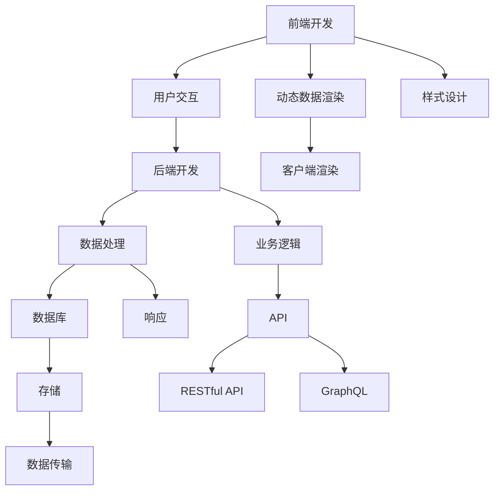

                 

# Web 应用程序开发：前端和后端

> 关键词：Web 开发, 前端开发, 后端开发, 全栈开发, React, Angular, Node.js, Express, RESTful API, GraphQL, DevOps, MVC 模式, Microservices

## 1. 背景介绍

### 1.1 问题由来

随着互联网技术的快速发展，Web 应用程序成为了现代企业和组织信息化建设的重要组成部分。Web 应用程序开发包括前端开发和后端开发两个部分，前者关注用户体验和界面设计，后者则负责数据处理和业务逻辑实现。本文将深入探讨前端和后端的开发原理、技术和实践，帮助读者构建高效、稳定、安全、易用的 Web 应用。

### 1.2 问题核心关键点

Web 应用程序开发的核心在于如何将用户界面和业务逻辑有效地结合，实现数据的展示、收集、处理和反馈。前端开发侧重于用户交互、界面设计和动态数据渲染，而后端开发则负责数据的存储、检索、计算和传输。

前端和后端开发分别需要掌握不同的技术和工具，但两者的目标一致：提供无缝的用户体验，实现高效、可靠的数据传输和处理。因此，前端和后端开发人员的紧密合作是构建优秀 Web 应用程序的关键。

## 2. 核心概念与联系

### 2.1 核心概念概述

为更好地理解前端和后端开发的技术和实践，本节将介绍几个关键概念及其相互联系：

- **前端开发**：关注用户界面和交互逻辑，使用 HTML、CSS、JavaScript 等技术实现。前端开发的目标是提供流畅、美观、易用的用户体验。
- **后端开发**：关注数据处理和业务逻辑，使用 PHP、Python、Java、Node.js 等技术实现。后端开发的目标是提供高效、安全、可靠的数据服务。
- **全栈开发**：指开发人员能够同时胜任前端和后端开发，熟悉前端和后端的开发原理和实践，能够提供端到端的解决方案。
- **RESTful API**：一种基于 HTTP 的 API 设计风格，强调资源的操作方式，如 CRUD（创建、读取、更新、删除）操作，支持 JSON、XML 等数据格式。
- **GraphQL**：一种基于查询的语言，允许客户端精确地请求所需的数据，减少不必要的数据传输，提高 API 的效率。
- **DevOps**：一种将软件开发和运维紧密结合的实践，强调持续集成、持续交付和持续监控，确保软件交付的高质量和稳定性。
- **MVC 模式**：一种软件架构设计模式，将应用程序分为模型、视图和控制器三个部分，各自负责不同的功能和职责。
- **Microservices**：一种分布式系统架构，将应用程序分解为多个小规模、独立的服务，每个服务负责特定功能，提高系统的可扩展性和灵活性。

这些概念之间的逻辑关系可以通过以下 Mermaid 流程图来展示：

这个流程图展示了前端和后端开发的主要职责和交互方式：

1. 前端开发通过 HTML、CSS、JavaScript 等技术实现用户界面和交互逻辑，动态渲染页面。
2. 后端开发通过 PHP、Python、Java、Node.js 等技术实现数据处理和业务逻辑，提供数据服务。
3. 前端和后端通过 RESTful API 或 GraphQL 等接口进行通信，实现数据的传递和处理。
4. DevOps 实践确保软件的持续集成和交付，持续监控系统的稳定性和性能。
5. Microservices 架构将应用程序分解为多个服务，提高系统的可扩展性和灵活性。
6. MVC 模式将应用程序分为模型、视图和控制器，实现组件化开发。

## 3. 核心算法原理 & 具体操作步骤

### 3.1 算法原理概述

Web 应用程序的前端和后端开发，涉及多种算法和技术，以下将详细介绍其中的一些核心算法和操作步骤。

**算法一：RESTful API 设计**

RESTful API 是一种基于 HTTP 的 API 设计风格，强调资源的定义和操作方式。其核心原理是使用标准化的 HTTP 方法（GET、POST、PUT、DELETE）对资源进行操作，支持 JSON、XML 等数据格式。

**算法二：GraphQL 查询语言**

GraphQL 是一种基于查询的语言，允许客户端精确地请求所需的数据，减少不必要的数据传输，提高 API 的效率。其核心原理是定义数据模型和查询语言，通过查询语言获取客户端所需的数据。

**算法三：DevOps 实践**

DevOps 是一种将软件开发和运维紧密结合的实践，强调持续集成、持续交付和持续监控，确保软件交付的高质量和稳定性。其核心原理是通过自动化工具和流程，提高软件开发的效率和质量，减少运维成本。

### 3.2 算法步骤详解

**步骤一：RESTful API 设计**

1. 定义资源：根据业务需求，定义 API 的资源和操作，如用户、订单、文章等。
2. 设计接口：使用标准化的 HTTP 方法（GET、POST、PUT、DELETE）对资源进行操作，如创建、读取、更新、删除等。
3. 实现接口：使用后端开发技术实现接口的逻辑和数据处理，如数据库操作、业务逻辑处理等。
4. 测试接口：使用自动化测试工具对接口进行测试，确保接口的正确性和性能。

**步骤二：GraphQL 查询语言**

1. 定义数据模型：使用 GraphQL Schema 定义数据模型，包括数据类型、字段和查询操作。
2. 编写查询语言：使用 GraphQL 查询语言编写客户端的请求，获取所需的数据。
3. 实现查询逻辑：使用后端开发技术实现查询逻辑，返回客户端所需的数据。
4. 测试查询语言：使用自动化测试工具对查询语言进行测试，确保查询的正确性和性能。

**步骤三：DevOps 实践**

1. 持续集成：使用自动化工具进行代码构建、测试和部署，确保软件的高质量和稳定性。
2. 持续交付：使用自动化工具进行软件的持续交付，提高软件交付的效率和可靠性。
3. 持续监控：使用自动化工具进行系统的持续监控，及时发现和解决问题，提高系统的稳定性和性能。

### 3.3 算法优缺点

**RESTful API 设计**

优点：

- 标准化：使用标准化的 HTTP 方法，易于理解和实现。
- 灵活性：支持多种数据格式，如 JSON、XML 等，灵活性高。
- 可扩展性：支持多种资源和操作，易于扩展。

缺点：

- 复杂性：需要设计和实现多个接口，复杂度较高。
- 性能问题：大量接口可能导致性能瓶颈，需要优化。

**GraphQL 查询语言**

优点：

- 精确性：允许客户端精确地请求所需的数据，减少不必要的数据传输。
- 灵活性：支持多种数据模型和查询语言，灵活性高。
- 效率：减少不必要的数据传输，提高 API 的效率。

缺点：

- 学习曲线：GraphQL 查询语言较为复杂，需要一定的学习成本。
- 安全性：需要仔细设计查询语言，防止安全漏洞。

**DevOps 实践**

优点：

- 效率：提高软件开发的效率和质量，减少运维成本。
- 稳定性：通过持续集成和持续交付，确保软件的高质量和稳定性。
- 可扩展性：支持多种开发和运维工具，可扩展性强。

缺点：

- 复杂性：需要设计和实现多种自动化工具和流程，复杂度较高。
- 资源消耗：需要消耗更多的计算和存储资源，成本较高。

### 3.4 算法应用领域

**RESTful API 设计**

RESTful API 设计广泛应用于 Web 应用程序的开发，如电子商务、社交网络、在线教育等。通过定义标准化的 API 接口，不同系统和平台可以方便地进行数据交换和通信。

**GraphQL 查询语言**

GraphQL 查询语言广泛应用于 Web 应用程序的开发，如移动应用、桌面应用、大数据分析等。通过精确地获取所需的数据，减少不必要的数据传输，提高应用程序的效率和用户体验。

**DevOps 实践**

DevOps 实践广泛应用于 Web 应用程序的开发和运维，如云计算、移动应用、物联网等。通过自动化工具和流程，提高软件开发的效率和质量，减少运维成本，确保软件的高质量和稳定性。

## 4. 数学模型和公式 & 详细讲解 & 举例说明

### 4.1 数学模型构建

**算法一：RESTful API 设计**

RESTful API 设计不涉及复杂的数学模型和公式，其核心在于定义资源和操作。以下是一个简单的示例：

**示例一：用户管理**

- 资源：用户（User）
- 操作：创建、读取、更新、删除（CRUD）
- 接口：/users，/users/{id}，/users/{id}/update，/users/{id}/delete

**算法二：GraphQL 查询语言**

GraphQL 查询语言涉及一些数学模型和公式，以下是一些常见的查询操作及其数学公式：

**示例二：查询用户信息**

- 查询语言：{user(id: 1){name, age}}
- 数据模型：User {name: String, age: Int}
- 查询结果：{name: "张三", age: 30}

### 4.2 公式推导过程

**示例三：查询多个字段**

- 查询语言：{user(id: 1){name, age, address{city, street}}}
- 数据模型：User {name: String, age: Int, address: {city: String, street: String}}
- 查询结果：{name: "张三", age: 30, address: {city: "北京", street: "中关村"}} 

**算法三：DevOps 实践**

DevOps 实践涉及一些基本的算法和公式，以下是一些常见的自动化流程及其数学公式：

**示例四：持续集成**

- 自动化流程：代码构建、测试、部署
- 公式：n = k * n – 1，其中 n 为迭代次数，k 为每次迭代的任务数量

**示例五：持续监控**

- 自动化流程：性能监控、错误监控、日志分析
- 公式：T = f(t)，其中 T 为系统稳定性，t 为监控时间

### 4.3 案例分析与讲解

**案例一：电商网站**

- 前端：展示商品列表、商品详情、购物车、支付页面
- 后端：商品管理、订单管理、用户管理
- RESTful API：商品列表接口、商品详情接口、订单管理接口、用户管理接口
- GraphQL：精确查询商品信息和订单信息

**案例二：社交网络**

- 前端：用户登录、发布动态、查看动态、好友管理
- 后端：用户管理、动态管理、好友管理
- RESTful API：用户登录接口、发布动态接口、查看动态接口、好友管理接口
- GraphQL：精确查询用户信息和好友信息

## 5. 项目实践：代码实例和详细解释说明

### 5.1 开发环境搭建

在 Web 应用程序开发中，前端和后端开发需要使用不同的开发环境和工具。以下是一个通用的开发环境搭建流程：

1. 前端开发环境搭建：

- 安装 Node.js
- 安装 npm 和 yarn
- 安装 IDE，如 VSCode、Sublime Text 等
- 创建项目目录和基础结构

2. 后端开发环境搭建：

- 安装 PHP、Python、Java 或 Node.js
- 安装对应的框架和工具，如 Express、Django、Spring、Koa 等
- 创建项目目录和基础结构

### 5.2 源代码详细实现

**前端开发**

- 使用 React 或 Angular 构建用户界面
- 使用 Redux 或 Vuex 管理应用状态
- 使用 Webpack 或 Rollup 打包代码

**后端开发**

- 使用 Express 或 Django 构建 RESTful API
- 使用 PostgreSQL 或 MySQL 管理数据库
- 使用 Mongoose 或 Spring Data 进行数据操作

### 5.3 代码解读与分析

以下是一个简单的 React 和 Express 开发示例：

**示例六：用户登录**

- 前端：使用 React 组件展示登录表单和登录按钮
- 后端：使用 Express 中间件处理登录请求，返回登录结果

**示例七：商品详情**

- 前端：使用 React 组件展示商品详情页面
- 后端：使用 Express 中间件处理商品详情请求，返回商品信息

### 5.4 运行结果展示

- 前端运行结果：展示登录表单和商品详情页面
- 后端运行结果：处理登录请求和商品详情请求，返回登录结果和商品信息

## 6. 实际应用场景

### 6.1 智能客服系统

基于 Web 应用程序开发的前端和后端技术，可以构建智能客服系统，提升客户服务体验。以下是智能客服系统的实际应用场景：

- 前端：提供交互式界面，展示客服聊天窗口和客户信息
- 后端：处理客户请求，查询和更新客户信息，生成客服回答
- RESTful API：查询客户信息接口、更新客户信息接口、生成客服回答接口

**示例八：智能客服系统**

- 前端：展示聊天窗口和客户信息
- 后端：处理客户请求，查询和更新客户信息，生成客服回答

### 6.2 金融风险监控

基于 Web 应用程序开发的前端和后端技术，可以构建金融风险监控系统，实时监控金融市场动态。以下是金融风险监控系统的实际应用场景：

- 前端：提供数据仪表盘和监控界面，展示市场动态和风险指标
- 后端：处理数据采集和处理，生成风险报告
- RESTful API：数据采集接口、数据处理接口、风险报告接口

**示例九：金融风险监控**

- 前端：展示数据仪表盘和监控界面
- 后端：处理数据采集和处理，生成风险报告

### 6.3 在线教育平台

基于 Web 应用程序开发的前端和后端技术，可以构建在线教育平台，提供优质教育资源。以下是在线教育平台的实际应用场景：

- 前端：提供课程展示和互动界面，展示课程内容和学生信息
- 后端：处理课程管理、学生管理和课程推荐，提供学习数据统计和分析
- GraphQL：查询课程信息和学生信息，推荐相关课程

**示例十：在线教育平台**

- 前端：展示课程展示和互动界面
- 后端：处理课程管理、学生管理和课程推荐，提供学习数据统计和分析

## 7. 工具和资源推荐

### 7.1 学习资源推荐

为了帮助开发者系统掌握 Web 应用程序开发的技术和实践，以下推荐一些优质的学习资源：

- 《Web 开发入门》系列博文：深入浅出地介绍 Web 开发的基础知识和实践技巧，包括 HTML、CSS、JavaScript、React 等。
- 《Node.js 深入浅出》系列博文：全面介绍 Node.js 的基础知识和实践技巧，包括 Node.js 环境搭建、模块管理、Express 框架等。
- 《DevOps 实践》系列博文：深入浅出地介绍 DevOps 的基础知识和实践技巧，包括持续集成、持续交付、持续监控等。
- 《RESTful API 设计》系列博文：详细介绍 RESTful API 的设计原则和实践技巧，包括资源定义、操作方式、接口实现等。
- 《GraphQL 查询语言》系列博文：详细介绍 GraphQL 查询语言的基础知识和实践技巧，包括查询语言编写、查询优化、查询缓存等。

### 7.2 开发工具推荐

为了提高 Web 应用程序开发的效率和质量，以下推荐一些常用的开发工具：

- IDE：Visual Studio Code、Sublime Text、IntelliJ IDEA 等。
- 代码管理：Git、GitHub、GitLab 等。
- 构建工具：Webpack、Rollup、Gulp 等。
- 数据管理：MySQL、PostgreSQL、MongoDB 等。
- 后端框架：Express、Django、Spring、Koa 等。

### 7.3 相关论文推荐

Web 应用程序开发领域的研究论文众多，以下是一些具有代表性的论文，推荐阅读：

- 《React 前端开发最佳实践》：介绍 React 前端开发的最佳实践，包括组件化、状态管理、性能优化等。
- 《Node.js 后端开发最佳实践》：介绍 Node.js 后端开发的最佳实践，包括模块管理、路由设计、中间件开发等。
- 《DevOps 实践指南》：介绍 DevOps 实践的指南，包括持续集成、持续交付、持续监控等。
- 《RESTful API 设计规范》：介绍 RESTful API 设计规范，包括资源定义、操作方式、接口实现等。
- 《GraphQL 查询语言设计》：介绍 GraphQL 查询语言的设计原则和实践技巧，包括查询语言编写、查询优化、查询缓存等。

## 8. 总结：未来发展趋势与挑战

### 8.1 研究成果总结

Web 应用程序开发领域的研究成果众多，以下是一些代表性的研究成果：

- React、Angular、Vue 等前端框架的广泛应用，提升了 Web 应用程序的用户体验和开发效率。
- Node.js、Django、Spring 等后端框架的不断发展，提高了 Web 应用程序的性能和稳定性。
- RESTful API、GraphQL 等 API 设计风格的广泛应用，提升了 Web 应用程序的灵活性和可扩展性。
- DevOps 实践的广泛应用，提升了 Web 应用程序的开发效率和稳定性。

### 8.2 未来发展趋势

Web 应用程序开发领域未来将呈现以下发展趋势：

- 前端框架的持续优化：React、Angular、Vue 等前端框架将不断优化性能和用户体验，提升开发效率。
- 后端框架的持续优化：Node.js、Django、Spring 等后端框架将不断优化性能和稳定性，提升开发效率。
- API 设计风格的持续优化：RESTful API、GraphQL 等 API 设计风格将不断优化设计原则和实践技巧，提升系统灵活性和可扩展性。
- DevOps 实践的持续优化：持续集成、持续交付、持续监控等 DevOps 实践将不断优化工具和流程，提升系统开发效率和稳定性。

### 8.3 面临的挑战

Web 应用程序开发领域仍面临诸多挑战：

- 技术栈的复杂性：前端和后端技术栈的选择和集成，需要开发人员具备全面的技术能力。
- 性能和稳定性：Web 应用程序的性能和稳定性问题，需要开发人员不断优化代码和系统。
- 安全性：Web 应用程序的安全性问题，需要开发人员不断加强安全防护和风险管理。
- 用户体验：Web 应用程序的用户体验问题，需要开发人员不断提升界面设计和交互逻辑。

### 8.4 研究展望

Web 应用程序开发领域未来的研究展望包括：

- 前端开发：提升前端框架的性能和用户体验，探索新的前端技术栈和开发工具。
- 后端开发：提升后端框架的性能和稳定性，探索新的后端技术栈和开发工具。
- API 设计：提升 API 设计风格的灵活性和可扩展性，探索新的 API 设计技术和实践。
- DevOps 实践：提升 DevOps 实践的自动化和智能化，探索新的 DevOps 工具和流程。

## 9. 附录：常见问题与解答

**Q1：前端和后端开发应该如何分工？**

A: 前端和后端开发应该根据项目需求和开发团队的实际情况进行分工。一般而言，前端开发负责用户界面和动态数据渲染，后端开发负责数据处理和业务逻辑实现。但在全栈开发中，开发人员可以同时胜任前端和后端开发，提供端到端的解决方案。

**Q2：如何选择前端框架和后端框架？**

A: 选择前端框架和后端框架需要考虑项目需求、技术栈、开发效率等因素。常见的前端框架包括 React、Angular、Vue，后端框架包括 Node.js、Django、Spring。开发者可以根据项目需求和技术栈选择最合适的框架，并不断优化和改进。

**Q3：如何提升 Web 应用程序的性能和稳定性？**

A: 提升 Web 应用程序的性能和稳定性需要从多个方面进行优化：前端优化包括代码压缩、图片压缩、懒加载等，后端优化包括数据库优化、缓存优化、负载均衡等。此外，可以使用 DevOps 实践进行持续集成和持续交付，提升系统的开发效率和稳定性。

**Q4：如何提升 Web 应用程序的安全性？**

A: 提升 Web 应用程序的安全性需要从多个方面进行加强：前端安全包括防止 XSS、CSRF 攻击等，后端安全包括数据加密、权限管理、漏洞扫描等。此外，可以使用 DevOps 实践进行持续监控和日志分析，及时发现和解决问题。

**Q5：如何进行 Web 应用程序的测试和部署？**

A: Web 应用程序的测试和部署需要从多个方面进行优化：前端测试包括单元测试、集成测试、性能测试等，后端测试包括单元测试、集成测试、性能测试等。此外，可以使用 DevOps 实践进行持续集成和持续交付，提高系统的开发效率和稳定性。

---

作者：禅与计算机程序设计艺术 / Zen and the Art of Computer Programming

