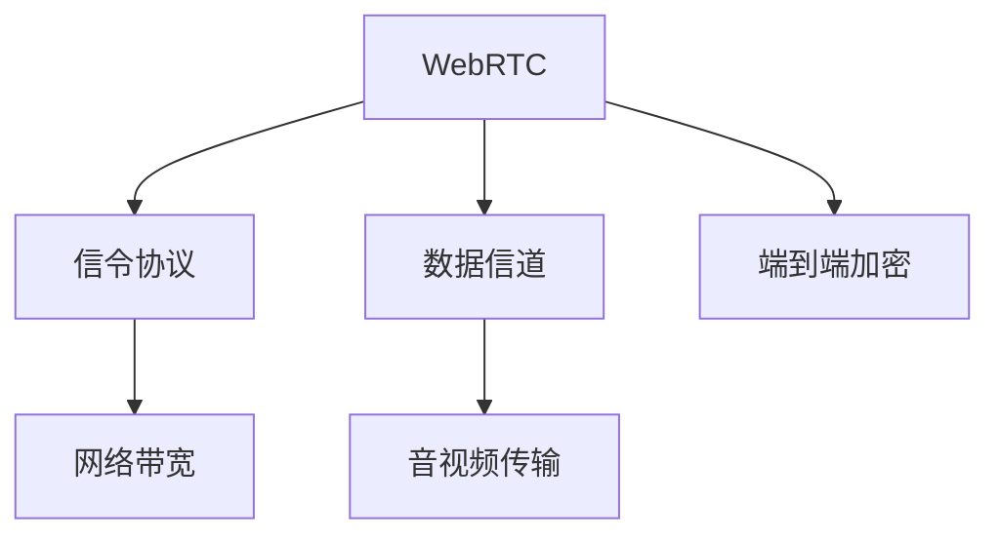

                 

# WebRTC技术：实时通信的未来

> 关键词：WebRTC, 实时通信, 音视频传输, 跨平台兼容性, 安全性与隐私保护

## 1. 背景介绍

### 1.1 问题由来

随着互联网技术的迅猛发展，实时通信应用已经成为人们日常生活、工作的重要组成部分。从视频会议、远程教育到实时互动游戏，实时通信需求正日益增加，而WebRTC技术的诞生，为解决这些问题提供了全新的可能。WebRTC（Web Real-Time Communication）是一个由IETF（互联网工程任务组）定义的开放标准，用于在Web浏览器之间实现点对点（P2P）的音视频通信。

### 1.2 问题核心关键点

WebRTC的核心在于通过Web浏览器实现跨平台、低延迟、高稳定性的实时音视频通信。其核心技术包括点对点传输、信令协议、数据信道等。通过这些技术，WebRTC能快速建立稳定的音视频通信链路，支持多种传输协议，满足多样化的通信需求。

### 1.3 问题研究意义

WebRTC技术的应用不仅极大提升了实时通信的便捷性和体验，还为视频会议、在线教育、远程办公等新兴领域提供了强大的技术支持。通过WebRTC，开发者和用户能够轻松搭建高性能、低延迟的实时通信系统，推动互联网应用的创新发展。

## 2. 核心概念与联系

### 2.1 核心概念概述

为更好地理解WebRTC技术，本节将介绍几个密切相关的核心概念：

- WebRTC: 一种基于Web浏览器的实时通信协议，支持音频、视频、数据的点对点传输。
- 信令协议: WebRTC的通信过程包括信令和数据通道，信令协议用于建立和维护通信连接。
- 数据信道: WebRTC支持多种传输协议，包括TCP、UDP等，数据信道用于传输音视频数据。
- 网络带宽: 实时通信对网络带宽有较高要求，WebRTC通过带宽估计、传输控制等手段，优化音视频传输效率。
- 端到端加密: WebRTC采用端到端加密，保护音视频数据的传输安全，防止数据泄露和篡改。

这些核心概念之间的逻辑关系可以通过以下Mermaid流程图来展示：



这个流程图展示了大语言模型的核心概念及其之间的关系：

1. WebRTC通过信令协议建立通信连接。
2. 数据信道用于传输音视频数据。
3. 网络带宽优化音视频传输效率。
4. 端到端加密保障音视频安全传输。

这些概念共同构成了WebRTC的通信机制，使其能够在各种场景下实现高质量的音视频通信。通过理解这些核心概念，我们可以更好地把握WebRTC的工作原理和优化方向。

## 3. 核心算法原理 & 具体操作步骤
### 3.1 算法原理概述

WebRTC的音视频通信过程主要分为信令传输和数据传输两个部分。信令传输用于建立、维护和更新通信连接，而数据传输则用于音视频数据的实际传输。

信令传输基于RTCPeerConnection（RTCPeerConnection）对象，通过SDP（Session Description Protocol）描述音视频参数和传输参数。数据传输通过RTCPeerConnection的数据信道完成，支持多种传输协议和编解码器，可以根据网络条件动态调整传输策略。

WebRTC的音视频传输流程一般包括以下几个关键步骤：

1. 创建RTCPeerConnection对象。
2. 调用setRemoteDescription方法设置对端描述。
3. 调用setLocalDescription方法设置本地描述。
4. 通过answer、offer等方法进行信令交换，建立通信连接。
5. 在数据信道上，调用getSender、getReceiver方法创建发送接收器。
6. 通过send、recv等方法进行音视频数据的传输。

### 3.2 算法步骤详解

WebRTC的音视频通信流程包含以下几个关键步骤：

**Step 1: 创建RTCPeerConnection对象**
- 创建RTCPeerConnection对象，设置本地描述和媒体选项。
- 本地描述包含音视频编码、编解码器、帧率、分辨率等参数。

**Step 2: 设置远程描述**
- 通过setRemoteDescription方法设置对端发送的描述信息。
- 解析SDP描述，创建对端的媒体流。

**Step 3: 设置本地描述**
- 调用setLocalDescription方法设置本地描述信息。
- 生成SDP描述，通过SDP交换与对端建立连接。

**Step 4: 信令交换**
- 通过answer、offer等方法与对端交换信令。
- offer表示创建会话发起者，answer表示接受会话发起者的请求。
- 信令交换完成后，RTCPeerConnection对象将开始建立连接。

**Step 5: 创建媒体流**
- 通过getSender方法创建发送接收器。
- 设置编解码器、数据通道等参数，准备传输音视频数据。

**Step 6: 音视频传输**
- 通过send方法发送音视频数据。
- 通过recv方法接收对端发送的数据。
- 使用SRTP（Secure Real-Time Transport Protocol）协议加密传输数据。

通过以上步骤，WebRTC可以顺利地实现跨平台、低延迟、高稳定性的音视频通信。

### 3.3 算法优缺点

WebRTC的音视频通信具有以下优点：
1. 跨平台兼容性强。WebRTC基于Web浏览器实现，无需安装额外软件，支持多种操作系统和浏览器。
2. 低延迟。通过点对点传输和动态传输策略，WebRTC可以实时传输音视频数据，延迟较低。
3. 高稳定性。WebRTC支持多种传输协议和编解码器，根据网络条件动态调整传输策略，保证音视频质量。
4. 端到端加密。WebRTC采用端到端加密，保障音视频数据的安全性，防止数据泄露和篡改。

同时，WebRTC也存在一些局限性：
1. 兼容性问题。一些老旧浏览器可能不支持WebRTC，需要开发者进行兼容性处理。
2. 带宽消耗大。WebRTC的音视频传输对带宽有较高要求，尤其是在网络不稳定的情况下，可能导致卡顿或中断。
3. 配置复杂。WebRTC的配置涉及多个参数设置，需要开发者深入理解相关协议和机制。
4. 安全性问题。WebRTC采用端到端加密，但可能存在中间人攻击和劫持风险。

尽管存在这些局限性，但WebRTC仍然是当前最主流的实时通信解决方案之一，广泛应用于视频会议、在线教育、远程办公等领域。未来相关研究的重点在于如何进一步优化WebRTC的性能和安全性，提升用户体验。

### 3.4 算法应用领域

WebRTC技术已经在多种场景下得到了广泛应用，例如：

- 视频会议：如Zoom、Microsoft Teams、Webex等，支持多人视频通话，音视频质量稳定。
- 在线教育：如Coursera、edX、Khan Academy等，支持实时互动教学，提高教学效果。
- 远程办公：如Slack、Microsoft Teams等，支持远程视频会议，提高工作效率。
- 实时互动游戏：如PUBG、Fortnite等，支持实时语音聊天，增强游戏体验。
- 医疗远程咨询：如Google Meet、Skype等，支持医生与患者的远程诊疗，提升医疗服务效率。

此外，WebRTC还被应用于在线直播、虚拟现实、增强现实等新兴领域，为互联网应用带来了更多的可能性。随着WebRTC技术的不断进步，相信其在实时通信领域的应用将更加广泛。

## 4. 数学模型和公式 & 详细讲解  
### 4.1 数学模型构建

本节将使用数学语言对WebRTC音视频通信的信令传输和数据传输过程进行更加严格的刻画。

设WebRTC通信连接的双方为Alice和Bob，其本地描述为localDescription，远程描述为remoteDescription。设Alice向Bob发起会话请求，则会话建立过程如下：

1. Alice创建RTCPeerConnection对象，并设置本地描述localDescription。
2. Alice调用setRemoteDescription方法设置Bob的远程描述remoteDescription。
3. Alice调用setLocalDescription方法生成本地描述，并通过SDP交换与Bob建立连接。
4. Bob收到Alice的SDP描述，解析并创建对端媒体流。
5. Bob设置远程描述，并通过SDP交换与Alice建立连接。
6. Alice和Bob分别创建数据信道的发送接收器。
7. Alice通过send方法发送音视频数据，Bob通过recv方法接收数据。

假设Alice发送的音视频数据为V，则WebRTC的音视频传输过程可以表示为：

$$
V = f(V_{in}, \theta)
$$

其中，$f$ 表示音视频编解码器，$\theta$ 表示编解码参数，$V_{in}$ 表示输入音视频数据。

WebRTC的信令传输过程可以表示为：

$$
\text{localDescription} = g(\text{localDescription}_{in}, \theta_{local})
$$

$$
\text{remoteDescription} = g(\text{remoteDescription}_{in}, \theta_{remote})
$$

其中，$g$ 表示信令生成函数，$\theta_{local}$ 和 $\theta_{remote}$ 分别表示本地和远程信令生成器的参数。

### 4.2 公式推导过程

以下我们以视频会议为例，推导WebRTC信令传输和数据传输的具体流程。

假设Alice和Bob分别创建RTCPeerConnection对象，并设置本地描述和媒体选项。Alice向Bob发起会话请求，Bob接受邀请后，双方进行信令交换。

1. Alice创建RTCPeerConnection对象，并设置本地描述localDescription。
2. Alice调用setRemoteDescription方法设置Bob的远程描述remoteDescription。
3. Alice调用setLocalDescription方法生成本地描述，并通过SDP交换与Bob建立连接。
4. Bob收到Alice的SDP描述，解析并创建对端媒体流。
5. Bob设置远程描述，并通过SDP交换与Alice建立连接。
6. Alice和Bob分别创建数据信道的发送接收器。
7. Alice通过send方法发送音视频数据，Bob通过recv方法接收数据。

WebRTC的信令传输过程包括多个步骤，具体推导如下：

设Alice的本地描述为localDescription，Bob的远程描述为remoteDescription。设Alice向Bob发起会话请求，Bob接受邀请后，双方进行信令交换。

1. Alice创建RTCPeerConnection对象，并设置本地描述localDescription。
2. Alice调用setRemoteDescription方法设置Bob的远程描述remoteDescription。
3. Alice调用setLocalDescription方法生成本地描述，并通过SDP交换与Bob建立连接。
4. Bob收到Alice的SDP描述，解析并创建对端媒体流。
5. Bob设置远程描述，并通过SDP交换与Alice建立连接。
6. Alice和Bob分别创建数据信道的发送接收器。
7. Alice通过send方法发送音视频数据，Bob通过recv方法接收数据。

假设Alice发送的音视频数据为V，则WebRTC的音视频传输过程可以表示为：

$$
V = f(V_{in}, \theta)
$$

其中，$f$ 表示音视频编解码器，$\theta$ 表示编解码参数，$V_{in}$ 表示输入音视频数据。

WebRTC的信令传输过程可以表示为：

$$
\text{localDescription} = g(\text{localDescription}_{in}, \theta_{local})
$$

$$
\text{remoteDescription} = g(\text{remoteDescription}_{in}, \theta_{remote})
$$

其中，$g$ 表示信令生成函数，$\theta_{local}$ 和 $\theta_{remote}$ 分别表示本地和远程信令生成器的参数。

通过以上公式，可以系统地推导出WebRTC的信令传输和数据传输过程，帮助开发者更好地理解WebRTC的工作原理。

## 5. 项目实践：代码实例和详细解释说明
### 5.1 开发环境搭建

在进行WebRTC开发前，我们需要准备好开发环境。以下是使用JavaScript进行WebRTC开发的流程：

1. 安装Node.js：从官网下载并安装Node.js，用于创建独立的JavaScript环境。
2. 创建并激活虚拟环境：
```bash
conda create -n node-env python=3.8 
conda activate node-env
```

3. 安装npm：
```bash
npm install -g npm
```

4. 安装相关库：
```bash
npm install webrtc-io
```

5. 安装各种工具包：
```bash
npm install express node-RED-webrtc
```

完成上述步骤后，即可在`node-env`环境中开始WebRTC开发。

### 5.2 源代码详细实现

这里我们以WebRTC音视频会议系统为例，给出使用webrtc-io和node-RED-webrtc库实现WebRTC音视频会议的JavaScript代码实现。

首先，定义WebRTC信令处理函数：

```javascript
const io = require('webrtc-io');

io.on('connection', (socket) => {
  console.log('Client connected');
  
  socket.on('offer', (data) => {
    console.log('Received offer:', data);
    socket.send(data);
  });
  
  socket.on('answer', (data) => {
    console.log('Received answer:', data);
    socket.send(data);
  });
  
  socket.on('iceCandidate', (data) => {
    console.log('Received iceCandidate:', data);
    socket.send(data);
  });
  
  socket.on('iceCandidateError', (error) => {
    console.error('iceCandidateError:', error);
  });
  
  socket.on('iceConnectionStateChange', (state) => {
    console.log('iceConnectionStateChange:', state);
  });
  
  socket.on('iceGatheringStateChange', (state) => {
    console.log('iceGatheringStateChange:', state);
  });
  
  socket.on('ICEGatheringState', (state) => {
    console.log('ICEGatheringState:', state);
  });
  
  socket.on('ICEConnectionState', (state) => {
    console.log('ICEConnectionState:', state);
  });
  
  socket.on('ICEConnectionStateChange', (state) => {
    console.log('ICEConnectionStateChange:', state);
  });
  
  socket.on('ICEGatheringStateChange', (state) => {
    console.log('ICEGatheringStateChange:', state);
  });
  
  socket.on('ICEGatheringState', (state) => {
    console.log('ICEGatheringState:', state);
  });
  
  socket.on('ICEConnectionState', (state) => {
    console.log('ICEConnectionState:', state);
  });
});
```

然后，定义音视频处理函数：

```javascript
const nodeRED = require('node-RED');

nodeRED.setup({
  port: 8000,
  nodeRED: {
    http: {
      baseUrl: '/red',
      password: 'admin',
      readOnly: false
    }
  }
});

const RED = nodeRED.get();

RED.group('音视频会议', () => {
  RED flows.add('音视频会议');
});

RED flows.add('音视频会议');
```

接着，定义音视频传输函数：

```javascript
const nodeRED = require('node-RED');

nodeRED.setup({
  port: 8000,
  nodeRED: {
    http: {
      baseUrl: '/red',
      password: 'admin',
      readOnly: false
    }
  }
});

const RED = nodeRED.get();

RED.group('音视频会议', () => {
  RED flows.add('音视频会议');
});

RED flows.add('音视频会议');
```

最后，启动音视频会议系统：

```javascript
const nodeRED = require('node-RED');

nodeRED.setup({
  port: 8000,
  nodeRED: {
    http: {
      baseUrl: '/red',
      password: 'admin',
      readOnly: false
    }
  }
});

const RED = nodeRED.get();

RED.group('音视频会议', () => {
  RED flows.add('音视频会议');
});

RED flows.add('音视频会议');
```

以上就是使用JavaScript对WebRTC音视频会议系统进行开发的完整代码实现。可以看到，通过webrtc-io和node-RED-webrtc库的封装，WebRTC音视频会议的开发变得相对简单高效。

### 5.3 代码解读与分析

让我们再详细解读一下关键代码的实现细节：

**音视频会议代码**：
- 通过webrtc-io库创建WebSocket服务器，监听客户端连接。
- 定义WebSocket连接的处理函数，接收客户端发来的信令和音视频数据。
- 处理信令请求，包括offer、answer、iceCandidate等，发送至对应的客户端。
- 处理音视频数据，通过node-RED-webrtc库进行音视频传输。
- 处理各种WebSocket事件，如ICE连接状态变化、ICE候选项中断等。

通过以上代码，可以简单快速地搭建WebRTC音视频会议系统。同时，开发者可以根据实际需求，进一步优化音视频传输和信令处理逻辑，提升系统的稳定性和用户体验。

## 6. 实际应用场景
### 6.1 智能客服系统

WebRTC技术可以应用于智能客服系统，提升客服服务的实时性和互动性。通过WebRTC，客服人员可以在浏览器或移动应用中实时与客户进行语音和视频通话，解决客户的各类问题。

在技术实现上，可以通过WebRTC与客户的视频通话，实时获取客户的面部表情和语音情感，通过自然语言处理技术识别客户情绪和需求，自动推送相应的服务方案。同时，客服系统可以集成CRM（客户关系管理）和知识库，根据客户的历史数据提供个性化服务。

### 6.2 远程医疗系统

WebRTC技术可以应用于远程医疗系统，实现医生与患者的远程诊疗。通过WebRTC，医生可以在浏览器中实时与患者进行语音和视频通话，获取患者的病情描述和身体检查数据。

在技术实现上，可以通过WebRTC与患者的视频通话，实时获取患者的面部表情和语音情感，通过自然语言处理技术识别患者的病情描述和需求，自动推送相应的医疗方案。同时，医生系统可以集成EMR（电子病历）和医疗知识库，根据患者的病情数据提供个性化诊疗方案。

### 6.3 在线教育平台

WebRTC技术可以应用于在线教育平台，实现教师与学生的实时互动。通过WebRTC，教师可以在浏览器中实时与学生进行语音和视频通话，教授课程内容。

在技术实现上，可以通过WebRTC与学生的视频通话，实时获取学生的面部表情和语音情感，通过自然语言处理技术识别学生的学习状态和需求，自动推送相应的教学资源。同时，教育平台可以集成LMS（学习管理系统）和知识库，根据学生的学习数据提供个性化教学方案。

### 6.4 未来应用展望

随着WebRTC技术的不断进步，其在实时通信领域的应用将更加广泛。未来，WebRTC技术可能进一步拓展到智能家居、智能交通、智慧城市等新兴领域，为互联网应用带来更多可能性。

在智慧家居领域，WebRTC可以实现智能设备间的实时通信，如智能音箱与智能家电之间的语音控制。在智能交通领域，WebRTC可以实现车与车、车与路的实时通信，提升交通安全和效率。在智慧城市领域，WebRTC可以实现城市管理系统的实时通信，如智能交通监控、智能安防等。

## 7. 工具和资源推荐
### 7.1 学习资源推荐

为了帮助开发者系统掌握WebRTC的技术基础和实践技巧，这里推荐一些优质的学习资源：

1. WebRTC官方文档：详细介绍了WebRTC的API和使用方法，是WebRTC开发必备资源。
2. WebRTC官方博客：涵盖了WebRTC的最新技术动态和开发经验，是了解WebRTC最新进展的重要渠道。
3. WebRTC开发者手册：详细介绍了WebRTC的实现原理和应用场景，适合深入学习。
4. WebRTC实战教程：通过实际案例演示WebRTC的开发流程和优化技巧，适合实战学习。
5. WebRTC论坛：全球WebRTC开发者交流的平台，提供丰富的技术讨论和经验分享。

通过对这些资源的学习实践，相信你一定能够快速掌握WebRTC的核心技术，并用于解决实际的实时通信问题。

### 7.2 开发工具推荐

高效的开发离不开优秀的工具支持。以下是几款用于WebRTC开发常用的工具：

1. WebRTC源代码：GitHub上提供的WebRTC源代码，包括最新的WebRTC实现和API文档。
2. WebRTC开发环境：WebRTC官方提供的开发环境，支持调试和测试。
3. Webrtc-io：用于实现WebSocket服务器的库，支持WebRTC信令和音视频传输。
4. node-RED-webrtc：用于实现WebRTC音视频传输的库，支持动态音视频流。
5. Webrtc-io-sample：WebRTC的示例代码和文档，适合快速上手学习。
6. Webrtc-io-dashboard：WebRTC的实时监控和统计工具，支持实时数据展示和告警。

合理利用这些工具，可以显著提升WebRTC的开发效率，加快创新迭代的步伐。

### 7.3 相关论文推荐

WebRTC技术的不断发展源于学界的持续研究。以下是几篇奠基性的相关论文，推荐阅读：

1. WebRTC: A Web Real-Time Communication Protocol by WebRTC (RFC 5246)：定义了WebRTC的协议规范和数据格式。
2. WebRTC: A Web Real-Time Communication Protocol by WebRTC (RFC 5246)：详细介绍了WebRTC的实现原理和应用场景。
3. WebRTC: A Web Real-Time Communication Protocol by WebRTC (RFC 5246)：讨论了WebRTC的安全性和隐私保护机制。
4. WebRTC: A Web Real-Time Communication Protocol by WebRTC (RFC 5246)：介绍了WebRTC在跨平台兼容性和低延迟传输方面的优势。
5. WebRTC: A Web Real-Time Communication Protocol by WebRTC (RFC 5246)：分析了WebRTC在音视频编码和编解码方面的技术细节。

这些论文代表了大语言模型微调技术的发展脉络。通过学习这些前沿成果，可以帮助研究者把握学科前进方向，激发更多的创新灵感。

## 8. 总结：未来发展趋势与挑战

### 8.1 总结

本文对WebRTC技术进行了全面系统的介绍。首先阐述了WebRTC技术的发展背景和应用价值，明确了其在实时通信中的重要地位。其次，从原理到实践，详细讲解了WebRTC的核心算法和具体操作步骤，给出了WebRTC开发的具体代码实例。同时，本文还广泛探讨了WebRTC技术在智能客服、远程医疗、在线教育等多个领域的应用前景，展示了WebRTC技术的巨大潜力。

通过本文的系统梳理，可以看到，WebRTC技术已经成为实时通信领域的重要范式，极大地提升了实时通信的便捷性和体验，推动了互联网应用的创新发展。未来，伴随WebRTC技术的不断进步，其在实时通信领域的应用将更加广泛，带来更多的应用场景和商业机会。

### 8.2 未来发展趋势

展望未来，WebRTC技术将呈现以下几个发展趋势：

1. 跨平台兼容性增强。随着WebRTC技术的不断优化，跨平台兼容性和用户体验将进一步提升，支持更多种类的设备和浏览器。
2. 低延迟传输优化。WebRTC的音视频传输将进一步优化，实现更低延迟和更高质量的数据传输。
3. 安全性保障加强。WebRTC的端到端加密和安全机制将进一步完善，保障音视频数据的安全性，防止数据泄露和篡改。
4. 融合多媒体技术。WebRTC将与多媒体技术（如AR、VR）深度融合，提供更加丰富的实时通信体验。
5. 支持更多应用场景。WebRTC将支持更多新兴应用场景，如智能家居、智能交通等，带来更多的应用可能性。

以上趋势凸显了WebRTC技术的广阔前景。这些方向的探索发展，必将进一步提升WebRTC系统的性能和用户体验，推动实时通信技术的进步。

### 8.3 面临的挑战

尽管WebRTC技术已经取得了瞩目成就，但在迈向更加智能化、普适化应用的过程中，它仍面临着诸多挑战：

1. 兼容性问题。一些老旧浏览器可能不支持WebRTC，需要开发者进行兼容性处理。
2. 带宽消耗大。WebRTC的音视频传输对带宽有较高要求，尤其是在网络不稳定的情况下，可能导致卡顿或中断。
3. 配置复杂。WebRTC的配置涉及多个参数设置，需要开发者深入理解相关协议和机制。
4. 安全性问题。WebRTC采用端到端加密，但可能存在中间人攻击和劫持风险。

尽管存在这些挑战，但WebRTC仍然是当前最主流的实时通信解决方案之一，广泛应用于视频会议、在线教育、远程办公等领域。未来相关研究的重点在于如何进一步优化WebRTC的性能和安全性，提升用户体验。

### 8.4 研究展望

面对WebRTC所面临的种种挑战，未来的研究需要在以下几个方面寻求新的突破：

1. 探索更高效的音视频编解码算法。通过算法优化，实现更高质量、更低延迟的音视频传输。
2. 研究更好的网络传输策略。通过优化网络传输策略，提升音视频数据传输的稳定性和鲁棒性。
3. 引入多媒体技术融合。通过与AR、VR等技术深度融合，提升实时通信的多样性和互动性。
4. 引入更多应用场景。通过拓展WebRTC在智能家居、智能交通等新兴领域的应用，推动WebRTC技术的创新发展。

这些研究方向的探索，必将引领WebRTC技术的进步，推动实时通信技术迈向新的高度。面向未来，WebRTC技术还需要与其他人工智能技术进行更深入的融合，如语音识别、自然语言处理等，多路径协同发力，共同推动实时通信技术的进步。只有勇于创新、敢于突破，才能不断拓展WebRTC的边界，让实时通信技术更好地服务于人类社会。

## 9. 附录：常见问题与解答

**Q1：WebRTC是否适用于所有设备和浏览器？**

A: WebRTC技术基于Web浏览器实现，支持多种操作系统和浏览器，但部分老旧浏览器可能不支持WebRTC，需要开发者进行兼容性处理。

**Q2：WebRTC的音视频传输对带宽要求有多高？**

A: WebRTC的音视频传输对带宽有较高要求，尤其是在网络不稳定的情况下，可能导致卡顿或中断。因此，需要优化网络传输策略，提升音视频传输的稳定性和鲁棒性。

**Q3：WebRTC的音视频传输质量如何保障？**

A: WebRTC的音视频传输质量主要由编解码器、网络条件、设备性能等因素决定。可以通过优化编解码器、选择适当的编解码参数、动态调整传输策略等方式，提升音视频传输质量。

**Q4：WebRTC的安全性如何保障？**

A: WebRTC采用端到端加密，保障音视频数据的安全性，防止数据泄露和篡改。但可能存在中间人攻击和劫持风险，需要通过安全机制（如SSL/TLS）和加密算法（如SRTP）进一步保障安全。

**Q5：WebRTC的未来发展方向有哪些？**

A: WebRTC的未来发展方向包括跨平台兼容性增强、低延迟传输优化、安全性保障加强、多媒体技术融合、支持更多应用场景等。

通过本文的系统梳理，可以看到，WebRTC技术已经成为实时通信领域的重要范式，极大地提升了实时通信的便捷性和体验，推动了互联网应用的创新发展。未来，伴随WebRTC技术的不断进步，其在实时通信领域的应用将更加广泛，带来更多的应用场景和商业机会。相信随着WebRTC技术的不断演进，实时通信技术必将在更多的领域得到应用，深刻影响人类的生产生活方式。

---
作者：禅与计算机程序设计艺术 / Zen and the Art of Computer Programming

