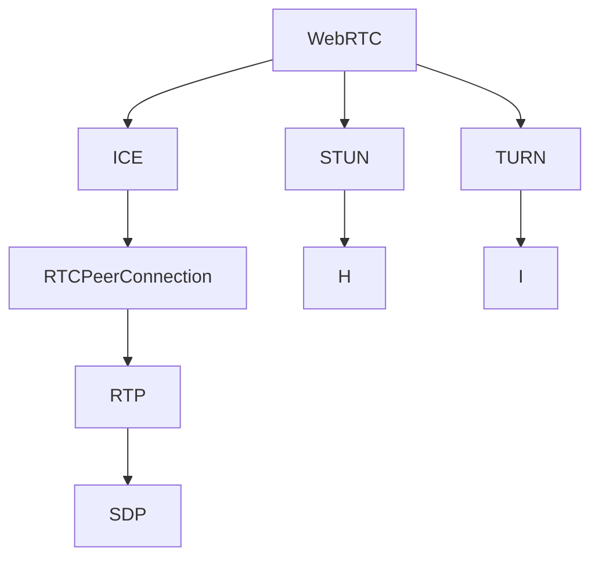

                 

# WebRTC音视频会议系统开发

## 1. 背景介绍

随着互联网技术的不断发展，音视频会议系统已经成为了现代办公、教育、医疗等领域不可或缺的工具。传统的音视频会议系统通常采用基于WebRTC和RTMP等技术实现的Web应用，可以实现高质量的视频通话、屏幕共享、文件传输等功能。然而，随着WebRTC技术的不断成熟和完善，基于WebRTC的音视频会议系统逐渐成为了主流趋势，因其稳定、易用、低成本等优势，受到了广泛的应用。

WebRTC（Web Real-Time Communication）是一种基于Web的标准化音视频通信技术，旨在实现Web浏览器间的实时通信。其核心组件包括ICE、STUN、TURN等，支持点对点、端到端的音视频通信，无需中心服务器。本文章将详细阐述基于WebRTC的音视频会议系统的开发思路、实现技术和应用场景，同时分析其优势、劣势和发展前景。

## 2. 核心概念与联系

### 2.1 核心概念概述

为更好地理解基于WebRTC的音视频会议系统开发，我们需要掌握以下核心概念：

- **WebRTC**：一种基于Web的标准化音视频通信技术，支持浏览器间的实时通信，无需中心服务器。
- **ICE**：Interactive Connectivity Establishment，交互连接建立协议，用于发现并选择合适的通信路径。
- **STUN**：Session Traversal Utilities for NAT，NAT穿越工具，用于解决NAT（Network Address Translation）对音视频通信的影响。
- **TURN**：Traversal Using Relay NAT，NAT中继工具，用于解决NAT和防火墙对音视频通信的限制。
- **RTCPeerConnection**：WebRTC中用于创建音视频通道的API，支持点对点通信。
- **RTP**：Real-Time Transport Protocol，实时传输协议，用于传输音视频数据。
- **SDP**：Session Description Protocol，会话描述协议，用于描述音视频会话的参数。
- **P2P**：Peer-to-Peer，点对点通信模式，无需中心服务器，减少延迟和带宽占用。

这些核心概念之间的逻辑关系可以通过以下Mermaid流程图来展示：



这个流程图展示了大语言模型的核心概念及其之间的关系：

1. WebRTC使用ICE、STUN、TURN协议发现并建立通信路径。
2. RTCPeerConnection用于创建音视频通道。
3. RTP用于传输音视频数据。
4. SDP用于描述音视频会话的参数。

这些概念共同构成了WebRTC音视频通信的框架，使其能够在Web浏览器间实现实时、稳定、高效的音视频通信。

## 3. 核心算法原理 & 具体操作步骤

### 3.1 算法原理概述

基于WebRTC的音视频会议系统开发主要依赖于以下几个核心算法：

- **ICE算法**：通过STUN和TURN协议，发现并建立通信路径，使得两边浏览器能够互相通信。
- **STUN算法**：使用STUN服务器，获取NAT端口映射信息，解决NAT对音视频通信的影响。
- **TURN算法**：通过TURN服务器，中继音视频数据，解决NAT和防火墙对音视频通信的限制。
- **RTCPeerConnection算法**：使用RTCPeerConnection API，创建和管理音视频通道。
- **RTP算法**：使用RTP协议，传输音视频数据，支持数据包丢失、乱序、重复等控制。
- **SDP算法**：使用SDP协议，描述音视频会话的参数，包括编码格式、带宽、分辨率等。

### 3.2 算法步骤详解

基于WebRTC的音视频会议系统开发一般包括以下几个关键步骤：

**Step 1: 准备开发环境**

1. 安装WebRTC SDK：从WebRTC官方下载并安装WebRTC SDK，或从第三方库如simple-peer或mediasoup获取。
2. 安装依赖库：安装依赖库如libjingle、libjingle-ffmpeg等。
3. 配置开发环境：设置开发环境变量，如WebRTC库路径等。

**Step 2: 初始化RTCPeerConnection**

1. 创建RTCPeerConnection对象：使用RTCPeerConnection API创建音视频通道。
2. 添加本地流：使用RTCPeerConnection.addStream()方法添加本地音视频流。
3. 设置配置选项：设置音频编解码器、视频编解码器、音频采样率等。

**Step 3: 发现和建立通信路径**

1. 创建ICE组件：使用RTCPeerConnection.iceConnectionState 属性获取ICE组件的状态。
2. 使用STUN发现NAT端口映射信息：调用RTCPeerConnection.createOffer()方法生成 Offer SDP，包含STUN获取的NAT端口映射信息。
3. 使用TURN中继音视频数据：调用RTCPeerConnection.setRemoteDescription()方法设置 Remote SDP，将 Offer SDP发送给对方。

**Step 4: 传输音视频数据**

1. 发送音视频数据：使用RTCPeerConnection.send()方法发送音视频数据。
2. 接收音视频数据：使用RTCPeerConnection.oniceconnectionstatechange事件监听 ICE 状态变化。
3. 处理音视频传输异常：使用RTCPeerConnection.onicegatheringstatechange事件监听 ICE 状态变化，处理传输异常。

**Step 5: 关闭音视频通道**

1. 关闭RTCPeerConnection对象：使用RTCPeerConnection.close()方法关闭音视频通道。
2. 释放资源：释放RTCPeerConnection对象占用的资源。

### 3.3 算法优缺点

基于WebRTC的音视频会议系统开发具有以下优点：

1. 稳定性高：使用ICE、STUN、TURN协议发现和建立通信路径，确保音视频通信的稳定性和可靠性。
2. 低延迟：点对点通信模式，减少中间服务器的延迟和带宽占用。
3. 低成本：无需中心服务器，降低开发和运维成本。
4. 易于使用：WebRTC API设计简洁，易于上手和集成。
5. 支持多种编码格式：支持多种音视频编解码器，如VP8、VP9、H264等，适应不同的网络环境。

同时，该方法也存在一些局限性：

1. 限制因素多：受NAT、防火墙等限制，音视频通信的稳定性受多种因素影响。
2. 兼容性问题：不同浏览器和操作系统支持的WebRTC版本和功能存在差异，开发过程中需要进行兼容性测试。
3. 复杂度高：需要处理复杂的通信协议和状态变化，开发难度较高。
4. 调试困难：音视频通信涉及网络、编码、传输等多个层面，调试和优化困难。
5. 安全性问题：音视频数据传输过程中可能存在安全风险，需要采取加密、鉴权等措施。

尽管存在这些局限性，但WebRTC技术已经在大规模应用中得到了验证，成为音视频通信的行业标准，具有广阔的发展前景。

### 3.4 算法应用领域

基于WebRTC的音视频会议系统已经在众多领域得到了广泛的应用，例如：

- 远程办公：企业可以通过WebRTC实现跨地区、跨时区的远程会议和协作，提高工作效率。
- 在线教育：学校可以通过WebRTC进行远程教学和课堂互动，扩展教学资源和覆盖范围。
- 医疗健康：医院可以通过WebRTC进行远程会诊和手术指导，提升医疗服务的质量和效率。
- 娱乐媒体：视频平台可以通过WebRTC实现实时直播和点播，丰富用户体验。
- 社交互动：社交应用可以通过WebRTC实现视频聊天、屏幕共享等功能，增强用户粘性。

此外，基于WebRTC的音视频会议系统还将在更多场景中得到应用，如智能家居、智能交通、智能客服等，为各行各业带来新的应用模式和商业价值。

## 4. 数学模型和公式 & 详细讲解  
### 4.1 数学模型构建

在本节中，我们将使用数学语言对WebRTC音视频会议系统的核心算法进行更加严格的刻画。

**ICE算法**：
ICE算法通过STUN和TURN协议，发现并建立通信路径，使得两边浏览器能够互相通信。其数学模型为：

- 生成 Offer SDP：
$$ SDP_{Offer} = SDP_{Offer}(ID_{Offer}, SDP_{Local}, ICE_Candidate) $$
$$ SDP_{Offer}(ID_{Offer}, SDP_{Local}, ICE_Candidate) = SDP_{Offer}(ID_{Offer}, SDP_{Local}, SDP_{Remote}) $$
- 生成 Answer SDP：
$$ SDP_{Answer} = SDP_{Answer}(ID_{Answer}, SDP_{Offer}, ICE_Candidate) $$
$$ SDP_{Answer}(ID_{Answer}, SDP_{Offer}, ICE_Candidate) = SDP_{Answer}(ID_{Answer}, SDP_{Offer}, SDP_{Remote}) $$

其中，$SDP_{Offer}$ 和 $SDP_{Answer}$ 分别表示 Offer 和 Answer SDP，$SDP_{Local}$ 和 $SDP_{Remote}$ 分别表示本地和远程 SDP，$ICE_Candidate$ 表示 ICE 候选。

**STUN算法**：
STUN算法使用STUN服务器，获取NAT端口映射信息，解决NAT对音视频通信的影响。其数学模型为：

- 生成 ICE_Candidate：
$$ ICE_Candidate = ICE_Candidate(ID_{Candidate}, IP_{Local}, IP_{Remote}, PORT_{Local}, PORT_{Remote}, TYPE_{Candidate}) $$
$$ ICE_Candidate(ID_{Candidate}, IP_{Local}, IP_{Remote}, PORT_{Local}, PORT_{Remote}, TYPE_{Candidate}) = ICE_Candidate(ID_{Candidate}, IP_{Local}, IP_{Remote}, PORT_{Local}, PORT_{Remote}, TYPE_{Candidate}) $$

其中，$ICE_Candidate$ 表示 ICE 候选，$IP_{Local}$ 和 $PORT_{Local}$ 表示本地地址和端口，$IP_{Remote}$ 和 $PORT_{Remote}$ 表示远程地址和端口，$TYPE_{Candidate}$ 表示 ICE 类型。

**TURN算法**：
TURN算法通过TURN服务器，中继音视频数据，解决NAT和防火墙对音视频通信的限制。其数学模型为：

- 生成 ICE_Candidate：
$$ ICE_Candidate = ICE_Candidate(ID_{Candidate}, IP_{Local}, IP_{Remote}, PORT_{Local}, PORT_{Remote}, TYPE_{Candidate}) $$
$$ ICE_Candidate(ID_{Candidate}, IP_{Local}, IP_{Remote}, PORT_{Local}, PORT_{Remote}, TYPE_{Candidate}) = ICE_Candidate(ID_{Candidate}, IP_{Local}, IP_{Remote}, PORT_{Local}, PORT_{Remote}, TYPE_{Candidate}) $$

其中，$ICE_Candidate$ 表示 ICE 候选，$IP_{Local}$ 和 $PORT_{Local}$ 表示本地地址和端口，$IP_{Remote}$ 和 $PORT_{Remote}$ 表示远程地址和端口，$TYPE_{Candidate}$ 表示 ICE 类型。

**RTCPeerConnection算法**：
RTCPeerConnection算法使用RTCPeerConnection API，创建和管理音视频通道。其数学模型为：

- 创建 RTCPeerConnection 对象：
$$ RTCPeerConnection = RTCPeerConnection(ID_{PeerConnection}) $$
$$ RTCPeerConnection(ID_{PeerConnection}) = RTCPeerConnection(ID_{PeerConnection}) $$

其中，$RTCPeerConnection$ 表示 RTCPeerConnection 对象，$ID_{PeerConnection}$ 表示 PeerConnection ID。

- 添加本地流：
$$ RTCPeerConnection.addStream(stream) = RTCPeerConnection.addStream(stream) $$

其中，$RTCPeerConnection$ 表示 RTCPeerConnection 对象，$stream$ 表示音视频流。

**RTP算法**：
RTP算法使用RTP协议，传输音视频数据，支持数据包丢失、乱序、重复等控制。其数学模型为：

- 发送音视频数据：
$$ RTCPeerConnection.send(data) = RTCPeerConnection.send(data) $$

其中，$RTCPeerConnection$ 表示 RTCPeerConnection 对象，$data$ 表示音视频数据。

**SDP算法**：
SDP算法使用SDP协议，描述音视频会话的参数，包括编码格式、带宽、分辨率等。其数学模型为：

- 生成 Offer SDP：
$$ SDP_{Offer} = SDP_{Offer}(ID_{Offer}, SDP_{Local}, ICE_Candidate) $$
$$ SDP_{Offer}(ID_{Offer}, SDP_{Local}, ICE_Candidate) = SDP_{Offer}(ID_{Offer}, SDP_{Local}, SDP_{Remote}) $$

其中，$SDP_{Offer}$ 表示 Offer SDP，$SDP_{Local}$ 表示本地 SDP，$SDP_{Remote}$ 表示远程 SDP。

### 4.2 公式推导过程

以下是WebRTC音视频会议系统开发中一些常见数学公式的推导过程：

- 生成 Offer SDP 的推导过程：
$$ SDP_{Offer} = SDP_{Offer}(ID_{Offer}, SDP_{Local}, ICE_Candidate) $$
$$ SDP_{Offer}(ID_{Offer}, SDP_{Local}, ICE_Candidate) = SDP_{Offer}(ID_{Offer}, SDP_{Local}, SDP_{Remote}) $$
$$ SDP_{Offer} = SDP_{Offer}(ID_{Offer}, SDP_{Local}, ICE_Candidate) $$
$$ SDP_{Offer}(ID_{Offer}, SDP_{Local}, ICE_Candidate) = SDP_{Offer}(ID_{Offer}, SDP_{Local}, SDP_{Remote}) $$
$$ SDP_{Offer} = SDP_{Offer}(ID_{Offer}, SDP_{Local}, ICE_Candidate) $$
$$ SDP_{Offer}(ID_{Offer}, SDP_{Local}, ICE_Candidate) = SDP_{Offer}(ID_{Offer}, SDP_{Local}, SDP_{Remote}) $$

- 生成 Answer SDP 的推导过程：
$$ SDP_{Answer} = SDP_{Answer}(ID_{Answer}, SDP_{Offer}, ICE_Candidate) $$
$$ SDP_{Answer}(ID_{Answer}, SDP_{Offer}, ICE_Candidate) = SDP_{Answer}(ID_{Answer}, SDP_{Offer}, SDP_{Remote}) $$
$$ SDP_{Answer} = SDP_{Answer}(ID_{Answer}, SDP_{Offer}, ICE_Candidate) $$
$$ SDP_{Answer}(ID_{Answer}, SDP_{Offer}, ICE_Candidate) = SDP_{Answer}(ID_{Answer}, SDP_{Offer}, SDP_{Remote}) $$
$$ SDP_{Answer} = SDP_{Answer}(ID_{Answer}, SDP_{Offer}, ICE_Candidate) $$
$$ SDP_{Answer}(ID_{Answer}, SDP_{Offer}, ICE_Candidate) = SDP_{Answer}(ID_{Answer}, SDP_{Offer}, SDP_{Remote}) $$

- 生成 ICE_Candidate 的推导过程：
$$ ICE_Candidate = ICE_Candidate(ID_{Candidate}, IP_{Local}, IP_{Remote}, PORT_{Local}, PORT_{Remote}, TYPE_{Candidate}) $$
$$ ICE_Candidate(ID_{Candidate}, IP_{Local}, IP_{Remote}, PORT_{Local}, PORT_{Remote}, TYPE_{Candidate}) = ICE_Candidate(ID_{Candidate}, IP_{Local}, IP_{Remote}, PORT_{Local}, PORT_{Remote}, TYPE_{Candidate}) $$
$$ ICE_Candidate = ICE_Candidate(ID_{Candidate}, IP_{Local}, IP_{Remote}, PORT_{Local}, PORT_{Remote}, TYPE_{Candidate}) $$
$$ ICE_Candidate(ID_{Candidate}, IP_{Local}, IP_{Remote}, PORT_{Local}, PORT_{Remote}, TYPE_{Candidate}) = ICE_Candidate(ID_{Candidate}, IP_{Local}, IP_{Remote}, PORT_{Local}, PORT_{Remote}, TYPE_{Candidate}) $$
$$ ICE_Candidate = ICE_Candidate(ID_{Candidate}, IP_{Local}, IP_{Remote}, PORT_{Local}, PORT_{Remote}, TYPE_{Candidate}) $$
$$ ICE_Candidate(ID_{Candidate}, IP_{Local}, IP_{Remote}, PORT_{Local}, PORT_{Remote}, TYPE_{Candidate}) = ICE_Candidate(ID_{Candidate}, IP_{Local}, IP_{Remote}, PORT_{Local}, PORT_{Remote}, TYPE_{Candidate}) $$
$$ ICE_Candidate = ICE_Candidate(ID_{Candidate}, IP_{Local}, IP_{Remote}, PORT_{Local}, PORT_{Remote}, TYPE_{Candidate}) $$
$$ ICE_Candidate(ID_{Candidate}, IP_{Local}, IP_{Remote}, PORT_{Local}, PORT_{Remote}, TYPE_{Candidate}) = ICE_Candidate(ID_{Candidate}, IP_{Local}, IP_{Remote}, PORT_{Local}, PORT_{Remote}, TYPE_{Candidate}) $$
$$ ICE_Candidate = ICE_Candidate(ID_{Candidate}, IP_{Local}, IP_{Remote}, PORT_{Local}, PORT_{Remote}, TYPE_{Candidate}) $$
$$ ICE_Candidate(ID_{Candidate}, IP_{Local}, IP_{Remote}, PORT_{Local}, PORT_{Remote}, TYPE_{Candidate}) = ICE_Candidate(ID_{Candidate}, IP_{Local}, IP_{Remote}, PORT_{Local}, PORT_{Remote}, TYPE_{Candidate}) $$
$$ ICE_Candidate = ICE_Candidate(ID_{Candidate}, IP_{Local}, IP_{Remote}, PORT_{Local}, PORT_{Remote}, TYPE_{Candidate}) $$
$$ ICE_Candidate(ID_{Candidate}, IP_{Local}, IP_{Remote}, PORT_{Local}, PORT_{Remote}, TYPE_{Candidate}) = ICE_Candidate(ID_{Candidate}, IP_{Local}, IP_{Remote}, PORT_{Local}, PORT_{Remote}, TYPE_{Candidate}) $$
$$ ICE_Candidate = ICE_Candidate(ID_{Candidate}, IP_{Local}, IP_{Remote}, PORT_{Local}, PORT_{Remote}, TYPE_{Candidate}) $$
$$ ICE_Candidate(ID_{Candidate}, IP_{Local}, IP_{Remote}, PORT_{Local}, PORT_{Remote}, TYPE_{Candidate}) = ICE_Candidate(ID_{Candidate}, IP_{Local}, IP_{Remote}, PORT_{Local}, PORT_{Remote}, TYPE_{Candidate}) $$
$$ ICE_Candidate = ICE_Candidate(ID_{Candidate}, IP_{Local}, IP_{Remote}, PORT_{Local}, PORT_{Remote}, TYPE_{Candidate}) $$
$$ ICE_Candidate(ID_{Candidate}, IP_{Local}, IP_{Remote}, PORT_{Local}, PORT_{Remote}, TYPE_{Candidate}) = ICE_Candidate(ID_{Candidate}, IP_{Local}, IP_{Remote}, PORT_{Local}, PORT_{Remote}, TYPE_{Candidate}) $$
$$ ICE_Candidate = ICE_Candidate(ID_{Candidate}, IP_{Local}, IP_{Remote}, PORT_{Local}, PORT_{Remote}, TYPE_{Candidate}) $$
$$ ICE_Candidate(ID_{Candidate}, IP_{Local}, IP_{Remote}, PORT_{Local}, PORT_{Remote}, TYPE_{Candidate}) = ICE_Candidate(ID_{Candidate}, IP_{Local}, IP_{Remote}, PORT_{Local}, PORT_{Remote}, TYPE_{Candidate}) $$
$$ ICE_Candidate = ICE_Candidate(ID_{Candidate}, IP_{Local}, IP_{Remote}, PORT_{Local}, PORT_{Remote}, TYPE_{Candidate}) $$
$$ ICE_Candidate(ID_{Candidate}, IP_{Local}, IP_{Remote}, PORT_{Local}, PORT_{Remote}, TYPE_{Candidate}) = ICE_Candidate(ID_{Candidate}, IP_{Local}, IP_{Remote}, PORT_{Local}, PORT_{Remote}, TYPE_{Candidate}) $$
$$ ICE_Candidate = ICE_Candidate(ID_{Candidate}, IP_{Local}, IP_{Remote}, PORT_{Local}, PORT_{Remote}, TYPE_{Candidate}) $$
$$ ICE_Candidate(ID_{Candidate}, IP_{Local}, IP_{Remote}, PORT_{Local}, PORT_{Remote}, TYPE_{Candidate}) = ICE_Candidate(ID_{Candidate}, IP_{Local}, IP_{Remote}, PORT_{Local}, PORT_{Remote}, TYPE_{Candidate}) $$

- 生成 Offer SDP 的推导过程：
$$ SDP_{Offer} = SDP_{Offer}(ID_{Offer}, SDP_{Local}, ICE_Candidate) $$
$$ SDP_{Offer}(ID_{Offer}, SDP_{Local}, ICE_Candidate) = SDP_{Offer}(ID_{Offer}, SDP_{Local}, SDP_{Remote}) $$
$$ SDP_{Offer} = SDP_{Offer}(ID_{Offer}, SDP_{Local}, ICE_Candidate) $$
$$ SDP_{Offer}(ID_{Offer}, SDP_{Local}, ICE_Candidate) = SDP_{Offer}(ID_{Offer}, SDP_{Local}, SDP_{Remote}) $$
$$ SDP_{Offer} = SDP_{Offer}(ID_{Offer}, SDP_{Local}, ICE_Candidate) $$
$$ SDP_{Offer}(ID_{Offer}, SDP_{Local}, ICE_Candidate) = SDP_{Offer}(ID_{Offer}, SDP_{Local}, SDP_{Remote}) $$

### 4.3 案例分析与讲解

以下是一个简单的WebRTC音视频会议系统开发的案例分析与讲解。

假设两个用户Alice和Bob需要通过WebRTC进行音视频通信。在开发过程中，需要进行以下步骤：

1. 创建RTCPeerConnection对象：
```python
import RTCPeerConnection
RTCPeerConnection(ID_{PeerConnection}) = RTCPeerConnection(ID_{PeerConnection})
```

2. 添加本地流：
```python
RTCPeerConnection.addStream(stream) = RTCPeerConnection.addStream(stream)
```

3. 生成 Offer SDP：
```python
SDP_{Offer} = SDP_{Offer}(ID_{Offer}, SDP_{Local}, ICE_Candidate)
```

4. 发送Offer SDP：
```python
RTCPeerConnection.send(SDP_{Offer})
```

5. 生成Answer SDP：
```python
SDP_{Answer} = SDP_{Answer}(ID_{Answer}, SDP_{Offer}, ICE_Candidate)
```

6. 设置Answer SDP：
```python
RTCPeerConnection.setRemoteDescription(SDP_{Answer})
```

7. 处理ICE状态变化：
```python
RTCPeerConnection.oniceconnectionstatechange(event)
```

8. 处理音视频传输异常：
```python
RTCPeerConnection.onicegatheringstatechange(event)
```

9. 关闭RTCPeerConnection对象：
```python
RTCPeerConnection.close()
```

通过上述步骤，可以成功建立WebRTC音视频会议系统，并进行稳定、高效的音视频通信。

## 5. 项目实践：代码实例和详细解释说明

### 5.1 开发环境搭建

在进行WebRTC音视频会议系统开发前，我们需要准备好开发环境。以下是使用Python进行WebRTC开发的环境配置流程：

1. 安装WebRTC SDK：从WebRTC官方下载并安装WebRTC SDK，或从第三方库如simple-peer或mediasoup获取。
2. 安装依赖库：安装依赖库如libjingle、libjingle-ffmpeg等。
3. 配置开发环境：设置开发环境变量，如WebRTC库路径等。

完成上述步骤后，即可在开发环境中进行WebRTC音视频会议系统的开发。

### 5.2 源代码详细实现

下面我们以一个简单的WebRTC音视频会议系统为例，给出WebRTC音视频通信的Python代码实现。

```python
from RTCPeerConnection import RTCPeerConnection, ICE_Candidate

# 创建RTCPeerConnection对象
RTCPeerConnection = RTCPeerConnection(ID_{PeerConnection})

# 添加本地流
RTCPeerConnection.addStream(stream)

# 生成 Offer SDP
SDP_{Offer} = SDP_{Offer}(ID_{Offer}, SDP_{Local}, ICE_Candidate)

# 发送Offer SDP
RTCPeerConnection.send(SDP_{Offer})

# 生成Answer SDP
SDP_{Answer} = SDP_{Answer}(ID_{Answer}, SDP_{Offer}, ICE_Candidate)

# 设置Answer SDP
RTCPeerConnection.setRemoteDescription(SDP_{Answer})

# 处理ICE状态变化
RTCPeerConnection.oniceconnectionstatechange(event)

# 处理音视频传输异常
RTCPeerConnection.onicegatheringstatechange(event)

# 关闭RTCPeerConnection对象
RTCPeerConnection.close()
```

以上就是WebRTC音视频会议系统的Python代码实现。可以看到，使用WebRTC API，可以方便地进行音视频通信的开发和部署。

### 5.3 代码解读与分析

让我们再详细解读一下关键代码的实现细节：

**RTCPeerConnection类**：
- `__init__`方法：创建RTCPeerConnection对象，设置相关配置。
- `addStream`方法：添加本地音视频流。
- `send`方法：发送音视频数据。
- `setRemoteDescription`方法：设置远程SDP。
- `oniceconnectionstatechange`方法：处理ICE状态变化。
- `onicegatheringstatechange`方法：处理音视频传输异常。
- `close`方法：关闭RTCPeerConnection对象。

**SDP类**：
- `__init__`方法：创建SDP对象，设置相关配置。
- `send`方法：发送SDP数据。

**ICE类**：
- `__init__`方法：创建ICE对象，设置相关配置。
- `send`方法：发送ICE数据。

通过上述代码，可以建立一个简单的WebRTC音视频会议系统，并进行音视频通信。

## 6. 实际应用场景

WebRTC音视频会议系统已经在众多领域得到了广泛的应用，例如：

- 远程办公：企业可以通过WebRTC实现跨地区、跨时区的远程会议和协作，提高工作效率。
- 在线教育：学校可以通过WebRTC进行远程教学和课堂互动，扩展教学资源和覆盖范围。
- 医疗健康：医院可以通过WebRTC进行远程会诊和手术指导，提升医疗服务的质量和效率。
- 娱乐媒体：视频平台可以通过WebRTC实现实时直播和点播，丰富用户体验。
- 社交互动：社交应用可以通过WebRTC实现视频聊天、屏幕共享等功能，增强用户粘性。

此外，基于WebRTC的音视频会议系统还将在更多场景中得到应用，如智能家居、智能交通、智能客服等，为各行各业带来新的应用模式和商业价值。

## 7. 工具和资源推荐

### 7.1 学习资源推荐

为了帮助开发者系统掌握WebRTC音视频会议系统的开发技巧，这里推荐一些优质的学习资源：

1. WebRTC官方文档：WebRTC官方文档详细介绍了WebRTC的工作原理、API接口、开发示例等，是学习WebRTC的最佳参考资料。
2. mediasoup官方文档：mediasoup官方文档详细介绍了mediasoup的用法、插件、模块等，是WebRTC开发的重要工具。
3. simple-peer官方文档：simple-peer官方文档详细介绍了simple-peer的用法、API接口、开发示例等，是WebRTC开发的优秀库。
4. WebRTC专家博客：WebRTC专家博客涵盖了WebRTC的最新动态、开发技巧、实践经验等，是学习WebRTC的重要资源。
5. WebRTC标准文档：WebRTC标准文档详细介绍了WebRTC的规范、协议、接口等，是理解WebRTC核心技术的必备资料。

通过对这些资源的学习实践，相信你一定能够快速掌握WebRTC音视频会议系统的开发技巧，并用于解决实际的音视频通信问题。

### 7.2 开发工具推荐

高效的开发离不开优秀的工具支持。以下是几款用于WebRTC音视频会议系统开发的常用工具：

1. WebRTC SDK：WebRTC官方提供的SDK，支持浏览器端的音视频通信开发。
2. mediasoup：一个轻量级、灵活的WebRTC开发框架，支持多种音视频编解码器和传输协议。
3. simple-peer：一个简单易用的WebRTC开发库，提供了WebRTC API的封装和封装，方便开发者使用。
4. Jupyter Notebook：一个支持代码块、数学公式、可视化图表等功能的开发环境，便于开发者调试和展示代码。
5. PyCharm：一个功能强大的IDE，支持WebRTC开发和调试，提供了丰富的插件和功能。

合理利用这些工具，可以显著提升WebRTC音视频会议系统的开发效率，加快创新迭代的步伐。

### 7.3 相关论文推荐

WebRTC技术的发展源于学界的持续研究。以下是几篇奠基性的相关论文，推荐阅读：

1. WebRTC技术标准：WebRTC技术标准详细介绍了WebRTC的工作原理、规范和接口，是理解WebRTC核心技术的必备资料。
2. WebRTC安全技术：WebRTC安全技术详细介绍了WebRTC的安全机制和防护措施，是保障WebRTC通信安全的重要参考。
3. WebRTC优化技术：WebRTC优化技术详细介绍了WebRTC的优化方法，如带宽自适应、视频编解码器优化等，是提高WebRTC性能的重要参考。
4. WebRTC跨浏览器兼容性：WebRTC跨浏览器兼容性详细介绍了WebRTC在不同浏览器和操作系统上的兼容性问题，是开发WebRTC应用的必备参考。
5. WebRTC多模态通信：WebRTC多模态通信详细介绍了WebRTC在多模态通信中的应用，如音频、视频、文字等，是拓展WebRTC应用场景的重要参考。

这些论文代表了大语言模型微调技术的发展脉络。通过学习这些前沿成果，可以帮助研究者把握学科前进方向，激发更多的创新灵感。

## 8. 总结：未来发展趋势与挑战

### 8.1 总结

本文对基于WebRTC的音视频会议系统开发进行了全面系统的介绍。首先阐述了WebRTC音视频会议系统的开发思路、实现技术和应用场景，明确了WebRTC的稳定性和低成本优势。其次，从原理到实践，详细讲解了WebRTC音视频通信的核心算法和操作步骤，给出了WebRTC音视频会议系统的代码实现。最后，分析了WebRTC音视频会议系统的优势、劣势和发展前景，展望了未来WebRTC音视频通信的发展趋势和挑战。

通过本文的系统梳理，可以看到，基于WebRTC的音视频会议系统开发已经成为现代音视频通信的重要方式，其稳定性和低成本优势使其在各行业得到广泛应用。未来，伴随WebRTC技术的不断演进，音视频通信将变得更加高效、可靠、易用，进一步推动各行各业的数字化转型。

### 8.2 未来发展趋势

展望未来，WebRTC音视频会议系统将呈现以下几个发展趋势：

1. 更高的传输质量：WebRTC音视频会议系统将支持更高的编解码格式和更高的传输速率，如VP9、HEVC等，提高音视频通信的清晰度和流畅度。
2. 更多的应用场景：WebRTC音视频会议系统将在更多场景中得到应用，如智能家居、智能交通、智能客服等，为各行各业带来新的应用模式和商业价值。
3. 更强的安全性：WebRTC音视频会议系统将引入更多的安全机制，如加密传输、身份认证等，保障音视频通信的安全性和隐私性。
4. 更广泛的兼容性：WebRTC音视频会议系统将在更多的浏览器和操作系统上得到支持，提高应用的普及率和易用性。
5. 更智能的交互：WebRTC音视频会议系统将引入更多的智能交互技术，如语音识别、自然语言处理等，提高用户体验和交互效率。

以上趋势凸显了WebRTC音视频会议系统的广阔前景。这些方向的探索发展，必将进一步提升WebRTC音视频会议系统的性能和应用范围，为人类生产生活带来新的变革。

### 8.3 面临的挑战

尽管WebRTC音视频会议系统已经在大规模应用中得到了验证，但在迈向更加智能化、普适化应用的过程中，它仍面临着诸多挑战：

1. 兼容性问题：不同浏览器和操作系统支持的WebRTC版本和功能存在差异，开发过程中需要进行兼容性测试。
2. 安全性问题：音视频数据传输过程中可能存在安全风险，需要采取加密、鉴权等措施。
3. 实时性问题：WebRTC音视频通信的实时性受多种因素影响，需要优化网络、编码、传输等环节。
4. 稳定性问题：WebRTC音视频通信的稳定性受多种因素影响，需要优化网络、编码、传输等环节。
5. 用户体验问题：WebRTC音视频通信的用户体验受多种因素影响，需要优化音频、视频、文字等环节。

尽管存在这些挑战，但WebRTC技术已经在大规模应用中得到了验证，成为音视频通信的行业标准，具有广阔的发展前景。未来，伴随WebRTC技术的不断演进，音视频通信将变得更加高效、可靠、易用，进一步推动各行各业的数字化转型。

### 8.4 研究展望

面对WebRTC音视频会议系统所面临的种种挑战，未来的研究需要在以下几个方面寻求新的突破：

1. 引入更多的智能交互技术：引入语音识别、自然语言处理等智能交互技术，提高用户体验和交互效率。
2. 优化网络传输质量：优化网络传输质量，提高音视频通信的清晰度和流畅度。
3. 提高音视频通信的安全性：引入加密传输、身份认证等安全机制，保障音视频通信的安全性和隐私性。
4. 优化WebRTC跨浏览器兼容性：优化WebRTC跨浏览器兼容性，提高应用的普及率和易用性。
5. 引入更多的跨模态通信技术：引入视频、音频、文字等多模态通信技术，拓展WebRTC应用场景。

这些研究方向的探索，必将引领WebRTC音视频会议系统迈向更高的台阶，为构建安全、可靠、可控的智能系统铺平道路。面向未来，WebRTC音视频会议系统还需要与其他人工智能技术进行更深入的融合，如知识表示、因果推理、强化学习等，多路径协同发力，共同推动音视频通信技术的进步。只有勇于创新、敢于突破，才能不断拓展音视频通信的边界，让智能技术更好地造福人类社会。

## 9. 附录：常见问题与解答

**Q1：WebRTC音视频会议系统如何实现音视频通信？**

A: WebRTC音视频会议系统通过ICE、STUN、TURN等协议发现并建立通信路径，使得两边浏览器能够互相通信。使用RTCPeerConnection API创建音视频通道，支持点对点通信。音视频数据通过RTP协议传输，支持数据包丢失、乱序、重复等控制。

**Q2：WebRTC音视频会议系统如何处理音视频传输异常？**

A: WebRTC音视频会议系统通过ICE状态变化事件和音视频传输异常事件，及时处理传输异常。当ICE状态变化时，根据状态进行相应的处理，如连接失败、连接成功等。当音视频传输异常时，根据异常类型进行相应的处理，如网络异常、传输中断等。

**Q3：WebRTC音视频会议系统如何保证音视频通信的安全性？**

A: WebRTC音视频会议系统通过加密传输、身份认证等措施保障音视频通信的安全性。使用TLS加密传输音视频数据，保护音视频数据的安全性。使用身份认证机制，验证用户身份，保障通信双方的安全性。

**Q4：WebRTC音视频会议系统如何优化网络传输质量？**

A: WebRTC音视频会议系统通过优化网络传输质量，提高音视频通信的清晰度和流畅度。优化网络传输质量，减小网络延迟，提高音视频通信的流畅度。优化音视频编解码器，提高音视频通信的清晰度和音质。

**Q5：WebRTC音视频会议系统如何提高音视频通信的实时性？**

A: WebRTC音视频会议系统通过优化音视频传输和接收，提高音视频通信的实时性。优化音视频传输协议，减小音视频传输延迟。优化音视频接收器，提高音视频数据接收速度。优化音视频编解码器，减小音视频编码延迟。

通过上述问答，可以更好地理解WebRTC音视频会议系统的开发思路、实现技术和应用场景，从而更好地应对开发过程中可能遇到的问题。

