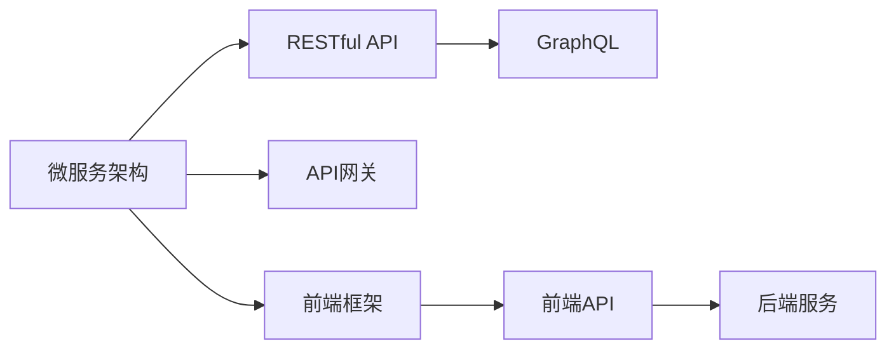

                 

# Web前后端分离架构设计与实现

> 关键词：Web前后端分离, 微服务架构, RESTful API, API网关, GraphQL, React, Vue, Angular

## 1. 背景介绍

### 1.1 问题由来

近年来，随着Web应用复杂度的不断增加，Web前后端分离（Separated Frontend & Backend）架构成为主流选择。这种架构能够显著提升开发效率，降低维护成本，助力企业快速迭代产品。但与此同时，如何设计一个高效、可维护的前后端分离架构，依然是一个复杂而重要的挑战。

### 1.2 问题核心关键点

本文聚焦于Web前后端分离架构的设计与实现，从技术、架构和实践三个维度，深度探讨了如何在实际开发中构建一个可扩展、可维护、高性能的分离架构。我们将详细介绍以下几个关键问题：

- 前后端分离的具体模式
- 服务端架构设计与优化
- 前端框架和后端API的选择与设计
- 数据交互与实时同步机制
- 前后端安全与性能优化策略

通过对这些核心概念的深入分析，相信读者能够全面理解Web前后端分离架构的构建过程，并应用于实际的开发实践中。

## 2. 核心概念与联系

### 2.1 核心概念概述

为更好地理解Web前后端分离架构，本节将介绍几个关键概念及其相互之间的联系：

- **微服务架构(Microservices Architecture)**：将应用拆分成一系列独立服务，每个服务实现单一功能，并通过轻量级通信机制（如HTTP RESTful API）相互协作。这种架构提升了系统的灵活性和扩展性，有助于快速迭代和维护。
- **RESTful API**：基于HTTP协议，使用标准的CRUD（Create, Read, Update, Delete）操作，构建简单、可读性高的Web API接口。RESTful API成为微服务之间进行通信的核心手段。
- **API网关(API Gateway)**：一个转发请求至对应微服务的中间件，负责路由、负载均衡、缓存、鉴权等任务，大大简化了微服务之间的调用关系。
- **GraphQL**：一种用于API开发的查询语言，允许客户端以结构化方式请求数据，减少不必要的数据传输，提升数据利用效率。
- **前端框架**：如React、Vue、Angular等，用于构建前端用户界面，通过单页应用(SPA)实现更好的用户体验和页面交互。
- **后端服务**：包括业务逻辑、数据访问、安全管理等，通过RESTful API或GraphQL为前端提供服务支持。

这些概念之间的逻辑关系可以通过以下Mermaid流程图来展示：



这个流程图展示了微服务架构下，前端和后端服务之间的交互路径：

1. 前端通过API网关调用后端微服务，请求数据。
2. API网关将请求转发至对应的后端服务。
3. 后端服务通过RESTful API或GraphQL返回数据。
4. 前端框架通过前端API接收数据，展示在用户界面上。

## 3. 核心算法原理 & 具体操作步骤

### 3.1 算法原理概述

Web前后端分离架构设计的核心在于，将前端和后端的功能进行合理分离，以减少代码耦合，提高系统灵活性和可维护性。

具体来说，后端负责处理请求、调用业务逻辑、访问数据库等，而前端负责呈现用户界面、处理交互逻辑。这种分离架构不仅简化了技术栈的选择，还促进了前后端团队的分工协作，提升开发效率。

### 3.2 算法步骤详解

1. **技术选型与架构设计**
   - 选择合适的微服务架构风格，如SOA、MBaaS（MicroBackend as a Service）等。
   - 定义服务边界，明确每个服务的职责和接口。
   - 确定数据访问层，选择关系型数据库、NoSQL数据库或两者结合。

2. **API设计**
   - 设计RESTful API接口，遵循CRUD原则，保证接口的简洁性和可读性。
   - 利用API网关进行请求路由和负载均衡，增强系统的稳定性和扩展性。
   - 选择GraphQL作为查询语言，提升数据利用率，减少不必要的数据传输。

3. **前端开发**
   - 选择合适的前端框架，如React、Vue、Angular等，实现单页应用(SPA)。
   - 设计UI组件和交互逻辑，通过API获取数据并展示在用户界面上。
   - 采用状态管理工具，如Redux、Vuex等，处理前端应用的数据流和状态变更。

4. **性能与优化**
   - 对API接口进行性能测试和优化，使用缓存技术（如Redis）提升响应速度。
   - 优化数据库查询和索引，减少I/O操作，提升系统性能。
   - 采用CDN技术，加速静态资源的加载，提升用户体验。

5. **安全与防护**
   - 对API接口进行鉴权和授权，防止未授权访问。
   - 实施数据加密、传输加密等安全措施，保护用户数据安全。
   - 采用DDoS防护、WAF等技术，保障系统的稳定性和安全性。

6. **监控与维护**
   - 引入监控工具，如Prometheus、Grafana等，实时监控系统状态和性能指标。
   - 定期进行代码审查和安全审计，确保系统健康运行。
   - 设计备份和恢复策略，确保数据安全和业务连续性。

### 3.3 算法优缺点

Web前后端分离架构的优势：
- 提升开发效率：前后端分离减少了前后端之间的耦合，使得团队可以独立开发和部署，加速产品迭代。
- 提高系统可维护性：每个服务独立部署和扩展，减少系统耦合，降低维护难度。
- 增强灵活性和扩展性：服务可以独立更新和扩展，减少系统升级风险。

但同时也存在一些缺点：
- 增加通信开销：前后端分离增加了API调用次数，可能导致通信开销增加。
- 数据一致性问题：前后端分离可能存在数据不一致的问题，需要合理处理。
- 开发复杂度：前后端分离增加了开发和调试的复杂度，需要协调前后端团队的工作。

尽管存在这些缺点，但Web前后端分离架构仍然在实际应用中取得了显著的优势，成为现代Web应用开发的重要范式。

### 3.4 算法应用领域

Web前后端分离架构在各种Web应用中得到了广泛应用，覆盖了以下典型场景：

- **电商网站**：电商网站的前端负责用户界面和交互逻辑，后端负责订单管理、库存管理、支付处理等。前后端分离能够有效提升系统的性能和扩展性，支持大规模交易和高并发访问。
- **社交媒体平台**：社交媒体平台的前端展示用户动态、评论和消息，后端处理用户关系、内容审核、用户权限等。前后端分离提升了平台的实时性和用户互动体验。
- **企业门户网站**：企业门户网站的前端展示企业新闻、产品信息、招聘信息等，后端处理数据管理、权限控制、搜索优化等。前后端分离提高了系统的可扩展性和安全性。
- **在线教育平台**：在线教育平台的前端展示课程、互动内容和用户反馈，后端处理课程管理、学习记录、用户认证等。前后端分离优化了用户体验和系统性能。

以上场景只是Web前后端分离架构的一部分应用，随着技术的不断发展和市场需求的变化，未来前后端分离架构将会在更多领域得到应用，提升系统的性能和用户体验。

## 4. 数学模型和公式 & 详细讲解 & 举例说明

### 4.1 数学模型构建

为更好理解和计算Web前后端分离架构的性能，我们将构建一个简单的数学模型。假设有一个Web应用，使用前后端分离架构，前端通过RESTful API调用后端服务，后端使用MySQL数据库。我们定义以下几个变量：

- $T_{frontend}$：前端处理时间。
- $T_{backend}$：后端处理时间。
- $T_{db}$：数据库访问时间。
- $N$：API调用次数。

### 4.2 公式推导过程

整体响应时间 $T_{total}$ 由前端处理时间、后端处理时间和数据库访问时间组成，即：

$$
T_{total} = T_{frontend} + N \cdot (T_{backend} + T_{db})
$$

通过优化上述模型中的各变量，可以提升系统的整体性能。例如，通过缓存技术减少数据库访问次数，使用CDN加速静态资源加载，以及优化API接口调用次数等，可以有效提升系统的响应速度。

### 4.3 案例分析与讲解

以下以一个实际的电商网站为例，展示前后端分离架构的设计和优化过程。

1. **架构设计**
   - 前端使用React框架，实现单页应用(SPA)。
   - 后端使用Node.js和Express框架，实现RESTful API接口。
   - 数据库使用MySQL，处理订单、库存和用户数据。

2. **性能优化**
   - 通过缓存技术，减少数据库访问次数，提升响应速度。
   - 使用CDN技术，加速静态资源的加载，提升用户体验。
   - 优化API接口调用，减少不必要的数据传输，提升数据利用率。

3. **安全防护**
   - 对API接口进行鉴权和授权，防止未授权访问。
   - 实施数据加密和传输加密，保护用户数据安全。
   - 采用DDoS防护和WAF技术，保障系统的稳定性和安全性。

4. **监控与维护**
   - 使用Prometheus和Grafana监控系统状态和性能指标，实时发现问题。
   - 定期进行代码审查和安全审计，确保系统健康运行。
   - 设计备份和恢复策略，确保数据安全和业务连续性。

通过以上分析，我们可以看到，Web前后端分离架构能够显著提升系统的性能和安全性，为电商网站、社交媒体平台、企业门户网站和在线教育平台等提供了强大的技术支持。

## 5. 项目实践：代码实例和详细解释说明

### 5.1 开发环境搭建

在进行Web前后端分离架构的实践前，我们需要准备好开发环境。以下是使用Node.js和React进行项目开发的流程：

1. 安装Node.js和npm：从官网下载安装Node.js和npm，并配置全局路径。

2. 创建React项目：使用npm和create-react-app创建React项目，初始化开发环境。

3. 安装后端依赖：安装Express、Mongoose、Helmet等后端依赖库。

4. 编写后端代码：实现RESTful API接口，处理数据访问和业务逻辑。

5. 部署后端应用：使用PM2或Docker等工具，部署后端应用。

### 5.2 源代码详细实现

以下是一个简单的电商网站前后端分离架构的代码实现。

**后端代码**：

```javascript
const express = require('express');
const mongoose = require('mongoose');
const helmet = require('helmet');

const app = express();
app.use(helmet());

// 连接数据库
mongoose.connect('mongodb://localhost:27017/ecommerce', { useNewUrlParser: true, useUnifiedTopology: true });

// 定义数据模型
const Product = mongoose.model('Product', {
  name: String,
  price: Number,
  quantity: Number
});

// 定义API接口
app.get('/api/products', async (req, res) => {
  const products = await Product.find();
  res.json(products);
});

// 启动服务器
app.listen(3000, () => {
  console.log('Server started on port 3000');
});
```

**前端代码**：

```javascript
import React, { useState, useEffect } from 'react';
import axios from 'axios';

const ProductList = () => {
  const [products, setProducts] = useState([]);

  useEffect(() => {
    axios.get('/api/products').then(response => {
      setProducts(response.data);
    });
  }, []);

  return (
    <ul>
      {products.map(product => (
        <li key={product._id}>{product.name} - ${product.price}</li>
      ))}
    </ul>
  );
};

export default ProductList;
```

### 5.3 代码解读与分析

让我们详细解读一下关键代码的实现细节：

**后端代码**：
- 使用Express创建HTTP服务器，使用Helmet增强安全设置。
- 连接MongoDB数据库，定义数据模型Product，存储商品信息。
- 定义API接口，使用Mongoose模型查询所有商品，并返回JSON格式数据。

**前端代码**：
- 使用React组件，展示商品列表。
- 使用useState和useEffect钩子，获取后端API数据并展示。
- 通过axios库发送GET请求，获取JSON格式数据，并解析为React组件的props属性。

可以看出，通过前后端分离架构，前端和后端各司其职，降低了代码耦合度，提高了开发效率和系统稳定性。

### 5.4 运行结果展示

启动后端应用和前端应用，即可在浏览器中查看电商网站的产品列表。通过前后端分离架构，系统能够快速响应用户请求，同时前后端团队可以独立开发和部署，提升开发效率和系统可维护性。

## 6. 实际应用场景

### 6.1 电商网站

电商网站是一个典型的Web前后端分离应用场景。传统电商网站的前端和后端通常高度耦合，导致系统开发效率低下，维护成本高昂。通过前后端分离架构，电商平台可以独立开发前端和后端，减少代码耦合，提升系统灵活性和可维护性。

在实际应用中，电商平台通常使用React或Vue等前端框架，Node.js和Express等后端框架，以及MySQL或MongoDB等数据库。通过RESTful API或GraphQL接口，前后端进行数据交互，实现产品展示、购物车管理、订单处理等功能。

### 6.2 社交媒体平台

社交媒体平台的前端展示用户动态、评论和消息，后端处理用户关系、内容审核、用户权限等。前后端分离架构提升了平台的实时性和用户互动体验。

在实际应用中，社交媒体平台的前端通常使用React或Vue等框架，后端使用Node.js和Express等框架。通过RESTful API或GraphQL接口，前后端进行数据交互，实现用户注册登录、动态展示、消息推送等功能。

### 6.3 企业门户网站

企业门户网站的前端展示企业新闻、产品信息、招聘信息等，后端处理数据管理、权限控制、搜索优化等。前后端分离架构提高了系统的可扩展性和安全性。

在实际应用中，企业门户网站的前端通常使用React或Vue等框架，后端使用Node.js和Express等框架。通过RESTful API或GraphQL接口，前后端进行数据交互，实现信息展示、用户认证、数据管理等功能。

### 6.4 在线教育平台

在线教育平台的前端展示课程、互动内容和用户反馈，后端处理课程管理、学习记录、用户认证等。前后端分离架构优化了用户体验和系统性能。

在实际应用中，在线教育平台的前端通常使用React或Vue等框架，后端使用Node.js和Express等框架。通过RESTful API或GraphQL接口，前后端进行数据交互，实现课程管理、学习记录、互动问答等功能。

## 7. 工具和资源推荐

### 7.1 学习资源推荐

为了帮助开发者系统掌握Web前后端分离架构的技术细节和最佳实践，这里推荐一些优质的学习资源：

1. 《Clean Architecture: A Craftsman's Guide to Software Structure and Design》：这本书详细介绍了Clean Architecture架构模式，以及如何设计一个可扩展、可维护的软件系统。

2. RESTful API设计指南：这份指南详细介绍了RESTful API的设计原则和最佳实践，帮助开发者构建简洁、可读性高的API接口。

3. GraphQL教程：这份教程详细介绍了GraphQL的基础知识和使用方法，帮助开发者构建高效的数据查询接口。

4. 微服务架构设计：这份教程详细介绍了微服务架构的设计原则和实施步骤，帮助开发者构建可扩展、可维护的系统。

5. Web前后端分离架构设计：这份教程详细介绍了Web前后端分离架构的设计思路和实践经验，帮助开发者构建高效、灵活的Web应用。

通过对这些资源的学习实践，相信你一定能够全面理解Web前后端分离架构的设计和实现，并应用于实际的开发实践中。

### 7.2 开发工具推荐

高效的开发离不开优秀的工具支持。以下是几款用于Web前后端分离开发的常用工具：

1. Node.js：轻量级的JavaScript运行环境，适合构建高性能、可扩展的后端服务。

2. Express：快速搭建RESTful API的框架，支持路由、中间件等特性。

3. Helmet：增强Express的安全设置，减少常见Web安全威胁。

4. Mongoose：MongoDB的对象模型工具，简化数据访问和模型设计。

5. React/Vue/Angular：流行的前端框架，支持单页应用(SPA)开发，提供丰富的UI组件和状态管理工具。

6. Redux/Vuex：状态管理工具，帮助前端开发人员管理数据流和状态变更。

7. axios：通用的HTTP客户端，支持浏览器和Node.js环境，方便前后端数据交互。

合理利用这些工具，可以显著提升Web前后端分离架构的开发效率，加快创新迭代的步伐。

### 7.3 相关论文推荐

Web前后端分离架构的发展源于学界的持续研究。以下是几篇奠基性的相关论文，推荐阅读：

1. "Microservices: A Design Model for Scalable Mobile Cloud-Based Applications"：这篇文章介绍了微服务架构的设计模式和实现方法，为Web前后端分离架构提供了理论支持。

2. "RESTful API Design"：这篇文章详细介绍了RESTful API的设计原则和最佳实践，帮助开发者构建简洁、可读性高的API接口。

3. "GraphQL: GraphQL Query Language"：这篇文章详细介绍了GraphQL的基本概念和使用方法，帮助开发者构建高效的数据查询接口。

4. "Clean Architecture: A Model for Software Engineering"：这篇文章介绍了Clean Architecture架构模式，以及如何设计一个可扩展、可维护的软件系统。

这些论文代表了大语言模型微调技术的发展脉络。通过学习这些前沿成果，可以帮助研究者把握学科前进方向，激发更多的创新灵感。

## 8. 总结：未来发展趋势与挑战

### 8.1 总结

本文对Web前后端分离架构的设计与实现进行了全面系统的介绍。首先阐述了前后端分离的具体模式，详细讲解了服务端架构设计与优化，以及前端框架和后端API的选择与设计。其次，从数据交互与实时同步机制、前后端安全与性能优化策略等几个维度，深入探讨了如何构建一个高效、可维护的前后端分离架构。

通过本文的系统梳理，可以看到，Web前后端分离架构能够显著提升Web应用的性能和可维护性，为电商网站、社交媒体平台、企业门户网站和在线教育平台等提供了强大的技术支持。未来，随着Web技术的不断演进，前后端分离架构将在更多领域得到应用，提升系统的性能和用户体验。

### 8.2 未来发展趋势

展望未来，Web前后端分离架构将呈现以下几个发展趋势：

1. 微服务架构的普及：微服务架构将成为Web应用开发的主流模式，提升系统的灵活性和扩展性。

2. 容器化和云原生技术的应用：Docker、Kubernetes等容器化技术，以及云原生架构将大大简化Web应用的部署和管理。

3. GraphQL的普及：GraphQL的简洁性和高效性，将进一步提升Web应用的开发效率和数据利用率。

4. 前端框架的进化：React、Vue等前端框架将继续进化，支持更多功能和更高的开发效率。

5. 实时数据同步：WebSocket、Server-Sent Events等技术，将提升Web应用的实时性。

6. 前后端解耦的进一步深化：通过API网关、服务发现等技术，进一步提升系统的解耦程度和可维护性。

以上趋势凸显了Web前后端分离架构的广阔前景。这些方向的探索发展，必将进一步提升Web应用的性能和用户体验，为Web应用的开发带来更多的便利。

### 8.3 面临的挑战

尽管Web前后端分离架构已经取得了显著优势，但在迈向更加智能化、普适化应用的过程中，它仍面临着诸多挑战：

1. 性能瓶颈：随着Web应用的规模不断扩大，前后端分离架构的性能瓶颈也逐渐显现，需要进一步优化。

2. 数据一致性：前后端分离可能导致数据一致性问题，需要合理处理。

3. 代码耦合：前后端分离架构仍然存在一定的代码耦合，如何进一步降低耦合度，提升系统的解耦程度，是未来需要解决的问题。

4. 安全性问题：前后端分离架构的复杂性可能带来新的安全威胁，需要综合考虑前后端的安全防护措施。

5. 学习成本：前后端分离架构的学习成本较高，需要开发者具备一定的技术储备和经验积累。

6. 生态系统：前后端分离架构的生态系统仍在发展中，需要更多工具和库的支持。

正视前后端分离架构面临的这些挑战，积极应对并寻求突破，将使该架构在实际应用中更加成熟和可靠。

### 8.4 研究展望

面对Web前后端分离架构所面临的挑战，未来的研究需要在以下几个方面寻求新的突破：

1. 性能优化：进一步优化前后端通信、数据库访问等环节，提升系统的响应速度和性能。

2. 数据一致性：探索新的数据同步机制，确保前后端数据的一致性。

3. 代码解耦：通过微服务架构、API网关等技术，进一步降低前后端的代码耦合度，提升系统的解耦程度。

4. 安全性保障：综合考虑前后端的安全防护措施，确保系统安全稳定。

5. 学习成本：开发易于理解和学习的工具和文档，降低前后端分离架构的学习成本。

6. 生态系统：完善前后端分离架构的生态系统，提供更多工具和库的支持。

这些研究方向的探索，必将引领Web前后端分离架构的进一步发展，为Web应用的开发带来更多的便利和创新。

## 9. 附录：常见问题与解答

**Q1：Web前后端分离架构的优势和劣势是什么？**

A: 优势：
- 提升开发效率：前后端分离减少了前后端之间的耦合，使得团队可以独立开发和部署，加速产品迭代。
- 提高系统可维护性：每个服务独立部署和扩展，减少系统耦合，降低维护难度。
- 增强灵活性和扩展性：服务可以独立更新和扩展，减少系统升级风险。

劣势：
- 增加通信开销：前后端分离增加了API调用次数，可能导致通信开销增加。
- 数据一致性问题：前后端分离可能存在数据不一致的问题，需要合理处理。
- 开发复杂度：前后端分离增加了开发和调试的复杂度，需要协调前后端团队的工作。

尽管存在这些劣势，但Web前后端分离架构仍然在实际应用中取得了显著的优势，成为现代Web应用开发的重要范式。

**Q2：如何设计一个高效的Web前后端分离架构？**

A: 设计一个高效的Web前后端分离架构，需要考虑以下几个方面：
1. 选择合适的微服务架构风格，如SOA、MBaaS等。
2. 定义服务边界，明确每个服务的职责和接口。
3. 选择合适的前端框架，如React、Vue等。
4. 优化API接口，减少不必要的数据传输。
5. 设计数据同步机制，确保前后端数据一致性。
6. 加强前后端安全防护，确保系统安全稳定。
7. 引入监控和维护工具，实时发现和解决问题。

通过综合考虑这些因素，可以设计一个高效、灵活、可维护的Web前后端分离架构。

**Q3：Web前后端分离架构的性能优化有哪些方法？**

A: 性能优化是Web前后端分离架构的重要组成部分。以下是一些常用的优化方法：
1. 数据缓存：使用缓存技术减少数据库访问次数，提升响应速度。
2. 异步请求：采用异步请求技术，减少前后端通信的延迟。
3. 负载均衡：使用负载均衡技术，提升系统的可扩展性和稳定性。
4. 压缩静态资源：使用压缩技术，减少静态资源的加载时间。
5. 代码压缩和优化：优化前端代码，减少页面加载时间。
6. 使用CDN技术：加速静态资源的加载，提升用户体验。

通过这些优化方法，可以显著提升Web前后端分离架构的性能和用户体验。

**Q4：如何保障Web前后端分离架构的安全性？**

A: 保障Web前后端分离架构的安全性需要考虑以下几个方面：
1. 鉴权和授权：对API接口进行鉴权和授权，防止未授权访问。
2. 数据加密：对敏感数据进行加密，保护用户数据安全。
3. 传输加密：使用SSL/TLS协议，保障数据传输的安全性。
4. 防火墙和DDoS防护：采用防火墙和DDoS防护技术，保障系统的稳定性和安全性。
5. 安全审计：定期进行安全审计，发现并修复系统漏洞。

通过综合考虑这些安全措施，可以构建一个安全、可靠的Web前后端分离架构。

**Q5：Web前后端分离架构有哪些典型应用场景？**

A: Web前后端分离架构在各种Web应用中得到了广泛应用，覆盖了以下典型场景：
1. 电商网站：电商网站的前端展示商品信息，后端处理订单和库存管理等。
2. 社交媒体平台：社交媒体平台的前端展示用户动态和消息，后端处理用户关系和内容审核等。
3. 企业门户网站：企业门户网站的前端展示新闻和产品信息，后端处理数据管理和权限控制等。
4. 在线教育平台：在线教育平台的前端展示课程内容和互动内容，后端处理课程管理和学习记录等。

以上场景只是Web前后端分离架构的一部分应用，随着技术的不断发展和市场需求的变化，未来前后端分离架构将会在更多领域得到应用，提升系统的性能和用户体验。

---

作者：禅与计算机程序设计艺术 / Zen and the Art of Computer Programming

