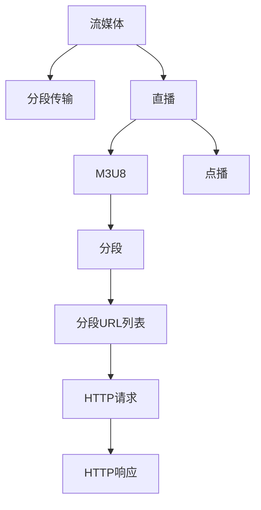

                 

# m3u8流媒体协议详解

> 关键词：m3u8, HTTP, HLS, RTSP, 流媒体, 视频, 音频, 网络传输, 多媒体

## 1. 背景介绍

### 1.1 问题由来
随着互联网的快速发展和数字多媒体技术的应用日益广泛，人们对在线视频、音频等高质量多媒体内容的需求日益增长。流媒体技术应运而生，通过将大容量的多媒体数据流化，使得用户能够实时观看和收听这些内容。流媒体技术涵盖了多媒体数据的编码、压缩、传输等多个方面，而流媒体协议则起着至关重要的作用。

流媒体协议主要分为两大类：一类是流式传输协议，如Real-Time Streaming Protocol (RTSP)；另一类是HTTP协议的变种，如MPEG-4 Part 15（也称作HLS，即HTTP Live Streaming）。其中，M3U8协议作为HLS中的一种，因其简单高效的特点而被广泛应用于流媒体传输中。

### 1.2 问题核心关键点
M3U8协议是一种基于HTTP协议的流媒体协议，用于传输多媒体文件，广泛应用于Web应用中。M3U8文件包含了一系列的URL列表，每个URL指向一个媒体分段（segment），这些分段按顺序播放，共同构成了完整的媒体流。M3U8协议的核心在于其通过HTTP请求和响应机制进行数据分段传输，从而实现多媒体流的实时播放。

M3U8协议之所以广受青睐，其优点包括：
1. 兼容性强：可以在现有的HTTP基础设施上进行，无需额外的硬件或软件支持。
2. 简单易用：M3U8格式简单，易于解析和生成。
3. 灵活性高：支持多种编码格式和流媒体协议。
4. 时序控制：通过设置分段时间戳，实现对流媒体的精确控制和播放。

然而，M3U8协议也存在一些局限性：
1. 初始化开销大：由于需要预加载所有分段的URL，导致初始化过程较慢。
2. 延迟较高：由于分段加载的顺序性，对网络带宽和传输速率要求较高，延迟较高。
3. 扩展性差：M3U8协议本身不支持直播流的多点播（MMT），难以支持大规模流媒体分发。

## 2. 核心概念与联系

### 2.1 核心概念概述

为更好地理解M3U8协议，本节将介绍几个密切相关的核心概念：

- **流媒体（Streaming）**：通过网络传输多媒体数据，使得用户可以实时观看或收听。
- **HLS（HTTP Live Streaming）**：一种基于HTTP协议的流媒体传输协议，用于将直播内容分割成多个小片段进行传输。
- **M3U8**：M3U8文件是HLS协议中的文本格式，用于描述流媒体分段URL列表。
- **分段（Segment）**：流媒体数据按照一定时间间隔进行分段处理，每个分段独立编码和传输。
- **直播（Live Streaming）**：实时的流媒体传输，如体育赛事、新闻直播等。
- **点播（VOD）**：按照用户请求进行流媒体传输，如电影、电视剧等。

这些核心概念之间的逻辑关系可以通过以下Mermaid流程图来展示：



这个流程图展示了几者之间的关联关系：
1. 流媒体数据被分割成多个分段进行传输。
2. 直播内容按照实时顺序进行分段。
3. M3U8文件描述分段URL列表。
4. 分段通过HTTP请求和响应机制进行传输。

## 3. 核心算法原理 & 具体操作步骤
### 3.1 算法原理概述

M3U8协议的原理主要基于HTTP协议的传输机制，通过分段和时序控制实现多媒体流的实时播放。其核心算法原理如下：

1. **分段编码**：将多媒体文件按照一定时间间隔进行分段处理，每个分段独立编码和传输。
2. **M3U8文件生成**：M3U8文件是一段文本，包含一系列的URL列表，每个URL指向一个分段。
3. **HTTP传输**：通过HTTP协议进行分段传输，每个分段传输前会先发送一个M3U8文件，告诉客户端哪些分段可用。
4. **客户端解析**：客户端通过解析M3U8文件，获取每个分段的位置和大小信息，并进行播放。

### 3.2 算法步骤详解

M3U8协议的完整实现过程包括以下几个关键步骤：

**Step 1: 分段编码**
- 对多媒体文件进行分段编码，生成一系列的媒体分段。
- 每个分段文件包括起始时间戳、编码格式、分段大小等元数据信息。

**Step 2: 生成M3U8文件**
- 将每个分段的URL和元数据信息写入M3U8文件中。
- M3U8文件的格式为：
  ```
  #EXTM3U
  #EXT-X-VERSION: 3
  #EXT-X-MEDIA-SEQUENCE: 1
  #EXT-X-VERSION: 3
  #EXT-X-TARGETDURATION: 10
  #EXT-X-MEDIA-SEQUENCE: 2
  #EXTINF: 10.000000,http://example.com/segment1.ts
  ```
  其中，`#EXTM3U`表示M3U8文件开始，`#EXT-X-MEDIA-SEQUENCE`表示分段的序列号，`#EXTINF`表示分段的信息，包括URL和持续时间。

**Step 3: HTTP传输**
- 通过HTTP协议将M3U8文件传输给客户端。
- 客户端通过解析M3U8文件，获取每个分段的URL信息。
- 客户端通过HTTP请求获取每个分段，并进行播放。

**Step 4: 客户端播放**
- 客户端根据M3U8文件中的URL信息，逐个下载每个分段，并按顺序播放。
- 客户端在播放前需要获取M3U8文件，解析出分段的URL信息。
- 客户端通过HTTP请求下载每个分段，并进行解码和播放。

### 3.3 算法优缺点

M3U8协议作为一种流媒体传输协议，具有以下优点：
1. 兼容性好：可以在现有的HTTP基础设施上进行，无需额外的硬件或软件支持。
2. 简单易用：M3U8格式简单，易于解析和生成。
3. 灵活性高：支持多种编码格式和流媒体协议。
4. 时序控制：通过设置分段时间戳，实现对流媒体的精确控制和播放。

同时，M3U8协议也存在一些局限性：
1. 初始化开销大：由于需要预加载所有分段的URL，导致初始化过程较慢。
2. 延迟较高：由于分段加载的顺序性，对网络带宽和传输速率要求较高，延迟较高。
3. 扩展性差：M3U8协议本身不支持直播流的多点播（MMT），难以支持大规模流媒体分发。

### 3.4 算法应用领域

M3U8协议广泛应用于流媒体传输中，具体包括：

- 视频流媒体：如在线视频平台（如YouTube、Bilibili）的视频点播和直播。
- 音频流媒体：如在线音频平台（如Spotify、QQ音乐）的音频点播和直播。
- 互动直播：如游戏直播、新闻直播等。
- 企业会议：如远程会议、在线培训等。

除了以上应用领域，M3U8协议还被用于视频监控、云存储等场景，作为一种高效的数据传输方式。

## 4. 数学模型和公式 & 详细讲解 & 举例说明
### 4.1 数学模型构建

M3U8协议的核心是基于HTTP协议的传输机制，其数学模型相对简单，主要涉及以下几个方面：

- 分段时间戳：每个分段的时间戳用于控制流媒体的播放顺序和精度。
- 分段持续时间：每个分段的分段持续时间，用于计算目标时长和播放速度。
- HTTP请求与响应：通过HTTP协议进行分段传输，包括请求URL、响应状态码、响应头等。

### 4.2 公式推导过程

以下以M3U8协议中的分段时间和目标时长计算为例，推导相关公式：

假设流媒体的目标时长为 $T$，每个分段的大小为 $S$，分段频率为 $F$，每个分段的持续时间 $t$ 与分段大小 $S$ 成正比，即：
$$ t = k \cdot S $$

其中 $k$ 为比例系数。则整个流媒体的时间戳 $t_{total}$ 可以表示为：
$$ t_{total} = T - \sum_{i=1}^{N} t_i $$
$$ t_{total} = T - k \sum_{i=1}^{N} S_i $$
$$ t_{total} = T - kN \cdot \frac{S}{F} $$

代入 $N = \frac{T}{\frac{S}{F}}$，得：
$$ t_{total} = T - kT $$

由于 $k$ 表示比例系数，通常为较小的常数，因此 $t_{total}$ 可以近似为：
$$ t_{total} = T $$

这说明通过M3U8协议的分段传输，流媒体的总时长可以保持与目标时长一致，确保播放的精确性。

### 4.3 案例分析与讲解

以YouTube为例，分析其如何利用M3U8协议进行流媒体传输：

1. **分段编码**：YouTube将视频文件分割成多个小片段，每个片段大小约为6MB。
2. **M3U8文件生成**：YouTube生成一个M3U8文件，包含每个分段的位置和持续时间信息。
3. **HTTP传输**：YouTube通过HTTP协议将M3U8文件传输给客户端。
4. **客户端播放**：客户端通过解析M3U8文件，逐个下载每个分段，并按顺序播放。

YouTube的实际播放过程中，采用缓冲区机制，将最近3个分段缓存到本地，以减少网络延迟和提高播放稳定性。同时，YouTube还支持Adaptive Bitrate Streaming（ABS），根据网络带宽动态调整分段大小，以确保流畅播放。

## 5. 项目实践：代码实例和详细解释说明
### 5.1 开发环境搭建

在进行M3U8协议的开发实践前，我们需要准备好开发环境。以下是使用Python进行M3U8协议开发的常见环境配置流程：

1. 安装Anaconda：从官网下载并安装Anaconda，用于创建独立的Python环境。
2. 创建并激活虚拟环境：
```bash
conda create -n m3u8-env python=3.8 
conda activate m3u8-env
```

3. 安装PyTorch：根据CUDA版本，从官网获取对应的安装命令。例如：
```bash
conda install pytorch torchvision torchaudio cudatoolkit=11.1 -c pytorch -c conda-forge
```

4. 安装相关库：
```bash
pip install requests
```

完成上述步骤后，即可在`m3u8-env`环境中开始M3U8协议的开发实践。

### 5.2 源代码详细实现

这里我们以M3U8文件的生成和解析为例，给出使用Python进行M3U8协议开发的代码实现。

```python
import requests
import json
import os

# 生成M3U8文件
def generate_m3u8(url, target_duration=10, segment_size=6*1024*1024):
    response = requests.get(url)
    if response.status_code != 200:
        print("Failed to fetch segment list!")
        return None
    
    segments = json.loads(response.text)
    m3u8_content = "#EXTM3U\n"
    m3u8_content += "#EXT-X-VERSION: 3\n"
    m3u8_content += "#EXT-X-MEDIA-SEQUENCE: 1\n"
    m3u8_content += "#EXT-X-TARGETDURATION:" + str(target_duration) + "\n"
    
    for segment in segments:
        duration = segment['duration']
        url = segment['url']
        m3u8_content += "#EXTINF:" + str(duration) + ","
        m3u8_content += url + "\n"
    
    with open("m3u8.txt", "w") as f:
        f.write(m3u8_content)

# 解析M3U8文件
def parse_m3u8(m3u8_file):
    with open(m3u8_file, "r") as f:
        lines = f.readlines()
    
    segments = []
    for line in lines:
        if line.startswith("#EXTINF"):
            duration = line.split(",")[1].strip()
            url = line.split(",")[0].split(":")[1].strip()
            segments.append({"duration": float(duration), "url": url})
    
    return segments

# 测试代码
url = "https://example.com/segmentlist.json"
target_duration = 10
segment_size = 6*1024*1024

generate_m3u8(url, target_duration, segment_size)
segments = parse_m3u8("m3u8.txt")
print(segments)
```

以上代码实现了M3U8文件的生成和解析功能，其中：
- `generate_m3u8`函数用于生成M3U8文件，将HTTP请求获取到的分段列表，按照M3U8格式写入文本文件。
- `parse_m3u8`函数用于解析M3U8文件，返回分段列表。

### 5.3 代码解读与分析

这里我们详细解读一下关键代码的实现细节：

**generate_m3u8函数**：
- 使用requests库发送HTTP请求，获取流媒体分段列表。
- 将获取到的分段列表按照M3U8格式写入文本文件。
- 使用json库将获取到的JSON格式数据解析为Python字典。
- 逐个解析分段信息，将URL和持续时间写入M3U8文件中。

**parse_m3u8函数**：
- 打开M3U8文件，逐行读取。
- 判断行是否为M3U8格式的分段信息，解析出URL和持续时间。
- 将分段信息写入Python列表，返回分段列表。

**测试代码**：
- 指定流媒体分段列表的URL。
- 设置目标时长和分段大小。
- 调用`generate_m3u8`函数生成M3U8文件。
- 调用`parse_m3u8`函数解析M3U8文件，并输出分段列表。

## 6. 实际应用场景

### 6.1 智能视频平台
在智能视频平台中，如Netflix、Amazon Prime Video等，M3U8协议被广泛用于流媒体传输。平台通过分段编码和M3U8文件的生成，实现视频内容的实时播放。用户可以在线观看、回放视频，甚至通过直播功能实时观看直播节目。

### 6.2 云存储服务
在云存储服务中，如Dropbox、Google Drive等，M3U8协议被用于传输文件的分段。用户可以随时随地访问自己的文件，无需下载整个文件，只需下载文件的一部分，即可实现流畅播放或查看。

### 6.3 企业内部直播
在企业内部直播中，如在线会议、培训课程等，M3U8协议被用于传输直播流。通过M3U8协议，员工可以随时随地观看直播，无需安装额外的软件或硬件设备。

### 6.4 未来应用展望

随着5G网络的普及和物联网技术的发展，M3U8协议将迎来更广阔的应用前景。

1. **边缘计算**：M3U8协议可以在边缘计算设备上进行，通过本地缓存和网络优化，提升流媒体传输效率和稳定性。
2. **智能家居**：M3U8协议可以应用于智能家居系统中，实现家庭内部的流媒体传输和控制。
3. **远程医疗**：M3U8协议可以用于远程医疗系统的实时视频传输，提高医疗服务的可及性和效率。
4. **智能交通**：M3U8协议可以用于智能交通系统的实时监控和数据传输，提升交通管理的智能化水平。

## 7. 工具和资源推荐
### 7.1 学习资源推荐

为了帮助开发者系统掌握M3U8协议的理论基础和实践技巧，这里推荐一些优质的学习资源：

1. M3U8协议文档：IETF官方文档，详细介绍了M3U8协议的规范和使用方法。
2. YouTube官方文档：YouTube的流媒体传输规范，包含详细的M3U8协议实现案例。
3. 《流媒体技术详解》书籍：深入浅出地介绍了流媒体传输的各种协议和实现技术，包括M3U8协议。
4. 《流媒体视频技术》课程：Coursera上的流媒体技术课程，讲解流媒体的各种实现技术，包括M3U8协议。
5. M3U8协议实践代码：GitHub上的M3U8协议实现代码，包含详细的实现示例和解析方法。

通过对这些资源的学习实践，相信你一定能够快速掌握M3U8协议的精髓，并用于解决实际的流媒体传输问题。

### 7.2 开发工具推荐

高效的开发离不开优秀的工具支持。以下是几款用于M3U8协议开发的常用工具：

1. Python：Python是一种简单易学的编程语言，适合进行流媒体协议的开发和实验。
2. PyTorch：基于Python的开源深度学习框架，支持高效的流媒体处理和优化。
3. requests库：Python的HTTP请求库，支持HTTP协议的实现和解析。
4. m3u8解析库：开源的M3U8协议解析库，提供了简单易用的API接口。
5. ffmpeg：开源的流媒体处理工具，支持视频、音频的分段编码和传输。

合理利用这些工具，可以显著提升M3U8协议的开发效率，加快创新迭代的步伐。

### 7.3 相关论文推荐

M3U8协议作为HLS协议的核心，其发展和应用得到了广泛的研究。以下是几篇奠基性的相关论文，推荐阅读：

1. M3U8协议规范：IETF正式规范，详细介绍了M3U8协议的规范和实现。
2. HLS协议简介：Apple官方文档，介绍了HLS协议的基本原理和实现。
3. M3U8协议优化：相关研究论文，介绍了M3U8协议的优化方法，如缓冲区机制、Adaptive Bitrate Streaming等。
4. 流媒体协议比较：相关研究论文，比较了各种流媒体协议的优缺点和适用场景。
5. 实时视频传输：相关研究论文，介绍了实时视频传输的各种实现技术，包括M3U8协议。

这些论文代表了大规模流媒体协议的发展脉络。通过学习这些前沿成果，可以帮助研究者把握学科前进方向，激发更多的创新灵感。

## 8. 总结：未来发展趋势与挑战
### 8.1 总结

本文对M3U8协议进行了全面系统的介绍。首先阐述了M3U8协议的背景和意义，明确了其在大规模流媒体传输中的应用价值。其次，从原理到实践，详细讲解了M3U8协议的数学模型和具体实现步骤，给出了详细的代码示例和解析方法。同时，本文还探讨了M3U8协议在智能视频平台、云存储服务、企业内部直播等多个领域的应用前景，展示了M3U8协议的强大潜力。此外，本文精选了M3U8协议的学习资源和开发工具，力求为读者提供全方位的技术指引。

通过本文的系统梳理，可以看到，M3U8协议作为HLS协议的核心，在流媒体传输中扮演着至关重要的角色。M3U8协议的简单易用、兼容性好等特点，使其在众多场景中得到了广泛的应用，极大地推动了流媒体技术的发展和普及。

### 8.2 未来发展趋势

展望未来，M3U8协议将呈现以下几个发展趋势：

1. **边缘计算**：随着5G网络的发展和物联网技术的普及，边缘计算设备的引入将大大提升M3U8协议的传输效率和稳定性。
2. **自适应码率**：Adaptive Bitrate Streaming技术将进一步完善，根据网络带宽动态调整分段大小，确保流畅播放。
3. **低延迟直播**：实时性更高的低延迟直播技术将被广泛应用，提升用户体验。
4. **多路流媒体**：多点播（MMT）技术将被支持，实现多路流媒体的同时传输。
5. **智能推荐**：基于M3U8协议的流媒体推荐系统将进一步发展，提供更精准的用户体验。

以上趋势凸显了M3U8协议的未来发展方向，这些方向的探索和发展，必将进一步提升流媒体传输的效率和体验，满足用户不断增长的需求。

### 8.3 面临的挑战

尽管M3U8协议在流媒体传输中已经取得了瞩目成就，但在迈向更加智能化、普适化应用的过程中，它仍面临诸多挑战：

1. **初始化开销大**：M3U8协议需要在初始化时预加载所有分段，导致初始化过程较慢。
2. **网络延迟高**：由于分段加载的顺序性，对网络带宽和传输速率要求较高，延迟较高。
3. **扩展性差**：M3U8协议本身不支持多点播（MMT），难以支持大规模流媒体分发。
4. **安全性问题**：流媒体传输过程中，需要考虑数据加密、用户认证等安全性问题。
5. **兼容性问题**：不同设备、不同操作系统对M3U8协议的支持程度不一，需要考虑兼容性问题。

为了应对这些挑战，未来的研究需要在以下几个方面寻求新的突破：

1. **改进初始化机制**：通过预缓存和分段合并等方法，减少初始化开销。
2. **优化传输机制**：采用自适应码率和低延迟直播等技术，提高传输效率和稳定性。
3. **支持多点播**：研究多点播（MMT）技术，实现多路流媒体的同时传输。
4. **增强安全性**：引入数据加密、用户认证等措施，保障流媒体传输的安全性。
5. **提升兼容性**：开发跨平台的M3U8协议实现，确保不同设备和操作系统的兼容性。

这些研究方向的探索，将有助于M3U8协议更好地应对未来应用中的各种挑战，进一步提升其应用价值。

### 8.4 研究展望

面向未来，M3U8协议的研究将更加关注以下几个方面：

1. **实时性优化**：研究实时性更高的流媒体传输技术，提高用户体验。
2. **边缘计算支持**：研究边缘计算设备上的M3U8协议实现，提升流媒体传输效率。
3. **多路流媒体**：研究多点播（MMT）技术，实现多路流媒体的同时传输。
4. **安全性增强**：研究流媒体传输的安全性问题，提供数据加密、用户认证等解决方案。
5. **兼容性提升**：开发跨平台的M3U8协议实现，确保不同设备和操作系统的兼容性。

通过这些方向的探索和发展，M3U8协议必将在未来的流媒体传输中发挥更大的作用，为互联网的数字化、智能化进程提供强大的技术支持。总之，M3U8协议作为一种高效、灵活的流媒体传输协议，将在未来的数字时代中继续发挥重要作用。

## 9. 附录：常见问题与解答

**Q1: M3U8协议适用于所有类型的流媒体传输吗？**

A: M3U8协议适用于基于HTTP协议的流媒体传输，因此可以应用于各种类型的流媒体，包括视频、音频、直播、点播等。但是，对于实时性要求极高的流媒体传输，如VoIP等，可能需要使用其他更高效的传输协议。

**Q2: M3U8协议中的分段大小和持续时间如何确定？**

A: 分段大小和持续时间通常由视频编解码器根据流媒体的码率和目标播放速度进行计算。一般来说，分段大小与码率成正比，持续时间与分段大小成反比。目标播放速度可以通过流媒体目标时长和分段数量进行计算。

**Q3: 如何提高M3U8协议的初始化效率？**

A: 可以通过预缓存和分段合并等方法，减少初始化开销。例如，可以在流媒体播放前，先预缓存部分分段，减少初始化时的加载量。同时，可以将多个分段合并为一个大的分段，减少初始化时的请求次数。

**Q4: M3U8协议在实际应用中应注意哪些问题？**

A: 在实际应用中，M3U8协议需要考虑以下几个问题：
1. 初始化开销：M3U8协议需要在初始化时预加载所有分段，导致初始化过程较慢。
2. 网络延迟：分段加载的顺序性可能导致网络延迟较高。
3. 安全性问题：流媒体传输过程中，需要考虑数据加密、用户认证等安全性问题。
4. 兼容性问题：不同设备、不同操作系统对M3U8协议的支持程度不一，需要考虑兼容性问题。

通过合理解决这些问题，可以充分发挥M3U8协议的优势，提升流媒体传输的效率和安全性。

**Q5: M3U8协议的优化有哪些方法？**

A: M3U8协议的优化方法包括：
1. 分段大小自适应：根据网络带宽动态调整分段大小，确保流畅播放。
2. 缓冲区机制：在客户端使用缓冲区机制，减少网络延迟。
3. 边缘计算：在边缘计算设备上进行M3U8协议实现，提升流媒体传输效率。
4. 多路流媒体：研究多点播（MMT）技术，实现多路流媒体的同时传输。
5. 安全性增强：引入数据加密、用户认证等措施，保障流媒体传输的安全性。

通过这些优化方法，可以进一步提升M3U8协议的性能和应用价值。

---

作者：禅与计算机程序设计艺术 / Zen and the Art of Computer Programming

