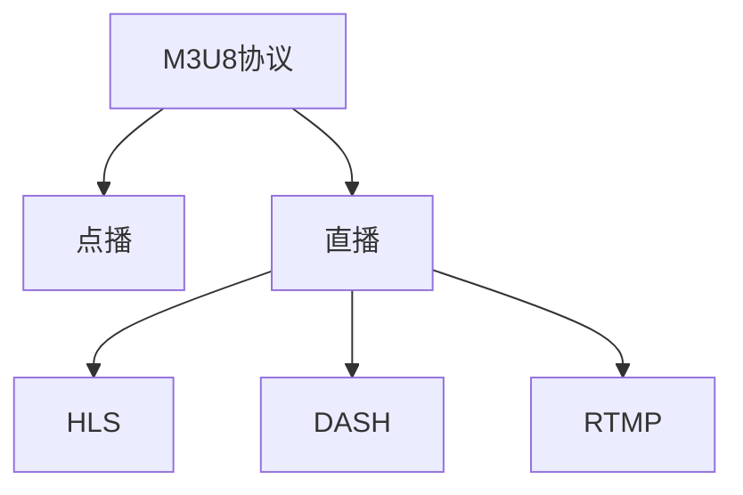

                 

# m3u8点播与直播实现

## 1. 背景介绍

在流媒体领域，m3u8（Master Playlist，主播放列表）协议因其简洁高效，被广泛用于点播和直播场景中。本文将详细探讨m3u8协议的原理与实现，包括点播和直播的差异，以及如何高效构建基于m3u8的流媒体系统。通过本系列文章，将为你提供从基础原理到实际应用的一站式学习指南。

## 2. 核心概念与联系

### 2.1 核心概念概述

要深入理解m3u8点播与直播的实现，首先需要了解一些核心概念：

- **m3u8协议**：Master Playlist 是 Apple 公司提出的一种用于流媒体播放的文本协议，通过主播放列表和分段播放列表的形式，描述了流媒体内容的结构和流媒体数据分段的存储位置。
- **点播**：通过请求特定的文件片段，用户可以直接观看媒体内容，无须等待全部加载完成。
- **直播**：实时录制并上传流媒体内容，用户可以即时观看。
- **分段播放列表**：用于描述特定时间范围内流媒体分段数据的协议。
- **HLS（HTTP Live Streaming）**：基于m3u8协议的一种流媒体协议，常用于直播场景中。
- **DASH（Dynamic Adaptive Streaming over HTTP）**：另一种基于m3u8的流媒体协议，支持自适应流，能够根据网络状况动态调整码率。
- **RTMP（Real-Time Messaging Protocol）**：另一种常用的流媒体协议，用于直播场景，支持实时的视频、音频数据传输。

这些核心概念之间的关系可以通过以下Mermaid流程图来展示：



## 3. 核心算法原理 & 具体操作步骤

### 3.1 算法原理概述

m3u8协议的实现基于HTTP协议，利用Web技术实现流媒体数据的传输。其主要原理如下：

- 客户端通过请求主播放列表（m3u8文件），获取当前媒体的播放路径和分段播放列表。
- 分段播放列表（m3u8文件）描述了各时间段内的分段数据存储位置和长度。
- 客户端根据分段播放列表，逐段下载和播放流媒体数据。
- 在直播场景中，服务器实时生成并更新分段播放列表，以反映最新的流媒体内容。

### 3.2 算法步骤详解

#### 点播实现

点播的实现步骤相对简单：

1. **请求主播放列表**：客户端通过HTTP请求获取m3u8主播放列表文件，其中包含了流媒体的分段播放列表地址。
2. **获取分段播放列表**：根据主播放列表中的地址，客户端请求并解析各分段播放列表，获取各分段文件的存储位置和长度。
3. **下载分段数据**：按照分段播放列表的顺序，客户端逐个请求并下载流媒体分段数据，同时进行播放。
4. **缓存分段数据**：将下载的分段数据缓存到本地，以防止网络波动导致的播放中断。

#### 直播实现

直播的实现步骤相对复杂：

1. **流媒体录制**：通过RTMP、HLS等协议，服务器实时录制并上传流媒体内容。
2. **生成分段播放列表**：服务器根据流媒体录制进度，实时生成分段播放列表，并发布到CDN（内容分发网络）。
3. **客户端请求主播放列表**：客户端通过HTTP请求获取m3u8主播放列表文件，其中包含了直播的分段播放列表地址。
4. **获取分段播放列表**：根据主播放列表中的地址，客户端请求并解析各分段播放列表，获取各分段文件的存储位置和长度。
5. **下载分段数据**：按照分段播放列表的顺序，客户端逐个请求并下载流媒体分段数据，同时进行播放。
6. **缓存分段数据**：将下载的分段数据缓存到本地，以防止网络波动导致的播放中断。
7. **更新分段播放列表**：服务器实时更新分段播放列表，并推送到CDN，客户端重新请求主播放列表，获取最新的分段播放列表。

### 3.3 算法优缺点

#### 优点

- **实时性**：m3u8协议的实时生成和更新分段播放列表，实现了实时播放，满足直播场景的需求。
- **易于扩展**：基于HTTP协议，可以方便地进行流媒体内容的扩展和优化。
- **兼容性好**：m3u8协议被广泛支持，无论是浏览器还是移动端，都可以轻松实现播放。

#### 缺点

- **码率固定**：直播场景中，码率需要预先设定，无法根据网络状况动态调整，可能导致视频卡顿或过载。
- **延迟较高**：在传输网络数据时，存在一定的延迟，可能会影响播放体验。
- **安全性较差**：m3u8协议的简单性可能使得安全性问题更加突出。

### 3.4 算法应用领域

m3u8协议及其基于的点播和直播实现，在各类场景中得到广泛应用：

- **视频平台**：如爱奇艺、腾讯视频等，通过m3u8协议实现视频内容的点播和直播。
- **新闻播报**：如电视台、在线新闻平台，利用m3u8协议实现实时新闻播报。
- **教育培训**：如在线课程、远程教学，通过m3u8协议实现实时的视频教学。
- **企业内部**：如视频会议、远程培训，利用m3u8协议实现企业内部的实时视频交流。

## 4. 数学模型和公式 & 详细讲解 & 举例说明

### 4.1 数学模型构建

在m3u8协议中，主要涉及的数学模型包括分段播放列表的生成和更新。分段播放列表包含以下信息：

- 起始时间戳（Time Start）
- 结束时间戳（Time End）
- 分段编号（Segment Number）
- 分段文件路径（URI）
- 分段文件长度（Length）

### 4.2 公式推导过程

假设直播开始时间为t0，当前时间为t，分段播放列表的生成公式为：

$$
\text{Segment Number} = \lceil \frac{t-t_0}{\Delta T} \rceil
$$

其中，$\Delta T$为分段间隔时间。

分段文件路径和长度计算公式为：

$$
\text{URI} = \text{base URI} + \text{segment number} + \text{segment extension}
$$

$$
\text{Length} = \Delta T \times \text{bitrate}
$$

其中，$\text{base URI}$为流媒体的base URI，$\text{segment number}$为分段编号，$\text{segment extension}$为分段的扩展名，$\text{bitrate}$为流媒体的码率。

### 4.3 案例分析与讲解

以一个简单的直播场景为例，直播开始时间为00:00:00，分段间隔为1分钟，码率为800kbps，初始播放列表如下：

```
#EXTM3U
#EXT-X-VERSION:5
#EXT-X-MEDIA-SEQUENCE:0000000000000000000000000000000000000000000000000000000000000000000000000000000000000000000000000000000000000000000000000000000000000000000000000000000000000000000000000000000000000000000000000000000000000000000000000000000000000000000000000000000000000000000000000000000000000000000000000000000000000000000000000000000000000000000000000000000000000000000000000000000000000000000000000000000000000000000000000000000000000000000000000000000000000000000000000000000000000000000000000000000000000000000000000000000000000000000000000000000000000000000000000000000000000000000000000000000000000000000000000000000000000000000000000000000000000000000000000000000000000000000000000000000000000000000000000000000000000000000000000000000000000000000000000000000000000000000000000000000000000000000000000000000000000000000000000000000000000000000000000000000000000000000000000000000000000000000000000000000000000000000000000000000000000000000000000000000000000000000000000000000000000000000000000000000000000000000000000000000000000000000000000000000000000000000000000000000000000000000000000000000000000000000000000000000000000000000000000000000000000000000000000000000000000000000000000000000000000000000000000000000000000000000000000000000000000000000000000000000000000000000000000000000000000000000000000000000000000000000000000000000000000000000000000000000000000000000000000000000000000000000000000000000000000000000000000000000000000000000000000000000000000000000000000000000000000000000000000000000000000000000000000000000000000000000000000000000000000000000000000000000000000000000000000000000000000000000000000000000000000000000000000000000000000000000000000000000000000000000000000000000000000000000000000000000000000000000000000000000000000000000000000000000000000000000000000000000000000000000000000000000000000000000000000000000000000000000000000000000000000000000000000000000000000000000000000000000000000000000000000000000000000000000000000000000000000000000000000000000000000000000000000000000000000000000000000000000000000000000000000000000000000000000000000000000000000000000000000000000000000000000000000000000000000000000000000000000000000000000000000000000000000000000000000000000000000000000000000000000000000000000000000000000000000000000000000000000000000000000000000000000000000000000000000000000000000000000000000000000000000000000000000000000000000000000000000000000000000000000000000000000000000000000000000000000000000000000000000000000000000000000000000000000000000000000000000000000000000000000000000000000000000000000000000000000000000000000000000000000000000000000000000000000000000000000000000000000000000000000000000000000000000000000000000000000000000000000000000000000000000000000000000000000000000000000000000000000000000000000000000000000000000000000000000000000000000000000000000000000000000000000000000000000000000000000000000000000000000000000000000000000000000000000000000000000000000000000000000000000000000000000000000000000000000000000000000000000000000000000000000000000000000000000000000000000000000000000000000000000000000000000000000000000000000000000000000000000000000000000000000000000000000000000000000000000000000000000000000000000000000000000000000000000000000000000000000000000000000000000000000000000000000000000000000000000000000000000000000000000000000000000000000000000000000000000000000000000000000000000000000000000000000000000000000000000000000000000000000000000000000000000000000000000000000000000000000000000000000000000000000000000000000000000000000000000000000000000000000000000000000000000000000000000000000000000000000000000000000000000000000000000000000000000000000000000000000000000000000000000000000000000000000000000000000000000000000000000000000000000000000000000000000000000000000000000000000000000000000000000000000000000000000000000000000000000000000000000000000000000000000000000000000000000000000000000000000000000000000000000000000000000000000000000000000000000000000000000000000000000000000000000000000000000000000000000000000000000000000000000000000000000000000000000000000000000000000000000000000000000000000000000000000000000000000000000000000000000000000000000000000000000000000000000000000000000000000000000000000000000000000000000000000000000000000000000000000000000000000000000000000000000000000000000000000000000000000000000000000000000000000000000000000000000000000000000000000000000000000000000000000000000000000000000000000000000000000000000000000000000000000000000000000000000000000000000000000000000000000000000000000000000000000000000000000000000000000000000000000000000000000000000000000000000000000000000000000000000000000000000000000000000000000000000000000000000000000000000000000000000000000000000000000000000000000000000000000000000000000000000000000000000000000000000000000000000000000000000000000000000000000000000000000000000000000000000000000000000000000000000000000000000000000000000000000000000000000000000000000000000000000000000000000000000000000000000000000000000000000000000000000000000000000000000000000000000000000000000000000000000000000000000000000000000000000000000000000000000000000000000000000000000000000000000000000000000000000000000000000000000000000000000000000000000000000000000000000000000000000000000000000000000000000000000000000000000000000000000000000000000000000000000000000000000000000000000000000000000000000000000000000000000000000000000000000000000000000000000000000000000000000000000000000000000000000000000000000000000000000000000000000000000000000000000000000000000000000000000000000000000000000000000000000000000000000000000000000000000000000000000000000000000000000000000000000000000000000000000000000000000000000000000000000000000000000000000000000000000000000000000000000000000000000000000000000000000000000000000000000000000000000000000000000000000000000000000000000000000000000000000000000000000000000000000000000000000000000000000000000000000000000000000000000000000000000000000000000000000000000000000000000000000000000000000000000000000000000000000000000000000000000000000000000000000000000000000000000000000000000000000000000000000000000000000000000000000000000000000000000000000000000000000000000000000000000000000000000000000000000000000000000000000000000000000000000000000000000000000000000000000000000000000000000000000000000000000000000000000000000000000000000000000000000000000000000000000000000000000000000000000000000000000000000000000000000000000000000000000000000000000000000000000000000000000000000000000000000000000000000000000000000000000000000000000000000000000000000000000000000000000000000000000000000000000000000000000000000000000000000000000000000000000000000000000000000000000000000000000000000000000000000000000000000000000000000000000000000000000000000000000000000000000000000000000000000000000000000000000000000000000000000000000000000000000000000000000000000000000000000000000000000000000000000000000000000000000000000000000000000000000000000000000000000000000000000000000000000000000000000000000000000000000000000000000000000000000000000000000000000000000000000000000000000000000000000000000000000000000000000000000000000000000000000000000000000000000000000000000000000000000000000000000000000000000000000000000000000000000000000000000000000000000000000000000000000000000000000000000000000000000000000000000000000000000000000000000000000000000000000000000000000000000000000000000000000000000000000000000000000000000000000000000000000000000000000000000000000000000000000000000000000000000000000000000000000000000000000000000000000000000000000000000000000000000000000000000000000000000000000000000000000000000000000000000000000000000000000000000000000000000000000000000000000000000000000000000000000000000000000000000000000000000000000000000000000000000000000000000000000000000000000000000000000000000000000000000000000000000000000000000000000000000000000000000000000000000000000000000000000000000000000000000000000000000000000000000000000000000000000000000000000000000000000000000000000000000000000000000000000000000000000000000000000000000000000000000000000000000000000000000000000000000000000000000000000000000000000000000000000000000000000000000000000000000000000000000000000000000000000000000000000000000000000000000000000000000000000000000000000000000000000000000000000000000000000000000000000000000000000000000000000000000000000000000000000000000000000000000000000000000000000000000000000000000000000000000000000000000000000000000000000000000000000000000000000000000000000000000000000000000000000000000000000000000000000000000000000000000000000000000000000000000000000000000000000000000000000000000000000000000000000000000000000000000000000000000000000000000000000000000000000000000000000000000000000000000000000000000000000000000000000000000000000000000000000000000000000000000000000000000000000000000000000000000000000000000000000000000000000000000000000000000000000000000000000000000000000000000000000000000000000000000000000000000000000000000000000000000000000000000000000000000000000000000000000000000000000000000000000000000000000000000000000000000000000000000000000000000000000000000000000000000000000000000000000000000000000000000000000000000000000000000000000000000000000000000000000000000000000000000000000000000000000000000000000000000000000000000000000000000000000000000000000000000000000000000000000000000000000000000000000000000000000000000000000000000000000000000000000000000000000000000000000000000000000000000000000000000000000000000000000000000000000000000000000000000000000000000000000000000000000000000000000000000000000000000000000000000000000000000000000000000000000000000000000000000000000000000000000000000000000000000000000000000000000000000000000000000000000000000000000000000000000000000000000000000000000000000000000000000000000000000000000000000000000000000000000000000000000000000000000000000000000000000000000000000000000000000000000000000000000000000000000000000000000000000000000000000000000000000000000000000000000000000000000000000000000000000000000000000000000000000000000000000000000000000000000000000000000000000000000000000000000000000000000000000000000000000000000000000000000000000000000000000000000000000000000000000000000000000000000000000000000000000000000000000000000000000000000000000000000000000000000000000000000000000000000000000000000000000000000000000000000000000000000000000000000000000000000000000000000000000000000000000000000000000000000000000000000000000000000000000000000000000000000000000000000000000000000000000000000000000000000000000000000000000000000000000000000000000000000000000000000000000000000000000000000000000000000000000000000000000000000000000000000000000000000000000000000000000000000000000000000000000000000000000000000000000000000000000000000000000000000000000000000000000000000000000000000000000000000000000000000000000000000000000000000000000000000000000000000000000000000000000000000000000000000000000000000000000000000000000000000000000000000000000000000000000000000000000000000000000000000000000000000000000000000000000000000000000000000000000000000000000000000000000000000000000000000000000000000000000000000000000000000000000000000000000000000000000000000000000000000000000000000000000000000000000000000000000000000000000000000000000000000000000000000000000000000000000000000000000000000000000000000000000000000000000000000000000000000000000000000000000000000000000000000000000000000000000000000000000000000000000000000000000000000000000000000000000000000000000000000000000000000000000000000000000000000000000000000000000000000000000000000000000000000000000000000000000000000000000000000000000000000000000000000000000000000000000000000000000000000000000000000000000000000000000000000000000000000000000000000000000000000000000000000000000000000000000000000000000000000000000000000000000000000000000000000000000000000000000000000000000000000000000000000000000000000000000000000000000000000000000000000000000000000000000000000000000000000000000000000000000000000000000000000000000000000000000000000000000000000000000000000000000000000000000000000000000000000000000000000000000000000000000000000000000000000000000000000000000000000000000000000000000000000000000000000000000000000000000000000000000000000000000000000000000000000000000000000000000000000000000000000000000000000000000000000000000000000000000000000000000000000000000000000000000000000000000000000000000000000000000000000000000000000000000000000000000000000000000000000000000000000000000000000000000000000000000000000000000000000000000000000000000000000000000000000000000000000000000000000000000000000000000000000000000000000000000000000000000000000000000000000000000000000000000000000000000000000000000000000000000000000000000000000000000000000000000000000000000000000000000000000000000000000000000000000000000000000000000000000000000000000000000000000000000000000000000000000000000000000000000000000000000000000000000000000000000000000000000000000000000000000000000000000000000000000000000000000000000000000000000000000000000000000000000000000000000000000000000000000000000000000000000000000000000000000000000000000000000000000000000000000000000000000000000000000000000000000000000000000000000000000000000000000000000000000000000000000000000000000000000000000000000000000000000000000000000000000000000000000000000000000000000000000000000000000000000000000000000000000000000000000000000000000000000000000000000000000000000000000000000000000000000000000000000000000000000000000000000000000000000000000000000000000000000000000000000000000000000000000000000000000000000000000000000000000000000000000000000000000000000000000000000000000000000000000000000000000000000000000000000000000000000000000000000000000000000000000000000000000000000000000000000000000000000000000000000000000000000000000000000000000000000000000000000000000000000000000000000000000000000000000000000000000000000000000000000000000000000000000000000000000000000000000000000000000000000000000000000000000000000000000000000000000000000000000000000000000000000000000000000000000000000000000000000000000000000000000000000000000000000000000000000000000000000000000000000000000000000000000000000000000000000000000000000000000000000000000000000000000000000000000000000000000000000000000000000000000000000000000000000000000000000000000000000000000000000000000000000000000000000000000000000000000000000000000000000000000000000000000000000000000000000000000000000000000000000000000000000000000000000000000000000000000000000000000000000000000000000000000000000000000000000000000000000000000000000000000000000000000000000000000000000000000000000000000000000000000000000000000000000000000000000000000000000000000000000000000000000000000000000000000000000000000000000000000000000000000000000000000000000000000000000000000000000000000000000000000000000000000000000000000000000000000000000000000000000000000000000000000000000000000000000000000000000000000000000000000000000000000000000000000000000000000000000000000000000000000000000000000000000000000000000000000000000000000000000000000000000000000000000000000000000000000000000000000000000000000000000000000000000000000000000000000000000000000000000000000000000000000000000000000000000000000000000000000000000000000000000000000000000000000000000000000000000000000000000000000000000000000000000000000000000000000000000000000000000000000000000000000000000000000000000000000000000000000000000000000000000000000000000000000000000000000000000000000000000000000000000000000000000000

