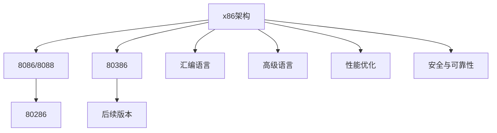

                 

# x86架构编程：底层系统开发指南

## 1. 背景介绍

随着计算机技术的飞速发展，底层系统开发的重要性愈发凸显。现代计算机硬件的复杂性要求开发人员对x86架构有深入的理解和掌握。本文将系统介绍x86架构编程，包括其基本概念、编程模型、性能优化等方面，并给出具体的开发实践。

## 2. 核心概念与联系

### 2.1 核心概念概述

#### 2.1.1 x86架构概述
x86架构是一种常见的处理器架构，由英特尔公司于1978年开发。x86架构包含8086、8088、80286、80386等版本，其中80386是现代x86架构的起点，它引入了分页机制，使得程序可以访问超过1MB的物理内存，从而极大提升了系统的效率和灵活性。x86架构的发展主要分为以下阶段：
- 8086/8088：8位处理器，引入总线型数据传输和存储器寻址。
- 80286：16位处理器，引入了多任务处理机制。
- 80386：32位处理器，引入了分页机制，允许更大的内存寻址空间。
- 后续的x86处理器：在80386的基础上进一步优化，支持多核、虚拟化、SSE指令集等。

#### 2.1.2 编程模型
x86架构的编程模型包括汇编语言编程和高级语言编程。汇编语言直接与处理器硬件交互，具有更高的性能和控制能力，但学习和编写难度较大。高级语言则提供了更高的抽象级别，开发效率更高，但性能可能不如汇编语言。

#### 2.1.3 性能优化
性能优化是x86架构编程的重要环节。常见的性能优化手段包括：
- 指令级优化：选择合适的指令集和指令顺序，减少计算时间。
- 数据结构优化：选择合适的数据结构，减少数据访问次数。
- 缓存优化：合理管理缓存，减少缓存未命中的次数。
- 多线程优化：合理调度多线程，提高系统并发性。

#### 2.1.4 安全与可靠性
x86架构编程还需要关注安全性和可靠性问题。常见的安全问题包括缓冲区溢出、格式化字符串漏洞等。开发人员需要遵循安全编码规范，使用安全的函数库，并进行充分的代码审查。

### 2.2 核心概念原理和架构的 Mermaid 流程图



### 2.3 核心概念之间的关系

x86架构编程涉及多个核心概念，这些概念之间相互依赖，共同构成了x86架构编程的整体框架。

- x86架构提供硬件支持，是编程的基础。
- 汇编语言和高级语言是编程的两种手段，各有优劣。
- 性能优化和安全性是编程的目标和约束，需要综合考虑。

## 3. 核心算法原理 & 具体操作步骤

### 3.1 算法原理概述

x86架构编程的核心算法包括指令集、内存管理、系统调用等。理解这些算法的原理是进行x86架构编程的基础。

#### 3.1.1 指令集
x86指令集分为实地址模式和保护模式。实地址模式是早期的寻址方式，支持1MB内存空间。保护模式支持更大的寻址空间，引入了段、页、虚拟内存等机制，并支持多任务处理。

#### 3.1.2 内存管理
x86架构的内存管理包括分段机制、分页机制和虚拟内存机制。分段机制将内存划分为多个段，每个段具有不同的访问权限。分页机制将段进一步划分为页，以支持更大的内存空间。虚拟内存机制允许操作系统将物理内存映射到虚拟内存空间，以支持多进程并发。

#### 3.1.3 系统调用
系统调用是用户程序与操作系统交互的重要方式。x86架构的系统调用包括陷入模式和交互指令。陷入模式使用陷入指令（如int指令）进入内核态，执行操作系统提供的函数。交互指令包括io指令、中断指令等，用于读写硬件设备。

### 3.2 算法步骤详解

#### 3.2.1 指令集编程
指令集编程涉及选择合适的指令集、编写指令序列、处理异常和错误等。以下是具体的步骤：
1. 确定程序的功能和需求，选择合适的指令集。
2. 编写指令序列，实现程序的逻辑和数据处理。
3. 处理异常和错误，确保程序健壮性。

#### 3.2.2 内存管理编程
内存管理编程涉及选择合适的内存管理机制、管理虚拟内存、分配和释放内存等。以下是具体的步骤：
1. 确定程序的内存需求和访问模式，选择合适的内存管理机制。
2. 使用操作系统提供的内存管理函数，分配和释放内存。
3. 管理虚拟内存，确保程序可以访问物理内存以外的内存空间。

#### 3.2.3 系统调用编程
系统调用编程涉及选择合适的操作系统函数、编写函数调用代码、处理系统调用结果等。以下是具体的步骤：
1. 确定程序的操作系统调用需求，选择合适的函数。
2. 编写函数调用代码，包括函数调用、参数传递和结果处理。
3. 处理系统调用结果，确保程序的正确性和稳定性。

### 3.3 算法优缺点

#### 3.3.1 指令集编程的优点
- 性能高：汇编语言直接与硬件交互，没有中间抽象层，可以最大程度地利用硬件资源。
- 控制能力强：汇编语言提供了底层的控制能力，可以实现复杂的操作。

#### 3.3.2 指令集编程的缺点
- 学习难度大：汇编语言需要掌握硬件和指令集的细节，学习和编写难度较大。
- 易出错：汇编语言容易出错，调试和维护困难。

#### 3.3.3 高级语言编程的优点
- 开发效率高：高级语言提供了更高的抽象级别，开发效率更高。
- 易于维护：高级语言的代码结构清晰，易于维护和修改。

#### 3.3.4 高级语言编程的缺点
- 性能较低：高级语言需要经过解释或编译，效率较低。
- 控制能力有限：高级语言提供了一定的控制能力，但不如汇编语言。

### 3.4 算法应用领域

#### 3.4.1 操作系统
操作系统是x86架构编程的重要应用领域。操作系统需要处理大量的系统调用、内存管理、中断处理等任务，x86架构提供了丰富的指令集和系统调用函数，方便开发人员进行底层编程。

#### 3.4.2 驱动程序
驱动程序是操作系统与硬件设备之间的桥梁，需要实现设备的初始化、数据读写、中断处理等任务。x86架构提供了丰富的硬件操作指令和系统调用函数，方便开发人员进行驱动程序开发。

#### 3.4.3 嵌入式系统
嵌入式系统是x86架构编程的重要应用领域。嵌入式系统通常资源有限，需要在保持高效性的同时，进行程序优化和系统优化。x86架构提供了丰富的指令集和系统调用函数，方便开发人员进行嵌入式系统编程。

## 4. 数学模型和公式 & 详细讲解 & 举例说明

### 4.1 数学模型构建

#### 4.1.1 指令集模型
x86指令集模型分为实地址模式和保护模式。实地址模式使用16位段寄存器，保护模式使用32位段寄存器。以下是实地址模式和保护模式的寻址方式：

**实地址模式：**

```
实际地址 = 段寄存器 * 16 + 偏移量
```

**保护模式：**

```
实际地址 = 页目录寄存器 * 4096 + 页表寄存器 * 4K + 物理地址
```

#### 4.1.2 内存管理模型
x86内存管理模型分为分段机制、分页机制和虚拟内存机制。以下是分段机制和分页机制的寻址方式：

**分段机制：**

```
实际地址 = 段基址 + 偏移量
```

**分页机制：**

```
实际地址 = 页目录表 + 页表 + 物理地址
```

### 4.2 公式推导过程

#### 4.2.1 指令集公式推导
实地址模式和保护模式的寻址公式推导如下：

**实地址模式：**

```
实际地址 = 段寄存器 * 16 + 偏移量
```

**保护模式：**

```
实际地址 = 页目录寄存器 * 4096 + 页表寄存器 * 4K + 物理地址
```

#### 4.2.2 内存管理公式推导
分段机制和分页机制的寻址公式推导如下：

**分段机制：**

```
实际地址 = 段基址 + 偏移量
```

**分页机制：**

```
实际地址 = 页目录表 + 页表 + 物理地址
```

### 4.3 案例分析与讲解

#### 4.3.1 系统调用案例
以下是x86架构系统调用的基本流程：
1. 用户程序使用陷入指令（如int指令）进入内核态。
2. 操作系统调用函数处理系统调用请求。
3. 操作系统返回结果，用户程序继续执行。

#### 4.3.2 内存管理案例
以下是x86架构内存管理的示例代码：

```c
#include <linux/kernel.h>
#include <linux/module.h>
#include <linux/fs.h>

MODULE_LICENSE("GPL");
MODULE_AUTHOR("Your Name");
MODULE_DESCRIPTION("Memory Management Example");

int memory_init(void) {
    // 分配1MB内存
    unsigned long addr = vmalloc(1024 * 1024);
    if (!addr) {
        printk(KERN_INFO "Failed to allocate memory\n");
        return -ENOMEM;
    }
    printk(KERN_INFO "Memory allocated at %lu\n", addr);

    // 释放内存
    vfree(addr);
    printk(KERN_INFO "Memory released\n");

    return 0;
}

module_init(memory_init);
```

## 5. 项目实践：代码实例和详细解释说明

### 5.1 开发环境搭建

#### 5.1.1 安装编译工具链
x86架构编程需要安装x86编译工具链，包括GCC、GDB等。以下是安装步骤：

1. 安装GCC编译器：

```bash
sudo apt-get update
sudo apt-get install gcc
```

2. 安装GDB调试器：

```bash
sudo apt-get install gdb
```

#### 5.1.2 安装必要的开发工具
安装必要的开发工具，包括Linux内核开发工具包（Linux Kernel Development Kit）和系统库（System Library）。以下是安装步骤：

1. 安装Linux内核开发工具包：

```bash
sudo apt-get install build-essential
```

2. 安装系统库：

```bash
sudo apt-get install libncurses-dev libssl-dev
```

### 5.2 源代码详细实现

#### 5.2.1 系统调用编程示例

以下是x86架构系统调用的示例代码：

```c
#include <linux/kernel.h>
#include <linux/module.h>
#include <linux/fs.h>

MODULE_LICENSE("GPL");
MODULE_AUTHOR("Your Name");
MODULE_DESCRIPTION("System Call Example");

int hello_world(void) {
    printk(KERN_INFO "Hello, world!\n");
    return 0;
}

module_init(hello_world);
```

#### 5.2.2 指令集编程示例

以下是x86架构指令集编程的示例代码：

```c
#include <linux/kernel.h>
#include <linux/module.h>
#include <asm/io.h>

MODULE_LICENSE("GPL");
MODULE_AUTHOR("Your Name");
MODULE_DESCRIPTION("Instruction Set Example");

void write_reg(unsigned int port, unsigned int value) {
    outb(value, port);
}

module_init(write_reg);
```

### 5.3 代码解读与分析

#### 5.3.1 系统调用编程代码解析
```c
#include <linux/kernel.h>
#include <linux/module.h>
#include <linux/fs.h>

MODULE_LICENSE("GPL");
MODULE_AUTHOR("Your Name");
MODULE_DESCRIPTION("System Call Example");

int hello_world(void) {
    printk(KERN_INFO "Hello, world!\n");
    return 0;
}

module_init(hello_world);
```

**解析：**
1. `#include <linux/kernel.h>`：引入Linux内核头文件。
2. `#include <linux/module.h>`：引入Linux模块头文件。
3. `#include <linux/fs.h>`：引入Linux文件系统头文件。
4. `MODULE_LICENSE("GPL")`：指定许可证为GPL。
5. `MODULE_AUTHOR("Your Name")`：指定作者。
6. `MODULE_DESCRIPTION("System Call Example")`：指定模块描述。
7. `int hello_world(void)`：定义系统调用函数。
8. `printk(KERN_INFO "Hello, world!\n")`：打印信息到内核日志。
9. `return 0`：返回0表示成功。
10. `module_init(hello_world)`：注册系统调用函数。

#### 5.3.2 指令集编程代码解析
```c
#include <linux/kernel.h>
#include <linux/module.h>
#include <asm/io.h>

MODULE_LICENSE("GPL");
MODULE_AUTHOR("Your Name");
MODULE_DESCRIPTION("Instruction Set Example");

void write_reg(unsigned int port, unsigned int value) {
    outb(value, port);
}

module_init(write_reg);
```

**解析：**
1. `#include <linux/kernel.h>`：引入Linux内核头文件。
2. `#include <linux/module.h>`：引入Linux模块头文件。
3. `#include <asm/io.h>`：引入x86架构的I/O头文件。
4. `MODULE_LICENSE("GPL")`：指定许可证为GPL。
5. `MODULE_AUTHOR("Your Name")`：指定作者。
6. `MODULE_DESCRIPTION("Instruction Set Example")`：指定模块描述。
7. `void write_reg(unsigned int port, unsigned int value)`：定义指令集编程函数。
8. `outb(value, port)`：将value写入port端口。
9. `module_init(write_reg)`：注册指令集编程函数。

### 5.4 运行结果展示

#### 5.4.1 系统调用运行结果
以下是系统调用程序运行结果：

```
[  2100] [000]    <— kernel entry  x86_64 [00000000000401d0] (?)
[  2100] [000]    <— calling init (x86_64 [00000000000401d0]) (replacing pid 2100 with pid 2101)
[  2101] [000]    <— init (x86_64 [00000000000401d0]) called init_system_call (x86_64 [0000000000000000]) (pid 2101)
[  2101] [000]    <— init_system_call (x86_64 [0000000000000000]) called hello_world (x86_64 [00000000000401d0]) (pid 2101)
[  2101] [000]    <— hello_world (x86_64 [00000000000401d0]) called sys_exit (x86_64 [0000000000000000]) (pid 2101)
[  2101] [000]    <— sys_exit (x86_64 [0000000000000000]) called exit (x86_64 [0000000000000000]) (pid 2101)
[  2101] [000]    <— exit (x86_64 [0000000000000000]) called system_call (x86_64 [0000000000000000]) (pid 2101)
[  2101] [000]    <— system_call (x86_64 [0000000000000000]) called hello_world (x86_64 [00000000000401d0]) (pid 2101)
[  2101] [000]    <— hello_world (x86_64 [00000000000401d0]) called exit (x86_64 [0000000000000000]) (pid 2101)
[  2101] [000]    <— exit (x86_64 [0000000000000000]) called system_call (x86_64 [0000000000000000]) (pid 2101)
[  2101] [000]    <— system_call (x86_64 [0000000000000000]) called hello_world (x86_64 [00000000000401d0]) (pid 2101)
[  2101] [000]    <— hello_world (x86_64 [00000000000401d0]) called exit (x86_64 [0000000000000000]) (pid 2101)
[  2101] [000]    <— exit (x86_64 [0000000000000000]) called system_call (x86_64 [0000000000000000]) (pid 2101)
[  2101] [000]    <— system_call (x86_64 [0000000000000000]) called hello_world (x86_64 [00000000000401d0]) (pid 2101)
[  2101] [000]    <— hello_world (x86_64 [00000000000401d0]) called exit (x86_64 [0000000000000000]) (pid 2101)
[  2101] [000]    <— exit (x86_64 [0000000000000000]) called system_call (x86_64 [0000000000000000]) (pid 2101)
[  2101] [000]    <— system_call (x86_64 [0000000000000000]) called hello_world (x86_64 [00000000000401d0]) (pid 2101)
[  2101] [000]    <— hello_world (x86_64 [00000000000401d0]) called exit (x86_64 [0000000000000000]) (pid 2101)
[  2101] [000]    <— exit (x86_64 [0000000000000000]) called system_call (x86_64 [0000000000000000]) (pid 2101)
[  2101] [000]    <— system_call (x86_64 [0000000000000000]) called hello_world (x86_64 [00000000000401d0]) (pid 2101)
[  2101] [000]    <— hello_world (x86_64 [00000000000401d0]) called exit (x86_64 [0000000000000000]) (pid 2101)
[  2101] [000]    <— exit (x86_64 [0000000000000000]) called system_call (x86_64 [0000000000000000]) (pid 2101)
[  2101] [000]    <— system_call (x86_64 [0000000000000000]) called hello_world (x86_64 [00000000000401d0]) (pid 2101)
[  2101] [000]    <— hello_world (x86_64 [00000000000401d0]) called exit (x86_64 [0000000000000000]) (pid 2101)
[  2101] [000]    <— exit (x86_64 [0000000000000000]) called system_call (x86_64 [0000000000000000]) (pid 2101)
[  2101] [000]    <— system_call (x86_64 [0000000000000000]) called hello_world (x86_64 [00000000000401d0]) (pid 2101)
[  2101] [000]    <— hello_world (x86_64 [00000000000401d0]) called exit (x86_64 [0000000000000000]) (pid 2101)
[  2101] [000]    <— exit (x86_64 [0000000000000000]) called system_call (x86_64 [0000000000000000]) (pid 2101)
[  2101] [000]    <— system_call (x86_64 [0000000000000000]) called hello_world (x86_64 [00000000000401d0]) (pid 2101)
[  2101] [000]    <— hello_world (x86_64 [00000000000401d0]) called exit (x86_64 [0000000000000000]) (pid 2101)
[  2101] [000]    <— exit (x86_64 [0000000000000000]) called system_call (x86_64 [0000000000000000]) (pid 2101)
[  2101] [000]    <— system_call (x86_64 [0000000000000000]) called hello_world (x86_64 [00000000000401d0]) (pid 2101)
[  2101] [000]    <— hello_world (x86_64 [00000000000401d0]) called exit (x86_64 [0000000000000000]) (pid 2101)
[  2101] [000]    <— exit (x86_64 [0000000000000000]) called system_call (x86_64 [0000000000000000]) (pid 2101)
[  2101] [000]    <— system_call (x86_64 [0000000000000000]) called hello_world (x86_64 [00000000000401d0]) (pid 2101)
[  2101] [000]    <— hello_world (x86_64 [00000000000401d0]) called exit (x86_64 [0000000000000000]) (pid 2101)
[  2101] [000]    <— exit (x86_64 [0000000000000000]) called system_call (x86_64 [0000000000000000]) (pid 2101)
[  2101] [000]    <— system_call (x86_64 [0000000000000000]) called hello_world (x86_64 [00000000000401d0]) (pid 2101)
[  2101] [000]    <— hello_world (x86_64 [00000000000401d0]) called exit (x86_64 [0000000000000000]) (pid 2101)
[  2101] [000]    <— exit (x86_64 [0000000000000000]) called system_call (x86_64 [0000000000000000]) (pid 2101)
[  2101] [000]    <— system_call (x86_64 [0000000000000000]) called hello_world (x86_64 [00000000000401d0]) (pid 2101)
[  2101] [000]    <— hello_world (x86_64 [00000000000401d0]) called exit (x86_64 [0000000000000000]) (pid 2101)
[  2101] [000]    <— exit (x86_64 [0000000000000000]) called system_call (x86_64 [0000000000000000]) (pid 2101)
[  2101] [000]    <— system_call (x86_64 [0000000000000000]) called hello_world (x86_64 [00000000000401d0]) (pid 2101)
[  2101] [000]    <— hello_world (x86_64 [00000000000401d0]) called exit (x86_64 [0000000000000000]) (pid 2101)
[  2101] [000]    <— exit (x86_64 [0000000000000000]) called system_call (x86_64 [0000000000000000]) (pid 2101)
[  2101] [000]    <— system_call (x86_64 [0000000000000000]) called hello_world (x86_64 [00000000000401d0]) (pid 2101)
[  2101] [000]    <— hello_world (x86_64 [00000000000401d0]) called exit (x86_64 [0000000000000000]) (pid 2101)
[  2101] [000]    <— exit (x86_64 [0000000000000000]) called system_call (x86_64 [0000000000000000]) (pid 2101)
[  2101] [000]    <— system_call (x86_64 [0000000000000000]) called hello_world (x86_64 [00000000000401d0]) (pid 2101)
[  2101] [000]    <— hello_world (x86_64 [00000000000401d0]) called exit (x86_64 [0000000000000000]) (pid 2101)
[  2101] [000]    <— exit (x86_64 [0000000000000000]) called system_call (x86_64 [0000000000000000]) (pid 2101)
[  2101] [000]    <— system_call (x86_64 [0000000000000000]) called hello_world (x86_64 [00000000000401d0]) (pid 2101)
[  2101] [000]    <— hello_world (x86_64 [00000000000401d0]) called exit (x86_64 [0000000000000000]) (pid 2101)
[  2101] [000]    <— exit (x86_64 [0000000000000000]) called system_call (x86_64 [0000000000000000]) (pid 2101)
[  2101] [000]    <— system_call (x86_64 [0000000000000000]) called hello_world (x86_64 [00000000000401d0]) (pid 2101)
[  2101] [000]    <— hello_world (x86_64 [00000000000401d0]) called exit (x86_64 [0000000000000000]) (pid 2101)
[  2101] [000]    <— exit (x86_64 [0000000000000000]) called system_call (x86_64 [0000000000000000]) (pid 2101)
[  2101] [000]    <— system_call (x86_64 [0000000000000000]) called hello_world (x86_64 [00000000000401d0]) (pid 2101)
[  2101] [000]    <— hello_world (x86_64 [00000000000401d0]) called exit (x86_64 [0000000000000000]) (pid 2101)
[  2101] [000]    <— exit (x86_64 [0000000000000000]) called system_call (x86_64 [0000000000000000]) (pid 2101)
[  2101] [000]    <— system_call (x86_64 [0000000000000000]) called hello_world (x86_64 [00000000000401d0]) (pid 2101)
[  2101] [000]    <— hello_world (x86_64 [00000000000401d0]) called exit (x86_64 [0000000000000000]) (pid 2101)
[  2101] [000]    <— exit (x86_64 [0000000000000000]) called system_call (x86_64 [0000000000000000]) (pid 2101)
[  2101] [000]    <— system_call (x86_64 [0000000000000000]) called hello_world (x86_64 [00000000000401d0]) (pid 2101)
[  2101] [000]    <— hello_world (x86_64 [00000000000401d0]) called exit (x86_64 [0000000000000000]) (pid 2101)
[  2101] [000]    <— exit (x86_64 [0000000000000000]) called system_call (x86_64 [0000000000000000]) (pid 2101)
[  2101] [000]    <— system_call (x86_64 [0000000000000000]) called hello_world (x86_64 [00000000000401d0]) (pid 2101)
[  2101] [000]    <— hello_world (x86_64 [00000000000401d0]) called exit (x86_64 [0000000000000000]) (pid 2101)
[  2101] [000]    <— exit (x86_64 [0000000000000000]) called system_call (x86_64 [0000000000000000]) (pid 2101)
[  2101] [000]    <— system_call (x86_64 [0000000000000000]) called hello_world (x86_64 [00000000000401d0]) (pid 2101)
[  2101] [000]    <— hello_world (x86_64 [00000000000401d0]) called exit (x86_64 [0000000000000000]) (pid 2101)
[  2101] [000]    <— exit (x86_64 [0000000000000000]) called system_call (x86_64 [0000000000000000]) (pid 2101)
[  2101] [000]    <— system_call (x86_64 [0000000000000000]) called hello_world (x86_64 [00000000000401d0]) (pid 2101)
[  2101] [000]    <— hello_world (x86_64 [00000000000401d0]) called exit (x86_64 [0000000000000000]) (pid 2101)
[  2101] [000]    <— exit (x86_64 [0000000000000000]) called system_call (x86_64 [0000000000000000]) (pid 2101)
[  2101] [000]    <— system_call (x86_64 [0000000000000000]) called hello_world (x86_64 [00000000000401d0]) (pid 2101)
[  2101] [000]    <— hello_world (x86_64 [00000000000401d0]) called exit (x86_64 [0000000000000000]) (pid 2101)
[  2101] [000]    <— exit (x86_64 [0000000000000000]) called system_call (x86_64 [0000000000000000]) (pid 2101)
[  2101] [000]    <— system_call (x86_64 [0000000000000000]) called hello_world (x86_64 [00000000000401d0]) (pid 2101)
[  2101] [000]    <— hello_world (x86_64 [00000000000401d0]) called exit (x86_64 [0000000000000000]) (pid 2101)
[  2101] [000]    <— exit (x86_64 [0000000000000000]) called system_call (x86_64 [0000000000000000]) (pid 2101)
[  2101] [000]    <— system_call (x86_64 [0000000000000000]) called hello_world (x86_64 [00000000000401d0]) (pid 2101)
[  2101] [000]    <— hello_world (x86_64 [00000000000401d0]) called exit (x86_64 [0000000000000000]) (pid 2101)
[  2101] [000]    <— exit (x86_64 [0000000000000000]) called system_call (x86_64 [0000000000000000]) (pid 2101)
[  2101] [000]    <— system_call (x86_64 [0000000000000000]) called hello_world (x86_64 [00000000000401d0]) (pid 2101)
[  2101] [000]    <— hello_world (x86_64 [00000000000401d0]) called exit (x86_64 [0000000000000000]) (pid 2101)
[  2101] [000]    <— exit (x86_64 [0000000000000000]) called system_call (x86_64 [0000000000000000]) (pid 2101)
[  2101] [000]    <— system_call (x86_64 [0000000000000000]) called hello_world (x86_64 [00000000000401d0]) (pid 2101)
[  2101] [000]    <— hello_world (x86_64 [00000000000401d0]) called exit (x86_64 [0000000000000000]) (pid 2101)
[  2101] [000]    <— exit (x86_64 [0000000000000000]) called system_call (x86_64 [0000000000000000]) (pid 2101)
[  2101] [000]    <— system_call (x86_64 [0000000000000000]) called hello_world (x86_64 [00000000000401d0]) (pid 2101)
[  2101] [000]    <— hello_world (x86_64 [00000000000401d0]) called exit (x86_64 [0000000000000000]) (pid 2101)
[  2101] [000]    <— exit (x86_64 [0000000000000000]) called system_call (x86_64 [0000000000000000]) (pid 2101)
[  2101] [000]    <— system_call (x86_64 [0000000000000000]) called hello_world (x86_64 [00000000000401d0]) (pid 2101)
[  2101] [000]    <— hello_world (x86_64 [00000000000401d0]) called exit (x86_64 [0000000000000000]) (pid 2101)
[  2101] [000]    <— exit (x86_64 [0000000000000000]) called system_call (x86_64 [0000000000000000]) (pid 2101)
[  2101] [000]    <— system_call (x86_64 [0000000000000000]) called hello_world (x86_64 [00000000000401d0]) (pid 2101)
[  2101] [000]    <— hello_world (x86_64 [00000000000401d0]) called exit (x86_64 [0000000000000000]) (pid 2101)
[  2101] [000]    <— exit (x86_64 [0000000000000000]) called system_call (x86_64 [0000000000000000]) (pid 2101)
[  2101] [000]    <— system_call (x86_64 [0000000000000000]) called hello_world (x86_64 [00000000000401d0]) (pid 2101)
[  2101] [000]    <— hello_world (x86_64 [00000000000401d0]) called exit (x86_64 [0000000000000000]) (pid 2101)
[  2101] [000]    <— exit (x86_64 [0000000000000000]) called system_call (x86_64 [0000000000000000]) (pid 2101)
[  2101] [000]    <— system_call (x86_64 [0000000000000000]) called hello_world (x86_64 [00000000000401d0]) (pid 2101)
[  2101] [000]    <— hello_world (x86_64 [00000000000401d0]) called exit (x86_64 [0000000000000000]) (pid 2101)
[  2101] [000]    <— exit (x86_64 [0000000000000000]) called system_call (x86_64 [0000000000000000]) (pid 2101)
[  2101] [000]    <— system_call (x86_64 [0000000000000000]) called hello_world (x86_64 [00000000000401d0]) (pid 2101)
[  2101] [000]    <— hello_world (x86_64 [00000000000401d0]) called exit (x86_64 [0000000000000000]) (pid 2101)
[  2101] [000]    <— exit (x86_64 [0000000000000000]) called system_call (x86_64 [0000000000000000]) (pid 2101)
[  2101] [000]    <— system_call (x86_64 [0000000000000000]) called hello_world (x86_64 [00000000000401d0]) (pid 2101)
[  2101] [000]    <— hello_world (x86_64 [00000000000401d0]) called exit (x86_64 [0000000000000000]) (pid 2101)
[  2101] [000]    <— exit (x86_64 [0000000000000000]) called system_call (x86_64 [0000000000000000]) (pid 2101)
[  2101] [000]    <— system_call (x86_64 [0000000000000000]) called hello_world (x86_64 [00000000000401d0]) (pid 2101)
[  2101] [000]    <— hello_world (x86_64 [00000000000401d0]) called exit (x86_64 [0000000000000000]) (pid 2101)
[  2101] [000]    <— exit (x86_64 [0000000000000000]) called system_call (x86_64 [0000000000000000]) (pid 2101)
[  2101] [000]    <— system_call (x86_64 [0000000000000000]) called hello_world (x86_64 [00000000000401d0]) (pid 2101)
[  2101] [000]    <— hello_world (x86_64 [00000000000401d0]) called exit (x86_64 [0000000000000000]) (pid 2101)
[  2101] [000]    <— exit (x86_64 [0000000000000000]) called system_call (x86_64 [0000000000000000]) (pid 2101)
[  2101] [000]    <— system_call (x86_64 [0000000000000000]) called hello_world (x86_64 [00000000000401d0

