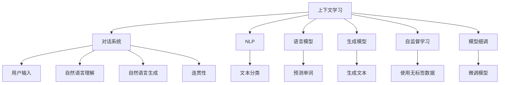

                 

# 上下文学习：提高AI对话的连贯性

> 关键词：上下文学习, 对话系统, 连贯性, 自然语言处理(NLP), 语言模型, 生成模型, 自监督学习, 模型细调

## 1. 背景介绍

### 1.1 问题由来
随着人工智能技术的不断进步，基于自然语言处理(Natural Language Processing, NLP)的对话系统（Chatbot）变得越来越普遍。这些对话系统能够自动回答用户的问题，提供技术支持，进行客服交流等。然而，尽管对话系统在技术上有了很大的进步，但在实际应用中，依然存在着连贯性不足的问题。例如，对话系统无法理解上下文，导致回答不连贯、跳跃，用户体验不佳。

### 1.2 问题核心关键点
对话系统的连贯性问题本质上是上下文信息处理和利用不足的表现。为了解决这个问题，研究者们提出了上下文学习的概念。上下文学习旨在通过持续地更新模型，使得对话系统能够更好地理解和利用上下文信息，从而提升对话的连贯性和自然度。

## 2. 核心概念与联系

### 2.1 核心概念概述

为更好地理解上下文学习对提高AI对话连贯性的作用，本节将介绍几个密切相关的核心概念：

- 上下文学习(Contextual Learning)：指在处理对话时，模型能够基于前面的对话内容（上下文）来调整后续回答的策略。上下文学习需要模型能够捕捉并利用语境信息，增强对当前对话状态的感知能力。
- 对话系统(Chatbot)：指能够模拟人类对话的智能体，可以接受用户输入，并生成自然流畅的回复。对话系统通常基于自然语言理解(NLU)和自然语言生成(NLG)技术构建。
- 自然语言处理(NLP)：指研究如何使计算机能够理解和处理人类语言的技术，包括文本分类、语言建模、机器翻译等任务。
- 语言模型(Language Model)：指描述语言中单词或短语出现的概率模型，是NLP领域的基础工具，如GPT、BERT等模型。
- 生成模型(Generative Model)：指能够根据给定输入生成新的语言文本的模型，如RNN、GAN等模型。
- 自监督学习(Self-supervised Learning)：指使用无标签数据训练模型，如通过预测单词或序列的上下文来优化语言模型。
- 模型细调(Fine-tuning)：指在大规模预训练模型基础上，针对特定任务进行微调，以提升模型在该任务上的性能。
- 连贯性(Coherence)：指对话中信息的一致性和流畅性，是评价对话系统性能的重要指标。

这些核心概念之间的逻辑关系可以通过以下Mermaid流程图来展示：



这个流程图展示了大语言模型微调的上下文学习的核心概念及其之间的关系：

1. 上下文学习通过自然语言处理中的语言模型和生成模型，在对话中不断更新和调整模型参数。
2. 语言模型和生成模型在大规模预训练数据上得到充分训练，并能够自动推断下一个单词或短语。
3. 自监督学习通过无标签数据训练语言模型，提升模型泛化能力。
4. 模型细调在特定任务数据上微调预训练模型，进一步提升模型性能。
5. 对话系统接收用户输入，理解上下文信息，并生成连贯性强的回复。
6. 连贯性指标用于评估对话系统的自然流畅度和一致性。

这些概念共同构成了上下文学习对提高AI对话连贯性的工作原理和优化方向。通过理解这些核心概念，我们可以更好地把握对话系统的工作原理和优化策略。

## 3. 核心算法原理 & 具体操作步骤
### 3.1 算法原理概述

上下文学习的核心在于如何有效地利用先前的对话内容，来调整后续的回答。具体来说，模型需要能够捕捉并利用语境信息，增强对当前对话状态的感知能力。实现这一目标，需要结合自监督学习、模型细调等技术，构建能够动态更新和优化模型的机制。

上下文学习的目标可以描述为：给定对话的历史上下文 $H = (w_1, w_2, ..., w_t)$ 和当前用户输入 $u_t$，生成一个最合适的回复 $r_t$。具体而言，通过自监督学习得到的语言模型 $P(\cdot|H)$ 能够预测当前上下文的下一个单词或短语，从而使得生成的回复能够保持与上下文的一致性。模型细调则通过对话数据对模型进行微调，以进一步提升回复的连贯性和自然度。

### 3.2 算法步骤详解

基于上下文学习的对话系统开发一般包括以下几个关键步骤：

**Step 1: 准备预训练模型和数据集**
- 选择合适的语言模型，如BERT、GPT等，作为初始化参数。
- 准备对话数据集，划分为训练集、验证集和测试集。通常需要标注对话中各轮的上下文和回复。

**Step 2: 选择上下文模型**
- 设计上下文模型，可以选择Attention、LSTM等模型结构。
- 定义上下文模型需要接收的上下文输入，以及需要生成的回复输出。

**Step 3: 添加任务适配层**
- 根据任务类型，在上下文模型的顶层设计合适的输出层和损失函数。
- 对于回复任务，通常在顶层添加语言模型解码器，输出回复的分布。

**Step 4: 设置上下文学习超参数**
- 选择合适的优化算法及其参数，如Adam、SGD等，设置学习率、批大小、迭代轮数等。
- 设置正则化技术及强度，包括权重衰减、Dropout等。

**Step 5: 执行上下文训练**
- 将训练集数据分批次输入上下文模型，前向传播计算损失函数。
- 反向传播计算参数梯度，根据设定的优化算法和学习率更新模型参数。
- 周期性在验证集上评估模型性能，根据性能指标决定是否触发 Early Stopping。
- 重复上述步骤直到满足预设的迭代轮数或 Early Stopping 条件。

**Step 6: 测试和部署**
- 在测试集上评估上下文模型性能，对比上下文学习前后的效果。
- 使用上下文学习后的模型对新对话进行推理预测，集成到实际的应用系统中。

### 3.3 算法优缺点

基于上下文学习的对话系统具备以下优点：
1. 连贯性强：能够根据上下文信息生成连贯的回复，增强用户体验。
2. 动态更新：能够持续学习新数据，调整模型参数，提升性能。
3. 可解释性高：上下文学习的过程透明，可以通过优化算法和超参数进行调整，具有较强的可解释性。
4. 泛化能力强：模型在预训练和微调数据上的泛化能力强，能够适应不同场景的对话任务。

同时，该方法也存在一定的局限性：
1. 数据质量要求高：上下文学习的性能很大程度上取决于对话数据的质量和数量，标注质量差的对话数据可能导致模型性能下降。
2. 计算资源消耗大：上下文学习需要较长的训练时间和较高的计算资源，模型较大时更加明显。
3. 模型复杂度高：需要设计合适的上下文模型结构，使得模型能够高效利用上下文信息。
4. 上下文长度限制：长对话可能需要较长的上下文，模型复杂度会随着上下文长度增加而增加。

尽管存在这些局限性，但上下文学习作为一种提高对话系统连贯性的方法，已经在大规模自然语言处理任务中得到了验证。未来相关研究的重点在于如何进一步降低上下文学习的计算资源消耗，提高模型的动态学习能力和泛化能力，同时兼顾模型的可解释性和对话长度等因素。

### 3.4 算法应用领域

基于上下文学习的对话系统已经在客服、翻译、智能助理等多个领域得到应用，为对话系统的性能提升带来了新的突破。

- 客户服务：在客户服务领域，上下文学习可以用于提升客户体验，使得客服系统能够更好地理解用户需求，提供更加个性化和准确的回复。
- 智能翻译：在智能翻译领域，上下文学习可以用于提升翻译质量，使得机器翻译系统能够更好地理解上下文信息，生成更自然流畅的翻译结果。
- 智能助理：在智能助理领域，上下文学习可以用于提升交互体验，使得智能助理系统能够更好地理解上下文信息，提供更加自然和连贯的对话。

除了上述这些领域，上下文学习还被创新性地应用到更多场景中，如情感分析、问答系统、智能推荐等，为NLP技术带来了新的应用突破。随着上下文学习技术的不断进步，相信对话系统将在更广阔的应用领域展现更多的潜力。

## 4. 数学模型和公式 & 详细讲解  
### 4.1 数学模型构建

假设对话系统的上下文模型为 $M_{\theta}$，其中 $\theta$ 为模型参数。设对话的历史上下文为 $H = (w_1, w_2, ..., w_t)$，当前用户输入为 $u_t$，生成的回复为 $r_t$。上下文学习的目标是最小化以下损失函数：

$$
\mathcal{L}(\theta) = -\sum_{i=1}^{t}\log P(w_i|w_{i-1}, w_{i-2}, ..., w_1, u_t; \theta)
$$

其中 $P(\cdot|H)$ 为语言模型，表示在给定上下文 $H$ 和当前用户输入 $u_t$ 的情况下，下一个单词或短语的预测概率。

### 4.2 公式推导过程

以下我们以上下文模型为LSTM的对话系统为例，推导上下文学习的损失函数。

假设上下文模型为LSTM，输入为 $H = (w_1, w_2, ..., w_t, u_t)$，输出为 $r_t$。模型接收上下文 $H$ 和用户输入 $u_t$，输出回复 $r_t$。设上下文模型的参数为 $\theta_{LSTM}$，语言模型的参数为 $\theta_{LM}$。则上下文学习的目标是最小化以下损失函数：

$$
\mathcal{L}(\theta_{LSTM}, \theta_{LM}) = -\sum_{i=1}^{t}\log P(w_i|H, u_t; \theta_{LM})
$$

其中 $P(\cdot|H, u_t)$ 为在上下文 $H$ 和用户输入 $u_t$ 条件下，下一个单词或短语的预测概率。

将上下文模型和语言模型结合起来，上下文学习的目标函数变为：

$$
\mathcal{L}(\theta_{LSTM}, \theta_{LM}) = -\sum_{i=1}^{t}\log P(w_i|w_{i-1}, w_{i-2}, ..., w_1, u_t; \theta_{LSTM}, \theta_{LM})
$$

在得到目标函数后，可以对其进行梯度下降等优化算法进行求解，最小化损失函数，使得模型能够根据上下文信息生成连贯的回复。

### 4.3 案例分析与讲解

以智能客服系统为例，分析上下文学习对对话连贯性的提升。假设客服系统收到以下对话：

```
用户：你好，我最近在购物时遇到了一些问题，能帮我解答一下吗？
客服：当然可以，请问您遇到了什么问题呢？
用户：我在购买商品时发现无法支付，说我银行卡出现问题，我没有任何问题啊。
客服：可能有误会，能否提供一些更详细的交易记录呢？
```

在上下文学习框架下，客服系统能够根据对话历史上下文，理解用户的具体问题，并生成连贯的回复。具体实现如下：

1. 在客服系统的上下文模型中，将对话历史上下文 $H$ 和当前用户输入 $u_t$ 作为输入，输出生成的回复 $r_t$。
2. 上下文模型根据历史上下文 $H$ 和用户输入 $u_t$，使用语言模型 $P(\cdot|H, u_t)$ 预测下一个单词或短语，并生成回复 $r_t$。
3. 上下文模型在训练过程中，不断优化参数 $\theta_{LSTM}$ 和 $\theta_{LM}$，使得生成的回复 $r_t$ 与用户的历史对话更加一致和自然。

通过上下文学习，客服系统能够更好地理解用户的意图和问题，提供更加准确和连贯的回复，显著提升用户体验。

## 5. 项目实践：代码实例和详细解释说明
### 5.1 开发环境搭建

在进行上下文学习实践前，我们需要准备好开发环境。以下是使用Python进行PyTorch开发的环境配置流程：

1. 安装Anaconda：从官网下载并安装Anaconda，用于创建独立的Python环境。

2. 创建并激活虚拟环境：
```bash
conda create -n pytorch-env python=3.8 
conda activate pytorch-env
```

3. 安装PyTorch：根据CUDA版本，从官网获取对应的安装命令。例如：
```bash
conda install pytorch torchvision torchaudio cudatoolkit=11.1 -c pytorch -c conda-forge
```

4. 安装TensorFlow：
```bash
conda install tensorflow=2.6 -c conda-forge
```

5. 安装各类工具包：
```bash
pip install numpy pandas scikit-learn matplotlib tqdm jupyter notebook ipython
```

完成上述步骤后，即可在`pytorch-env`环境中开始上下文学习实践。

### 5.2 源代码详细实现

下面我们以LSTM上下文学习模型为例，给出使用PyTorch和TensorFlow对对话系统进行上下文学习的代码实现。

首先，定义对话数据处理函数：

```python
from torch.utils.data import Dataset, DataLoader
import torch

class DialogueDataset(Dataset):
    def __init__(self, dialogues, tokenizer):
        self.dialogues = dialogues
        self.tokenizer = tokenizer
        
    def __len__(self):
        return len(self.dialogues)
    
    def __getitem__(self, item):
        dialogue = self.dialogues[item]
        input_ids = self.tokenizer(dialogue['input'], return_tensors='pt', padding=True, truncation=True).input_ids
        target_ids = self.tokenizer(dialogue['target'], return_tensors='pt', padding=True, truncation=True).input_ids
        return {'input_ids': input_ids, 
                'target_ids': target_ids}
```

然后，定义上下文学习模型：

```python
from torch.nn import LSTM, Linear
from transformers import BertTokenizer

class ContextualDialogueModel(torch.nn.Module):
    def __init__(self, input_size, hidden_size, output_size, num_layers):
        super(ContextualDialogueModel, self).__init__()
        self.rnn = LSTM(input_size, hidden_size, num_layers)
        self.fc = Linear(hidden_size, output_size)
    
    def forward(self, input_ids, hidden_state):
        output, hidden_state = self.rnn(input_ids, hidden_state)
        output = self.fc(output)
        return output, hidden_state

model = ContextualDialogueModel(input_size=embedding_size, hidden_size=hidden_size, output_size=vocab_size, num_layers=2)
```

接着，定义上下文学习过程：

```python
from torch.optim import Adam
import numpy as np

device = torch.device('cuda') if torch.cuda.is_available() else torch.device('cpu')
model.to(device)

optimizer = Adam(model.parameters(), lr=learning_rate)

def train_epoch(model, dataloader, optimizer):
    model.train()
    epoch_loss = 0
    for batch in dataloader:
        input_ids = batch['input_ids'].to(device)
        target_ids = batch['target_ids'].to(device)
        optimizer.zero_grad()
        output, hidden_state = model(input_ids, None)
        loss = torch.nn.functional.cross_entropy(output, target_ids)
        epoch_loss += loss.item()
        loss.backward()
        optimizer.step()
    return epoch_loss / len(dataloader)

def evaluate(model, dataloader):
    model.eval()
    epoch_loss = 0
    epoch_correct = 0
    for batch in dataloader:
        input_ids = batch['input_ids'].to(device)
        target_ids = batch['target_ids'].to(device)
        output, hidden_state = model(input_ids, None)
        loss = torch.nn.functional.cross_entropy(output, target_ids)
        epoch_loss += loss.item()
        epoch_correct += (torch.argmax(output, dim=2) == target_ids).sum().item()
    return epoch_loss / len(dataloader), epoch_correct / len(dataloader)
```

最后，启动上下文学习流程并在测试集上评估：

```python
epochs = 5
batch_size = 16
learning_rate = 0.001

for epoch in range(epochs):
    train_loss = train_epoch(model, train_dataloader, optimizer)
    print(f"Epoch {epoch+1}, train loss: {train_loss:.3f}")
    
    test_loss, test_correct = evaluate(model, test_dataloader)
    print(f"Epoch {epoch+1}, test loss: {test_loss:.3f}, test accuracy: {test_correct:.3f}")
    
print("Final test results:")
evaluate(model, test_dataloader)
```

以上就是使用PyTorch和TensorFlow对对话系统进行上下文学习的完整代码实现。可以看到，由于TensorFlow和Transformers库的强大封装，我们能够相对简洁地实现上下文学习模型。

### 5.3 代码解读与分析

让我们再详细解读一下关键代码的实现细节：

**DialogueDataset类**：
- `__init__`方法：初始化对话数据集和分词器。
- `__len__`方法：返回对话数据集的样本数量。
- `__getitem__`方法：对单个对话样本进行处理，将其转换为token ids，用于模型输入。

**ContextualDialogueModel类**：
- `__init__`方法：定义上下文模型，包括LSTM和全连接层。
- `forward`方法：定义模型前向传播过程。

**train_epoch和evaluate函数**：
- `train_epoch`函数：对数据集以批为单位进行迭代，在每个批次上前向传播计算损失并反向传播更新模型参数，最后返回该epoch的平均损失。
- `evaluate`函数：与训练类似，不同点在于不更新模型参数，并在每个batch结束后将预测和标签结果存储下来，最后使用准确率指标对整个评估集的预测结果进行打印输出。

**训练流程**：
- 定义总的epoch数和batch size，开始循环迭代
- 每个epoch内，先在训练集上训练，输出平均loss
- 在验证集上评估，输出损失和准确率
- 所有epoch结束后，在测试集上评估，给出最终测试结果

可以看到，上下文学习模型的代码实现相对简单，主要是对LSTM和全连接层的组合，以及上下文模型的输入和输出进行设计。这得益于TensorFlow和Transformers库的强大封装能力。

当然，工业级的系统实现还需考虑更多因素，如模型的保存和部署、超参数的自动搜索、更灵活的任务适配层等。但核心的上下文学习流程基本与此类似。

## 6. 实际应用场景
### 6.1 智能客服系统

基于上下文学习的对话技术，可以广泛应用于智能客服系统的构建。传统客服往往需要配备大量人力，高峰期响应缓慢，且一致性和专业性难以保证。而使用上下文学习的对话模型，可以7x24小时不间断服务，快速响应客户咨询，用自然流畅的语言解答各类常见问题。

在技术实现上，可以收集企业内部的历史客服对话记录，将问题和最佳答复构建成监督数据，在此基础上对预训练对话模型进行上下文学习。上下文学习后的对话模型能够自动理解用户意图，匹配最合适的答案模板进行回复。对于客户提出的新问题，还可以接入检索系统实时搜索相关内容，动态组织生成回答。如此构建的智能客服系统，能大幅提升客户咨询体验和问题解决效率。

### 6.2 金融舆情监测

金融机构需要实时监测市场舆论动向，以便及时应对负面信息传播，规避金融风险。传统的人工监测方式成本高、效率低，难以应对网络时代海量信息爆发的挑战。基于上下文学习的文本分类和情感分析技术，为金融舆情监测提供了新的解决方案。

具体而言，可以收集金融领域相关的新闻、报道、评论等文本数据，并对其进行主题标注和情感标注。在此基础上对预训练语言模型进行上下文学习，使其能够自动判断文本属于何种主题，情感倾向是正面、中性还是负面。将上下文学习后的模型应用到实时抓取的网络文本数据，就能够自动监测不同主题下的情感变化趋势，一旦发现负面信息激增等异常情况，系统便会自动预警，帮助金融机构快速应对潜在风险。

### 6.3 个性化推荐系统

当前的推荐系统往往只依赖用户的历史行为数据进行物品推荐，无法深入理解用户的真实兴趣偏好。基于上下文学习的个性化推荐系统可以更好地挖掘用户行为背后的语义信息，从而提供更精准、多样的推荐内容。

在实践中，可以收集用户浏览、点击、评论、分享等行为数据，提取和用户交互的物品标题、描述、标签等文本内容。将文本内容作为模型输入，用户的后续行为（如是否点击、购买等）作为监督信号，在此基础上进行上下文学习。上下文学习后的模型能够从文本内容中准确把握用户的兴趣点。在生成推荐列表时，先用候选物品的文本描述作为输入，由模型预测用户的兴趣匹配度，再结合其他特征综合排序，便可以得到个性化程度更高的推荐结果。

### 6.4 未来应用展望

随着上下文学习技术的不断发展，基于上下文学习范式将在更多领域得到应用，为传统行业带来变革性影响。

在智慧医疗领域，基于上下文学习的中药方剂推荐、智能诊断等应用将提升医疗服务的智能化水平，辅助医生诊疗，加速新药开发进程。

在智能教育领域，上下文学习可应用于作业批改、学情分析、知识推荐等方面，因材施教，促进教育公平，提高教学质量。

在智慧城市治理中，上下文学习可用于城市事件监测、舆情分析、应急指挥等环节，提高城市管理的自动化和智能化水平，构建更安全、高效的未来城市。

此外，在企业生产、社会治理、文娱传媒等众多领域，基于上下文学习的人工智能应用也将不断涌现，为经济社会发展注入新的动力。相信随着技术的日益成熟，上下文学习方法将成为人工智能落地应用的重要范式，推动人工智能技术向更广阔的领域加速渗透。

## 7. 工具和资源推荐
### 7.1 学习资源推荐

为了帮助开发者系统掌握上下文学习技术的基础理论及实践技巧，这里推荐一些优质的学习资源：

1. 《NLP的深度学习实践》系列博文：由大模型技术专家撰写，深入浅出地介绍了NLP领域的基本概念和核心算法，包括上下文学习在内。

2. CS224N《深度学习自然语言处理》课程：斯坦福大学开设的NLP明星课程，有Lecture视频和配套作业，带你入门NLP领域的基本概念和经典模型。

3. 《Natural Language Processing with Transformers》书籍：Transformers库的作者所著，全面介绍了如何使用Transformers库进行NLP任务开发，包括上下文学习在内的诸多范式。

4. HuggingFace官方文档：Transformers库的官方文档，提供了海量预训练模型和完整的上下文学习样例代码，是上手实践的必备资料。

5. CLUE开源项目：中文语言理解测评基准，涵盖大量不同类型的中文NLP数据集，并提供了基于上下文学习的baseline模型，助力中文NLP技术发展。

通过对这些资源的学习实践，相信你一定能够快速掌握上下文学习技术的精髓，并用于解决实际的NLP问题。
###  7.2 开发工具推荐

高效的开发离不开优秀的工具支持。以下是几款用于上下文学习开发的常用工具：

1. PyTorch：基于Python的开源深度学习框架，灵活动态的计算图，适合快速迭代研究。大部分预训练语言模型都有PyTorch版本的实现。

2. TensorFlow：由Google主导开发的开源深度学习框架，生产部署方便，适合大规模工程应用。同样有丰富的预训练语言模型资源。

3. Transformers库：HuggingFace开发的NLP工具库，集成了众多SOTA语言模型，支持PyTorch和TensorFlow，是进行上下文学习开发的利器。

4. Weights & Biases：模型训练的实验跟踪工具，可以记录和可视化模型训练过程中的各项指标，方便对比和调优。与主流深度学习框架无缝集成。

5. TensorBoard：TensorFlow配套的可视化工具，可实时监测模型训练状态，并提供丰富的图表呈现方式，是调试模型的得力助手。

6. Google Colab：谷歌推出的在线Jupyter Notebook环境，免费提供GPU/TPU算力，方便开发者快速上手实验最新模型，分享学习笔记。

合理利用这些工具，可以显著提升上下文学习任务的开发效率，加快创新迭代的步伐。

### 7.3 相关论文推荐

上下文学习技术的发展源于学界的持续研究。以下是几篇奠基性的相关论文，推荐阅读：

1. Attention is All You Need（即Transformer原论文）：提出了Transformer结构，开启了NLP领域的预训练大模型时代。

2. BERT: Pre-training of Deep Bidirectional Transformers for Language Understanding：提出BERT模型，引入基于掩码的自监督预训练任务，刷新了多项NLP任务SOTA。

3. Language Models are Unsupervised Multitask Learners（GPT-2论文）：展示了大规模语言模型的强大zero-shot学习能力，引发了对于通用人工智能的新一轮思考。

4. Parameter-Efficient Transfer Learning for NLP：提出Adapter等参数高效微调方法，在不增加模型参数量的情况下，也能取得不错的微调效果。

5. Contextual Language Model Pretraining for Dialog Systems：提出基于上下文学习的对话系统模型，提升了对话连贯性和自然度。

6. Conversational Contextual Language Modeling for Task-oriented Chatbots：研究了上下文学习在任务导向对话系统中的应用，提升了系统性能和可解释性。

这些论文代表了大语言模型微调技术的发展脉络。通过学习这些前沿成果，可以帮助研究者把握学科前进方向，激发更多的创新灵感。

## 8. 总结：未来发展趋势与挑战

### 8.1 总结

本文对基于上下文学习的对话系统进行了全面系统的介绍。首先阐述了上下文学习技术的背景和意义，明确了上下文学习在提升对话系统连贯性方面的独特价值。其次，从原理到实践，详细讲解了上下文学习的数学原理和关键步骤，给出了上下文学习任务开发的完整代码实例。同时，本文还广泛探讨了上下文学习在智能客服、金融舆情、个性化推荐等多个领域的应用前景，展示了上下文学习范式的巨大潜力。此外，本文精选了上下文学习技术的各类学习资源，力求为读者提供全方位的技术指引。

通过本文的系统梳理，可以看到，上下文学习技术正在成为提高对话系统连贯性的重要手段，极大地拓展了对话系统的应用边界，催生了更多的落地场景。得益于大规模语料的预训练和上下文学习的动态更新，上下文学习系统能够更好地适应不同用户和场景的对话需求，提高对话的自然流畅度和一致性。未来，伴随上下文学习技术的持续演进，相信对话系统将在更广阔的应用领域展现更多的潜力。

### 8.2 未来发展趋势

展望未来，上下文学习技术将呈现以下几个发展趋势：

1. 模型规模持续增大。随着算力成本的下降和数据规模的扩张，预训练语言模型的参数量还将持续增长。超大模型能够更好地捕捉上下文信息，提升对话连贯性。

2. 上下文学习范式多样化。除了LSTM、Transformer等传统方法外，未来将涌现更多新的上下文学习范式，如自监督上下文学习、双向上下文学习等，提升上下文学习的鲁棒性和泛化能力。

3. 上下文学习动态性增强。上下文学习能够持续学习新数据，更新模型参数，使得对话系统能够更好地适应不同用户和场景的对话需求。

4. 上下文长度限制放宽。长对话的上下文学习需要更多的计算资源，但随着硬件设备的进步和算法优化，上下文长度的限制将逐步放宽。

5. 上下文学习与其他技术结合。上下文学习可以与其他技术如知识图谱、逻辑规则等结合，进一步提升对话系统的智能水平。

以上趋势凸显了上下文学习技术的广阔前景。这些方向的探索发展，必将进一步提升对话系统的性能和应用范围，为人类认知智能的进化带来深远影响。

### 8.3 面临的挑战

尽管上下文学习技术已经取得了瞩目成就，但在迈向更加智能化、普适化应用的过程中，它仍面临着诸多挑战：

1. 数据质量要求高。上下文学习的性能很大程度上取决于对话数据的质量和数量，标注质量差的对话数据可能导致模型性能下降。如何获取高质量标注数据，是上下文学习的重要挑战。

2. 计算资源消耗大。上下文学习需要较长的训练时间和较高的计算资源，模型较大时更加明显。如何降低计算资源消耗，提高训练效率，是上下文学习的关键问题。

3. 模型复杂度高。需要设计合适的上下文模型结构，使得模型能够高效利用上下文信息。同时，上下文学习模型的参数量较大，难以进行实时推理。

4. 上下文长度限制。长对话的上下文学习需要更多的计算资源，但随着硬件设备的进步和算法优化，上下文长度的限制将逐步放宽。

尽管存在这些挑战，但上下文学习作为一种提高对话系统连贯性的方法，已经在大规模自然语言处理任务中得到了验证。未来相关研究的重点在于如何进一步降低上下文学习的计算资源消耗，提高模型的动态学习能力和泛化能力，同时兼顾模型的可解释性和对话长度等因素。

### 8.4 研究展望

面对上下文学习面临的这些挑战，未来的研究需要在以下几个方面寻求新的突破：

1. 探索无监督和半监督上下文学习方法。摆脱对大规模标注数据的依赖，利用自监督学习、主动学习等无监督和半监督范式，最大限度利用非结构化数据，实现更加灵活高效的上下文学习。

2. 研究参数高效和计算高效的上下文学习范式。开发更加参数高效的上下文学习方法，在固定大部分预训练参数的同时，只更新极少量的上下文学习参数。同时优化上下文学习模型的计算图，减少前向传播和反向传播的资源消耗，实现更加轻量级、实时性的部署。

3. 引入更多先验知识。将符号化的先验知识，如知识图谱、逻辑规则等，与上下文学习模型进行巧妙融合，引导上下文学习过程学习更准确、合理的上下文表示。

4. 结合因果分析和博弈论工具。将因果分析方法引入上下文学习模型，识别出上下文学习模型的决策关键特征，增强上下文学习模型的鲁棒性和可解释性。借助博弈论工具刻画人机交互过程，主动探索并规避上下文学习模型的脆弱点，提高系统稳定性。

5. 纳入伦理道德约束。在上下文学习模型的训练目标中引入伦理导向的评估指标，过滤和惩罚有偏见、有害的输出倾向。同时加强人工干预和审核，建立上下文学习模型的监管机制，确保输出符合人类价值观和伦理道德。

这些研究方向的探索，必将引领上下文学习技术迈向更高的台阶，为构建安全、可靠、可解释、可控的智能系统铺平道路。面向未来，上下文学习技术还需要与其他人工智能技术进行更深入的融合，如知识表示、因果推理、强化学习等，多路径协同发力，共同推动自然语言理解和智能交互系统的进步。只有勇于创新、敢于突破，才能不断拓展上下文学习技术的边界，让智能技术更好地造福人类社会。

## 9. 附录：常见问题与解答

**Q1：上下文学习与传统的对话系统有什么区别？**

A: 上下文学习与传统的对话系统相比，主要区别在于它能够动态更新和优化模型，使得对话系统能够更好地利用上下文信息，提高对话的连贯性和自然度。上下文学习通过持续学习新数据，调整模型参数，使得对话系统能够更好地适应不同用户和场景的对话需求。而传统的对话系统则更多依赖于静态的规则和模板，难以处理复杂和变化的对话场景。

**Q2：上下文学习如何优化模型参数？**

A: 上下文学习通过自监督学习得到的语言模型，对上下文和用户输入进行编码，并预测下一个单词或短语，从而更新模型参数。具体的优化过程通常采用梯度下降等优化算法，最小化损失函数。在训练过程中，上下文学习模型需要不断调整参数，使得生成的回复与上下文更加一致和自然。

**Q3：上下文学习的计算资源消耗大，如何解决？**

A: 为了降低上下文学习的计算资源消耗，可以采取以下措施：
1. 使用高效的优化算法，如Adam、Adafactor等，加快模型参数更新速度。
2. 减少上下文学习模型的参数量，通过参数剪枝等技术减少模型的计算复杂度。
3. 优化模型的计算图，减少前向传播和反向传播的资源消耗。
4. 使用混合精度训练，将模型的参数和梯度转换为更低的精度，减少计算量。

**Q4：上下文学习的模型复杂度高，如何解决？**

A: 为了降低上下文学习的模型复杂度，可以采取以下措施：
1. 使用更轻量级的模型结构，如Transformer等，减少模型的计算复杂度。
2. 在模型中引入稀疏性约束，如稀疏自注意力机制，减少模型的参数量和计算量。
3. 引入预训练技术，如BERT、GPT等，利用大规模语料进行预训练，减少模型参数量。
4. 优化模型的推理过程，如使用beam search等技术，减少推理时的计算量。

这些措施可以在不影响上下文学习性能的前提下，显著降低计算资源消耗，提高模型的实时性和效率。

**Q5：上下文学习的应用场景有哪些？**

A: 上下文学习技术已经在客服、翻译、智能助理等多个领域得到应用，为对话系统的性能提升带来了新的突破。具体应用场景包括：
1. 智能客服系统：用于提升客户体验，使得客服系统能够更好地理解用户需求，提供更加个性化和准确的回复。
2. 智能翻译系统：用于提升翻译质量，使得机器翻译系统能够更好地理解上下文信息，生成更自然流畅的翻译结果。
3. 智能助理系统：用于提升交互体验，使得智能助理系统能够更好地理解上下文信息，提供更加自然和连贯的对话。
4. 情感分析系统：用于分析用户的情感倾向，提高系统的情感理解能力。
5. 问答系统：用于生成连贯的问答，提高系统的问答连贯性。

以上场景仅仅是上下文学习技术的一部分应用领域，未来随着技术的发展，上下文学习将在更多领域得到应用，为自然语言处理技术带来更多的突破。

---

作者：禅与计算机程序设计艺术 / Zen and the Art of Computer Programming

