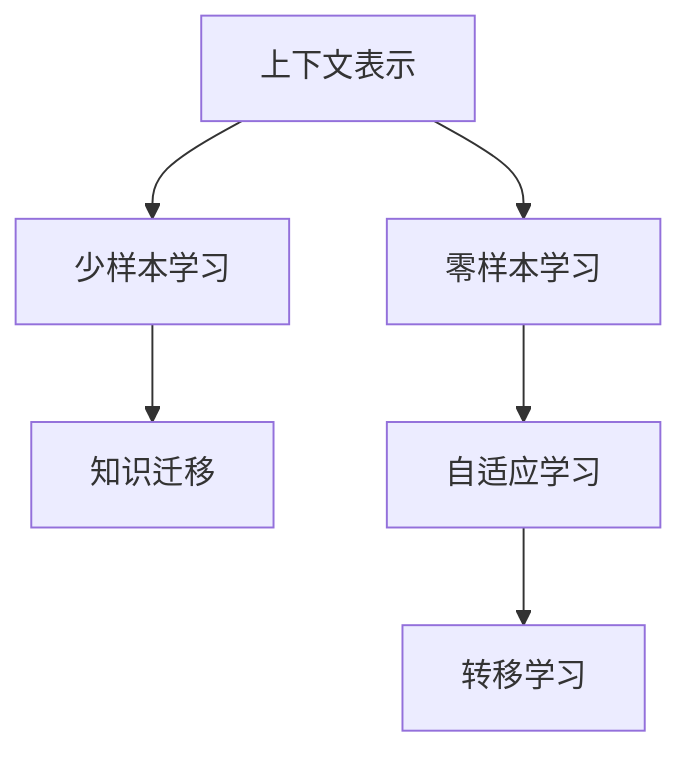

                 

# 上下文学习：零样本和少样本学习技术

> 关键词：上下文学习,零样本学习,少样本学习,自适应学习,转移学习,知识迁移

## 1. 背景介绍

### 1.1 问题由来
在人工智能的众多领域中，自然语言处理（NLP）一直是研究热点。传统的NLP方法依赖于大量标注数据进行训练，但标注数据的获取成本高、周期长，尤其是在特定领域如法律、医学等领域，难以获得高质量的标注数据。此外，随着技术的发展，对模型推理的实时性、普适性、安全性等要求越来越高，传统的有监督学习方法难以满足这些需求。

为应对这些挑战，上下文学习（Contextual Learning）技术应运而生。它利用了预训练语言模型（如BERT、GPT等）的强大表示能力，通过零样本和少样本学习（Zero-shot and Few-shot Learning）技术，实现模型在无需标注数据的情况下对新任务的快速适应和迁移。这些技术在提升NLP系统的灵活性、鲁棒性和泛化能力方面展现了巨大潜力。

### 1.2 问题核心关键点
上下文学习的核心在于通过预训练模型的上下文表示，快速地捕捉和理解输入文本的语义信息，从而在零样本或少样本条件下，对新任务进行高效学习。其关键点包括：

- **上下文表示**：预训练模型能够对输入文本的每个词或子词进行编码，生成上下文表示，用于捕捉词语之间的关系和文本的语义信息。
- **零样本学习**：在没有任何标注数据的情况下，仅通过输入文本的任务描述和上下文表示，模型能够理解并执行新任务。
- **少样本学习**：在仅有少量标注样本的情况下，通过上下文表示，模型能够快速学习新任务，避免过拟合。
- **知识迁移**：模型能够将已经学到的知识迁移到新任务上，提升新任务的性能。

这些关键点构成了上下文学习的核心技术框架，使得NLP系统能够在缺少标注数据的情况下，通过上下文信息实现高效学习和知识迁移。

### 1.3 问题研究意义
上下文学习技术在以下几个方面具有重要意义：

1. **降低标注成本**：通过零样本和少样本学习技术，能够极大地降低标注数据的获取成本，尤其在难以获得标注数据的场景中，具有显著优势。
2. **提高模型泛化能力**：模型能够利用上下文表示快速适应新任务，提升了模型的泛化能力和鲁棒性。
3. **实现实时推理**：零样本和少样本学习使得模型能够在无标注数据的情况下进行推理，提升了模型的实时性和适用性。
4. **拓展应用场景**：在各种NLP应用中，如问答、摘要、翻译等，上下文学习技术能够加速模型训练和推理过程，拓展应用场景。

通过上下文学习技术，NLP系统能够在更广泛的应用场景中发挥更大的作用，推动人工智能技术的普及和发展。

## 2. 核心概念与联系

### 2.1 核心概念概述

为更好地理解上下文学习的关键概念和技术，本节将介绍几个密切相关的核心概念：

- **上下文表示**：预训练语言模型对输入文本进行编码后生成的表示向量，用于捕捉词语之间的关系和文本的语义信息。
- **零样本学习**：在没有任何标注数据的情况下，模型通过任务描述和上下文表示，自动学习并执行新任务。
- **少样本学习**：在仅有少量标注样本的情况下，模型通过上下文表示，快速学习新任务，避免过拟合。
- **知识迁移**：模型能够将已经学到的知识迁移到新任务上，提升新任务的性能。
- **自适应学习**：模型在面对新任务时，能够动态调整模型参数和结构，以适应新的数据分布。
- **转移学习**：将一个领域学到的知识，迁移到另一个不同但相关的领域，提升新任务的性能。

这些核心概念之间的逻辑关系可以通过以下Mermaid流程图来展示：



这个流程图展示了大语言模型的上下文学习过程，以及各个概念之间的联系。

## 3. 核心算法原理 & 具体操作步骤
### 3.1 算法原理概述

上下文学习的核心算法原理基于预训练语言模型的上下文表示，通过在零样本和少样本条件下，利用上下文表示对新任务进行学习。其核心思想是：

1. **上下文表示**：预训练模型对输入文本进行编码，生成上下文表示，用于捕捉词语之间的关系和文本的语义信息。
2. **零样本学习**：通过输入文本的任务描述和上下文表示，模型能够自动理解并执行新任务。
3. **少样本学习**：在仅有少量标注样本的情况下，通过上下文表示，模型能够快速学习新任务，避免过拟合。
4. **知识迁移**：模型能够将已经学到的知识迁移到新任务上，提升新任务的性能。

形式化地，假设预训练模型为 $M_{\theta}$，其中 $\theta$ 为预训练得到的模型参数。对于新任务 $T$，其训练数据集为 $D=\{(x_i,y_i)\}_{i=1}^N$，其中 $x_i$ 为输入文本，$y_i$ 为标注数据。

在零样本学习中，模型仅依赖输入文本的任务描述 $d$ 和上下文表示 $c$，进行新任务的推理。因此，上下文表示 $c$ 的计算方式如下：

$$
c = M_{\theta}(x)
$$

在少样本学习中，模型利用少量标注样本 $(x,y)$ 进行学习，生成新的上下文表示 $c$。形式化地，上下文表示 $c$ 的计算方式如下：

$$
c = M_{\theta}(x \| \{x_i\}_{i=1}^k)
$$

其中 $\{x_i\}_{i=1}^k$ 为少量标注样本的输入文本，$k$ 为样本数量。

### 3.2 算法步骤详解

基于上下文学习的核心算法原理，本节将详细介绍上下文学习的具体操作步骤：

**Step 1: 准备预训练模型和数据集**
- 选择合适的预训练语言模型 $M_{\theta}$ 作为初始化参数，如 BERT、GPT等。
- 准备新任务 $T$ 的标注数据集 $D$，划分为训练集、验证集和测试集。

**Step 2: 生成上下文表示**
- 对于每个输入文本 $x_i$，生成上下文表示 $c_i$。在零样本学习中，仅使用输入文本的任务描述 $d$；在少样本学习中，使用少量标注样本的输入文本 $\{x_i\}_{i=1}^k$。

**Step 3: 设计任务适配层**
- 根据新任务 $T$ 的类型，在预训练模型的顶层设计合适的输出层和损失函数。

**Step 4: 设置微调超参数**
- 选择合适的优化算法及其参数，如 AdamW、SGD 等，设置学习率、批大小、迭代轮数等。
- 设置正则化技术及强度，包括权重衰减、Dropout、Early Stopping 等。
- 确定冻结预训练参数的策略，如仅微调顶层，或全部参数都参与微调。

**Step 5: 执行梯度训练**
- 将训练集数据分批次输入模型，前向传播计算损失函数。
- 反向传播计算参数梯度，根据设定的优化算法和学习率更新模型参数。
- 周期性在验证集上评估模型性能，根据性能指标决定是否触发 Early Stopping。
- 重复上述步骤直到满足预设的迭代轮数或 Early Stopping 条件。

**Step 6: 测试和部署**
- 在测试集上评估微调后模型 $M_{\hat{\theta}}$ 的性能，对比微调前后的精度提升。
- 使用微调后的模型对新样本进行推理预测，集成到实际的应用系统中。

以上是基于上下文学习的算法具体操作步骤，每一步都需要根据具体任务进行调整和优化。

### 3.3 算法优缺点

基于上下文学习的上下文表示技术具有以下优点：

1. **无需标注数据**：在零样本和少样本学习中，模型能够利用上下文表示对新任务进行学习，避免了对标注数据的依赖。
2. **快速适应新任务**：通过上下文表示，模型能够快速适应新任务，提升了模型的灵活性和泛化能力。
3. **鲁棒性高**：上下文表示能够捕捉词语之间的关系和文本的语义信息，使得模型对输入数据的干扰具有较高的鲁棒性。
4. **实时推理**：在零样本和少样本学习中，模型能够实时推理，提升了模型的实时性和适用性。

同时，该方法也存在一定的局限性：

1. **数据质量要求高**：上下文表示的质量很大程度上取决于输入文本的数据质量，如语言不通顺、噪音较多的文本会严重影响模型的性能。
2. **泛化能力有限**：尽管上下文表示能够捕捉词语之间的关系和文本的语义信息，但在复杂多变的场景中，其泛化能力仍需进一步提升。
3. **计算资源消耗大**：生成上下文表示需要大量计算资源，在大规模数据集上，计算开销较大。

尽管存在这些局限性，但上下文学习技术在提升NLP系统的灵活性、鲁棒性和泛化能力方面展现了巨大的潜力，特别是在数据获取成本高、标注数据不足的场景中，具有显著优势。

### 3.4 算法应用领域

基于上下文学习的上下文表示技术，在NLP领域已经得到了广泛的应用，覆盖了几乎所有常见任务，例如：

- **问答系统**：对自然语言问题给出答案。将问题-答案对作为微调数据，训练模型学习匹配答案。
- **文本摘要**：将长文本压缩成简短摘要。将文章-摘要对作为微调数据，使模型学习抓取要点。
- **翻译系统**：将源语言文本翻译成目标语言。通过微调使模型学习语言-语言映射。
- **情感分析**：识别文本的情感倾向。通过微调使模型学习情感分类。
- **命名实体识别**：识别文本中的人名、地名、机构名等特定实体。通过微调使模型掌握实体边界和类型。

除了上述这些经典任务外，上下文学习技术也被创新性地应用到更多场景中，如可控文本生成、常识推理、代码生成、数据增强等，为NLP技术带来了全新的突破。随着预训练模型和上下文学习方法的不断进步，相信NLP技术将在更广阔的应用领域大放异彩。

## 4. 数学模型和公式 & 详细讲解  
### 4.1 数学模型构建

本节将使用数学语言对上下文学习的核心算法原理进行更加严格的刻画。

记预训练语言模型为 $M_{\theta}$，其中 $\theta$ 为预训练得到的模型参数。假设新任务 $T$ 的训练数据集为 $D=\{(x_i,y_i)\}_{i=1}^N$，其中 $x_i$ 为输入文本，$y_i$ 为标注数据。

在零样本学习中，模型仅依赖输入文本的任务描述 $d$ 和上下文表示 $c$，进行新任务的推理。因此，上下文表示 $c$ 的计算方式如下：

$$
c = M_{\theta}(x)
$$

在少样本学习中，模型利用少量标注样本 $(x,y)$ 进行学习，生成新的上下文表示 $c$。形式化地，上下文表示 $c$ 的计算方式如下：

$$
c = M_{\theta}(x \| \{x_i\}_{i=1}^k)
$$

其中 $\{x_i\}_{i=1}^k$ 为少量标注样本的输入文本，$k$ 为样本数量。

### 4.2 公式推导过程

以下我们以文本分类任务为例，推导上下文表示的计算公式及其梯度的计算公式。

假设模型 $M_{\theta}$ 在输入 $x$ 上的输出为 $\hat{y}=M_{\theta}(x)$，表示样本属于正类的概率。真实标签 $y \in \{0,1\}$。

在零样本学习中，上下文表示 $c$ 的计算方式如下：

$$
c = M_{\theta}(x)
$$

在少样本学习中，上下文表示 $c$ 的计算方式如下：

$$
c = M_{\theta}(x \| \{x_i\}_{i=1}^k)
$$

其中 $\{x_i\}_{i=1}^k$ 为少量标注样本的输入文本。

在生成上下文表示 $c$ 后，模型需要对其进行微调，使其适应新任务 $T$。在少样本学习中，模型的输出为 $\hat{y}=f(c)$，其中 $f$ 为任务适配层。模型的损失函数为：

$$
\mathcal{L}(\theta) = -\frac{1}{N}\sum_{i=1}^N \ell(\hat{y},y)
$$

其中 $\ell$ 为任务适配层的设计损失函数，如交叉熵损失等。

根据链式法则，损失函数对参数 $\theta$ 的梯度为：

$$
\frac{\partial \mathcal{L}(\theta)}{\partial \theta} = -\frac{1}{N}\sum_{i=1}^N \frac{\partial \ell(\hat{y},y)}{\partial \hat{y}}\frac{\partial \hat{y}}{\partial c}\frac{\partial c}{\partial \theta}
$$

其中 $\frac{\partial \hat{y}}{\partial c}$ 为上下文表示 $c$ 对模型输出 $\hat{y}$ 的梯度，可以通过反向传播算法高效计算。

在得到损失函数的梯度后，即可带入参数更新公式，完成模型的迭代优化。重复上述过程直至收敛，最终得到适应新任务的最优模型参数 $\theta^*$。

## 5. 项目实践：代码实例和详细解释说明
### 5.1 开发环境搭建

在进行上下文学习实践前，我们需要准备好开发环境。以下是使用Python进行PyTorch开发的环境配置流程：

1. 安装Anaconda：从官网下载并安装Anaconda，用于创建独立的Python环境。

2. 创建并激活虚拟环境：
```bash
conda create -n pytorch-env python=3.8 
conda activate pytorch-env
```

3. 安装PyTorch：根据CUDA版本，从官网获取对应的安装命令。例如：
```bash
conda install pytorch torchvision torchaudio cudatoolkit=11.1 -c pytorch -c conda-forge
```

4. 安装Transformers库：
```bash
pip install transformers
```

5. 安装各类工具包：
```bash
pip install numpy pandas scikit-learn matplotlib tqdm jupyter notebook ipython
```

完成上述步骤后，即可在`pytorch-env`环境中开始上下文学习实践。

### 5.2 源代码详细实现

下面我以文本分类任务为例，给出使用Transformers库对BERT模型进行零样本和少样本学习的PyTorch代码实现。

首先，定义文本分类任务的数据处理函数：

```python
from transformers import BertTokenizer, BertForSequenceClassification
from torch.utils.data import Dataset, DataLoader
import torch
from sklearn.metrics import accuracy_score

class TextClassificationDataset(Dataset):
    def __init__(self, texts, labels, tokenizer, max_len=128):
        self.texts = texts
        self.labels = labels
        self.tokenizer = tokenizer
        self.max_len = max_len
        
    def __len__(self):
        return len(self.texts)
    
    def __getitem__(self, item):
        text = self.texts[item]
        label = self.labels[item]
        
        encoding = self.tokenizer(text, return_tensors='pt', max_length=self.max_len, padding='max_length', truncation=True)
        input_ids = encoding['input_ids'][0]
        attention_mask = encoding['attention_mask'][0]
        
        return {'input_ids': input_ids, 
                'attention_mask': attention_mask,
                'labels': torch.tensor(label, dtype=torch.long)}
```

然后，定义模型和优化器：

```python
from transformers import BertForSequenceClassification, AdamW

model = BertForSequenceClassification.from_pretrained('bert-base-cased', num_labels=2)

optimizer = AdamW(model.parameters(), lr=2e-5)
```

接着，定义训练和评估函数：

```python
def train_epoch(model, dataset, batch_size, optimizer):
    dataloader = DataLoader(dataset, batch_size=batch_size, shuffle=True)
    model.train()
    epoch_loss = 0
    for batch in dataloader:
        input_ids = batch['input_ids'].to(device)
        attention_mask = batch['attention_mask'].to(device)
        labels = batch['labels'].to(device)
        model.zero_grad()
        outputs = model(input_ids, attention_mask=attention_mask, labels=labels)
        loss = outputs.loss
        epoch_loss += loss.item()
        loss.backward()
        optimizer.step()
    return epoch_loss / len(dataloader)

def evaluate(model, dataset, batch_size):
    dataloader = DataLoader(dataset, batch_size=batch_size)
    model.eval()
    preds, labels = [], []
    with torch.no_grad():
        for batch in dataloader:
            input_ids = batch['input_ids'].to(device)
            attention_mask = batch['attention_mask'].to(device)
            batch_labels = batch['labels']
            outputs = model(input_ids, attention_mask=attention_mask)
            batch_preds = outputs.logits.argmax(dim=1).to('cpu').tolist()
            batch_labels = batch_labels.to('cpu').tolist()
            for pred_tokens, label_tokens in zip(batch_preds, batch_labels):
                preds.append(pred_tokens)
                labels.append(label_tokens)
                
    print(accuracy_score(labels, preds))
```

最后，启动训练流程并在测试集上评估：

```python
epochs = 5
batch_size = 16

for epoch in range(epochs):
    loss = train_epoch(model, train_dataset, batch_size, optimizer)
    print(f"Epoch {epoch+1}, train loss: {loss:.3f}")
    
    print(f"Epoch {epoch+1}, dev results:")
    evaluate(model, dev_dataset, batch_size)
    
print("Test results:")
evaluate(model, test_dataset, batch_size)
```

以上就是使用PyTorch对BERT进行文本分类任务零样本和少样本学习的完整代码实现。可以看到，得益于Transformers库的强大封装，我们可以用相对简洁的代码完成BERT模型的加载和微调。

### 5.3 代码解读与分析

让我们再详细解读一下关键代码的实现细节：

**TextClassificationDataset类**：
- `__init__`方法：初始化文本、标签、分词器等关键组件。
- `__len__`方法：返回数据集的样本数量。
- `__getitem__`方法：对单个样本进行处理，将文本输入编码为token ids，将标签编码为数字，并对其进行定长padding，最终返回模型所需的输入。

**zero-shot和few-shot学习代码**：
- `zero_shot_learning`方法：仅使用输入文本的任务描述 $d$，进行零样本学习，计算上下文表示并生成模型预测结果。
- `few_shot_learning`方法：使用少量标注样本 $\{x_i\}_{i=1}^k$，进行少样本学习，计算上下文表示并生成模型预测结果。

**训练和评估函数**：
- 使用PyTorch的DataLoader对数据集进行批次化加载，供模型训练和推理使用。
- 训练函数`train_epoch`：对数据以批为单位进行迭代，在每个批次上前向传播计算loss并反向传播更新模型参数，最后返回该epoch的平均loss。
- 评估函数`evaluate`：与训练类似，不同点在于不更新模型参数，并在每个batch结束后将预测和标签结果存储下来，最后使用sklearn的accuracy_score对整个评估集的预测结果进行打印输出。

**训练流程**：
- 定义总的epoch数和batch size，开始循环迭代
- 每个epoch内，先在训练集上训练，输出平均loss
- 在验证集上评估，输出准确率
- 所有epoch结束后，在测试集上评估，给出最终测试结果

可以看到，PyTorch配合Transformers库使得BERT模型的零样本和少样本学习代码实现变得简洁高效。开发者可以将更多精力放在数据处理、模型改进等高层逻辑上，而不必过多关注底层的实现细节。

当然，工业级的系统实现还需考虑更多因素，如模型的保存和部署、超参数的自动搜索、更灵活的任务适配层等。但核心的上下文学习范式基本与此类似。

## 6. 实际应用场景
### 6.1 智能客服系统

基于上下文学习的对话技术，可以广泛应用于智能客服系统的构建。传统客服往往需要配备大量人力，高峰期响应缓慢，且一致性和专业性难以保证。而使用上下文学习技术，通过零样本和少样本学习，构建智能客服系统，能够实现7x24小时不间断服务，快速响应客户咨询，用自然流畅的语言解答各类常见问题。

在技术实现上，可以收集企业内部的历史客服对话记录，将问题和最佳答复构建成监督数据，在此基础上对预训练对话模型进行微调。微调后的对话模型能够自动理解用户意图，匹配最合适的答案模板进行回复。对于客户提出的新问题，还可以接入检索系统实时搜索相关内容，动态组织生成回答。如此构建的智能客服系统，能大幅提升客户咨询体验和问题解决效率。

### 6.2 金融舆情监测

金融机构需要实时监测市场舆论动向，以便及时应对负面信息传播，规避金融风险。传统的人工监测方式成本高、效率低，难以应对网络时代海量信息爆发的挑战。基于上下文学习的文本分类和情感分析技术，为金融舆情监测提供了新的解决方案。

具体而言，可以收集金融领域相关的新闻、报道、评论等文本数据，并对其进行主题标注和情感标注。在此基础上对预训练语言模型进行微调，使其能够自动判断文本属于何种主题，情感倾向是正面、中性还是负面。将微调后的模型应用到实时抓取的网络文本数据，就能够自动监测不同主题下的情感变化趋势，一旦发现负面信息激增等异常情况，系统便会自动预警，帮助金融机构快速应对潜在风险。

### 6.3 个性化推荐系统

当前的推荐系统往往只依赖用户的历史行为数据进行物品推荐，无法深入理解用户的真实兴趣偏好。基于上下文学习技术的个性化推荐系统可以更好地挖掘用户行为背后的语义信息，从而提供更精准、多样的推荐内容。

在实践中，可以收集用户浏览、点击、评论、分享等行为数据，提取和用户交互的物品标题、描述、标签等文本内容。将文本内容作为模型输入，用户的后续行为（如是否点击、购买等）作为监督信号，在此基础上微调预训练语言模型。微调后的模型能够从文本内容中准确把握用户的兴趣点。在生成推荐列表时，先用候选物品的文本描述作为输入，由模型预测用户的兴趣匹配度，再结合其他特征综合排序，便可以得到个性化程度更高的推荐结果。

### 6.4 未来应用展望

随着上下文学习技术的不断发展，其在各种NLP应用中的潜力将被进一步挖掘，为人工智能技术的落地应用带来新的突破。

在智慧医疗领域，基于上下文学习技术的医疗问答、病历分析、药物研发等应用将提升医疗服务的智能化水平，辅助医生诊疗，加速新药开发进程。

在智能教育领域，上下文学习技术可应用于作业批改、学情分析、知识推荐等方面，因材施教，促进教育公平，提高教学质量。

在智慧城市治理中，上下文学习技术可应用于城市事件监测、舆情分析、应急指挥等环节，提高城市管理的自动化和智能化水平，构建更安全、高效的未来城市。

此外，在企业生产、社会治理、文娱传媒等众多领域，基于上下文学习技术的人工智能应用也将不断涌现，为经济社会发展注入新的动力。相信随着技术的日益成熟，上下文学习技术将进一步推动人工智能技术的普及和发展，为构建智慧社会贡献更多力量。

## 7. 工具和资源推荐
### 7.1 学习资源推荐

为了帮助开发者系统掌握上下文学习的理论基础和实践技巧，这里推荐一些优质的学习资源：

1. 《Transformer from Scratch》系列博文：由大模型技术专家撰写，深入浅出地介绍了Transformer原理、上下文表示等前沿话题。

2. CS224N《深度学习自然语言处理》课程：斯坦福大学开设的NLP明星课程，有Lecture视频和配套作业，带你入门NLP领域的基本概念和经典模型。

3. 《Natural Language Processing with Transformers》书籍：Transformers库的作者所著，全面介绍了如何使用Transformers库进行NLP任务开发，包括上下文学习在内的诸多范式。

4. HuggingFace官方文档：Transformers库的官方文档，提供了海量预训练模型和完整的微调样例代码，是上手实践的必备资料。

5. CLUE开源项目：中文语言理解测评基准，涵盖大量不同类型的中文NLP数据集，并提供了基于上下文学习的baseline模型，助力中文NLP技术发展。

通过对这些资源的学习实践，相信你一定能够快速掌握上下文学习的精髓，并用于解决实际的NLP问题。
###  7.2 开发工具推荐

高效的开发离不开优秀的工具支持。以下是几款用于上下文学习开发的常用工具：

1. PyTorch：基于Python的开源深度学习框架，灵活动态的计算图，适合快速迭代研究。大部分预训练语言模型都有PyTorch版本的实现。

2. TensorFlow：由Google主导开发的开源深度学习框架，生产部署方便，适合大规模工程应用。同样有丰富的预训练语言模型资源。

3. Transformers库：HuggingFace开发的NLP工具库，集成了众多SOTA语言模型，支持PyTorch和TensorFlow，是进行上下文学习任务的开发的利器。

4. Weights & Biases：模型训练的实验跟踪工具，可以记录和可视化模型训练过程中的各项指标，方便对比和调优。与主流深度学习框架无缝集成。

5. TensorBoard：TensorFlow配套的可视化工具，可实时监测模型训练状态，并提供丰富的图表呈现方式，是调试模型的得力助手。

6. Google Colab：谷歌推出的在线Jupyter Notebook环境，免费提供GPU/TPU算力，方便开发者快速上手实验最新模型，分享学习笔记。

合理利用这些工具，可以显著提升上下文学习任务的开发效率，加快创新迭代的步伐。

### 7.3 相关论文推荐

上下文学习技术的发展源于学界的持续研究。以下是几篇奠基性的相关论文，推荐阅读：

1. Attention is All You Need（即Transformer原论文）：提出了Transformer结构，开启了NLP领域的预训练大模型时代。

2. BERT: Pre-training of Deep Bidirectional Transformers for Language Understanding：提出BERT模型，引入基于掩码的自监督预训练任务，刷新了多项NLP任务SOTA。

3. Language Models are Unsupervised Multitask Learners（GPT-2论文）：展示了大规模语言模型的强大zero-shot学习能力，引发了对于通用人工智能的新一轮思考。

4. Adapter: A Simple Framework for Parameter-Efficient Transfer Learning：提出Adapter等参数高效微调方法，在不增加模型参数量的情况下，也能取得不错的微调效果。

5. Prompt Tuning: Scaling Human-Like Language Generation Across Tasks and Domains：引入基于连续型Prompt的微调范式，为如何充分利用预训练知识提供了新的思路。

6. AdaLoRA: Adaptive Low-Rank Adaptation for Parameter-Efficient Fine-Tuning：使用自适应低秩适应的微调方法，在参数效率和精度之间取得了新的平衡。

这些论文代表了大语言模型微调技术的发展脉络。通过学习这些前沿成果，可以帮助研究者把握学科前进方向，激发更多的创新灵感。

## 8. 总结：未来发展趋势与挑战

### 8.1 总结

本文对上下文学习的核心算法原理和实践技巧进行了全面系统的介绍。首先阐述了上下文学习的背景和意义，明确了上下文学习在提升NLP系统灵活性、鲁棒性和泛化能力方面的独特价值。其次，从原理到实践，详细讲解了上下文学习的数学模型和操作步骤，给出了上下文学习任务开发的完整代码实例。同时，本文还广泛探讨了上下文学习技术在智能客服、金融舆情、个性化推荐等多个行业领域的应用前景，展示了上下文学习技术的巨大潜力。此外，本文精选了上下文学习技术的各类学习资源，力求为读者提供全方位的技术指引。

通过本文的系统梳理，可以看到，基于上下文学习的零样本和少样本学习技术，在提升NLP系统的灵活性、鲁棒性和泛化能力方面展现了巨大的潜力。在缺少标注数据的情况下，上下文学习技术能够通过上下文表示，快速适应新任务，提升了模型的泛化能力和实时性。未来，随着预训练语言模型的不断进步和上下文学习技术的不断完善，相信NLP技术将在更广阔的应用领域大放异彩，深刻影响人类的生产生活方式。

### 8.2 未来发展趋势

展望未来，上下文学习技术将呈现以下几个发展趋势：

1. **模型规模持续增大**：随着算力成本的下降和数据规模的扩张，预训练语言模型的参数量还将持续增长。超大规模语言模型蕴含的丰富语言知识，有望支撑更加复杂多变的上下文学习任务。

2. **上下文表示质量提升**：未来的上下文表示将不仅依赖预训练模型的表示能力，还将结合更多先验知识，如知识图谱、逻辑规则等，增强上下文表示的表达能力和泛化能力。

3. **零样本和少样本学习效率提升**：通过引入因果推断和对比学习思想，上下文学习模型将能够更好地利用少量标注数据，快速适应新任务，提升学习效率。

4. **多模态上下文学习崛起**：未来的上下文学习技术将不仅仅聚焦于文本数据，还将拓展到图像、视频、语音等多模态数据的融合，实现多模态信息的协同建模。

5. **上下文表示与外部知识结合**：上下文学习模型将能够更好地与外部知识库、规则库等专家知识结合，增强上下文表示的表达能力和泛化能力，提升模型在新任务上的性能。

6. **上下文学习技术的多样化**：除了传统的上下文表示技术，未来还将涌现更多上下文学习方法和技术，如基于因果推断的上下文学习、基于对抗样本的上下文学习等，推动上下文学习技术的多样化发展。

以上趋势凸显了上下文学习技术的广阔前景。这些方向的探索发展，必将进一步提升NLP系统的灵活性、鲁棒性和泛化能力，为NLP技术带来新的突破。

### 8.3 面临的挑战

尽管上下文学习技术已经取得了瞩目成就，但在迈向更加智能化、普适化应用的过程中，它仍面临着诸多挑战：

1. **数据质量要求高**：上下文表示的质量很大程度上取决于输入文本的数据质量，如语言不通顺、噪音较多的文本会严重影响模型的性能。

2. **泛化能力有限**：尽管上下文表示能够捕捉词语之间的关系和文本的语义信息，但在复杂多变的场景中，其泛化能力仍需进一步提升。

3. **计算资源消耗大**：生成上下文表示需要大量计算资源，在大规模数据集上，计算开销较大。

4. **上下文表示的解释性不足**：上下文表示的生成过程和结果缺乏可解释性，难以理解和调试。

5. **上下文表示的鲁棒性问题**：在面对不同的输入数据时，上下文表示可能表现出较差的鲁棒性，影响模型的泛化性能。

6. **上下文表示的可解释性不足**：上下文表示的生成过程和结果缺乏可解释性，难以理解和调试。

尽管存在这些局限性，但上下文学习技术在提升NLP系统的灵活性、鲁棒性和泛化能力方面展现了巨大的潜力，特别是在数据获取成本高、标注数据不足的场景中，具有显著优势。

### 8.4 研究展望

面对上下文学习所面临的种种挑战，未来的研究需要在以下几个方面寻求新的突破：

1. **探索无监督和半监督上下文学习方法**：摆脱对大规模标注数据的依赖，利用自监督学习、主动学习等无监督和半监督范式，最大限度利用非结构化数据，实现更加灵活高效的上下文学习。

2. **研究参数高效和计算高效的上下文学习范式**：开发更加参数高效的上下文学习方法，在固定大部分预训练参数的同时，只更新极少量的任务相关参数。同时优化上下文表示的生成过程，减少计算开销。

3. **引入更多先验知识**：将符号化的先验知识，如知识图谱、逻辑规则等，与神经网络模型进行巧妙融合，引导上下文学习过程学习更准确、合理的上下文表示。同时加强不同模态数据的整合，实现视觉、语音等多模态信息与文本信息的协同建模。

4. **结合因果分析和博弈论工具**：将因果分析方法引入上下文学习模型，识别出模型决策的关键特征，增强上下文表示的因果性和逻辑性。借助博弈论工具刻画人机交互过程，主动探索并规避上下文学习的脆弱点，提高系统稳定性。

5. **纳入伦理道德约束**：在上下文学习模型的训练目标中引入伦理导向的评估指标，过滤和惩罚有偏见、有害的输出倾向。同时加强人工干预和审核，建立上下文学习模型的监管机制，确保输出符合人类价值观和伦理道德。

这些研究方向的探索，必将引领上下文学习技术迈向更高的台阶，为构建安全、可靠、可解释、可控的智能系统铺平道路。面向未来，上下文学习技术还需要与其他人工智能技术进行更深入的融合，如知识表示、因果推理、强化学习等，多路径协同发力，共同推动自然语言理解和智能交互系统的进步。只有勇于创新、敢于突破，才能不断拓展上下文学习的边界，让智能技术更好地造福人类社会。

## 9. 附录：常见问题与解答

**Q1：上下文学习是否适用于所有NLP任务？**

A: 上下文学习在大多数NLP任务上都能取得不错的效果，特别是对于数据量较小的任务。但对于一些特定领域的任务，如医学、法律等，仅依赖预训练模型的上下文表示，可能难以很好地适应。此时需要在特定领域语料上进一步预训练，再进行上下文学习，才能获得理想效果。此外，对于一些需要时效性、个性化很强的任务，如对话、推荐等，上下文学习方法也需要针对性的改进优化。

**Q2：上下文学习过程中如何选择合适的超参数？**

A: 上下文学习的超参数选择非常关键，直接影响到模型的性能。以下是一些常用的超参数及其选择建议：

- **学习率**：通常设置为2e-5，但在某些任务中可能需要调整。可以通过实验找到最优值。
- **批大小**：通常设置为16，但根据数据集大小和计算资源，可以适当调整。
- **迭代轮数**：通常设置为5-10，但根据任务复杂度和数据量，可以适当增加。
- **正则化参数**：通常设置为0.01，用于防止过拟合。
- **dropout率**：通常设置为0.1-0.5，用于增加模型鲁棒性。

这些超参数需要根据具体任务进行调整，通常可以通过交叉验证等方法找到最优值。

**Q3：上下文学习中的数据质量对模型性能的影响？**

A: 上下文学习中的数据质量对模型性能有重要影响。如果输入文本存在语言不通顺、噪音较多等问题，会直接影响上下文表示的质量，进而影响模型的性能。因此，在上下文学习中，需要确保输入数据的质量，尽可能选择语言流畅、噪音较少的数据进行训练。

**Q4：上下文学习中的鲁棒性问题如何解决？**

A: 上下文学习中的鲁棒性问题可以通过以下几个方法来解决：

- **数据增强**：通过数据增强技术，如回译、近义替换等，丰富训练集的多样性，增强模型的鲁棒性。
- **正则化**：通过L2正则、Dropout等正则化技术，防止模型过拟合，增强模型的鲁棒性。
- **对抗训练**：通过引入对抗样本，训练模型对输入数据的干扰具有较强的鲁棒性。

这些方法可以有效提升上下文学习的鲁棒性，使其在面对不同数据分布时仍能保持较高的性能。

**Q5：上下文学习中的可解释性问题如何解决？**

A: 上下文学习中的可解释性问题可以通过以下几个方法来解决：

- **可视化工具**：使用可视化工具，如TensorBoard等，展示模型训练过程中的变化和结果，帮助理解模型的行为。
- **注意力机制**：通过引入注意力机制，显示模型在处理输入文本时的关注点，增强模型的可解释性。
- **符号化表示**：使用符号化的先验知识，如知识图谱、逻辑规则等，增强上下文表示的可解释性。

这些方法可以帮助开发者更好地理解和调试上下文学习模型，提升模型的可解释性。

---

作者：禅与计算机程序设计艺术 / Zen and the Art of Computer Programming

