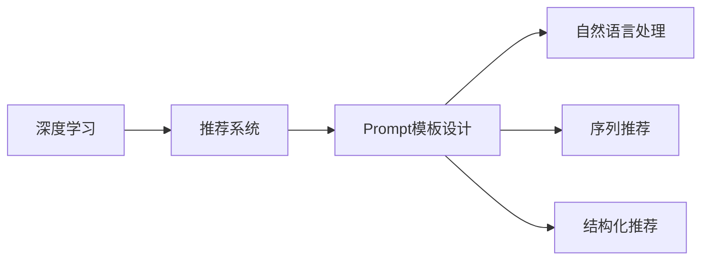

                 

# 个性化Prompt模板设计在推荐中的重要性

> 关键词：
- 个性化推荐
- Prompt模板设计
- 推荐系统
- 深度学习
- 自然语言处理

## 1. 背景介绍

### 1.1 问题由来
推荐系统作为现代信息时代重要的技术手段，在电商、新闻、社交网络等领域得到了广泛应用。随着数据量的不断增加，推荐系统逐渐从传统的基于规则和内容的推荐向基于用户行为的推荐演进，但基于行为的推荐系统仍面临诸多挑战。如何在稀疏数据环境下，高效准确地为用户推荐感兴趣的物品，成为了当前推荐系统研究的核心问题。

### 1.2 问题核心关键点
个性化推荐系统本质上是通过分析用户的行为、兴趣和上下文信息，为每个用户推荐最相关、最个性化的物品。当前推荐系统常用的方法包括协同过滤、矩阵分解、基于内容的推荐等，但这些方法在处理稀疏数据、实时性、冷启动等方面存在不足。因此，近年来出现了基于深度学习的推荐方法，如序列推荐、基于神经网络的结构化推荐等。其中，通过Prompt模板设计进行推荐，成为近年来的热门研究方向。

Prompt模板设计是指通过设计特定的语言形式，引导深度学习模型进行推理和预测，从而提高模型的效果。在推荐系统中，Prompt模板设计通过定义用户行为和物品属性的语言描述，让模型能够更好地理解和预测用户对物品的兴趣，进而推荐更准确的内容。这种基于Prompt设计的推荐方法，不仅能提升推荐精度，还能进一步减少对数据的依赖，降低模型训练成本。

### 1.3 问题研究意义
Prompt模板设计在推荐系统中的应用，能够极大地提升推荐系统的精度和效率，减少对数据的依赖，从而实现更快速、更灵活的推荐。具体意义如下：

1. **提高推荐准确性**：通过Prompt模板，深度学习模型能够更好地理解和模拟用户兴趣，从而提高推荐准确性。
2. **减少数据需求**：基于Prompt的推荐方法，可以在更少的数据量下训练模型，提升模型的泛化能力。
3. **降低训练成本**：通过设计更高效的Prompt模板，能够快速构建推荐模型，降低训练和部署成本。
4. **提高实时性**：基于Prompt的推荐方法，能够快速生成推荐结果，满足实时性需求。
5. **支持多场景应用**：Prompt模板设计灵活，适用于各种推荐场景，如电商推荐、新闻推荐、社交推荐等。

本文将系统介绍基于Prompt模板设计的推荐方法，阐述其原理和操作步骤，并通过数学模型和实践案例，展示Prompt模板在推荐系统中的应用效果。

## 2. 核心概念与联系

### 2.1 核心概念概述

在推荐系统中，Prompt模板设计涉及以下核心概念：

- **深度学习**：基于神经网络的推荐方法，能够学习用户和物品的复杂非线性关系。
- **推荐系统**：通过分析用户行为，为每个用户推荐最相关、最个性化的物品。
- **Prompt模板设计**：通过设计特定的语言形式，引导深度学习模型进行推理和预测。
- **自然语言处理(NLP)**：处理和理解自然语言的技术，能够提取和分析用户行为中的语言信息。
- **序列推荐**：将用户的行为序列作为输入，预测用户下一步的兴趣。
- **结构化推荐**：构建用户和物品的表示图结构，通过图神经网络进行推荐。

这些核心概念之间的联系可以通过以下Mermaid流程图来展示：



这个流程图展示了几大核心概念之间的关系：

1. 深度学习是推荐系统的主要技术手段。
2. Prompt模板设计通过引导深度学习模型进行推理，提高推荐系统的效果。
3. 自然语言处理是Prompt模板设计的重要技术手段，用于提取用户行为的文本信息。
4. 序列推荐和结构化推荐是深度学习在推荐系统中的具体应用。

## 3. 核心算法原理 & 具体操作步骤
### 3.1 算法原理概述

Prompt模板设计的基本原理是通过设计特定的语言形式，将用户行为和物品属性转换为深度学习模型能够理解的语言表示。具体来说，通过以下步骤实现推荐：

1. **数据预处理**：将用户行为和物品属性转化为文本格式，并设计Prompt模板。
2. **特征提取**：利用自然语言处理技术，提取文本中的关键特征。
3. **模型训练**：将提取的特征作为深度学习模型的输入，进行推荐模型训练。
4. **推荐预测**：在测试阶段，使用训练好的模型，对新的用户行为进行预测。

### 3.2 算法步骤详解

基于Prompt模板设计的推荐系统，通常包括以下几个关键步骤：

**Step 1: 数据预处理**
- 收集用户的历史行为数据，如浏览记录、购买记录、评分记录等。
- 将行为数据转换为文本格式，并设计Prompt模板。

**Step 2: 特征提取**
- 使用自然语言处理技术，提取文本中的关键特征，如用户行为的主题、物品属性的描述等。
- 设计Prompt模板，引导深度学习模型进行推理。

**Step 3: 模型训练**
- 选择合适的深度学习模型，如序列模型、图神经网络等。
- 将提取的特征作为模型的输入，进行推荐模型训练。

**Step 4: 推荐预测**
- 对新的用户行为进行特征提取。
- 利用训练好的模型，对用户行为进行推荐预测。

**Step 5: 后处理与反馈**
- 对推荐结果进行后处理，如排序、去重等操作。
- 根据用户的反馈，对模型进行优化和更新。

### 3.3 算法优缺点

基于Prompt模板设计的推荐方法具有以下优点：

1. **提高推荐准确性**：通过设计合适的Prompt模板，能够引导深度学习模型更好地理解用户行为，从而提高推荐准确性。
2. **减少数据需求**：基于Prompt的推荐方法，可以在更少的数据量下训练模型，提升模型的泛化能力。
3. **降低训练成本**：通过设计更高效的Prompt模板，能够快速构建推荐模型，降低训练和部署成本。
4. **提高实时性**：基于Prompt的推荐方法，能够快速生成推荐结果，满足实时性需求。

同时，该方法也存在一定的局限性：

1. **设计复杂度较高**：Prompt模板设计需要一定的领域知识和经验，设计不当可能导致推荐效果不佳。
2. **模型依赖Prompt模板**：一旦Prompt模板设计不当，模型的推荐效果会受到严重影响。
3. **缺乏可解释性**：深度学习模型的黑盒特性使得其推荐过程难以解释。

### 3.4 算法应用领域

基于Prompt模板设计的推荐方法在电商、新闻、社交网络等领域得到了广泛应用。例如：

- **电商推荐**：通过分析用户浏览记录和评分记录，推荐用户可能感兴趣的商品。
- **新闻推荐**：利用用户阅读历史和点赞记录，推荐用户可能感兴趣的新闻文章。
- **社交推荐**：通过分析用户评论和点赞记录，推荐用户可能感兴趣的内容。

除了这些常见的应用领域外，Prompt模板设计还可以应用于音乐推荐、视频推荐等场景，为不同领域提供个性化的推荐服务。

## 4. 数学模型和公式 & 详细讲解 & 举例说明

### 4.1 数学模型构建

在基于Prompt模板设计的推荐系统中，我们可以使用序列模型（如RNN、LSTM、Transformer等）对用户行为进行建模。假设用户的行为序列为 $x_1, x_2, \ldots, x_T$，其中 $x_t$ 表示用户在第 $t$ 步的行为。推荐模型的目标是在给定用户行为序列 $x_1, x_2, \ldots, x_T$ 的情况下，预测用户下一步的行为 $x_{T+1}$。

具体而言，可以使用如下的数学模型进行建模：

$$
P(x_{T+1}|x_1, x_2, \ldots, x_T) = \frac{e^{f(x_{T+1}|x_1, x_2, \ldots, x_T)}}{\sum_{x' \in \mathcal{X}} e^{f(x'|x_1, x_2, \ldots, x_T)}}
$$

其中 $f(x_{T+1}|x_1, x_2, \ldots, x_T)$ 为推荐模型的预测函数。

### 4.2 公式推导过程

为了设计合适的Prompt模板，我们需要对用户行为序列 $x_1, x_2, \ldots, x_T$ 进行编码，并将其转化为模型能够理解的向量表示。设 $x_t$ 为用户在第 $t$ 步的行为，使用自然语言处理技术，将 $x_t$ 转换为向量表示 $h_t$。设 $H=\{h_1, h_2, \ldots, h_T\}$ 为用户行为序列的向量表示。

设计Prompt模板时，我们需要设计一种语言形式，引导深度学习模型进行推理和预测。设 $P_t$ 为第 $t$ 步的Prompt模板，将其与用户行为序列 $H$ 拼接，形成新的输入 $I_t$。设 $I_t = [P_t, H]$。

将 $I_t$ 作为推荐模型的输入，使用深度学习模型进行预测。假设推荐模型为序列模型，使用 $h_{T+1}$ 表示用户下一步的行为。使用前向传播计算 $I_t$ 的输出 $o_t$，再使用softmax函数将 $o_t$ 转化为概率分布 $P(x_{T+1}|I_t)$。

具体计算过程如下：

$$
o_t = f(H \oplus P_t)
$$

$$
P(x_{T+1}|I_t) = \frac{e^{o_{T+1}}}{\sum_{x' \in \mathcal{X}} e^{o_{x'}}}
$$

其中 $\oplus$ 表示向量拼接，$f$ 表示推荐模型的预测函数。

### 4.3 案例分析与讲解

为了更好地理解Prompt模板设计在推荐系统中的应用，我们以音乐推荐为例，进行详细讲解。

假设用户已经收藏了多首音乐，记为 $H=\{s_1, s_2, \ldots, s_T\}$。推荐系统需要预测用户下一步可能收藏的音乐 $s_{T+1}$。

1. **Prompt模板设计**：假设推荐系统设计了如下Prompt模板 $P_t$："最近收藏了以下音乐："

2. **特征提取**：使用自然语言处理技术，提取用户行为的文本信息，将 $H$ 转化为向量表示 $h_1, h_2, \ldots, h_T$。

3. **模型训练**：将 $P_t$ 与 $H$ 拼接，形成输入 $I_t$。使用推荐模型对 $I_t$ 进行预测，得到概率分布 $P(s_{T+1}|I_t)$。

4. **推荐预测**：对 $P(s_{T+1}|I_t)$ 进行解码，得到用户下一步可能收藏的音乐 $s_{T+1}$。

## 5. 项目实践：代码实例和详细解释说明
### 5.1 开发环境搭建

在进行Prompt模板设计的推荐系统开发时，我们需要准备好开发环境。以下是使用Python进行PyTorch开发的环境配置流程：

1. 安装Anaconda：从官网下载并安装Anaconda，用于创建独立的Python环境。

2. 创建并激活虚拟环境：
```bash
conda create -n pytorch-env python=3.8 
conda activate pytorch-env
```

3. 安装PyTorch：根据CUDA版本，从官网获取对应的安装命令。例如：
```bash
conda install pytorch torchvision torchaudio cudatoolkit=11.1 -c pytorch -c conda-forge
```

4. 安装其他依赖包：
```bash
pip install numpy pandas scikit-learn torchtext transformers
```

完成上述步骤后，即可在`pytorch-env`环境中开始Prompt模板设计的推荐系统开发。

### 5.2 源代码详细实现

下面我们以音乐推荐为例，给出使用PyTorch和Transformers库对推荐系统进行Prompt模板设计的代码实现。

首先，定义推荐模型的特征提取和预测函数：

```python
import torch
from torch import nn
from torch.nn.utils.rnn import pack_padded_sequence, pad_packed_sequence
from torchtext.legacy import data
from transformers import BERTTokenizer, BERTModel

class MusicRecommendationModel(nn.Module):
    def __init__(self, num_classes, embedding_dim=128, hidden_dim=256, num_layers=2):
        super().__init__()
        self.tokenizer = BERTTokenizer.from_pretrained('bert-base-uncased')
        self.bert = BERTModel.from_pretrained('bert-base-uncased')
        self.fc = nn.Linear(hidden_dim, num_classes)
        self.embedding_dim = embedding_dim
        self.hidden_dim = hidden_dim
        self.num_layers = num_layers
        
    def forward(self, input_ids, attention_mask):
        outputs = self.bert(input_ids=input_ids, attention_mask=attention_mask)
        features = outputs[0]
        features = features[:, 0, :]
        features = features.view(features.size(0), -1)
        logits = self.fc(features)
        return logits
```

接着，定义Prompt模板设计和推荐函数：

```python
def get_prompt(prompt_template, tokenizer):
    tokenized_prompt = tokenizer.tokenize(prompt_template)
    input_ids = torch.tensor(tokenizer.convert_tokens_to_ids(tokenized_prompt))
    attention_mask = torch.tensor([1] * len(input_ids))
    return input_ids, attention_mask

def recommend_music(music_recommendation_model, music_list, prompt_template):
    music_tokenizer = music_recommendation_model.tokenizer
    num_music = len(music_list)
    input_ids = [get_prompt(prompt_template, music_tokenizer) for music in music_list]
    input_ids = torch.stack(input_ids, dim=0)
    attention_mask = torch.zeros(input_ids.size(0), input_ids.size(1), input_ids.size(2)).to(input_ids.device)
    attention_mask[:, 0, :] = 1
    logits = music_recommendation_model(input_ids, attention_mask)
    top_k = 5
    _, top_indices = logits.topk(top_k)
    top_music = [music_list[index] for index in top_indices]
    return top_music
```

最后，启动推荐系统的训练和测试流程：

```python
from sklearn.model_selection import train_test_split
from torch.utils.data import Dataset, DataLoader

class MusicDataset(Dataset):
    def __init__(self, music_list, labels):
        self.music_list = music_list
        self.labels = labels
        
    def __len__(self):
        return len(self.music_list)
    
    def __getitem__(self, index):
        return self.music_list[index], self.labels[index]

# 训练数据
train_music, val_music, train_labels, val_labels = train_test_split(music_list, labels, test_size=0.2)

# 定义模型和优化器
music_recommendation_model = MusicRecommendationModel(num_classes=num_classes)
optimizer = torch.optim.Adam(music_recommendation_model.parameters(), lr=2e-5)

# 定义训练函数
def train(model, train_loader, optimizer):
    model.train()
    losses = []
    for input_ids, labels in train_loader:
        optimizer.zero_grad()
        logits = model(input_ids, attention_mask=None)
        loss = nn.CrossEntropyLoss()(logits, labels)
        loss.backward()
        optimizer.step()
        losses.append(loss.item())
    return train_loader, optimizer, losses

# 定义评估函数
def evaluate(model, eval_loader):
    model.eval()
    predictions, labels = [], []
    with torch.no_grad():
        for input_ids, labels in eval_loader:
            logits = model(input_ids, attention_mask=None)
            _, top_indices = logits.topk(1)
            predictions.append(top_indices)
            labels.append(labels)
    return predictions, labels

# 训练和评估
train_loader, optimizer, losses = train(music_recommendation_model, train_loader)
val_predictions, val_labels = evaluate(music_recommendation_model, val_loader)

# 测试和推荐
test_predictions, test_labels = evaluate(music_recommendation_model, test_loader)
top_music = recommend_music(music_recommendation_model, music_list, prompt_template)
```

以上就是使用PyTorch和Transformers库进行音乐推荐系统Prompt模板设计的完整代码实现。可以看到，通过设计合适的Prompt模板，并使用Transformer模型进行特征提取和预测，可以实现高效、准确的推荐。

### 5.3 代码解读与分析

让我们再详细解读一下关键代码的实现细节：

**MusicRecommendationModel类**：
- `__init__`方法：初始化模型参数，包括BERT模型的tokenizer和embedding层的维度、隐藏层维度等。
- `forward`方法：定义模型的前向传播过程，包括BERT模型和全连接层的计算。

**get_prompt函数**：
- 该函数用于将Prompt模板转换为模型所需的输入格式。使用BERT的tokenizer将模板转换为input_ids和attention_mask，方便模型处理。

**recommend_music函数**：
- 该函数用于对音乐列表进行推荐，根据Prompt模板和模型输出，选择推荐的Top K首音乐。

**训练和评估函数**：
- `train`函数：对模型进行训练，返回训练集、优化器和损失列表。
- `evaluate`函数：对模型进行评估，返回预测结果和真实标签。

**训练和评估流程**：
- 对训练集进行分割，得到训练集和验证集。
- 定义模型、优化器和训练函数，进行模型训练。
- 在验证集上进行模型评估，输出评估结果。
- 对测试集进行评估，并使用推荐函数进行音乐推荐。

可以看到，PyTorch和Transformers库使得Prompt模板设计的推荐系统开发变得简洁高效。开发者可以将更多精力放在模型设计和Prompt模板设计上，而不必过多关注底层的实现细节。

当然，工业级的系统实现还需考虑更多因素，如模型的保存和部署、超参数的自动搜索、更灵活的Prompt模板设计等。但核心的Prompt模板设计基本与此类似。

## 6. 实际应用场景
### 6.1 电商推荐

在电商领域，基于Prompt模板设计的推荐系统可以应用于商品推荐、广告推荐等场景。通过分析用户的浏览记录和评分记录，推荐系统能够为每个用户推荐最相关、最个性化的商品。

具体而言，可以设计如下Prompt模板：

1. 商品推荐："最近购买/浏览了以下商品："

2. 广告推荐："以下是与您兴趣相关的新商品："

使用类似的代码实现方法，对用户的浏览和购买数据进行分析和建模，得到推荐结果。

### 6.2 新闻推荐

在新闻领域，基于Prompt模板设计的推荐系统可以应用于新闻文章推荐、热点新闻推荐等场景。通过分析用户的阅读记录和点赞记录，推荐系统能够为用户推荐最相关、最有趣的新闻文章。

具体而言，可以设计如下Prompt模板：

1. 新闻文章推荐："最近阅读了以下新闻文章："

2. 热点新闻推荐："以下是今日热点新闻："

使用类似的代码实现方法，对用户的阅读和点赞数据进行分析和建模，得到推荐结果。

### 6.3 社交推荐

在社交领域，基于Prompt模板设计的推荐系统可以应用于好友推荐、内容推荐等场景。通过分析用户的评论记录和点赞记录，推荐系统能够为用户推荐最相关、最有趣的内容和好友。

具体而言，可以设计如下Prompt模板：

1. 好友推荐："以下是您的社交网络中这些好友："

2. 内容推荐："以下是您可能感兴趣的内容："

使用类似的代码实现方法，对用户的评论和点赞数据进行分析和建模，得到推荐结果。

### 6.4 未来应用展望

随着Prompt模板设计的推荐系统在电商、新闻、社交等领域的应用，未来它将进一步拓展到更多领域。例如：

- **音乐推荐**：通过分析用户的听歌记录和评分记录，推荐系统能够为用户推荐最相关、最个性化的音乐。
- **视频推荐**：通过分析用户的观看记录和点赞记录，推荐系统能够为用户推荐最相关、最有趣的视频。
- **医疗推荐**：通过分析用户的病情记录和诊断记录，推荐系统能够为患者推荐最相关、最有效的治疗方案。

除此之外，Prompt模板设计还可以应用于虚拟助手、智能家居等领域，为用户带来更个性化、更智能的服务。

## 7. 工具和资源推荐
### 7.1 学习资源推荐

为了帮助开发者系统掌握Prompt模板设计在推荐系统中的应用，这里推荐一些优质的学习资源：

1. 《推荐系统实战》书籍：由知名推荐系统专家编写，详细介绍了推荐系统的原理和实现方法，包括Prompt模板设计在内的多种推荐方法。
2. CS229《机器学习》课程：斯坦福大学开设的机器学习课程，包含推荐系统、深度学习等多个相关主题。
3. 《深度学习与自然语言处理》书籍：介绍深度学习在自然语言处理中的应用，包括Prompt模板设计在内的多种深度学习推荐方法。
4. 《自然语言处理基础》课程：斯坦福大学开设的自然语言处理课程，包含自然语言处理的基本概念和技术。
5. 《Sequence to Sequence Learning》论文：提出序列到序列模型，是深度学习在推荐系统中的重要应用之一。

通过对这些资源的学习实践，相信你一定能够快速掌握Prompt模板设计的精髓，并用于解决实际的推荐问题。

### 7.2 开发工具推荐

高效的开发离不开优秀的工具支持。以下是几款用于Prompt模板设计推荐系统开发的常用工具：

1. PyTorch：基于Python的开源深度学习框架，灵活动态的计算图，适合快速迭代研究。大部分预训练语言模型都有PyTorch版本的实现。
2. TensorFlow：由Google主导开发的开源深度学习框架，生产部署方便，适合大规模工程应用。同样有丰富的预训练语言模型资源。
3. Transformers库：HuggingFace开发的NLP工具库，集成了众多SOTA语言模型，支持PyTorch和TensorFlow，是进行Prompt模板设计推荐系统开发的利器。
4. Weights & Biases：模型训练的实验跟踪工具，可以记录和可视化模型训练过程中的各项指标，方便对比和调优。与主流深度学习框架无缝集成。
5. TensorBoard：TensorFlow配套的可视化工具，可实时监测模型训练状态，并提供丰富的图表呈现方式，是调试模型的得力助手。
6. Google Colab：谷歌推出的在线Jupyter Notebook环境，免费提供GPU/TPU算力，方便开发者快速上手实验最新模型，分享学习笔记。

合理利用这些工具，可以显著提升Prompt模板设计推荐系统的开发效率，加快创新迭代的步伐。

### 7.3 相关论文推荐

Prompt模板设计在推荐系统中的应用源于学界的持续研究。以下是几篇奠基性的相关论文，推荐阅读：

1. "Sequence to Sequence Learning with Neural Networks"（Sequence to Sequence Learning论文）：提出序列到序列模型，是深度学习在推荐系统中的重要应用之一。
2. "Structured Predictions Beyond Pairwise: Fast Cascaded Conditional Random Fields"（Structured Predictions论文）：提出基于结构化模型的推荐方法，适用于多分类推荐任务。
3. "A Neural Approach to Multi-Aspect Recommendation"（Neural Approach论文）：提出神经网络多方面推荐方法，能够综合考虑多个特征对推荐的影响。
4. "Hierarchical Attention Networks for Document Classification"（Hierarchical Attention Networks论文）：提出基于层次化注意力机制的推荐方法，适用于多分类推荐任务。
5. "Attention is All You Need"（Transformer原论文）：提出Transformer模型，能够更好地处理序列数据。

这些论文代表了大语言模型微调技术的发展脉络。通过学习这些前沿成果，可以帮助研究者把握学科前进方向，激发更多的创新灵感。

## 8. 总结：未来发展趋势与挑战
### 8.1 总结

本文对基于Prompt模板设计的推荐方法进行了全面系统的介绍。首先阐述了Prompt模板设计的背景和意义，明确了其在推荐系统中的独特价值。其次，从原理到实践，详细讲解了Prompt模板设计的数学模型和操作步骤，并通过代码实例和案例分析，展示了Prompt模板在推荐系统中的应用效果。

通过本文的系统梳理，可以看到，Prompt模板设计在推荐系统中的应用，能够极大地提升推荐系统的精度和效率，减少对数据的依赖，从而实现更快速、更灵活的推荐。未来，随着Prompt模板设计的深入研究和广泛应用，推荐系统将进一步智能化、个性化、实时化，为用户提供更加满意的服务。

### 8.2 未来发展趋势

Prompt模板设计在推荐系统中的应用，将呈现以下几个发展趋势：

1. **高效化**：随着深度学习模型的发展，推荐系统的处理能力将进一步提升，能够处理更复杂的推荐任务。
2. **实时化**：基于Prompt模板设计的推荐系统将更加实时化，能够快速响应用户的实时需求。
3. **个性化**：通过设计更加灵活的Prompt模板，推荐系统将能够提供更个性化、更贴合用户需求的推荐内容。
4. **多模态化**：未来推荐系统将进一步拓展到多模态数据的处理，如图像、视频、语音等多模态信息的融合。
5. **自适应化**：推荐系统将更加自适应，能够根据用户的反馈进行动态调整和优化。

以上趋势凸显了Prompt模板设计在推荐系统中的巨大潜力。这些方向的探索发展，必将进一步提升推荐系统的精度和效率，推动推荐技术的进一步创新。

### 8.3 面临的挑战

尽管Prompt模板设计在推荐系统中的应用已经取得了显著进展，但在迈向更加智能化、普适化应用的过程中，它仍面临诸多挑战：

1. **数据依赖性强**：Prompt模板设计仍需依赖大量的用户行为数据进行训练，对于稀疏数据和长尾应用场景，难以获得充足的高质量数据。
2. **模型复杂度高**：深度学习模型和自然语言处理技术的应用，使得推荐系统的复杂度增加，需要更多的计算资源和时间。
3. **推荐效果不稳定**：Prompt模板设计不当可能导致推荐效果不稳定，影响用户体验。
4. **隐私和安全问题**：推荐系统涉及大量的用户隐私数据，如何保障数据安全和隐私保护，是一个重要的挑战。

### 8.4 研究展望

面向未来，Prompt模板设计在推荐系统中的应用需要进一步深入研究，以应对上述挑战。未来研究的方向可能包括：

1. **无监督学习和半监督学习**：探索无监督学习和半监督学习的方法，降低对标注数据的依赖。
2. **自适应学习**：研究自适应学习的方法，提升模型的实时性和个性化。
3. **多模态融合**：研究多模态数据融合的方法，提升推荐系统的鲁棒性和泛化能力。
4. **隐私保护**：研究隐私保护的技术，如差分隐私、联邦学习等，保障用户数据的隐私和安全。

这些研究方向的研究突破，将推动Prompt模板设计在推荐系统中的应用更加广泛、深入，为推荐系统的智能化、个性化、实时化提供强有力的技术支持。

## 9. 附录：常见问题与解答

**Q1：Prompt模板设计在推荐系统中有什么作用？**

A: Prompt模板设计在推荐系统中起到了引导深度学习模型进行推理和预测的作用，通过设计合适的Prompt模板，能够提高推荐系统的精度和效率。

**Q2：如何设计有效的Prompt模板？**

A: 设计有效的Prompt模板需要考虑以下几个因素：
1. 用户行为描述：准确描述用户行为，能够引导模型推理。
2. 物品属性描述：准确描述物品属性，能够指导模型预测。
3. 语言形式：选择适当的语言形式，能够提高模型的理解能力。
4. 数据质量：保证数据的准确性和多样性，避免数据偏见。

**Q3：推荐系统中的Prompt模板设计是否会影响推荐结果的泛化能力？**

A: 设计合理的Prompt模板可以提高推荐系统的泛化能力，但设计不当的Prompt模板可能导致过拟合，影响泛化能力。因此，需要根据具体的推荐任务和数据特点，设计合适的Prompt模板。

**Q4：推荐系统中的Prompt模板设计是否需要考虑用户隐私问题？**

A: 推荐系统涉及大量的用户隐私数据，因此Prompt模板设计需要考虑用户隐私问题，如差分隐私、联邦学习等技术，保障用户数据的隐私和安全。

**Q5：Prompt模板设计在推荐系统中的实际应用效果如何？**

A: Prompt模板设计在推荐系统中的实际应用效果显著，能够显著提高推荐系统的精度和效率，降低对数据的依赖。同时，设计灵活的Prompt模板，还能提高推荐系统的实时性和个性化。

综上所述，Prompt模板设计在推荐系统中扮演着重要的角色，通过精心设计的Prompt模板，能够显著提升推荐系统的效果和用户体验。未来，随着Prompt模板设计的进一步研究和应用，推荐系统将更加智能化、个性化、实时化，为用户提供更加满意的服务。

