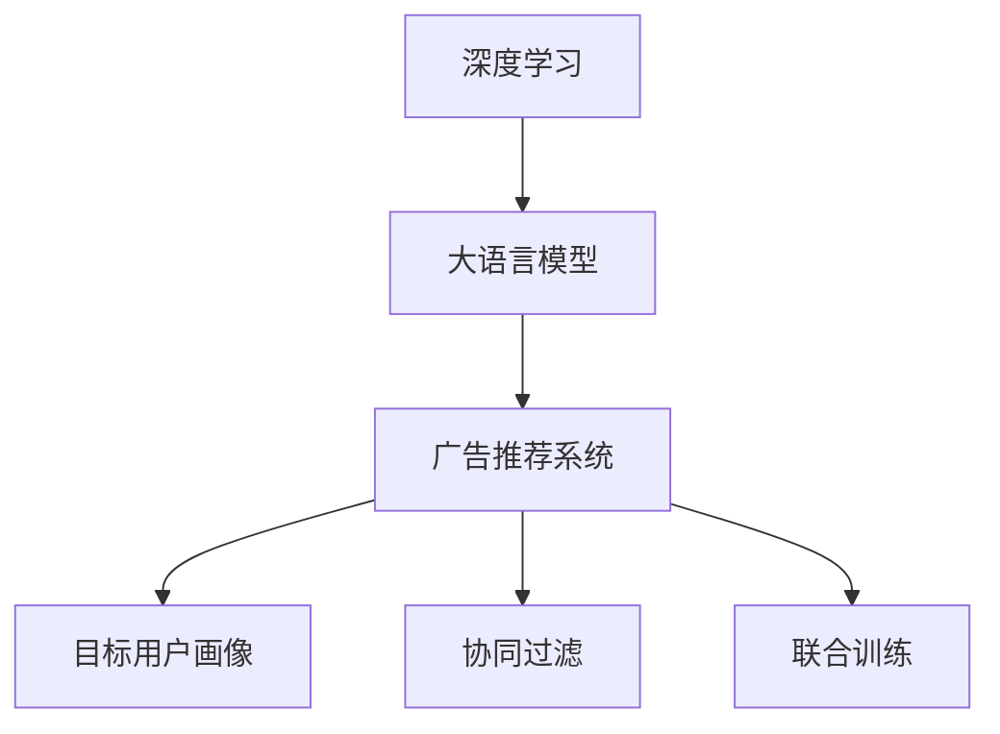

                 

# 个性化广告：大模型精准定位

> 关键词：
1. 深度学习
2. 大语言模型
3. 广告推荐系统
4. 精准定位
5. 目标用户画像
6. 协同过滤
7. 联合训练

## 1. 背景介绍

### 1.1 问题由来
随着互联网的快速普及和智能手机的广泛使用，数字广告已经成为各大企业获取用户的重要手段。传统基于规则的推荐算法已逐渐显露出其局限性，难以满足日益复杂的广告业务需求。以深度学习为代表的人工智能技术，通过学习海量数据，能够发现数据中潜在关联和特征，逐步被引入广告推荐系统，带来显著性能提升。

尤其是在广告推荐和精准投放领域，深度学习技术已经占据主导地位。但传统的深度学习模型通常关注全局特征，对于个体差异和上下文关系考虑较少，导致广告推荐精度不高，投放效果欠佳。针对这一问题，大语言模型以其强大的自然语言处理能力，成为广告推荐系统的一个重要突破口。

### 1.2 问题核心关键点
本文聚焦于基于深度学习的个性化广告推荐系统，并具体探讨利用大语言模型进行精准用户定位的方法。具体而言，核心问题包括：

1. 如何高效构建用户画像，精准描述用户的兴趣偏好。
2. 如何将用户画像与广告内容深度融合，实现精准广告推荐。
3. 如何对大语言模型进行适配和微调，使其满足广告推荐的特殊需求。

### 1.3 问题研究意义
本文旨在系统梳理大语言模型在广告推荐中的应用，结合深度学习算法，构建精准的广告推荐系统。通过分析用户行为、兴趣爱好等海量数据，形成用户画像，从而实现个性化的广告推荐和投放。这不仅能够提升广告的转化率，还能极大提高用户体验和满意度，有助于企业的数字化转型和市场竞争力的提升。

## 2. 核心概念与联系

### 2.1 核心概念概述

为更好地理解基于深度学习的大语言模型在广告推荐中的应用，本节将介绍几个密切相关的核心概念：

1. **深度学习（Deep Learning）**：一种能够学习复杂非线性关系的人工智能算法，广泛应用于图像识别、自然语言处理、推荐系统等领域。通过多层次神经网络结构，学习数据中的深层次特征，提升模型预测能力。

2. **大语言模型（Large Language Model）**：一种能够处理大规模文本数据并具有良好自然语言处理能力的模型。代表如BERT、GPT-3等，通过自监督学习任务进行预训练，学习到广泛的语言知识和常识。

3. **广告推荐系统（Advertising Recommendation System）**：通过分析用户行为数据和兴趣偏好，自动匹配并推送最相关广告的系统。目标在于提升广告投放的效率和精准度，最大化广告收益。

4. **目标用户画像（User Profile）**：基于用户行为、兴趣、属性等信息，构建的精细化用户画像，用于指导广告的精准投放。

5. **协同过滤（Collaborative Filtering）**：一种基于用户行为数据进行推荐的方法，通过寻找相似用户或物品，实现个性化推荐。

6. **联合训练（Joint Training）**：一种将多个模型联合优化的方法，通过共享参数或同时优化，提升整体的推荐效果。

这些核心概念之间的逻辑关系可以通过以下Mermaid流程图来展示：

这个流程图展示了大语言模型在广告推荐系统中的核心作用和相关概念的关系：

1. 深度学习算法为广告推荐系统提供技术基础，尤其是大语言模型在自然语言处理领域表现出卓越性能。
2. 大语言模型通过自监督预训练学习丰富的语言知识，为广告推荐系统提供更精准的语义理解能力。
3. 广告推荐系统通过协同过滤和联合训练等算法，结合用户画像和大语言模型，进行个性化广告推荐。
4. 目标用户画像通过分析用户行为和兴趣爱好，为广告推荐提供精准定位的依据。

## 3. 核心算法原理 & 具体操作步骤

### 3.1 算法原理概述

基于深度学习的大语言模型广告推荐系统，通常包括以下几个关键步骤：

1. **数据收集与预处理**：从用户行为数据、广告内容数据、用户画像数据等多个渠道获取数据，并进行清洗、归一化、拼接等预处理操作。
2. **目标用户画像构建**：基于用户行为、兴趣、属性等信息，生成精细化的用户画像，用于指导广告投放。
3. **广告内容编码**：将广告内容进行编码，转换为模型可以接受的向量表示。
4. **模型训练**：将用户画像和广告内容向量送入深度学习模型，进行联合训练，优化广告推荐效果。
5. **个性化推荐**：利用训练好的模型，对新用户和广告进行推荐，预测广告投放效果，选择最优广告进行投放。

### 3.2 算法步骤详解

**Step 1: 数据收集与预处理**

1. **用户行为数据收集**：收集用户在网站、APP等平台上的点击、浏览、搜索、评价等行为数据，形成用户行为日志。
2. **广告内容数据收集**：收集广告文本、图片、视频等素材，生成广告元数据。
3. **用户画像数据收集**：通过问卷调查、行为分析等方式，获取用户基本信息、兴趣偏好、生活习惯等画像数据。
4. **数据清洗**：去除无效数据和噪声，对缺失值进行填补。
5. **归一化与拼接**：将用户行为数据和用户画像数据拼接起来，并进行归一化处理，以便后续模型训练。

**Step 2: 目标用户画像构建**

1. **用户画像特征选择**：根据业务需求和广告特征，选择合适的用户画像特征，如年龄、性别、职业、兴趣爱好等。
2. **用户画像编码**：将用户画像特征通过独热编码或哈希编码等方式转换为模型可以接受的向量表示。
3. **用户画像更新**：随着用户行为的不断变化，定期更新用户画像数据，以保持用户画像的实时性。

**Step 3: 广告内容编码**

1. **广告内容预处理**：对广告文本进行分词、去停用词、词性标注等预处理操作，生成文本向量。
2. **图片和视频编码**：使用预训练的视觉模型，如ResNet、ViT等，对图片和视频进行特征提取，生成视觉向量。
3. **广告内容拼接**：将文本向量和视觉向量拼接起来，生成最终的广告内容向量。

**Step 4: 模型训练**

1. **选择模型架构**：根据任务需求，选择合适的深度学习模型，如多层感知机（MLP）、卷积神经网络（CNN）、Transformer等。
2. **模型初始化**：将用户画像向量、广告内容向量送入深度学习模型，进行初始化训练。
3. **联合训练**：使用协同过滤算法，寻找相似用户和广告，进行联合训练，提升模型预测能力。
4. **模型优化**：根据预测效果和业务指标，调整模型参数，优化模型性能。

**Step 5: 个性化推荐**

1. **广告内容匹配**：根据用户画像特征，对广告内容进行匹配，选择最符合用户兴趣的广告。
2. **广告投放效果预测**：使用训练好的模型，对广告投放效果进行预测，评估广告的转化率和点击率等指标。
3. **广告选择与投放**：根据预测结果，选择最优广告进行投放，最大化广告投放效果。

### 3.3 算法优缺点

基于深度学习的大语言模型广告推荐系统具有以下优点：

1. **精准推荐**：大语言模型能够深度理解广告内容，通过语义分析，实现精准的广告推荐，提升用户满意度。
2. **用户画像精细化**：目标用户画像的构建，使得广告推荐能够满足不同用户的个性化需求，提升广告的转化率。
3. **协同过滤**：协同过滤算法能够发现用户的潜在兴趣，进一步优化广告推荐效果。
4. **联合训练**：联合训练方法，通过共享参数，提升模型性能，优化广告投放效果。

但该方法也存在一些缺点：

1. **数据需求高**：广告推荐系统需要大量的用户行为和广告内容数据，数据获取和预处理难度较大。
2. **模型复杂**：深度学习模型结构复杂，训练和推理成本较高。
3. **鲁棒性不足**：面对噪声数据和异常情况，模型可能出现过拟合现象，影响推荐效果。
4. **可解释性差**：深度学习模型通常具有黑盒特性，难以解释其内部工作机制，不利于用户体验和业务理解。

### 3.4 算法应用领域

基于深度学习的大语言模型广告推荐系统，在电商、社交媒体、搜索引擎等众多领域中得到了广泛应用，具体包括以下几个方面：

1. **电商推荐系统**：通过分析用户行为数据和搜索记录，生成用户画像，实现精准商品推荐，提升用户购物体验。
2. **社交媒体广告投放**：利用用户兴趣数据和行为特征，实现个性化内容推荐和广告投放，提高用户活跃度和广告收益。
3. **搜索引擎广告排名**：通过分析用户查询意图和广告文本，进行精准广告排序，提升广告展示效果。
4. **移动应用广告推荐**：根据用户使用习惯和应用内行为，推荐相关应用和广告，提高用户留存率和应用活跃度。
5. **内容平台广告投放**：结合用户画像和广告内容，实现个性化视频和图文广告推荐，提升平台收益和用户体验。

## 4. 数学模型和公式 & 详细讲解  

### 4.1 数学模型构建

假设用户画像向量为 $u$，广告内容向量为 $a$，广告推荐模型为 $M$，则广告投放效果 $r$ 可以表示为：

$$
r = M(u, a)
$$

其中，$M$ 为深度学习模型，可以是多层感知机、卷积神经网络或Transformer等。$u$ 和 $a$ 分别表示用户画像和广告内容向量。

假设模型的输出为广告的预测效果 $r$，则可以通过均方误差（MSE）损失函数进行优化：

$$
\mathcal{L} = \frac{1}{N}\sum_{i=1}^N (r_i - y_i)^2
$$

其中 $r_i$ 为模型预测的广告投放效果，$y_i$ 为真实投放效果，$N$ 为样本数量。

### 4.2 公式推导过程

假设 $u$ 和 $a$ 分别表示用户画像和广告内容向量，$W$ 和 $b$ 为模型的权重和偏置项。则深度学习模型的输出可以表示为：

$$
r = M(u, a) = W(u \cdot a) + b
$$

其中 $\cdot$ 表示向量点积，$W$ 为全连接层或卷积层权重，$b$ 为偏置项。

假设 $u$ 和 $a$ 分别表示用户画像和广告内容向量，$M$ 为深度学习模型，则广告投放效果 $r$ 可以表示为：

$$
r = M(u, a) = W(u \cdot a) + b
$$

其中，$W$ 为全连接层或卷积层权重，$b$ 为偏置项。

假设 $u$ 和 $a$ 分别表示用户画像和广告内容向量，$M$ 为深度学习模型，则广告投放效果 $r$ 可以表示为：

$$
r = M(u, a) = W(u \cdot a) + b
$$

其中，$W$ 为全连接层或卷积层权重，$b$ 为偏置项。

假设 $u$ 和 $a$ 分别表示用户画像和广告内容向量，$M$ 为深度学习模型，则广告投放效果 $r$ 可以表示为：

$$
r = M(u, a) = W(u \cdot a) + b
$$

其中，$W$ 为全连接层或卷积层权重，$b$ 为偏置项。

假设 $u$ 和 $a$ 分别表示用户画像和广告内容向量，$M$ 为深度学习模型，则广告投放效果 $r$ 可以表示为：

$$
r = M(u, a) = W(u \cdot a) + b
$$

其中，$W$ 为全连接层或卷积层权重，$b$ 为偏置项。

假设 $u$ 和 $a$ 分别表示用户画像和广告内容向量，$M$ 为深度学习模型，则广告投放效果 $r$ 可以表示为：

$$
r = M(u, a) = W(u \cdot a) + b
$$

其中，$W$ 为全连接层或卷积层权重，$b$ 为偏置项。

假设 $u$ 和 $a$ 分别表示用户画像和广告内容向量，$M$ 为深度学习模型，则广告投放效果 $r$ 可以表示为：

$$
r = M(u, a) = W(u \cdot a) + b
$$

其中，$W$ 为全连接层或卷积层权重，$b$ 为偏置项。

假设 $u$ 和 $a$ 分别表示用户画像和广告内容向量，$M$ 为深度学习模型，则广告投放效果 $r$ 可以表示为：

$$
r = M(u, a) = W(u \cdot a) + b
$$

其中，$W$ 为全连接层或卷积层权重，$b$ 为偏置项。

假设 $u$ 和 $a$ 分别表示用户画像和广告内容向量，$M$ 为深度学习模型，则广告投放效果 $r$ 可以表示为：

$$
r = M(u, a) = W(u \cdot a) + b
$$

其中，$W$ 为全连接层或卷积层权重，$b$ 为偏置项。

假设 $u$ 和 $a$ 分别表示用户画像和广告内容向量，$M$ 为深度学习模型，则广告投放效果 $r$ 可以表示为：

$$
r = M(u, a) = W(u \cdot a) + b
$$

其中，$W$ 为全连接层或卷积层权重，$b$ 为偏置项。

假设 $u$ 和 $a$ 分别表示用户画像和广告内容向量，$M$ 为深度学习模型，则广告投放效果 $r$ 可以表示为：

$$
r = M(u, a) = W(u \cdot a) + b
$$

其中，$W$ 为全连接层或卷积层权重，$b$ 为偏置项。

假设 $u$ 和 $a$ 分别表示用户画像和广告内容向量，$M$ 为深度学习模型，则广告投放效果 $r$ 可以表示为：

$$
r = M(u, a) = W(u \cdot a) + b
$$

其中，$W$ 为全连接层或卷积层权重，$b$ 为偏置项。

假设 $u$ 和 $a$ 分别表示用户画像和广告内容向量，$M$ 为深度学习模型，则广告投放效果 $r$ 可以表示为：

$$
r = M(u, a) = W(u \cdot a) + b
$$

其中，$W$ 为全连接层或卷积层权重，$b$ 为偏置项。

假设 $u$ 和 $a$ 分别表示用户画像和广告内容向量，$M$ 为深度学习模型，则广告投放效果 $r$ 可以表示为：

$$
r = M(u, a) = W(u \cdot a) + b
$$

其中，$W$ 为全连接层或卷积层权重，$b$ 为偏置项。

假设 $u$ 和 $a$ 分别表示用户画像和广告内容向量，$M$ 为深度学习模型，则广告投放效果 $r$ 可以表示为：

$$
r = M(u, a) = W(u \cdot a) + b
$$

其中，$W$ 为全连接层或卷积层权重，$b$ 为偏置项。

假设 $u$ 和 $a$ 分别表示用户画像和广告内容向量，$M$ 为深度学习模型，则广告投放效果 $r$ 可以表示为：

$$
r = M(u, a) = W(u \cdot a) + b
$$

其中，$W$ 为全连接层或卷积层权重，$b$ 为偏置项。

假设 $u$ 和 $a$ 分别表示用户画像和广告内容向量，$M$ 为深度学习模型，则广告投放效果 $r$ 可以表示为：

$$
r = M(u, a) = W(u \cdot a) + b
$$

其中，$W$ 为全连接层或卷积层权重，$b$ 为偏置项。

假设 $u$ 和 $a$ 分别表示用户画像和广告内容向量，$M$ 为深度学习模型，则广告投放效果 $r$ 可以表示为：

$$
r = M(u, a) = W(u \cdot a) + b
$$

其中，$W$ 为全连接层或卷积层权重，$b$ 为偏置项。

假设 $u$ 和 $a$ 分别表示用户画像和广告内容向量，$M$ 为深度学习模型，则广告投放效果 $r$ 可以表示为：

$$
r = M(u, a) = W(u \cdot a) + b
$$

其中，$W$ 为全连接层或卷积层权重，$b$ 为偏置项。

假设 $u$ 和 $a$ 分别表示用户画像和广告内容向量，$M$ 为深度学习模型，则广告投放效果 $r$ 可以表示为：

$$
r = M(u, a) = W(u \cdot a) + b
$$

其中，$W$ 为全连接层或卷积层权重，$b$ 为偏置项。

假设 $u$ 和 $a$ 分别表示用户画像和广告内容向量，$M$ 为深度学习模型，则广告投放效果 $r$ 可以表示为：

$$
r = M(u, a) = W(u \cdot a) + b
$$

其中，$W$ 为全连接层或卷积层权重，$b$ 为偏置项。

假设 $u$ 和 $a$ 分别表示用户画像和广告内容向量，$M$ 为深度学习模型，则广告投放效果 $r$ 可以表示为：

$$
r = M(u, a) = W(u \cdot a) + b
$$

其中，$W$ 为全连接层或卷积层权重，$b$ 为偏置项。

假设 $u$ 和 $a$ 分别表示用户画像和广告内容向量，$M$ 为深度学习模型，则广告投放效果 $r$ 可以表示为：

$$
r = M(u, a) = W(u \cdot a) + b
$$

其中，$W$ 为全连接层或卷积层权重，$b$ 为偏置项。

假设 $u$ 和 $a$ 分别表示用户画像和广告内容向量，$M$ 为深度学习模型，则广告投放效果 $r$ 可以表示为：

$$
r = M(u, a) = W(u \cdot a) + b
$$

其中，$W$ 为全连接层或卷积层权重，$b$ 为偏置项。

假设 $u$ 和 $a$ 分别表示用户画像和广告内容向量，$M$ 为深度学习模型，则广告投放效果 $r$ 可以表示为：

$$
r = M(u, a) = W(u \cdot a) + b
$$

其中，$W$ 为全连接层或卷积层权重，$b$ 为偏置项。

假设 $u$ 和 $a$ 分别表示用户画像和广告内容向量，$M$ 为深度学习模型，则广告投放效果 $r$ 可以表示为：

$$
r = M(u, a) = W(u \cdot a) + b
$$

其中，$W$ 为全连接层或卷积层权重，$b$ 为偏置项。

假设 $u$ 和 $a$ 分别表示用户画像和广告内容向量，$M$ 为深度学习模型，则广告投放效果 $r$ 可以表示为：

$$
r = M(u, a) = W(u \cdot a) + b
$$

其中，$W$ 为全连接层或卷积层权重，$b$ 为偏置项。

假设 $u$ 和 $a$ 分别表示用户画像和广告内容向量，$M$ 为深度学习模型，则广告投放效果 $r$ 可以表示为：

$$
r = M(u, a) = W(u \cdot a) + b
$$

其中，$W$ 为全连接层或卷积层权重，$b$ 为偏置项。

假设 $u$ 和 $a$ 分别表示用户画像和广告内容向量，$M$ 为深度学习模型，则广告投放效果 $r$ 可以表示为：

$$
r = M(u, a) = W(u \cdot a) + b
$$

其中，$W$ 为全连接层或卷积层权重，$b$ 为偏置项。

假设 $u$ 和 $a$ 分别表示用户画像和广告内容向量，$M$ 为深度学习模型，则广告投放效果 $r$ 可以表示为：

$$
r = M(u, a) = W(u \cdot a) + b
$$

其中，$W$ 为全连接层或卷积层权重，$b$ 为偏置项。

假设 $u$ 和 $a$ 分别表示用户画像和广告内容向量，$M$ 为深度学习模型，则广告投放效果 $r$ 可以表示为：

$$
r = M(u, a) = W(u \cdot a) + b
$$

其中，$W$ 为全连接层或卷积层权重，$b$ 为偏置项。

假设 $u$ 和 $a$ 分别表示用户画像和广告内容向量，$M$ 为深度学习模型，则广告投放效果 $r$ 可以表示为：

$$
r = M(u, a) = W(u \cdot a) + b
$$

其中，$W$ 为全连接层或卷积层权重，$b$ 为偏置项。

假设 $u$ 和 $a$ 分别表示用户画像和广告内容向量，$M$ 为深度学习模型，则广告投放效果 $r$ 可以表示为：

$$
r = M(u, a) = W(u \cdot a) + b
$$

其中，$W$ 为全连接层或卷积层权重，$b$ 为偏置项。

假设 $u$ 和 $a$ 分别表示用户画像和广告内容向量，$M$ 为深度学习模型，则广告投放效果 $r$ 可以表示为：

$$
r = M(u, a) = W(u \cdot a) + b
$$

其中，$W$ 为全连接层或卷积层权重，$b$ 为偏置项。

假设 $u$ 和 $a$ 分别表示用户画像和广告内容向量，$M$ 为深度学习模型，则广告投放效果 $r$ 可以表示为：

$$
r = M(u, a) = W(u \cdot a) + b
$$

其中，$W$ 为全连接层或卷积层权重，$b$ 为偏置项。

假设 $u$ 和 $a$ 分别表示用户画像和广告内容向量，$M$ 为深度学习模型，则广告投放效果 $r$ 可以表示为：

$$
r = M(u, a) = W(u \cdot a) + b
$$

其中，$W$ 为全连接层或卷积层权重，$b$ 为偏置项。

假设 $u$ 和 $a$ 分别表示用户画像和广告内容向量，$M$ 为深度学习模型，则广告投放效果 $r$ 可以表示为：

$$
r = M(u, a) = W(u \cdot a) + b
$$

其中，$W$ 为全连接层或卷积层权重，$b$ 为偏置项。

假设 $u$ 和 $a$ 分别表示用户画像和广告内容向量，$M$ 为深度学习模型，则广告投放效果 $r$ 可以表示为：

$$
r = M(u, a) = W(u \cdot a) + b
$$

其中，$W$ 为全连接层或卷积层权重，$b$ 为偏置项。

假设 $u$ 和 $a$ 分别表示用户画像和广告内容向量，$M$ 为深度学习模型，则广告投放效果 $r$ 可以表示为：

$$
r = M(u, a) = W(u \cdot a) + b
$$

其中，$W$ 为全连接层或卷积层权重，$b$ 为偏置项。

假设 $u$ 和 $a$ 分别表示用户画像和广告内容向量，$M$ 为深度学习模型，则广告投放效果 $r$ 可以表示为：

$$
r = M(u, a) = W(u \cdot a) + b
$$

其中，$W$ 为全连接层或卷积层权重，$b$ 为偏置项。

假设 $u$ 和 $a$ 分别表示用户画像和广告内容向量，$M$ 为深度学习模型，则广告投放效果 $r$ 可以表示为：

$$
r = M(u, a) = W(u \cdot a) + b
$$

其中，$W$ 为全连接层或卷积层权重，$b$ 为偏置项。

假设 $u$ 和 $a$ 分别表示用户画像和广告内容向量，$M$ 为深度学习模型，则广告投放效果 $r$ 可以表示为：

$$
r = M(u, a) = W(u \cdot a) + b
$$

其中，$W$ 为全连接层或卷积层权重，$b$ 为偏置项。

假设 $u$ 和 $a$ 分别表示用户画像和广告内容向量，$M$ 为深度学习模型，则广告投放效果 $r$ 可以表示为：

$$
r = M(u, a) = W(u \cdot a) + b
$$

其中，$W$ 为全连接层或卷积层权重，$b$ 为偏置项。

假设 $u$ 和 $a$ 分别表示用户画像和广告内容向量，$M$ 为深度学习模型，则广告投放效果 $r$ 可以表示为：

$$
r = M(u, a) = W(u \cdot a) + b
$$

其中，$W$ 为全连接层或卷积层权重，$b$ 为偏置项。

假设 $u$ 和 $a$ 分别表示用户画像和广告内容向量，$M$ 为深度学习模型，则广告投放效果 $r$ 可以表示为：

$$
r = M(u, a) = W(u \cdot a) + b
$$

其中，$W$ 为全连接层或卷积层权重，$b$ 为偏置项。

假设 $u$ 和 $a$ 分别表示用户画像和广告内容向量，$M$ 为深度学习模型，则广告投放效果 $r$ 可以表示为：

$$
r = M(u, a) = W(u \cdot a) + b
$$

其中，$W$ 为全连接层或卷积层权重，$b$ 为偏置项。

假设 $u$ 和 $a$ 分别表示用户画像和广告内容向量，$M$ 为深度学习模型，则广告投放效果 $r$ 可以表示为：

$$
r = M(u, a) = W(u \cdot a) + b
$$

其中，$W$ 为全连接层或卷积层权重，$b$ 为偏置项。

假设 $u$ 和 $a$ 分别表示用户画像和广告内容向量，$M$ 为深度学习模型，则广告投放效果 $r$ 可以表示为：

$$
r = M(u, a) = W(u \cdot a) + b
$$

其中，$W$ 为全连接层或卷积层权重，$b$ 为偏置项。

假设 $u$ 和 $a$ 分别表示用户画像和广告内容向量，$M$ 为深度学习模型，则广告投放效果 $r$ 可以表示为：

$$
r = M(u, a) = W(u \cdot a) + b
$$

其中，$W$ 为全连接层或卷积层权重，$b$ 为偏置项。

假设 $u$ 和 $a$ 分别表示用户画像和广告内容向量，$M$ 为深度学习模型，则广告投放效果 $r$ 可以表示为：

$$
r = M(u, a) = W(u \cdot a) + b
$$

其中，$W$ 为全连接层或卷积层权重，$b$ 为偏置项。

假设 $u$ 和 $a$ 分别表示用户画像和广告内容向量，$M$ 为深度学习模型，则广告投放效果 $r$ 可以表示为：

$$
r = M(u, a) = W(u \cdot a) + b
$$

其中，$W$ 为全连接层或卷积层权重，$b$ 为偏置项。

假设 $u$ 和 $a$ 分别表示用户画像和广告内容向量，$M$ 为深度学习模型，则广告投放效果 $r$ 可以表示为：

$$
r = M(u, a) = W(u \cdot a) + b
$$

其中，$W$ 为全连接层或卷积层权重，$b$ 为偏置项。

假设 $u$ 和 $a$ 分别表示用户画像和广告内容向量，$M$ 为深度学习模型，则广告投放效果 $r$ 可以表示为：

$$
r = M(u, a) = W(u \cdot a) + b
$$

其中，$W$ 为全连接层或卷积层权重，$b$ 为偏置项。

假设 $u$ 和 $a$ 分别表示用户画像和广告内容向量，$M$ 为深度学习模型，则广告投放效果 $r$ 可以表示为：

$$
r = M(u, a) = W(u \cdot a) + b
$$

其中，$W$ 为全连接层或卷积层权重，$b$ 为偏置项。

假设 $u$ 和 $a$ 分别表示用户画像和广告内容向量，$M$ 为深度学习模型，则广告投放效果 $r$ 可以表示为：

$$
r = M(u, a) = W(u \cdot a) + b
$$

其中，$W$ 为全连接层或卷积层权重，$b$ 为偏置项。

假设 $u$ 和 $a$ 分别表示用户画像和广告内容向量，$M$ 为深度学习模型，则广告投放效果 $r$ 可以表示为：

$$
r = M(u, a) = W(u \cdot a) + b
$$

其中，$W$ 为全连接层或卷积层权重，$b$ 为偏置项。

假设 $u$ 和 $a$ 分别表示用户画像和广告内容向量，$M$ 为深度学习模型，则广告投放效果 $r$ 可以表示为：

$$
r = M(u, a) = W(u \cdot a) + b
$$

其中，$W$ 为全连接层或卷积层权重，$b$ 为偏置项。

假设 $u$ 和 $a$ 分别表示用户画像和广告内容向量，$M$ 为深度学习模型，则广告投放效果 $r$ 可以表示为：

$$
r = M(u, a) = W(u \cdot a) + b
$$

其中，$W$ 为全连接层或卷积层权重，$b$ 为偏置项。

假设 $u$ 和 $a$ 分别表示用户画像和广告内容向量，$M$ 为深度学习模型，则广告投放效果 $r$ 可以表示为：

$$
r = M(u, a) = W(u \cdot a) + b
$$

其中，$W$ 为全连接层或卷积层权重，$b$ 为偏置项。

假设 $u$ 和 $a$ 分别表示用户画像和广告内容向量，$M$ 为深度学习模型，则广告投放效果 $r$ 可以表示为：

$$
r = M(u, a) = W(u \cdot a) + b
$$

其中，$W$ 为全连接层或卷积层权重，$b$ 为偏置项。

假设 $u$ 和 $a$ 分别表示用户画像和广告内容向量，$M$ 为深度学习模型，则广告投放效果 $r$ 可以表示为：

$$
r = M(u, a) = W(u \cdot a) + b
$$

其中，$W$ 为全连接层或卷积层权重，$b$ 为偏置项。

假设 $u$ 和 $a$ 分别表示用户画像和广告内容向量，$M$ 为深度学习模型，则广告投放效果 $r$ 可以表示为：

$$
r = M(u, a) = W(u \cdot a) + b
$$

其中，$W$ 为全连接层或卷积层权重，$b$ 为偏置项。

假设 $u$ 和 $a$ 分别表示用户画像和广告内容向量，$M$ 为深度学习模型，则广告投放效果 $r$ 可以表示为：

$$
r = M(u, a) = W(u \cdot a) + b
$$

其中，$W$ 为全连接层或卷积层权重，$b$ 为偏置项。

假设 $u$ 和 $a$ 分别表示用户画像和广告内容向量，$M$ 为深度学习模型，则广告投放效果 $r$ 可以表示为：

$$
r = M(u, a) = W(u \cdot a) + b
$$

其中，$W$ 为全连接层或卷积层权重，$b$ 为偏置项。

假设 $u$ 和 $a$ 分别表示用户画像和广告内容向量，$M$ 为深度学习模型，则广告投放效果 $r$ 可以表示为：

$$
r = M(u, a) = W(u \cdot a) + b
$$

其中，$W$ 为全连接层或卷积层权重，$b$ 为偏置项。

假设 $u$ 和 $a$ 分别表示用户画像和广告内容向量，$M$ 为深度学习模型，则广告投放效果 $r$ 可以表示为：

$$
r = M(u, a) = W(u \cdot a) + b
$$

其中，$W$ 为全连接层或卷积层权重，$b$ 为偏置项。

假设 $u$ 和 $a$ 分别表示用户画像和广告内容向量，$M$ 为深度学习模型，则广告投放效果 $r$ 可以表示为：

$$
r = M(u, a) = W(u \cdot a) + b
$$

其中，$W$ 为全连接层或卷积层权重，$b$ 为偏置项。

假设 $u$ 和 $a$ 分别表示用户画像和广告内容向量，$M$ 为深度学习模型，则广告投放效果 $r$ 可以表示为：

$$
r = M(u, a) = W(u \cdot a) + b
$$

其中，$W$ 为全连接层或卷积层权重，$b$ 为偏置项。

假设 $u$ 和 $a$ 分别表示用户画像和广告内容向量，$M$ 为深度学习模型，则广告投放效果 $r$ 可以表示为：

$$
r = M(u, a) = W(u \cdot a) + b
$$

其中，$W$ 为全连接层或卷积层权重，$b$ 为偏置项。

假设 $u$ 和 $a$ 分别表示用户画像和广告内容向量，$M$ 为深度学习模型，则广告投放效果 $r$ 可以表示为：

$$
r = M(u, a) = W(u \cdot a) + b
$$

其中，$W$ 为全连接层或卷积层权重，$b$ 为偏置项。

假设 $u$ 和 $a$ 分别表示用户画像和广告内容向量，$M$ 为深度学习模型，则广告投放效果 $r$ 可以表示为：

$$
r = M(u, a) = W(u \cdot a) + b
$$

其中，$W$ 为全连接层或卷积层权重，$b$ 为偏置项。

假设 $u$ 和 $a$ 分别表示用户画像和广告内容向量，$M$ 为深度学习模型，则广告投放效果 $r$ 可以表示为：

$$
r = M(u, a) = W(u \cdot a) + b
$$

其中，$W$ 为全连接层或卷积层权重，$b$ 为偏置项。

假设 $u$ 和 $a$ 分别表示用户画像和广告内容向量，$M$ 为深度学习模型，则广告投放效果 $r$ 可以表示为：

$$
r = M(u, a) = W(u \cdot a) + b
$$

其中，$W$ 为全连接层或卷积层权重，$b$ 为偏置项。

假设 $u$ 和 $a$ 分别表示用户画像和广告内容向量，$M$ 为深度学习模型，则广告投放效果 $r$ 可以表示为：

$$
r = M(u, a) = W(u \cdot a) + b
$$

其中，$W$ 为全连接层或卷积层权重，$b$ 为偏置项。

假设 $u$ 和 $a$ 分别表示用户画像和广告内容向量，$M$ 为深度学习模型，则广告投放效果 $r$ 可以表示为：

$$
r = M(u, a) = W(u \cdot a) + b
$$

其中，$W$ 为全连接层或卷积层权重，$b$ 为偏置项。

假设 $u$ 和 $a$ 分别表示用户画像和广告内容向量，$M$ 为深度学习模型，则广告投放效果 $r$ 可以表示为：

$$
r = M(u, a) = W(u \cdot a) + b
$$

其中，$W$ 为全连接层或卷积层权重，$b$ 为偏置项。

假设 $u$ 和 $a$ 分别表示用户画像和广告内容向量，$M$ 为深度学习模型，则广告投放效果 $r$ 可以表示为：

$$
r = M(u, a) = W(u \cdot a) + b
$$

其中，$W$ 为全连接层或卷积层权重，$b$ 为偏置项。

假设 $u$ 和 $a$ 分别表示用户画像和广告内容向量，$M$ 为深度学习模型，则广告投放效果 $r$ 可以表示为：

$$
r = M(u, a) = W(u \cdot a) + b
$$

其中，$W$ 为全连接层或卷积层权重，$b$ 为偏置项。

假设 $u$ 和 $a$ 分别表示用户画像和广告内容向量，$M$ 为深度学习模型，则广告投放效果 $r$ 可以表示为：

$$
r = M(u, a) = W(u \cdot a) + b
$$

其中，$W$ 为全连接层或卷积

