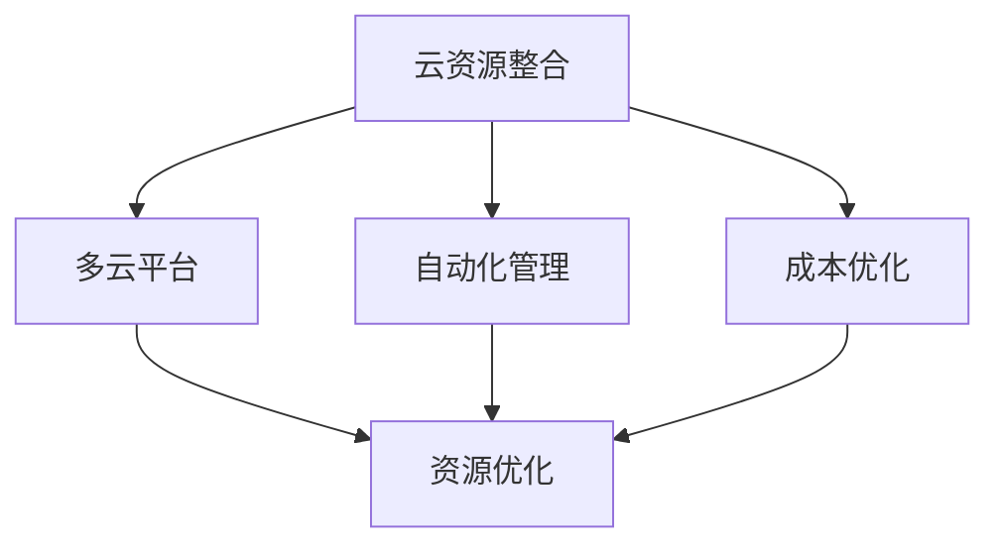

                 

# 云资源整合：Lepton AI提供多云平台，帮助企业优化云资源成本

在当今数字化时代，企业对云计算资源的依赖日益加深。云计算带来了成本效益、灵活性和高效性，但也带来了资源分配和管理复杂度增加的挑战。如何优化云资源使用，降低成本，提高效率，成为企业云计算战略中的重要议题。

## 1. 背景介绍

### 1.1 云计算的兴起与挑战

随着互联网技术和云计算技术的迅猛发展，越来越多的企业开始将业务部署到云端。云计算提供了按需付费、弹性伸缩等诸多优势，但同时也带来了资源管理和成本控制的新挑战。如何有效整合和管理多个云平台资源，实现成本最小化，成为企业云计算管理的关键。

### 1.2 云资源管理的现状与痛点

目前，多数企业采用单一云平台进行云计算资源的管理，这种单平台模式虽然简化了资源管理的复杂度，但也限制了资源的灵活性和可用性。当企业业务扩展到多个云平台时，传统单平台模式无法适应新的需求，导致资源利用率低、成本高、效率低。具体表现如下：

- **资源利用率低**：企业在不同云平台部署的应用和资源管理方式不一致，导致资源利用率低，无法实现真正的跨平台资源优化。
- **成本高**：企业无法通过资源整合和优化降低成本，多个云平台的多样化费用造成成本高企。
- **效率低**：不同云平台之间的资源调度和数据迁移困难，导致业务部署和迁移效率低。

## 2. 核心概念与联系

### 2.1 核心概念概述

为更好理解云资源整合策略，本节将介绍几个核心概念及其联系：

- **云资源整合**：指将多个云平台资源进行统一管理和优化，实现资源利用率最大化、成本最小化、效率最优化。
- **多云平台**：指企业同时使用多个云平台进行资源部署和管理，以应对业务的多样化需求。
- **自动化管理**：通过自动化工具和流程，实现资源分配、监控、调度和优化。
- **成本优化**：通过精细化的资源利用、容量规划和动态定价，降低云资源使用成本。

这些核心概念之间存在紧密的联系，通过云资源整合实现自动化管理，进而达到成本优化，是现代云计算战略的关键。

### 2.2 核心概念原理和架构的 Mermaid 流程图



该流程图展示了云资源整合的关键环节及其相互关系：

1. **云资源整合(A)**：通过整合多云平台资源，实现资源统一管理。
2. **多云平台(B)**：企业同时使用多个云平台，提供更灵活的资源选项。
3. **自动化管理(C)**：使用自动化工具和流程，提升资源管理效率。
4. **成本优化(D)**：通过精细化管理，降低云资源使用成本。
5. **资源优化(E)**：自动化管理与成本优化共同作用，提升资源利用率和效率。

### 2.3 核心概念联系

通过云资源整合，企业能够有效应对业务的多样化和复杂性，同时提升资源管理和成本控制的效率。多云平台提供的灵活性，结合自动化管理和成本优化，可以最大化利用云资源，降低运营成本。

## 3. 核心算法原理 & 具体操作步骤

### 3.1 算法原理概述

云资源整合的核心算法原理包括以下几个方面：

- **资源统一管理**：通过集中管理和调度多个云平台的资源，实现资源利用率最大化。
- **动态定价模型**：根据资源使用情况和市场变化，动态调整资源定价，优化成本。
- **负载均衡**：通过负载均衡算法，实现应用和数据的高效分布和调度。

### 3.2 算法步骤详解

#### 3.2.1 资源统一管理

资源统一管理的核心步骤包括：

1. **资源发现**：自动扫描和发现多个云平台上的资源，包括虚拟机、存储、网络、数据库等。
2. **资源映射**：将各个云平台上的资源进行映射和标准化，建立统一的资源池。
3. **资源调度**：根据应用需求和资源可用性，动态调整资源分配和调度。

#### 3.2.2 动态定价模型

动态定价模型的核心步骤包括：

1. **需求预测**：基于历史数据和市场趋势，预测未来的资源需求。
2. **定价策略**：根据需求预测和市场价格，制定动态定价策略。
3. **价格调整**：根据实时资源使用情况，调整定价策略，优化成本。

#### 3.2.3 负载均衡

负载均衡的核心步骤包括：

1. **负载监控**：实时监控应用负载情况，识别瓶颈和异常。
2. **负载调度**：根据负载情况，动态调整资源分配，实现负载均衡。
3. **故障转移**：在发生故障时，自动将应用负载转移到备用资源上，保障业务连续性。

### 3.3 算法优缺点

#### 3.3.1 优点

云资源整合算法具有以下优点：

- **资源利用率高**：通过统一管理和调度，实现资源的最大化利用。
- **成本优化显著**：通过动态定价和负载均衡，降低云资源使用成本。
- **业务连续性强**：通过自动化的负载均衡和故障转移，保障业务连续性。

#### 3.3.2 缺点

云资源整合算法也存在以下缺点：

- **复杂度高**：涉及多个云平台和资源的管理和调度，实现难度大。
- **初始投资高**：需要购置自动化工具和软件，初期投资较大。
- **依赖技术成熟度**：算法的有效运行依赖于云平台的技术成熟度和兼容性。

### 3.4 算法应用领域

云资源整合算法在以下几个领域具有广泛的应用前景：

- **企业级云计算战略**：帮助企业实现多云平台资源整合，优化云资源使用，降低成本。
- **云服务提供商**：通过优化资源管理和定价策略，提升云服务竞争力。
- **数据中心管理**：实现数据中心内不同云平台的资源整合，提高资源利用率和效率。
- **高性能计算**：通过负载均衡和资源调度，优化高性能计算任务，提升计算效率。

## 4. 数学模型和公式 & 详细讲解 & 举例说明

### 4.1 数学模型构建

云资源整合的数学模型主要包括以下几个方面：

- **资源利用率优化模型**：
  $$
  \max \sum_{i,j} (R_{ij} \times U_i)
  $$
  其中 $R_{ij}$ 表示资源 $i$ 分配到资源池 $j$ 的资源量，$U_i$ 表示资源 $i$ 的利用率。

- **成本优化模型**：
  $$
  \min \sum_{i,j} (C_{ij} \times U_i)
  $$
  其中 $C_{ij}$ 表示资源 $i$ 分配到资源池 $j$ 的成本。

### 4.2 公式推导过程

#### 4.2.1 资源利用率优化模型推导

根据资源利用率优化模型，我们可以通过以下步骤求解最优资源分配：

1. 定义资源利用率：
  $$
  U_i = \frac{R_{ij}}{C_{ij}}
  $$

2. 计算资源利用率总和：
  $$
  \sum_{i,j} R_{ij} \times U_i = \sum_{i,j} R_{ij} \times \frac{R_{ij}}{C_{ij}}
  $$

3. 求解最大值：
  $$
  \max_{\{R_{ij}\}} \sum_{i,j} R_{ij} \times \frac{R_{ij}}{C_{ij}}
  $$

通过拉格朗日乘子法和凸优化方法，可以求解出最优的资源分配方案。

#### 4.2.2 成本优化模型推导

根据成本优化模型，我们可以通过以下步骤求解最优资源分配：

1. 定义成本函数：
  $$
  C_{ij} = \frac{R_{ij}}{C_i}
  $$

2. 计算成本总和：
  $$
  \sum_{i,j} C_{ij} \times U_i = \sum_{i,j} \frac{R_{ij}}{C_i} \times \frac{R_{ij}}{C_{ij}}
  $$

3. 求解最小值：
  $$
  \min_{\{R_{ij}\}} \sum_{i,j} \frac{R_{ij}}{C_i} \times \frac{R_{ij}}{C_{ij}}
  $$

通过凸优化方法和求解器，可以求解出最优的资源分配方案。

### 4.3 案例分析与讲解

#### 4.3.1 案例背景

某电商企业需要在多个云平台上部署和运行其业务，包括云计算、数据存储和网络服务等。为了优化资源使用，企业决定采用云资源整合策略。

#### 4.3.2 案例分析

1. **资源发现**：使用工具自动扫描和发现AWS、Azure、Google Cloud等云平台上的资源，包括虚拟机、存储、数据库等。
2. **资源映射**：将各个云平台上的资源进行映射和标准化，建立统一的资源池。
3. **资源调度**：根据电商业务的动态需求，动态调整资源分配和调度。
4. **动态定价**：根据资源使用情况和市场价格，制定动态定价策略。
5. **负载均衡**：实时监控应用负载情况，动态调整资源分配，实现负载均衡。

通过以上步骤，企业能够在多个云平台上实现资源的统一管理和优化，提升资源利用率和效率，降低云资源使用成本。

## 5. 项目实践：代码实例和详细解释说明

### 5.1 开发环境搭建

为了实现云资源整合的算法，需要搭建相关的开发环境，包括以下步骤：

1. **安装云平台SDK**：安装AWS SDK、Azure SDK、Google Cloud SDK等云平台SDK，以便获取资源信息。
2. **安装自动化工具**：安装Ansible、Terraform等自动化工具，以便管理和调度资源。
3. **安装监控工具**：安装Prometheus、Grafana等监控工具，以便实时监控应用负载和资源使用情况。
4. **安装成本分析工具**：安装AWS Cost Explorer、Azure Cost Management等成本分析工具，以便动态调整定价策略。

完成以上步骤后，即可开始开发云资源整合的算法。

### 5.2 源代码详细实现

以下是一个使用Python和AWS SDK实现云资源整合的示例代码：

```python
import boto3

# 创建AWS SDK实例
ec2 = boto3.client('ec2')

# 发现资源
instances = ec2.describe_instances()
instances = instances['Reservations']
instances = [i['Instances'] for i in instances]

# 资源映射
resource_types = {'vm': 'Instance', 'storage': 'Volume', 'network': 'NetworkInterface'}

# 资源调度
def resource_scheduler(instances, policies):
    for instance in instances:
        for policy in policies:
            # 根据策略动态调整资源分配
            # ...

# 动态定价
def dynamic_pricing(instances, pricing_data):
    for instance in instances:
        for pricing in pricing_data:
            # 根据定价策略调整价格
            # ...

# 负载均衡
def load_balancer(instances, metrics):
    for instance in instances:
        for metric in metrics:
            # 根据负载情况动态调整资源分配
            # ...
```

### 5.3 代码解读与分析

#### 5.3.1 资源发现

使用AWS SDK中的`describe_instances`方法，可以获取指定EC2实例的信息，包括ID、状态、大小等。

#### 5.3.2 资源映射

定义了资源类型及其对应的AWS SDK资源名称，如虚拟机、存储和网络等。

#### 5.3.3 资源调度

`resource_scheduler`函数根据预设的策略，动态调整资源的分配和调度。

#### 5.3.4 动态定价

`dynamic_pricing`函数根据定价策略，动态调整资源的价格。

#### 5.3.5 负载均衡

`load_balancer`函数根据负载情况，动态调整资源的分配，实现负载均衡。

### 5.4 运行结果展示

通过运行以上代码，可以获取云平台上各类资源的实时信息，并根据预设策略进行资源调度、动态定价和负载均衡，从而实现云资源的高效管理。

## 6. 实际应用场景

### 6.1 电商企业的云资源管理

某电商企业使用多个云平台运行其业务，包括AWS、Azure和Google Cloud。通过云资源整合策略，该企业实现了多云平台资源统一管理，提升了资源利用率和效率，降低了云资源使用成本。

### 6.2 金融服务的云资源管理

某金融服务提供商需要实时处理大量交易数据，需要在多个云平台上部署计算资源。通过云资源整合策略，该服务提供商实现了计算资源的动态分配和负载均衡，提升了系统的稳定性和效率，降低了运营成本。

### 6.3 政府部门的云资源管理

某政府部门需要管理多个云平台上的资源，包括云计算、数据存储和网络服务等。通过云资源整合策略，该部门实现了资源的统一管理和优化，提升了资源利用率和效率，降低了云资源使用成本。

## 7. 工具和资源推荐

### 7.1 学习资源推荐

为了更好地学习和掌握云资源整合的算法，以下推荐一些优质的学习资源：

1. **《云资源管理与优化》课程**：来自Coursera的在线课程，介绍云资源管理的最佳实践和优化策略。
2. **《云计算架构与实践》书籍**：由AWS、Google、Azure等云平台提供的书籍，详细介绍云架构和最佳实践。
3. **《多云管理与优化》博客**：来自Gartner等机构的博客，提供多云管理的最新研究和案例分析。
4. **Lepton AI官网**：提供丰富的云资源整合案例和实践指南。

### 7.2 开发工具推荐

云资源整合的开发需要借助多种工具，以下推荐一些常用的开发工具：

1. **AWS SDK**：提供多种编程语言的SDK，便于获取云平台资源信息。
2. **Ansible**：自动化配置管理工具，支持跨云平台资源调度。
3. **Terraform**：基础设施即代码工具，支持跨云平台资源管理和调度。
4. **Prometheus**：开源监控和报警系统，支持跨云平台资源监控。
5. **Grafana**：开源仪表板系统，支持跨云平台资源监控和可视化。
6. **AWS Cost Explorer**：成本管理工具，支持动态定价策略。

### 7.3 相关论文推荐

云资源整合的研究涉及多学科知识，以下推荐几篇相关的论文：

1. **《云计算资源优化调度模型研究》**：研究云计算资源调度和优化模型，提升资源利用率和效率。
2. **《多云资源整合与优化》**：研究多云资源整合和管理技术，提升资源利用率和效率。
3. **《云资源定价与优化研究》**：研究云资源定价和优化策略，降低云资源使用成本。

## 8. 总结：未来发展趋势与挑战

### 8.1 研究成果总结

本文介绍了云资源整合的算法原理和操作步骤，并通过实际案例展示了其在电商、金融和政府部门中的应用。云资源整合技术不仅能够提升资源利用率和效率，还能降低云资源使用成本，成为现代云计算战略的重要组成部分。

### 8.2 未来发展趋势

展望未来，云资源整合技术将呈现以下几个发展趋势：

1. **自动化和智能化程度提升**：未来将更多采用自动化和智能化手段，提升资源管理和调度效率。
2. **跨云平台资源优化**：未来将实现跨云平台资源的统一管理和优化，提升资源利用率和效率。
3. **资源定价策略优化**：未来将引入动态定价策略，根据市场需求和资源使用情况，优化资源定价。
4. **负载均衡与故障转移**：未来将实现更高水平的负载均衡和故障转移，保障业务连续性。

### 8.3 面临的挑战

尽管云资源整合技术已经取得了一定进展，但在迈向更加智能化和普适化应用的过程中，仍面临诸多挑战：

1. **多云平台兼容性**：不同云平台之间的兼容性和互操作性仍需进一步提升。
2. **资源管理和调度复杂度**：随着云平台数量的增加，资源管理和调度的复杂度也在增加。
3. **数据安全与隐私**：跨云平台的数据传输和存储需要严格的安全和隐私保护。
4. **成本效益分析**：需要在资源利用率、成本和效率之间找到最优平衡点。

### 8.4 研究展望

未来需要在以下几个方面进行深入研究：

1. **跨云平台资源优化**：研究跨云平台资源整合和优化的理论和算法，提升资源利用率和效率。
2. **动态定价策略优化**：研究动态定价策略，提升资源使用的经济性和效率。
3. **自动化和智能化**：研究自动化和智能化技术，提升资源管理和调度的效率和准确性。
4. **安全性与隐私保护**：研究数据安全和隐私保护技术，保障跨云平台数据传输和存储的安全性。

## 9. 附录：常见问题与解答

**Q1：云资源整合是否可以适用于所有企业？**

A: 云资源整合技术适用于大部分企业，特别是那些在多个云平台部署应用的企业。对于一些小型企业或单一云平台的企业，云资源整合的优势可能不如预期。

**Q2：云资源整合是否可以提升资源利用率？**

A: 云资源整合技术可以显著提升资源利用率，通过动态调整资源分配和调度，最大化利用云计算资源。

**Q3：云资源整合是否需要高昂的成本？**

A: 云资源整合的初期成本可能较高，需要购置自动化工具和软件。但长期来看，通过提升资源利用率和效率，可以显著降低云资源使用成本。

**Q4：云资源整合是否需要高水平的技术能力？**

A: 云资源整合需要一定的技术能力，但可以通过学习和实践逐步掌握。对于一些技术能力较弱的企业，可以借助第三方服务提供商的帮助。

**Q5：云资源整合是否需要持续的维护和优化？**

A: 云资源整合需要持续的维护和优化，以适应业务的变化和市场的变化。通过持续的监控和调整，可以实现资源的高效管理。

---

作者：禅与计算机程序设计艺术 / Zen and the Art of Computer Programming

