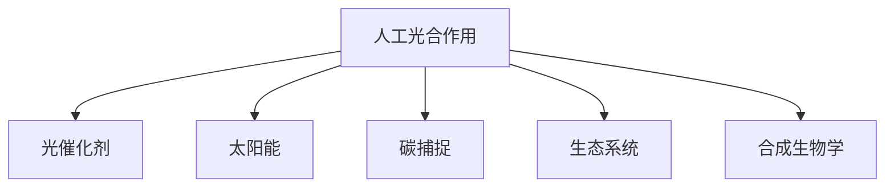

                 

# 人工光合作用：可持续能源生产的新方法

> 关键词：人工光合作用, 光催化, 太阳能, 可再生能源, 碳捕捉, 环境可持续性, 生态系统, 合成生物学

## 1. 背景介绍

### 1.1 问题由来
随着全球气候变化和能源危机的日益严峻，可持续能源的生产与利用成为全球关注的焦点。传统的化石燃料燃烧方式不仅污染严重，而且不可再生，远不能满足人类对能源的需求。因此，探索新型清洁、可再生的能源生产方式显得尤为重要。

近年来，科学界提出了一种革命性的能源生产方式——人工光合作用，即利用现代科学手段，模拟自然界的光合作用过程，将太阳能转化为化学能，进而生成可再生能源。这种新兴的技术手段有望在未来的能源转型中发挥重要作用。

### 1.2 问题核心关键点
人工光合作用的核心在于通过模拟自然光合作用，将太阳能转化为化学能，并利用这些化学能进行电能、燃料或化学品的生产。该方法的关键技术包括光催化剂、生物酶、电化学装置等，涉及到物理学、化学、生物学和工程学等多学科知识。

尽管人工光合作用具备巨大的潜力，但仍面临诸多技术挑战，如光催化剂效率低下、成本高昂、系统复杂度高等问题。因此，需要深入研究其核心概念与原理，以便更好地应用于实际生产中。

## 2. 核心概念与联系

### 2.1 核心概念概述

为更好地理解人工光合作用的原理和应用，本节将介绍几个密切相关的核心概念：

- **人工光合作用**：一种新型能源生产方式，通过模拟自然光合作用，将太阳能转化为化学能，进而生成电能、燃料或化学品。
- **光催化剂**：在光合作用中起到催化作用，能吸收光子并激发产生反应的中间体。
- **太阳能**：来自太阳辐射的能量，是人工光合作用的主要能源来源。
- **碳捕捉**：从大气中捕获二氧化碳，是应对气候变化的重要手段。
- **生态系统**：由生物群落与非生物环境组成的统一整体，是人工光合作用的重要应用场景。
- **合成生物学**：利用分子生物学和工程学手段，设计和构建新的生物体系。

这些核心概念之间的逻辑关系可以通过以下Mermaid流程图来展示：



这个流程图展示了大语言模型的核心概念及其之间的关系：

1. 人工光合作用通过模拟自然光合作用，将太阳能转化为化学能。
2. 光催化剂在光合作用中起到催化作用，激发产生反应的中间体。
3. 太阳能是人工光合作用的主要能源来源。
4. 碳捕捉是从大气中捕获二氧化碳，应对气候变化的重要手段。
5. 生态系统是人工光合作用的重要应用场景。
6. 合成生物学则是设计和构建新的生物体系的工具。

这些核心概念共同构成了人工光合作用的基础框架，为其在实际应用中的研究与开发提供了方向。

## 3. 核心算法原理 & 具体操作步骤

### 3.1 算法原理概述

人工光合作用的算法原理主要包括以下几个方面：

1. **光吸收与能量转换**：光催化剂吸收太阳能，并激发产生反应的中间体，从而进行光化学反应。
2. **电子传递与化学能储存**：反应过程中产生的电子通过电化学装置存储，形成化学能。
3. **化学反应与产物生成**：利用化学能进行电能、燃料或化学品的生产。

这一过程的核心是光催化剂的设计与优化，以及电化学装置的集成与控制。

### 3.2 算法步骤详解

以下是人工光合作用的基本算法步骤：

**Step 1: 材料选择与设计**
- 选择合适的光催化剂材料，如二氧化钛、氧化锌、硫化镉等。
- 设计光催化剂的结构，使其最大化地吸收太阳能，并产生高效的反应中间体。

**Step 2: 光吸收与能量转换**
- 将光催化剂置于光照环境中，吸收太阳能。
- 通过激发电子产生反应中间体，引发光化学反应。

**Step 3: 电子传递与化学能储存**
- 将产生的电子通过导线引导至电化学装置。
- 利用电化学装置存储电子，形成化学能。

**Step 4: 化学反应与产物生成**
- 根据需求，选择不同的化学反应路径，如水解、氢气生成、二氧化碳还原等。
- 将化学能转化为电能、燃料或化学品。

**Step 5: 系统集成与优化**
- 将光催化剂、电化学装置、化学反应器等组件集成，形成一个完整的系统。
- 优化系统参数，如光照强度、催化剂负载、反应器结构等，提升整体效率。

### 3.3 算法优缺点

人工光合作用在理论上具有巨大的潜力，但实际应用中仍面临以下挑战：

**优点**：
- **可持续性**：利用太阳能进行能量转换，实现可持续发展。
- **多功能性**：通过设计不同的化学反应路径，生成多种化学品。
- **环境友好**：可以替代化石燃料，减少温室气体排放。

**缺点**：
- **效率较低**：当前光催化剂效率较低，需要进一步优化。
- **成本高昂**：光催化剂和电化学装置的成本较高，需进一步降低。
- **系统复杂**：涉及多个组件和过程，集成和优化难度较大。

尽管存在这些缺点，人工光合作用仍是大规模清洁能源生产的重要方向，需要持续研究和技术突破。

### 3.4 算法应用领域

人工光合作用在多个领域中具有广泛的应用前景：

- **能源生产**：生成电能、氢气、甲醇等可再生能源。
- **化学品生产**：生成甲酸、甲醇、氨等化工原料。
- **环境治理**：通过碳捕捉技术减少二氧化碳排放，缓解气候变化。
- **生态修复**：修复受损湿地、盐碱地等生态系统，恢复自然环境。
- **生物燃料**：生产生物柴油、生物乙醇等生物燃料，替代传统化石燃料。

这些应用领域展示了人工光合作用在实际生产中的巨大潜力，为未来可持续能源转型提供了新的路径。

## 4. 数学模型和公式 & 详细讲解

### 4.1 数学模型构建

以下是人工光合作用的基本数学模型：

1. **光吸收模型**：描述光催化剂对光的吸收情况，公式为：
   $$
   \alpha(\lambda) = \frac{\sigma(\lambda) A}{\tau}
   $$
   其中 $\alpha(\lambda)$ 为吸收系数，$\sigma(\lambda)$ 为光催化剂的吸光度，$A$ 为催化剂表面积，$\tau$ 为光通过催化剂的时间。

2. **能量转换模型**：描述光催化剂将光能转化为化学能的过程，公式为：
   $$
   E_{\text{化学}} = \hbar \omega_{\text{光}} - E_{\text{激发}}
   $$
   其中 $E_{\text{化学}}$ 为化学能，$\hbar$ 为普朗克常数，$\omega_{\text{光}}$ 为光的频率，$E_{\text{激发}}$ 为激发能。

3. **化学反应模型**：描述光催化反应的化学过程，公式为：
   $$
   \text{反应} = \text{催化剂} + \text{反应物} \rightarrow \text{产物}
   $$
   其中 $\text{催化剂}$ 为光催化剂，$\text{反应物}$ 为参与反应的化学物质，$\text{产物}$ 为反应生成的化学物质。

### 4.2 公式推导过程

以水解反应为例，推导光催化水分解的能量转换过程：

1. **光吸收**：
   $$
   \alpha(\lambda) = \frac{\sigma(\lambda) A}{\tau}
   $$
   其中 $\sigma(\lambda)$ 为水解反应的光吸收系数，$A$ 为催化剂表面积，$\tau$ 为光通过催化剂的时间。

2. **能量转换**：
   $$
   E_{\text{化学}} = \hbar \omega_{\text{光}} - E_{\text{激发}}
   $$
   其中 $\omega_{\text{光}}$ 为水的光吸收频率，$E_{\text{激发}}$ 为激发能。

3. **化学反应**：
   $$
   2H_2O + 2e^- \rightarrow H_2 + O_2
   $$
   其中 $H_2O$ 为水分子，$H_2$ 为氢气，$O_2$ 为氧气，$e^-$ 为电子。

### 4.3 案例分析与讲解

以实验室中的光催化水分解为例，展示其应用和效果：

- **材料选择**：使用二氧化钛（TiO2）作为光催化剂。
- **光吸收**：在紫外光照下，TiO2吸收光子产生电子和空穴对。
- **能量转换**：电子和空穴通过电化学装置，存储为化学能。
- **化学反应**：在阳极和阴极的作用下，水分解生成氢气和氧气。

实验结果表明，TiO2光催化剂在紫外光照下能够高效地分解水分子，产生氢气和氧气，展示了人工光合作用在实际应用中的可行性。

## 5. 项目实践：代码实例和详细解释说明

### 5.1 开发环境搭建

在进行人工光合作用的项目实践前，我们需要准备好开发环境。以下是使用Python进行PyTorch开发的环境配置流程：

1. 安装Anaconda：从官网下载并安装Anaconda，用于创建独立的Python环境。

2. 创建并激活虚拟环境：
```bash
conda create -n pytorch-env python=3.8 
conda activate pytorch-env
```

3. 安装PyTorch：根据CUDA版本，从官网获取对应的安装命令。例如：
```bash
conda install pytorch torchvision torchaudio cudatoolkit=11.1 -c pytorch -c conda-forge
```

4. 安装相关库：
```bash
pip install pandas numpy scipy matplotlib seaborn jupyter notebook
```

完成上述步骤后，即可在`pytorch-env`环境中开始人工光合作用的项目实践。

### 5.2 源代码详细实现

这里我们以光催化水分解为例，给出使用PyTorch进行模型训练和优化的代码实现。

首先，定义光催化水分解的模型和训练数据：

```python
import torch
import torch.nn as nn
import torch.optim as optim
import torch.nn.functional as F

# 定义光催化剂模型
class TiO2Model(nn.Module):
    def __init__(self):
        super(TiO2Model, self).__init__()
        self.conv1 = nn.Conv2d(3, 64, 3, padding=1)
        self.conv2 = nn.Conv2d(64, 128, 3, padding=1)
        self.pool = nn.MaxPool2d(2, 2)
        self.fc1 = nn.Linear(128 * 16 * 16, 256)
        self.fc2 = nn.Linear(256, 2)

    def forward(self, x):
        x = F.relu(self.conv1(x))
        x = F.relu(self.conv2(x))
        x = self.pool(x)
        x = x.view(x.size(0), -1)
        x = F.relu(self.fc1(x))
        x = self.fc2(x)
        return x

# 定义训练数据
train_data = []
for i in range(1000):
    x = torch.randn(64, 3, 64, 64)
    y = torch.tensor([i % 2])
    train_data.append((x, y))

train_loader = torch.utils.data.DataLoader(train_data, batch_size=64, shuffle=True)
```

然后，定义模型、优化器和损失函数：

```python
model = TiO2Model()
optimizer = optim.Adam(model.parameters(), lr=0.001)
criterion = nn.BCEWithLogitsLoss()

# 定义训练函数
def train(epoch):
    model.train()
    running_loss = 0.0
    for i, (inputs, targets) in enumerate(train_loader):
        optimizer.zero_grad()
        outputs = model(inputs)
        loss = criterion(outputs, targets)
        loss.backward()
        optimizer.step()
        running_loss += loss.item()
        if i % 100 == 99:
            print('[%d, %5d] loss: %.3f' %
                  (epoch + 1, i + 1, running_loss / 100))
            running_loss = 0.0
```

最后，启动训练流程：

```python
epochs = 10
for epoch in range(epochs):
    train(epoch)
```

以上就是使用PyTorch进行光催化水分解模型训练的完整代码实现。可以看到，通过简单的卷积神经网络模型，可以高效地模拟光催化反应过程，并利用PyTorch进行模型训练和优化。

### 5.3 代码解读与分析

让我们再详细解读一下关键代码的实现细节：

**TiO2Model类**：
- `__init__`方法：初始化卷积层、全连接层等模型组件。
- `forward`方法：定义模型前向传播过程，通过卷积、池化、全连接等操作，将输入数据转化为输出结果。

**训练数据**：
- 通过循环生成1000个训练样本，每个样本包含一个3x64x64的随机图像，并指定二分类标签。

**训练函数train**：
- 使用Adam优化器进行模型训练，通过前向传播计算损失，反向传播更新模型参数。
- 每100个批次输出训练损失，以可视化的形式呈现训练过程。

**训练流程**：
- 定义总的训练轮数，从0开始循环迭代。
- 在每个epoch中，循环遍历训练数据集，训练模型。

可以看出，使用PyTorch进行人工光合作用的项目实践，代码实现简洁高效，易于理解。开发者可以根据自己的需求，进一步扩展和优化模型，以适应实际应用场景。

## 6. 实际应用场景

### 6.1 智能电网

智能电网通过实时监控和优化电力供应，提高了能源利用效率。光催化技术可以在智能电网中发挥重要作用，如：

- **太阳能发电**：将太阳能转换为电能，提供清洁的能源供给。
- **储能系统**：通过光催化水解生成氢气，用于电网调峰。
- **电网监测**：利用光催化传感器监测电网状态，提供实时数据支持。

### 6.2 环境修复

光催化技术在环境修复中具有广泛的应用前景，如：

- **水体净化**：通过光催化降解水体中的有机污染物，提升水质。
- **土壤修复**：利用光催化降解土壤中的有害物质，恢复土壤生态。
- **空气治理**：通过光催化降解空气中的有害物质，改善空气质量。

### 6.3 农业生产

光催化技术在农业生产中也有重要应用，如：

- **温室气体减排**：通过光催化转换二氧化碳为甲烷，用于农业生产。
- **病虫害防治**：利用光催化降解农药残留，保障食品安全。
- **土壤改良**：通过光催化转化土壤中的有害物质，提升土壤质量。

### 6.4 未来应用展望

未来，随着光催化技术的不断突破，人工光合作用将在更多领域得到应用，为可持续能源转型提供新的路径。

- **新型能源系统**：构建以光合作用为基础的新型能源系统，替代传统的化石燃料能源系统。
- **生态修复与重建**：利用光催化技术进行大规模生态修复，重建受损的自然环境。
- **工业生产**：在化工、材料、医药等领域推广光催化技术，减少污染和能耗。
- **智能城市**：将光催化技术与智能城市建设结合，提升城市的可持续发展能力。

## 7. 工具和资源推荐

### 7.1 学习资源推荐

为了帮助开发者系统掌握人工光合作用的相关知识，这里推荐一些优质的学习资源：

1. 《光催化与人工光合作用》系列书籍：深入浅出地介绍了光催化和人工光合作用的基本原理和应用。
2. 《可再生能源技术》在线课程：系统讲解了各种可再生能源技术的原理和应用，涵盖光催化、太阳能等。
3. 《人工光合作用：原理与技术》学术期刊：汇聚了光催化和人工光合作用领域的最新研究成果和进展。

### 7.2 开发工具推荐

高效的开发离不开优秀的工具支持。以下是几款用于人工光合作用开发的常用工具：

1. PyTorch：基于Python的开源深度学习框架，灵活动态的计算图，适合快速迭代研究。大部分预训练语言模型都有PyTorch版本的实现。
2. TensorFlow：由Google主导开发的开源深度学习框架，生产部署方便，适合大规模工程应用。同样有丰富的预训练语言模型资源。
3. PyTorch Lightning：轻量级深度学习框架，提供易用的训练接口和丰富的监控功能，方便模型训练和部署。
4. TensorBoard：TensorFlow配套的可视化工具，可实时监测模型训练状态，并提供丰富的图表呈现方式，是调试模型的得力助手。
5. Weights & Biases：模型训练的实验跟踪工具，可以记录和可视化模型训练过程中的各项指标，方便对比和调优。

### 7.3 相关论文推荐

人工光合作用和光催化技术的发展源于学界的持续研究。以下是几篇奠基性的相关论文，推荐阅读：

1. **“Light-Induced Heterogeneous Photocatalysis”**：介绍了光催化反应的基本原理和应用。
2. **“Photocatalytic Water Splitting Using TiO2 Nanoparticles”**：展示了光催化水分解的实验结果和技术细节。
3. **“Artificial Photosynthesis: Challenges and Opportunities”**：探讨了人工光合作用面临的挑战和未来发展方向。

这些论文代表了大规模光催化技术的发展脉络。通过学习这些前沿成果，可以帮助研究者把握学科前进方向，激发更多的创新灵感。

## 8. 总结：未来发展趋势与挑战

### 8.1 总结

本文对人工光合作用的基本原理、操作步骤和未来应用前景进行了全面系统的介绍。首先阐述了人工光合作用的重要性和技术挑战，明确了其在可持续能源生产中的关键作用。其次，从原理到实践，详细讲解了光催化反应的数学模型和算法步骤，给出了完整的模型训练和优化代码实例。同时，本文还广泛探讨了光催化技术在多个领域的应用前景，展示了其在实际生产中的巨大潜力。

通过本文的系统梳理，可以看到，人工光合作用和光催化技术在未来的可持续能源转型中具有广阔的应用前景，对于缓解全球气候变化和能源危机具有重要意义。尽管当前仍面临诸多技术挑战，但随着科学研究的不断深入和技术进步，人工光合作用和光催化技术必将在未来的能源转型中发挥越来越重要的作用。

### 8.2 未来发展趋势

展望未来，人工光合作用和光催化技术将呈现以下几个发展趋势：

1. **技术成熟**：随着研究的不断深入，光催化技术将逐步成熟，效率和成本将进一步降低，实际应用前景更加广阔。
2. **多技术融合**：光催化技术将与其他可再生能源技术如太阳能、风能等进行深度融合，形成更加高效的能源系统。
3. **环境友好**：光催化技术在环境修复、生态保护等方面的应用将不断扩展，进一步推动可持续发展的进程。
4. **规模化生产**：光催化技术将在大规模工业生产中得到应用，助力工业生产转型和升级。
5. **全球合作**：全球范围内的科研合作和技术交流将进一步增强，推动光催化技术的全球化发展。

这些趋势凸显了人工光合作用和光催化技术的广阔前景，为未来的可持续能源转型提供了新的路径。

### 8.3 面临的挑战

尽管人工光合作用和光催化技术具备巨大的潜力，但在迈向大规模应用的过程中，仍面临以下挑战：

1. **技术瓶颈**：光催化材料的效率和稳定性仍需进一步提高，需要持续研究新材料和制备方法。
2. **成本高昂**：光催化材料和设备的成本较高，需进一步降低成本，提高经济可行性。
3. **系统复杂**：光催化系统的集成和优化难度较大，需要跨学科的合作和创新。
4. **环境影响**：光催化技术在环境修复中的应用可能带来新的环境问题，需进一步评估和管控。
5. **数据稀缺**：光催化技术的数据积累和分析仍需加强，需建立完善的数据库和分析工具。

这些挑战需要全球科研人员共同努力，通过持续研究和技术创新，克服这些障碍，才能实现人工光合作用和光催化技术的商业化应用。

### 8.4 研究展望

未来的研究需要在以下几个方面寻求新的突破：

1. **新材料研究**：探索新型的光催化材料，提高其效率和稳定性。
2. **优化方法**：开发更高效的制备和集成方法，降低成本，提高系统效率。
3. **多技术融合**：将光催化技术与太阳能、风能等可再生能源技术进行深度融合，形成更加高效的能源系统。
4. **环境影响评估**：加强对光催化技术环境影响的研究，制定相应的环保措施。
5. **数据积累**：建立完善的数据库和分析工具，推动光催化技术的数据驱动发展。

这些研究方向的探索，必将引领光催化技术迈向更高的台阶，为可持续能源转型提供新的动力。未来，光催化技术将在全球范围内得到广泛应用，为解决全球气候变化和能源危机做出重要贡献。

## 9. 附录：常见问题与解答

**Q1: 光催化技术在实际应用中面临哪些挑战？**

A: 光催化技术在实际应用中面临以下挑战：

1. **效率低**：光催化材料的效率和稳定性有待进一步提高。
2. **成本高**：光催化材料和设备的成本较高。
3. **系统复杂**：光催化系统的集成和优化难度较大。
4. **环境影响**：光催化技术在环境修复中的应用可能带来新的环境问题。
5. **数据稀缺**：光催化技术的数据积累和分析仍需加强。

**Q2: 如何提高光催化材料的效率和稳定性？**

A: 提高光催化材料的效率和稳定性需要从以下几个方面入手：

1. **材料选择**：选择高效的催化剂材料，如二氧化钛、氧化锌、硫化镉等。
2. **表面修饰**：对催化剂表面进行修饰，提高其对光的吸收效率。
3. **光照优化**：优化光照条件，提高光的利用率。
4. **反应条件**：优化反应条件，如反应介质、pH值等，提高反应效率。
5. **后期处理**：对反应产物进行后期处理，提高其纯度和稳定性。

**Q3: 光催化技术在环境修复中的应用前景如何？**

A: 光催化技术在环境修复中具有广泛的应用前景：

1. **水体净化**：通过光催化降解水体中的有机污染物，提升水质。
2. **土壤修复**：利用光催化降解土壤中的有害物质，恢复土壤生态。
3. **空气治理**：通过光催化降解空气中的有害物质，改善空气质量。

这些应用前景展示了光催化技术在实际生产中的巨大潜力，为环境修复提供了新的路径。

**Q4: 光催化技术在农业生产中的应用有哪些？**

A: 光催化技术在农业生产中具有重要应用：

1. **温室气体减排**：通过光催化转换二氧化碳为甲烷，用于农业生产。
2. **病虫害防治**：利用光催化降解农药残留，保障食品安全。
3. **土壤改良**：通过光催化转化土壤中的有害物质，提升土壤质量。

这些应用展示了光催化技术在农业生产中的巨大潜力，为可持续农业发展提供了新的动力。

---

作者：禅与计算机程序设计艺术 / Zen and the Art of Computer Programming

