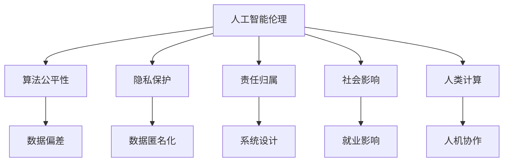

                 

# 人工智能伦理：人类计算的道德与责任探讨

> 关键词：人工智能伦理,算法公平性,隐私保护,责任归属,社会影响,人类计算,道德框架

## 1. 背景介绍

### 1.1 问题由来
随着人工智能技术的迅猛发展，其对社会生活的影响愈发深远。人工智能不仅在医疗、教育、交通等多个领域展现出巨大潜力，也在促进经济发展、提升人类福祉方面发挥着越来越重要的作用。然而，人工智能技术的广泛应用也带来了诸多伦理问题，如算法歧视、隐私泄露、责任归属、社会影响等。这些问题的存在，使得人工智能的发展并非一帆风顺，需要在技术创新和伦理规范之间寻求平衡。

### 1.2 问题核心关键点
人工智能伦理问题主要集中在以下几个方面：
1. **算法公平性**：人工智能算法可能在数据偏见、特征选择等方面存在不公平性，导致对特定群体产生歧视性影响。
2. **隐私保护**：人工智能在处理个人数据时，如何保护用户隐私、避免数据滥用是一个重要议题。
3. **责任归属**：当人工智能系统出错或造成损害时，由谁负责？如何界定系统责任与人工责任？
4. **社会影响**：人工智能系统的广泛应用可能对就业、教育、医疗等社会领域产生深远影响，如何评估和应对这些影响？
5. **人类计算**：人工智能与人类协作的界限在哪里？如何确保人工智能技术的发展不会取代人类智能，而是作为人类计算的有力助手。

这些核心问题直接影响到人工智能技术的可接受度和可持续发展，需要从法律、伦理、技术等多个层面进行综合考虑和规范。

## 2. 核心概念与联系

### 2.1 核心概念概述

为了更好地理解人工智能伦理问题，我们需要首先明确几个核心概念：

- **人工智能伦理(Ethics of AI)**：指在人工智能技术开发和应用过程中，如何确保其行为符合道德标准，不侵害个人和社会的利益。
- **算法公平性(Fairness of AI Algorithms)**：指人工智能算法在处理数据时，不因种族、性别、年龄等非技术性特征产生歧视，确保对所有群体公平对待。
- **隐私保护(Privacy Protection)**：指在人工智能应用中，如何保护个人隐私数据，避免数据泄露和滥用。
- **责任归属(Accountability of AI)**：指在人工智能系统出错或造成损害时，由谁负责，如何界定系统责任与人工责任。
- **社会影响(Social Impact of AI)**：指人工智能技术对社会结构、就业、医疗、教育等领域产生的影响，及其对社会公平、安全的潜在威胁。
- **人类计算(Human Computing)**：指人工智能与人类协作的模式，如何确保人工智能技术的发展不会取代人类智能，而是作为人类计算的有力助手。

这些概念之间的逻辑关系可以通过以下Mermaid流程图来展示：



这个流程图展示了大语言模型的核心概念及其之间的关系：

1. 人工智能伦理是指导人工智能技术开发和应用的最高原则，影响着算法公平性、隐私保护、责任归属、社会影响和人类计算等多个方面。
2. 算法公平性关注如何消除数据偏见，避免系统输出歧视性结果。
3. 隐私保护强调在数据处理过程中保护用户隐私，防止数据滥用。
4. 责任归属探讨在系统出错或造成损害时的责任界定问题。
5. 社会影响评估人工智能技术对社会各领域的深远影响，包括就业、医疗、教育等。
6. 人类计算关注如何确保人工智能与人类协作，而不是替代人类智能。

## 3. 核心算法原理 & 具体操作步骤
### 3.1 算法原理概述

人工智能伦理问题的探讨，本质上是对人工智能算法行为进行道德规范，确保其行为符合社会公德和法律法规。人工智能伦理的核心在于通过算法设计和应用，减少或消除潜在的负面影响，保护用户权益，确保技术公平和安全。

### 3.2 算法步骤详解

人工智能伦理问题的处理，通常包括以下几个关键步骤：

**Step 1: 数据预处理**
- 对原始数据进行清洗、去重、匿名化处理，确保数据质量。
- 对敏感数据进行脱敏处理，避免数据泄露。
- 对数据集进行分层、平衡，确保算法在各种群体上的公平性。

**Step 2: 算法设计**
- 设计无偏见、公平的算法，如公平性评估算法、隐私保护算法等。
- 引入可解释性机制，确保算法决策过程透明、可追溯。
- 设计多模型集成策略，提高系统的鲁棒性和稳定性。

**Step 3: 评估与测试**
- 在公平性、隐私保护、责任归属等方面进行全面评估。
- 使用各种测试数据集对算法进行验证，确保其在不同场景下的表现。
- 进行社会影响分析，评估人工智能系统的潜在风险和收益。

**Step 4: 持续优化**
- 根据评估结果，不断调整算法参数，优化算法性能。
- 引入持续学习机制，确保算法适应数据分布变化。
- 定期更新算法，应对新的伦理挑战和法律法规变化。

### 3.3 算法优缺点

人工智能伦理问题处理具有以下优点：
1. 提高了人工智能系统的公平性和透明性，减少歧视和偏见。
2. 保护了用户隐私，防止数据滥用。
3. 明确了责任归属，增强了系统的可追溯性和问责性。
4. 评估了人工智能系统的社会影响，有助于制定相应的政策法规。

同时，该方法也存在一定的局限性：
1. 数据处理复杂度高，特别是对于多样性和复杂性的数据集。
2. 算法设计和优化难度大，尤其是对于无监督学习和强化学习等非监督算法。
3. 评估标准主观性强，难以统一量化。
4. 持续优化过程耗时较长，对算力和资源要求高。

尽管存在这些局限性，但就目前而言，基于伦理的算法设计范式是大语言模型应用的重要保障，可以显著提升系统的安全性和可靠性。

### 3.4 算法应用领域

人工智能伦理问题处理，在多个领域都有广泛应用，包括但不限于：

- **医疗**：在医疗诊断和预测中，确保算法公平、隐私保护，避免误诊和歧视。
- **金融**：在金融风险评估和贷款审批中，保护用户隐私，确保算法透明和可解释。
- **教育**：在个性化推荐和智能评估中，确保算法公平，防止学习歧视。
- **司法**：在刑事侦查和证据分析中，确保算法无偏见，防止司法不公。
- **交通**：在自动驾驶和交通管理中，确保算法安全，防止事故发生。
- **军事**：在情报分析和目标识别中，确保算法无偏见，防止歧视。

除了上述这些经典领域外，人工智能伦理问题处理也被创新性地应用到更多场景中，如环境保护、能源管理、社会治理等，为人工智能技术的应用带来了新的突破。

## 4. 数学模型和公式 & 详细讲解 & 举例说明

### 4.1 数学模型构建

人工智能伦理问题的处理，涉及多个领域的数学模型。以下是几个典型模型的构建：

- **公平性评估模型**：
  - **模型目标**：评估算法在处理数据时是否存在歧视，特别是针对特定群体。
  - **模型输入**：数据集、公平性指标、算法模型。
  - **模型输出**：公平性得分。

- **隐私保护模型**：
  - **模型目标**：保护用户隐私，防止数据泄露和滥用。
  - **模型输入**：数据集、隐私保护策略、安全措施。
  - **模型输出**：隐私保护效果。

- **责任归属模型**：
  - **模型目标**：在系统出错或造成损害时，明确责任归属。
  - **模型输入**：系统行为、决策过程、损害结果。
  - **模型输出**：责任归属结论。

- **社会影响分析模型**：
  - **模型目标**：评估人工智能系统对社会结构、就业、医疗等领域的影响。
  - **模型输入**：社会数据、人工智能系统行为。
  - **模型输出**：社会影响评估报告。

### 4.2 公式推导过程

以公平性评估模型为例，其基本思想是通过计算不同群体在算法输出中的差异来评估算法公平性。假设有一个二分类任务，模型的输出为 $y_i=\text{sigmoid}(Wx_i+b)$，其中 $x_i$ 为输入样本，$y_i$ 为输出结果，$W$ 和 $b$ 为模型参数。公平性评估可以通过计算不同群体在输出中的差异来进行。

定义两个群体 $G_1$ 和 $G_2$，其样本量分别为 $n_1$ 和 $n_2$。假设模型对 $G_1$ 和 $G_2$ 的输出差异为 $D$，可以定义为：

$$
D = \frac{1}{n_1} \sum_{i \in G_1} y_i - \frac{1}{n_2} \sum_{i \in G_2} y_i
$$

其中 $y_i$ 为模型对样本 $i$ 的预测结果。通过计算 $D$，可以评估模型在 $G_1$ 和 $G_2$ 之间的公平性。

### 4.3 案例分析与讲解

以医疗领域为例，假设有一个基于人工智能的诊断系统，可以用于检测某种疾病的患病概率。系统训练数据集包含大量健康人和患病人的数据，但在训练时，数据集可能存在种族、性别等方面的偏见。如何评估和消除这种偏见，确保系统的公平性？

1. **数据预处理**：对原始数据进行清洗和去重，确保数据质量。
2. **公平性评估**：使用公平性评估模型计算系统对不同群体（如种族、性别）的预测差异。
3. **算法优化**：根据评估结果，调整模型参数，优化算法。
4. **模型测试**：在新的测试数据集上测试优化后的模型，确保其公平性。

通过以上步骤，可以有效地评估和优化医疗诊断系统的公平性，确保其在不同群体上的表现一致，避免误诊和歧视。

## 5. 项目实践：代码实例和详细解释说明
### 5.1 开发环境搭建

在进行人工智能伦理问题的处理前，我们需要准备好开发环境。以下是使用Python进行TensorFlow开发的环境配置流程：

1. 安装Anaconda：从官网下载并安装Anaconda，用于创建独立的Python环境。

2. 创建并激活虚拟环境：
```bash
conda create -n tf-env python=3.8 
conda activate tf-env
```

3. 安装TensorFlow：根据CUDA版本，从官网获取对应的安装命令。例如：
```bash
conda install tensorflow -c pytorch -c conda-forge
```

4. 安装TensorBoard：
```bash
pip install tensorboard
```

5. 安装numpy、pandas等库：
```bash
pip install numpy pandas matplotlib scikit-learn jupyter notebook ipython
```

完成上述步骤后，即可在`tf-env`环境中开始伦理问题处理实践。

### 5.2 源代码详细实现

这里我们以一个简单的公平性评估模型为例，给出TensorFlow代码实现。

```python
import tensorflow as tf
import numpy as np

# 定义公平性评估模型
def fairness_model(X, y, num_classes, num_groups):
    # 计算每组的样本数量
    group_counts = np.bincount(y, minlength=num_classes)
    
    # 定义损失函数
    def loss_fn(groups, y_pred):
        group_losses = []
        for i in range(num_groups):
            group_preds = tf.reduce_sum(groups[i]*y_pred, axis=1)
            group_loss = tf.reduce_mean(tf.square(group_preds - groups[i]))
            group_losses.append(group_loss)
        return tf.reduce_mean(group_losses)
    
    # 训练模型
    model = tf.keras.Sequential([
        tf.keras.layers.Dense(64, activation='relu', input_shape=(X.shape[1],)),
        tf.keras.layers.Dense(num_classes, activation='sigmoid')
    ])
    
    optimizer = tf.keras.optimizers.Adam()
    model.compile(loss=loss_fn, optimizer=optimizer)
    
    model.fit(X, y, epochs=10, batch_size=32)
```

### 5.3 代码解读与分析

让我们再详细解读一下关键代码的实现细节：

**公平性评估模型**：
- 定义函数 `fairness_model`，输入为训练数据 `X` 和标签 `y`，以及类别数 `num_classes` 和分组数 `num_groups`。
- 使用 `np.bincount` 计算每个分组的样本数量。
- 定义损失函数 `loss_fn`，计算每个分组的预测输出与真实样本数量的平方差，并求平均。
- 使用 `tf.keras.Sequential` 构建神经网络模型，包括一个全连接层和一个输出层，其中输出层使用 sigmoid 激活函数。
- 使用 `tf.keras.optimizers.Adam` 定义优化器，并编译模型。
- 使用 `model.fit` 对模型进行训练，使用定义的损失函数和自定义的批处理大小。

**代码实现**：
- `X` 和 `y` 是训练数据的输入和标签。
- `num_classes` 是类别数，这里假设为 2。
- `num_groups` 是分组数，这里假设为 2。

在实际应用中，需要根据具体问题定义模型和损失函数。

## 6. 实际应用场景
### 6.1 医疗领域

人工智能在医疗领域的应用，如疾病诊断、治疗方案推荐等，面临着伦理问题的挑战。如何确保算法的公平性、隐私保护、责任归属，是医疗AI应用的关键。

**公平性**：医疗数据可能存在性别、种族等方面的偏见，如何确保诊断模型对不同群体公平对待？
**隐私保护**：患者数据如何保护，防止数据泄露和滥用？
**责任归属**：诊断错误或治疗方案不当造成损害时，由谁负责？

### 6.2 金融领域

人工智能在金融风险评估、贷款审批等任务中，对用户的信用记录、财务状况等进行评估。如何确保算法的公平性、隐私保护、责任归属，是金融AI应用的关键。

**公平性**：金融数据可能存在性别、收入等方面的偏见，如何确保评估模型对不同群体公平对待？
**隐私保护**：用户财务数据如何保护，防止数据泄露和滥用？
**责任归属**：评估错误或贷款违约造成损害时，由谁负责？

### 6.3 教育领域

人工智能在个性化推荐、智能评估等任务中，对学生的学习情况进行评估。如何确保算法的公平性、隐私保护、责任归属，是教育AI应用的关键。

**公平性**：学生数据可能存在性别、种族等方面的偏见，如何确保评估模型对不同群体公平对待？
**隐私保护**：学生学习数据如何保护，防止数据泄露和滥用？
**责任归属**：评估错误或推荐不当造成损害时，由谁负责？

### 6.4 未来应用展望

随着人工智能技术的不断进步，其在医疗、金融、教育等领域的应用将越来越广泛，伦理问题的探讨也将愈发重要。未来，人工智能伦理问题处理将更加注重以下几个方面：

1. **算法透明性**：通过算法透明性机制，确保算法决策过程公开透明，增强用户信任。
2. **隐私保护**：引入更多的隐私保护技术，如差分隐私、联邦学习等，确保用户数据安全。
3. **责任归属**：建立清晰明确的责任归属机制，确保系统出错或造成损害时责任明确。
4. **社会影响评估**：对人工智能系统的社会影响进行全面评估，制定相应的政策法规。
5. **持续优化**：建立持续学习机制，定期更新算法，应对新的伦理挑战和法律法规变化。

## 7. 工具和资源推荐
### 7.1 学习资源推荐

为了帮助开发者系统掌握人工智能伦理问题的处理，这里推荐一些优质的学习资源：

1. 《人工智能伦理导论》系列课程：由学术界和工业界专家主讲，系统介绍人工智能伦理的基本概念和关键问题。
2. 《人工智能伦理实践》书籍：由人工智能领域的资深专家撰写，结合实际案例，深入讲解人工智能伦理问题的处理。
3. 《人工智能伦理标准》白皮书：由国际标准化组织发布，提供人工智能伦理问题的最新标准和指南。
4. 《机器学习中的伦理问题》课程：由斯坦福大学开设的课程，详细探讨机器学习中的伦理问题和解决方案。
5. 《人工智能伦理指南》网站：由行业协会和学术机构维护，提供人工智能伦理问题的最新研究成果和实践建议。

通过对这些资源的学习，相信你一定能够系统掌握人工智能伦理问题的处理，并用于解决实际的AI应用问题。

### 7.2 开发工具推荐

高效的开发离不开优秀的工具支持。以下是几款用于人工智能伦理问题处理的常用工具：

1. TensorFlow：基于Python的开源深度学习框架，支持分布式训练和模型部署。
2. PyTorch：基于Python的开源深度学习框架，灵活性高，适合快速迭代研究。
3. TensorBoard：TensorFlow配套的可视化工具，可实时监测模型训练状态，提供丰富的图表呈现方式。
4. Weights & Biases：模型训练的实验跟踪工具，记录和可视化模型训练过程中的各项指标。
5. Keras：高层次神经网络API，支持快速构建和训练深度学习模型。
6. Scikit-learn：Python数据科学库，支持数据预处理、模型训练和评估等任务。

合理利用这些工具，可以显著提升人工智能伦理问题处理的开发效率，加快创新迭代的步伐。

### 7.3 相关论文推荐

人工智能伦理问题的探讨源于学界的持续研究。以下是几篇奠基性的相关论文，推荐阅读：

1. "Algorithmic Fairness through Pre-processing"：提出数据预处理技术，消除数据中的偏见，确保算法公平。
2. "Differential Privacy: Privacy-Friendly Data Mining"：提出差分隐私技术，确保数据处理中的隐私保护。
3. "Accountable AI: Model Interpretability, Explainability, and Transparency"：探讨人工智能系统的可解释性和问责性，提出相应的技术措施。
4. "The Ethical and Social Implications of Artificial Intelligence"：全面分析人工智能的伦理和社会影响，提出相应的政策和建议。
5. "Fairness and Accountability in Machine Learning: towards a paradigm of fairness-aware and accountable machine learning"：提出公平性和可解释性机器学习的新范式，探讨其应用和挑战。

这些论文代表了大语言模型伦理问题处理的发展脉络。通过学习这些前沿成果，可以帮助研究者把握学科前进方向，激发更多的创新灵感。

## 8. 总结：未来发展趋势与挑战
### 8.1 总结

本文对人工智能伦理问题进行了全面系统的介绍。首先阐述了人工智能伦理问题的重要性，明确了算法公平性、隐私保护、责任归属、社会影响和人类计算等多个方面的核心问题。其次，从原理到实践，详细讲解了人工智能伦理问题的处理过程，给出了模型设计和评估的完整代码实例。同时，本文还探讨了人工智能伦理问题在医疗、金融、教育等多个领域的应用，展示了其广泛的影响力和应用前景。

通过本文的系统梳理，可以看到，人工智能伦理问题处理对于人工智能技术的发展和应用具有重要的指导意义。只有在确保算法公平、隐私保护、责任归属等方面进行严格规范，才能真正实现人工智能技术的健康发展，造福社会。

### 8.2 未来发展趋势

展望未来，人工智能伦理问题处理将呈现以下几个发展趋势：

1. **算法透明性增强**：未来的算法设计将更加注重透明性，确保算法决策过程公开透明，增强用户信任。
2. **隐私保护技术进步**：差分隐私、联邦学习等隐私保护技术将不断进步，确保用户数据安全。
3. **责任归属机制完善**：建立清晰明确的责任归属机制，确保系统出错或造成损害时责任明确。
4. **社会影响评估全面**：对人工智能系统的社会影响进行全面评估，制定相应的政策法规。
5. **持续学习机制优化**：建立持续学习机制，定期更新算法，应对新的伦理挑战和法律法规变化。

以上趋势凸显了人工智能伦理问题处理的前景广阔。这些方向的探索发展，必将进一步提升人工智能系统的性能和应用范围，为构建安全、可靠、可解释、可控的智能系统铺平道路。

### 8.3 面临的挑战

尽管人工智能伦理问题处理已经取得了一定的进展，但在迈向更加智能化、普适化应用的过程中，仍面临诸多挑战：

1. **数据处理复杂度高**：特别是对于多样性和复杂性的数据集，数据预处理和特征选择的难度较大。
2. **算法设计和优化难度大**：尤其是对于无监督学习和强化学习等非监督算法，设计公平、可解释的算法具有较大挑战。
3. **评估标准主观性强**：难以统一量化，难以在不同场景下进行一致的评估。
4. **持续优化过程耗时较长**：对算力和资源要求高，需要大量实验和测试。

尽管存在这些挑战，但就目前而言，基于伦理的算法设计范式是大语言模型应用的重要保障，可以显著提升系统的安全性和可靠性。

### 8.4 研究展望

未来的研究需要在以下几个方面寻求新的突破：

1. **无监督和半监督学习范式**：探索无监督和半监督学习在人工智能伦理问题处理中的应用，摆脱对大规模标注数据的依赖。
2. **多模态学习技术**：引入多模态学习技术，提高算法对不同类型数据的处理能力。
3. **公平性评估方法**：开发更加准确、高效的公平性评估方法，确保算法在不同群体上的公平性。
4. **隐私保护技术创新**：探索新型隐私保护技术，如差分隐私、联邦学习等，确保数据安全。
5. **责任归属机制设计**：设计清晰明确的责任归属机制，确保系统出错或造成损害时责任明确。
6. **社会影响评估方法**：开发更加全面、系统的社会影响评估方法，评估人工智能系统的潜在风险和收益。

这些研究方向的探索，必将引领人工智能伦理问题处理技术迈向更高的台阶，为构建安全、可靠、可解释、可控的智能系统提供新的理论和方法。总之，人工智能伦理问题处理需要从数据、算法、工程、伦理等多个维度协同发力，才能真正实现人工智能技术的发展与应用。

## 9. 附录：常见问题与解答

**Q1：如何确保人工智能算法的公平性？**

A: 确保人工智能算法的公平性，通常需要从以下几个方面入手：
1. 数据预处理：对原始数据进行清洗、去重、匿名化处理，确保数据质量。
2. 公平性评估：使用公平性评估模型计算算法对不同群体的预测差异。
3. 算法优化：根据评估结果，调整算法参数，优化算法。
4. 多模型集成：引入多模型集成策略，提高系统的鲁棒性和稳定性。

**Q2：如何在人工智能应用中保护用户隐私？**

A: 保护用户隐私，通常需要从以下几个方面入手：
1. 数据匿名化：对用户数据进行匿名化处理，防止数据泄露。
2. 隐私保护算法：使用差分隐私、联邦学习等隐私保护技术，确保用户数据安全。
3. 访问控制：对用户数据进行严格的访问控制，防止未经授权的访问。
4. 加密技术：使用加密技术对用户数据进行保护，防止数据泄露和篡改。

**Q3：人工智能系统出错或造成损害时，如何界定责任？**

A: 界定人工智能系统出错或造成损害时的责任，通常需要从以下几个方面入手：
1. 系统设计：在系统设计阶段明确系统功能、边界和限制。
2. 异常检测：在系统运行过程中进行异常检测，及时发现系统异常。
3. 责任归属机制：建立清晰明确的责任归属机制，确保系统出错或造成损害时责任明确。
4. 用户授权：在用户授权范围内使用系统，避免超出授权范围的操作。

**Q4：如何评估人工智能系统的社会影响？**

A: 评估人工智能系统的社会影响，通常需要从以下几个方面入手：
1. 社会数据收集：收集社会各领域的相关数据，如就业、医疗、教育等。
2. 影响分析模型：建立社会影响分析模型，评估人工智能系统对社会结构、就业、医疗等的影响。
3. 政策法规制定：根据分析结果，制定相应的政策法规，确保系统公平和安全。
4. 持续监测：建立持续监测机制，定期评估系统影响，及时调整和优化系统。

通过以上问题与解答，相信你一定能够更好地理解人工智能伦理问题的处理，并应用于实际的人工智能开发和应用中。

---

作者：禅与计算机程序设计艺术 / Zen and the Art of Computer Programming

