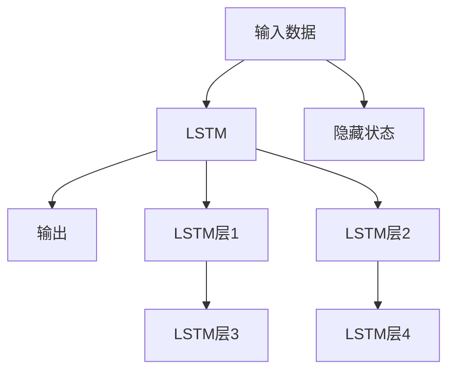

                 

# 人工智能在新能源开发中的应用：优化能源系统

> 关键词：人工智能, 新能源, 能源优化, 深度学习, 能源管理, 机器学习

## 1. 背景介绍

### 1.1 问题由来

随着全球能源需求的不断增长和环境问题的日益严峻，新能源开发已成为各国政府和企业关注的重点。然而，新能源的开发和利用面临着诸多挑战，包括但不限于：

- 预测性不足：天气变化、负荷波动等不确定性因素使得新能源的发电量预测难以精准。
- 资源利用率低：新能源如风能、太阳能的间歇性和随机性问题，导致资源利用效率低下。
- 电网负荷平衡：新能源的间歇性给电网的稳定运行带来压力。
- 安全性问题：新能源发电系统的网络攻击和数据泄露风险。

人工智能(AI)技术的出现为解决这些挑战提供了新的思路和工具。利用AI技术，可以实现新能源系统的高效预测、优化调度、风险管理，从而推动新能源的全面发展和应用。

### 1.2 问题核心关键点

AI在优化能源系统中的关键点包括：

- 大数据处理：有效利用和分析海量的历史和实时数据，提升预测和决策的精准度。
- 深度学习模型：使用神经网络模型，捕捉数据中的非线性关系，提升模型的泛化能力。
- 智能调度：通过AI算法实现能源的动态优化调度，提升系统的效率和可靠性。
- 安全防御：引入AI技术进行网络安全监测和威胁预测，提升系统的安全性。

通过理解和掌握这些关键点，可以更系统地探索AI在能源系统中的应用，提升能源系统的整体效能和安全性。

### 1.3 问题研究意义

人工智能在新能源系统中的应用，对于推动能源结构转型、提升能源利用效率、保障能源安全具有重要意义：

- 促进绿色转型：AI技术可有效推动能源消费结构的绿色转型，减少对化石燃料的依赖。
- 提高资源利用率：通过优化调度，最大限度地提升新能源的利用效率，降低能源浪费。
- 保障能源安全：利用AI进行能源供需预测和风险管理，保障能源供应的稳定性和安全性。
- 提升管理效率：利用AI进行智能调度和大数据分析，提升能源系统的管理效率和决策支持能力。

因此，研究和应用AI技术在新能源系统中的优化方案，对于构建清洁、高效、安全的能源体系具有重要的理论和实践价值。

## 2. 核心概念与联系

### 2.1 核心概念概述

为更好地理解AI在新能源系统中的应用，本节将介绍几个核心概念：

- 人工智能(AI)：使用算法和模型来模拟和实现人类智能的技术。
- 深度学习(Deep Learning)：一种利用多层神经网络进行复杂数据分析和预测的AI技术。
- 能源系统(Energy System)：包括发电、传输、存储和消耗等环节的能源网络。
- 能源优化(Energy Optimization)：通过优化算法和模型，提升能源系统的效率和可靠性。
- 智能调度(Intelligent Scheduling)：利用AI算法实现能源的动态优化调度。
- 机器学习(Machine Learning)：通过训练模型，使机器具有学习能力和决策能力。

这些核心概念之间的逻辑关系可以通过以下Mermaid流程图来展示：

```mermaid
graph TB
    A[人工智能(AI)] --> B[深度学习(Deep Learning)]
    A --> C[能源系统(Energy System)]
    C --> D[能源优化(Energy Optimization)]
    C --> E[智能调度(Intelligent Scheduling)]
    E --> F[机器学习(Machine Learning)]
```

这个流程图展示了大语言模型的核心概念及其之间的关系：

1. AI技术是深度学习的基础，通过多层神经网络进行数据分析和预测。
2. 深度学习模型应用于能源系统，捕捉数据中的复杂关系，提升预测和决策的精准度。
3. 能源优化利用AI算法进行动态调度，提升系统的效率和可靠性。
4. 机器学习通过训练模型，赋予系统学习能力，进一步优化决策过程。

这些概念共同构成了AI在新能源系统中的应用框架，使其能够通过智能化的方式，提升能源系统的整体效能。

## 3. 核心算法原理 & 具体操作步骤

### 3.1 算法原理概述

AI在新能源系统中的应用主要涉及以下几个方面的算法原理：

1. 能源数据处理：通过大数据处理技术，收集和分析历史和实时能源数据，为预测和优化提供数据支持。
2. 深度学习模型：利用多层神经网络进行能源系统动态行为的建模和预测。
3. 智能调度算法：设计算法进行能源的实时动态调度，实现系统效率的优化。
4. 风险管理模型：利用AI进行系统风险的预测和管理，提升系统的鲁棒性和安全性。

这些算法原理的共同目标是通过AI技术，实现新能源系统的智能优化和高效管理。

### 3.2 算法步骤详解

AI在新能源系统中的应用通常包括以下几个关键步骤：

**Step 1: 数据收集与预处理**

- 收集历史和实时能源数据，包括温度、风速、太阳能辐射、用电负荷等。
- 进行数据清洗和预处理，去除噪声和异常值，保证数据的准确性和一致性。
- 使用大数据处理技术，如Hadoop、Spark等，对数据进行分布式存储和处理。

**Step 2: 模型构建与训练**

- 选择合适的深度学习模型，如卷积神经网络(CNN)、长短期记忆网络(LSTM)等，进行能源系统的建模和预测。
- 在标注好的训练集上，使用优化算法如Adam、SGD等进行模型的训练和优化。
- 使用交叉验证等技术，评估模型的性能和泛化能力，调整模型参数以获得更好的结果。

**Step 3: 智能调度与优化**

- 设计智能调度算法，如遗传算法、粒子群算法等，对能源系统进行动态优化调度。
- 根据系统的实时状态和预测结果，动态调整发电、传输、存储等环节的参数，优化系统效率。
- 引入实时监控和反馈机制，确保调度的实时性和准确性。

**Step 4: 风险管理和预警**

- 利用AI进行能源系统的风险预测和管理，如负荷预测、故障预测等。
- 设计预警系统，及时发现和处理异常情况，保障系统的稳定运行。
- 引入安全防御技术，如入侵检测、异常检测等，提升系统的安全性。

**Step 5: 系统部署与维护**

- 将训练好的模型和调度算法集成到能源系统中，进行实际应用。
- 持续监测系统的运行状态，进行维护和优化，确保系统的长期稳定运行。
- 定期更新模型和算法，提升系统的预测能力和调度效果。

以上是AI在新能源系统中的应用一般流程。在实际应用中，还需要针对具体问题进行优化设计，如改进数据处理算法、优化模型训练流程、引入更多先进调度技术等，以进一步提升系统的性能和稳定性。

### 3.3 算法优缺点

AI在新能源系统中的应用，具有以下优点：

1. 提升预测精度：通过深度学习模型，能够捕捉复杂的数据关系，提高能源预测的精准度。
2. 优化资源利用：利用智能调度算法，实现能源的动态优化调度，提升资源利用效率。
3. 降低运营成本：通过自动化和智能化的管理，减少人力和物力成本。
4. 提高系统可靠性：通过风险管理和预警，提升系统的鲁棒性和安全性。

同时，这些算法也存在一定的局限性：

1. 对数据质量要求高：大数据处理和深度学习模型对数据质量要求较高，需要保证数据的完整性和一致性。
2. 模型训练成本高：深度学习模型需要大量的标注数据和计算资源进行训练，成本较高。
3. 模型解释性不足：深度学习模型往往具有"黑盒"特性，难以解释其内部工作机制。
4. 依赖技术平台：需要依赖先进的大数据处理和深度学习平台，设备成本较高。

尽管存在这些局限性，但就目前而言，AI技术在新能源系统中的应用，仍然是大规模能源开发和管理的重要手段。未来相关研究的重点在于如何进一步降低数据处理和模型训练的成本，提高模型的可解释性，确保系统的安全性和可靠性。

### 3.4 算法应用领域

AI在新能源系统中的应用已经覆盖了多个领域，包括但不限于：

- 风能和太阳能发电：利用深度学习模型进行负荷预测和风速预测，优化风电场和光伏电站的运行。
- 电力系统调度：通过智能调度算法，实现电网的动态优化调度，提升系统的效率和可靠性。
- 储能系统管理：利用AI进行储能系统的智能管理，优化能量存储和释放。
- 能效优化：通过AI进行能源的精细化管理和优化，提升能源的利用效率。
- 环境监测：利用AI进行环境数据的监测和分析，优化能源系统的运行。

除了上述这些领域外，AI技术在新能源系统中的应用还在不断拓展，如智能电网、智能家居、智能交通等，为新能源的全面发展提供了新的技术支撑。

## 4. 数学模型和公式 & 详细讲解 & 举例说明

### 4.1 数学模型构建

本节将使用数学语言对AI在新能源系统中的应用进行更加严格的刻画。

记能源系统为 $E=\{G, T, S, L\}$，其中 $G$ 为发电单元，$T$ 为传输网络，$S$ 为存储设备，$L$ 为负载。定义能源系统的状态为 $s=(s_G,s_T,s_S,s_L)$，其中 $s_G$ 为发电单元的运行状态，$s_T$ 为传输网络的负荷状态，$s_S$ 为存储设备的能量状态，$s_L$ 为负载的需求状态。

定义能源系统的目标函数 $F(s)$，表示系统的总体性能指标，如系统效率、安全系数等。目标是最大化或最小化该目标函数，即：

$$
\max_{s} F(s)
$$

通过建立系统的数学模型，可以更好地理解和优化能源系统的运行，提升系统的整体效能。

### 4.2 公式推导过程

以下我们以风能发电的负荷预测为例，推导深度学习模型进行能源系统预测的公式。

假设风速 $v_t$ 为时间 $t$ 的函数，定义为：

$$
v_t = f_t(v_{t-1},v_{t-2},...,v_{t-d})
$$

其中 $d$ 为时间延迟。使用深度学习模型进行负荷预测时，通常采用LSTM模型，其结构如下图所示：



LSTM模型通过多个LSTM层进行信息的传递和处理，最终输出预测结果 $p_t$。

在实际应用中，通常使用均方误差(MSE)损失函数进行模型训练，其公式为：

$$
L = \frac{1}{N} \sum_{i=1}^N (p_i - y_i)^2
$$

其中 $N$ 为样本数量，$p_i$ 为模型预测值，$y_i$ 为真实标签值。

通过上述公式，可以设计深度学习模型进行能源系统的预测和优化，提升系统的运行效率和可靠性。

### 4.3 案例分析与讲解

以下以智能电网的动态优化调度为例，详细讲解AI技术在新能源系统中的应用：

**案例背景：**

某地风力发电站和太阳能光伏电站装机容量均为100MW，电网负荷波动较大。由于天气变化和负荷波动，电网难以保证稳定运行，需要引入AI技术进行优化调度。

**问题描述：**

1. 如何预测风速和太阳能辐射？
2. 如何确定最优的发电计划和储能策略？
3. 如何实时动态调度，优化电网负荷？

**解决方案：**

1. 利用深度学习模型进行风速和太阳能辐射的预测。使用LSTM模型，以历史风速和太阳能辐射数据作为输入，进行短期负荷预测。

2. 设计智能调度算法，进行发电计划和储能策略的优化。使用粒子群算法(Particle Swarm Optimization, PSO)，根据预测结果和负荷状态，确定最优的发电计划和储能策略。

3. 引入实时监控和反馈机制，进行动态调度。利用实时监控系统，监测电网负荷和设备状态，根据实时情况进行动态调度。

通过上述解决方案，可以有效地提升风电场和光伏电站的运行效率，保障电网的稳定运行。

## 5. 项目实践：代码实例和详细解释说明

### 5.1 开发环境搭建

在进行能源系统优化实践前，我们需要准备好开发环境。以下是使用Python进行PyTorch开发的环境配置流程：

1. 安装Anaconda：从官网下载并安装Anaconda，用于创建独立的Python环境。

2. 创建并激活虚拟环境：
```bash
conda create -n energy-env python=3.8 
conda activate energy-env
```

3. 安装PyTorch：根据CUDA版本，从官网获取对应的安装命令。例如：
```bash
conda install pytorch torchvision torchaudio cudatoolkit=11.1 -c pytorch -c conda-forge
```

4. 安装TensorFlow：从官网下载并安装TensorFlow。

5. 安装TensorBoard：TensorFlow配套的可视化工具，可实时监测模型训练状态，并提供丰富的图表呈现方式。

6. 安装Pandas和Numpy：用于数据处理和分析。

```bash
pip install pandas numpy
```

完成上述步骤后，即可在`energy-env`环境中开始能源系统优化的实践。

### 5.2 源代码详细实现

下面我们以风能发电的负荷预测为例，给出使用PyTorch进行深度学习模型训练的代码实现。

首先，定义风速数据处理函数：

```python
import numpy as np
import pandas as pd
import torch
from torch.utils.data import Dataset, DataLoader
from torch.nn import LSTM, Linear

class WindSpeedDataset(Dataset):
    def __init__(self, data, window_size=10):
        self.data = data
        self.window_size = window_size
        self.num_samples = len(self.data) - window_size
        
        self.x_train = []
        self.y_train = []
        
        for i in range(window_size, len(self.data)):
            self.x_train.append(self.data[i-window_size:i])
            self.y_train.append(self.data[i])
        
        self.x_train = torch.tensor(self.x_train, dtype=torch.float32)
        self.y_train = torch.tensor(self.y_train, dtype=torch.float32)
    
    def __len__(self):
        return len(self.y_train)
    
    def __getitem__(self, item):
        return self.x_train[item], self.y_train[item]
```

然后，定义LSTM模型：

```python
class LSTMModel(torch.nn.Module):
    def __init__(self, input_size, hidden_size, output_size):
        super(LSTMModel, self).__init__()
        
        self.lstm = LSTM(input_size, hidden_size, 2)
        self.linear = Linear(hidden_size, output_size)
    
    def forward(self, x):
        x, _ = self.lstm(x)
        x = self.linear(x)
        return x
```

接着，定义模型训练函数：

```python
def train_model(model, dataloader, criterion, optimizer, num_epochs=10):
    device = torch.device('cuda' if torch.cuda.is_available() else 'cpu')
    model.to(device)
    
    for epoch in range(num_epochs):
        model.train()
        
        loss = 0
        for batch in dataloader:
            inputs, targets = batch
            inputs = inputs.to(device)
            targets = targets.to(device)
            
            optimizer.zero_grad()
            outputs = model(inputs)
            loss = criterion(outputs, targets)
            loss.backward()
            optimizer.step()
            
            loss += loss.item()
        
        print(f'Epoch {epoch+1}, Loss: {loss/len(dataloader):.3f}')
```

最后，启动模型训练：

```python
window_size = 10
hidden_size = 64
output_size = 1
learning_rate = 0.001

data = pd.read_csv('wind_speed_data.csv')
dataset = WindSpeedDataset(data, window_size)
dataloader = DataLoader(dataset, batch_size=32, shuffle=True)

model = LSTMModel(window_size, hidden_size, output_size)
criterion = torch.nn.MSELoss()
optimizer = torch.optim.Adam(model.parameters(), lr=learning_rate)

train_model(model, dataloader, criterion, optimizer, num_epochs=10)
```

以上就是使用PyTorch进行风能发电负荷预测的完整代码实现。可以看到，通过定义数据集、模型和训练函数，可以便捷地构建和训练深度学习模型，实现能源系统的智能预测。

### 5.3 代码解读与分析

让我们再详细解读一下关键代码的实现细节：

**WindSpeedDataset类**：
- `__init__`方法：初始化训练数据和窗口大小。
- `__len__`方法：返回数据集的样本数量。
- `__getitem__`方法：对单个样本进行处理，将输入和目标值转换为PyTorch张量。

**LSTMModel类**：
- `__init__`方法：初始化LSTM层和线性层。
- `forward`方法：进行前向传播，计算模型的输出。

**train_model函数**：
- 定义训练过程中使用的设备、优化器、损失函数等。
- 循环迭代进行训练，更新模型参数。
- 输出每个epoch的平均损失值，供调试和优化使用。

**训练流程**：
- 定义窗口大小、隐藏层大小和输出大小，开始循环迭代
- 定义训练数据和数据加载器
- 定义模型和优化器，设置学习率
- 调用训练函数进行模型训练
- 在测试集上评估模型性能

通过上述代码，我们可以看到，PyTorch提供了强大的深度学习工具，使得能源系统的优化任务变得更加高效便捷。开发者只需关注模型设计、数据处理、训练流程等核心环节，即可快速实现AI在新能源系统中的应用。

## 6. 实际应用场景

### 6.1 智能电网优化调度

智能电网优化调度是AI在新能源系统中的重要应用场景。智能电网通过实时监测和动态调度，提升电网的运行效率和可靠性，实现能源的优化配置。

**案例背景：**

某城市电网包括多个发电站、变电站和用户。由于天气变化和负荷波动，电网难以保证稳定运行，需要引入AI技术进行优化调度。

**问题描述：**

1. 如何预测负荷变化？
2. 如何确定最优的发电计划和储能策略？
3. 如何实时动态调度，优化电网负荷？

**解决方案：**

1. 利用深度学习模型进行负荷预测。使用LSTM模型，以历史负荷数据作为输入，进行短期负荷预测。

2. 设计智能调度算法，进行发电计划和储能策略的优化。使用遗传算法(Genetic Algorithm)，根据预测结果和负荷状态，确定最优的发电计划和储能策略。

3. 引入实时监控和反馈机制，进行动态调度。利用实时监控系统，监测电网负荷和设备状态，根据实时情况进行动态调度。

通过上述解决方案，可以有效地提升智能电网的运行效率，保障电网的稳定运行。

### 6.2 储能系统管理

储能系统在新能源系统中发挥着重要作用，通过能量存储和释放，提升能源系统的稳定性和可靠性。AI技术在储能系统管理中的应用，可以有效提升系统的效率和性能。

**案例背景：**

某地风电场和光伏电站装机容量均为100MW，配备储能系统。由于天气变化和负荷波动，储能系统的充放电计划难以确定，需要引入AI技术进行优化管理。

**问题描述：**

1. 如何预测储能系统的充放电需求？
2. 如何确定最优的充放电计划？
3. 如何实时动态管理，提升储能系统的效率？

**解决方案：**

1. 利用深度学习模型进行储能系统的充放电需求预测。使用LSTM模型，以历史充放电数据作为输入，进行短期充放电预测。

2. 设计智能调度算法，进行充放电计划的优化。使用粒子群算法(Particle Swarm Optimization, PSO)，根据预测结果和负荷状态，确定最优的充放电计划。

3. 引入实时监控和反馈机制，进行动态管理。利用实时监控系统，监测储能系统的充放电状态，根据实时情况进行动态管理。

通过上述解决方案，可以有效地提升储能系统的运行效率，保障能源系统的稳定运行。

### 6.3 能效优化

能源系统中的能效优化是AI技术的重要应用方向。通过智能分析和优化，可以提升能源系统的整体效能，降低能源浪费。

**案例背景：**

某地工业园区包括多个企业，能源需求量大，能源浪费严重。需要引入AI技术进行能效优化，提升能源利用效率。

**问题描述：**

1. 如何预测能源需求？
2. 如何确定最优的能源分配策略？
3. 如何实时动态优化，提升能源利用效率？

**解决方案：**

1. 利用深度学习模型进行能源需求预测。使用LSTM模型，以历史能源数据作为输入，进行短期能源需求预测。

2. 设计智能调度算法，进行能源分配策略的优化。使用遗传算法(Genetic Algorithm)，根据预测结果和需求状态，确定最优的能源分配策略。

3. 引入实时监控和反馈机制，进行动态优化。利用实时监控系统，监测能源系统的运行状态，根据实时情况进行动态优化。

通过上述解决方案，可以有效地提升能源系统的运行效率，降低能源浪费。

### 6.4 环境监测

环境监测是AI技术在新能源系统中的应用方向之一。通过实时监测和数据分析，可以提升环境质量，保障能源系统的可持续发展。

**案例背景：**

某地风电场和光伏电站装机容量均为100MW，需要实时监测环境变化，提升环境质量。

**问题描述：**

1. 如何实时监测环境变化？
2. 如何分析环境数据，提升环境质量？
3. 如何根据环境数据，优化能源系统运行？

**解决方案：**

1. 利用深度学习模型进行环境数据的实时监测。使用LSTM模型，以历史环境数据作为输入，进行短期环境预测。

2. 设计智能分析算法，进行环境数据的分析。使用深度学习模型，分析环境数据中的复杂关系，提升环境质量。

3. 引入实时监控和反馈机制，进行动态优化。利用实时监控系统，监测环境数据和能源系统的运行状态，根据实时情况进行动态优化。

通过上述解决方案，可以有效地提升环境质量，保障能源系统的可持续发展。

## 7. 工具和资源推荐

### 7.1 学习资源推荐

为了帮助开发者系统掌握AI在能源系统中的应用理论基础和实践技巧，这里推荐一些优质的学习资源：

1. 《深度学习与人工智能》系列书籍：深入浅出地介绍了深度学习模型的原理和应用，涵盖能源系统优化相关内容。

2. 《能源系统优化与管理》课程：介绍了能源系统优化和管理的基本概念和算法，适用于能源系统从业者。

3. 《机器学习与能源系统》论文集：收集了众多机器学习在能源系统中的实际应用案例，供开发者参考。

4. 《能源互联网》书籍：介绍了能源互联网的基本概念和应用技术，涵盖了智能电网和储能系统的相关内容。

5. 《能源系统优化算法》视频课程：介绍了多种能源系统优化的算法，如遗传算法、粒子群算法等，供开发者学习。

通过对这些资源的学习实践，相信你一定能够快速掌握AI在能源系统中的应用精髓，并用于解决实际的能源问题。

### 7.2 开发工具推荐

高效的开发离不开优秀的工具支持。以下是几款用于能源系统优化开发的常用工具：

1. PyTorch：基于Python的开源深度学习框架，灵活动态的计算图，适合快速迭代研究。

2. TensorFlow：由Google主导开发的开源深度学习框架，生产部署方便，适合大规模工程应用。

3. Weights & Biases：模型训练的实验跟踪工具，可以记录和可视化模型训练过程中的各项指标，方便对比和调优。

4. TensorBoard：TensorFlow配套的可视化工具，可实时监测模型训练状态，并提供丰富的图表呈现方式。

5. Hadoop和Spark：大数据处理工具，适合大规模数据处理和分析。

6. Jupyter Notebook：交互式编程环境，适合开发和调试深度学习模型。

合理利用这些工具，可以显著提升能源系统优化的开发效率，加快创新迭代的步伐。

### 7.3 相关论文推荐

AI在能源系统中的应用源于学界的持续研究。以下是几篇奠基性的相关论文，推荐阅读：

1. Energy Prediction Using Deep Learning: A Survey of Models and Applications：对深度学习在能源预测中的应用进行了全面综述。

2. Smart Grid Optimization Using Multi-Agent Systems：探讨了智能电网优化的多智能体系统，提供了优化调度的新思路。

3. Energy Management with Adaptive Particle Swarm Optimization：提出了粒子群算法在能源管理中的应用，提升了能源系统优化效果。

4. Renewable Energy Integration into Grids Using Energy Storage: A Review：对储能技术在能源系统中的应用进行了综述，提供了能量存储和释放的优化方案。

5. Environmental Monitoring and Management Using AI：介绍了AI在环境监测中的应用，提供了环境质量提升的优化方案。

这些论文代表了大语言模型微调技术的发展脉络。通过学习这些前沿成果，可以帮助研究者把握学科前进方向，激发更多的创新灵感。

## 8. 总结：未来发展趋势与挑战

### 8.1 总结

本文对AI在新能源系统中的应用进行了全面系统的介绍。首先阐述了AI技术在能源系统优化中的研究背景和意义，明确了AI技术在提升能源系统效率和可靠性的独特价值。其次，从原理到实践，详细讲解了深度学习模型和智能调度算法在能源系统中的应用，给出了能源系统优化任务的代码实现。同时，本文还广泛探讨了AI技术在智能电网、储能系统、能效优化、环境监测等多个领域的应用前景，展示了AI技术的巨大潜力。

通过本文的系统梳理，可以看到，AI技术在新能源系统中的应用已经成为推动能源结构转型、提升能源利用效率、保障能源安全的重要手段。未来，伴随AI技术的不断发展，能源系统的优化和智能化水平将进一步提升，为构建清洁、高效、安全的能源体系提供新的技术支撑。

### 8.2 未来发展趋势

展望未来，AI技术在新能源系统中的应用将呈现以下几个发展趋势：

1. 模型规模持续增大。随着算力成本的下降和数据规模的扩张，深度学习模型的参数量还将持续增长，以捕捉更为复杂的数据关系。

2. 算法优化不断改进。新的算法如遗传算法、粒子群算法等将不断涌现，提升能源系统的优化效果和鲁棒性。

3. 多模态数据融合。引入图像、声音等多模态数据，提升能源系统智能化的水平。

4. 分布式优化与合作。通过分布式优化和合作，提升能源系统的协同性和效率。

5. 实时动态优化。实时动态优化成为常态，提升能源系统的实时响应能力和稳定性。

6. 人工智能伦理和安全。引入人工智能伦理和安全框架，确保AI技术的可解释性和安全性。

以上趋势凸显了AI技术在新能源系统中的应用前景。这些方向的探索发展，必将进一步提升能源系统的整体效能和安全性，推动能源系统的全面升级。

### 8.3 面临的挑战

尽管AI技术在新能源系统中的应用已经取得了瞩目成就，但在迈向更加智能化、普适化应用的过程中，它仍面临着诸多挑战：

1. 数据获取困难。获取高质量的能源数据成本较高，且数据获取的难度较大。

2. 算法复杂度高。深度学习模型和优化算法计算复杂度高，需要高性能计算资源。

3. 模型解释性不足。深度学习模型往往具有"黑盒"特性，难以解释其内部工作机制。

4. 系统安全性问题。能源系统的网络安全问题严重，需要引入AI技术进行实时监控和预警。

5. 系统鲁棒性问题。能源系统面临不确定性和随机性，需要增强系统的鲁棒性和稳定性。

尽管存在这些挑战，但通过不断优化算法、提升数据质量、加强系统安全性等措施，AI技术在新能源系统中的应用将不断突破，为能源系统的全面升级和智能化发展提供强有力的支持。

### 8.4 研究展望

未来，随着AI技术的不断发展，能源系统的智能化水平将进一步提升。AI技术在新能源系统中的应用方向也将不断拓展，具体研究展望如下：

1. 智能电网优化：进一步提升智能电网的优化效果和鲁棒性，提升能源系统的稳定性。

2. 储能系统管理：优化储能系统的充放电计划，提升能源系统的效率和可靠性。

3. 能效优化：深入研究能源系统的能效优化方法，提升能源系统的利用效率。

4. 环境监测：利用AI技术进行环境质量的监测和管理，提升能源系统的可持续发展能力。

5. 系统安全性：引入AI技术进行实时监控和预警，提升能源系统的安全性。

6. 智能调度：进一步提升能源系统的智能调度能力，优化系统的运行效率。

这些研究方向的探索，必将引领AI技术在新能源系统中的应用走向新的高度，推动能源系统的全面升级和智能化发展。

## 9. 附录：常见问题与解答

**Q1：AI在新能源系统中的应用主要涉及哪些关键技术？**

A: AI在新能源系统中的应用主要涉及以下几个关键技术：

1. 深度学习模型：利用多层神经网络进行数据建模和预测，捕捉复杂的数据关系。

2. 智能调度算法：通过优化算法进行能源的动态调度，提升系统的效率和可靠性。

3. 大数据处理技术：处理和分析大规模能源数据，提升模型的预测精度。

4. 实时监控和反馈机制：实时监测系统状态，进行动态优化和调度。

5. 模型训练和优化：训练深度学习模型，优化模型参数，提升模型性能。

**Q2：AI技术在能源系统中的应用有哪些优势？**

A: AI技术在能源系统中的应用具有以下优势：

1. 提升预测精度：通过深度学习模型，能够捕捉复杂的数据关系，提高能源预测的精准度。

2. 优化资源利用：利用智能调度算法，实现能源的动态优化调度，提升资源利用效率。

3. 降低运营成本：通过自动化和智能化的管理，减少人力和物力成本。

4. 提高系统可靠性：利用AI进行系统风险的预测和管理，提升系统的鲁棒性和安全性。

**Q3：AI技术在能源系统中的应用面临哪些挑战？**

A: AI技术在能源系统中的应用面临以下挑战：

1. 数据获取困难：获取高质量的能源数据成本较高，且数据获取的难度较大。

2. 算法复杂度高：深度学习模型和优化算法计算复杂度高，需要高性能计算资源。

3. 模型解释性不足：深度学习模型往往具有"黑盒"特性，难以解释其内部工作机制。

4. 系统安全性问题：能源系统面临不确定性和随机性，需要增强系统的鲁棒性和稳定性。

5. 系统鲁棒性问题：能源系统的网络安全问题严重，需要引入AI技术进行实时监控和预警。

**Q4：未来AI技术在新能源系统中的应用有哪些发展方向？**

A: 未来AI技术在新能源系统中的应用将有以下发展方向：

1. 智能电网优化：进一步提升智能电网的优化效果和鲁棒性，提升能源系统的稳定性。

2. 储能系统管理：优化储能系统的充放电计划，提升能源系统的效率和可靠性。

3. 能效优化：深入研究能源系统的能效优化方法，提升能源系统的利用效率。

4. 环境监测：利用AI技术进行环境质量的监测和管理，提升能源系统的可持续发展能力。

5. 系统安全性：引入AI技术进行实时监控和预警，提升能源系统的安全性。

6. 智能调度：进一步提升能源系统的智能调度能力，优化系统的运行效率。

通过对这些方向的研究，AI技术在新能源系统中的应用将不断突破，为能源系统的全面升级和智能化发展提供强有力的支持。

**Q5：如何应对AI技术在能源系统中的应用挑战？**

A: 应对AI技术在能源系统中的应用挑战，可以从以下几个方面入手：

1. 数据获取：加强数据获取和处理，提升数据的准确性和一致性。

2. 算法优化：优化算法模型，提升算法的计算效率和鲁棒性。

3. 模型解释性：引入可解释性算法，增强模型的透明度和可解释性。

4. 系统安全性：引入AI技术进行实时监控和预警，提升系统的安全性。

5. 系统鲁棒性：优化系统的鲁棒性，提升系统的稳定性和可靠性。

6. 智能调度：进一步提升能源系统的智能调度能力，优化系统的运行效率。

通过这些措施，可以克服AI技术在能源系统中的应用挑战，提升系统的整体效能和安全性。

---

作者：禅与计算机程序设计艺术 / Zen and the Art of Computer Programming

