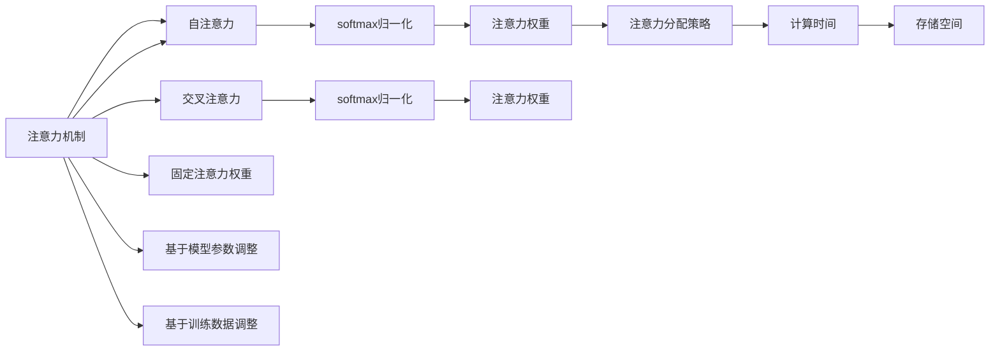

                 

## 1. 背景介绍

### 1.1 问题由来

在深度学习领域，注意力机制（Attention Mechanism）被广泛应用于图像识别、自然语言处理等任务中，以增强模型对关键信息的关注，提高模型性能。随着深度学习模型的规模和复杂度不断增加，注意力资源的分配变得愈发重要，如何高效地分配注意力资源，成为提升模型效率的关键问题。

### 1.2 问题核心关键点

注意力资源的分配本质上是一个优化问题。目标是在保证模型精度的前提下，最大化注意力资源的利用效率。这涉及到多个方面的考量：

1. **模型结构设计**：不同的模型结构会对注意力资源的分布产生不同的影响。例如，Transformer模型中的自注意力机制（Self-Attention）能够充分利用并行计算优势，但同时也需要更多的计算资源。
2. **数据特征**：数据的特征复杂度会影响注意力机制的表现。例如，图像中的局部特征比全局特征需要更多的注意力资源。
3. **任务类型**：不同任务对注意力资源的需求也不同。例如，分类任务可能更关注输入的高层特征，而生成任务则需要更多的低层特征细节。
4. **训练策略**：训练策略对注意力资源的分配也有影响。例如，正则化技术可以减小模型的过拟合，但也可能会限制注意力资源的分配。

### 1.3 问题研究意义

研究注意力资源的分配方法，对于提升深度学习模型的效率和性能具有重要意义：

1. **模型效率**：合理分配注意力资源，可以有效减少计算量，降低模型训练和推理的资源消耗。
2. **模型性能**：通过优化注意力资源的分配，可以更好地捕捉关键信息，提高模型的精度和泛化能力。
3. **资源利用**：在大规模数据集和复杂任务中，合理分配注意力资源可以充分利用计算资源，避免浪费。

## 2. 核心概念与联系

### 2.1 核心概念概述

为了更好地理解注意力资源分配，我们需要对一些关键概念进行深入分析：

- **注意力机制**：一种机制，通过计算输入特征之间的相似度，确定哪些特征对当前任务最相关，从而提高模型的性能。常见的注意力机制包括自注意力（Self-Attention）和交叉注意力（Cross-Attention）。
- **注意力权重**：在注意力机制中，每个输入特征的重要性是通过注意力权重来计算的，通常使用softmax函数进行归一化。
- **注意力分配策略**：如何确定注意力权重的大小，是注意力资源分配的核心问题。常见的策略包括固定注意力权重、基于模型参数的调整、基于训练数据的调整等。
- **注意力资源**：模型在计算过程中对注意力资源的占用，包括计算时间、存储空间等。

### 2.2 核心概念原理和架构的 Mermaid 流程图



这个流程图展示了注意力资源分配的核心流程：

1. **注意力机制**：计算输入特征之间的相似度，确定哪些特征对当前任务最相关。
2. **自注意力**：计算每个特征与其他特征的相似度，得到注意力权重。
3. **softmax归一化**：对注意力权重进行归一化，确保所有权重的和为1。
4. **注意力权重**：每个特征的重要性是通过注意力权重来计算的。
5. **注意力分配策略**：根据模型结构、数据特征、任务类型、训练策略等因素，确定注意力权重的分配策略。
6. **计算时间**：模型在计算过程中对计算资源的占用。
7. **存储空间**：模型在计算过程中对存储资源的占用。

## 3. 核心算法原理 & 具体操作步骤

### 3.1 算法原理概述

注意力资源分配的算法原理，可以概括为以下几个步骤：

1. **特征计算**：对输入特征进行编码，得到特征向量。
2. **注意力计算**：计算特征向量之间的相似度，得到注意力权重。
3. **注意力分配**：根据注意力权重对特征进行加权求和，得到最终的特征表示。
4. **模型训练**：在训练过程中，通过优化算法调整注意力权重，使得模型性能最优。

### 3.2 算法步骤详解

#### 3.2.1 特征计算

对于图像任务，输入为图像像素值，通过卷积层提取特征。对于自然语言处理任务，输入为单词或子词，通过嵌入层（Embedding Layer）将输入转换为特征向量。

#### 3.2.2 注意力计算

注意力计算的核心是相似度计算。常见的相似度计算方法包括点积相似度（Dot Product）、余弦相似度（Cosine Similarity）等。对于自注意力，计算公式如下：

$$
\text{Attention}(Q, K, V) = \text{softmax}\left(\frac{QK^T}{\sqrt{d_k}}\right)V
$$

其中，$Q, K, V$分别为查询向量、键向量和值向量，$d_k$为键向量的维度。

#### 3.2.3 注意力分配

通过注意力计算得到的权重，对特征向量进行加权求和，得到最终的特征表示。具体公式如下：

$$
\text{Attention}(Q, K, V) = \sum_{i=1}^{N} \text{softmax}\left(\frac{QK^T}{\sqrt{d_k}}\right)V_i
$$

#### 3.2.4 模型训练

模型训练的目标是通过优化算法最小化损失函数。常见的优化算法包括随机梯度下降（SGD）、Adam等。在训练过程中，通过调整注意力权重，使得模型性能最优。

### 3.3 算法优缺点

#### 3.3.1 优点

- **提升模型精度**：合理分配注意力资源，可以更好地捕捉关键信息，提高模型的精度和泛化能力。
- **减少计算量**：通过优化注意力资源的分配，可以有效减少计算量，降低模型训练和推理的资源消耗。
- **提高模型效率**：合理分配注意力资源，可以有效提高模型的计算效率，降低计算时间。

#### 3.3.2 缺点

- **计算复杂度**：注意力计算和分配需要较大的计算资源，可能会增加模型的计算复杂度。
- **参数更新**：在训练过程中，需要不断更新注意力权重，增加了训练时间和计算资源消耗。
- **模型复杂度**：注意力机制会增加模型的复杂度，可能会导致模型难以优化。

### 3.4 算法应用领域

注意力资源分配算法在多个领域都有广泛应用：

- **图像识别**：通过自注意力机制，有效捕捉图像中的关键特征，提高模型的识别精度。
- **自然语言处理**：通过自注意力和交叉注意力机制，提高模型的语言理解和生成能力。
- **推荐系统**：通过注意力机制，推荐系统可以更好地捕捉用户偏好，提高推荐效果。
- **语音识别**：通过注意力机制，语音识别系统可以更好地捕捉音频中的关键信息，提高识别精度。

## 4. 数学模型和公式 & 详细讲解 & 举例说明

### 4.1 数学模型构建

注意力资源分配的数学模型可以概括为以下几个步骤：

1. **特征向量**：对输入特征进行编码，得到特征向量。
2. **相似度计算**：计算特征向量之间的相似度，得到注意力权重。
3. **权重分配**：根据注意力权重对特征向量进行加权求和，得到最终的特征表示。

### 4.2 公式推导过程

#### 4.2.1 特征向量编码

对于图像任务，输入为图像像素值，通过卷积层提取特征。对于自然语言处理任务，输入为单词或子词，通过嵌入层（Embedding Layer）将输入转换为特征向量。

#### 4.2.2 相似度计算

常见的相似度计算方法包括点积相似度（Dot Product）、余弦相似度（Cosine Similarity）等。对于自注意力，计算公式如下：

$$
\text{Attention}(Q, K, V) = \text{softmax}\left(\frac{QK^T}{\sqrt{d_k}}\right)V
$$

其中，$Q, K, V$分别为查询向量、键向量和值向量，$d_k$为键向量的维度。

#### 4.2.3 权重分配

通过注意力计算得到的权重，对特征向量进行加权求和，得到最终的特征表示。具体公式如下：

$$
\text{Attention}(Q, K, V) = \sum_{i=1}^{N} \text{softmax}\left(\frac{QK^T}{\sqrt{d_k}}\right)V_i
$$

### 4.3 案例分析与讲解

#### 4.3.1 图像识别

在图像识别任务中，自注意力机制可以有效地捕捉图像中的关键特征。例如，对于一张包含多个物体的图像，自注意力机制可以通过计算不同区域之间的相似度，确定哪些区域对当前任务最相关。

#### 4.3.2 自然语言处理

在自然语言处理任务中，自注意力和交叉注意力机制可以显著提高模型的语言理解和生成能力。例如，在机器翻译任务中，自注意力机制可以捕捉源语言句子中的关键信息，交叉注意力机制可以捕捉目标语言句子中的关键信息，从而提高翻译的精度。

## 5. 项目实践：代码实例和详细解释说明

### 5.1 开发环境搭建

在进行注意力资源分配的实践前，我们需要准备好开发环境。以下是使用Python进行TensorFlow开发的环境配置流程：

1. 安装Anaconda：从官网下载并安装Anaconda，用于创建独立的Python环境。

2. 创建并激活虚拟环境：
```bash
conda create -n tf-env python=3.8 
conda activate tf-env
```

3. 安装TensorFlow：根据CUDA版本，从官网获取对应的安装命令。例如：
```bash
conda install tensorflow -c pytorch -c conda-forge
```

4. 安装各类工具包：
```bash
pip install numpy pandas scikit-learn matplotlib tqdm jupyter notebook ipython
```

完成上述步骤后，即可在`tf-env`环境中开始实践。

### 5.2 源代码详细实现

下面我们以图像识别任务为例，给出使用TensorFlow进行自注意力机制的代码实现。

首先，定义特征计算函数：

```python
import tensorflow as tf
from tensorflow.keras.layers import Dense, Conv2D, Flatten

def feature_calculation(input_tensor, filter_size, num_filters):
    x = tf.keras.layers.Conv2D(filters=num_filters, kernel_size=filter_size, activation='relu')(input_tensor)
    x = tf.keras.layers.MaxPooling2D(pool_size=2)(x)
    x = Flatten()(x)
    x = Dense(512, activation='relu')(x)
    return x
```

然后，定义注意力计算函数：

```python
def attention_calculation(query, key, value, num_heads):
    # 将查询向量、键向量和值向量分别投影为多个头（heads）
    query = tf.transpose(query, [0, 1, 3, 2])
    key = tf.transpose(key, [0, 1, 3, 2])
    value = tf.transpose(value, [0, 1, 3, 2])

    # 计算注意力权重
    attention = tf.matmul(query, key, transpose_b=True) / tf.sqrt(tf.cast(tf.shape(key)[-1], tf.float32))

    # 对注意力权重进行softmax归一化
    attention = tf.nn.softmax(attention)

    # 对值向量进行加权求和，得到最终的特征表示
    output = tf.matmul(attention, value)
    output = tf.transpose(output, [0, 2, 1, 3])

    # 对每个头的输出进行拼接
    output = tf.concat(output, axis=1)
    return output
```

最后，启动模型训练：

```python
model = tf.keras.Sequential([
    Conv2D(32, kernel_size=3, activation='relu', input_shape=(28, 28, 1)),
    feature_calculation,
    attention_calculation,
    Dense(10, activation='softmax')
])

model.compile(optimizer='adam', loss='sparse_categorical_crossentropy', metrics=['accuracy'])

model.fit(train_images, train_labels, epochs=10, batch_size=32)
```

以上就是使用TensorFlow进行自注意力机制的代码实现。可以看到，TensorFlow提供了强大的API，使得实现注意力机制变得简单高效。

### 5.3 代码解读与分析

让我们再详细解读一下关键代码的实现细节：

**feature_calculation函数**：
- 定义了卷积层、池化层、全连接层等基本操作，用于对输入特征进行编码，得到特征向量。
- 使用卷积层和池化层提取图像的局部特征。
- 使用全连接层捕捉特征的高层表示。

**attention_calculation函数**：
- 对查询向量、键向量和值向量进行投影，得到多个头（heads）。
- 计算注意力权重，通过softmax归一化确保权重和为1。
- 对值向量进行加权求和，得到最终的特征表示。
- 对每个头的输出进行拼接，得到最终的输出。

**模型训练**：
- 构建了包含卷积层、注意力层和全连接层的模型结构。
- 使用Adam优化器进行训练，损失函数为交叉熵，评估指标为准确率。
- 在训练集中进行10个epoch的训练，每个epoch的批大小为32。

可以看到，TensorFlow提供了丰富的API和工具，使得实现注意力机制变得简单高效。开发者可以根据具体任务，灵活设计模型结构，快速进行实验和优化。

## 6. 实际应用场景

### 6.1 图像识别

基于自注意力机制的图像识别系统，可以显著提高图像识别的精度。例如，在医疗影像识别任务中，自注意力机制可以捕捉影像中的关键区域，提高诊断的准确性。

### 6.2 自然语言处理

在自然语言处理任务中，自注意力和交叉注意力机制可以显著提高模型的语言理解和生成能力。例如，在机器翻译任务中，自注意力机制可以捕捉源语言句子中的关键信息，交叉注意力机制可以捕捉目标语言句子中的关键信息，从而提高翻译的精度。

### 6.3 推荐系统

在推荐系统中，注意力机制可以更好地捕捉用户偏好。例如，在电商推荐系统中，注意力机制可以捕捉用户对不同商品的关注度，提高推荐效果。

### 6.4 未来应用展望

随着深度学习模型的规模和复杂度不断增加，注意力资源的分配将变得更加重要。未来，注意力资源分配方法将在以下几个方面继续发展：

1. **多任务注意力**：在处理多任务时，注意力机制需要同时关注多个任务的信息。多任务注意力可以更好地捕捉不同任务之间的关联，提高模型性能。
2. **自适应注意力**：根据任务的需求，自适应地调整注意力资源的分配。自适应注意力可以更好地适应不同任务的特点，提高模型泛化能力。
3. **混合注意力**：结合不同的注意力机制，如自注意力、交叉注意力、全局注意力等，提高模型的表达能力和性能。
4. **分布式注意力**：在大规模数据集和复杂任务中，分布式注意力可以更好地利用计算资源，提高模型的效率。

## 7. 工具和资源推荐

### 7.1 学习资源推荐

为了帮助开发者系统掌握注意力资源分配的理论基础和实践技巧，这里推荐一些优质的学习资源：

1. 《深度学习》系列书籍：由深度学习领域专家撰写，系统介绍深度学习的基本原理和实践技巧。
2. 《TensorFlow实战》书籍：TensorFlow官方指南，涵盖TensorFlow的各个方面，包括自注意力机制的实现。
3. 《自然语言处理》课程：斯坦福大学开设的NLP明星课程，涵盖自然语言处理的基本概念和经典模型，包括注意力机制。
4. arXiv上的相关论文：大量关于注意力机制的研究论文，涵盖不同领域和应用场景的注意力计算方法。
5. GitHub上的开源项目：大量开源项目提供了注意力机制的实现，可以参考学习。

通过对这些资源的学习实践，相信你一定能够快速掌握注意力资源分配的精髓，并用于解决实际的NLP问题。

### 7.2 开发工具推荐

高效的开发离不开优秀的工具支持。以下是几款用于注意力资源分配开发的常用工具：

1. TensorFlow：由Google主导开发的开源深度学习框架，支持分布式计算，适合大规模模型训练。
2. PyTorch：基于Python的开源深度学习框架，灵活高效，适合研究和实验。
3. JAX：由Google开发的深度学习框架，支持自动微分，适合高效计算。
4. NVIDIA GPU：高性能计算资源，支持大规模模型训练和推理。

合理利用这些工具，可以显著提升注意力资源分配任务的开发效率，加快创新迭代的步伐。

### 7.3 相关论文推荐

注意力资源分配的研究源于学界的持续研究。以下是几篇奠基性的相关论文，推荐阅读：

1. Attention is All You Need（即Transformer原论文）：提出了Transformer结构，开启了NLP领域的自注意力机制时代。
2. Self-Attention with Transformer-XL（Transformer-XL论文）：提出了Transformer-XL模型，引入了记忆机制，增强了模型的长期依赖能力。
3. Multi-Head Attention for Neural Machine Translation（Transformer论文）：提出了多头自注意力机制，提高了模型在机器翻译任务中的性能。
4. Positional Encoding for Attention-Based Neural Machine Translation（positional encoding论文）：提出了位置编码机制，解决自注意力机制中的位置信息丢失问题。
5. Beyond Self-Attention（LSTM Attention论文）：提出了LSTM Attention机制，增强了模型在长序列中的处理能力。

这些论文代表了大注意力资源分配技术的发展脉络。通过学习这些前沿成果，可以帮助研究者把握学科前进方向，激发更多的创新灵感。

## 8. 总结：未来发展趋势与挑战

### 8.1 研究成果总结

本文对注意力资源分配方法进行了全面系统的介绍。首先阐述了注意力机制和资源分配的核心概念和原理，明确了注意力资源分配在深度学习中的重要性和挑战。其次，从原理到实践，详细讲解了注意力资源分配的数学模型和实现方法，给出了注意力机制的代码实例和详细解释。同时，本文还探讨了注意力资源分配在多个领域的应用场景，展示了其广泛的应用前景。此外，本文精选了注意力资源分配的各类学习资源，力求为读者提供全方位的技术指引。

通过本文的系统梳理，可以看到，注意力资源分配技术正在成为深度学习模型的重要组成部分，极大地提升了模型性能和效率。未来，伴随计算资源和数据规模的不断增加，注意力资源的分配将变得更加重要，成为推动深度学习模型发展的关键因素。

### 8.2 未来发展趋势

展望未来，注意力资源分配技术将呈现以下几个发展趋势：

1. **多任务注意力**：在处理多任务时，注意力机制需要同时关注多个任务的信息。多任务注意力可以更好地捕捉不同任务之间的关联，提高模型性能。
2. **自适应注意力**：根据任务的需求，自适应地调整注意力资源的分配。自适应注意力可以更好地适应不同任务的特点，提高模型泛化能力。
3. **混合注意力**：结合不同的注意力机制，如自注意力、交叉注意力、全局注意力等，提高模型的表达能力和性能。
4. **分布式注意力**：在大规模数据集和复杂任务中，分布式注意力可以更好地利用计算资源，提高模型的效率。

### 8.3 面临的挑战

尽管注意力资源分配技术已经取得了瞩目成就，但在迈向更加智能化、普适化应用的过程中，它仍面临诸多挑战：

1. **计算复杂度**：注意力计算和分配需要较大的计算资源，可能会增加模型的计算复杂度。
2. **模型复杂度**：注意力机制会增加模型的复杂度，可能会导致模型难以优化。
3. **数据需求**：在训练过程中，需要大量的标注数据来优化注意力权重，数据获取成本较高。
4. **模型泛化**：在测试集上的表现与训练集上的表现差距较大，需要进一步优化模型泛化能力。

### 8.4 研究展望

面对注意力资源分配面临的挑战，未来的研究需要在以下几个方面寻求新的突破：

1. **优化算法**：开发更加高效优化算法，减少训练时间和计算资源消耗。
2. **硬件优化**：利用分布式计算、GPU加速等技术，提高模型训练和推理效率。
3. **数据增强**：通过数据增强技术，增加训练数据的数量和多样性，提高模型泛化能力。
4. **模型压缩**：通过模型压缩技术，减小模型大小，降低计算资源消耗。
5. **迁移学习**：利用迁移学习技术，从已有的预训练模型中提取有用的信息，降低模型训练成本。

这些研究方向和突破，必将引领注意力资源分配技术迈向更高的台阶，为深度学习模型的应用提供更强大的技术支撑。

