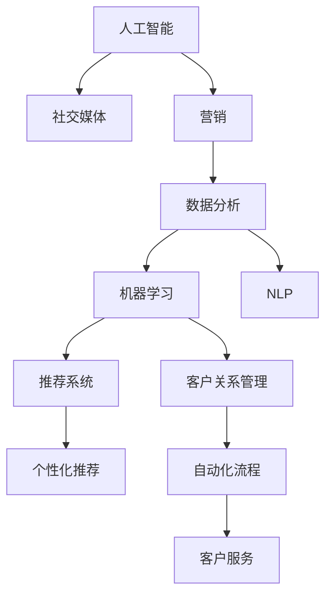

                 

# 人工智能在社交媒体和营销中的应用

> 关键词：人工智能(AI),社交媒体(Social Media),营销(Marketing),数据分析,机器学习,推荐系统,自然语言处理(NLP),客户关系管理(CRM),广告投放

## 1. 背景介绍

### 1.1 问题由来
在数字经济时代，社交媒体和营销已成为企业与消费者进行互动的重要渠道。社交媒体不仅提供了丰富的用户生成内容，还具备强大的用户传播力和话题引导力。利用这些资源，企业可以在更低成本下进行品牌推广和市场分析。

然而，社交媒体数据的庞杂多样，以及用户行为的动态变化，使得营销策略的设计与执行变得极具挑战。传统的基于经验的数据驱动方法往往难以应对这些复杂情况，因此需要借助人工智能(AI)技术，以提升营销决策的精准性和效率。

### 1.2 问题核心关键点
人工智能在社交媒体和营销中的应用主要围绕以下几个核心关键点展开：

- 数据分析：利用机器学习算法处理和分析海量社交媒体数据，提炼有价值的用户行为信息。
- 客户洞察：通过自然语言处理(NLP)技术，理解用户言论背后的情感和偏好，实现对客户心智的深入洞察。
- 内容推荐：基于协同过滤、深度学习等算法，为用户定制个性化内容，提升用户体验和留存率。
- 广告投放：通过广告定位、效果评估等技术手段，优化广告投放策略，实现精准营销。
- 客户关系管理：利用AI技术提升CRM系统的自动化水平，优化客户服务流程。

这些技术在社交媒体和营销中的应用，可以显著提升品牌曝光、用户互动和转化率，推动企业营销活动的科学化、精准化。

## 2. 核心概念与联系

### 2.1 核心概念概述

为更好地理解人工智能在社交媒体和营销中的应用，本节将介绍几个密切相关的核心概念：

- 人工智能(AI)：利用机器学习、深度学习、自然语言处理等技术，模拟人类智能行为，实现数据处理、决策支持等功能。
- 社交媒体(Social Media)：通过网络平台如Facebook、Twitter、微信等，用户可以进行信息分享、社交互动。
- 营销(Marketing)：企业通过市场策略、产品推广、广告投放等手段，实现品牌推广和销售转化。
- 数据分析：从原始数据中提取有用信息，通过数据挖掘和机器学习算法发现数据背后的规律和趋势。
- 机器学习(ML)：一种使计算机通过数据学习预测和决策的技术。
- 自然语言处理(NLP)：使计算机理解、解释和生成自然语言的技术。
- 推荐系统：利用用户行为数据和模型算法，为个性化推荐用户感兴趣的内容。
- 客户关系管理(CRM)：通过记录和管理客户互动信息，提升客户满意度和忠诚度。

这些核心概念之间的逻辑关系可以通过以下Mermaid流程图来展示：



这个流程图展示了大语言模型在社交媒体和营销中的应用路径：

1. 人工智能通过社交媒体数据进行分析，提炼用户行为信息。
2. 利用机器学习算法，对用户行为进行预测和分类。
3. 自然语言处理技术可以解析用户评论、消息等文本信息，提升对客户心智的洞察。
4. 推荐系统结合用户行为和内容，提供个性化推荐。
5. CRM系统通过AI技术自动化客户管理流程，提升客户服务效率。

这些技术相互融合，形成了社交媒体和营销领域应用人工智能的全链路解决方案。

## 3. 核心算法原理 & 具体操作步骤
### 3.1 算法原理概述

人工智能在社交媒体和营销中的应用，主要涉及以下几个关键算法和流程：

- 数据分析与特征工程：从原始数据中提取关键特征，包括用户行为数据、兴趣标签、社交网络关系等。
- 机器学习与模型训练：构建预测模型，如分类、回归、聚类等，对用户行为进行预测和分类。
- 自然语言处理(NLP)：使用词向量模型、情感分析、意图识别等技术，处理和理解用户评论和消息。
- 推荐系统：基于协同过滤、深度学习等算法，为用户推荐个性化内容。
- 广告投放与效果评估：通过A/B测试、点击率预测等技术，优化广告投放策略。
- 客户关系管理(CRM)：利用AI技术自动化客户服务流程，提升客户满意度。

### 3.2 算法步骤详解

基于人工智能的社交媒体和营销应用，一般包括以下几个关键步骤：

**Step 1: 数据收集与预处理**
- 收集社交媒体平台上的用户数据，如评论、点赞、分享、私信等。
- 对数据进行清洗、去重、缺失值填充等预处理，确保数据质量。

**Step 2: 特征提取与工程**
- 从预处理后的数据中提取关键特征，如用户ID、时间戳、关键词、主题等。
- 使用特征工程技术，构建文本特征、用户行为特征、社交网络特征等。

**Step 3: 模型训练与优化**
- 选择合适的机器学习算法，如随机森林、支持向量机、深度神经网络等，构建预测模型。
- 对模型进行超参数调优，选择合适的正则化技术，如L2正则、Dropout等。
- 使用交叉验证等技术，评估模型性能，防止过拟合。

**Step 4: 自然语言处理(NLP)**
- 对用户评论、消息等文本数据进行分词、词性标注、实体识别等预处理。
- 使用词向量模型(如Word2Vec、GloVe)将文本数据转换为向量表示。
- 使用情感分析、意图识别等技术，分析用户情感和意图。

**Step 5: 推荐系统构建**
- 根据用户行为和文本特征，利用协同过滤、深度学习等算法，为用户推荐个性化内容。
- 使用模型评估指标，如准确率、召回率、F1值等，评估推荐效果。

**Step 6: 广告投放与效果评估**
- 设计广告创意，选择合适的广告投放平台。
- 使用A/B测试、点击率预测等技术，评估广告效果，优化投放策略。

**Step 7: 客户关系管理(CRM)**
- 利用AI技术自动化客户服务流程，如自动化客服、智能推荐、客户画像构建等。
- 使用客户反馈数据，优化服务流程和产品推荐。

### 3.3 算法优缺点

基于人工智能的社交媒体和营销应用，具有以下优点：

- 高效处理大数据：利用AI算法可以快速处理和分析海量社交媒体数据，发现潜在用户行为和趋势。
- 提升决策精准性：通过数据分析和模型预测，能够更精准地制定营销策略，提高ROI。
- 个性化推荐：利用推荐系统，实现个性化内容推荐，提升用户体验和满意度。
- 自动化流程：利用AI技术，实现客户服务自动化，提高效率，降低成本。

同时，这些应用也存在一些局限性：

- 数据隐私问题：在收集和使用用户数据时，需遵守相关法律法规，保护用户隐私。
- 模型复杂性：构建复杂模型需要大量标注数据和计算资源，对技术要求较高。
- 算法可解释性：AI算法的"黑盒"特性，使得模型的决策过程难以解释，影响用户信任。
- 动态环境适应性：社交媒体环境变化快，模型的训练和调整周期需相应缩短。

尽管存在这些挑战，但AI在社交媒体和营销中的应用，已经展现出巨大的潜力和前景。

### 3.4 算法应用领域

人工智能在社交媒体和营销中的应用，主要体现在以下几个方面：

- 广告投放：通过数据分析和算法优化，实现精准投放，提升广告点击率和转化率。
- 客户洞察：利用NLP技术，分析用户评论和社交互动，洞察用户情感和行为。
- 推荐系统：结合用户行为和文本信息，为用户推荐个性化内容，提高留存率。
- 客户关系管理：自动化客户服务流程，提升客户满意度和忠诚度。
- 营销策略优化：通过数据分析和模型预测，优化营销策略和资源配置。

这些应用已经广泛应用于Facebook、Twitter、Instagram等社交媒体平台，并帮助企业提升品牌曝光和市场竞争力。

## 4. 数学模型和公式 & 详细讲解 & 举例说明

### 4.1 数学模型构建

基于人工智能的社交媒体和营销应用，涉及多个数学模型。以下以广告投放中的点击率预测为例，构建和解析相关模型。

假设有一组历史广告数据 $D=\{(x_i, y_i)\}_{i=1}^N$，其中 $x_i$ 为广告特征向量，$y_i$ 为广告点击标签。设 $x$ 为待预测的广告特征向量，预测其点击概率为 $p(y|x)$。

定义交叉熵损失函数为：

$$
\mathcal{L}(\theta) = -\frac{1}{N}\sum_{i=1}^N y_i\log(p_\theta(x_i)) + (1-y_i)\log(1-p_\theta(x_i))
$$

其中 $p_\theta(x_i)$ 为模型 $p$ 在特征 $x_i$ 下的点击概率预测值。模型参数为 $\theta$，通常使用深度神经网络来表示。

### 4.2 公式推导过程

以下我们以逻辑回归模型为例，推导点击率预测的数学公式。

设 $x$ 为 $d$ 维向量，$y \in \{0,1\}$ 为点击标签，逻辑回归模型的预测函数为：

$$
p_\theta(x) = \frac{1}{1+\exp(-\theta^Tx)}
$$

其中 $\theta$ 为模型参数，$x$ 为广告特征向量。为了简化计算，将其转化为 sigmoid 函数形式：

$$
p_\theta(x) = \frac{1}{1+\exp(-W^Tx+b)}
$$

式中 $W^T$ 和 $b$ 分别表示权重和偏置项。

假设模型 $p_\theta(x)$ 在训练数据 $D$ 上的交叉熵损失为 $\mathcal{L}(\theta)$，则有：

$$
\mathcal{L}(\theta) = -\frac{1}{N}\sum_{i=1}^N y_i\log p_\theta(x_i) + (1-y_i)\log(1-p_\theta(x_i))
$$

为最小化交叉熵损失，使用梯度下降等优化算法，更新模型参数 $\theta$：

$$
\theta \leftarrow \theta - \eta \nabla_{\theta}\mathcal{L}(\theta)
$$

其中 $\eta$ 为学习率，$\nabla_{\theta}\mathcal{L}(\theta)$ 为损失函数对参数 $\theta$ 的梯度，可以通过反向传播算法计算。

### 4.3 案例分析与讲解

以Facebook的广告投放系统为例，分析其如何利用AI技术提升广告效果。

Facebook的广告投放系统利用机器学习算法进行点击率预测和广告优化。系统首先从大量历史广告数据中提取关键特征，如广告类型、关键词、用户属性等。然后，使用逻辑回归、深度神经网络等模型，预测每个广告的点击概率。系统根据预测结果进行广告排序和投放，优先展示点击率较高的广告，最大化广告ROI。

此外，Facebook还利用A/B测试、多臂乐队算法等技术手段，持续优化广告投放策略，提升广告效果。同时，Facebook的推荐系统也基于用户行为和文本数据，为广告投放提供更多维度的用户洞察，进一步提升广告精准性。

## 5. 项目实践：代码实例和详细解释说明

### 5.1 开发环境搭建

在进行广告投放系统开发前，我们需要准备好开发环境。以下是使用Python进行PyTorch开发的环境配置流程：

1. 安装Anaconda：从官网下载并安装Anaconda，用于创建独立的Python环境。

2. 创建并激活虚拟环境：
```bash
conda create -n ad_system python=3.8 
conda activate ad_system
```

3. 安装PyTorch：根据CUDA版本，从官网获取对应的安装命令。例如：
```bash
conda install pytorch torchvision torchaudio cudatoolkit=11.1 -c pytorch -c conda-forge
```

4. 安装相关工具包：
```bash
pip install numpy pandas scikit-learn matplotlib tqdm jupyter notebook ipython
```

完成上述步骤后，即可在`ad_system`环境中开始广告投放系统的开发。

### 5.2 源代码详细实现

这里我们以基于逻辑回归的广告点击率预测模型为例，给出使用PyTorch实现的代码。

首先，定义模型和优化器：

```python
import torch
from torch import nn
from torch.optim import Adam

class AdModel(nn.Module):
    def __init__(self, input_size, hidden_size, output_size):
        super(AdModel, self).__init__()
        self.fc1 = nn.Linear(input_size, hidden_size)
        self.fc2 = nn.Linear(hidden_size, output_size)
        self.sigmoid = nn.Sigmoid()

    def forward(self, x):
        x = self.fc1(x)
        x = self.sigmoid(x)
        x = self.fc2(x)
        x = self.sigmoid(x)
        return x

# 创建模型和优化器
model = AdModel(input_size=10, hidden_size=64, output_size=1)
optimizer = Adam(model.parameters(), lr=0.01)
```

接着，定义训练和评估函数：

```python
from sklearn.model_selection import train_test_split
from sklearn.metrics import roc_auc_score

# 创建数据集
X = # 广告特征矩阵
y = # 广告点击标签
X_train, X_test, y_train, y_test = train_test_split(X, y, test_size=0.2)

# 将数据转换为PyTorch张量
X_train = torch.tensor(X_train)
X_test = torch.tensor(X_test)
y_train = torch.tensor(y_train)
y_test = torch.tensor(y_test)

# 定义损失函数
criterion = nn.BCELoss()

# 定义训练函数
def train_epoch(model, data_loader, optimizer):
    model.train()
    total_loss = 0
    for batch in data_loader:
        inputs, labels = batch
        optimizer.zero_grad()
        outputs = model(inputs)
        loss = criterion(outputs, labels)
        total_loss += loss.item()
        loss.backward()
        optimizer.step()
    return total_loss / len(data_loader)

# 定义评估函数
def evaluate(model, data_loader):
    model.eval()
    total_preds = []
    total_labels = []
    for batch in data_loader:
        inputs, labels = batch
        outputs = model(inputs)
        total_preds.append(outputs.sigmoid().cpu().tolist())
        total_labels.append(labels.cpu().tolist())
    y_preds = torch.cat(total_preds).numpy()
    y_labels = torch.cat(total_labels).numpy()
    return roc_auc_score(y_labels, y_preds)

# 训练模型
num_epochs = 10
batch_size = 64

for epoch in range(num_epochs):
    loss = train_epoch(model, train_loader, optimizer)
    print(f"Epoch {epoch+1}, train loss: {loss:.4f}")

    auc = evaluate(model, test_loader)
    print(f"Epoch {epoch+1}, test AUC: {auc:.4f}")

# 保存模型
torch.save(model.state_dict(), 'ad_model.pth')
```

以上代码展示了使用PyTorch构建广告点击率预测模型的过程。在训练过程中，我们使用Adam优化器进行参数更新，并在验证集上评估模型性能。最后，使用roc_auc_score评估模型预测性能。

### 5.3 代码解读与分析

让我们再详细解读一下关键代码的实现细节：

**AdModel类**：
- `__init__`方法：初始化模型，包括两个线性层和一个Sigmoid激活函数。
- `forward`方法：前向传播计算，将输入数据经过线性层和Sigmoid函数输出。

**数据集创建**：
- 从原始数据中生成广告特征矩阵和点击标签。
- 使用train_test_split方法，将数据集划分为训练集和测试集。
- 将数据转换为PyTorch张量，准备输入模型。

**模型训练**：
- 定义模型、损失函数和优化器。
- 使用train_epoch函数，在训练集上迭代更新模型参数。
- 在每个epoch结束时，在测试集上评估模型性能，记录AUC值。

**模型保存**：
- 使用torch.save方法保存模型状态字典，方便后续加载使用。

通过上述代码，可以构建一个基础的广告点击率预测模型，并使用逻辑回归等方法进行预测。在实际应用中，还需要结合更多实际数据和业务需求，进一步优化模型结构和训练策略。

## 6. 实际应用场景

### 6.1 社交媒体分析

社交媒体分析是利用AI技术对社交媒体数据进行挖掘和分析的过程，涉及情感分析、舆情监测、趋势预测等多个方面。通过分析用户评论和互动，企业可以洞察用户需求和偏好，及时调整营销策略。

以Twitter情感分析为例，通过分析用户对品牌、产品的评论，可以评估其情感倾向，并据此优化产品设计和推广策略。Twitter情感分析模型通常采用基于LSTM的模型，结合词向量模型和情感词典，分析用户评论情感。

### 6.2 个性化推荐

个性化推荐系统利用用户行为数据和模型算法，为个性化推荐用户感兴趣的内容。在社交媒体平台中，个性化推荐系统可以提升用户留存率和互动率。

以Netflix推荐系统为例，Netflix通过收集用户观看历史、评分和搜索行为，构建推荐模型。Netflix的推荐模型包括协同过滤、深度学习等算法，并不断优化模型参数和算法，提升推荐效果。Netflix通过推荐系统，为每个用户推荐不同的电影和电视剧，显著提高了用户观看时间和满意度。

### 6.3 客户服务自动化

客户服务自动化是利用AI技术提升客户服务效率和体验的过程。通过AI技术，可以实现自动化客服、智能推荐和客户画像构建等功能，提升客户满意度和忠诚度。

以微信客服为例，微信客服利用自然语言处理(NLP)技术和AI算法，实现智能对话。微信客服能够回答用户常见问题，解决用户问题，提升客户服务效率。同时，微信客服还能够收集用户反馈数据，进一步优化系统性能。

## 7. 工具和资源推荐
### 7.1 学习资源推荐

为了帮助开发者系统掌握AI在社交媒体和营销中的应用，这里推荐一些优质的学习资源：

1. Coursera《深度学习》课程：由斯坦福大学教授Andrew Ng开设，介绍深度学习的基本概念和常用算法，适合初学者入门。
2. Udacity《机器学习工程师》纳米学位课程：涵盖机器学习基础和高级应用，实战项目包括广告投放优化等。
3. Kaggle竞赛平台：提供大量真实数据集和竞赛项目，提升实际应用能力。
4. 《Python深度学习》书籍：由 François Chollet著，介绍深度学习的基础和实战案例。
5. 《广告投放优化》博客系列：详细讲解广告投放中的AI技术和应用，适合进阶学习。

通过对这些资源的学习实践，相信你一定能够快速掌握AI在社交媒体和营销中的应用精髓，并用于解决实际的NLP问题。

### 7.2 开发工具推荐

高效的开发离不开优秀的工具支持。以下是几款用于AI在社交媒体和营销中的应用开发的常用工具：

1. PyTorch：基于Python的开源深度学习框架，灵活动态的计算图，适合快速迭代研究。
2. TensorFlow：由Google主导开发的开源深度学习框架，生产部署方便，适合大规模工程应用。
3. Keras：高层次的深度学习框架，适合快速搭建和调试模型。
4. Scikit-learn：Python机器学习库，包含大量常用的机器学习算法和工具。
5. Pandas：数据分析库，适合处理和分析结构化数据。
6. Scrapy：网络爬虫框架，适合大规模数据采集。

合理利用这些工具，可以显著提升AI在社交媒体和营销中的应用开发效率，加快创新迭代的步伐。

### 7.3 相关论文推荐

AI在社交媒体和营销中的应用源于学界的持续研究。以下是几篇奠基性的相关论文，推荐阅读：

1. Kaggle论文库：Kaggle平台上的多篇优秀论文，涵盖广告投放、个性化推荐等多个领域。
2. 《Deep Learning》书籍：François Chollet著，介绍深度学习的基础和应用，包括广告点击率预测等。
3. 《广告投放优化》论文：详细讲解广告投放中的AI技术和应用，适合进阶学习。
4. 《推荐系统》论文：介绍推荐系统的工作原理和优化策略，涵盖协同过滤、深度学习等算法。

这些论文代表了大语言模型在社交媒体和营销中的应用发展脉络。通过学习这些前沿成果，可以帮助研究者把握学科前进方向，激发更多的创新灵感。

## 8. 总结：未来发展趋势与挑战

### 8.1 总结

本文对AI在社交媒体和营销中的应用进行了全面系统的介绍。首先阐述了AI技术在社交媒体和营销中的研究背景和意义，明确了AI在提升用户洞察、个性化推荐和广告投放等方面的独特价值。其次，从原理到实践，详细讲解了AI在社交媒体和营销中的应用范式，给出了具体的代码实现。同时，本文还广泛探讨了AI技术在社交媒体和营销领域的应用前景，展示了AI技术带来的巨大潜力和发展方向。此外，本文精选了AI在社交媒体和营销中的学习资源、开发工具和相关论文，力求为读者提供全方位的技术指引。

通过本文的系统梳理，可以看到，AI在社交媒体和营销中的应用正在成为行业的重要驱动力，极大地提升了品牌曝光、用户互动和转化率。未来，伴随AI技术的不断进步，基于社交媒体和营销的AI应用也将更加智能化、个性化，为NLP技术落地应用开辟新的天地。

### 8.2 未来发展趋势

展望未来，AI在社交媒体和营销中的应用将呈现以下几个发展趋势：

1. 深度学习模型普及：深度学习算法，如LSTM、Transformer等，将进一步普及和优化，提升AI应用的精准度和效率。
2. 多模态融合：结合文本、图像、音频等多种数据源，提升用户洞察和个性化推荐的效果。
3. 实时分析：利用流计算和分布式技术，实现对社交媒体数据的实时分析和处理，满足快速响应需求。
4. 用户隐私保护：在数据收集和使用过程中，严格遵守相关法律法规，保护用户隐私和数据安全。
5. 算法透明性和可解释性：通过技术手段提升AI模型的可解释性，增加用户信任。
6. 跨平台集成：实现不同社交媒体平台的统一管理和分析，提升应用效率。

以上趋势凸显了AI在社交媒体和营销中的广阔前景。这些方向的探索发展，必将进一步提升社交媒体和营销系统的智能水平，为企业的品牌推广和市场策略优化提供有力支撑。

### 8.3 面临的挑战

尽管AI在社交媒体和营销中的应用已经取得了显著成效，但在迈向更加智能化、普适化应用的过程中，仍面临诸多挑战：

1. 数据隐私问题：在收集和使用用户数据时，需遵守相关法律法规，保护用户隐私。
2. 模型复杂性：构建复杂模型需要大量标注数据和计算资源，对技术要求较高。
3. 动态环境适应性：社交媒体环境变化快，模型的训练和调整周期需相应缩短。
4. 算法的透明性和可解释性：AI算法的"黑盒"特性，使得模型的决策过程难以解释，影响用户信任。
5. 实时性要求：社交媒体数据实时性高，对系统响应速度要求严格。
6. 跨平台集成难度：不同社交媒体平台的规则、数据格式和API接口等差异较大，集成难度大。

尽管存在这些挑战，但AI在社交媒体和营销中的应用前景依然广阔，相信通过不断优化和创新，这些挑战终将一一被克服。

### 8.4 研究展望

面对AI在社交媒体和营销应用中面临的挑战，未来的研究需要在以下几个方面寻求新的突破：

1. 探索无监督和半监督学习范式：摆脱对大规模标注数据的依赖，利用自监督学习、主动学习等无监督和半监督范式，最大限度利用非结构化数据，实现更加灵活高效的AI应用。
2. 研发参数高效和计算高效的模型：开发更加参数高效的AI模型，在固定大部分预训练参数的同时，只更新极少量的任务相关参数。同时优化模型计算图，减少前向传播和反向传播的资源消耗，实现更加轻量级、实时性的部署。
3. 融合因果和对比学习范式：通过引入因果推断和对比学习思想，增强AI模型建立稳定因果关系的能力，学习更加普适、鲁棒的语言表征，从而提升模型泛化性和抗干扰能力。
4. 引入更多先验知识：将符号化的先验知识，如知识图谱、逻辑规则等，与神经网络模型进行巧妙融合，引导AI模型学习更准确、合理的语言模型。同时加强不同模态数据的整合，实现视觉、语音等多模态信息与文本信息的协同建模。
5. 结合因果分析和博弈论工具：将因果分析方法引入AI模型，识别出模型决策的关键特征，增强输出解释的因果性和逻辑性。借助博弈论工具刻画人机交互过程，主动探索并规避模型的脆弱点，提高系统稳定性。
6. 纳入伦理道德约束：在模型训练目标中引入伦理导向的评估指标，过滤和惩罚有偏见、有害的输出倾向。同时加强人工干预和审核，建立模型行为的监管机制，确保输出符合人类价值观和伦理道德。

这些研究方向的探索，必将引领AI在社交媒体和营销中的研究进入新的高度，为构建安全、可靠、可解释、可控的智能系统铺平道路。面向未来，AI在社交媒体和营销中的应用还需要与其他人工智能技术进行更深入的融合，如知识表示、因果推理、强化学习等，多路径协同发力，共同推动自然语言理解和智能交互系统的进步。只有勇于创新、敢于突破，才能不断拓展AI在社交媒体和营销应用的边界，让智能技术更好地造福人类社会。

## 9. 附录：常见问题与解答

**Q1：AI在社交媒体和营销中的应用是否适合所有企业？**

A: AI在社交媒体和营销中的应用适合大多数企业，尤其是那些有大量用户互动和网络曝光需求的企业。然而，AI应用的复杂性和成本较高，对于小型企业或资源有限的初创公司，需要谨慎考虑。

**Q2：AI在社交媒体和营销中的应用是否会侵犯用户隐私？**

A: 在使用AI技术进行社交媒体和营销分析时，需要严格遵守相关法律法规，保护用户隐私和数据安全。企业在数据收集和使用过程中，需要明确告知用户，并获得用户同意。

**Q3：AI在社交媒体和营销中的应用效果如何？**

A: AI在社交媒体和营销中的应用效果显著。通过AI技术，企业可以提升用户洞察、个性化推荐和广告投放的精准性，优化营销策略，提升品牌曝光和用户留存率。AI技术在Facebook、Twitter、Instagram等平台已广泛应用，并取得良好效果。

**Q4：AI在社交媒体和营销中的应用难点有哪些？**

A: AI在社交媒体和营销中的应用难点主要包括：
1. 数据隐私问题：在收集和使用用户数据时，需遵守相关法律法规，保护用户隐私。
2. 模型复杂性：构建复杂模型需要大量标注数据和计算资源，对技术要求较高。
3. 动态环境适应性：社交媒体环境变化快，模型的训练和调整周期需相应缩短。
4. 算法的透明性和可解释性：AI算法的"黑盒"特性，使得模型的决策过程难以解释，影响用户信任。
5. 实时性要求：社交媒体数据实时性高，对系统响应速度要求严格。
6. 跨平台集成难度：不同社交媒体平台的规则、数据格式和API接口等差异较大，集成难度大。

尽管存在这些挑战，但AI在社交媒体和营销中的应用前景依然广阔，相信通过不断优化和创新，这些挑战终将一一被克服。

**Q5：AI在社交媒体和营销中的应用未来趋势有哪些？**

A: AI在社交媒体和营销中的应用未来趋势包括：
1. 深度学习模型普及：深度学习算法，如LSTM、Transformer等，将进一步普及和优化，提升AI应用的精准度和效率。
2. 多模态融合：结合文本、图像、音频等多种数据源，提升用户洞察和个性化推荐的效果。
3. 实时分析：利用流计算和分布式技术，实现对社交媒体数据的实时分析和处理，满足快速响应需求。
4. 用户隐私保护：在数据收集和使用过程中，严格遵守相关法律法规，保护用户隐私和数据安全。
5. 算法透明性和可解释性：通过技术手段提升AI模型的可解释性，增加用户信任。
6. 跨平台集成：实现不同社交媒体平台的统一管理和分析，提升应用效率。

这些趋势凸显了AI在社交媒体和营销中的广阔前景。这些方向的探索发展，必将进一步提升社交媒体和营销系统的智能水平，为企业的品牌推广和市场策略优化提供有力支撑。

---

作者：禅与计算机程序设计艺术 / Zen and the Art of Computer Programming

