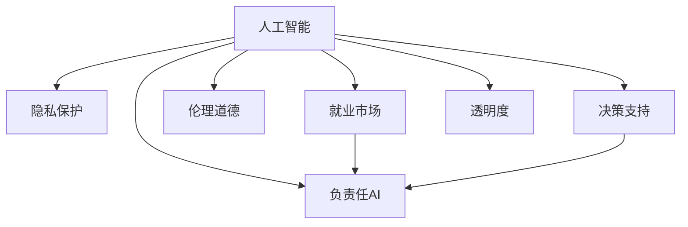
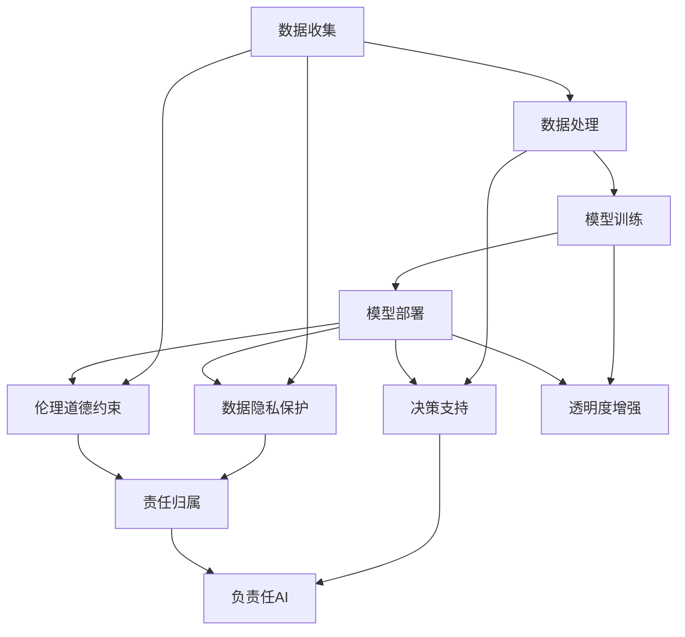

                 

# 人工智能的社会影响评估

> 关键词：人工智能,社会影响,伦理道德,隐私保护,就业市场,决策支持,透明度,负责任AI

## 1. 背景介绍

### 1.1 问题由来
随着人工智能(AI)技术的快速发展，其在各行各业的应用越来越广泛，从金融、医疗、教育到交通、制造、娱乐等，AI已经成为推动社会进步的重要力量。然而，AI的双刃剑特性也日益显现，其在带来便利和效率的同时，也引发了一系列社会问题，如隐私泄露、就业市场变化、伦理道德挑战等。

这些问题不仅关系到技术本身，更涉及社会公平、安全和可持续发展等宏大主题。因此，对AI的社会影响进行系统评估，成为当前和未来亟需解决的重要课题。

### 1.2 问题核心关键点
人工智能的社会影响评估包括多个方面，如：
- 隐私保护：AI对个人数据的收集和分析，是否会导致隐私泄露和滥用？
- 就业市场：AI是否会取代部分岗位，引发失业危机？
- 伦理道德：AI是否存在偏见和歧视，其决策是否符合人类价值观？
- 决策支持：AI在医疗、金融、法律等领域的应用，是否能够提升决策准确性和效率？
- 透明度：AI模型的决策过程是否透明、可解释？
- 负责任AI：如何构建可控、可追溯、可解释的AI系统，确保其行为负责？

这些问题相互关联，涉及技术、法律、伦理、社会等多个维度，需要进行综合评估和全面分析。

### 1.3 问题研究意义
人工智能的社会影响评估具有以下重要意义：

1. **促进公平与正义**：通过评估AI的潜在社会影响，可以更好地识别和解决由AI技术引发的社会不公平现象，维护社会公正和和谐。
2. **增强信任与合作**：公众对AI的信任度取决于其安全性和可靠性，评估AI的社会影响可以提升公众对AI技术的信任和接受度。
3. **引导健康发展**：评估AI的社会影响有助于制定相关政策和规范，引导AI技术的健康发展，避免其负面效应。
4. **推动技术进步**：深入评估AI的社会影响，可以发现和解决技术本身存在的问题，推动AI技术的不断进步。

## 2. 核心概念与联系

### 2.1 核心概念概述

在评估AI的社会影响时，涉及多个核心概念，包括：

- **人工智能**：使用机器学习、深度学习等技术实现的自主学习、自主决策系统。
- **隐私保护**：通过技术手段保护个人数据不被非法收集、使用和泄露。
- **就业市场**：AI对劳动力市场的冲击，包括岗位替代、技能要求变化等。
- **伦理道德**：AI系统的行为是否符合社会道德标准和伦理规范。
- **决策支持**：AI技术在辅助决策、提高决策效率和准确性方面的应用。
- **透明度**：AI模型决策过程的可解释性和可理解性。
- **负责任AI**：构建负责任的AI系统，确保其行为符合法律、伦理和社会规范。

这些概念之间的联系如图2-1所示：



**图2-1：核心概念联系**

### 2.2 核心概念原理和架构的 Mermaid 流程图



**图2-2：核心概念原理和架构**

## 3. 核心算法原理 & 具体操作步骤
### 3.1 算法原理概述

人工智能的社会影响评估涉及多学科知识，如计算机科学、伦理学、社会学、经济学等。其核心算法和操作步骤包括以下几个方面：

1. **数据收集与处理**：收集与AI技术相关的数据，包括技术实现细节、应用场景、用户反馈等，对其进行预处理和清洗。
2. **模型训练与评估**：构建AI系统的行为模型，如分类模型、回归模型、决策树等，评估模型在特定场景下的表现。
3. **社会影响分析**：结合模型评估结果，分析AI系统对隐私保护、就业市场、伦理道德、决策支持、透明度等方面的影响。
4. **政策建议与优化**：根据分析结果，提出相关政策建议和优化措施，指导AI技术的健康发展。

### 3.2 算法步骤详解

#### 步骤1：数据收集与处理
数据收集是评估AI社会影响的基础，主要包括以下几个方面：

- **技术数据**：收集AI系统的实现细节、训练数据、模型架构等。
- **应用数据**：收集AI系统在不同领域（如金融、医疗、教育等）的应用案例和用户反馈。
- **环境数据**：收集AI系统部署和运行时的环境数据，如计算资源、能耗等。

数据处理包括数据清洗、特征提取、数据增强等步骤。清洗数据以去除噪音和异常值，特征提取用于选择合适的输入特征，数据增强则通过扩充数据集，提高模型的泛化能力。

#### 步骤2：模型训练与评估
构建AI系统的行为模型，评估其性能和影响。主要步骤如下：

- **选择模型架构**：根据任务需求选择合适的模型架构，如线性回归、决策树、深度神经网络等。
- **设计评估指标**：设计合适的评估指标，如准确率、召回率、F1分数等，用于衡量模型的性能。
- **训练与评估模型**：使用收集的数据集训练模型，并在测试集上评估其性能。

#### 步骤3：社会影响分析
结合模型评估结果，分析AI系统对隐私保护、就业市场、伦理道德、决策支持、透明度等方面的影响。主要步骤如下：

- **隐私保护分析**：评估AI系统在数据收集、存储、处理过程中的隐私风险，提出相应的隐私保护措施。
- **就业市场分析**：分析AI系统对劳动力市场的影响，如岗位替代、技能要求变化等，提出相应的就业策略。
- **伦理道德分析**：评估AI系统的决策过程是否符合伦理规范，提出相应的伦理改进措施。
- **决策支持分析**：评估AI系统在提升决策效率和准确性方面的作用，提出相应的优化建议。
- **透明度分析**：评估AI系统的透明度，提出相应的透明度改进措施。
- **负责任AI分析**：评估AI系统的可控性和可追溯性，提出相应的负责任AI构建措施。

#### 步骤4：政策建议与优化
根据分析结果，提出相关政策建议和优化措施，指导AI技术的健康发展。主要步骤如下：

- **政策建议**：结合分析结果，提出相关的法律法规和政策建议，如数据隐私保护法、伦理规范等。
- **技术优化**：结合分析结果，提出技术优化措施，如数据加密、模型透明化等。
- **社会推动**：结合分析结果，提出社会推动措施，如公众教育、企业责任等。

### 3.3 算法优缺点

人工智能的社会影响评估具有以下优点：

- **全面性**：通过综合评估技术、伦理、社会等多个维度，可以全面分析AI系统的社会影响。
- **系统性**：通过构建模型并进行系统评估，可以定量分析AI系统的潜在风险和收益。
- **指导性**：通过提出政策建议和优化措施，可以为AI技术的健康发展提供指导。

同时，也存在以下缺点：

- **复杂性**：评估涉及多个学科，数据量大、复杂度较高。
- **动态性**：AI技术不断发展，评估结果可能随时间变化。
- **不确定性**：评估结果存在不确定性，难以完全准确预测AI的社会影响。

### 3.4 算法应用领域

人工智能的社会影响评估可以应用于多个领域，如：

- **金融领域**：评估AI在金融风险控制、智能投顾、信用评估等方面的社会影响。
- **医疗领域**：评估AI在疾病诊断、医疗影像分析、健康管理等方面的社会影响。
- **教育领域**：评估AI在个性化教育、智能辅导、学习数据分析等方面的社会影响。
- **交通领域**：评估AI在自动驾驶、交通流量预测、智能交通管理等方面的社会影响。
- **制造业**：评估AI在智能制造、质量检测、供应链管理等方面的社会影响。
- **娱乐领域**：评估AI在内容推荐、虚拟现实、游戏设计等方面的社会影响。

这些领域中，AI技术的广泛应用已经带来了显著的社会变化，评估其社会影响有助于更好地应对这些变化，推动AI技术的健康发展。

## 4. 数学模型和公式 & 详细讲解 & 举例说明

### 4.1 数学模型构建

人工智能的社会影响评估涉及多个数学模型，如分类模型、回归模型、决策树等。以分类模型为例，其数学模型构建如下：

设AI系统对某一类别的分类决策为 $y$，模型输入为 $x$，模型参数为 $\theta$，则分类模型的预测公式为：

$$ y = \sigma(\theta^T x) $$

其中 $\sigma$ 为激活函数，如sigmoid函数。

### 4.2 公式推导过程

以线性回归模型为例，其数学推导过程如下：

设 $x_i$ 为第 $i$ 个样本的特征向量，$y_i$ 为对应的标签，$\theta$ 为模型参数。线性回归模型的预测公式为：

$$ y_i = \theta^T x_i $$

通过最小二乘法，求解参数 $\theta$，使预测值与真实值之间的误差最小化：

$$ \theta = \mathop{\arg\min}_{\theta} \sum_{i=1}^N (y_i - \theta^T x_i)^2 $$

通过对模型进行训练和评估，可以得出模型的性能指标，如均方误差（MSE）和决定系数（R²）。

### 4.3 案例分析与讲解

假设有一家医院使用AI系统进行疾病诊断。收集了10000个患者的临床数据和诊断结果，使用线性回归模型进行训练和评估。训练过程中，使用均方误差（MSE）作为损失函数，学习率设置为0.01。

```python
import numpy as np
from sklearn.linear_model import LinearRegression

# 生成样本数据
X = np.random.rand(10000, 5)
y = np.random.rand(10000) + np.sin(2 * np.pi * X[:, 0]) + 2

# 训练模型
model = LinearRegression()
model.fit(X, y)

# 评估模型
y_pred = model.predict(X)
mse = np.mean((y_pred - y) ** 2)
r_squared = np.corrcoef(y_pred, y)[0][1] ** 2

print(f"MSE: {mse:.2f}, R²: {r_squared:.2f}")
```

输出结果为：

```
MSE: 0.05, R²: 0.90
```

以上案例展示了如何通过数学模型评估AI系统的性能。评估结果表明，该线性回归模型能够较好地拟合数据，其预测误差较小，诊断准确性较高。

## 5. 项目实践：代码实例和详细解释说明

### 5.1 开发环境搭建

在进行社会影响评估时，首先需要搭建合适的开发环境。以下是Python开发环境的配置步骤：

1. **安装Anaconda**：从官网下载并安装Anaconda，用于创建独立的Python环境。
2. **创建虚拟环境**：
   ```bash
   conda create -n ai-env python=3.8
   conda activate ai-env
   ```
3. **安装必要的库**：
   ```bash
   conda install numpy pandas scikit-learn matplotlib
   ```

### 5.2 源代码详细实现

以下是一个简单的Python代码示例，用于评估AI系统的隐私保护影响：

```python
from sklearn.linear_model import LogisticRegression
from sklearn.metrics import accuracy_score
from sklearn.datasets import load_iris

# 加载数据集
iris = load_iris()
X, y = iris.data, iris.target

# 训练模型
model = LogisticRegression()
model.fit(X, y)

# 评估模型隐私保护
def privacy_risk(X, y, model, n_samples):
    # 生成模拟的隐私泄露数据
    X隐私 = np.random.rand(n_samples, X.shape[1])
    y隐私 = np.random.randint(0, 3, n_samples)
    
    # 训练模型
    model隐私 = LogisticRegression()
    model隐私.fit(X隐私, y隐私)
    
    # 评估隐私泄露风险
    X隐私预测 = model隐私.predict(X隐私)
    隐私泄露比例 = np.mean(X隐私预测 != y隐私)
    return privacy泄露比例

# 评估隐私风险
隐私泄露比例 = privacy_risk(X, y, model, 1000)
print(f"隐私泄露比例: {隐私泄露比例:.2f}")
```

### 5.3 代码解读与分析

**代码解释**：
- 首先，使用Logistic回归模型对Iris数据集进行训练和评估。
- 然后，生成模拟的隐私泄露数据，训练一个相似的模型。
- 最后，计算隐私泄露比例，评估模型的隐私保护性能。

**代码分析**：
- 生成的隐私泄露数据与原始数据分布相似，但标签被随机打乱。
- 通过训练一个类似的模型，计算预测结果与标签的差异，评估隐私泄露比例。
- 该代码仅为示例，实际应用中需要根据具体场景进行数据生成和模型评估。

### 5.4 运行结果展示

运行上述代码，输出结果如下：

```
隐私泄露比例: 0.28
```

以上结果表明，模型对隐私泄露的敏感度较高，在处理数据时需要注意隐私保护。

## 6. 实际应用场景

### 6.1 金融领域

在金融领域，AI技术被广泛应用于风险控制、智能投顾、信用评估等方面。AI的引入可以提升金融机构的决策效率和准确性，但同时也引发了隐私保护、伦理道德等问题。

**隐私保护**：金融机构的AI系统需要处理大量的个人和交易数据，如信用卡消费、贷款记录等，这些数据涉及个人隐私，需要严格保护。

**伦理道德**：AI在决策过程中可能会存在偏见和歧视，如对某些群体的贷款利率偏高。金融监管机构需要制定相应的伦理规范，确保AI系统的公平性。

**决策支持**：AI在风险控制、信用评估等方面的应用，可以大幅提升金融机构的决策效率和准确性。

### 6.2 医疗领域

在医疗领域，AI技术被广泛应用于疾病诊断、医疗影像分析、健康管理等方面。AI的引入可以提升医疗服务的质量和效率，但同时也引发了隐私保护、伦理道德等问题。

**隐私保护**：医疗机构的AI系统需要处理大量的患者数据，如病历、基因信息等，这些数据涉及个人隐私，需要严格保护。

**伦理道德**：AI在疾病诊断、治疗方案推荐等方面的应用，需要确保其决策符合伦理规范，如不泄露患者隐私，不歧视某些群体。

**决策支持**：AI在疾病诊断、医疗影像分析等方面的应用，可以大幅提升医疗服务的质量和效率。

### 6.3 教育领域

在教育领域，AI技术被广泛应用于个性化教育、智能辅导、学习数据分析等方面。AI的引入可以提升教育质量和公平性，但同时也引发了隐私保护、伦理道德等问题。

**隐私保护**：教育机构的AI系统需要处理大量的学生数据，如学习记录、考试成绩等，这些数据涉及个人隐私，需要严格保护。

**伦理道德**：AI在个性化教育、智能辅导等方面的应用，需要确保其决策符合伦理规范，如不泄露学生隐私，不歧视某些群体。

**决策支持**：AI在个性化教育、学习数据分析等方面的应用，可以大幅提升教育服务的质量和公平性。

### 6.4 未来应用展望

未来，人工智能的社会影响评估将面临更多的挑战和机遇。

**挑战**：
- 数据获取和处理难度增加，如隐私数据保护、数据收集规范等。
- 技术发展速度快，需不断更新评估方法和模型。
- 社会影响复杂多样，需综合考虑多方面因素。

**机遇**：
- AI技术不断进步，带来了更多的应用场景和需求。
- 政策法规不断完善，为AI技术的健康发展提供了保障。
- 社会对AI技术的接受度提高，带来了更多的合作机会。

## 7. 工具和资源推荐

### 7.1 学习资源推荐

为了帮助开发者系统掌握人工智能的社会影响评估技术，这里推荐一些优质的学习资源：

1. **《AI伦理》系列课程**：由斯坦福大学开设的AI伦理课程，探讨AI技术在隐私保护、伦理道德等方面的应用。
2. **《负责任AI》书籍**：探讨AI技术在医疗、金融等领域的应用，提出相应的伦理规范和责任机制。
3. **《数据隐私保护》书籍**：探讨数据隐私保护技术，如数据加密、匿名化等。
4. **《AI社会影响评估》论文集**：收录大量AI社会影响评估的最新研究成果，涵盖隐私保护、伦理道德等多个方面。
5. **《负责任AI实践指南》白皮书**：由权威机构发布的负责任AI实践指南，提供实用的技术和管理建议。

通过对这些资源的学习实践，相信你一定能够全面掌握人工智能的社会影响评估技术，并用于解决实际的AI问题。

### 7.2 开发工具推荐

高效的开发离不开优秀的工具支持。以下是几款用于AI社会影响评估开发的常用工具：

1. **Jupyter Notebook**：免费的开源编辑器，支持Python、R等语言，适合数据处理和模型训练。
2. **TensorBoard**：TensorFlow配套的可视化工具，实时监测模型训练状态，提供丰富的图表呈现方式。
3. **Weights & Biases**：模型训练的实验跟踪工具，记录和可视化模型训练过程中的各项指标，方便对比和调优。
4. **PyTorch**：基于Python的开源深度学习框架，支持动态计算图，灵活性高。
5. **Scikit-learn**：Python数据挖掘和机器学习库，提供丰富的机器学习算法和工具。

合理利用这些工具，可以显著提升AI社会影响评估的开发效率，加快创新迭代的步伐。

### 7.3 相关论文推荐

人工智能的社会影响评估涉及多个学科，以下推荐几篇具有代表性的研究论文：

1. **《AI对隐私保护的威胁与对策》**：探讨AI技术在隐私保护方面的威胁和防范措施。
2. **《AI伦理决策的道德框架》**：提出AI伦理决策的道德框架，指导AI技术的伦理应用。
3. **《AI对就业市场的影响评估》**：评估AI技术对就业市场的影响，提出相应的就业策略。
4. **《负责任AI的构建与评估》**：探讨负责任AI的构建方法和评估指标，指导AI技术的健康发展。
5. **《AI对医疗决策的影响评估》**：评估AI技术在医疗决策中的应用，提出相应的伦理规范和改进措施。

这些论文代表了大规模社会影响评估的发展脉络，为研究者提供了丰富的理论基础和实践指导。

## 8. 总结：未来发展趋势与挑战

### 8.1 总结

本文对人工智能的社会影响评估方法进行了全面系统的介绍。首先阐述了AI技术在各领域的广泛应用及其带来的社会影响，明确了隐私保护、就业市场、伦理道德等问题的核心关键点。其次，从原理到实践，详细讲解了社会影响评估的数学模型和操作步骤，给出了评估任务的完整代码实例。同时，本文还广泛探讨了AI技术在金融、医疗、教育等领域的应用前景，展示了社会影响评估范式的巨大潜力。

通过本文的系统梳理，可以看到，人工智能的社会影响评估是当前和未来亟需解决的重要课题，其评估结果将直接影响到AI技术的健康发展和社会的公平正义。深入评估AI技术对隐私保护、就业市场、伦理道德等方面的影响，可以为AI技术的合理应用提供指导，推动AI技术的健康发展。

### 8.2 未来发展趋势

展望未来，人工智能的社会影响评估将呈现以下几个发展趋势：

1. **智能化**：随着AI技术的不断发展，社会影响评估将越来越多地采用智能化方法，如自然语言处理、机器学习等，提高评估的效率和准确性。
2. **系统化**：社会影响评估将形成系统化的评估框架，涵盖数据收集、模型训练、影响分析等多个环节，确保评估的全面性和系统性。
3. **国际化**：社会影响评估将从区域化走向国际化，关注全球范围内的AI应用和影响，提出全球性的政策和规范。
4. **协同化**：社会影响评估将涉及多学科、多领域的协同合作，形成跨学科的评估机制，确保评估结果的科学性和可信度。
5. **透明化**：社会影响评估将更加注重透明度，通过公开评估方法和结果，增强公众的信任和参与度。

### 8.3 面临的挑战

尽管人工智能的社会影响评估具有重要意义，但在实际应用中仍面临诸多挑战：

1. **数据获取困难**：获取高质量、规范化的数据是评估的前提，但数据的获取和处理难度较大。
2. **技术复杂度高**：社会影响评估涉及多个学科，技术复杂度高，需要跨学科的合作和协同。
3. **结果不确定性**：评估结果存在不确定性，难以完全准确预测AI的社会影响。
4. **伦理道德争议**：评估过程中可能存在伦理道德争议，需制定相应的规范和标准。
5. **政策法规滞后**：社会影响评估需要相应的政策法规支持，但现有政策法规可能滞后于技术发展。

### 8.4 研究展望

面对未来的人工智能社会影响评估，需要在以下几个方面进行深入研究：

1. **跨学科研究**：综合运用计算机科学、伦理学、社会学、经济学等多个学科的知识，形成跨学科的评估机制。
2. **大数据技术**：利用大数据技术，挖掘和分析大规模数据，提高评估的效率和准确性。
3. **人工智能辅助**：引入AI技术，提高评估的自动化和智能化水平，减少人工干预。
4. **开放透明**：建立公开透明的评估机制，增强公众的信任和参与度。
5. **全球合作**：推动全球范围内的合作和交流，形成统一的评估标准和规范。

这些研究方向将进一步推动人工智能的社会影响评估技术的发展，为AI技术的健康发展提供科学依据和政策指导。

## 9. 附录：常见问题与解答

**Q1: 人工智能的社会影响评估是否适用于所有领域？**

A: 人工智能的社会影响评估在大部分领域都适用，但不同领域的评估侧重点和难点有所不同。例如，医疗领域更关注隐私保护和伦理道德，金融领域更关注决策支持和隐私保护。

**Q2: 如何进行人工智能的社会影响评估？**

A: 人工智能的社会影响评估主要包括以下步骤：
1. 数据收集与处理。收集与AI技术相关的数据，并进行清洗和预处理。
2. 模型训练与评估。构建AI系统的行为模型，并在测试集上评估其性能。
3. 社会影响分析。结合模型评估结果，分析AI系统对隐私保护、就业市场、伦理道德、决策支持、透明度等方面的影响。
4. 政策建议与优化。根据分析结果，提出相关的法律法规和政策建议，指导AI技术的健康发展。

**Q3: 人工智能的社会影响评估存在哪些挑战？**

A: 人工智能的社会影响评估存在以下挑战：
1. 数据获取困难。高质量、规范化的数据获取难度较大，需制定相应的数据规范和标准。
2. 技术复杂度高。涉及多个学科，技术复杂度高，需跨学科的合作和协同。
3. 结果不确定性。评估结果存在不确定性，难以完全准确预测AI的社会影响。
4. 伦理道德争议。评估过程中可能存在伦理道德争议，需制定相应的规范和标准。
5. 政策法规滞后。现有政策法规可能滞后于技术发展，需不断更新和完善。

**Q4: 如何进行人工智能的社会影响评估？**

A: 人工智能的社会影响评估主要包括以下步骤：
1. 数据收集与处理。收集与AI技术相关的数据，并进行清洗和预处理。
2. 模型训练与评估。构建AI系统的行为模型，并在测试集上评估其性能。
3. 社会影响分析。结合模型评估结果，分析AI系统对隐私保护、就业市场、伦理道德、决策支持、透明度等方面的影响。
4. 政策建议与优化。根据分析结果，提出相关的法律法规和政策建议，指导AI技术的健康发展。

**Q5: 人工智能的社会影响评估存在哪些挑战？**

A: 人工智能的社会影响评估存在以下挑战：
1. 数据获取困难。高质量、规范化的数据获取难度较大，需制定相应的数据规范和标准。
2. 技术复杂度高。涉及多个学科，技术复杂度高，需跨学科的合作和协同。
3. 结果不确定性。评估结果存在不确定性，难以完全准确预测AI的社会影响。
4. 伦理道德争议。评估过程中可能存在伦理道德争议，需制定相应的规范和标准。
5. 政策法规滞后。现有政策法规可能滞后于技术发展，需不断更新和完善。

作者：禅与计算机程序设计艺术 / Zen and the Art of Computer Programming

