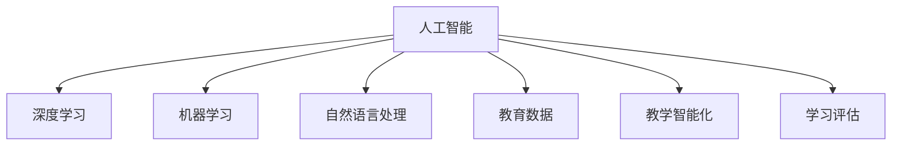

                 

# 人工智能：教育变革的催化剂

> 关键词：人工智能,教育,变革,教学个性化,学习评估,智慧校园,自动评估,机器学习,大数据分析,深度学习,智能教育

## 1. 背景介绍

### 1.1 问题由来
随着科技的迅猛发展和全球化的进程，教育领域的变革已成为全球关注的焦点。传统的教学模式、评价体系和资源配置正面临前所未有的挑战。人工智能(AI)技术的飞速发展，尤其是深度学习、自然语言处理和大数据分析等技术，为教育改革提供了新的机遇。

人工智能在教育领域的应用，不仅能够帮助教师更好地理解学生的学习行为和心理特征，还能够提供个性化的学习资源和评估反馈，实现教学智能化和教育公平化。从K12教育到高等教育，从基础学科教育到职业教育和终身教育，AI正在以各种方式改变着教育的形态，推动着教育模式的创新。

### 1.2 问题核心关键点
人工智能在教育领域的应用，核心在于利用先进的数据分析技术和机器学习算法，对教育过程进行优化和提升。关键点包括：
1. 教学个性化：利用AI分析学生学习数据，提供个性化的学习路径和资源。
2. 学习评估：通过智能评估系统，实现自动化的考试和测验。
3. 教学辅助：AI工具辅助教师进行课堂管理、作业批改和内容生成。
4. 教育数据驱动：以大数据为依托，对教育数据进行深入分析，指导教育决策。

人工智能在教育中的应用，旨在实现以下目标：
1. 提高教育质量和效率：通过智能化手段，使教学过程更加高效和精准。
2. 推动教育公平：让每一个学生都能获得适合自己的学习资源和评估。
3. 激发学生潜力：通过个性化学习，鼓励学生主动探索和创新。
4. 培养综合素质：结合AI技术，培养学生的计算思维、批判性思维和问题解决能力。

### 1.3 问题研究意义
人工智能在教育领域的应用，具有重要的研究意义：
1. 促进教育资源的均衡配置：通过AI技术，实现优质教育资源的普惠化，缩小城乡、地区教育差距。
2. 提升教育质量：AI辅助教学，能够提高教学水平和学生成绩，使教育成果更可预测。
3. 推动教育创新：AI技术在教育中的应用，可以探索新的教学模式和学习方式，激发教育创新活力。
4. 适应未来发展：面对信息时代的挑战，AI技术能够帮助教育系统适应技术变革，培养适应未来社会的人才。

## 2. 核心概念与联系

### 2.1 核心概念概述

为更好地理解人工智能在教育中的应用，本节将介绍几个关键概念：

- 人工智能(AI)：指利用计算机模拟人类智能，包括感知、推理、学习等能力的技术领域。
- 深度学习(Deep Learning)：一种基于神经网络的机器学习方法，通过多层次的非线性映射，实现对复杂数据的深度表示。
- 机器学习(Machine Learning)：指通过数据和算法，让机器从经验中学习改进任务执行的技术。
- 自然语言处理(NLP)：研究如何让计算机理解、处理和生成自然语言的技术。
- 教育数据(Educational Data)：包括学生学习行为、教师教学行为、学校运营数据等，是AI教育应用的基础。
- 教学智能化(Intelligent Teaching)：通过AI技术，提升教学过程的智能化水平，如自动批改作业、个性化推荐资源等。
- 学习评估(Education Assessment)：利用AI技术，实现自动化、个性化的学习评估，如智能考试、自动测验等。

这些概念之间的逻辑关系可以通过以下Mermaid流程图来展示：



这个流程图展示了一系列与AI教育应用相关的核心概念及其相互联系：

1. 人工智能是大数据、深度学习、机器学习和自然语言处理等技术的综合体，为教育领域提供了技术支持。
2. 深度学习通过多层次的非线性映射，实现对复杂数据的深度表示和处理。
3. 机器学习通过数据驱动的方式，使机器具备学习和改进的能力。
4. 自然语言处理使得计算机能够理解和生成自然语言，实现人机交互。
5. 教育数据为AI教育应用提供了数据基础，包括学生学习行为、教师教学行为、学校运营数据等。
6. 教学智能化利用AI技术，提升教学过程的自动化和个性化水平。
7. 学习评估利用AI技术，实现自动化、个性化的学习评估。

这些概念共同构成了AI在教育领域的应用框架，为教育变革提供了技术支持。

## 3. 核心算法原理 & 具体操作步骤
### 3.1 算法原理概述

人工智能在教育领域的应用，主要基于以下几个核心算法原理：

1. 深度学习：通过多层神经网络，学习并提取教育数据的复杂特征，实现对教育过程的深度表示和理解。
2. 机器学习：利用大量的教育数据，训练模型以预测学生行为和成绩，优化教学策略和资源配置。
3. 自然语言处理：通过理解自然语言，实现人机交互，提供个性化的学习支持和反馈。
4. 大数据分析：通过分析教育数据，发现教育模式和趋势，指导教育决策和优化教育资源。

这些算法原理共同构成了AI教育应用的基石，使教育过程更加智能化和个性化。

### 3.2 算法步骤详解

人工智能在教育领域的应用，一般包括以下几个关键步骤：

**Step 1: 数据采集与处理**
- 采集学生学习行为数据、教师教学行为数据、学校运营数据等，作为教育数据分析的基础。
- 对采集到的数据进行清洗和预处理，如去噪、归一化、特征提取等。

**Step 2: 模型训练与优化**
- 选择适合的深度学习模型（如RNN、CNN、Transformer等），利用教育数据进行模型训练。
- 在模型训练过程中，通过调整超参数和优化算法（如Adam、SGD等），优化模型性能。
- 采用正则化技术（如L2正则、Dropout等），防止过拟合，提高模型泛化能力。

**Step 3: 应用部署与测试**
- 将训练好的模型部署到教育系统平台（如智能教学平台、在线评估系统等）。
- 在实际教育场景中测试模型性能，收集反馈，不断优化模型。

**Step 4: 教学支持与评估**
- 利用AI技术，提供个性化的学习支持（如推荐学习资源、自动批改作业等）。
- 实现自动化的学习评估（如智能考试、自动测验等），提供实时反馈和成绩分析。

**Step 5: 教育决策支持**
- 基于教育数据分析，生成教育决策报告，辅助学校和教育机构进行资源配置和决策。

### 3.3 算法优缺点

人工智能在教育领域的应用，具有以下优点：
1. 个性化学习：通过分析学生数据，提供个性化的学习资源和路径，提升学习效果。
2. 自动化评估：利用智能评估系统，实现自动化的考试和测验，减少教师负担。
3. 实时反馈：通过AI技术，提供实时反馈和评估，帮助学生及时调整学习策略。
4. 决策支持：基于教育数据分析，生成教育决策报告，辅助学校进行资源配置和决策。

同时，这些算法也存在一些局限性：
1. 数据隐私：大量教育数据的采集和处理，涉及学生隐私保护，需要严格的数据安全措施。
2. 模型泛化：教育数据的多样性和复杂性，使得AI模型的泛化能力受到挑战。
3. 教师角色变化：AI技术的应用，可能改变教师的角色，要求教师具备更高的技术素养。
4. 公平性问题：AI教育技术的应用，可能会加剧教育不平等，需要关注公平性问题。

### 3.4 算法应用领域

人工智能在教育领域的应用，已经覆盖了从K12教育到高等教育的多个层面，包括但不限于以下几个领域：

1. **智能教学平台**：通过AI技术，提供个性化的学习资源和评估反馈，提升教学效果。
2. **智能评估系统**：利用AI技术，实现自动化的考试和测验，减少教师负担，提升评估效率。
3. **智能课堂辅助**：AI工具辅助教师进行课堂管理、作业批改和内容生成，提高教学效率。
4. **学习数据分析**：通过大数据分析，发现学生的学习行为和心理特征，指导个性化教学。
5. **虚拟学习助手**：AI驱动的虚拟助手，提供24小时学习支持，帮助学生自主学习。
6. **职业教育和继续教育**：利用AI技术，提供职业技能培训和继续教育，满足终身学习需求。

## 4. 数学模型和公式 & 详细讲解  
### 4.1 数学模型构建

为了更好地理解人工智能在教育中的应用，本节将使用数学语言对AI教育应用的基本模型进行详细阐述。

记学生学习行为数据为 $D=\{(x_i,y_i)\}_{i=1}^N$，其中 $x_i$ 为学习行为特征向量， $y_i$ 为成绩标签。假设选择线性回归模型 $f(x_i;w)=w^Tx_i+b$ 进行模型训练。其中 $w$ 为模型参数， $b$ 为偏置项。

模型的损失函数为均方误差损失函数 $L(D)=\frac{1}{N}\sum_{i=1}^N(y_i-f(x_i;w))^2$。

利用梯度下降法进行模型训练，求解最优参数 $w$：

$$
w_{opt} = \mathop{\arg\min}_{w}L(D)
$$

优化目标函数为：

$$
\min_{w} \frac{1}{2N}\sum_{i=1}^N(y_i-f(x_i;w))^2+\lambda\|w\|_2^2
$$

其中 $\lambda$ 为正则化系数，防止过拟合。

### 4.2 公式推导过程

以下我们以线性回归模型为例，推导均方误差损失函数的梯度计算公式。

模型预测值 $f(x_i;w)=w^Tx_i+b$，损失函数 $L(D)=\frac{1}{N}\sum_{i=1}^N(y_i-f(x_i;w))^2$。

对 $L(D)$ 对 $w$ 求偏导，得：

$$
\frac{\partial L(D)}{\partial w} = -\frac{2}{N}\sum_{i=1}^N(y_i-f(x_i;w))x_i
$$

利用梯度下降法，更新模型参数 $w$ 的迭代公式为：

$$
w \leftarrow w - \eta\nabla_{w}L(D)
$$

其中 $\eta$ 为学习率。

通过上述公式，可以逐步优化模型参数，最小化损失函数 $L(D)$，实现对教育数据的深度表示和理解。

## 5. 项目实践：代码实例和详细解释说明
### 5.1 开发环境搭建

在进行AI教育应用开发前，我们需要准备好开发环境。以下是使用Python进行TensorFlow开发的环境配置流程：

1. 安装Anaconda：从官网下载并安装Anaconda，用于创建独立的Python环境。

2. 创建并激活虚拟环境：
```bash
conda create -n ai-env python=3.8 
conda activate ai-env
```

3. 安装TensorFlow：根据CUDA版本，从官网获取对应的安装命令。例如：
```bash
conda install tensorflow-gpu -c conda-forge
```

4. 安装相关工具包：
```bash
pip install numpy pandas scikit-learn matplotlib tensorflow_addons scikit-optimize
```

5. 安装TensorBoard：
```bash
pip install tensorboard
```

完成上述步骤后，即可在`ai-env`环境中开始AI教育应用的开发。

### 5.2 源代码详细实现

下面我们以智能评估系统为例，给出使用TensorFlow对线性回归模型进行训练的PyTorch代码实现。

首先，定义线性回归模型：

```python
import tensorflow as tf

class LinearRegression(tf.keras.Model):
    def __init__(self, input_dim):
        super(LinearRegression, self).__init__()
        self.linear = tf.keras.layers.Dense(1)
    
    def call(self, inputs):
        return self.linear(inputs)
```

然后，定义数据生成器和数据集：

```python
import numpy as np
from sklearn.datasets import make_regression
from sklearn.model_selection import train_test_split
from sklearn.preprocessing import StandardScaler

def generate_data(n_samples=1000, noise_std=0.1):
    X, y = make_regression(n_samples=n_samples, n_features=5, noise=0.1, random_state=42)
    X = StandardScaler().fit_transform(X)
    return X, y

X, y = generate_data()
X_train, X_test, y_train, y_test = train_test_split(X, y, test_size=0.2, random_state=42)
```

接着，定义数据预处理函数：

```python
def preprocess_data(X, y, batch_size=32):
    train_dataset = tf.data.Dataset.from_tensor_slices((X_train, y_train))
    train_dataset = train_dataset.batch(batch_size).shuffle(1000).map(lambda x, y: (tf.cast(x, tf.float32), tf.cast(y, tf.float32)))
    
    test_dataset = tf.data.Dataset.from_tensor_slices((X_test, y_test))
    test_dataset = test_dataset.batch(batch_size).map(lambda x, y: (tf.cast(x, tf.float32), tf.cast(y, tf.float32)))
    
    return train_dataset, test_dataset
```

然后，定义模型训练函数：

```python
def train_model(model, train_dataset, test_dataset, epochs=10, learning_rate=0.01):
    model.compile(optimizer=tf.keras.optimizers.Adam(learning_rate=learning_rate), loss='mse')
    
    history = model.fit(train_dataset, epochs=epochs, validation_data=test_dataset)
    
    return history
```

最后，启动模型训练：

```python
model = LinearRegression(input_dim=5)
train_dataset, test_dataset = preprocess_data(X, y)

history = train_model(model, train_dataset, test_dataset)
```

以上就是使用TensorFlow进行线性回归模型训练的完整代码实现。可以看到，TensorFlow提供了强大的API和工具，使得模型训练和评估过程非常简洁高效。

### 5.3 代码解读与分析

让我们再详细解读一下关键代码的实现细节：

**LinearRegression类**：
- `__init__`方法：初始化模型参数。
- `call`方法：定义模型前向传播过程。

**generate_data函数**：
- 使用sklearn的make_regression函数生成模拟数据，包含5个特征和1个目标变量。
- 使用StandardScaler对特征进行标准化处理。

**preprocess_data函数**：
- 将训练集和测试集转换为TensorFlow的Dataset对象，便于数据流水线处理。
- 对数据进行批次处理和随机打乱，同时对特征和标签进行类型转换和标准化。

**train_model函数**：
- 定义模型优化器、损失函数和评估指标。
- 使用fit方法进行模型训练，同时监控验证集性能。

**模型训练**：
- 创建线性回归模型，定义输入维度。
- 生成训练集和测试集，并进行预处理。
- 调用train_model函数进行模型训练，监控训练过程和结果。

通过以上步骤，可以顺利实现一个简单的线性回归模型训练过程。在实际应用中，需要根据具体任务的需求，进一步优化模型结构、调整超参数等，才能达到理想的性能。

## 6. 实际应用场景
### 6.1 智能教学平台

智能教学平台利用AI技术，提供个性化的学习资源和评估反馈，提升教学效果。具体实现包括：

1. **推荐系统**：通过分析学生的学习行为数据，推荐最适合的学习资源，包括视频、文章、练习题等。
2. **智能评估**：利用AI技术，自动批改作业和测验，提供实时反馈和成绩分析。
3. **学习路径规划**：根据学生的学习进度和能力，动态调整学习路径，提供个性化学习计划。
4. **学习行为分析**：通过分析学生的学习数据，发现学习过程中的问题和瓶颈，提供针对性的辅导和建议。

智能教学平台的应用，能够显著提高学生的学习效率和兴趣，帮助教师更好地进行教学管理和资源配置。

### 6.2 智能评估系统

智能评估系统利用AI技术，实现自动化的考试和测验，减少教师负担，提升评估效率。具体实现包括：

1. **自动阅卷**：通过OCR技术自动识别答题卷，并利用NLP技术进行智能批改，给出评分和反馈。
2. **自动组卷**：根据课程要求和难度等级，自动生成符合要求的试卷，包括单选、多选、填空、简答等题型。
3. **自动评分**：利用AI技术，自动评分并分析学生答题情况，生成详细的评估报告。
4. **智能监考**：通过人脸识别和行为分析技术，实时监控考场情况，防止作弊行为。

智能评估系统的应用，能够减轻教师的工作负担，提高评估的准确性和公平性，提升教学效果。

### 6.3 智能课堂辅助

智能课堂辅助利用AI技术，提升课堂管理效率和教学质量。具体实现包括：

1. **智能班规管理**：通过数据分析，生成班规评估报告，帮助教师进行班级管理。
2. **作业自动批改**：利用AI技术，自动批改作业并生成反馈，帮助教师快速完成任务。
3. **课堂互动**：通过自然语言处理技术，自动回答学生问题，提升课堂互动效果。
4. **内容生成**：利用AI技术，生成教学课件和练习题，丰富课堂教学内容。

智能课堂辅助的应用，能够提升课堂教学效率和质量，帮助教师更好地进行教学管理和资源配置。

### 6.4 未来应用展望

随着AI技术的不断进步，未来的教育应用将更加智能化和个性化。主要趋势包括：

1. **多模态教育**：结合图像、语音、视频等多模态数据，提供更加丰富和全面的教育体验。
2. **虚拟现实教育**：利用VR/AR技术，构建虚拟课堂和实验室，提升学习体验和效果。
3. **自动化教学**：通过AI技术，自动设计教学方案和评估标准，实现教育过程的全面自动化。
4. **智慧校园建设**：利用AI技术，构建智慧校园，提供校园管理的智能化和个性化服务。
5. **终身教育系统**：利用AI技术，构建终身教育平台，提供持续学习和职业培训服务。

未来，AI技术在教育领域的应用将更加广泛和深入，为教育模式的创新和升级提供新的思路和方法。

## 7. 工具和资源推荐
### 7.1 学习资源推荐

为了帮助开发者系统掌握AI教育应用的理论基础和实践技巧，这里推荐一些优质的学习资源：

1. 《深度学习与教育应用》系列书籍：详细介绍了深度学习在教育中的应用，包括推荐系统、智能评估等。
2. 《机器学习与教育》课程：斯坦福大学开设的课程，涵盖机器学习在教育中的基本理论和实践方法。
3. 《人工智能与教育》书籍：介绍AI技术在教育中的应用，包括智能教学、学习评估等。
4. 《教育数据分析》课程：涵盖教育数据分析的基本概念和方法，帮助开发者理解和应用教育数据。
5. 《自然语言处理与教育》课程：介绍自然语言处理技术在教育中的应用，包括智能评估、个性化学习等。

通过对这些资源的学习实践，相信你一定能够快速掌握AI教育应用的精髓，并用于解决实际的教育问题。
### 7.2 开发工具推荐

高效的开发离不开优秀的工具支持。以下是几款用于AI教育应用开发的常用工具：

1. PyTorch：基于Python的开源深度学习框架，支持多种深度学习模型，适合研究型应用开发。
2. TensorFlow：由Google主导开发的开源深度学习框架，生产部署方便，适合大规模工程应用。
3. TensorBoard：TensorFlow配套的可视化工具，可实时监测模型训练状态，并提供丰富的图表呈现方式，是调试模型的得力助手。
4. Weights & Biases：模型训练的实验跟踪工具，可以记录和可视化模型训练过程中的各项指标，方便对比和调优。
5. Jupyter Notebook：交互式的编程环境，支持代码和文本的混合编写，适合探索性研究和实验。

合理利用这些工具，可以显著提升AI教育应用开发的效率和质量。

### 7.3 相关论文推荐

AI在教育领域的应用，源于学界的持续研究。以下是几篇奠基性的相关论文，推荐阅读：

1. Deep Learning with Self-Attention for Educational Data Mining（教育数据挖掘中的注意力深度学习）：利用注意力机制对教育数据进行深度表示和理解，提升教学效果。
2. A Survey on Machine Learning Approaches to Education（机器学习在教育中的应用综述）：综述了机器学习在教育中的基本概念和方法，为教育数据分析提供了理论基础。
3. Adaptive Learning with Artificial Intelligence（人工智能辅助的个性化学习）：利用AI技术，实现个性化学习路径和资源推荐，提升学习效果。
4. Natural Language Processing in Education（教育领域中的自然语言处理）：介绍NLP技术在教育中的应用，包括智能评估、课堂互动等。
5. Smart Education System Based on AI（基于AI的智能教育系统）：利用AI技术，构建智慧校园和智能教学平台，提升教育系统的智能化和个性化水平。

这些论文代表了大数据、深度学习、机器学习和自然语言处理等技术在教育中的应用方向，对未来教育技术的发展具有重要的指导意义。

## 8. 总结：未来发展趋势与挑战

### 8.1 总结

本文对人工智能在教育领域的应用进行了全面系统的介绍。首先阐述了AI教育应用的理论基础和应用意义，明确了AI技术在提升教育质量和效率方面的独特价值。其次，从原理到实践，详细讲解了AI教育应用的数学模型和关键步骤，给出了AI教育应用的完整代码实现。同时，本文还广泛探讨了AI教育应用在智能教学平台、智能评估系统、智能课堂辅助等多个行业领域的应用前景，展示了AI技术在教育领域的应用潜力。此外，本文精选了AI教育应用的学习资源、开发工具和相关论文，力求为开发者提供全方位的技术指引。

通过本文的系统梳理，可以看到，人工智能在教育领域的应用，已经从概念走向实践，初步展示了其在提升教育质量和效率方面的巨大潜力。未来，伴随AI技术的不断进步，教育模式的创新和优化，AI技术必将在教育领域发挥更大的作用，推动教育变革的深入发展。

### 8.2 未来发展趋势

展望未来，AI教育应用将呈现以下几个发展趋势：

1. **多模态教育**：结合图像、语音、视频等多模态数据，提供更加丰富和全面的教育体验。
2. **虚拟现实教育**：利用VR/AR技术，构建虚拟课堂和实验室，提升学习体验和效果。
3. **自动化教学**：通过AI技术，自动设计教学方案和评估标准，实现教育过程的全面自动化。
4. **智慧校园建设**：利用AI技术，构建智慧校园，提供校园管理的智能化和个性化服务。
5. **终身教育系统**：利用AI技术，构建终身教育平台，提供持续学习和职业培训服务。

这些趋势凸显了AI教育应用的广阔前景。这些方向的探索发展，必将进一步提升教育系统的智能化和个性化水平，为教育模式的创新和优化提供新的思路和方法。

### 8.3 面临的挑战

尽管AI教育应用已经取得了显著的进展，但在迈向更加智能化、普适化应用的过程中，它仍面临着诸多挑战：

1. **数据隐私**：大量教育数据的采集和处理，涉及学生隐私保护，需要严格的数据安全措施。
2. **模型泛化**：教育数据的多样性和复杂性，使得AI模型的泛化能力受到挑战。
3. **教师角色变化**：AI技术的应用，可能改变教师的角色，要求教师具备更高的技术素养。
4. **公平性问题**：AI教育技术的应用，可能会加剧教育不平等，需要关注公平性问题。
5. **资源不足**：部分学校和地区可能面临AI教育应用的硬件和软件资源不足的问题，需要政府和社会的支持。
6. **技术与教育融合**：AI技术需要与教育理念和教学方法深度融合，才能真正发挥作用。

这些挑战需要社会各界共同努力，通过技术创新、政策引导和社会支持，才能逐步克服。

### 8.4 研究展望

面对AI教育应用所面临的挑战，未来的研究需要在以下几个方面寻求新的突破：

1. **数据隐私保护**：开发更加高效、安全的隐私保护技术，保护学生数据隐私。
2. **模型泛化能力**：研究更加鲁棒的模型泛化方法，提高AI模型在不同教育场景下的适应性。
3. **教师技术素养**：提升教师的技术素养，使AI技术在教育中得到更好的应用和推广。
4. **教育公平性**：通过技术手段，缩小教育资源的不平等差距，推动教育公平。
5. **多模态数据融合**：研究多模态数据融合技术，提升教育数据的深度表示和理解。
6. **教育资源优化**：通过AI技术，优化教育资源的配置和管理，提升教育系统的效率和公平性。

这些研究方向的探索，必将引领AI教育应用的未来发展，推动教育模式的创新和优化。相信随着AI技术的不断进步和教育理念的不断深化，AI教育应用将在教育变革中扮演越来越重要的角色。

## 9. 附录：常见问题与解答

**Q1：如何选择合适的AI教育应用方案？**

A: 选择合适的AI教育应用方案，需要综合考虑以下几个因素：
1. **应用场景**：根据具体教育场景和需求，选择合适的AI应用方案。
2. **技术成熟度**：选择技术成熟、可靠性高的方案，避免因技术问题影响教学效果。
3. **数据隐私**：考虑数据隐私和安全问题，选择具有良好数据保护措施的方案。
4. **可扩展性**：选择具有良好可扩展性的方案，能够应对未来数据和用户增长的需求。
5. **用户友好性**：选择用户友好、易于操作的方案，提升教师和学生的接受度。

**Q2：AI教育应用对学生隐私的影响有哪些？**

A: AI教育应用在提高教学效果的同时，也可能对学生隐私产生影响。主要体现在以下几个方面：
1. **数据采集**：大量教育数据的采集和使用，涉及学生隐私保护问题。
2. **数据存储**：学生数据存储在服务器上，可能面临数据泄露的风险。
3. **数据使用**：学生数据用于个性化推荐、智能评估等，可能被用于商业分析或其他用途。

为保护学生隐私，应采取以下措施：
1. **数据匿名化**：对学生数据进行匿名化处理，防止数据泄露。
2. **数据加密**：对学生数据进行加密存储和传输，防止数据被篡改或窃取。
3. **隐私保护技术**：采用差分隐私、联邦学习等技术，保护学生隐私。
4. **透明度和可控性**：提高数据使用的透明度，让用户了解数据使用的场景和目的，并给予用户一定的控制权。

**Q3：AI教育应用如何提高学生的学习效率？**

A: AI教育应用通过以下方式提高学生的学习效率：
1. **个性化学习**：利用AI技术，分析学生的学习行为和能力，提供个性化的学习资源和路径。
2. **实时反馈**：利用AI技术，提供实时反馈和评估，帮助学生及时调整学习策略。
3. **自动化批改**：利用AI技术，自动批改作业和测验，减少教师负担，提高评估效率。
4. **智能推荐**：利用AI技术，推荐最适合的学习资源，提升学习效果。
5. **学习行为分析**：通过分析学生的学习数据，发现学习过程中的问题和瓶颈，提供针对性的辅导和建议。

这些AI技术的应用，能够帮助学生更好地掌握知识，提升学习效果。

---

作者：禅与计算机程序设计艺术 / Zen and the Art of Computer Programming

