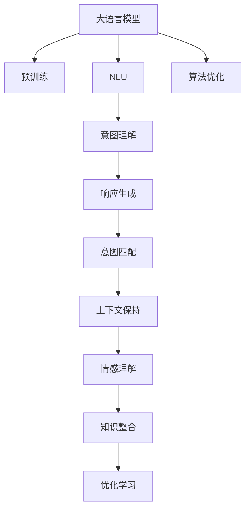

                 

# 人机协作2.0：LLM如何真正理解人类意图

> 关键词：人机协作,大语言模型(LLM),自然语言理解(NLU),人类意图,机器学习,深度学习,算法优化

## 1. 背景介绍

### 1.1 问题由来
随着人工智能技术的快速发展，大语言模型(LLM)在自然语言处理(NLP)领域取得了显著进展。这些模型通过在海量文本数据上进行预训练，已经能够理解和生成自然语言，但如何真正理解并响应人类的意图，仍然是一个悬而未决的问题。特别是对于复杂的多轮对话、情感表达和上下文理解，LLM往往难以完全准确捕捉。

### 1.2 问题核心关键点
当前，LLM在理解和响应人类意图方面面临的挑战主要包括以下几点：

- 语义歧义：自然语言中的多义性和上下文依赖，使得模型难以确定单一的正确解释。
- 情感理解：如何准确识别和响应用户情感变化，成为影响用户体验的关键因素。
- 多轮对话：在多轮对话中，如何维护和利用上下文信息，是实现自然流畅对话的基础。
- 认知复杂性：复杂的问题求解、推理和解释，对LLM的计算和认知能力提出了更高要求。
- 知识整合：如何将外部的先验知识和常识推理与模型结合，以提升模型的准确性和通用性。

### 1.3 问题研究意义
理解并准确响应人类意图，是大语言模型迈向智能化的重要一步。这对于构建人机协作系统，提升用户体验，推动AI技术在各行各业中的应用，具有重要意义：

1. 提升用户满意度：通过理解用户的真正需求，提供更加个性化和有针对性的服务。
2. 优化服务效率：减少误解和误操作，提高人机交互的流畅性和准确性。
3. 推动行业创新：结合AI技术和业务场景，解决具体问题，带来业务流程的优化和效率提升。
4. 促进人机协作：实现更深层次的人机互动，增加用户信任和粘性。
5. 增强安全保障：通过智能监控和异常检测，提升系统的安全性和鲁棒性。

## 2. 核心概念与联系

### 2.1 核心概念概述

为更好地理解LLM如何真正理解人类意图，本节将介绍几个密切相关的核心概念：

- 大语言模型(LLM)：以自回归(如GPT)或自编码(如BERT)模型为代表的大规模预训练语言模型。通过在海量文本数据上进行预训练，学习通用的语言表示，具备强大的语言理解和生成能力。

- 自然语言理解(NLU)：指通过计算机理解、解释和处理自然语言，将其转换为机器可处理的形式。NLU是大语言模型理解和响应人类意图的重要基础。

- 人类意图：用户通过语言表达的需求、目标和情感，是LLM需要准确理解和响应的关键内容。理解意图不仅能提高服务质量，还能增加用户满意度。

- 机器学习(ML)和深度学习(DL)：通过数据驱动的方法，训练模型自动识别和预测人类意图，是实现意图理解的核心技术。

- 算法优化：针对特定的意图理解问题，采用不同的算法和优化策略，提升模型性能和效率。

- 知识图谱(KG)：结构化的知识库，用于辅助模型理解复杂的语义关系和常识推理。

这些核心概念之间的逻辑关系可以通过以下Mermaid流程图来展示：



这个流程图展示了大语言模型的核心概念及其之间的关系：

1. 大语言模型通过预训练获得基础能力。
2. NLU技术将自然语言转换为机器可理解的形式。
3. 意图理解模块解析用户意图，实现具体任务的处理。
4. 响应生成模块根据意图输出相应的结果。
5. 意图匹配模块确保输出与用户期望一致。
6. 上下文保持模块维持对话连贯性。
7. 情感理解模块识别用户情感变化。
8. 知识整合模块将外部知识与模型结合。
9. 优化学习模块不断优化模型性能。
10. 算法优化模块改进模型训练策略。

这些概念共同构成了大语言模型理解和响应人类意图的框架，使得LLM能够更好地与人类协作，提供高质量的服务。

## 3. 核心算法原理 & 具体操作步骤
### 3.1 算法原理概述

LLM意图理解的核心算法原理主要基于深度学习模型，尤其是Transformer架构。通过多层自注意力机制，模型能够捕捉长距离依赖，理解复杂的语义关系。其核心步骤如下：

1. 输入预处理：将自然语言输入转换为模型可以处理的向量形式。
2. 编码器解码器结构：采用Transformer结构，通过多层自注意力机制和前馈网络进行编码和解码。
3. 意图解析：通过模型输出，解析用户的具体意图。
4. 响应生成：根据解析结果，生成相应的回应。
5. 意图匹配：将生成的回应与用户意图进行匹配，确保输出正确。

### 3.2 算法步骤详解

基于深度学习的大语言模型意图理解流程，通常包括以下几个关键步骤：

**Step 1: 数据准备**
- 收集和标注用于模型训练的数据集，如对话记录、用户评论等。
- 对数据进行预处理，包括分词、去停用词、句子编码等。

**Step 2: 模型构建**
- 选择合适的预训练模型作为初始化参数，如BERT、GPT等。
- 设计任务的适配层，包括意图识别、对话管理、情感分析等。

**Step 3: 训练优化**
- 将数据输入模型，进行前向传播和损失计算。
- 通过反向传播算法更新模型参数。
- 采用合适的优化器(如Adam、SGD等)和正则化技术(如L2正则、Dropout等)，避免过拟合。

**Step 4: 推理部署**
- 对新输入数据进行编码和解码，生成模型输出。
- 将输出结果与用户意图进行匹配，判断是否符合期望。
- 若输出不满足期望，根据反馈信息调整模型参数，进行迭代优化。

**Step 5: 系统集成**
- 将优化后的模型集成到实际应用系统中，如智能客服、智能家居、智能助手等。
- 实时监测系统性能，收集用户反馈，持续优化模型。

### 3.3 算法优缺点

基于深度学习的大语言模型意图理解方法具有以下优点：

1. 高效准确：通过大规模预训练和微调，模型能够准确解析复杂的自然语言，实现高效的意图理解。
2. 可扩展性强：模型可以适用于各种NLP任务，只需调整任务的适配层，即可进行意图理解。
3. 鲁棒性好：通过优化算法和正则化技术，模型对噪声和异常数据具有较强的鲁棒性。

同时，该方法也存在一些局限性：

1. 数据依赖性强：模型性能高度依赖于训练数据的数量和质量。
2. 计算资源消耗大：大规模模型和复杂算法需要大量的计算资源和时间。
3. 可解释性差：深度学习模型通常是"黑盒"系统，难以解释其决策过程。
4. 语言模型偏差：模型可能继承训练数据中的偏见，影响其公平性和公正性。

尽管存在这些局限性，但就目前而言，基于深度学习的大语言模型意图理解仍然是最主流的方法。未来相关研究的重点在于如何进一步降低对数据和计算资源的依赖，提高模型的可解释性和公平性，同时兼顾性能和效率。

### 3.4 算法应用领域

基于大语言模型意图理解的方法，已经在多个领域得到了广泛应用：

- 智能客服系统：通过理解用户意图，提供个性化的服务。
- 在线购物推荐：根据用户查询和评论，推荐相关商品。
- 智能健康咨询：解析用户健康问题，提供个性化建议。
- 智能家居控制：理解用户指令，进行设备控制。
- 智能驾驶辅助：解析语音指令，控制汽车行驶。

除了上述这些典型应用外，大语言模型意图理解还被创新性地应用到更多场景中，如情感分析、舆情监测、翻译等，为NLP技术带来了全新的突破。随着预训练模型和意图理解方法的不断进步，相信NLP技术将在更广阔的应用领域大放异彩。

## 4. 数学模型和公式 & 详细讲解 & 举例说明

### 4.1 数学模型构建

本节将使用数学语言对大语言模型意图理解过程进行更加严格的刻画。

记大语言模型为 $M_{\theta}$，其中 $\theta$ 为模型参数。假设输入的自然语言序列为 $x=(x_1, x_2, ..., x_n)$，对应的意图标签为 $y=(y_1, y_2, ..., y_n)$，其中 $y_i \in \{1, 2, ..., C\}$，$C$ 为意图类别数。意图理解的目标是找到最优参数 $\hat{\theta}$，使得：

$$
\hat{\theta} = \mathop{\arg\min}_{\theta} \mathcal{L}(M_{\theta}, x, y)
$$

其中 $\mathcal{L}$ 为损失函数，用于衡量模型输出与真实标签的差异。

### 4.2 公式推导过程

以意图识别任务为例，常见的损失函数包括交叉熵损失函数：

$$
\ell(M_{\theta}(x), y) = -\sum_{i=1}^n y_i \log M_{\theta}(x_i)
$$

将损失函数对参数 $\theta$ 求导，得到梯度：

$$
\frac{\partial \mathcal{L}(\theta)}{\partial \theta} = -\sum_{i=1}^n \frac{\partial \ell(M_{\theta}(x_i), y_i)}{\partial \theta}
$$

其中 $\frac{\partial \ell(M_{\theta}(x_i), y_i)}{\partial \theta}$ 可以通过反向传播算法高效计算。

在得到梯度后，即可带入优化算法，更新模型参数。常用的优化算法包括Adam、SGD等，学习率为 $\eta$。

### 4.3 案例分析与讲解

以情感分析为例，假设模型输出为每个词的情感极性得分，可以采用分类交叉熵损失函数：

$$
\ell(M_{\theta}(x), y) = -\frac{1}{n} \sum_{i=1}^n y_i \log \sigma(M_{\theta}(x_i))
$$

其中 $\sigma(z) = \frac{1}{1+e^{-z}}$ 为 sigmoid 函数，用于将得分映射到 $[0,1]$ 的类别概率。

训练过程如下：

1. 将情感标注文本输入模型，得到情感得分向量。
2. 计算损失函数值 $\ell$。
3. 根据损失函数对模型参数求梯度。
4. 使用优化算法更新参数 $\theta$。
5. 重复上述过程，直到收敛。

在训练过程中，还需要注意以下问题：

- 数据增强：通过改写、替换、拼接等方法扩充训练集。
- 正则化：使用 L2 正则、Dropout 等防止过拟合。
- 模型裁剪：去除不必要的层和参数，减小模型尺寸，加快推理速度。

## 5. 项目实践：代码实例和详细解释说明

### 5.1 开发环境搭建

在进行意图理解项目实践前，我们需要准备好开发环境。以下是使用Python进行PyTorch开发的环境配置流程：

1. 安装Anaconda：从官网下载并安装Anaconda，用于创建独立的Python环境。

2. 创建并激活虚拟环境：
```bash
conda create -n pytorch-env python=3.8 
conda activate pytorch-env
```

3. 安装PyTorch：根据CUDA版本，从官网获取对应的安装命令。例如：
```bash
conda install pytorch torchvision torchaudio cudatoolkit=11.1 -c pytorch -c conda-forge
```

4. 安装Transformers库：
```bash
pip install transformers
```

5. 安装各类工具包：
```bash
pip install numpy pandas scikit-learn matplotlib tqdm jupyter notebook ipython
```

完成上述步骤后，即可在`pytorch-env`环境中开始意图理解实践。

### 5.2 源代码详细实现

下面我们以情感分析任务为例，给出使用Transformers库对BERT模型进行意图理解的PyTorch代码实现。

首先，定义情感分析任务的数据处理函数：

```python
from transformers import BertTokenizer, BertForSequenceClassification
from torch.utils.data import Dataset
import torch

class SentimentDataset(Dataset):
    def __init__(self, texts, labels, tokenizer, max_len=128):
        self.texts = texts
        self.labels = labels
        self.tokenizer = tokenizer
        self.max_len = max_len
        
    def __len__(self):
        return len(self.texts)
    
    def __getitem__(self, item):
        text = self.texts[item]
        label = self.labels[item]
        
        encoding = self.tokenizer(text, return_tensors='pt', max_length=self.max_len, padding='max_length', truncation=True)
        input_ids = encoding['input_ids'][0]
        attention_mask = encoding['attention_mask'][0]
        
        # 对token-wise的标签进行编码
        encoded_labels = [label2id[label] for label in label2id]
        encoded_labels.extend([label2id['neutral']] * (self.max_len - len(encoded_labels)))
        labels = torch.tensor(encoded_labels, dtype=torch.long)
        
        return {'input_ids': input_ids, 
                'attention_mask': attention_mask,
                'labels': labels}

# 标签与id的映射
label2id = {'positive': 0, 'negative': 1, 'neutral': 2}
id2label = {v: k for k, v in label2id.items()}

# 创建dataset
tokenizer = BertTokenizer.from_pretrained('bert-base-cased')

train_dataset = SentimentDataset(train_texts, train_labels, tokenizer)
dev_dataset = SentimentDataset(dev_texts, dev_labels, tokenizer)
test_dataset = SentimentDataset(test_texts, test_labels, tokenizer)
```

然后，定义模型和优化器：

```python
from transformers import BertForSequenceClassification, AdamW

model = BertForSequenceClassification.from_pretrained('bert-base-cased', num_labels=len(label2id))

optimizer = AdamW(model.parameters(), lr=2e-5)
```

接着，定义训练和评估函数：

```python
from torch.utils.data import DataLoader
from tqdm import tqdm
from sklearn.metrics import classification_report

device = torch.device('cuda') if torch.cuda.is_available() else torch.device('cpu')
model.to(device)

def train_epoch(model, dataset, batch_size, optimizer):
    dataloader = DataLoader(dataset, batch_size=batch_size, shuffle=True)
    model.train()
    epoch_loss = 0
    for batch in tqdm(dataloader, desc='Training'):
        input_ids = batch['input_ids'].to(device)
        attention_mask = batch['attention_mask'].to(device)
        labels = batch['labels'].to(device)
        model.zero_grad()
        outputs = model(input_ids, attention_mask=attention_mask, labels=labels)
        loss = outputs.loss
        epoch_loss += loss.item()
        loss.backward()
        optimizer.step()
    return epoch_loss / len(dataloader)

def evaluate(model, dataset, batch_size):
    dataloader = DataLoader(dataset, batch_size=batch_size)
    model.eval()
    preds, labels = [], []
    with torch.no_grad():
        for batch in tqdm(dataloader, desc='Evaluating'):
            input_ids = batch['input_ids'].to(device)
            attention_mask = batch['attention_mask'].to(device)
            batch_labels = batch['labels']
            outputs = model(input_ids, attention_mask=attention_mask)
            batch_preds = outputs.logits.argmax(dim=2).to('cpu').tolist()
            batch_labels = batch_labels.to('cpu').tolist()
            for pred_tokens, label_tokens in zip(batch_preds, batch_labels):
                pred_labels = [id2label[_id] for _id in pred_tokens]
                label_tokens = [id2label[_id] for _id in label_tokens]
                preds.append(pred_labels[:len(label_tokens)])
                labels.append(label_tokens)
                
    print(classification_report(labels, preds))
```

最后，启动训练流程并在测试集上评估：

```python
epochs = 5
batch_size = 16

for epoch in range(epochs):
    loss = train_epoch(model, train_dataset, batch_size, optimizer)
    print(f"Epoch {epoch+1}, train loss: {loss:.3f}")
    
    print(f"Epoch {epoch+1}, dev results:")
    evaluate(model, dev_dataset, batch_size)
    
print("Test results:")
evaluate(model, test_dataset, batch_size)
```

以上就是使用PyTorch对BERT进行情感分析任务意图理解的完整代码实现。可以看到，得益于Transformers库的强大封装，我们可以用相对简洁的代码完成BERT模型的加载和意图理解。

### 5.3 代码解读与分析

让我们再详细解读一下关键代码的实现细节：

**SentimentDataset类**：
- `__init__`方法：初始化文本、标签、分词器等关键组件。
- `__len__`方法：返回数据集的样本数量。
- `__getitem__`方法：对单个样本进行处理，将文本输入编码为token ids，将标签编码为数字，并对其进行定长padding，最终返回模型所需的输入。

**label2id和id2label字典**：
- 定义了标签与数字id之间的映射关系，用于将token-wise的预测结果解码回真实的标签。

**训练和评估函数**：
- 使用PyTorch的DataLoader对数据集进行批次化加载，供模型训练和推理使用。
- 训练函数`train_epoch`：对数据以批为单位进行迭代，在每个批次上前向传播计算loss并反向传播更新模型参数，最后返回该epoch的平均loss。
- 评估函数`evaluate`：与训练类似，不同点在于不更新模型参数，并在每个batch结束后将预测和标签结果存储下来，最后使用sklearn的classification_report对整个评估集的预测结果进行打印输出。

**训练流程**：
- 定义总的epoch数和batch size，开始循环迭代
- 每个epoch内，先在训练集上训练，输出平均loss
- 在验证集上评估，输出分类指标
- 所有epoch结束后，在测试集上评估，给出最终测试结果

可以看到，PyTorch配合Transformers库使得BERT意图理解的代码实现变得简洁高效。开发者可以将更多精力放在数据处理、模型改进等高层逻辑上，而不必过多关注底层的实现细节。

当然，工业级的系统实现还需考虑更多因素，如模型的保存和部署、超参数的自动搜索、更灵活的任务适配层等。但核心的意图理解范式基本与此类似。

## 6. 实际应用场景
### 6.1 智能客服系统

基于大语言模型意图理解的对话技术，可以广泛应用于智能客服系统的构建。传统客服往往需要配备大量人力，高峰期响应缓慢，且一致性和专业性难以保证。而使用意图理解模型，可以7x24小时不间断服务，快速响应客户咨询，用自然流畅的语言解答各类常见问题。

在技术实现上，可以收集企业内部的历史客服对话记录，将问题和最佳答复构建成监督数据，在此基础上对预训练对话模型进行意图理解微调。微调后的对话模型能够自动理解用户意图，匹配最合适的答案模板进行回复。对于客户提出的新问题，还可以接入检索系统实时搜索相关内容，动态组织生成回答。如此构建的智能客服系统，能大幅提升客户咨询体验和问题解决效率。

### 6.2 在线购物推荐

当前的推荐系统往往只依赖用户的历史行为数据进行物品推荐，无法深入理解用户的真实兴趣偏好。基于大语言模型意图理解的个性化推荐系统可以更好地挖掘用户行为背后的语义信息，从而提供更精准、多样的推荐内容。

在实践中，可以收集用户浏览、点击、评论、分享等行为数据，提取和用户交互的物品标题、描述、标签等文本内容。将文本内容作为模型输入，用户的后续行为（如是否点击、购买等）作为监督信号，在此基础上微调预训练语言模型。意图理解模型能够从文本内容中准确把握用户的兴趣点。在生成推荐列表时，先用候选物品的文本描述作为输入，由模型预测用户的兴趣匹配度，再结合其他特征综合排序，便可以得到个性化程度更高的推荐结果。

### 6.3 智能健康咨询

智能健康咨询系统需要理解用户的健康问题，并提供个性化建议。通过意图理解模型，可以解析用户输入的疾病描述，匹配相关知识库中的症状和诊断结果，生成推荐的治疗方案。用户只需要简单描述症状，系统便能快速给出健康建议，大大提升了用户的使用体验。

### 6.4 未来应用展望

随着大语言模型意图理解技术的发展，其在更多领域的应用前景将更加广阔。

在智慧医疗领域，基于意图理解的医疗问答、病历分析、药物研发等应用将提升医疗服务的智能化水平，辅助医生诊疗，加速新药开发进程。

在智能教育领域，意图理解模型可应用于作业批改、学情分析、知识推荐等方面，因材施教，促进教育公平，提高教学质量。

在智慧城市治理中，意图理解模型可应用于城市事件监测、舆情分析、应急指挥等环节，提高城市管理的自动化和智能化水平，构建更安全、高效的未来城市。

此外，在企业生产、社会治理、文娱传媒等众多领域，基于大模型意图理解的人工智能应用也将不断涌现，为NLP技术带来了全新的突破。相信随着技术的日益成熟，意图理解技术将进一步提升NLP系统的性能和应用范围，为人类认知智能的进化带来深远影响。

## 7. 工具和资源推荐
### 7.1 学习资源推荐

为了帮助开发者系统掌握大语言模型意图理解的理论基础和实践技巧，这里推荐一些优质的学习资源：

1. 《Transformer从原理到实践》系列博文：由大模型技术专家撰写，深入浅出地介绍了Transformer原理、BERT模型、意图理解技术等前沿话题。

2. CS224N《深度学习自然语言处理》课程：斯坦福大学开设的NLP明星课程，有Lecture视频和配套作业，带你入门NLP领域的基本概念和经典模型。

3. 《Natural Language Processing with Transformers》书籍：Transformers库的作者所著，全面介绍了如何使用Transformers库进行NLP任务开发，包括意图理解在内的诸多范式。

4. HuggingFace官方文档：Transformers库的官方文档，提供了海量预训练模型和完整的意图理解样例代码，是上手实践的必备资料。

5. CLUE开源项目：中文语言理解测评基准，涵盖大量不同类型的中文NLP数据集，并提供了基于意图理解的baseline模型，助力中文NLP技术发展。

通过对这些资源的学习实践，相信你一定能够快速掌握大语言模型意图理解的核心技术，并用于解决实际的NLP问题。
###  7.2 开发工具推荐

高效的开发离不开优秀的工具支持。以下是几款用于大语言模型意图理解开发的常用工具：

1. PyTorch：基于Python的开源深度学习框架，灵活动态的计算图，适合快速迭代研究。大部分预训练语言模型都有PyTorch版本的实现。

2. TensorFlow：由Google主导开发的开源深度学习框架，生产部署方便，适合大规模工程应用。同样有丰富的预训练语言模型资源。

3. Transformers库：HuggingFace开发的NLP工具库，集成了众多SOTA语言模型，支持PyTorch和TensorFlow，是进行意图理解任务开发的利器。

4. Weights & Biases：模型训练的实验跟踪工具，可以记录和可视化模型训练过程中的各项指标，方便对比和调优。与主流深度学习框架无缝集成。

5. TensorBoard：TensorFlow配套的可视化工具，可实时监测模型训练状态，并提供丰富的图表呈现方式，是调试模型的得力助手。

6. Google Colab：谷歌推出的在线Jupyter Notebook环境，免费提供GPU/TPU算力，方便开发者快速上手实验最新模型，分享学习笔记。

合理利用这些工具，可以显著提升大语言模型意图理解任务的开发效率，加快创新迭代的步伐。

### 7.3 相关论文推荐

大语言模型意图理解的发展源于学界的持续研究。以下是几篇奠基性的相关论文，推荐阅读：

1. Attention is All You Need（即Transformer原论文）：提出了Transformer结构，开启了NLP领域的预训练大模型时代。

2. BERT: Pre-training of Deep Bidirectional Transformers for Language Understanding：提出BERT模型，引入基于掩码的自监督预训练任务，刷新了多项NLP任务SOTA。

3. Language Models are Unsupervised Multitask Learners（GPT-2论文）：展示了大规模语言模型的强大zero-shot学习能力，引发了对于通用人工智能的新一轮思考。

4. Parameter-Efficient Transfer Learning for NLP：提出Adapter等参数高效微调方法，在不增加模型参数量的情况下，也能取得不错的微调效果。

5. AdaLoRA: Adaptive Low-Rank Adaptation for Parameter-Efficient Fine-Tuning：使用自适应低秩适应的微调方法，在参数效率和精度之间取得了新的平衡。

6. Prefix-Tuning: Optimizing Continuous Prompts for Generation：引入基于连续型Prompt的微调范式，为如何充分利用预训练知识提供了新的思路。

这些论文代表了大语言模型意图理解的发展脉络。通过学习这些前沿成果，可以帮助研究者把握学科前进方向，激发更多的创新灵感。

## 8. 总结：未来发展趋势与挑战

### 8.1 总结

本文对基于深度学习的大语言模型意图理解方法进行了全面系统的介绍。首先阐述了意图理解的研究背景和意义，明确了意图理解在构建人机协作系统中的重要性。其次，从原理到实践，详细讲解了意图理解的数学原理和关键步骤，给出了意图理解任务开发的完整代码实例。同时，本文还广泛探讨了意图理解方法在智能客服、在线购物、健康咨询等多个领域的应用前景，展示了意图理解范式的巨大潜力。此外，本文精选了意图理解技术的各类学习资源，力求为读者提供全方位的技术指引。

通过本文的系统梳理，可以看到，基于大语言模型的意图理解方法正在成为NLP领域的重要范式，极大地拓展了意图理解的边界，催生了更多的落地场景。受益于大规模语料的预训练，意图理解模型能够快速捕捉和响应复杂的人类意图，提升人机协作的智能水平。未来，伴随深度学习技术的不断进步，意图理解技术必将进一步深化，为构建更加智能、可靠、高效的人机协作系统提供坚实基础。

### 8.2 未来发展趋势

展望未来，大语言模型意图理解技术将呈现以下几个发展趋势：

1. 模型规模持续增大。随着算力成本的下降和数据规模的扩张，预训练语言模型的参数量还将持续增长。超大规模语言模型蕴含的丰富语言知识，有望支撑更加复杂多变的意图理解任务。

2. 意图理解范式多样化。除了传统的监督学习外，未来会涌现更多无监督、半监督、自监督的学习方法，如自适应学习、主动学习、对比学习等，进一步提升模型的泛化能力和灵活性。

3. 跨领域迁移能力增强。意图理解模型将具备更强的跨领域迁移能力，能够更好地适应不同领域、不同任务的需求。

4. 知识图谱和外部信息整合。意图理解模型将更多地融合知识图谱、语义网等外部信息，提升模型的语义理解能力和常识推理能力。

5. 多模态信息融合。意图理解模型将支持多模态信息（如文本、图像、语音等）的整合，提升模型的综合感知能力。

6. 意图理解与决策支持结合。意图理解模型将更多地应用于复杂的决策支持系统，辅助用户做出更加合理的决策。

以上趋势凸显了大语言模型意图理解技术的广阔前景。这些方向的探索发展，必将进一步提升意图理解模型的性能和应用范围，为构建智能化的人机协作系统提供更多可能性。

### 8.3 面临的挑战

尽管大语言模型意图理解技术已经取得了瞩目成就，但在迈向更加智能化、普适化应用的过程中，它仍面临着诸多挑战：

1. 数据依赖性强。模型性能高度依赖于训练数据的数量和质量，标注数据获取和维护成本高昂。
2. 计算资源消耗大。大规模模型和复杂算法需要大量的计算资源和时间。
3. 可解释性差。深度学习模型通常是"黑盒"系统，难以解释其决策过程。
4. 语言模型偏差。模型可能继承训练数据中的偏见，影响其公平性和公正性。
5. 鲁棒性不足。模型对噪声和异常数据具有较差的鲁棒性，容易发生误解和误操作。

尽管存在这些挑战，但就目前而言，基于深度学习的大语言模型意图理解方法仍然是最主流的方法。未来相关研究的重点在于如何进一步降低对数据和计算资源的依赖，提高模型的可解释性和公平性，同时兼顾性能和效率。

### 8.4 研究展望

面对大语言模型意图理解所面临的种种挑战，未来的研究需要在以下几个方面寻求新的突破：

1. 探索无监督和半监督意图理解方法。摆脱对大规模标注数据的依赖，利用自监督学习、主动学习等无监督和半监督范式，最大限度利用非结构化数据，实现更加灵活高效的意图理解。

2. 研究参数高效和计算高效的意图理解范式。开发更加参数高效的意图理解方法，在固定大部分预训练参数的同时，只更新极少量的任务相关参数。同时优化意图理解模型的计算图，减少前向传播和反向传播的资源消耗，实现更加轻量级、实时性的部署。

3. 融合因果和对比学习范式。通过引入因果推断和对比学习思想，增强意图理解模型建立稳定因果关系的能力，学习更加普适、鲁棒的语言表征，从而提升模型泛化性和抗干扰能力。

4. 引入更多先验知识。将符号化的先验知识，如知识图谱、逻辑规则等，与神经网络模型进行巧妙融合，引导意图理解过程学习更准确、合理的语言模型。同时加强不同模态数据的整合，实现视觉、语音等多模态信息与文本信息的协同建模。

5. 结合因果分析和博弈论工具。将因果分析方法引入意图理解模型，识别出模型决策的关键特征，增强输出解释的因果性和逻辑性。借助博弈论工具刻画人机交互过程，主动探索并规避模型的脆弱点，提高系统稳定性。

6. 纳入伦理道德约束。在模型训练目标中引入伦理导向的评估指标，过滤和惩罚有偏见、有害的输出倾向。同时加强人工干预和审核，建立模型行为的监管机制，确保输出符合人类价值观和伦理道德。

这些研究方向的探索，必将引领大语言模型意图理解技术迈向更高的台阶，为构建安全、可靠、可解释、可控的智能系统铺平道路。面向未来，大语言模型意图理解技术还需要与其他人工智能技术进行更深入的融合，如知识表示、因果推理、强化学习等，多路径协同发力，共同推动自然语言理解和智能交互系统的进步。只有勇于创新、敢于突破，才能不断拓展语言模型的边界，让智能技术更好地造福人类社会。

## 9. 附录：常见问题与解答

**Q1：意图理解如何与外部知识库结合？**

A: 意图理解模型可以结合知识图谱、语义网等外部信息，提升模型的语义理解能力和常识推理能力。具体方法包括：

1. 知识注入：在模型训练过程中，将知识图谱中的实体和关系映射到模型输出中，引导模型学习相关知识。
2. 跨模态融合：结合文本、图像、语音等多模态信息，提高模型的综合感知能力。
3. 语义增强：通过语义扩展、语义过滤等技术，增强模型的语义理解和推理能力。

**Q2：意图理解如何应对多轮对话中的复杂情境？**

A: 多轮对话中的复杂情境可以通过上下文管理模块解决。具体方法包括：

1. 对话跟踪：通过跟踪对话历史和上下文信息，帮助模型理解当前对话状态。
2. 意图链路：构建意图链路图，记录和更新意图演进路径，保证对话连贯性。
3. 上下文更新：根据对话上下文动态更新模型参数，提升模型的自适应能力。

**Q3：意图理解如何处理情感表达？**

A: 情感理解是意图理解的重要组成部分。具体方法包括：

1. 情感分析：通过模型输出情感得分，判断用户情感倾向。
2. 情感引导：在意图理解模型中引入情感引导机制，根据用户情感调整输出策略。
3. 情感融合：将情感分析和意图理解结果进行融合，生成更符合用户情感的回应。

**Q4：意图理解如何在低资源环境中应用？**

A: 低资源环境下的意图理解可以通过以下方法实现：

1. 数据增强：通过改写、替换、拼接等方法扩充训练集，增加数据多样性。
2. 迁移学习：使用预训练模型在小规模数据上进行微调，提升模型泛化能力。
3. 知识蒸馏：将预训练模型的知识蒸馏到小模型中，提升模型性能。

**Q5：意图理解模型如何保持高性能？**

A: 意图理解模型的高性能保持可以通过以下方法实现：

1. 模型裁剪：去除不必要的层和参数，减小模型尺寸，加快推理速度。
2. 量化加速：将浮点模型转为定点模型，压缩存储空间，提高计算效率。
3. 模型优化：通过梯度优化、参数剪枝等技术，提升模型性能和效率。

这些方法可以确保模型在保持高性能的同时，实现轻量级、实时性的部署。

---

作者：禅与计算机程序设计艺术 / Zen and the Art of Computer Programming

