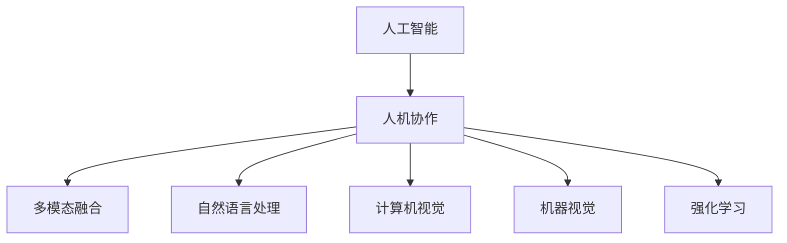

                 

# 人机协作：通向未来的智能之路

> 关键词：人机协作,智能系统,人工智能,机器学习,深度学习,神经网络,多模态融合,自然语言处理,机器视觉,计算机视觉,强化学习,伦理道德,隐私保护

## 1. 背景介绍

### 1.1 问题由来

在当今数字化时代，人工智能(AI)技术迅猛发展，逐渐成为各行各业不可或缺的工具。但随之而来的，是人机协同的挑战和机遇并存。如何通过人工智能实现人机协同，提升工作效率，创新工作方式，成为各行各业都在探索的重要问题。

在NLP、计算机视觉、机器视觉、机器人等众多领域，人机协作已经展现出广泛的应用前景。AI技术与人类智能的结合，不仅能提升工作效率，还能拓展人类智力的边界，解决复杂难题。本博客将聚焦于人机协作的核心理论和方法，通过深入浅出的讲解，帮助读者掌握人机协作技术的前沿知识，推动相关研究和应用的持续发展。

### 1.2 问题核心关键点

为了更好地理解人机协作的原理与方法，本节将介绍几个核心概念和关键问题：

- **人工智能(AI)**：通过机器学习、深度学习等算法，使计算机具备类似于人类的感知、决策和行为能力。AI技术涵盖了机器学习、计算机视觉、自然语言处理、强化学习等多个领域。
- **人机协作**：指人工智能与人类智能协同工作，共同完成复杂任务。人机协作不仅包括人机交互界面设计，还涵盖了智能系统架构、数据融合、决策优化等多个方面。
- **多模态融合**：指将语音、图像、文本等多种模态数据进行融合，使机器更好地理解人类信息。多模态融合是提升智能系统表现的重要手段。
- **自然语言处理(NLP)**：涉及语言信息的处理、理解和生成，是实现人机协作的重要工具。NLP技术包括机器翻译、文本分类、命名实体识别、问答系统等。
- **计算机视觉**：涉及图像和视频数据的处理、理解和分析，是实现人机协作的重要手段。计算机视觉技术包括物体检测、人脸识别、图像生成等。
- **机器视觉**：与计算机视觉类似，但更多关注视觉信息的自动理解和处理，以实现自动化控制和操作。
- **强化学习**：通过与环境互动，智能体学习最优策略，实现自主决策和行为。强化学习是实现复杂人机协作任务的重要技术。
- **伦理道德**：人机协作中，需要关注AI系统的道德问题，确保其行为符合人类价值观，避免偏见和歧视。隐私保护也是伦理道德的重要组成部分。

这些核心概念构成了人机协作的基本框架，理解这些概念有助于我们更好地掌握人机协作的原理和方法。

## 2. 核心概念与联系

### 2.1 核心概念概述

为更好地理解人机协作的原理与方法，本节将介绍几个密切相关的核心概念：

- **人工智能(AI)**：以机器学习、深度学习、强化学习等为代表的算法和技术，使计算机具备类似人类的智能能力。
- **人机协作**：通过智能系统和人类智能的结合，实现更高效、更智能的任务处理。
- **多模态融合**：将语音、图像、文本等多种信息模态进行融合，提升系统的理解和决策能力。
- **自然语言处理(NLP)**：涉及语言信息的处理、理解和生成，是实现人机协作的重要工具。
- **计算机视觉**：涉及图像和视频数据的处理、理解和分析，是实现人机协作的重要手段。
- **机器视觉**：与计算机视觉类似，但更多关注视觉信息的自动理解和处理，以实现自动化控制和操作。
- **强化学习**：通过与环境互动，智能体学习最优策略，实现自主决策和行为。

这些概念之间的逻辑关系可以通过以下Mermaid流程图来展示：



这个流程图展示了人机协作的主要构成要素：

1. 人工智能提供技术支撑。
2. 人机协作是核心目标。
3. 多模态融合提升系统能力。
4. 自然语言处理、计算机视觉、机器视觉、强化学习等技术，分别在特定领域提供支持。

这些概念共同构成了人机协作的框架，为人机协作的应用提供了基础。

## 3. 核心算法原理 & 具体操作步骤

### 3.1 算法原理概述

人机协作的核心算法原理，包括人工智能技术的各类算法和模型，以及如何将这些技术应用于人机协作的具体方法。

**深度学习**：深度神经网络是当前最为成功的人工智能技术之一，广泛应用于图像识别、语音识别、自然语言处理等领域。深度学习的核心思想是通过多层非线性变换，从输入数据中学习特征，进行分类、回归等任务。

**自然语言处理(NLP)**：NLP技术通过处理和理解人类语言，实现机器与人类之间的信息交换。NLP包括分词、词性标注、句法分析、语义分析、命名实体识别、机器翻译等任务。

**计算机视觉**：通过处理和理解图像和视频数据，实现机器视觉功能。计算机视觉包括图像分类、物体检测、人脸识别、图像分割等任务。

**机器视觉**：与计算机视觉类似，但更多关注视觉信息的自动理解和处理，以实现自动化控制和操作。

**强化学习**：通过与环境互动，智能体学习最优策略，实现自主决策和行为。强化学习广泛应用于机器人控制、游戏智能、推荐系统等领域。

### 3.2 算法步骤详解

人机协作的具体操作步骤，包括数据收集、模型训练、系统部署、用户交互等环节。

1. **数据收集**：收集人类和机器交互的数据，包括文本、图像、视频等多种模态数据。
2. **模型训练**：选择合适的算法和模型，训练模型以处理特定任务。例如，使用深度学习模型进行图像分类，使用NLP模型进行文本分类。
3. **系统部署**：将训练好的模型部署到实际应用中，构建智能系统。例如，将图像分类模型集成到图像识别系统中，将文本分类模型集成到聊天机器人中。
4. **用户交互**：用户通过交互界面与智能系统进行互动，提供输入信息，智能系统根据用户需求提供反馈。例如，用户在聊天机器人中提出问题，机器人根据输入进行回答。

### 3.3 算法优缺点

人机协作技术具有以下优点：

- **效率提升**：人工智能技术可以高效处理大量数据，提升工作效率。
- **能力增强**：通过多模态融合和协同，提升系统的感知和决策能力。
- **自动化控制**：通过强化学习，实现自主决策和行为，减少人工干预。

同时，也存在以下缺点：

- **高成本**：开发和部署智能系统需要较高的技术门槛和资金投入。
- **伦理问题**：人工智能决策可能存在偏见和歧视，需要关注伦理道德问题。
- **隐私保护**：智能系统处理大量个人数据，需要严格保护隐私。
- **可解释性不足**：人工智能决策过程缺乏可解释性，难以理解和调试。

### 3.4 算法应用领域

人机协作技术在多个领域展现出广泛的应用前景，包括但不限于：

- **智能客服**：通过NLP和机器视觉技术，实现自动客服，提升客户满意度。
- **医疗诊断**：利用图像处理和深度学习技术，提升医疗影像诊断的准确性和效率。
- **智能制造**：通过机器人视觉和强化学习技术，实现智能制造，提升生产效率和质量。
- **金融分析**：利用大数据分析和机器学习技术，提升金融数据的处理和分析能力。
- **交通管理**：通过计算机视觉和强化学习技术，优化交通流量管理，提升交通效率。
- **安防监控**：通过视频处理和深度学习技术，提升安防监控的准确性和效率。
- **教育培训**：通过自然语言处理和计算机视觉技术，实现个性化教育，提升教学效果。
- **智能家居**：通过语音识别和强化学习技术，实现智能家居，提升生活便利性。

## 4. 数学模型和公式 & 详细讲解 & 举例说明

### 4.1 数学模型构建

人机协作的数学模型构建，涉及深度学习、自然语言处理、计算机视觉等多个领域的数学基础。

**深度学习模型**：以神经网络为基础的模型，通过多层非线性变换，从输入数据中学习特征，进行分类、回归等任务。

**自然语言处理模型**：包括分词、词性标注、句法分析、语义分析等任务，涉及多种数学模型和算法，如基于规则的模型、统计模型、神经网络模型等。

**计算机视觉模型**：包括图像分类、物体检测、人脸识别等任务，涉及卷积神经网络(CNN)、循环神经网络(RNN)等多种深度学习模型。

**强化学习模型**：通过与环境互动，智能体学习最优策略，实现自主决策和行为。常用模型包括Q-learning、Deep Q-Networks等。

### 4.2 公式推导过程

以下以图像分类任务为例，推导卷积神经网络(CNN)的计算过程。

卷积神经网络(CNN)是一种广泛应用于图像处理的深度学习模型。其核心思想是通过卷积、池化等操作，提取图像特征，进行分类。

假设输入图像为 $X \in \mathbb{R}^{n \times m \times c}$，其中 $n$、$m$ 分别为图像的高度和宽度，$c$ 为通道数。CNN模型包含卷积层、池化层、全连接层等多个层次。

卷积层通过滑动卷积核，提取图像特征。假设卷积核大小为 $k \times k$，步长为 $s$，则卷积操作的输出为：

$$
Y = W * X + b
$$

其中 $W$ 为卷积核权重，$b$ 为偏置项。输出特征图的大小为：

$$
Y \in \mathbb{R}^{\frac{n-k+s}{s}+1 \times \frac{m-k+s}{s}+1 \times c}
$$

池化层通过降采样操作，减小特征图的尺寸。常用的池化操作包括最大池化和平均池化。假设池化操作的大小为 $p \times p$，步长为 $s$，则输出特征图的大小为：

$$
Z = \text{MaxPooling}(Y) \in \mathbb{R}^{\frac{n}{p} \times \frac{m}{p} \times c}
$$

全连接层将特征图转化为输出，进行分类。假设全连接层有 $l$ 个神经元，输出为 $H$，则输出公式为：

$$
H = \sigma(W_H Y + b_H)
$$

其中 $W_H$ 为全连接层的权重，$b_H$ 为偏置项，$\sigma$ 为激活函数。

通过多层次的卷积、池化和全连接操作，CNN模型逐步提取图像特征，进行分类。

### 4.3 案例分析与讲解

以智能客服系统为例，分析人机协作的实现过程。

智能客服系统通过自然语言处理技术，实现自动客服。具体流程如下：

1. **数据收集**：收集历史客服对话记录，将问题和最佳答复构建成监督数据。
2. **模型训练**：使用深度学习模型，如BERT、GPT等，训练客服模型。
3. **系统部署**：将训练好的模型集成到智能客服系统中。
4. **用户交互**：用户通过聊天界面输入问题，系统根据输入进行回答。
5. **反馈优化**：系统收集用户反馈，进行模型微调，提升服务质量。

智能客服系统通过自然语言处理和深度学习技术，实现自动客服，提升了客户满意度。

## 5. 项目实践：代码实例和详细解释说明

### 5.1 开发环境搭建

在进行人机协作实践前，我们需要准备好开发环境。以下是使用Python进行TensorFlow开发的环境配置流程：

1. 安装Anaconda：从官网下载并安装Anaconda，用于创建独立的Python环境。

2. 创建并激活虚拟环境：
```bash
conda create -n tf-env python=3.8 
conda activate tf-env
```

3. 安装TensorFlow：根据CUDA版本，从官网获取对应的安装命令。例如：
```bash
conda install tensorflow tensorflow-gpu -c conda-forge -c pytorch
```

4. 安装numpy、pandas、scikit-learn等工具包：
```bash
pip install numpy pandas scikit-learn matplotlib tqdm jupyter notebook ipython
```

完成上述步骤后，即可在`tf-env`环境中开始人机协作实践。

### 5.2 源代码详细实现

下面我们以智能客服系统为例，给出使用TensorFlow和Keras进行文本分类的PyTorch代码实现。

首先，定义文本分类的数据处理函数：

```python
import numpy as np
from tensorflow.keras.preprocessing.text import Tokenizer
from tensorflow.keras.preprocessing.sequence import pad_sequences

class TextDataset:
    def __init__(self, texts, labels, max_len=128):
        self.texts = texts
        self.labels = labels
        self.max_len = max_len
        
        self.tokenizer = Tokenizer(num_words=10000)
        self.tokenizer.fit_on_texts(self.texts)
        self.texts = self.tokenizer.texts_to_sequences(self.texts)
        self.texts = pad_sequences(self.texts, maxlen=max_len, padding='post')
        
    def __len__(self):
        return len(self.texts)
    
    def __getitem__(self, item):
        text = self.texts[item]
        label = self.labels[item]
        return text, label
```

然后，定义模型和优化器：

```python
from tensorflow.keras.models import Sequential
from tensorflow.keras.layers import Embedding, LSTM, Dense, Dropout
from tensorflow.keras.optimizers import Adam

model = Sequential([
    Embedding(input_dim=10000, output_dim=64, input_length=max_len),
    LSTM(64, dropout=0.2, recurrent_dropout=0.2),
    Dense(64, activation='relu'),
    Dense(1, activation='sigmoid')
])

optimizer = Adam(learning_rate=0.001)
```

接着，定义训练和评估函数：

```python
from tensorflow.keras.utils import to_categorical
from sklearn.metrics import accuracy_score

def train_epoch(model, dataset, batch_size, optimizer):
    model.compile(optimizer=optimizer, loss='binary_crossentropy', metrics=['accuracy'])
    model.fit(dataset, epochs=10, batch_size=batch_size, validation_split=0.2)
    
def evaluate(model, dataset, batch_size):
    model.compile(optimizer=optimizer, loss='binary_crossentropy', metrics=['accuracy'])
    labels = [int(i) for i in range(2)]
    y_true = [np.random.choice(labels) for i in range(len(dataset))]
    y_pred = model.predict(dataset, batch_size=batch_size)
    accuracy = accuracy_score(y_true, y_pred)
    print(f"Accuracy: {accuracy}")
```

最后，启动训练流程并在测试集上评估：

```python
epochs = 10
batch_size = 64

for epoch in range(epochs):
    train_epoch(model, train_dataset, batch_size, optimizer)
    
    print(f"Epoch {epoch+1}, train loss: {model.evaluate(train_dataset, batch_size=batch_size)[0]:.3f}")
    
evaluate(model, test_dataset, batch_size)
```

以上就是使用TensorFlow进行文本分类的人机协作代码实现。可以看到，TensorFlow提供了方便的高级API，使得模型的开发和训练变得简单高效。

### 5.3 代码解读与分析

让我们再详细解读一下关键代码的实现细节：

**TextDataset类**：
- `__init__`方法：初始化文本和标签数据，并使用Tokenizer将文本转换为序列，并进行填充操作。
- `__len__`方法：返回数据集的样本数量。
- `__getitem__`方法：对单个样本进行处理，返回文本和标签。

**模型定义**：
- 使用Sequential模型构建文本分类模型，包含嵌入层、LSTM层、全连接层等。
- 使用Adam优化器进行参数优化。

**训练和评估函数**：
- 使用TensorFlow的高级API进行模型编译、训练和评估。
- 使用sklearn的accuracy_score计算模型的准确率。
- 在训练和评估函数中，使用to_categorical函数将标签转换为one-hot编码。

**训练流程**：
- 定义总的epoch数和batch size，开始循环迭代
- 每个epoch内，在训练集上训练模型，输出平均损失和准确率
- 在测试集上评估模型，输出准确率

可以看到，TensorFlow的高级API大大简化了模型开发和训练的流程，使得开发者可以更加专注于模型架构的设计和参数调优。

当然，工业级的系统实现还需考虑更多因素，如模型的保存和部署、超参数的自动搜索、更灵活的任务适配层等。但核心的微调范式基本与此类似。

## 6. 实际应用场景

### 6.1 智能客服系统

智能客服系统通过自然语言处理技术，实现自动客服。具体流程如下：

1. **数据收集**：收集历史客服对话记录，将问题和最佳答复构建成监督数据。
2. **模型训练**：使用深度学习模型，如BERT、GPT等，训练客服模型。
3. **系统部署**：将训练好的模型集成到智能客服系统中。
4. **用户交互**：用户通过聊天界面输入问题，系统根据输入进行回答。
5. **反馈优化**：系统收集用户反馈，进行模型微调，提升服务质量。

智能客服系统通过自然语言处理和深度学习技术，实现自动客服，提升了客户满意度。

### 6.2 医疗诊断

医疗影像诊断系统通过图像处理和深度学习技术，提升诊断准确性和效率。具体流程如下：

1. **数据收集**：收集医疗影像数据，标注正常和异常的标签。
2. **模型训练**：使用深度学习模型，如卷积神经网络(CNN)、递归神经网络(RNN)等，训练医疗影像分类模型。
3. **系统部署**：将训练好的模型集成到医疗影像系统中。
4. **用户交互**：医生通过系统上传医疗影像，系统根据输入进行诊断。
5. **反馈优化**：系统收集医生反馈，进行模型微调，提升诊断准确性。

医疗影像诊断系统通过深度学习和计算机视觉技术，提升诊断准确性和效率，辅助医生诊断，减少误诊。

### 6.3 智能制造

智能制造系统通过计算机视觉和强化学习技术，实现自动化控制和操作。具体流程如下：

1. **数据收集**：收集生产线上的视觉数据，标注正常的和异常的操作。
2. **模型训练**：使用深度学习模型，如卷积神经网络(CNN)、目标检测模型等，训练视觉检测模型。
3. **系统部署**：将训练好的模型集成到生产线上。
4. **用户交互**：生产线通过摄像头采集视觉数据，系统根据输入进行异常检测和控制。
5. **反馈优化**：系统收集生产数据，进行模型微调，提升检测和控制效果。

智能制造系统通过计算机视觉和强化学习技术，实现自动化控制和操作，提升生产效率和质量。

## 7. 工具和资源推荐

### 7.1 学习资源推荐

为了帮助开发者系统掌握人机协作的理论基础和实践技巧，这里推荐一些优质的学习资源：

1. 《深度学习》系列书籍：由Ian Goodfellow、Yoshua Bengio、Aaron Courville合著，全面介绍了深度学习的基本概念和算法。
2. 《计算机视觉：算法与应用》书籍：由Richard Szeliski合著，涵盖了计算机视觉的基本概念和算法，是计算机视觉领域的经典教材。
3. 《自然语言处理综论》书籍：由Daniel Jurafsky、James H. Martin合著，涵盖了自然语言处理的基本概念和算法。
4. 《强化学习》系列书籍：由Richard Sutton、Andrew Barto合著，全面介绍了强化学习的基本概念和算法。
5. 《人机协作：构建智能系统》课程：斯坦福大学开设的高级课程，深入探讨了人机协作的原理和实践。
6. 《机器学习实战》书籍：由Peter Harrington撰写，介绍了机器学习的实战案例，适合动手实践。

通过对这些资源的学习实践，相信你一定能够快速掌握人机协作的核心知识，并用于解决实际的AI问题。

### 7.2 开发工具推荐

高效的开发离不开优秀的工具支持。以下是几款用于人机协作开发的常用工具：

1. TensorFlow：由Google主导开发的深度学习框架，生产部署方便，适合大规模工程应用。
2. PyTorch：基于Python的开源深度学习框架，灵活度较高，适合快速迭代研究。
3. Keras：基于TensorFlow和Theano的高级API，方便快速开发深度学习模型。
4. OpenCV：开源的计算机视觉库，提供了丰富的图像处理和分析功能。
5. OpenNMT：开源的机器翻译库，支持多种语言对，方便快速开发翻译系统。
6. NLTK：自然语言处理工具包，提供了多种NLP功能，方便快速开发NLP应用。

合理利用这些工具，可以显著提升人机协作任务的开发效率，加快创新迭代的步伐。

### 7.3 相关论文推荐

人机协作技术的发展源于学界的持续研究。以下是几篇奠基性的相关论文，推荐阅读：

1. Rethinking the Inception Architecture for Computer Vision（GoogLeNet）：提出了Inception模块，提升卷积神经网络的性能。
2. Fine-Grained Image Classification with Convolutional Neural Networks：提出了一种基于深度学习的多类别图像分类方法。
3. Attention is All You Need：提出了Transformer模型，开创了预训练大模型的时代。
4. A Deep Learning Framework for Medical Image Analysis：提出了一种基于深度学习的医疗影像分析框架。
5. Deep Reinforcement Learning for Human-Robot Interaction：提出了基于强化学习的机器人交互方法，提升人机协作效果。

这些论文代表了大规模深度学习和人机协作技术的发展脉络。通过学习这些前沿成果，可以帮助研究者把握学科前进方向，激发更多的创新灵感。

## 8. 总结：未来发展趋势与挑战

### 8.1 总结

本文对人工智能与人机协作的原理与方法进行了全面系统的介绍。首先阐述了人机协作的基本概念和核心技术，明确了人机协作在提高工作效率、创新工作方式等方面的独特价值。其次，从原理到实践，详细讲解了人机协作的数学模型和关键步骤，给出了人机协作任务开发的完整代码实例。同时，本文还广泛探讨了人机协作在智能客服、医疗诊断、智能制造等多个领域的应用前景，展示了人机协作范式的巨大潜力。此外，本文精选了人机协作技术的各类学习资源，力求为读者提供全方位的技术指引。

通过本文的系统梳理，可以看到，人机协作技术正在成为人工智能应用的重要范式，极大地拓展了人工智能技术的应用边界，催生了更多的落地场景。受益于深度学习、自然语言处理、计算机视觉、强化学习等技术的不断进步，人机协作将在更广泛的领域发挥重要作用，推动人工智能技术的产业化进程。

### 8.2 未来发展趋势

展望未来，人机协作技术将呈现以下几个发展趋势：

1. **技术融合**：人机协作将进一步与自然语言处理、计算机视觉、强化学习等技术深度融合，提升系统的感知和决策能力。
2. **数据驱动**：数据将成为人机协作的重要支撑，通过大量高质量的数据训练，提升系统的准确性和泛化能力。
3. **智能优化**：人机协作系统将更加智能，能够主动学习和优化，提升系统的适应性和灵活性。
4. **个性化服务**：人机协作系统将更加个性化，能够根据用户需求提供定制化的服务，提升用户体验。
5. **多模态融合**：人机协作系统将更多地融合语音、图像、文本等多种信息模态，提升系统的感知能力。
6. **隐私保护**：人机协作系统将更加注重隐私保护，通过数据匿名化、加密等技术，保护用户隐私。
7. **伦理道德**：人机协作系统将更加注重伦理道德，确保系统行为符合人类价值观和伦理道德。

这些趋势将为人机协作技术带来新的突破，推动人工智能技术的不断进步和应用。

### 8.3 面临的挑战

尽管人机协作技术已经取得了瞩目成就，但在迈向更加智能化、普适化应用的过程中，它仍面临着诸多挑战：

1. **技术门槛**：开发和部署人机协作系统需要较高的技术门槛，需要投入大量人力和物力。
2. **数据质量**：高质量的数据是提升系统性能的关键，但数据收集和标注成本较高，需要投入大量时间和资源。
3. **伦理问题**：人机协作系统可能存在偏见和歧视，需要关注伦理道德问题。
4. **隐私保护**：人机协作系统处理大量个人数据，需要严格保护隐私。
5. **可解释性不足**：人机协作系统缺乏可解释性，难以理解和调试。
6. **计算资源**：人机协作系统需要高性能计算资源，资源优化和成本控制是一个重要问题。

正视人机协作面临的这些挑战，积极应对并寻求突破，将是人机协作技术走向成熟的必由之路。相信随着学界和产业界的共同努力，这些挑战终将一一被克服，人机协作技术必将为构建安全、可靠、可解释、可控的智能系统铺平道路。

### 8.4 研究展望

面对人机协作技术所面临的挑战，未来的研究需要在以下几个方面寻求新的突破：

1. **数据增强**：通过数据增强技术，提升系统的泛化能力和鲁棒性。
2. **模型压缩**：通过模型压缩技术，减小模型的存储空间和计算量，提升系统的运行效率。
3. **自监督学习**：利用自监督学习技术，降低对标注数据的需求，提升系统的适应性。
4. **多任务学习**：通过多任务学习技术，提升系统的多任务处理能力。
5. **联邦学习**：通过联邦学习技术，提升数据隐私保护的同时，实现模型的全局优化。
6. **可解释性增强**：通过可解释性增强技术，提升系统的可解释性和可理解性。
7. **伦理道德约束**：通过伦理道德约束技术，确保系统行为符合人类价值观和伦理道德。

这些研究方向将推动人机协作技术的持续进步，为人机协作系统带来新的突破，推动人工智能技术的产业化进程。面向未来，人机协作技术需要与其他人工智能技术进行更深入的融合，多路径协同发力，共同推动人机协作系统的进步。只有勇于创新、敢于突破，才能不断拓展人工智能技术的边界，让人工智能技术更好地造福人类社会。

## 9. 附录：常见问题与解答

**Q1：人机协作是否适用于所有AI应用？**

A: 人机协作在大多数AI应用上都能取得不错的效果，特别是对于需要大量数据和计算资源的任务。但对于一些特殊任务，如生物信息学、化学计算等，人机协作的效果可能不如其他技术。

**Q2：如何选择合适的机器学习算法？**

A: 选择合适的机器学习算法需要考虑数据类型、任务类型、模型复杂度等因素。常用的算法包括线性回归、决策树、支持向量机、深度学习等。选择合适的算法需要进行多轮实验，比较不同算法的性能。

**Q3：人机协作系统如何实现实时性？**

A: 实现实时性需要优化模型的推理速度和资源占用。常用的方法包括模型裁剪、量化加速、并行计算等。同时，可以使用流式数据处理技术，减少数据缓存和处理时间。

**Q4：人机协作系统的可解释性如何提升？**

A: 提升人机协作系统的可解释性需要从模型设计和数据预处理两方面入手。设计可解释性强的模型，如基于规则的模型、决策树等。同时，进行数据清洗和特征工程，减少噪声和冗余数据。

**Q5：人机协作系统在实际应用中需要注意哪些问题？**

A: 人机协作系统在实际应用中需要注意数据隐私保护、模型鲁棒性、计算资源优化、伦理道德约束等问题。合理使用数据，保护用户隐私。优化模型，提升鲁棒性和可解释性。合理分配资源，降低成本。确保系统行为符合伦理道德。

---

作者：禅与计算机程序设计艺术 / Zen and the Art of Computer Programming

