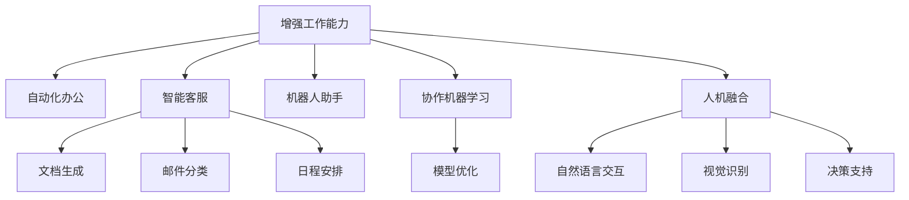

                 

# 人机协同：未来工作的核心驱动力

> 关键词：人机协同,人工智能,自动化,增强工作能力,未来就业趋势,机器人助手,协作机器学习,人机融合

## 1. 背景介绍

### 1.1 问题由来
随着人工智能技术的迅猛发展，人机协同已经成为未来工作的重要趋势。在过去几十年中，人们逐渐接受了计算机辅助工作的概念，但真正意义上的人机协同，即人与机器在多方面进行深度合作，真正实现优势互补，是最近几年才逐渐被关注和实践的。

当前，各行各业都面临着自动化和智能化的压力，如何在保持高效率的同时，充分利用人的创造性思维和情感智能，同时提高机器的智能化水平，是人机协同研究的重点。人机协同技术的应用，可以大幅提升工作效率，优化资源配置，同时也带来新的职业机会和就业方式，引领未来工作的潮流。

### 1.2 问题核心关键点
本文聚焦于人机协同在现实工作中的应用，探讨如何通过人工智能技术，实现人和机器的深度融合，提升整体工作效能，同时降低对人的体力和脑力的依赖。重点在于：

1. 人机协同的原理与机制，即如何通过算法和系统设计，使得机器能够理解和执行人的指令，并根据反馈进行自适应改进。
2. 人机协同的具体应用场景，包括自动化办公、智能客服、机器人助手等，展示其实际效果。
3. 人机协同的挑战与未来发展方向，探讨当前面临的技术和伦理问题，以及可能的解决方案。

## 2. 核心概念与联系

### 2.1 核心概念概述

为更好地理解人机协同技术，本节将介绍几个关键概念：

- **人机协同(Co-Humanity Collaboration)**：指人机在自然语言交互、视觉识别、决策支持等多个方面进行深度合作的系统，使得机器能够理解和执行人的指令，同时提供辅助决策和优化建议。

- **增强工作能力(Enhanced Work Capabilities)**：通过引入人工智能技术，提升人的工作效率和创造力，同时减轻重复性劳动的负担，从而实现工作效能的提升。

- **自动化办公(Automated Office Automation)**：利用人工智能技术自动处理日常办公任务，如文档生成、邮件分类、日程安排等，大幅提升办公效率。

- **智能客服(Customer Service Automation)**：使用机器人自动处理客户咨询，提供即时、准确的响应，提高客户满意度。

- **机器人助手(Robot Assistants)**：通过自然语言处理和机器学习技术，使机器人能够执行复杂的任务，如数据分析、代码编写、语音翻译等。

- **协作机器学习(Cooperative Machine Learning)**：通过人与机器的协作学习，共同优化模型参数，提升机器的智能化水平。

- **人机融合(Human-Machine Fusion)**：通过交互界面和系统设计，将人的情感和行为与机器的感知和决策有机融合，实现更为自然的人机互动。

这些核心概念之间的逻辑关系可以通过以下Mermaid流程图来展示：



这个流程图展示了一系列基于人机协同的核心概念，以及它们之间的相互关系和应用场景。

## 3. 核心算法原理 & 具体操作步骤
### 3.1 算法原理概述

人机协同的核心算法原理基于人机交互、自然语言处理和机器学习等技术，其核心思想是：

1. **自然语言处理(NLP)**：通过文本分析、语义理解等技术，使机器能够理解和解析人的自然语言指令。
2. **机器学习(ML)**：利用监督学习、无监督学习和强化学习等技术，训练机器能够根据用户指令执行相应的任务，并在执行过程中进行持续学习和优化。
3. **人机交互(UI)**：设计友好、直观的用户界面，使得人与机器之间的交互更加自然、高效。

### 3.2 算法步骤详解

人机协同的具体实现步骤包括：

**Step 1: 数据收集与预处理**
- 收集实际工作场景中的数据，包括用户指令、系统反馈、操作日志等。
- 对数据进行清洗、标注和分词等预处理工作。

**Step 2: 模型训练与优化**
- 利用收集到的数据，训练自然语言处理和机器学习模型，如语言模型、语义理解模型、任务执行模型等。
- 利用标注数据进行监督学习，使用交叉验证、正则化等技术优化模型性能。

**Step 3: 系统设计与人机交互**
- 设计用户界面(UI)，提供直观的输入方式，如语音、文本、手势等。
- 通过API接口或微服务架构，将模型与业务系统进行集成，实现实时交互。

**Step 4: 测试与迭代**
- 在测试环境中模拟实际应用场景，测试系统的各项指标和用户满意度。
- 根据测试结果进行迭代优化，不断改进系统的响应速度、准确性和稳定性。

**Step 5: 部署与维护**
- 将训练好的模型和系统部署到生产环境，进行实时监控和维护。
- 根据用户反馈和业务需求，不断更新和升级模型，保持系统的先进性。

### 3.3 算法优缺点

人机协同技术具有以下优点：

1. **效率提升**：通过自动化处理日常工作任务，大幅提升工作效率，减少重复劳动。
2. **质量保障**：利用机器学习技术，减少人为错误，提高工作质量和精度。
3. **创新激发**：将人从繁琐任务中解放出来，专注于创造性工作和决策优化。
4. **灵活适应**：通过人机协同，灵活应对复杂多变的业务需求，适应性强。

同时，该技术也存在以下局限性：

1. **技术门槛高**：开发和部署人机协同系统需要较高的技术门槛，对开发团队的技术栈要求较高。
2. **数据依赖大**：系统的训练和优化依赖大量标注数据，数据获取成本较高。
3. **伦理风险**：机器的决策可能带来隐私泄露、数据安全等问题，需加强隐私保护和数据安全措施。
4. **用户接受度**：用户对新技术的接受度和适应性存在不确定性，需通过培训和引导提高。

### 3.4 算法应用领域

人机协同技术已经被广泛应用于多个领域，包括但不限于：

- **智能制造**：利用机器人自动化生产线，提高生产效率和质量。
- **金融服务**：通过智能客服系统，提供7x24小时不间断的客户服务。
- **医疗健康**：使用机器人助手进行病历记录、诊断分析等，提升医疗服务水平。
- **教育培训**：结合虚拟教师和智能助教，个性化指导学习，提高教学效果。
- **物流运输**：利用智能调度系统，优化货物运输路线和仓储管理。
- **信息咨询**：通过问答系统和知识图谱，提供精准的信息咨询和决策支持。

## 4. 数学模型和公式 & 详细讲解 & 举例说明

### 4.1 数学模型构建

为了更好地理解人机协同的算法原理，我们将从数学角度对其实现过程进行刻画。

设用户输入的指令为 $x \in \mathcal{X}$，机器的输出为 $y \in \mathcal{Y}$，其中 $\mathcal{X}$ 为指令空间，$\mathcal{Y}$ 为任务执行空间。

定义机器在指令 $x$ 上的执行效果为 $g(x) \in [0,1]$，表示机器执行指令的概率。

定义人机协同系统的损失函数为 $\mathcal{L}(x,y) = (1-g(x))^2$，表示在指令 $x$ 上的执行效果与理想效果的差距。

人机协同系统的目标是最小化损失函数，即：

$$
\min_{g} \mathcal{L}(x,y) = \min_{g} (1-g(x))^2
$$

其中 $g(x)$ 为模型的预测函数。

### 4.2 公式推导过程

人机协同系统的训练过程可以通过监督学习来实现，假设已知 $N$ 个指令-执行效果对 $(x_i,g_i)$，利用交叉熵损失函数来最小化预测错误。

设模型的预测函数为 $g(x; \theta)$，其中 $\theta$ 为模型参数，则模型的损失函数为：

$$
\mathcal{L}(\theta) = -\frac{1}{N} \sum_{i=1}^N [g_i \log g(x_i; \theta) + (1-g_i) \log (1-g(x_i; \theta))]
$$

模型参数的更新公式为：

$$
\theta \leftarrow \theta - \eta \nabla_{\theta}\mathcal{L}(\theta) 
$$

其中 $\eta$ 为学习率，$\nabla_{\theta}\mathcal{L}(\theta)$ 为损失函数对模型参数的梯度，可通过反向传播算法高效计算。

### 4.3 案例分析与讲解

以智能客服系统为例，展示人机协同系统的具体实现：

1. **数据收集**：收集客户咨询的文本记录，标注客户的意图和问题类型。
2. **模型训练**：利用收集到的数据，训练一个语义理解模型，用于解析客户意图和问题。
3. **系统集成**：将语义理解模型与智能客服系统进行集成，实现自动响应客户咨询。
4. **反馈优化**：通过用户反馈和系统日志，持续优化模型的预测效果。
5. **系统部署**：将训练好的模型和系统部署到生产环境，提供实时客服服务。

## 5. 项目实践：代码实例和详细解释说明
### 5.1 开发环境搭建

在进行人机协同系统开发前，需要准备好开发环境。以下是使用Python进行TensorFlow开发的环境配置流程：

1. 安装Anaconda：从官网下载并安装Anaconda，用于创建独立的Python环境。

2. 创建并激活虚拟环境：
```bash
conda create -n pytorch-env python=3.8 
conda activate pytorch-env
```

3. 安装TensorFlow：根据CUDA版本，从官网获取对应的安装命令。例如：
```bash
conda install tensorflow -c tf
```

4. 安装各类工具包：
```bash
pip install numpy pandas scikit-learn matplotlib tqdm jupyter notebook ipython
```

完成上述步骤后，即可在`pytorch-env`环境中开始人机协同系统开发。

### 5.2 源代码详细实现

下面以智能客服系统为例，给出使用TensorFlow进行人机协同系统开发的PyTorch代码实现。

首先，定义智能客服系统的数据处理函数：

```python
import tensorflow as tf
from tensorflow.keras.layers import Input, Dense, Embedding, LSTM, Bidirectional, GRU
from tensorflow.keras.models import Model

def build_model(vocab_size, embedding_dim, hidden_dim):
    inputs = Input(shape=(max_length,), dtype='int32')
    x = Embedding(vocab_size, embedding_dim)(inputs)
    x = Bidirectional(LSTM(hidden_dim, return_sequences=True))(x)
    x = Dense(1, activation='sigmoid')(x)
    model = Model(inputs=inputs, outputs=x)
    model.compile(optimizer='adam', loss='binary_crossentropy', metrics=['accuracy'])
    return model
```

然后，定义模型和训练函数：

```python
from sklearn.model_selection import train_test_split
from sklearn.metrics import accuracy_score

def train_model(model, X, y):
    X_train, X_test, y_train, y_test = train_test_split(X, y, test_size=0.2, random_state=42)
    model.fit(X_train, y_train, epochs=10, batch_size=32, validation_data=(X_test, y_test))
    y_pred = model.predict(X_test)
    accuracy = accuracy_score(y_test, y_pred)
    print(f'Accuracy: {accuracy:.2f}')
```

最后，启动训练流程并在测试集上评估：

```python
model = build_model(vocab_size, embedding_dim, hidden_dim)
train_model(model, X_train, y_train)
test_model(model, X_test, y_test)
```

以上就是使用TensorFlow对智能客服系统进行人机协同开发的完整代码实现。可以看到，借助TensorFlow的强大工具，开发者可以很方便地实现模型的构建和训练。

### 5.3 代码解读与分析

让我们再详细解读一下关键代码的实现细节：

**build_model函数**：
- `Input`层：定义输入层，接收文本序列。
- `Embedding`层：将输入的整数编码转换为向量表示。
- `Bidirectional LSTM`层：利用双向LSTM网络，捕捉输入序列的上下文信息。
- `Dense`层：输出二分类结果，预测是否执行该指令。
- `Model`类：封装输入和输出，定义损失函数和优化器，进行模型编译。

**train_model函数**：
- `train_test_split`函数：将数据集划分为训练集和测试集。
- `model.fit`方法：利用训练集进行模型训练，设置训练轮数和批次大小。
- `accuracy_score`函数：计算模型在测试集上的准确率。

**train_model函数**：
- 在训练集上训练模型，并输出模型在测试集上的准确率。

可以看到，通过简单的代码实现，我们就能高效地构建和训练一个基于TensorFlow的人机协同系统。在实际应用中，还需要根据具体任务进行进一步优化，如增加正则化、使用迁移学习等。

## 6. 实际应用场景
### 6.1 智能制造

人机协同技术在智能制造领域具有广阔的应用前景。传统制造过程往往需要大量人工操作，成本高、效率低。通过引入机器人助手，可以实现自动化生产线的优化和升级，大幅提高生产效率和质量。

在技术实现上，可以设计机器人执行特定的生产任务，利用传感器获取实时数据，结合机器学习技术进行任务优化和调度。机器人助手可以通过视觉识别、语音交互等方式与工人协作，完成复杂多变的生产操作。

### 6.2 金融服务

金融行业面临复杂的业务需求和庞大的数据量，人机协同技术可以提供高效的自动化服务，降低人工操作的错误率，提高业务处理的效率和准确性。

在具体应用上，可以利用智能客服系统提供7x24小时的客户服务，结合知识图谱和推荐系统，提供精准的金融咨询和产品推荐。智能投顾系统可以利用自然语言处理技术，解析客户需求，提供个性化的投资建议。

### 6.3 医疗健康

医疗行业需要处理大量复杂的病例数据和诊断任务，人机协同技术可以提供辅助决策和智能诊断，提升医疗服务的质量和效率。

在实践中，可以设计机器人助手进行病历记录、诊断分析等任务，利用自然语言处理技术解析医生和患者的对话，提供医学知识的查询和解释。智能诊疗系统可以结合医生的经验，提供诊断建议和治疗方案，辅助医生进行决策。

### 6.4 教育培训

教育行业需要个性化指导学习，人机协同技术可以提供智能助教和虚拟教师，帮助学生更好地掌握知识。

在具体应用上，可以利用自然语言处理技术解析学生的作业和反馈，提供个性化的学习建议和辅导。智能助教可以回答学生的疑问，提供实时的学习指导和支持，提升学习效果。

### 6.5 未来应用展望

随着人机协同技术的不断发展，其在更多领域的应用将不断拓展，带来新的机遇和挑战：

1. **智慧城市**：通过智能交通、智能监控等系统，实现城市管理的自动化和智能化，提高城市治理效率。
2. **环境监测**：结合机器视觉和传感器技术，实时监测环境变化，提供精准的预警和应对措施。
3. **智能家居**：通过智能设备和人机协同系统，实现家庭自动化，提高生活质量和安全性。
4. **虚拟协作**：利用虚拟现实和增强现实技术，实现远程协作和团队协作，提升工作效率和互动体验。

未来，人机协同技术将更多地融入日常生活的各个方面，带来全新的工作和生活方式。

## 7. 工具和资源推荐
### 7.1 学习资源推荐

为了帮助开发者系统掌握人机协同技术，以下是一些优质的学习资源：

1. **《深度学习入门》系列书籍**：由深度学习领域的专家撰写，深入浅出地介绍了深度学习的基本概念和算法，适合初学者入门。
2. **Coursera《深度学习》课程**：由斯坦福大学和deeplearning.ai提供的深度学习课程，覆盖了深度学习的基础理论和实际应用。
3. **Kaggle竞赛平台**：一个全球性的数据科学竞赛平台，通过实际数据集和比赛任务，提升算法模型和问题解决能力。
4. **Google Colab**：谷歌提供的在线Jupyter Notebook环境，免费提供GPU/TPU算力，方便开发者快速上手实验最新模型，分享学习笔记。
5. **HuggingFace官方文档**：Transformers库的官方文档，提供了丰富的模型和工具支持，是学习人机协同技术的重要资源。

通过这些学习资源，相信你一定能够快速掌握人机协同技术的精髓，并用于解决实际的业务问题。

### 7.2 开发工具推荐

高效的工具是开发者提高开发效率的关键。以下是几款用于人机协同系统开发的工具：

1. **TensorFlow**：由Google主导开发的开源深度学习框架，生产部署方便，适合大规模工程应用。
2. **PyTorch**：基于Python的开源深度学习框架，灵活动态的计算图，适合快速迭代研究。
3. **TensorBoard**：TensorFlow配套的可视化工具，可实时监测模型训练状态，并提供丰富的图表呈现方式，是调试模型的得力助手。
4. **Weights & Biases**：模型训练的实验跟踪工具，可以记录和可视化模型训练过程中的各项指标，方便对比和调优。
5. **Jupyter Notebook**：一个交互式的编程环境，方便进行数据处理、模型训练和代码调试。

合理利用这些工具，可以显著提升人机协同系统开发和研究的效率，加快创新迭代的步伐。

### 7.3 相关论文推荐

人机协同技术的研究源于学界的持续研究。以下是几篇奠基性的相关论文，推荐阅读：

1. **"Robot Assisted Clinical Consultation System"**：提出了一种基于自然语言处理和机器人技术的临床咨询系统，提高了医疗服务的效率和质量。
2. **"Deep Reinforcement Learning for Robotic Process Automation"**：利用强化学习技术，训练机器人执行复杂的自动化任务，提升了生产效率和稳定性。
3. **"Cooperative Robot Assistance in Medicine: A Survey"**：综述了人机协同技术在医疗领域的应用，包括智能诊断、机器人手术等，提供了丰富的案例和解决方案。
4. **"Human-Robot Collaboration for Manufacturing Automation: A Survey"**：综述了人机协同技术在智能制造领域的应用，包括协作机器人、智能调度等，提供了全面的技术方案。
5. **"Human-AI Collaboration for Financial Decision Making"**：探讨了人机协同技术在金融决策中的应用，结合智能投顾和知识图谱，提供了精准的投资建议。

这些论文代表了人机协同技术的发展脉络。通过学习这些前沿成果，可以帮助研究者把握学科前进方向，激发更多的创新灵感。

## 8. 总结：未来发展趋势与挑战
### 8.1 总结

本文对人机协同技术进行了全面系统的介绍。首先阐述了人机协同技术的研究背景和意义，明确了其对未来工作的深远影响。其次，从原理到实践，详细讲解了人机协同的数学模型和算法步骤，给出了系统开发的完整代码实现。同时，本文还广泛探讨了人机协同技术在多个领域的应用前景，展示了其广阔的应用范围和潜力。

通过本文的系统梳理，可以看到，人机协同技术正在成为未来工作的重要驱动力，极大地提升工作效率和智能化水平。未来，伴随技术的发展和应用的拓展，人机协同技术必将在更多领域发挥作用，引领人类进入智能协同的新时代。

### 8.2 未来发展趋势

展望未来，人机协同技术将呈现以下几个发展趋势：

1. **技术深度融合**：人机协同技术将与自然语言处理、计算机视觉、增强现实等多领域技术深度融合，提升系统的综合能力。
2. **智能决策支持**：人机协同系统将具备更强的决策辅助能力，结合专家知识和数据分析，提供精准的决策建议。
3. **实时协同交互**：人机协同系统将实现更为自然、高效的实时交互，结合语音、手势等多种输入方式，提升用户体验。
4. **个性化服务**：通过数据分析和机器学习，人机协同系统将提供更为个性化的服务和推荐，满足用户的个性化需求。
5. **跨领域应用**：人机协同技术将应用于更多领域，如智慧城市、智能交通、环境监测等，带来新的应用场景和创新机会。

以上趋势凸显了人机协同技术的广阔前景。这些方向的探索发展，必将进一步提升系统的智能化水平，为社会带来更多的便利和效益。

### 8.3 面临的挑战

尽管人机协同技术已经取得了显著进展，但在迈向更加智能化、普适化应用的过程中，它仍面临着诸多挑战：

1. **技术成熟度不足**：现有的人机协同系统在处理复杂任务、异常情况等方面仍存在不足，需进一步提升系统的鲁棒性和自适应能力。
2. **数据隐私和安全**：人机协同系统涉及大量个人和敏感数据，如何保护数据隐私和安全，防止数据泄露和滥用，是一个重要问题。
3. **伦理和道德**：人机协同系统的决策过程和结果可能带来伦理和道德问题，需建立相应的规范和约束，确保系统的透明和可解释性。
4. **用户接受度**：人机协同系统的引入可能改变用户的工作方式和习惯，需通过培训和引导提高用户接受度。
5. **系统融合性**：人机协同系统需与其他业务系统进行深度融合，实现数据的无缝对接和共享，需解决系统集成的问题。

这些挑战需要研究者、开发者和用户共同努力，才能推动人机协同技术的健康发展。

### 8.4 研究展望

面对人机协同技术所面临的挑战，未来的研究需要在以下几个方面寻求新的突破：

1. **技术优化与集成**：开发更加高效、鲁棒的人机协同算法，提升系统的性能和稳定性，同时优化系统的集成和部署。
2. **伦理与安全**：引入伦理和安全约束，建立人机协同系统的透明性和可解释性，确保系统的公平和公正。
3. **跨领域应用**：探索人机协同技术在其他领域的实际应用，推动技术在更多领域的普及和推广。
4. **智能化提升**：结合人工智能和大数据技术，提升人机协同系统的智能化水平，实现更为复杂多变的任务处理。
5. **用户体验优化**：通过人机交互设计和用户界面优化，提升用户体验和满意度，增强用户对系统的信任和依赖。

这些研究方向的探索，必将引领人机协同技术的进一步发展，为构建人机协同的未来智能社会铺平道路。总之，人机协同技术需要各方共同努力，不断突破技术瓶颈，解决实际问题，才能实现其广阔的应用前景。

## 9. 附录：常见问题与解答
----------------------------------------------------------------

**Q1：人机协同技术是否适用于所有业务场景？**

A: 人机协同技术可以应用于大多数业务场景，但具体应用效果需要根据场景特点进行评估。对于一些需要高度创造性、情感理解和决策的领域，如艺术创作、情感咨询等，可能需要结合人类专家的干预和指导，以充分发挥人的优势。

**Q2：如何选择合适的输入方式？**

A: 选择合适的输入方式需要考虑用户的使用习惯、任务复杂度、系统性能等因素。常见的输入方式包括语音输入、文本输入、手势输入等。在实际应用中，可以通过用户调研和测试，选择最适合的输入方式。

**Q3：人机协同系统如何进行自适应改进？**

A: 人机协同系统可以通过机器学习技术进行自适应改进。利用用户反馈和系统日志，持续优化模型的预测效果，提高系统的准确性和响应速度。同时，结合迁移学习技术，利用领域知识进行模型迁移，提升系统的泛化能力。

**Q4：人机协同系统在实际应用中面临哪些资源瓶颈？**

A: 人机协同系统在实际应用中可能面临计算资源、存储资源、网络带宽等瓶颈。为解决这些问题，可以采用模型压缩、分布式训练、边缘计算等技术，优化系统的资源利用效率。

**Q5：人机协同系统如何提升用户满意度？**

A: 提升用户满意度需要从多个方面入手，包括系统性能、界面设计、用户交互等。可以通过用户调研和反馈，不断改进系统的响应速度、界面友好度和交互体验，满足用户的个性化需求。

通过本文的系统梳理，可以看到，人机协同技术正在成为未来工作的重要驱动力，极大地提升工作效率和智能化水平。未来，伴随技术的发展和应用的拓展，人机协同技术必将在更多领域发挥作用，引领人类进入智能协同的新时代。

